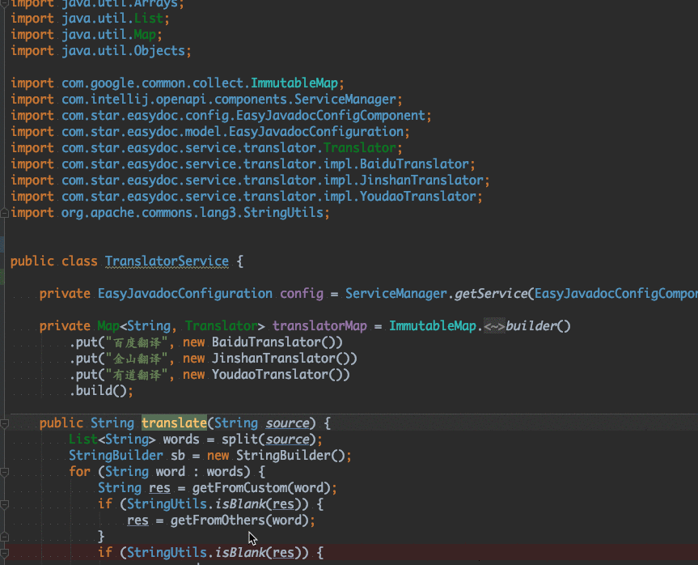

# easy_javadoc 点一下star✨，是对作者最大的支持 
# 交流Q群：733688083
## 介绍
本项目是IntelliJ IDEA的插件，能帮助java开发者自动生成javadoc文档注释  
**支持的IDEA版本为 2018.1 及以上**    

  
支持给中文起名字，类似程序员起名神器  

- 接入有道、百度、腾讯等翻译，只要你方法名起的好，翻译就越准确
- 可自定义映射，弥补自动翻译的不足
- 支持文档翻译，选中需要翻译的文档，使用快捷键翻译注释，再也不用在词典和IDEA之间来回切换了

## 安装
打开IntelliJ IDEA -> plugin，搜索 Easy Javadoc，安装重启即可

## 配置
打开配置页面

可看到相关配置

## 使用
- **将光标放置到想要生成注释的类、方法或者属性上**，然后按下快捷键`ctrl \`或者`command \`，即可生成注释，你的方法名起的越贴切，注释越得体。  
- **将光标放置到想要生成注释的类上**，然后按下快捷键`ctrl shift \`或者`command shift \`，即可批量生成文档注释。
- **光标选中要翻译的中文**，然后按下快捷键`ctrl \`或者`command \`，即可自动变成英文，类似程序员起名神器。
- **光标选中要翻译的非中文**，然后按下快捷键`ctrl \`或者`command \`，即弹出选中的翻译结果，再也不用在词典和IDEA之间来回切换了。
- **单行注释**需要打开如下开关
  

当然，翻译不准的情况很常见，如果是因为单词翻译错误，可以在配置页面对自己的单词进行配置，自定义翻译的优先级大于其他。

腾讯和百度翻译都可以**免费**使用，需要自己申请相关APP_ID
- 百度翻译申请地址：<https://api.fanyi.baidu.com/doc/21>
- 腾讯翻译申请地址：<https://cloud.tencent.com/document/product/551/7372>

## 默认快捷键（可通过IDEA快捷键设置修改）
### win
|快捷键|作用域|说明|
| --- | --- | --- |
| `ctrl \` | 类、方法、属性（光标放上面就行，不要双击选中！） | 生成当前文档注释 |
| `ctrl \` | **选中的**中文 | 生成选中的中文的英文命名 |
| `ctrl \` | **选中的**非中文 | 弹框展示翻译结果 |
| `ctrl shift \` | 类 | 生成全部文档注释 |

### mac
|快捷键|作用域|说明|
| --- | --- | --- |
| `command \` | 类、方法、属性（光标放上面就行，不要双击选中！） | 生成当前文档注释 |
| `command \` | **选中的**中文 | 生成选中的中文的英文命名 |
| `command \` | **选中的**非中文 | 弹框展示翻译结果 |
| `command shift \` | 类 | 生成全部文档注释 |

## 更新履历
- v1.19 2021-07-03
  - 修复了自定义模式下@return问题
- v1.18 2021-05-31
  - 支持整句的自定义映射
- v1.17 2021-05-16
  - 支持自定义模式下，注释和方法不覆盖已有值
- v1.16 2020-12-28
    - 修复了@throws标签不换行的问题
- v1.15 2020-12-13
    - 修复了自定义模板，类、方法、属性不能单独配置的问题
- v1.13 2020-08-29
    - 支持百度翻译和腾讯翻译，用户自定义秘钥
    - 为翻译添加缓存
    - 增加重置和清理缓存按钮
- v1.12 2020-06-20
    - 修复了光标位置不对生成文档报空指针的问题
- v1.11 2020-04-09
    - 修复了某些情况下自定义翻译失效的问题
- v1.10 2020-02-12
    - 添加选中翻译功能
    - 修复bug
- v1.9 2019-12-30
    - 修复了在windows下的异常
- v1.8 2019-12-14
    - 支持配置导入和导出
    - 支持更多的IDEA版本
- v1.7 2019-12-11
    - return使用短路径
    - 修复bug
- v1.6 2019-12-08
    - 支持自定义格式文档
    - 支持中译英（命名神器）
    - 修复bug
- v1.5 2019-11-30
    - 兼容问题处理
    - 支持更多IDEA版本
    - 修复了一些bug
- v1.4 2019-11-25
    - 兼容自己的注释
    - 支持整句翻译
    - 方法支持@throws标签
    - 修复bug
- v1.3 2019-11-13
    - 支持批量生成文档注释
    - 修复bug
- v1.2 2019-10-24
    - 修复bug
- v1.1 2019-10-23
    - 支持@link和@return标签
    - 修复bug
- v1.0 2019-09-05
    - 第一版发布

## 致谢
- [@kings1990](https://github.com/kings1990)
    
## 支持作者
如果觉得插件很赞，为你节约了不少时间，那么就请作者喝杯咖啡吧~☕☕☕

|  |  |
| --- | --- |

