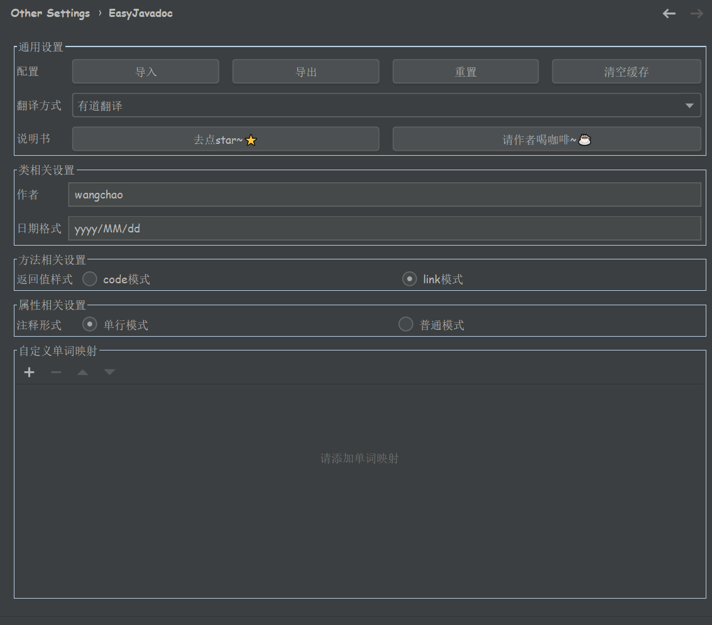
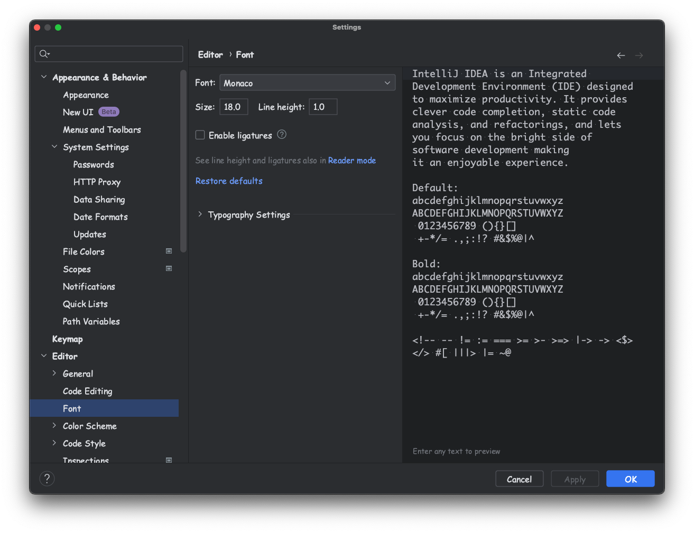

# easy_doc 点一下star✨，是对作者最大的支持 
# 目前免费的【有道翻译】已被官方禁用，请大家更换别的翻译方式，各大平台都免费
# 交流Q群：733688083
## 介绍
本项目是IntelliJ IDEA的插件，能帮助java\kotlin开发者自动生成javadoc\kdoc文档注释  
**支持的IDEA版本为 2018.1 及以上**    
即将不支持2018、2019版本    

  
支持给中文起名字，类似程序员起名神器  

- 接入多种翻译，只要你方法名起的好，翻译就越准确
- 可自定义映射，弥补自动翻译的不足
- 支持文档翻译，选中需要翻译的文档，使用快捷键翻译注释，再也不用在词典和IDEA之间来回切换了

## 安装
打开IntelliJ IDEA -> plugins，java搜索`Easy Javadoc`，安装重启即可

## 使用
简单视频教学：[👉猛戳👈](https://www.bilibili.com/video/BV1pB4y147nX)，感谢[郑清](https://space.bilibili.com/510086367)同学支持      
结合Fast Request的视频教程，[👉猛戳👈](https://www.bilibili.com/video/BV1xg41127TF/)

- 将**一闪一闪的光标**放置到想要生成注释的类、方法或者属性上，然后按下快捷键`ctrl \`或者`command \`，即可生成注释，你的方法名起的越贴切，注释越得体。  
- 将**一闪一闪的光标**放置到想要生成注释的类上，然后按下快捷键`ctrl shift \`或者`command shift \`，即可批量生成文档注释。（Kdoc暂不支持）
- **光标选中**要翻译的中文，然后按下快捷键`ctrl \`或者`command \`，即可自动变成英文，类似程序员起名神器。
- **光标选中**要翻译的非中文，然后按下快捷键`ctrl \`或者`command \`，即弹出选中的翻译结果，再也不用在词典和IDEA之间来回切换了。
- 方法的@return注释样例
  - code模式
    - `@return {@code User}`
    - `@return {@code Map<String, Integer>}`
  - link模式
    - `@return {@link User}`
    - `@return {@link Map}<{@link String}, {@link Integer}>`

当然，翻译不准的情况很常见，如果是因为单词翻译错误，可以在配置页面对自己的单词进行配置，自定义翻译的优先级大于其他。

各个翻译每月都有**免费**额度，基本够用了。需要自己申请相关秘钥等
- 百度翻译申请地址：<https://api.fanyi.baidu.com/doc/21>
- 腾讯翻译申请地址：<https://cloud.tencent.com/document/product/551/7372>
- 阿里云翻译申请地址：<https://www.aliyun.com/product/ai/alimt>
- 有道智云翻译申请地址：<https://ai.youdao.com/>
- 微软翻译申请地址：<https://azure.microsoft.com/>
- 谷歌翻译（需要翻墙）申请地址：<https://cloud.google.com/>

## 配置
打开配置页面

可看到相关配置

## 默认快捷键（可通过IDEA快捷键设置修改）
### win
|快捷键|作用域|说明|
| --- | --- | --- |
| `ctrl \` | 类、方法、属性（光标放上面就行，不要双击选中！） | 生成当前文档注释 |
| `ctrl \` | **选中的**中文 | 生成选中的中文的英文命名 |
| `ctrl \` | **选中的**非中文 | 弹框展示翻译结果 |
| `ctrl shift \` | 类 | 生成全部文档注释 |

### mac
|快捷键|作用域|说明|
| --- | --- | --- |
| `command \` | 类、方法、属性（光标放上面就行，不要双击选中！） | 生成当前文档注释 |
| `command \` | **选中的**中文 | 生成选中的中文的英文命名 |
| `command \` | **选中的**非中文 | 弹框展示翻译结果 |
| `command shift \` | 类 | 生成全部文档注释 |

## 常见问题
### 我的字体
#### 系统字体 `Comis Sans MS` 

#### 代码字体 `Monaco` 

### 快捷键( `ctrl \` )不生效
检查：
1. 将**一闪一闪的光标**放到类名、方法名或属性名上试试，注意不是选中，也不是鼠标！！！
2. 检查IDEA的快捷键是否冲突了
### 属性单行注释不生效
这是因为IDEA的默认格式化将单行转成了多行，需要更改IDEA的格式化设置
### 文档标签@param、@link或者自定义的顺序不对
这是因为IDEA的默认格式化将文档标签顺序改了，如果非得要自定义的顺序的话，则需要改IDEA如下设置

## 更新履历
- v3.6.0 2023-09-14
  - 支持微软免费翻译
- v3.5.3 2023-09-13
  - 修复阿里云不兼容社区版问题
- v3.5.2 2023-09-08
  - 修复阿里云中译英失败问题
- v3.5.1 2023-09-06
  - 打印异常日志
  - 禁用掉免费有道接口
- v3.5.0 2023-09-02
  - 异常支持读取已有类注释
  - 返回值支持读取已有类注释
  - 修复jdk问题导致的日期格式化结果不一致问题
- v3.4.3 2023-08-09
  - 修复默认模板出现空行的问题
- v3.4.2 2023-08-06
  - javadoc自定义模式支持结尾添加换行
  - 优化选中后的英译中切词翻译
- v3.4.1 2023-07-31
  - 规范化displayName命名
- v3.4.0 2023-06-24
  - 支持单词分割模式
  - 升级IDEA最小支持版本为2019
  - 修复package-info.java空指针问题
  - 修复多项目时当前分支名变量获取不到的问题
- v3.3.1 2023-05-09
  - 修复类全路径问题
  - 自定义变量添加当前分支名变量
  - 控制弹窗频次，现在为新打开时弹窗
- v3.3.0 2023-04-08
  - 支持微软翻译
  - 支持谷歌翻译
- v3.2.0 2023-01-17
  - 支持有道智云翻译
- v3.1.0 2022-12-24
  - 支持项目级单词映射
- v3.0.1 2022-12-17
  - 修复kdoc空行问题
- v3.0.0 2022-12-11
  - 支持kotlin语言，Kdoc生成
- v2.0.1 2022-11-30
  - 修复一些问题
- v2.0.0 2022-11-19
  - 重构
  - 支持kotlin
- v1.29 2022-11-06
  - 优化一些问题
- v1.28 2022-10-15
  - 优化导入导出文件(夹)选择界面
  - 优化一些问题
- v1.27 2022-09-10
  - 支持阿里云翻译
  - 支持在方法上自定义see标签
  - 修复导入导出功能bug
  - 优化一些问题
- v1.26 2022-07-13
  - 支持 `package-info.java`
- v1.25 2022-03-18
  - 修复自定义方法返回值无法切换@code模式
- v1.24 2022-03-16
  - 优化提醒弹出频率
- v1.23 2022-03-13
  - 添加logo
  - 添加应用启动监听器
- v1.22 2021-12-21
  - 记录上次选择的生成所有javadoc的选项
- v1.21 2021-08-07
  - 方法的@return支持code和link两种模式
    - code模式
      - `@return {@code User}`
      - `@return {@code Map<String, Integer>}`
    - link模式
      - `@return {@link User}`
      - `@return {@link Map}<{@link String}, {@link Integer}>`
  - 优化了访问网络失败的提示
- v1.20 2021-07-11
  - 修复了自定义模式下$PARAM$字段\*丢失问题
- v1.19 2021-07-03
  - 修复了自定义模式下@return问题
- v1.18 2021-05-31
  - 支持整句的自定义映射
- v1.17 2021-05-16
  - 支持自定义模式下，注释和方法不覆盖已有值
- v1.16 2020-12-28
    - 修复了@throws标签不换行的问题
- v1.15 2020-12-13
    - 修复了自定义模板，类、方法、属性不能单独配置的问题
- v1.13 2020-08-29
    - 支持百度翻译和腾讯翻译，用户自定义秘钥
    - 为翻译添加缓存
    - 增加重置和清理缓存按钮
- v1.12 2020-06-20
    - 修复了光标位置不对生成文档报空指针的问题
- v1.11 2020-04-09
    - 修复了某些情况下自定义翻译失效的问题
- v1.10 2020-02-12
    - 添加选中翻译功能
    - 修复bug
- v1.9 2019-12-30
    - 修复了在windows下的异常
- v1.8 2019-12-14
    - 支持配置导入和导出
    - 支持更多的IDEA版本
- v1.7 2019-12-11
    - return使用短路径
    - 修复bug
- v1.6 2019-12-08
    - 支持自定义格式文档
    - 支持中译英（命名神器）
    - 修复bug
- v1.5 2019-11-30
    - 兼容问题处理
    - 支持更多IDEA版本
    - 修复了一些bug
- v1.4 2019-11-25
    - 兼容自己的注释
    - 支持整句翻译
    - 方法支持@throws标签
    - 修复bug
- v1.3 2019-11-13
    - 支持批量生成文档注释
    - 修复bug
- v1.2 2019-10-24
    - 修复bug
- v1.1 2019-10-23
    - 支持@link和@return标签
    - 修复bug
- v1.0 2019-09-05
    - 第一版发布

## 贡献者
- [@kings1990](https://github.com/kings1990)
- [@mixley](https://github.com/mixley)
- [@kuolemax](https://github.com/kuolemax)
    
## 支持作者
如果觉得插件很赞，为你节约了不少时间，那么就请作者喝杯咖啡吧~☕☕☕

|  |  |
| --- | --- |

