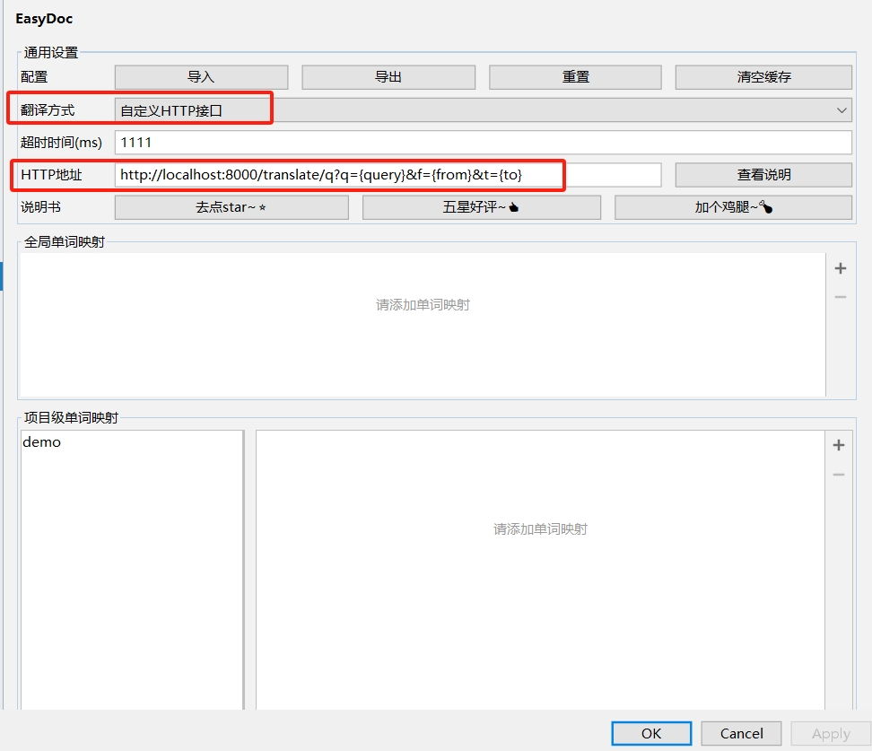

# 自定义接口说明
## 接口说明
使用自定义的http(s)接口，可以自己实现翻译接口，方便在内网使用

## 如何启用
在设置页面中，翻译方式选择*自定义HTTP接口*，HTTP地址填写自定义地址，如下图：


## 请求参数
- 请求方式：GET
- 占位符说明

| 符号      | 说明      | 示例                                        |
|---------|---------|-------------------------------------------|
| {query} | 需要翻译的文本 | 你好                                        |
| {from}  | 源语言     | ch或者en                                    |
| {to}    | 目标语言    | ch或者en                                    |
| {type}     | 翻译请求类型  | 取值: class、method、field、default， 默认default |

例如配置：`http://localhost:8080/translate?query={query}&from={from}&to={to}&type={type}`
则会发送请求`http://localhost:8080/translate?query=你好&from=ch&to=en&type=class` 到目标服务器

## 返回格式
返回格式为json，示例如下：
```json
{
  "code": 0,
  "data": "hello"
}
```
- code：0表示成功，其他表示失败
- 如果请求失败或者返回code非0，则会报错打印日志，不会翻译

## 配置样例
- http://localhost:8080/translate?query={query}&from={from}&to={to}&type={type}
- http://custom.com/t?q={query}&f={from}&t={to}&s=idea
- https://192.168.10.33:8080/translate?text={query}&f={from}&t={to}
