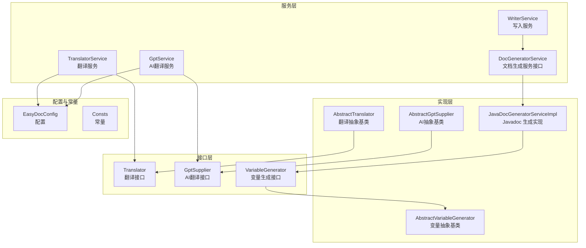
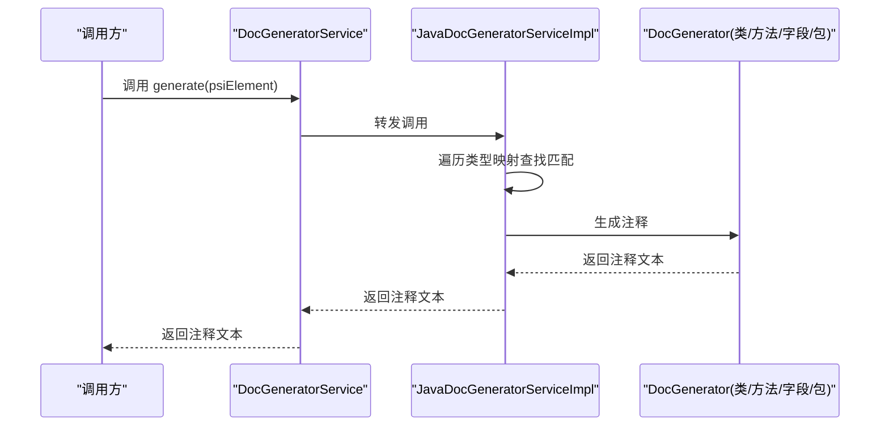
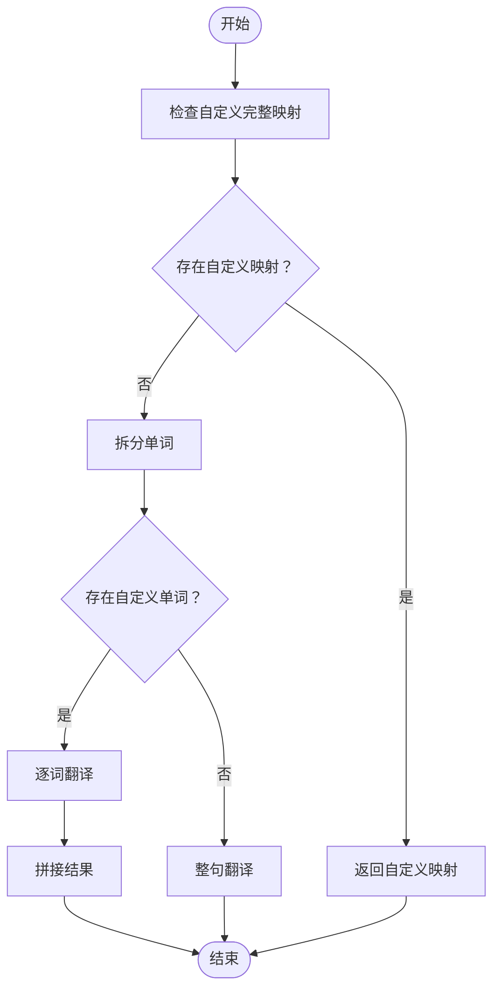
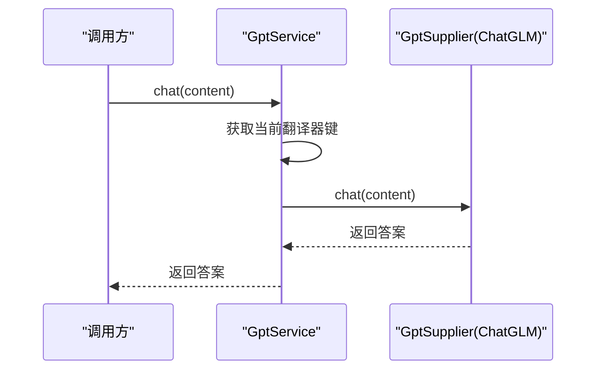
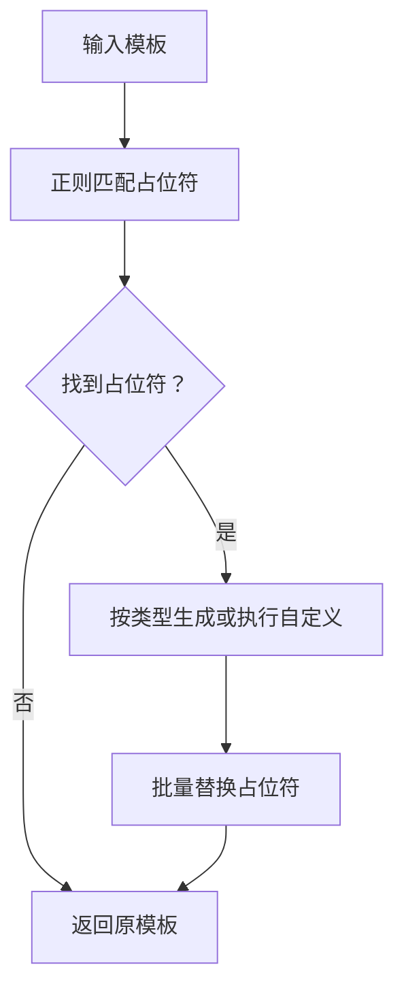
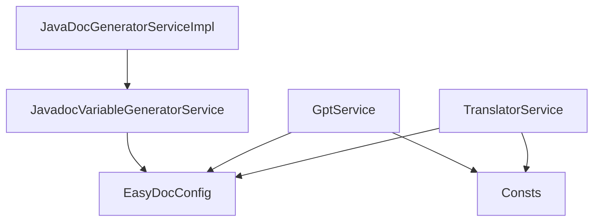

# API 参考

<cite>
**本文引用的文件**
- [DocGeneratorService.java](file://src/main/java/com/star/easydoc/service/DocGeneratorService.java)
- [JavaDocGeneratorServiceImpl.java](file://src/main/java/com/star/easydoc/javadoc/service/JavaDocGeneratorServiceImpl.java)
- [Translator.java](file://src/main/java/com/star/easydoc/service/translator/Translator.java)
- [TranslatorService.java](file://src/main/java/com/star/easydoc/service/translator/TranslatorService.java)
- [AbstractTranslator.java](file://src/main/java/com/star/easydoc/service/translator/impl/AbstractTranslator.java)
- [GptSupplier.java](file://src/main/java/com/star/easydoc/service/gpt/GptSupplier.java)
- [GptService.java](file://src/main/java/com/star/easydoc/service/gpt/GptService.java)
- [AbstractGptSupplier.java](file://src/main/java/com/star/easydoc/service/gpt/impl/AbstractGptSupplier.java)
- [VariableGenerator.java](file://src/main/java/com/star/easydoc/javadoc/service/variable/VariableGenerator.java)
- [JavadocVariableGeneratorService.java](file://src/main/java/com/star/easydoc/javadoc/service/variable/JavadocVariableGeneratorService.java)
- [AbstractVariableGenerator.java](file://src/main/java/com/star/easydoc/javadoc/service/variable/impl/AbstractVariableGenerator.java)
- [EasyDocConfig.java](file://src/main/java/com/star/easydoc/config/EasyDocConfig.java)
- [Consts.java](file://src/main/java/com/star/easydoc/common/Consts.java)
- [WriterService.java](file://src/main/java/com/star/easydoc/service/WriterService.java)
</cite>

## 目录
1. [简介](#简介)
2. [项目结构](#项目结构)
3. [核心组件](#核心组件)
4. [架构总览](#架构总览)
5. [详细组件分析](#详细组件分析)
6. [依赖分析](#依赖分析)
7. [性能考虑](#性能考虑)
8. [故障排查指南](#故障排查指南)
9. [结论](#结论)
10. [附录](#附录)

## 简介
本文件为 Easy Javadoc 插件的完整 API 参考，聚焦于以下公共接口与服务：
- 文档生成服务：DocGeneratorService 及其实现 JavaDocGeneratorServiceImpl
- 翻译服务：Translator 接口、TranslatorService 服务类及抽象基类 AbstractTranslator
- AI 翻译接口：GptSupplier 接口、GptService 服务类及抽象基类 AbstractGptSupplier
- 变量生成接口：VariableGenerator 接口、JavadocVariableGeneratorService 服务类及抽象基类 AbstractVariableGenerator
- 配置与常量：EasyDocConfig、Consts
- 写入服务：WriterService

文档提供各接口的方法签名、参数说明、返回值描述、调用约定、异常处理机制与性能考量，并通过类图与序列图展示接口关系与典型使用流程。

## 项目结构
插件采用分层与职责分离设计：
- service 层：对外暴露服务接口（如 DocGeneratorService、TranslatorService、GptService）
- service/impl 层：具体实现（如 JavaDocGeneratorServiceImpl、AbstractTranslator、AbstractGptSupplier）
- javadoc/service/variable：Javadoc 变量占位符解析与生成
- config：全局配置 EasyDocConfig
- common：常量 Consts
- service/WriterService：统一写入逻辑（Javadoc/KDoc）

图表来源
- [DocGeneratorService.java:11-20](file://src/main/java/com/star/easydoc/service/DocGeneratorService.java#L11-L20)
- [JavaDocGeneratorServiceImpl.java:25-49](file://src/main/java/com/star/easydoc/javadoc/service/JavaDocGeneratorServiceImpl.java#L25-L49)
- [TranslatorService.java:41-77](file://src/main/java/com/star/easydoc/service/translator/TranslatorService.java#L41-L77)
- [GptService.java:16-56](file://src/main/java/com/star/easydoc/service/gpt/GptService.java#L16-L56)
- [VariableGenerator.java:12-27](file://src/main/java/com/star/easydoc/javadoc/service/variable/VariableGenerator.java#L12-L27)
- [JavadocVariableGeneratorService.java:35-92](file://src/main/java/com/star/easydoc/javadoc/service/variable/JavadocVariableGeneratorService.java#L35-L92)
- [EasyDocConfig.java:22-680](file://src/main/java/com/star/easydoc/config/EasyDocConfig.java#L22-L680)
- [Consts.java:14-99](file://src/main/java/com/star/easydoc/common/Consts.java#L14-L99)
- [WriterService.java:25-139](file://src/main/java/com/star/easydoc/service/WriterService.java#L25-L139)

章节来源
- [DocGeneratorService.java:11-20](file://src/main/java/com/star/easydoc/service/DocGeneratorService.java#L11-L20)
- [JavaDocGeneratorServiceImpl.java:25-49](file://src/main/java/com/star/easydoc/javadoc/service/JavaDocGeneratorServiceImpl.java#L25-L49)
- [TranslatorService.java:41-77](file://src/main/java/com/star/easydoc/service/translator/TranslatorService.java#L41-L77)
- [GptService.java:16-56](file://src/main/java/com/star/easydoc/service/gpt/GptService.java#L16-L56)
- [JavadocVariableGeneratorService.java:35-92](file://src/main/java/com/star/easydoc/javadoc/service/variable/JavadocVariableGeneratorService.java#L35-L92)
- [EasyDocConfig.java:22-680](file://src/main/java/com/star/easydoc/config/EasyDocConfig.java#L22-L680)
- [Consts.java:14-99](file://src/main/java/com/star/easydoc/common/Consts.java#L14-L99)
- [WriterService.java:25-139](file://src/main/java/com/star/easydoc/service/WriterService.java#L25-L139)

## 核心组件
本节对关键接口与服务进行概览性说明，后续章节将深入到类图与序列图。

- DocGeneratorService：面向 PSI 元素的文档生成入口，返回生成的注释文本。
- JavaDocGeneratorServiceImpl：按 PSI 类型选择对应 DocGenerator 实现，完成具体生成。
- Translator：统一翻译接口，支持英译中、中译英、初始化与缓存清理。
- TranslatorService：聚合多翻译器，负责策略选择、自定义词典、整句/逐词翻译策略、类注释优先策略。
- GptSupplier：AI 翻译接口，提供 chat、init、getConfig。
- GptService：AI 翻译服务，负责注册与路由到具体 GptSupplier 实现。
- VariableGenerator：Javadoc 变量占位符生成接口，支持生成与获取配置。
- JavadocVariableGeneratorService：变量生成服务，内置占位符映射与自定义 Groovy 执行。
- WriterService：统一写入逻辑，支持 Java 与 Kotlin 的注释写入与格式化。

章节来源
- [DocGeneratorService.java:11-20](file://src/main/java/com/star/easydoc/service/DocGeneratorService.java#L11-L20)
- [JavaDocGeneratorServiceImpl.java:25-49](file://src/main/java/com/star/easydoc/javadoc/service/JavaDocGeneratorServiceImpl.java#L25-L49)
- [Translator.java:13-53](file://src/main/java/com/star/easydoc/service/translator/Translator.java#L13-L53)
- [TranslatorService.java:41-238](file://src/main/java/com/star/easydoc/service/translator/TranslatorService.java#L41-L238)
- [GptSupplier.java:9-34](file://src/main/java/com/star/easydoc/service/gpt/GptSupplier.java#L9-L34)
- [GptService.java:16-56](file://src/main/java/com/star/easydoc/service/gpt/GptService.java#L16-L56)
- [VariableGenerator.java:12-27](file://src/main/java/com/star/easydoc/javadoc/service/variable/VariableGenerator.java#L12-L27)
- [JavadocVariableGeneratorService.java:35-128](file://src/main/java/com/star/easydoc/javadoc/service/variable/JavadocVariableGeneratorService.java#L35-L128)
- [WriterService.java:25-139](file://src/main/java/com/star/easydoc/service/WriterService.java#L25-L139)

## 架构总览
下图展示接口与实现之间的关系，以及服务间的协作：

```mermaid
classDiagram
class DocGeneratorService {
+generate(psiElement) String
}
class JavaDocGeneratorServiceImpl {
+generate(psiElement) String
}
class Translator {
+en2Ch(text, psiElement) String
+ch2En(text, psiElement) String
+init(config) Translator
+getConfig() EasyDocConfig
+clearCache() void
}
class AbstractTranslator {
+en2Ch(text, psiElement) String
+ch2En(text, psiElement) String
+init(config) Translator
+getConfig() EasyDocConfig
+clearCache() void
}
class TranslatorService {
+init(config) void
+translate(source, psiElement) String
+translateWithClass(source, className, project, element) String
+autoTranslate(source, psiElement) String
+translateCh2En(source, psiElement) String
+clearCache() void
}
class GptSupplier {
+chat(content) String
+init(config) GptSupplier
+getConfig() EasyDocConfig
}
class AbstractGptSupplier {
+init(config) GptSupplier
+getConfig() EasyDocConfig
}
class GptService {
+init(config) void
+chat(content) String
}
class VariableGenerator {
+generate(element) String
+getConfig() EasyDocConfig
}
class AbstractVariableGenerator {
+getConfig() EasyDocConfig
}
class JavadocVariableGeneratorService {
+generate(psiElement, template, customValueMap, innerVariableMap) String
}
class WriterService {
+writeJavadoc(project, psiElement, comment, emptyLineNum) void
+write(project, editor, text) void
+writeKdoc(project, ktElement, comment) void
}
class EasyDocConfig
class Consts
JavaDocGeneratorServiceImpl ..|> DocGeneratorService
AbstractTranslator ..|> Translator
AbstractGptSupplier ..|> GptSupplier
AbstractVariableGenerator ..|> VariableGenerator
TranslatorService --> Translator : "组合"
GptService --> GptSupplier : "组合"
JavadocVariableGeneratorService --> VariableGenerator : "组合"
JavaDocGeneratorServiceImpl --> VariableGenerator : "使用"
WriterService --> DocGeneratorService : "写入"
TranslatorService --> EasyDocConfig : "依赖"
GptService --> EasyDocConfig : "依赖"
JavadocVariableGeneratorService --> EasyDocConfig : "依赖"
Consts <.. TranslatorService : "常量"
Consts <.. GptService : "常量"
```

图表来源
- [DocGeneratorService.java:11-20](file://src/main/java/com/star/easydoc/service/DocGeneratorService.java#L11-L20)
- [JavaDocGeneratorServiceImpl.java:25-49](file://src/main/java/com/star/easydoc/javadoc/service/JavaDocGeneratorServiceImpl.java#L25-L49)
- [Translator.java:13-53](file://src/main/java/com/star/easydoc/service/translator/Translator.java#L13-L53)
- [AbstractTranslator.java:14-91](file://src/main/java/com/star/easydoc/service/translator/impl/AbstractTranslator.java#L14-L91)
- [TranslatorService.java:41-238](file://src/main/java/com/star/easydoc/service/translator/TranslatorService.java#L41-L238)
- [GptSupplier.java:9-34](file://src/main/java/com/star/easydoc/service/gpt/GptSupplier.java#L9-L34)
- [AbstractGptSupplier.java:10-25](file://src/main/java/com/star/easydoc/service/gpt/impl/AbstractGptSupplier.java#L10-L25)
- [GptService.java:16-56](file://src/main/java/com/star/easydoc/service/gpt/GptService.java#L16-L56)
- [VariableGenerator.java:12-27](file://src/main/java/com/star/easydoc/javadoc/service/variable/VariableGenerator.java#L12-L27)
- [AbstractVariableGenerator.java:14-20](file://src/main/java/com/star/easydoc/javadoc/service/variable/impl/AbstractVariableGenerator.java#L14-L20)
- [JavadocVariableGeneratorService.java:35-128](file://src/main/java/com/star/easydoc/javadoc/service/variable/JavadocVariableGeneratorService.java#L35-L128)
- [WriterService.java:25-139](file://src/main/java/com/star/easydoc/service/WriterService.java#L25-L139)
- [EasyDocConfig.java:22-680](file://src/main/java/com/star/easydoc/config/EasyDocConfig.java#L22-L680)
- [Consts.java:14-99](file://src/main/java/com/star/easydoc/common/Consts.java#L14-L99)

## 详细组件分析

### 文档生成服务：DocGeneratorService 与 JavaDocGeneratorServiceImpl
- 接口职责
  - DocGeneratorService：面向 PSI 元素的统一文档生成入口，返回生成的注释文本。
- 实现要点
  - JavaDocGeneratorServiceImpl：根据 PSI 类型映射到具体 DocGenerator 实现（类、方法、字段、包信息），若无匹配则返回空字符串。
- 调用约定
  - 输入：必须为非空 PSI 元素；实现内部会遍历类型映射并委托给对应生成器。
  - 返回：生成的注释文本；若不支持该类型，返回空字符串。
- 异常处理
  - 实现未显式抛出异常；若传入非法元素或无匹配生成器，返回空字符串。
- 性能考虑
  - 类型匹配为线性扫描，建议在上层确保传入正确的 PSI 类型以减少无效匹配。
- 使用示例路径
  - [generate 调用点:35-48](file://src/main/java/com/star/easydoc/javadoc/service/JavaDocGeneratorServiceImpl.java#L35-L48)

图表来源
- [DocGeneratorService.java:11-20](file://src/main/java/com/star/easydoc/service/DocGeneratorService.java#L11-L20)
- [JavaDocGeneratorServiceImpl.java:25-49](file://src/main/java/com/star/easydoc/javadoc/service/JavaDocGeneratorServiceImpl.java#L25-L49)

章节来源
- [DocGeneratorService.java:11-20](file://src/main/java/com/star/easydoc/service/DocGeneratorService.java#L11-L20)
- [JavaDocGeneratorServiceImpl.java:25-49](file://src/main/java/com/star/easydoc/javadoc/service/JavaDocGeneratorServiceImpl.java#L25-L49)

### 翻译服务：Translator、AbstractTranslator 与 TranslatorService
- 接口职责
  - Translator：提供英译中、中译英、初始化、获取配置、清除缓存。
- 抽象基类
  - AbstractTranslator：实现缓存（并发安全）、初始化与配置获取；子类需实现具体翻译逻辑。
- 服务类
  - TranslatorService：集中管理多种翻译器，提供整句/逐词策略、自定义词典、类注释优先策略、自动翻译与中译英优化。
- 调用约定
  - 翻译方法接收源文本与 PSI 元素上下文；整句翻译优先于逐词翻译，若存在自定义词典则优先使用自定义映射。
  - translateCh2En 对结果进行停用词过滤与大小写规范化。
- 异常处理
  - 未捕获异常；若翻译器为空或返回空，返回空字符串。
- 性能考虑
  - 内置并发安全缓存，避免重复翻译；整句翻译通常更准确但可能触发网络请求，建议合理设置超时。
- 使用示例路径
  - [整句翻译策略:85-111](file://src/main/java/com/star/easydoc/service/translator/TranslatorService.java#L85-L111)
  - [逐词翻译策略:92-110](file://src/main/java/com/star/easydoc/service/translator/TranslatorService.java#L92-L110)
  - [类注释优先策略:119-148](file://src/main/java/com/star/easydoc/service/translator/TranslatorService.java#L119-L148)

图表来源
- [TranslatorService.java:85-111](file://src/main/java/com/star/easydoc/service/translator/TranslatorService.java#L85-L111)

章节来源
- [Translator.java:13-53](file://src/main/java/com/star/easydoc/service/translator/Translator.java#L13-L53)
- [AbstractTranslator.java:14-91](file://src/main/java/com/star/easydoc/service/translator/impl/AbstractTranslator.java#L14-L91)
- [TranslatorService.java:41-238](file://src/main/java/com/star/easydoc/service/translator/TranslatorService.java#L41-L238)

### AI 翻译接口：GptSupplier、AbstractGptSupplier 与 GptService
- 接口职责
  - GptSupplier：提供 chat、init、getConfig。
- 抽象基类
  - AbstractGptSupplier：封装配置注入与获取。
- 服务类
  - GptService：注册可用 AI 翻译器（如 ChatGLM），按配置路由到具体实现；线程安全初始化。
- 调用约定
  - chat 接收问题内容，返回答案；若未找到对应翻译器，返回空字符串。
- 异常处理
  - 未捕获异常；若翻译器为空，返回空字符串。
- 性能考虑
  - 初始化采用双重检查锁与不可变映射，避免重复初始化与并发问题。
- 使用示例路径
  - [初始化与路由:27-54](file://src/main/java/com/star/easydoc/service/gpt/GptService.java#L27-L54)

图表来源
- [GptSupplier.java:9-34](file://src/main/java/com/star/easydoc/service/gpt/GptSupplier.java#L9-L34)
- [AbstractGptSupplier.java:10-25](file://src/main/java/com/star/easydoc/service/gpt/impl/AbstractGptSupplier.java#L10-L25)
- [GptService.java:16-56](file://src/main/java/com/star/easydoc/service/gpt/GptService.java#L16-L56)

章节来源
- [GptSupplier.java:9-34](file://src/main/java/com/star/easydoc/service/gpt/GptSupplier.java#L9-L34)
- [AbstractGptSupplier.java:10-25](file://src/main/java/com/star/easydoc/service/gpt/impl/AbstractGptSupplier.java#L10-L25)
- [GptService.java:16-56](file://src/main/java/com/star/easydoc/service/gpt/GptService.java#L16-L56)

### 变量生成接口：VariableGenerator、AbstractVariableGenerator 与 JavadocVariableGeneratorService
- 接口职责
  - VariableGenerator：生成占位符对应的值，获取配置。
- 抽象基类
  - AbstractVariableGenerator：从 EasyDocConfigComponent 获取配置状态。
- 服务类
  - JavadocVariableGeneratorService：内置占位符映射（author/date/doc/params/return/see/since/throws/version），支持自定义值（字符串或 Groovy 脚本），并进行占位符替换。
- 调用约定
  - generate 接收 PSI 元素、模板、自定义值映射与内部变量映射；返回替换后的模板文本。
  - 自定义 Groovy 执行失败时记录日志并回退为原始值。
- 异常处理
  - Groovy 执行异常被捕获并记录错误日志，避免中断整体流程。
- 性能考虑
  - 占位符匹配使用正则与预构建映射，复杂度与模板长度线性相关；Groovy 执行为可选且受限。
- 使用示例路径
  - [占位符匹配与替换:60-92](file://src/main/java/com/star/easydoc/javadoc/service/variable/JavadocVariableGeneratorService.java#L60-L92)
  - [自定义变量执行:102-125](file://src/main/java/com/star/easydoc/javadoc/service/variable/JavadocVariableGeneratorService.java#L102-L125)

图表来源
- [JavadocVariableGeneratorService.java:35-128](file://src/main/java/com/star/easydoc/javadoc/service/variable/JavadocVariableGeneratorService.java#L35-L128)

章节来源
- [VariableGenerator.java:12-27](file://src/main/java/com/star/easydoc/javadoc/service/variable/VariableGenerator.java#L12-L27)
- [AbstractVariableGenerator.java:14-20](file://src/main/java/com/star/easydoc/javadoc/service/variable/impl/AbstractVariableGenerator.java#L14-L20)
- [JavadocVariableGeneratorService.java:35-128](file://src/main/java/com/star/easydoc/javadoc/service/variable/JavadocVariableGeneratorService.java#L35-L128)

### 写入服务：WriterService
- 职责
  - 统一写入逻辑：Javadoc 注释写入、KDoc 注释写入、编辑器文本写入；并进行格式化与空行控制。
- 调用约定
  - writeJavadoc：在 PSI 元素处写入注释，必要时替换已有注释；随后格式化并调整空行数。
  - write：在编辑器光标处插入文本并选中文本。
  - writeKdoc：在 Kotlin 元素处写入 KDoc 并格式化。
- 异常处理
  - 使用写命令包装，异常被捕获并记录日志。
- 性能考虑
  - 写入操作在写命令作用域内执行，避免 UI 阻塞；格式化为轻量文本重排。
- 使用示例路径
  - [Javadoc 写入:36-75](file://src/main/java/com/star/easydoc/service/WriterService.java#L36-L75)
  - [编辑器写入:84-98](file://src/main/java/com/star/easydoc/service/WriterService.java#L84-L98)
  - [KDoc 写入:107-136](file://src/main/java/com/star/easydoc/service/WriterService.java#L107-L136)

章节来源
- [WriterService.java:25-139](file://src/main/java/com/star/easydoc/service/WriterService.java#L25-L139)

## 依赖分析
- 配置与常量
  - EasyDocConfig 提供翻译器键、超时、模板配置、自定义词典等；Consts 定义可用翻译器集合与 AI 翻译集合。
- 服务耦合
  - TranslatorService 与 GptService 依赖 EasyDocConfig 获取当前翻译器键；GptService 注册 ChatGLM 实现。
  - JavaDocGeneratorServiceImpl 依赖 DocGenerator 实现与 VariableGenerator 服务。
  - JavadocVariableGeneratorService 依赖 EasyDocConfig 的自定义值与 Groovy 执行环境。
- 外部依赖
  - Guava 不可变映射用于线程安全初始化；Apache Commons Lang 用于字符串与集合工具；IntelliJ PSI 用于注释与元素处理。

图表来源
- [EasyDocConfig.java:22-680](file://src/main/java/com/star/easydoc/config/EasyDocConfig.java#L22-L680)
- [Consts.java:14-99](file://src/main/java/com/star/easydoc/common/Consts.java#L14-L99)
- [TranslatorService.java:41-238](file://src/main/java/com/star/easydoc/service/translator/TranslatorService.java#L41-L238)
- [GptService.java:16-56](file://src/main/java/com/star/easydoc/service/gpt/GptService.java#L16-L56)
- [JavadocVariableGeneratorService.java:35-128](file://src/main/java/com/star/easydoc/javadoc/service/variable/JavadocVariableGeneratorService.java#L35-L128)

章节来源
- [EasyDocConfig.java:22-680](file://src/main/java/com/star/easydoc/config/EasyDocConfig.java#L22-L680)
- [Consts.java:14-99](file://src/main/java/com/star/easydoc/common/Consts.java#L14-L99)
- [TranslatorService.java:41-238](file://src/main/java/com/star/easydoc/service/translator/TranslatorService.java#L41-L238)
- [GptService.java:16-56](file://src/main/java/com/star/easydoc/service/gpt/GptService.java#L16-L56)
- [JavadocVariableGeneratorService.java:35-128](file://src/main/java/com/star/easydoc/javadoc/service/variable/JavadocVariableGeneratorService.java#L35-L128)

## 性能考虑
- 缓存策略
  - 翻译器实现内置并发安全缓存，避免重复网络请求；支持手动清理缓存。
- 初始化与并发
  - GptService 与 TranslatorService 采用双重检查锁与不可变映射，避免重复初始化与并发竞争。
- 翻译策略
  - 整句翻译优先于逐词翻译，提升准确性；存在自定义词典时优先使用自定义映射。
- 写入与格式化
  - 写入在写命令作用域内执行，避免阻塞 UI；格式化为局部文本重排，开销较小。
- 可扩展性
  - 新增翻译器或 AI 供应商只需实现相应接口并注册到服务即可，无需修改核心流程。

## 故障排查指南
- 翻译结果为空
  - 检查配置中的翻译器键是否正确；确认 TranslatorService 能够获取到对应实现。
  - 若使用 AI 翻译，确认 GptService 已正确初始化并注册对应供应商。
- 翻译缓存导致旧结果
  - 调用 TranslatorService.clearCache 或 Translator.clearCache 清理缓存后重试。
- 变量生成异常（Groovy）
  - 查看日志输出，检查自定义变量的 Groovy 语法与返回值；必要时降级为字符串类型。
- 写入失败
  - 检查 PSI 元素是否有效、工程上下文是否存在；查看日志中的错误堆栈定位问题。

章节来源
- [TranslatorService.java:234-236](file://src/main/java/com/star/easydoc/service/translator/TranslatorService.java#L234-L236)
- [AbstractTranslator.java:68-72](file://src/main/java/com/star/easydoc/service/translator/impl/AbstractTranslator.java#L68-L72)
- [JavadocVariableGeneratorService.java:115-121](file://src/main/java/com/star/easydoc/javadoc/service/variable/JavadocVariableGeneratorService.java#L115-L121)
- [WriterService.java:72-74](file://src/main/java/com/star/easydoc/service/WriterService.java#L72-L74)

## 结论
本 API 参考系统梳理了 Easy Javadoc 插件的核心接口与服务，明确了各组件的职责边界、调用约定与集成方式。通过统一的服务抽象与可插拔的实现机制，开发者可以便捷地扩展翻译器、AI 供应商与变量生成规则，同时保持良好的性能与稳定性。

## 附录
- 常用常量参考（摘取）
  - 可用翻译器集合、AI 翻译集合、关闭翻译标识等。
- 配置项参考（摘取）
  - 翻译器键、超时、模板配置、自定义词典、覆盖模式等。

章节来源
- [Consts.java:29-99](file://src/main/java/com/star/easydoc/common/Consts.java#L29-L99)
- [EasyDocConfig.java:74-199](file://src/main/java/com/star/easydoc/config/EasyDocConfig.java#L74-L199)