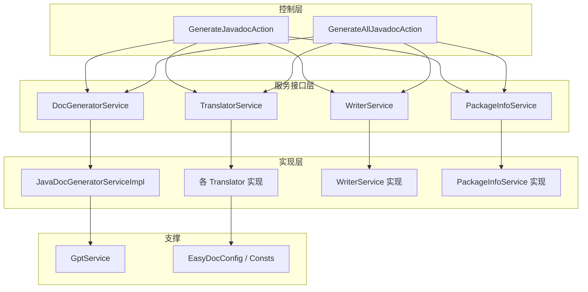
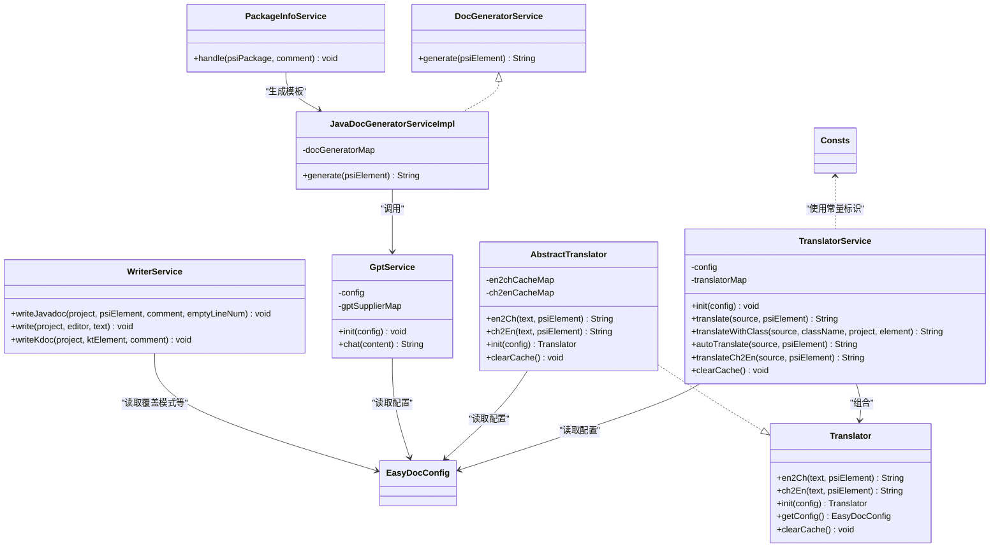
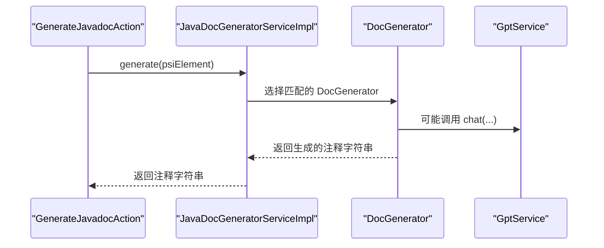
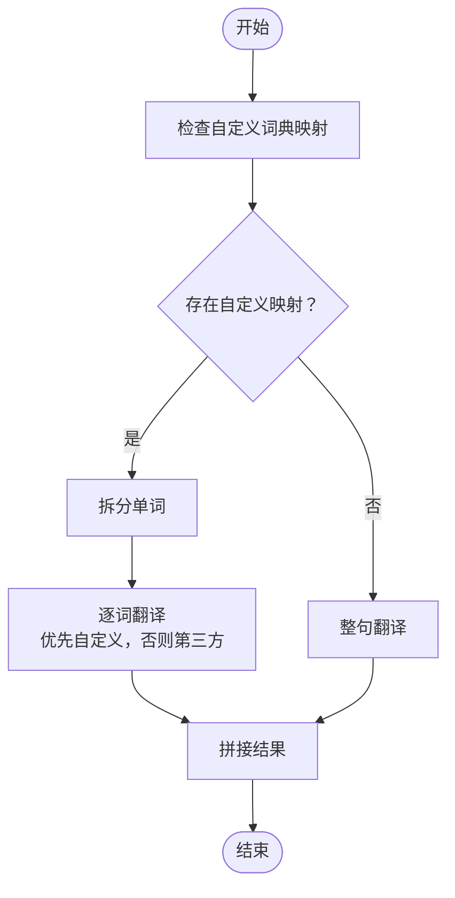
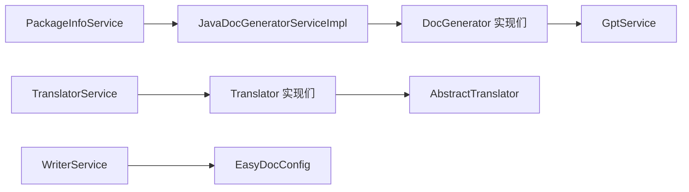

# 服务接口

<cite>
**本文引用的文件列表**
- [DocGeneratorService.java](file://src/main/java/com/star/easydoc/service/DocGeneratorService.java)
- [JavaDocGeneratorServiceImpl.java](file://src/main/java/com/star/easydoc/javadoc/service/JavaDocGeneratorServiceImpl.java)
- [WriterService.java](file://src/main/java/com/star/easydoc/service/WriterService.java)
- [PackageInfoService.java](file://src/main/java/com/star/easydoc/service/PackageInfoService.java)
- [TranslatorService.java](file://src/main/java/com/star/easydoc/service/translator/TranslatorService.java)
- [Translator.java](file://src/main/java/com/star/easydoc/service/translator/Translator.java)
- [AbstractTranslator.java](file://src/main/java/com/star/easydoc/service/translator/impl/AbstractTranslator.java)
- [GptService.java](file://src/main/java/com/star/easydoc/service/gpt/GptService.java)
- [GenerateJavadocAction.java](file://src/main/java/com/star/easydoc/action/GenerateJavadocAction.java)
- [GenerateAllJavadocAction.java](file://src/main/java/com/star/easydoc/action/GenerateAllJavadocAction.java)
- [Consts.java](file://src/main/java/com/star/easydoc/common/Consts.java)
- [EasyDocConfig.java](file://src/main/java/com/star/easydoc/config/EasyDocConfig.java)
</cite>

## 目录
1. [简介](#简介)
2. [项目结构与职责划分](#项目结构与职责划分)
3. [核心服务接口总览](#核心服务接口总览)
4. [架构概览](#架构概览)
5. [详细组件分析](#详细组件分析)
6. [依赖关系分析](#依赖关系分析)
7. [性能与并发特性](#性能与并发特性)
8. [使用示例与最佳实践](#使用示例与最佳实践)
9. [故障排查指南](#故障排查指南)
10. [结论](#结论)

## 简介
本文件面向 Easy Javadoc 插件中的服务接口，系统性梳理并输出以下核心服务接口的 API 文档：DocGeneratorService（文档生成服务）、TranslatorService（翻译服务）、WriterService（文件写入服务）、PackageInfoService（包信息服务）。内容涵盖方法签名、参数类型、返回值、异常处理策略、线程安全与性能优化建议，并通过图示展示接口间的协作关系与依赖链路。

## 项目结构与职责划分
- 服务接口层：定义对外契约，如 DocGeneratorService、TranslatorService、WriterService、PackageInfoService。
- 实现层：提供具体实现，如 JavaDocGeneratorServiceImpl、各翻译实现类、WriterService、PackageInfoService。
- 控制层：通过动作入口（GenerateJavadocAction、GenerateAllJavadocAction）编排服务调用。
- 配置与常量：EasyDocConfig、Consts 提供运行时配置与常量枚举。
- 辅助能力：GptService 提供 AI 对话能力；AbstractTranslator 提供缓存与抽象实现。

图表来源
- [GenerateJavadocAction.java:46-175](file://src/main/java/com/star/easydoc/action/GenerateJavadocAction.java#L46-L175)
- [GenerateAllJavadocAction.java:47-74](file://src/main/java/com/star/easydoc/action/GenerateAllJavadocAction.java#L47-L74)
- [JavaDocGeneratorServiceImpl.java:25-49](file://src/main/java/com/star/easydoc/javadoc/service/JavaDocGeneratorServiceImpl.java#L25-L49)
- [TranslatorService.java:41-238](file://src/main/java/com/star/easydoc/service/translator/TranslatorService.java#L41-L238)
- [WriterService.java:25-139](file://src/main/java/com/star/easydoc/service/WriterService.java#L25-L139)
- [PackageInfoService.java:22-90](file://src/main/java/com/star/easydoc/service/PackageInfoService.java#L22-L90)
- [GptService.java:16-56](file://src/main/java/com/star/easydoc/service/gpt/GptService.java#L16-L56)
- [EasyDocConfig.java:533-650](file://src/main/java/com/star/easydoc/config/EasyDocConfig.java#L533-L650)
- [Consts.java:39-99](file://src/main/java/com/star/easydoc/common/Consts.java#L39-L99)

章节来源
- [GenerateJavadocAction.java:46-175](file://src/main/java/com/star/easydoc/action/GenerateJavadocAction.java#L46-L175)
- [GenerateAllJavadocAction.java:47-74](file://src/main/java/com/star/easydoc/action/GenerateAllJavadocAction.java#L47-L74)

## 核心服务接口总览
- DocGeneratorService：统一的文档生成入口，按 PSI 元素类型分发到具体生成器。
- TranslatorService：统一的翻译入口，支持多种翻译源与缓存策略，提供中英互译与自动翻译。
- WriterService：统一的写入入口，支持 Javadoc、KDoc 与编辑器文本写入，保证 IDE 写入线程安全。
- PackageInfoService：包信息文件（package-info.java）的创建与更新，结合翻译服务生成描述。

章节来源
- [DocGeneratorService.java:11-20](file://src/main/java/com/star/easydoc/service/DocGeneratorService.java#L11-L20)
- [TranslatorService.java:41-238](file://src/main/java/com/star/easydoc/service/translator/TranslatorService.java#L41-L238)
- [WriterService.java:25-139](file://src/main/java/com/star/easydoc/service/WriterService.java#L25-L139)
- [PackageInfoService.java:22-90](file://src/main/java/com/star/easydoc/service/PackageInfoService.java#L22-L90)

## 架构概览
下图展示服务接口与实现、以及与配置、常量、AI 的交互关系。

图表来源
- [DocGeneratorService.java:11-20](file://src/main/java/com/star/easydoc/service/DocGeneratorService.java#L11-L20)
- [JavaDocGeneratorServiceImpl.java:25-49](file://src/main/java/com/star/easydoc/javadoc/service/JavaDocGeneratorServiceImpl.java#L25-L49)
- [TranslatorService.java:41-238](file://src/main/java/com/star/easydoc/service/translator/TranslatorService.java#L41-L238)
- [Translator.java:13-53](file://src/main/java/com/star/easydoc/service/translator/Translator.java#L13-L53)
- [AbstractTranslator.java:14-92](file://src/main/java/com/star/easydoc/service/translator/impl/AbstractTranslator.java#L14-L92)
- [WriterService.java:25-139](file://src/main/java/com/star/easydoc/service/WriterService.java#L25-L139)
- [PackageInfoService.java:22-90](file://src/main/java/com/star/easydoc/service/PackageInfoService.java#L22-L90)
- [GptService.java:16-56](file://src/main/java/com/star/easydoc/service/gpt/GptService.java#L16-L56)
- [EasyDocConfig.java:533-650](file://src/main/java/com/star/easydoc/config/EasyDocConfig.java#L533-L650)
- [Consts.java:39-99](file://src/main/java/com/star/easydoc/common/Consts.java#L39-L99)

## 详细组件分析

### DocGeneratorService 文档生成服务接口
- 定义
  - 接口名：DocGeneratorService
  - 方法：generate(PsiElement psiElement) -> String
- 参数
  - psiElement：IntelliJ PSI 元素，可为类、方法、字段、包等
- 返回值
  - 生成的文档字符串；若不支持该元素类型，返回空字符串
- 异常处理
  - 接口未声明抛出异常；实现中可能因资源加载或模板解析失败而抛出运行时异常
- 生命周期与线程安全
  - 无状态纯函数式接口；多线程安全
- 性能建议
  - 在实现中避免重复初始化生成器映射；使用不可变映射减少锁竞争
- 使用示例（路径）
  - [GenerateJavadocAction.java:145-153](file://src/main/java/com/star/easydoc/action/GenerateJavadocAction.java#L145-L153)
  - [GenerateAllJavadocAction.java:69-73](file://src/main/java/com/star/easydoc/action/GenerateAllJavadocAction.java#L69-L73)

章节来源
- [DocGeneratorService.java:11-20](file://src/main/java/com/star/easydoc/service/DocGeneratorService.java#L11-L20)
- [JavaDocGeneratorServiceImpl.java:25-49](file://src/main/java/com/star/easydoc/javadoc/service/JavaDocGeneratorServiceImpl.java#L25-L49)

### JavaDocGeneratorServiceImpl 实现
- 绑定关系
  - 将 PSI 元素类型映射到对应 DocGenerator 实现（类、方法、字段、包）
- 生成流程
  - 根据元素类型选择生成器，调用其 generate 方法
- 错误处理
  - 不支持的类型返回空字符串
- 性能
  - 使用不可变映射，查找为 O(n)（n 为已注册类型数），通常很小

图表来源
- [GenerateJavadocAction.java:145-153](file://src/main/java/com/star/easydoc/action/GenerateJavadocAction.java#L145-L153)
- [JavaDocGeneratorServiceImpl.java:35-48](file://src/main/java/com/star/easydoc/javadoc/service/JavaDocGeneratorServiceImpl.java#L35-L48)
- [GptService.java:48-54](file://src/main/java/com/star/easydoc/service/gpt/GptService.java#L48-L54)

章节来源
- [JavaDocGeneratorServiceImpl.java:25-49](file://src/main/java/com/star/easydoc/javadoc/service/JavaDocGeneratorServiceImpl.java#L25-L49)

### TranslatorService 翻译服务接口
- 定义
  - 接口名：TranslatorService
  - 主要方法：
    - init(EasyDocConfig config)：初始化翻译器映射
    - translate(String source, PsiElement psiElement)：英文->中文（支持自定义词典优先）
    - translateWithClass(...)：优先读取已有文档作为中文
    - autoTranslate(String source, PsiElement psiElement)：按配置选择翻译器
    - translateCh2En(String source, PsiElement psiElement)：中文->英文（过滤停用词并格式化）
    - clearCache()：清理缓存
- 参数
  - source：待翻译文本
  - psiElement：文本所在 PSI 元素，用于上下文定位
  - config：EasyDocConfig，包含翻译器选择、词典、超时等
- 返回值
  - 翻译结果字符串；空字符串表示失败或无结果
- 异常处理
  - 网络/解析异常会记录日志并返回空串
- 线程安全
  - 内部使用同步块保护初始化；翻译器实例本身由子类实现，需确保子类线程安全
- 性能优化
  - 使用 ConcurrentMap 缓存翻译结果；支持按配置清理缓存
- 使用示例（路径）
  - [GenerateJavadocAction.java:88-100](file://src/main/java/com/star/easydoc/action/GenerateJavadocAction.java#L88-L100)
  - [PackageInfoService.java:33-87](file://src/main/java/com/star/easydoc/service/PackageInfoService.java#L33-L87)

图表来源
- [TranslatorService.java:85-111](file://src/main/java/com/star/easydoc/service/translator/TranslatorService.java#L85-L111)
- [AbstractTranslator.java:22-52](file://src/main/java/com/star/easydoc/service/translator/impl/AbstractTranslator.java#L22-L52)

章节来源
- [TranslatorService.java:41-238](file://src/main/java/com/star/easydoc/service/translator/TranslatorService.java#L41-L238)
- [AbstractTranslator.java:14-92](file://src/main/java/com/star/easydoc/service/translator/impl/AbstractTranslator.java#L14-L92)
- [Consts.java:39-99](file://src/main/java/com/star/easydoc/common/Consts.java#L39-L99)

### WriterService 文件写入服务
- 定义
  - 类名：WriterService
  - 方法：
    - writeJavadoc(Project, PsiElement, PsiDocComment, int)：写入 Javadoc 注释并格式化
    - write(Project, Editor, String)：在编辑器插入文本并选中
    - writeKdoc(Project, KtElement, KDoc)：写入 KDoc 注释并格式化
- 参数
  - Project：IDE 工程上下文
  - PsiElement / KtElement：目标元素
  - PsiDocComment / KDoc：待写入注释
  - Editor：当前编辑器
  - int：空行数量
- 返回值
  - 无返回值（void）
- 异常处理
  - 使用 WriteCommandAction.run 包裹，捕获 Throwable 并记录日志
- 线程安全
  - 通过 IDE 写命令机制保证线程安全
- 性能
  - 写入后调用 CodeStyleManager.reformatText 进行格式化，注意对大文件的影响

章节来源
- [WriterService.java:25-139](file://src/main/java/com/star/easydoc/service/WriterService.java#L25-L139)

### PackageInfoService 包信息服务
- 定义
  - 类名：PackageInfoService
  - 方法：handle(PsiPackage psiPackage, String comment)：创建或更新 package-info.java
- 行为
  - 若不存在 package-info.java，则基于模板生成并写入 UTF-8 内容
  - 若已存在，则在注释处插入描述
- 参数
  - psiPackage：包 PSI
  - comment：包描述（通常来自翻译服务）
- 返回值
  - 无返回值（void）
- 异常处理
  - 捕获异常并记录日志；刷新虚拟文件系统以生效
- 线程安全
  - 写入操作通过 WriteCommandAction.run 包裹，保证 IDE 线程安全

章节来源
- [PackageInfoService.java:22-90](file://src/main/java/com/star/easydoc/service/PackageInfoService.java#L22-L90)

## 依赖关系分析
- DocGeneratorService 与实现
  - JavaDocGeneratorServiceImpl 通过映射将 PSI 元素类型分发到具体 DocGenerator
  - DocGenerator 可能依赖 GptService 进行 AI 生成
- TranslatorService 与实现
  - 维护多种 Translator 实现映射，按配置选择
  - AbstractTranslator 提供缓存与抽象方法，子类实现具体翻译逻辑
- WriterService 与配置
  - 读取配置决定覆盖模式等行为
- PackageInfoService 与 DocGeneratorService
  - 通过 JavaDocGeneratorServiceImpl 生成模板内容

图表来源
- [JavaDocGeneratorServiceImpl.java:27-33](file://src/main/java/com/star/easydoc/javadoc/service/JavaDocGeneratorServiceImpl.java#L27-L33)
- [TranslatorService.java:60-74](file://src/main/java/com/star/easydoc/service/translator/TranslatorService.java#L60-L74)
- [AbstractTranslator.java:14-92](file://src/main/java/com/star/easydoc/service/translator/impl/AbstractTranslator.java#L14-L92)
- [WriterService.java:25-139](file://src/main/java/com/star/easydoc/service/WriterService.java#L25-L139)
- [PackageInfoService.java:22-90](file://src/main/java/com/star/easydoc/service/PackageInfoService.java#L22-L90)
- [GptService.java:16-56](file://src/main/java/com/star/easydoc/service/gpt/GptService.java#L16-L56)
- [EasyDocConfig.java:533-650](file://src/main/java/com/star/easydoc/config/EasyDocConfig.java#L533-L650)

章节来源
- [JavaDocGeneratorServiceImpl.java:25-49](file://src/main/java/com/star/easydoc/javadoc/service/JavaDocGeneratorServiceImpl.java#L25-L49)
- [TranslatorService.java:41-238](file://src/main/java/com/star/easydoc/service/translator/TranslatorService.java#L41-L238)
- [AbstractTranslator.java:14-92](file://src/main/java/com/star/easydoc/service/translator/impl/AbstractTranslator.java#L14-L92)
- [WriterService.java:25-139](file://src/main/java/com/star/easydoc/service/WriterService.java#L25-L139)
- [PackageInfoService.java:22-90](file://src/main/java/com/star/easydoc/service/PackageInfoService.java#L22-L90)
- [GptService.java:16-56](file://src/main/java/com/star/easydoc/service/gpt/GptService.java#L16-L56)
- [EasyDocConfig.java:533-650](file://src/main/java/com/star/easydoc/config/EasyDocConfig.java#L533-L650)

## 性能与并发特性
- DocGeneratorService
  - 映射查找为 O(n)，n 通常很小；实现采用不可变映射，避免锁竞争
- TranslatorService
  - 初始化使用双重检查锁定与同步块，避免重复初始化
  - 子类 AbstractTranslator 使用并发缓存 Map，提升重复查询性能
- WriterService
  - 通过 IDE 写命令机制保证线程安全；格式化操作对大文件有性能影响
- PackageInfoService
  - 写入采用二进制内容替换，刷新虚拟文件系统以生效

章节来源
- [JavaDocGeneratorServiceImpl.java:27-33](file://src/main/java/com/star/easydoc/javadoc/service/JavaDocGeneratorServiceImpl.java#L27-L33)
- [TranslatorService.java:52-77](file://src/main/java/com/star/easydoc/service/translator/TranslatorService.java#L52-L77)
- [AbstractTranslator.java:16-17](file://src/main/java/com/star/easydoc/service/translator/impl/AbstractTranslator.java#L16-L17)
- [WriterService.java:36-75](file://src/main/java/com/star/easydoc/service/WriterService.java#L36-L75)
- [PackageInfoService.java:33-87](file://src/main/java/com/star/easydoc/service/PackageInfoService.java#L33-L87)

## 使用示例与最佳实践
- 文档生成
  - 在动作入口中获取 DocGeneratorService 实例，传入 PSI 元素生成注释字符串，再交由 WriterService 写入
  - 示例路径参考：
    - [GenerateJavadocAction.java:145-153](file://src/main/java/com/star/easydoc/action/GenerateJavadocAction.java#L145-L153)
    - [GenerateAllJavadocAction.java:69-73](file://src/main/java/com/star/easydoc/action/GenerateAllJavadocAction.java#L69-L73)
- 翻译服务
  - 优先使用 translateWithClass 以复用已有文档；否则使用 autoTranslate 或 translate
  - 中文->英文时，先调用 translateCh2En 再做进一步处理
  - 示例路径参考：
    - [GenerateJavadocAction.java:88-100](file://src/main/java/com/star/easydoc/action/GenerateJavadocAction.java#L88-L100)
    - [PackageInfoService.java:33-87](file://src/main/java/com/star/easydoc/service/PackageInfoService.java#L33-L87)
- 写入服务
  - 使用 writeJavadoc 写入 Javadoc 注释；使用 write 写入编辑器文本；使用 writeKdoc 写入 KDoc
  - 注意空行数量与格式化时机
  - 示例路径参考：
    - [WriterService.java:36-98](file://src/main/java/com/star/easydoc/service/WriterService.java#L36-L98)
- 包信息服务
  - 在目录或 package-info.java 文件上触发，自动生成或更新包注释
  - 示例路径参考：
    - [GenerateJavadocAction.java:126-140](file://src/main/java/com/star/easydoc/action/GenerateJavadocAction.java#L126-L140)
    - [PackageInfoService.java:33-87](file://src/main/java/com/star/easydoc/service/PackageInfoService.java#L33-L87)
- 最佳实践
  - 配置层面：合理设置翻译器、覆盖模式、模板开关
  - 性能层面：避免频繁格式化；利用翻译缓存；批量处理时合并写入
  - 线程安全：所有写入均通过 IDE 写命令机制执行

章节来源
- [GenerateJavadocAction.java:71-175](file://src/main/java/com/star/easydoc/action/GenerateJavadocAction.java#L71-L175)
- [GenerateAllJavadocAction.java:47-74](file://src/main/java/com/star/easydoc/action/GenerateAllJavadocAction.java#L47-L74)
- [WriterService.java:25-139](file://src/main/java/com/star/easydoc/service/WriterService.java#L25-L139)
- [PackageInfoService.java:22-90](file://src/main/java/com/star/easydoc/service/PackageInfoService.java#L22-L90)

## 故障排查指南
- 翻译失败
  - 现象：返回空串或日志报错
  - 排查：检查网络连通性、密钥配置、超时设置；确认 TranslatorService.init 已调用
  - 参考：
    - [TranslatorService.java:157-163](file://src/main/java/com/star/easydoc/service/translator/TranslatorService.java#L157-L163)
    - [Consts.java:39-99](file://src/main/java/com/star/easydoc/common/Consts.java#L39-L99)
- 写入异常
  - 现象：写入失败或 IDE 报错
  - 排查：确认 Project、Editor、PsiElement 非空；查看日志记录
  - 参考：
    - [WriterService.java:36-98](file://src/main/java/com/star/easydoc/service/WriterService.java#L36-L98)
- 包信息未生成
  - 现象：package-info.java 未创建或未更新
  - 排查：确认 PSI 包对象有效、翻译服务可用、文件系统刷新
  - 参考：
    - [PackageInfoService.java:33-87](file://src/main/java/com/star/easydoc/service/PackageInfoService.java#L33-L87)

章节来源
- [TranslatorService.java:157-163](file://src/main/java/com/star/easydoc/service/translator/TranslatorService.java#L157-L163)
- [WriterService.java:36-98](file://src/main/java/com/star/easydoc/service/WriterService.java#L36-L98)
- [PackageInfoService.java:33-87](file://src/main/java/com/star/easydoc/service/PackageInfoService.java#L33-L87)
- [Consts.java:39-99](file://src/main/java/com/star/easydoc/common/Consts.java#L39-L99)

## 结论
本文档系统梳理了 Easy Javadoc 插件的核心服务接口及其协作关系，明确了各接口的职责边界、方法语义、异常处理策略与性能注意事项。通过动作入口的编排，服务接口实现了从 PSI 元素到注释生成、翻译、写入与包信息维护的完整链路。建议在实际使用中遵循线程安全与性能优化的最佳实践，结合配置项灵活调整行为。