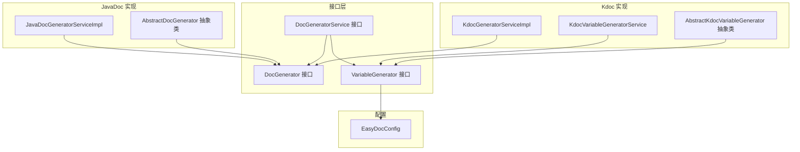
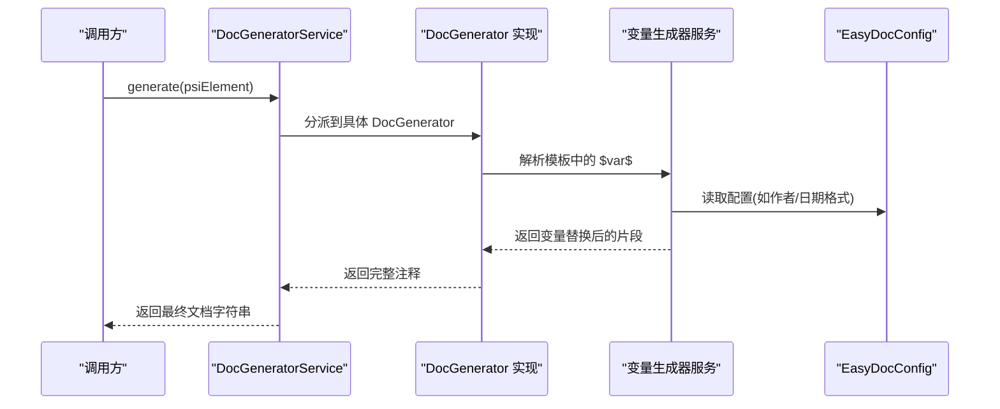
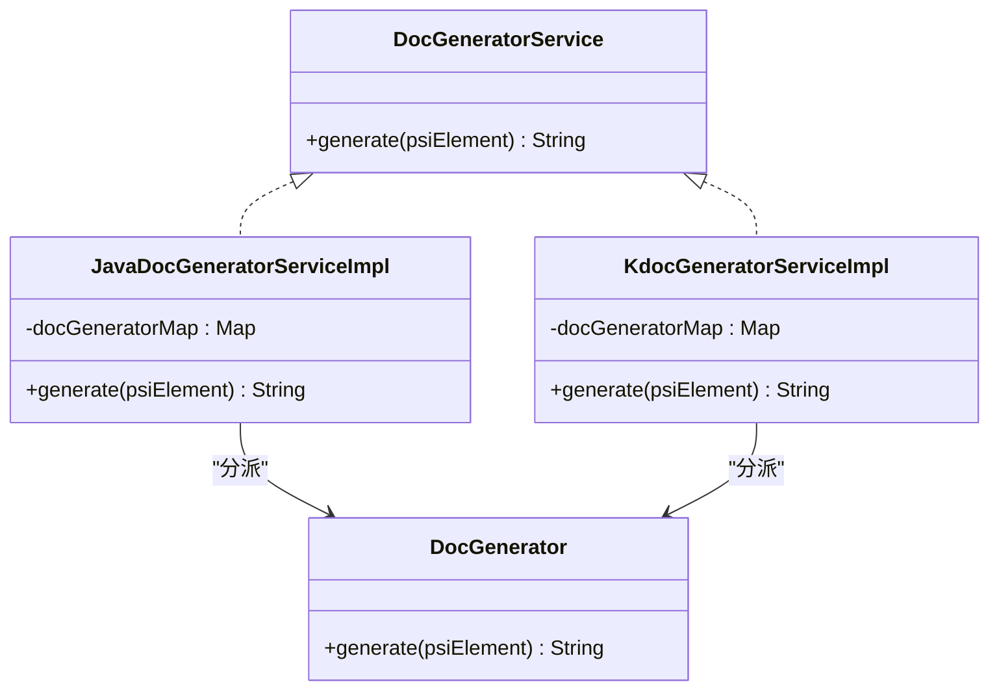
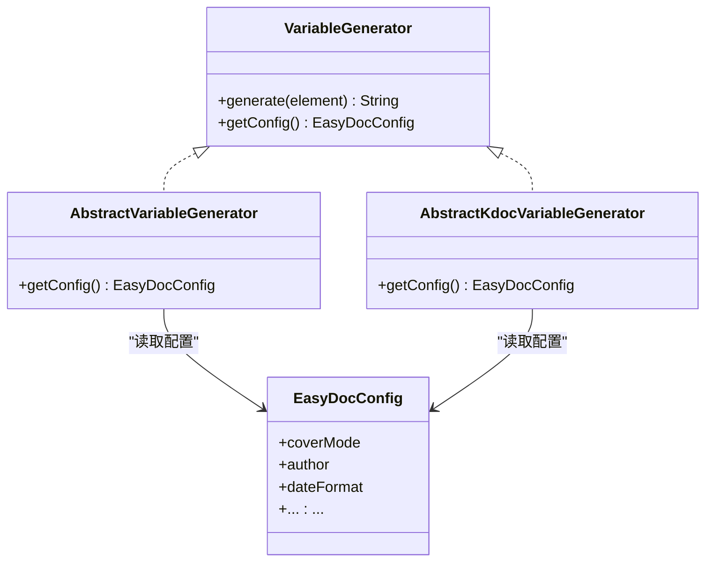
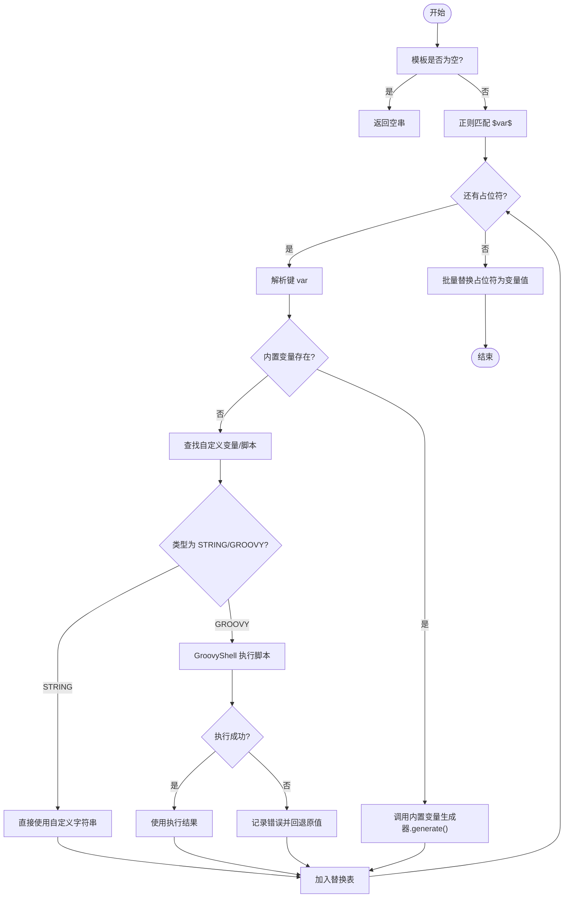
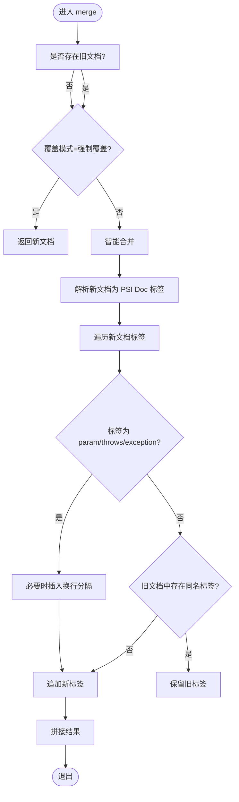
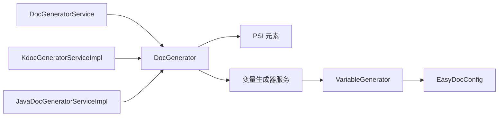

# 生成器接口

<cite>
**本文引用的文件**
- [src/main/java/com/star/easydoc/javadoc/service/generator/DocGenerator.java](file://src/main/java/com/star/easydoc/javadoc/service/generator/DocGenerator.java)
- [src/main/java/com/star/easydoc/service/DocGeneratorService.java](file://src/main/java/com/star/easydoc/service/DocGeneratorService.java)
- [src/main/java/com/star/easydoc/javadoc/service/JavaDocGeneratorServiceImpl.java](file://src/main/java/com/star/easydoc/javadoc/service/JavaDocGeneratorServiceImpl.java)
- [src/main/kotlin/com/star/easydoc/kdoc/service/KdocGeneratorServiceImpl.kt](file://src/main/kotlin/com/star/easydoc/kdoc/service/KdocGeneratorServiceImpl.kt)
- [src/main/java/com/star/easydoc/javadoc/service/generator/impl/AbstractDocGenerator.java](file://src/main/java/com/star/easydoc/javadoc/service/generator/impl/AbstractDocGenerator.java)
- [src/main/java/com/star/easydoc/javadoc/service/variable/VariableGenerator.java](file://src/main/java/com/star/easydoc/javadoc/service/variable/VariableGenerator.java)
- [src/main/java/com/star/easydoc/javadoc/service/variable/impl/AbstractVariableGenerator.java](file://src/main/java/com/star/easydoc/javadoc/service/variable/impl/AbstractVariableGenerator.java)
- [src/main/kotlin/com/star/easydoc/kdoc/service/variable/impl/AbstractKdocVariableGenerator.kt](file://src/main/kotlin/com/star/easydoc/kdoc/service/variable/impl/AbstractKdocVariableGenerator.kt)
- [src/main/java/com/star/easydoc/javadoc/service/variable/JavadocVariableGeneratorService.java](file://src/main/java/com/star/easydoc/javadoc/service/variable/JavadocVariableGeneratorService.java)
- [src/main/kotlin/com/star/easydoc/kdoc/service/variable/KdocVariableGeneratorService.kt](file://src/main/kotlin/com/star/easydoc/kdoc/service/variable/KdocVariableGeneratorService.kt)
- [src/main/java/com/star/easydoc/config/EasyDocConfig.java](file://src/main/java/com/star/easydoc/config/EasyDocConfig.java)
</cite>

## 目录
1. [简介](#简介)
2. [项目结构](#项目结构)
3. [核心组件](#核心组件)
4. [架构总览](#架构总览)
5. [详细组件分析](#详细组件分析)
6. [依赖分析](#依赖分析)
7. [性能考虑](#性能考虑)
8. [故障排查指南](#故障排查指南)
9. [结论](#结论)
10. [附录](#附录)

## 简介
本文件聚焦于 Easy Javadoc 插件中的“生成器接口”体系，涵盖以下方面：
- 变量生成接口：VariableGenerator（Java 与 Kdoc 两套实现）
- 文档生成接口：DocGenerator（JavaDoc 与 Kdoc 两类生成器）
- 生成器服务：DocGeneratorService 的具体实现
- 模板系统中的变量解析与替换机制
- 扩展点与自定义实现方式
- 错误处理策略与优先级控制

目标是帮助开发者快速理解接口职责、参数约束、返回值格式，并掌握如何在现有框架下进行扩展与定制。

## 项目结构
围绕生成器接口的关键模块组织如下：
- 接口层：DocGenerator、VariableGenerator、DocGeneratorService
- JavaDoc 实现：DocGenerator 的具体实现类、JavaDocGeneratorServiceImpl
- Kdoc 实现：KdocGeneratorServiceImpl 及其变量生成器服务
- 抽象基类：AbstractDocGenerator、AbstractVariableGenerator、AbstractKdocVariableGenerator
- 配置：EasyDocConfig 提供覆盖模式、模板配置等全局设置

图表来源
- [src/main/java/com/star/easydoc/javadoc/service/generator/DocGenerator.java:11-18](file://src/main/java/com/star/easydoc/javadoc/service/generator/DocGenerator.java#L11-L18)
- [src/main/java/com/star/easydoc/service/DocGeneratorService.java:11-19](file://src/main/java/com/star/easydoc/service/DocGeneratorService.java#L11-L19)
- [src/main/java/com/star/easydoc/javadoc/service/JavaDocGeneratorServiceImpl.java:25-48](file://src/main/java/com/star/easydoc/javadoc/service/JavaDocGeneratorServiceImpl.java#L25-L48)
- [src/main/kotlin/com/star/easydoc/kdoc/service/KdocGeneratorServiceImpl.kt:21-51](file://src/main/kotlin/com/star/easydoc/kdoc/service/KdocGeneratorServiceImpl.kt#L21-L51)
- [src/main/java/com/star/easydoc/javadoc/service/generator/impl/AbstractDocGenerator.java:20-79](file://src/main/java/com/star/easydoc/javadoc/service/generator/impl/AbstractDocGenerator.java#L20-L79)
- [src/main/java/com/star/easydoc/javadoc/service/variable/VariableGenerator.java:12-27](file://src/main/java/com/star/easydoc/javadoc/service/variable/VariableGenerator.java#L12-L27)
- [src/main/kotlin/com/star/easydoc/kdoc/service/variable/impl/AbstractKdocVariableGenerator.kt:14-17](file://src/main/kotlin/com/star/easydoc/kdoc/service/variable/impl/AbstractKdocVariableGenerator.kt#L14-L17)
- [src/main/java/com/star/easydoc/config/EasyDocConfig.java:41-50](file://src/main/java/com/star/easydoc/config/EasyDocConfig.java#L41-L50)

章节来源
- [src/main/java/com/star/easydoc/javadoc/service/generator/DocGenerator.java:11-18](file://src/main/java/com/star/easydoc/javadoc/service/generator/DocGenerator.java#L11-L18)
- [src/main/java/com/star/easydoc/service/DocGeneratorService.java:11-19](file://src/main/java/com/star/easydoc/service/DocGeneratorService.java#L11-L19)
- [src/main/java/com/star/easydoc/javadoc/service/JavaDocGeneratorServiceImpl.java:25-48](file://src/main/java/com/star/easydoc/javadoc/service/JavaDocGeneratorServiceImpl.java#L25-L48)
- [src/main/kotlin/com/star/easydoc/kdoc/service/KdocGeneratorServiceImpl.kt:21-51](file://src/main/kotlin/com/star/easydoc/kdoc/service/KdocGeneratorServiceImpl.kt#L21-L51)
- [src/main/java/com/star/easydoc/javadoc/service/generator/impl/AbstractDocGenerator.java:20-79](file://src/main/java/com/star/easydoc/javadoc/service/generator/impl/AbstractDocGenerator.java#L20-L79)
- [src/main/java/com/star/easydoc/javadoc/service/variable/VariableGenerator.java:12-27](file://src/main/java/com/star/easydoc/javadoc/service/variable/VariableGenerator.java#L12-L27)
- [src/main/kotlin/com/star/easydoc/kdoc/service/variable/impl/AbstractKdocVariableGenerator.kt:14-17](file://src/main/kotlin/com/star/easydoc/kdoc/service/variable/impl/AbstractKdocVariableGenerator.kt#L14-L17)
- [src/main/java/com/star/easydoc/config/EasyDocConfig.java:41-50](file://src/main/java/com/star/easydoc/config/EasyDocConfig.java#L41-L50)

## 核心组件
- DocGenerator 接口：定义“生成”能力，输入为 PSI 元素，输出为字符串形式的文档内容。
- VariableGenerator 接口：定义“变量生成”能力，输入为 PSI 元素，输出为字符串；同时提供配置访问能力。
- DocGeneratorService 接口：统一的文档生成入口，按 PSI 元素类型分派到具体 DocGenerator 实现。
- JavaDocGeneratorServiceImpl：基于 PSI 类型映射到具体 Doc 生成器（类、方法、字段、包信息）。
- KdocGeneratorServiceImpl：基于 Kotlin PSI 类型映射到具体 Doc 生成器（类、对象、函数、属性）。
- AbstractDocGenerator：提供文档合并逻辑，支持“强制覆盖/智能合并/忽略”三种覆盖模式。
- JavadocVariableGeneratorService / KdocVariableGeneratorService：模板变量解析与替换，支持自定义变量与 Groovy 脚本。
- AbstractVariableGenerator / AbstractKdocVariableGenerator：提供从配置组件读取 EasyDocConfig 的通用实现。
- EasyDocConfig：集中管理覆盖模式、作者、日期格式、模板配置等全局设置。

章节来源
- [src/main/java/com/star/easydoc/javadoc/service/generator/DocGenerator.java:11-18](file://src/main/java/com/star/easydoc/javadoc/service/generator/DocGenerator.java#L11-L18)
- [src/main/java/com/star/easydoc/service/DocGeneratorService.java:11-19](file://src/main/java/com/star/easydoc/service/DocGeneratorService.java#L11-L19)
- [src/main/java/com/star/easydoc/javadoc/service/JavaDocGeneratorServiceImpl.java:27-48](file://src/main/java/com/star/easydoc/javadoc/service/JavaDocGeneratorServiceImpl.java#L27-L48)
- [src/main/kotlin/com/star/easydoc/kdoc/service/KdocGeneratorServiceImpl.kt:22-51](file://src/main/kotlin/com/star/easydoc/kdoc/service/KdocGeneratorServiceImpl.kt#L22-L51)
- [src/main/java/com/star/easydoc/javadoc/service/generator/impl/AbstractDocGenerator.java:29-71](file://src/main/java/com/star/easydoc/javadoc/service/generator/impl/AbstractDocGenerator.java#L29-L71)
- [src/main/java/com/star/easydoc/javadoc/service/variable/VariableGenerator.java:12-27](file://src/main/java/com/star/easydoc/javadoc/service/variable/VariableGenerator.java#L12-L27)
- [src/main/java/com/star/easydoc/javadoc/service/variable/impl/AbstractVariableGenerator.java:14-19](file://src/main/java/com/star/easydoc/javadoc/service/variable/impl/AbstractVariableGenerator.java#L14-L19)
- [src/main/kotlin/com/star/easydoc/kdoc/service/variable/impl/AbstractKdocVariableGenerator.kt:14-17](file://src/main/kotlin/com/star/easydoc/kdoc/service/variable/impl/AbstractKdocVariableGenerator.kt#L14-L17)
- [src/main/java/com/star/easydoc/javadoc/service/variable/JavadocVariableGeneratorService.java:35-92](file://src/main/java/com/star/easydoc/javadoc/service/variable/JavadocVariableGeneratorService.java#L35-L92)
- [src/main/kotlin/com/star/easydoc/kdoc/service/variable/KdocVariableGeneratorService.kt:22-80](file://src/main/kotlin/com/star/easydoc/kdoc/service/variable/KdocVariableGeneratorService.kt#L22-L80)
- [src/main/java/com/star/easydoc/config/EasyDocConfig.java:41-50](file://src/main/java/com/star/easydoc/config/EasyDocConfig.java#L41-L50)

## 架构总览
生成器接口在模板系统中的角色：
- 模板中以 $var$ 形式声明变量占位符
- 通过变量生成器服务解析占位符，优先匹配内置变量，否则回退到自定义变量或 Groovy 脚本
- 文档生成服务根据 PSI 元素类型选择对应 Doc 生成器，最终输出注释文本

图表来源
- [src/main/java/com/star/easydoc/service/DocGeneratorService.java:11-19](file://src/main/java/com/star/easydoc/service/DocGeneratorService.java#L11-L19)
- [src/main/java/com/star/easydoc/javadoc/service/JavaDocGeneratorServiceImpl.java:35-48](file://src/main/java/com/star/easydoc/javadoc/service/JavaDocGeneratorServiceImpl.java#L35-L48)
- [src/main/kotlin/com/star/easydoc/kdoc/service/KdocGeneratorServiceImpl.kt:35-51](file://src/main/kotlin/com/star/easydoc/kdoc/service/KdocGeneratorServiceImpl.kt#L35-L51)
- [src/main/java/com/star/easydoc/javadoc/service/variable/JavadocVariableGeneratorService.java:60-92](file://src/main/java/com/star/easydoc/javadoc/service/variable/JavadocVariableGeneratorService.java#L60-L92)
- [src/main/kotlin/com/star/easydoc/kdoc/service/variable/KdocVariableGeneratorService.kt:46-80](file://src/main/kotlin/com/star/easydoc/kdoc/service/variable/KdocVariableGeneratorService.kt#L46-L80)
- [src/main/java/com/star/easydoc/config/EasyDocConfig.java:41-50](file://src/main/java/com/star/easydoc/config/EasyDocConfig.java#L41-L50)

## 详细组件分析

### DocGenerator 接口
- 职责：对给定 PSI 元素生成注释文本
- 方法签名路径：[generate](file://src/main/java/com/star/easydoc/javadoc/service/generator/DocGenerator.java#L18)
- 参数约束：
  - psiElement：非空，必须为可生成注释的 PSI 元素
- 返回值格式：字符串，表示注释文本
- 使用场景：由 DocGeneratorService 按 PSI 类型分派调用

章节来源
- [src/main/java/com/star/easydoc/javadoc/service/generator/DocGenerator.java:11-18](file://src/main/java/com/star/easydoc/javadoc/service/generator/DocGenerator.java#L11-L18)

### DocGeneratorService 接口与实现
- DocGeneratorService：统一入口，接收 PSI 元素并返回注释字符串
- JavaDocGeneratorServiceImpl：
  - 映射关系：PSI 类型 → DocGenerator 实现
  - 支持类型：类、方法、字段、包信息
  - 未匹配时返回空字符串
- KdocGeneratorServiceImpl：
  - 映射关系：Kotlin PSI 类型 → DocGenerator 实现
  - 对生成结果进行清洗，去除空白行与星号装饰

图表来源
- [src/main/java/com/star/easydoc/service/DocGeneratorService.java:11-19](file://src/main/java/com/star/easydoc/service/DocGeneratorService.java#L11-L19)
- [src/main/java/com/star/easydoc/javadoc/service/JavaDocGeneratorServiceImpl.java:27-48](file://src/main/java/com/star/easydoc/javadoc/service/JavaDocGeneratorServiceImpl.java#L27-L48)
- [src/main/kotlin/com/star/easydoc/kdoc/service/KdocGeneratorServiceImpl.kt:22-51](file://src/main/kotlin/com/star/easydoc/kdoc/service/KdocGeneratorServiceImpl.kt#L22-L51)

章节来源
- [src/main/java/com/star/easydoc/service/DocGeneratorService.java:11-19](file://src/main/java/com/star/easydoc/service/DocGeneratorService.java#L11-L19)
- [src/main/java/com/star/easydoc/javadoc/service/JavaDocGeneratorServiceImpl.java:25-48](file://src/main/java/com/star/easydoc/javadoc/service/JavaDocGeneratorServiceImpl.java#L25-L48)
- [src/main/kotlin/com/star/easydoc/kdoc/service/KdocGeneratorServiceImpl.kt:21-51](file://src/main/kotlin/com/star/easydoc/kdoc/service/KdocGeneratorServiceImpl.kt#L21-L51)

### VariableGenerator 接口与抽象基类
- VariableGenerator：
  - generate(element)：对 PSI 元素生成变量值
  - getConfig()：获取 EasyDocConfig 实例
- AbstractVariableGenerator（Java）：
  - 统一从 EasyDocConfigComponent 读取配置状态
- AbstractKdocVariableGenerator（Kotlin）：
  - 同样提供 getConfig() 的实现

图表来源
- [src/main/java/com/star/easydoc/javadoc/service/variable/VariableGenerator.java:12-27](file://src/main/java/com/star/easydoc/javadoc/service/variable/VariableGenerator.java#L12-L27)
- [src/main/java/com/star/easydoc/javadoc/service/variable/impl/AbstractVariableGenerator.java:14-19](file://src/main/java/com/star/easydoc/javadoc/service/variable/impl/AbstractVariableGenerator.java#L14-L19)
- [src/main/kotlin/com/star/easydoc/kdoc/service/variable/impl/AbstractKdocVariableGenerator.kt:14-17](file://src/main/kotlin/com/star/easydoc/kdoc/service/variable/impl/AbstractKdocVariableGenerator.kt#L14-L17)
- [src/main/java/com/star/easydoc/config/EasyDocConfig.java:41-50](file://src/main/java/com/star/easydoc/config/EasyDocConfig.java#L41-L50)

章节来源
- [src/main/java/com/star/easydoc/javadoc/service/variable/VariableGenerator.java:12-27](file://src/main/java/com/star/easydoc/javadoc/service/variable/VariableGenerator.java#L12-L27)
- [src/main/java/com/star/easydoc/javadoc/service/variable/impl/AbstractVariableGenerator.java:14-19](file://src/main/java/com/star/easydoc/javadoc/service/variable/impl/AbstractVariableGenerator.java#L14-L19)
- [src/main/kotlin/com/star/easydoc/kdoc/service/variable/impl/AbstractKdocVariableGenerator.kt:14-17](file://src/main/kotlin/com/star/easydoc/kdoc/service/variable/impl/AbstractKdocVariableGenerator.kt#L14-L17)
- [src/main/java/com/star/easydoc/config/EasyDocConfig.java:41-50](file://src/main/java/com/star/easydoc/config/EasyDocConfig.java#L41-L50)

### 模板变量解析与替换（Javadoc 与 Kdoc）
- JavadocVariableGeneratorService：
  - 使用正则匹配 $var$ 占位符
  - 内置变量映射：author/date/doc/params/return/see/since/throws/version
  - 自定义变量支持：STRING 直接返回；GROOVY 通过 GroovyShell 执行，异常时记录日志并回退
- KdocVariableGeneratorService：
  - 结构与 Javadoc 类似，内置变量映射包含 constructor
  - 同样支持 STRING/GROOVY 自定义变量，异常时记录日志并回退

图表来源
- [src/main/java/com/star/easydoc/javadoc/service/variable/JavadocVariableGeneratorService.java:60-92](file://src/main/java/com/star/easydoc/javadoc/service/variable/JavadocVariableGeneratorService.java#L60-L92)
- [src/main/kotlin/com/star/easydoc/kdoc/service/variable/KdocVariableGeneratorService.kt:46-80](file://src/main/kotlin/com/star/easydoc/kdoc/service/variable/KdocVariableGeneratorService.kt#L46-L80)

章节来源
- [src/main/java/com/star/easydoc/javadoc/service/variable/JavadocVariableGeneratorService.java:35-125](file://src/main/java/com/star/easydoc/javadoc/service/variable/JavadocVariableGeneratorService.java#L35-L125)
- [src/main/kotlin/com/star/easydoc/kdoc/service/variable/KdocVariableGeneratorService.kt:22-121](file://src/main/kotlin/com/star/easydoc/kdoc/service/variable/KdocVariableGeneratorService.kt#L22-L121)

### 文档合并与覆盖策略（AbstractDocGenerator）
- 合并策略：
  - 若无已有文档或覆盖模式为“强制覆盖”，直接返回新文档
  - 否则进行“智能合并”：
    - 对 param/throws/exception 标签保留顺序并插入换行
    - 对其他标签名去重，保留已有文档中的同名标签
- 配置来源：通过抽象方法 getConfig() 提供 EasyDocConfig，其中包含覆盖模式常量

图表来源
- [src/main/java/com/star/easydoc/javadoc/service/generator/impl/AbstractDocGenerator.java:29-71](file://src/main/java/com/star/easydoc/javadoc/service/generator/impl/AbstractDocGenerator.java#L29-L71)
- [src/main/java/com/star/easydoc/config/EasyDocConfig.java:41-50](file://src/main/java/com/star/easydoc/config/EasyDocConfig.java#L41-L50)

章节来源
- [src/main/java/com/star/easydoc/javadoc/service/generator/impl/AbstractDocGenerator.java:29-71](file://src/main/java/com/star/easydoc/javadoc/service/generator/impl/AbstractDocGenerator.java#L29-L71)
- [src/main/java/com/star/easydoc/config/EasyDocConfig.java:41-50](file://src/main/java/com/star/easydoc/config/EasyDocConfig.java#L41-L50)

### 扩展机制与自定义实现示例
- 扩展 VariableGenerator：
  - 继承 AbstractVariableGenerator（Java）或 AbstractKdocVariableGenerator（Kotlin）
  - 在构造函数中注册到变量生成器服务的映射中（Java）或集合中（Kotlin）
  - 或者通过自定义变量配置（STRING/GROOVY）实现动态行为
- 扩展 DocGenerator：
  - 继承 AbstractDocGenerator（若需要合并逻辑），或直接实现 DocGenerator
  - 在 DocGeneratorService 的映射中注册对应的 PSI 类型映射
- 注册与优先级：
  - JavaDoc：在 JavaDocGeneratorServiceImpl 的映射中添加新条目
  - Kdoc：在 KdocGeneratorServiceImpl 的映射中添加新条目
  - 变量生成器：在 JavadocVariableGeneratorService 或 KdocVariableGeneratorService 的映射中添加新条目
- 错误处理：
  - Groovy 脚本异常会被捕获并记录日志，返回原始值作为回退
  - 模板为空或占位符非法时返回空串或原占位符

章节来源
- [src/main/java/com/star/easydoc/javadoc/service/JavaDocGeneratorServiceImpl.java:27-33](file://src/main/java/com/star/easydoc/javadoc/service/JavaDocGeneratorServiceImpl.java#L27-L33)
- [src/main/kotlin/com/star/easydoc/kdoc/service/KdocGeneratorServiceImpl.kt:22-27](file://src/main/kotlin/com/star/easydoc/kdoc/service/KdocGeneratorServiceImpl.kt#L22-L27)
- [src/main/java/com/star/easydoc/javadoc/service/variable/JavadocVariableGeneratorService.java:42-52](file://src/main/java/com/star/easydoc/javadoc/service/variable/JavadocVariableGeneratorService.java#L42-L52)
- [src/main/kotlin/com/star/easydoc/kdoc/service/variable/KdocVariableGeneratorService.kt:28-38](file://src/main/kotlin/com/star/easydoc/kdoc/service/variable/KdocVariableGeneratorService.kt#L28-L38)
- [src/main/java/com/star/easydoc/javadoc/service/variable/JavadocVariableGeneratorService.java:102-125](file://src/main/java/com/star/easydoc/javadoc/service/variable/JavadocVariableGeneratorService.java#L102-L125)
- [src/main/kotlin/com/star/easydoc/kdoc/service/variable/KdocVariableGeneratorService.kt:90-121](file://src/main/kotlin/com/star/easydoc/kdoc/service/variable/KdocVariableGeneratorService.kt#L90-L121)

## 依赖分析
- DocGeneratorService 依赖 DocGenerator 实现
- DocGenerator 实现依赖 PSI 元素类型与变量生成器服务
- VariableGenerator 依赖 EasyDocConfig（通过抽象基类统一获取）
- Kdoc 与 JavaDoc 的变量生成器服务相互独立，但共享相同的接口契约

图表来源
- [src/main/java/com/star/easydoc/service/DocGeneratorService.java:11-19](file://src/main/java/com/star/easydoc/service/DocGeneratorService.java#L11-L19)
- [src/main/java/com/star/easydoc/javadoc/service/JavaDocGeneratorServiceImpl.java:27-33](file://src/main/java/com/star/easydoc/javadoc/service/JavaDocGeneratorServiceImpl.java#L27-L33)
- [src/main/kotlin/com/star/easydoc/kdoc/service/KdocGeneratorServiceImpl.kt:22-27](file://src/main/kotlin/com/star/easydoc/kdoc/service/KdocGeneratorServiceImpl.kt#L22-L27)
- [src/main/java/com/star/easydoc/javadoc/service/variable/JavadocVariableGeneratorService.java:42-52](file://src/main/java/com/star/easydoc/javadoc/service/variable/JavadocVariableGeneratorService.java#L42-L52)
- [src/main/kotlin/com/star/easydoc/kdoc/service/variable/KdocVariableGeneratorService.kt:28-38](file://src/main/kotlin/com/star/easydoc/kdoc/service/variable/KdocVariableGeneratorService.kt#L28-L38)
- [src/main/java/com/star/easydoc/javadoc/service/variable/VariableGenerator.java:12-27](file://src/main/java/com/star/easydoc/javadoc/service/variable/VariableGenerator.java#L12-L27)
- [src/main/java/com/star/easydoc/config/EasyDocConfig.java:41-50](file://src/main/java/com/star/easydoc/config/EasyDocConfig.java#L41-L50)

章节来源
- [src/main/java/com/star/easydoc/service/DocGeneratorService.java:11-19](file://src/main/java/com/star/easydoc/service/DocGeneratorService.java#L11-L19)
- [src/main/java/com/star/easydoc/javadoc/service/JavaDocGeneratorServiceImpl.java:27-33](file://src/main/java/com/star/easydoc/javadoc/service/JavaDocGeneratorServiceImpl.java#L27-L33)
- [src/main/kotlin/com/star/easydoc/kdoc/service/KdocGeneratorServiceImpl.kt:22-27](file://src/main/kotlin/com/star/easydoc/kdoc/service/KdocGeneratorServiceImpl.kt#L22-L27)
- [src/main/java/com/star/easydoc/javadoc/service/variable/JavadocVariableGeneratorService.java:42-52](file://src/main/java/com/star/easydoc/javadoc/service/variable/JavadocVariableGeneratorService.java#L42-L52)
- [src/main/kotlin/com/star/easydoc/kdoc/service/variable/KdocVariableGeneratorService.kt:28-38](file://src/main/kotlin/com/star/easydoc/kdoc/service/variable/KdocVariableGeneratorService.kt#L28-L38)
- [src/main/java/com/star/easydoc/javadoc/service/variable/VariableGenerator.java:12-27](file://src/main/java/com/star/easydoc/javadoc/service/variable/VariableGenerator.java#L12-L27)
- [src/main/java/com/star/easydoc/config/EasyDocConfig.java:41-50](file://src/main/java/com/star/easydoc/config/EasyDocConfig.java#L41-L50)

## 性能考虑
- 正则匹配与字符串替换：模板解析采用一次性正则扫描与批量替换，避免多次遍历
- Groovy 脚本执行：仅在自定义变量为 GROOVY 类型时执行，建议尽量使用 STRING 类型以减少开销
- 合并策略：智能合并会解析 PSI 文档树，复杂注释可能带来额外成本，建议合理拆分模板
- 缓存与复用：当前实现未见显式缓存，可在自定义实现中引入轻量缓存以提升重复生成性能

## 故障排查指南
- 模板为空或占位符非法
  - 表现：返回空串
  - 处理：检查模板字符串与占位符格式
- Groovy 脚本执行异常
  - 表现：记录错误日志，回退到原始脚本字符串
  - 处理：检查脚本语法与返回值类型
- 未匹配的 PSI 元素类型
  - 表现：返回空串
  - 处理：确认 DocGeneratorService 的映射是否包含该类型
- 覆盖模式影响注释合并
  - 表现：强制覆盖直接替换，智能合并保留旧标签
  - 处理：根据需求调整 EasyDocConfig 的覆盖模式

章节来源
- [src/main/java/com/star/easydoc/javadoc/service/variable/JavadocVariableGeneratorService.java:63-64](file://src/main/java/com/star/easydoc/javadoc/service/variable/JavadocVariableGeneratorService.java#L63-L64)
- [src/main/kotlin/com/star/easydoc/kdoc/service/variable/KdocVariableGeneratorService.kt:51-53](file://src/main/kotlin/com/star/easydoc/kdoc/service/variable/KdocVariableGeneratorService.kt#L51-L53)
- [src/main/java/com/star/easydoc/javadoc/service/variable/JavadocVariableGeneratorService.java:115-121](file://src/main/java/com/star/easydoc/javadoc/service/variable/JavadocVariableGeneratorService.java#L115-L121)
- [src/main/kotlin/com/star/easydoc/kdoc/service/variable/KdocVariableGeneratorService.kt:107-117](file://src/main/kotlin/com/star/easydoc/kdoc/service/variable/KdocVariableGeneratorService.kt#L107-L117)
- [src/main/java/com/star/easydoc/javadoc/service/JavaDocGeneratorServiceImpl.java:44-46](file://src/main/java/com/star/easydoc/javadoc/service/JavaDocGeneratorServiceImpl.java#L44-L46)
- [src/main/kotlin/com/star/easydoc/kdoc/service/KdocGeneratorServiceImpl.kt:43-45](file://src/main/kotlin/com/star/easydoc/kdoc/service/KdocGeneratorServiceImpl.kt#L43-L45)
- [src/main/java/com/star/easydoc/config/EasyDocConfig.java:41-50](file://src/main/java/com/star/easydoc/config/EasyDocConfig.java#L41-L50)

## 结论
本文件系统性梳理了 Easy Javadoc 插件的生成器接口体系，明确了接口职责、参数约束与返回值格式，并给出了扩展与自定义实现的实践路径。通过统一的 DocGeneratorService 与变量生成器服务，模板系统实现了灵活的变量解析与注释生成，同时提供了覆盖模式与错误回退策略，确保在复杂场景下的稳定性与可维护性。

## 附录
- 关键接口与实现路径索引
  - DocGenerator 接口：[generate](file://src/main/java/com/star/easydoc/javadoc/service/generator/DocGenerator.java#L18)
  - DocGeneratorService 接口：[generate](file://src/main/java/com/star/easydoc/service/DocGeneratorService.java#L19)
  - JavaDocGeneratorServiceImpl：[映射与生成:27-48](file://src/main/java/com/star/easydoc/javadoc/service/JavaDocGeneratorServiceImpl.java#L27-L48)
  - KdocGeneratorServiceImpl：[映射与生成:22-51](file://src/main/kotlin/com/star/easydoc/kdoc/service/KdocGeneratorServiceImpl.kt#L22-L51)
  - AbstractDocGenerator：[合并逻辑:29-71](file://src/main/java/com/star/easydoc/javadoc/service/generator/impl/AbstractDocGenerator.java#L29-L71)
  - VariableGenerator 接口：[generate/getConfig:19-26](file://src/main/java/com/star/easydoc/javadoc/service/variable/VariableGenerator.java#L19-L26)
  - AbstractVariableGenerator：[配置读取:17-19](file://src/main/java/com/star/easydoc/javadoc/service/variable/impl/AbstractVariableGenerator.java#L17-L19)
  - AbstractKdocVariableGenerator：[配置读取:15-17](file://src/main/kotlin/com/star/easydoc/kdoc/service/variable/impl/AbstractKdocVariableGenerator.kt#L15-L17)
  - JavadocVariableGeneratorService：[变量解析与替换:60-92](file://src/main/java/com/star/easydoc/javadoc/service/variable/JavadocVariableGeneratorService.java#L60-L92)
  - KdocVariableGeneratorService：[变量解析与替换:46-80](file://src/main/kotlin/com/star/easydoc/kdoc/service/variable/KdocVariableGeneratorService.kt#L46-L80)
  - EasyDocConfig：[覆盖模式常量:41-50](file://src/main/java/com/star/easydoc/config/EasyDocConfig.java#L41-L50)