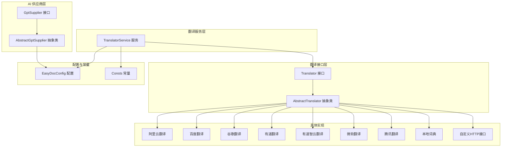
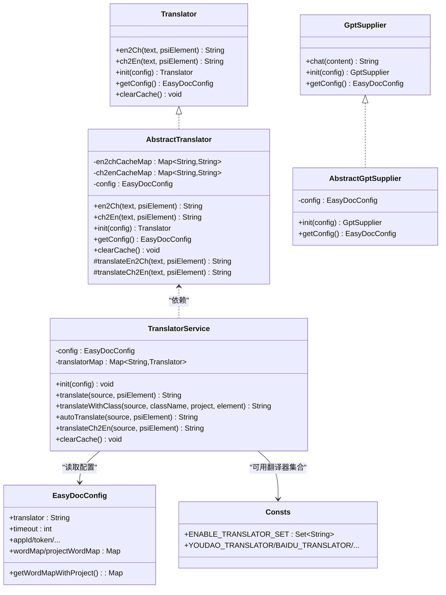
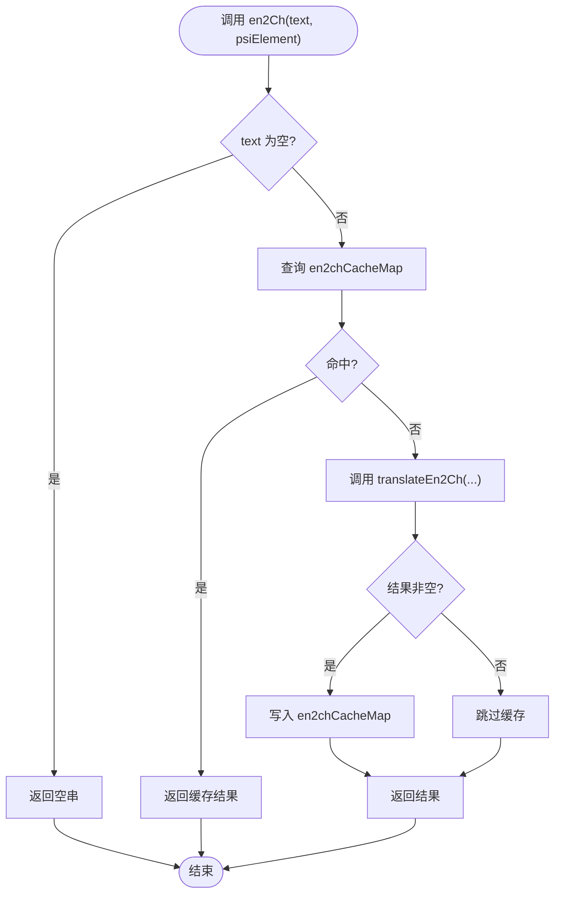
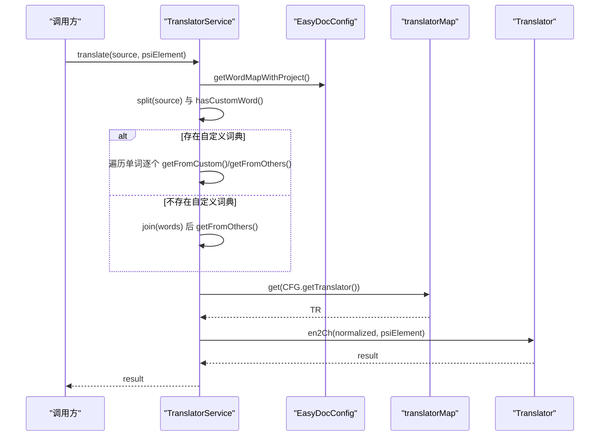
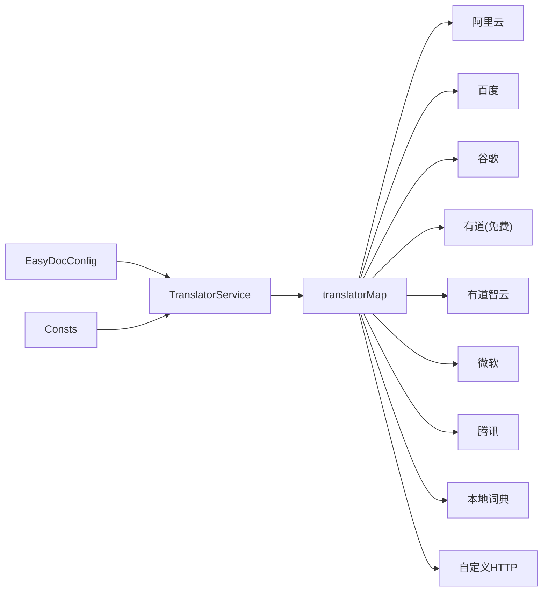

# 翻译接口

<cite>
**本文引用的文件**
- [Translator.java](file://src/main/java/com/star/easydoc/service/translator/Translator.java)
- [AbstractTranslator.java](file://src/main/java/com/star/easydoc/service/translator/impl/AbstractTranslator.java)
- [TranslatorService.java](file://src/main/java/com/star/easydoc/service/translator/TranslatorService.java)
- [GptSupplier.java](file://src/main/java/com/star/easydoc/service/gpt/GptSupplier.java)
- [AbstractGptSupplier.java](file://src/main/java/com/star/easydoc/service/gpt/impl/AbstractGptSupplier.java)
- [EasyDocConfig.java](file://src/main/java/com/star/easydoc/config/EasyDocConfig.java)
- [Consts.java](file://src/main/java/com/star/easydoc/common/Consts.java)
- [AliyunTranslator.java](file://src/main/java/com/star/easydoc/service/translator/impl/AliyunTranslator.java)
- [BaiduTranslator.java](file://src/main/java/com/star/easydoc/service/translator/impl/BaiduTranslator.java)
- [GoogleTranslator.java](file://src/main/java/com/star/easydoc/service/translator/impl/GoogleTranslator.java)
- [YoudaoTranslator.java](file://src/main/java/com/star/easydoc/service/translator/impl/YoudaoTranslator.java)
- [YoudaoAiTranslator.java](file://src/main/java/com/star/easydoc/service/translator/impl/YoudaoAiTranslator.java)
- [MicrosoftTranslator.java](file://src/main/java/com/star/easydoc/service/translator/impl/MicrosoftTranslator.java)
- [TencentTranslator.java](file://src/main/java/com/star/easydoc/service/translator/impl/TencentTranslator.java)
- [LocalTranslator.java](file://src/main/java/com/star/easydoc/service/translator/impl/LocalTranslator.java)
- [CustomTranslator.java](file://src/main/java/com/star/easydoc/service/translator/impl/CustomTranslator.java)
</cite>

## 目录
1. [简介](#简介)
2. [项目结构](#项目结构)
3. [核心组件](#核心组件)
4. [架构总览](#架构总览)
5. [详细组件分析](#详细组件分析)
6. [依赖分析](#依赖分析)
7. [性能考虑](#性能考虑)
8. [故障排查指南](#故障排查指南)
9. [结论](#结论)
10. [附录](#附录)

## 简介
本文件面向 Easy Javadoc 插件中的翻译能力，系统性梳理翻译接口设计与实现，包括：
- Translator 翻译接口：统一的英译中/中译英入口与生命周期管理
- AbstractTranslator 抽象基类：内置缓存、初始化与抽象翻译方法
- TranslatorService 翻译服务：多翻译器注册、动态选择、自定义词典融合、整句/分词策略
- GptSupplier AI 供应商接口：统一的对话式问答接口，便于扩展 ChatGLM 等模型
- 配置系统集成：通过 EasyDocConfig 动态切换翻译器、超时、密钥等参数
- 扩展指南：如何新增自定义翻译器或 AI 供应商

## 项目结构
围绕翻译功能的关键目录与文件如下：
- service/translator：翻译接口与实现
- service/gpt：AI 供应商接口与抽象实现
- config：全局配置 EasyDocConfig
- common/Consts：常量与可用翻译器枚举

图表来源
- [Translator.java:13-53](file://src/main/java/com/star/easydoc/service/translator/Translator.java#L13-L53)
- [AbstractTranslator.java:14-91](file://src/main/java/com/star/easydoc/service/translator/impl/AbstractTranslator.java#L14-L91)
- [TranslatorService.java:41-237](file://src/main/java/com/star/easydoc/service/translator/TranslatorService.java#L41-L237)
- [GptSupplier.java:9-34](file://src/main/java/com/star/easydoc/service/gpt/GptSupplier.java#L9-L34)
- [AbstractGptSupplier.java:10-25](file://src/main/java/com/star/easydoc/service/gpt/impl/AbstractGptSupplier.java#L10-L25)
- [EasyDocConfig.java:22-679](file://src/main/java/com/star/easydoc/config/EasyDocConfig.java#L22-L679)
- [Consts.java:14-99](file://src/main/java/com/star/easydoc/common/Consts.java#L14-L99)

章节来源
- [Translator.java:13-53](file://src/main/java/com/star/easydoc/service/translator/Translator.java#L13-L53)
- [AbstractTranslator.java:14-91](file://src/main/java/com/star/easydoc/service/translator/impl/AbstractTranslator.java#L14-L91)
- [TranslatorService.java:41-237](file://src/main/java/com/star/easydoc/service/translator/TranslatorService.java#L41-L237)
- [GptSupplier.java:9-34](file://src/main/java/com/star/easydoc/service/gpt/GptSupplier.java#L9-L34)
- [AbstractGptSupplier.java:10-25](file://src/main/java/com/star/easydoc/service/gpt/impl/AbstractGptSupplier.java#L10-L25)
- [EasyDocConfig.java:22-679](file://src/main/java/com/star/easydoc/config/EasyDocConfig.java#L22-L679)
- [Consts.java:14-99](file://src/main/java/com/star/easydoc/common/Consts.java#L14-L99)

## 核心组件
- Translator 接口
  - 定义英文到中文、中文到英文两个方向的翻译方法
  - 提供初始化与配置获取、缓存清理能力
- AbstractTranslator 抽象类
  - 统一实现英译中/中译英的缓存逻辑（并发安全）
  - 将具体实现拆分为 translateEn2Ch/translateCh2En 两个抽象方法
- TranslatorService 服务
  - 注册并管理所有翻译器实例
  - 提供整句翻译与分词翻译策略、自定义词典融合
  - 支持按配置动态选择当前翻译器
- GptSupplier 与 AbstractGptSupplier
  - 定义 AI 对话接口与基础配置注入
  - 便于扩展 ChatGLM 等模型供应商
- 配置系统
  - EasyDocConfig 提供翻译器选择、超时、密钥、自定义词典等
  - Consts 提供可用翻译器名称常量集合

章节来源
- [Translator.java:13-53](file://src/main/java/com/star/easydoc/service/translator/Translator.java#L13-L53)
- [AbstractTranslator.java:14-91](file://src/main/java/com/star/easydoc/service/translator/impl/AbstractTranslator.java#L14-L91)
- [TranslatorService.java:41-237](file://src/main/java/com/star/easydoc/service/translator/TranslatorService.java#L41-L237)
- [GptSupplier.java:9-34](file://src/main/java/com/star/easydoc/service/gpt/GptSupplier.java#L9-L34)
- [AbstractGptSupplier.java:10-25](file://src/main/java/com/star/easydoc/service/gpt/impl/AbstractGptSupplier.java#L10-L25)
- [EasyDocConfig.java:22-679](file://src/main/java/com/star/easydoc/config/EasyDocConfig.java#L22-L679)
- [Consts.java:14-99](file://src/main/java/com/star/easydoc/common/Consts.java#L14-L99)

## 架构总览
翻译模块采用“接口 + 抽象基类 + 服务编排 + 配置驱动”的分层设计：
- 接口层：统一对外能力
- 抽象层：复用缓存与初始化逻辑
- 服务层：编排多实现、策略与词典融合
- 配置层：集中管理开关、参数与字典

图表来源
- [Translator.java:13-53](file://src/main/java/com/star/easydoc/service/translator/Translator.java#L13-L53)
- [AbstractTranslator.java:14-91](file://src/main/java/com/star/easydoc/service/translator/impl/AbstractTranslator.java#L14-L91)
- [TranslatorService.java:41-237](file://src/main/java/com/star/easydoc/service/translator/TranslatorService.java#L41-L237)
- [GptSupplier.java:9-34](file://src/main/java/com/star/easydoc/service/gpt/GptSupplier.java#L9-L34)
- [AbstractGptSupplier.java:10-25](file://src/main/java/com/star/easydoc/service/gpt/impl/AbstractGptSupplier.java#L10-L25)
- [EasyDocConfig.java:22-679](file://src/main/java/com/star/easydoc/config/EasyDocConfig.java#L22-L679)
- [Consts.java:14-99](file://src/main/java/com/star/easydoc/common/Consts.java#L14-L99)

## 详细组件分析

### Translator 接口
- 方法签名
  - 英译中：en2Ch(text, psiElement) → String
  - 中译英：ch2En(text, psiElement) → String
  - 初始化：init(config) → Translator
  - 获取配置：getConfig() → EasyDocConfig
  - 清理缓存：clearCache() → void
- 参数说明
  - text：待翻译文本
  - psiElement：所在 PSI 元素（用于上下文感知，如定位类/方法/字段）
- 返回值
  - 成功返回翻译结果字符串；失败或空输入返回空串
- 错误处理
  - 接口不直接处理异常；由具体实现捕获并记录日志

章节来源
- [Translator.java:13-53](file://src/main/java/com/star/easydoc/service/translator/Translator.java#L13-L53)

### AbstractTranslator 抽象类
- 缓存机制
  - 英译中缓存：ConcurrentHashMap<String, String>
  - 中译英缓存：ConcurrentHashMap<String, String>
  - 并发安全，避免重复请求
- 生命周期
  - init 注入 EasyDocConfig
  - clearCache 清空两类缓存
- 抽象方法
  - translateEn2Ch(text, psiElement)：子类实现英文到中文
  - translateCh2En(text, psiElement)：子类实现中文到英文

图表来源
- [AbstractTranslator.java:22-52](file://src/main/java/com/star/easydoc/service/translator/impl/AbstractTranslator.java#L22-L52)

章节来源
- [AbstractTranslator.java:14-91](file://src/main/java/com/star/easydoc/service/translator/impl/AbstractTranslator.java#L14-L91)

### TranslatorService 翻译服务
- 初始化
  - 使用不可变映射注册所有翻译器实现，并逐一调用 init(config)
- 翻译策略
  - 整句翻译：当不存在自定义词典命中时，将分词后的单词拼接后整体翻译
  - 分词翻译：若存在自定义词典映射，则逐词翻译并拼接
  - 自定义词典融合：支持全局与项目级词典合并
- 外部依赖
  - 通过 EasyDocConfig.getTranslator() 获取当前翻译器键
  - 通过 EasyDocConfig.getWordMapWithProject() 获取词典映射
- 关键流程

图表来源
- [TranslatorService.java:85-111](file://src/main/java/com/star/easydoc/service/translator/TranslatorService.java#L85-L111)
- [TranslatorService.java:222-232](file://src/main/java/com/star/easydoc/service/translator/TranslatorService.java#L222-L232)
- [EasyDocConfig.java:434-450](file://src/main/java/com/star/easydoc/config/EasyDocConfig.java#L434-L450)

章节来源
- [TranslatorService.java:41-237](file://src/main/java/com/star/easydoc/service/translator/TranslatorService.java#L41-L237)
- [EasyDocConfig.java:434-450](file://src/main/java/com/star/easydoc/config/EasyDocConfig.java#L434-L450)

### GptSupplier 与 AbstractGptSupplier
- GptSupplier
  - chat(content)：发送问题并返回答案
  - init(config)：注入配置
  - getConfig()：获取配置
- AbstractGptSupplier
  - 统一持有 EasyDocConfig 并提供 init/getConfig

章节来源
- [GptSupplier.java:9-34](file://src/main/java/com/star/easydoc/service/gpt/GptSupplier.java#L9-L34)
- [AbstractGptSupplier.java:10-25](file://src/main/java/com/star/easydoc/service/gpt/impl/AbstractGptSupplier.java#L10-L25)

### 具体翻译器实现要点
- 阿里云翻译
  - 使用签名头与 MD5+HMAC-SHA1 签名
  - 请求体 JSON，响应解析
- 百度翻译
  - 生成随机盐与签名，重试处理特定错误码
- 谷歌翻译
  - 直接调用官方翻译接口，解析 translations 数组
- 有道翻译（免费版）
  - 明确提示免费接口已停用，建议使用付费接口
- 有道智云翻译
  - SHA-256 签名，参数签名与截断策略
- 微软翻译
  - 通过订阅 Key 与可选区域头访问官方翻译 API
- 腾讯翻译
  - 规范化参数、签名与错误重试
- 本地词典
  - 从资源加载 JSON，构建双向映射表
- 自定义 HTTP 接口
  - 根据 PSI 类型替换路径参数，校验返回 code

章节来源
- [AliyunTranslator.java:35-153](file://src/main/java/com/star/easydoc/service/translator/impl/AliyunTranslator.java#L35-L153)
- [BaiduTranslator.java:21-62](file://src/main/java/com/star/easydoc/service/translator/impl/BaiduTranslator.java#L21-L62)
- [GoogleTranslator.java:19-51](file://src/main/java/com/star/easydoc/service/translator/impl/GoogleTranslator.java#L19-L51)
- [YoudaoTranslator.java:22-95](file://src/main/java/com/star/easydoc/service/translator/impl/YoudaoTranslator.java#L22-L95)
- [YoudaoAiTranslator.java:24-119](file://src/main/java/com/star/easydoc/service/translator/impl/YoudaoAiTranslator.java#L24-L119)
- [MicrosoftTranslator.java:22-61](file://src/main/java/com/star/easydoc/service/translator/impl/MicrosoftTranslator.java#L22-L61)
- [TencentTranslator.java:27-183](file://src/main/java/com/star/easydoc/service/translator/impl/TencentTranslator.java#L27-L183)
- [LocalTranslator.java:25-70](file://src/main/java/com/star/easydoc/service/translator/impl/LocalTranslator.java#L25-L70)
- [CustomTranslator.java:20-60](file://src/main/java/com/star/easydoc/service/translator/impl/CustomTranslator.java#L20-L60)

## 依赖分析
- 组件耦合
  - AbstractTranslator 与各具体翻译器强耦合（继承关系）
  - TranslatorService 与具体翻译器弱耦合（通过 Map<String, Translator> 注册）
  - 配置系统通过 EasyDocConfig 统一注入
- 可能的循环依赖
  - 当前结构未见循环依赖
- 外部依赖
  - HTTP 工具类用于网络请求
  - 日志记录用于错误输出
  - FastJSON 用于 JSON 解析

图表来源
- [TranslatorService.java:60-76](file://src/main/java/com/star/easydoc/service/translator/TranslatorService.java#L60-L76)
- [Consts.java:29-34](file://src/main/java/com/star/easydoc/common/Consts.java#L29-L34)
- [EasyDocConfig.java:394-400](file://src/main/java/com/star/easydoc/config/EasyDocConfig.java#L394-400)

章节来源
- [TranslatorService.java:60-76](file://src/main/java/com/star/easydoc/service/translator/TranslatorService.java#L60-L76)
- [Consts.java:29-34](file://src/main/java/com/star/easydoc/common/Consts.java#L29-L34)
- [EasyDocConfig.java:394-400](file://src/main/java/com/star/easydoc/config/EasyDocConfig.java#L394-400)

## 性能考虑
- 缓存策略
  - AbstractTranslator 内置并发安全缓存，显著降低重复请求
  - 建议在高频场景下配合 TranslatorService 的整句翻译策略减少请求次数
- 连接与超时
  - 通过 EasyDocConfig.timeout 控制网络请求超时
  - 合理设置超时以平衡稳定性与响应速度
- 错误重试
  - 部分翻译器实现具备错误重试（如百度、腾讯），建议结合业务容忍度调整
- 并发处理
  - 缓存使用并发容器，避免锁竞争
  - 若需进一步提升，可在服务层引入批量翻译队列或异步化（需评估线程安全）

## 故障排查指南
- 常见错误与定位
  - 网络或鉴权失败：查看对应翻译器的日志输出，确认密钥、区域、签名参数
  - 接口限流：部分免费接口可能受限流影响，建议切换付费接口或增加重试间隔
  - 自定义词典无效：确认 EasyDocConfig 中 wordMap 与 projectWordMap 的键大小写与空格
- 快速检查清单
  - 确认 TranslatorService 当前使用的翻译器键与 Consts 常量一致
  - 检查 EasyDocConfig.translator 与 timeout 设置
  - 清理缓存后重试：调用 TranslatorService.clearCache() 或 Translator.clearCache()

章节来源
- [YoudaoTranslator.java:32-42](file://src/main/java/com/star/easydoc/service/translator/impl/YoudaoTranslator.java#L32-L42)
- [BaiduTranslator.java:38-62](file://src/main/java/com/star/easydoc/service/translator/impl/BaiduTranslator.java#L38-L62)
- [TencentTranslator.java:42-76](file://src/main/java/com/star/easydoc/service/translator/impl/TencentTranslator.java#L42-L76)
- [TranslatorService.java:234-236](file://src/main/java/com/star/easydoc/service/translator/TranslatorService.java#L234-L236)
- [AbstractTranslator.java:68-72](file://src/main/java/com/star/easydoc/service/translator/impl/AbstractTranslator.java#L68-L72)

## 结论
该翻译模块通过清晰的接口与抽象基类，实现了可插拔的多供应商翻译体系，并以服务层策略与配置系统实现灵活的动态切换与优化。结合缓存与重试机制，能够在保证稳定性的同时提升性能。对于扩展新翻译器或 AI 供应商，遵循现有抽象与配置注入模式即可快速接入。

## 附录

### API 定义与参数说明
- Translator 接口
  - en2Ch(text, psiElement): String
  - ch2En(text, psiElement): String
  - init(config): Translator
  - getConfig(): EasyDocConfig
  - clearCache(): void
- GptSupplier 接口
  - chat(content): String
  - init(config): GptSupplier
  - getConfig(): EasyDocConfig

章节来源
- [Translator.java:13-53](file://src/main/java/com/star/easydoc/service/translator/Translator.java#L13-L53)
- [GptSupplier.java:9-34](file://src/main/java/com/star/easydoc/service/gpt/GptSupplier.java#L9-L34)

### 翻译结果格式与错误码
- 翻译结果格式
  - 多数实现返回纯文本字符串；部分通过 JSON 解析提取目标字段
- 错误码示例
  - 百度：特定错误码触发重试
  - 腾讯：请求限流错误码触发重试
  - 有道免费：明确提示接口不可用
- 建议
  - 在上层统一处理空结果与异常，必要时回退到本地词典或关闭翻译

章节来源
- [BaiduTranslator.java:38-62](file://src/main/java/com/star/easydoc/service/translator/impl/BaiduTranslator.java#L38-L62)
- [TencentTranslator.java:42-76](file://src/main/java/com/star/easydoc/service/translator/impl/TencentTranslator.java#L42-L76)
- [YoudaoTranslator.java:32-42](file://src/main/java/com/star/easydoc/service/translator/impl/YoudaoTranslator.java#L32-L42)

### 扩展指南：新增翻译器
- 步骤
  - 新建类继承 AbstractTranslator，实现 translateEn2Ch/translateCh2En
  - 在 Consts 中注册新的翻译器键
  - 在 TranslatorService.init 中加入 new YourTranslator().init(config)
  - 在 EasyDocConfig 中添加必要的密钥/参数字段
- 注意事项
  - 保持线程安全（缓存已内置）
  - 统一异常处理与日志记录
  - 如涉及签名或鉴权，参考现有实现（阿里云、有道智云、腾讯）

章节来源
- [AbstractTranslator.java:14-91](file://src/main/java/com/star/easydoc/service/translator/impl/AbstractTranslator.java#L14-L91)
- [Consts.java:14-99](file://src/main/java/com/star/easydoc/common/Consts.java#L14-L99)
- [TranslatorService.java:60-76](file://src/main/java/com/star/easydoc/service/translator/TranslatorService.java#L60-L76)
- [EasyDocConfig.java:80-136](file://src/main/java/com/star/easydoc/config/EasyDocConfig.java#L80-L136)

### 扩展指南：新增 AI 供应商
- 步骤
  - 新建类实现 GptSupplier 或继承 AbstractGptSupplier
  - 在 Consts 中注册 AI 供应商键
  - 在 TranslatorService 中根据需要扩展自动翻译逻辑
- 注意事项
  - 与 TranslatorService 的集成需考虑与现有翻译器的统一调度

章节来源
- [GptSupplier.java:9-34](file://src/main/java/com/star/easydoc/service/gpt/GptSupplier.java#L9-L34)
- [AbstractGptSupplier.java:10-25](file://src/main/java/com/star/easydoc/service/gpt/impl/AbstractGptSupplier.java#L10-L25)
- [Consts.java:36-37](file://src/main/java/com/star/easydoc/common/Consts.java#L36-L37)

### 配置系统集成与动态切换
- 切换机制
  - 通过 EasyDocConfig.translator 指定当前翻译器键
  - TranslatorService.init 注册所有实现并缓存
  - 运行时通过 getConfig().getTranslator() 动态选择
- 常用配置项
  - translator、timeout、各类密钥（appId/token、secretId/secretKey、accessKeyId/accessKeySecret、youdaoAppKey/youdaoAppSecret、googleKey、microsoftKey/region、customUrl）
  - wordMap 与 projectWordMap：自定义词典

章节来源
- [EasyDocConfig.java:394-400](file://src/main/java/com/star/easydoc/config/EasyDocConfig.java#L394-400)
- [TranslatorService.java:52-77](file://src/main/java/com/star/easydoc/service/translator/TranslatorService.java#L52-L77)
- [EasyDocConfig.java:434-450](file://src/main/java/com/star/easydoc/config/EasyDocConfig.java#L434-L450)