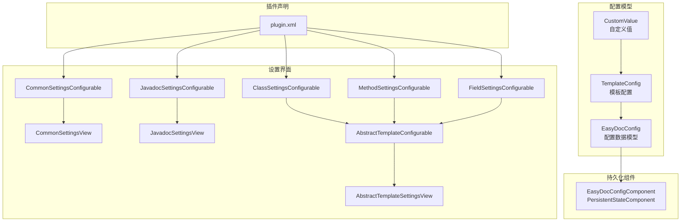
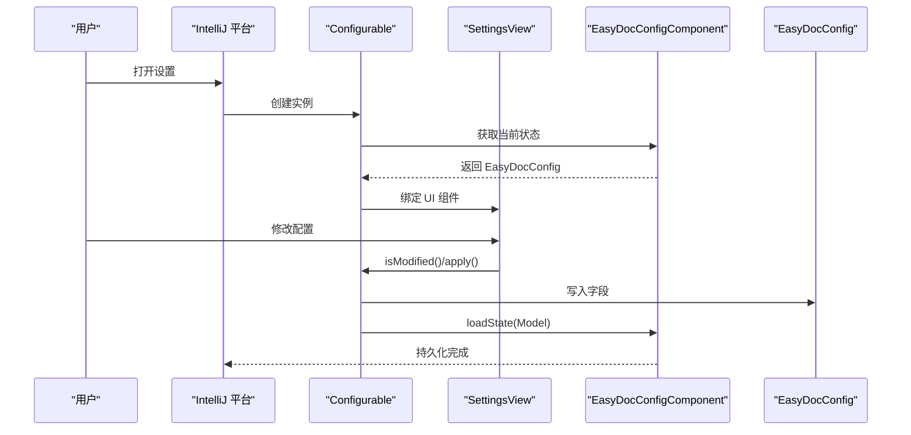
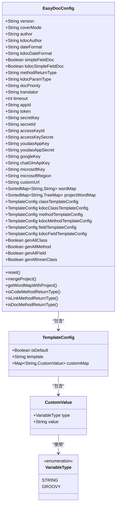
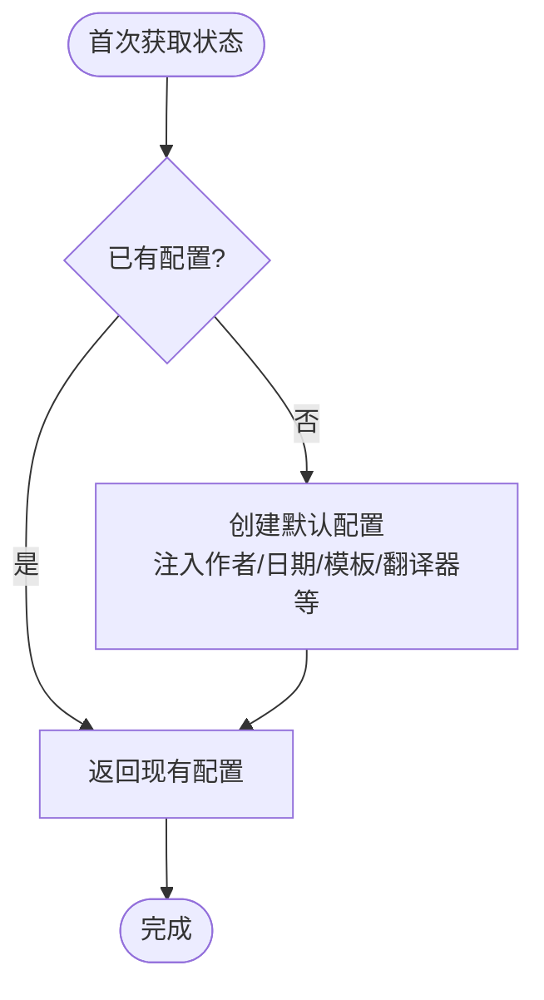
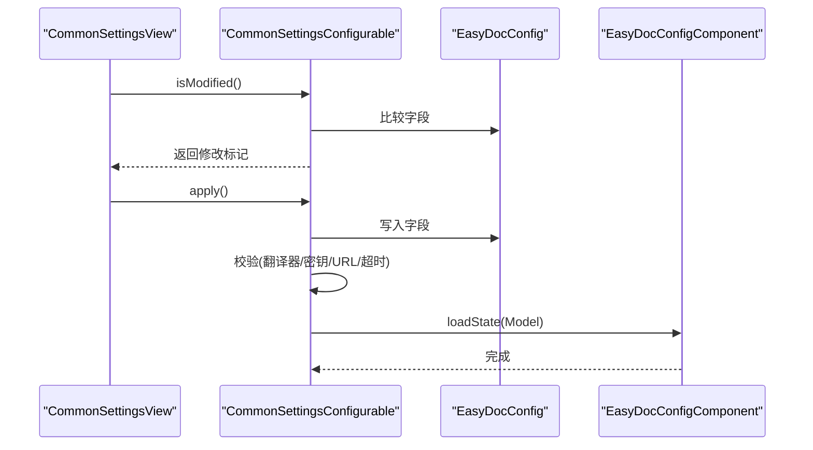
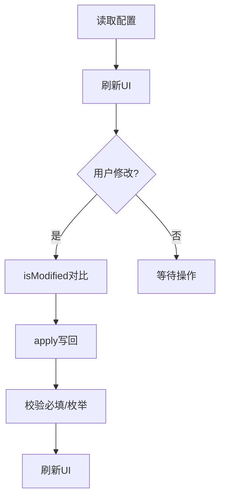
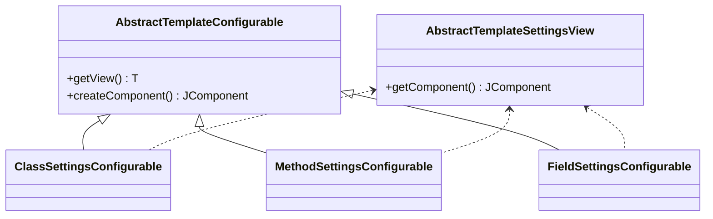
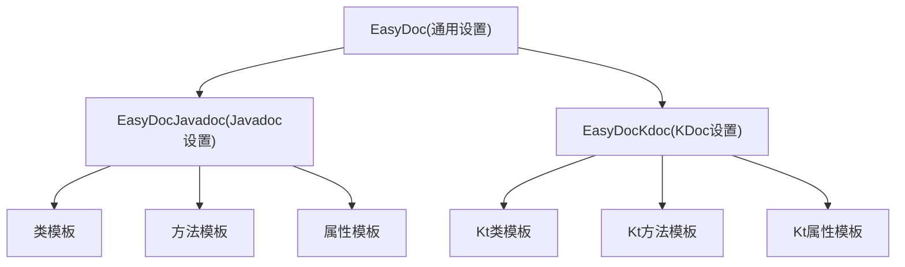
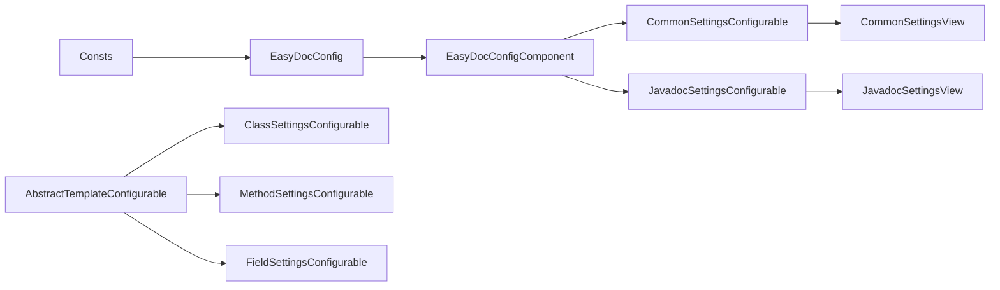

# 配置接口

<cite>
**本文引用的文件**
- [EasyDocConfig.java](file://src/main/java/com/star/easydoc/config/EasyDocConfig.java)
- [EasyDocConfigComponent.java](file://src/main/java/com/star/easydoc/config/EasyDocConfigComponent.java)
- [CommonSettingsConfigurable.java](file://src/main/java/com/star/easydoc/view/settings/CommonSettingsConfigurable.java)
- [CommonSettingsView.java](file://src/main/java/com/star/easydoc/view/settings/CommonSettingsView.java)
- [JavadocSettingsConfigurable.java](file://src/main/java/com/star/easydoc/view/settings/javadoc/JavadocSettingsConfigurable.java)
- [JavadocSettingsView.java](file://src/main/java/com/star/easydoc/view/settings/javadoc/JavadocSettingsView.java)
- [ClassSettingsConfigurable.java](file://src/main/java/com/star/easydoc/view/settings/javadoc/template/ClassSettingsConfigurable.java)
- [MethodSettingsConfigurable.java](file://src/main/java/com/star/easydoc/view/settings/javadoc/template/MethodSettingsConfigurable.java)
- [FieldSettingsConfigurable.java](file://src/main/java/com/star/easydoc/view/settings/javadoc/template/FieldSettingsConfigurable.java)
- [AbstractTemplateConfigurable.java](file://src/main/java/com/star/easydoc/view/settings/javadoc/template/AbstractTemplateConfigurable.java)
- [AbstractTemplateSettingsView.java](file://src/main/java/com/star/easydoc/view/settings/javadoc/template/AbstractTemplateSettingsView.java)
- [Consts.java](file://src/main/java/com/star/easydoc/common/Consts.java)
- [plugin.xml](file://src/main/resources/META-INF/plugin.xml)
- [build.gradle](file://build.gradle)
</cite>

## 目录
1. [简介](#简介)
2. [项目结构](#项目结构)
3. [核心组件](#核心组件)
4. [架构总览](#架构总览)
5. [详细组件分析](#详细组件分析)
6. [依赖分析](#依赖分析)
7. [性能考虑](#性能考虑)
8. [故障排查指南](#故障排查指南)
9. [结论](#结论)
10. [附录](#附录)

## 简介
本文件面向 Easy Javadoc 插件的“配置接口”主题，系统性梳理配置数据模型、配置组件、以及各类 Configurable 设置界面接口。内容涵盖：
- 数据模型：EasyDocConfig 的字段、默认值、持久化与访问器
- 组件：EasyDocConfigComponent 的状态管理与持久化存储
- 界面：CommonSettingsConfigurable、JavadocSettingsConfigurable 及模板配置界面的绑定与校验
- 验证规则：参数合法性、必填项、格式约束
- 扩展点：如何新增自定义配置项与模板变量
- 兼容性与迁移：默认值注入、项目级映射合并
- 实时更新：界面与配置的双向同步机制

## 项目结构
围绕配置接口的关键目录与文件如下：
- config：配置数据模型与组件
- view/settings：通用设置与 Javadoc/KDoc 设置界面及模板设置
- common：常量定义（含可用翻译器集合）
- resources/META-INF：插件声明，注册 Configurable 与服务
- build.gradle：版本信息与构建配置

**图表来源**
- [EasyDocConfig.java:1-680](file://src/main/java/com/star/easydoc/config/EasyDocConfig.java#L1-L680)
- [EasyDocConfigComponent.java:1-69](file://src/main/java/com/star/easydoc/config/EasyDocConfigComponent.java#L1-L69)
- [CommonSettingsConfigurable.java:1-196](file://src/main/java/com/star/easydoc/view/settings/CommonSettingsConfigurable.java#L1-L196)
- [CommonSettingsView.java:1-739](file://src/main/java/com/star/easydoc/view/settings/CommonSettingsView.java#L1-L739)
- [JavadocSettingsConfigurable.java:1-95](file://src/main/java/com/star/easydoc/view/settings/javadoc/JavadocSettingsConfigurable.java#L1-L95)
- [JavadocSettingsView.java:1-218](file://src/main/java/com/star/easydoc/view/settings/javadoc/JavadocSettingsView.java#L1-L218)
- [ClassSettingsConfigurable.java:1-78](file://src/main/java/com/star/easydoc/view/settings/javadoc/template/ClassSettingsConfigurable.java#L1-L78)
- [MethodSettingsConfigurable.java:1-77](file://src/main/java/com/star/easydoc/view/settings/javadoc/template/MethodSettingsConfigurable.java#L1-L77)
- [FieldSettingsConfigurable.java:1-77](file://src/main/java/com/star/easydoc/view/settings/javadoc/template/FieldSettingsConfigurable.java#L1-L77)
- [AbstractTemplateConfigurable.java:1-23](file://src/main/java/com/star/easydoc/view/settings/javadoc/template/AbstractTemplateConfigurable.java#L1-L23)
- [AbstractTemplateSettingsView.java:1-37](file://src/main/java/com/star/easydoc/view/settings/javadoc/template/AbstractTemplateSettingsView.java#L1-L37)
- [plugin.xml:1-82](file://src/main/resources/META-INF/plugin.xml#L1-L82)

**章节来源**
- [plugin.xml:27-53](file://src/main/resources/META-INF/plugin.xml#L27-L53)

## 核心组件
- EasyDocConfig：配置数据模型，包含作者、日期格式、字段/方法/KDoc 模式、翻译器与密钥、超时、单词映射、模板配置、批量生成开关、覆盖模式等。提供 reset 重置与 mergeProject 合并项目级映射的方法。
- EasyDocConfigComponent：基于 IntelliJ Platform 的 PersistentStateComponent，负责读取/写入持久化状态，提供默认值注入与状态加载。

**章节来源**
- [EasyDocConfig.java:46-206](file://src/main/java/com/star/easydoc/config/EasyDocConfig.java#L46-L206)
- [EasyDocConfigComponent.java:19-66](file://src/main/java/com/star/easydoc/config/EasyDocConfigComponent.java#L19-L66)

## 架构总览
配置接口采用“数据模型 + 组件 + 界面”的分层设计：
- 数据模型层：EasyDocConfig 提供完整的配置字段与访问器
- 组件层：EasyDocConfigComponent 实现持久化与默认值注入
- 界面层：各 Configurable 负责 UI 绑定、修改检测、应用与重置；对应 View 负责 UI 组件与事件处理
- 插件层：plugin.xml 注册 Configurable 与服务，形成可配置的树形结构

**图表来源**
- [CommonSettingsConfigurable.java:25-196](file://src/main/java/com/star/easydoc/view/settings/CommonSettingsConfigurable.java#L25-L196)
- [JavadocSettingsConfigurable.java:19-95](file://src/main/java/com/star/easydoc/view/settings/javadoc/JavadocSettingsConfigurable.java#L19-L95)
- [EasyDocConfigComponent.java:29-66](file://src/main/java/com/star/easydoc/config/EasyDocConfigComponent.java#L29-L66)

## 详细组件分析

### EasyDocConfig 数据模型
- 字段与默认值
  - 作者与 KDoc 作者：默认为系统用户名
  - 日期格式：默认为 yyyy/MM/dd
  - 字段注释模式：默认开启简单模式
  - 方法返回类型：默认链接模式
  - 注释优先级：默认类注释优先
  - 超时：默认 1000ms
  - 翻译器：默认有道翻译
  - 覆盖模式：默认智能合并
  - 单词映射：有序映射，支持全局与项目级
  - 模板配置：类/方法/属性三类模板，含是否默认与模板文本
- 访问器与工具
  - getWordMapWithProject：合并全局与当前项目映射
  - reset：一键恢复默认值并合并项目映射
  - mergeProject：确保项目级映射键存在
  - 方法返回类型判断：代码/链接/文档三种模式
- 数据结构复杂度
  - 单词映射使用有序结构，查询/插入为对数复杂度
  - 模板配置为嵌套对象，序列化受注解控制

**图表来源**
- [EasyDocConfig.java:46-680](file://src/main/java/com/star/easydoc/config/EasyDocConfig.java#L46-L680)

**章节来源**
- [EasyDocConfig.java:46-680](file://src/main/java/com/star/easydoc/config/EasyDocConfig.java#L46-L680)

### EasyDocConfigComponent 组件
- 注解与存储
  - 使用 @State 指定存储文件名，实现 PersistentStateComponent 接口
- 默认值注入
  - 首次获取状态时填充默认值（作者、日期格式、字段模式、翻译器、模板等）
- 状态加载
  - loadState 将传入状态复制到当前实例

**图表来源**
- [EasyDocConfigComponent.java:29-66](file://src/main/java/com/star/easydoc/config/EasyDocConfigComponent.java#L29-L66)

**章节来源**
- [EasyDocConfigComponent.java:19-66](file://src/main/java/com/star/easydoc/config/EasyDocConfigComponent.java#L19-L66)

### 通用设置界面：CommonSettingsConfigurable 与 CommonSettingsView
- 绑定关系
  - Configurable 通过 ServiceManager 获取 EasyDocConfigComponent 的状态
  - View 负责 UI 组件渲染与事件处理（导入/导出/重置/清空缓存/切换翻译器可见项等）
- 修改检测与应用
  - isModified 对比当前配置与 UI 值
  - apply 写回配置，并进行严格校验（翻译器类型、必填项、格式等）
- 校验规则
  - 翻译器必须在允许集合内
  - 不同翻译器要求不同的密钥/参数（如百度、腾讯、阿里、有道、微软、谷歌、ChatGLM、自定义URL）
  - 超时必须为正整数
  - 自定义URL需包含 http(s)、包含 {from}/{to}/{query} 占位符
- 实时更新
  - 切换翻译器时动态显示/隐藏对应输入框
  - 导入/导出 JSON 文件，支持跨项目迁移

**图表来源**
- [CommonSettingsConfigurable.java:45-189](file://src/main/java/com/star/easydoc/view/settings/CommonSettingsConfigurable.java#L45-L189)
- [CommonSettingsView.java:102-211](file://src/main/java/com/star/easydoc/view/settings/CommonSettingsView.java#L102-L211)
- [Consts.java:29-34](file://src/main/java/com/star/easydoc/common/Consts.java#L29-L34)

**章节来源**
- [CommonSettingsConfigurable.java:25-196](file://src/main/java/com/star/easydoc/view/settings/CommonSettingsConfigurable.java#L25-L196)
- [CommonSettingsView.java:42-739](file://src/main/java/com/star/easydoc/view/settings/CommonSettingsView.java#L42-L739)
- [Consts.java:14-99](file://src/main/java/com/star/easydoc/common/Consts.java#L14-L99)

### Javadoc 设置界面：JavadocSettingsConfigurable 与 JavadocSettingsView
- 绑定关系
  - Configurable 读取/写入作者、日期格式、字段注释模式、方法返回类型、注释优先级、覆盖模式
- 校验规则
  - 作者、日期格式、注释优先级、字段注释模式、覆盖模式均不可为空
  - 方法返回类型必须为代码/链接/文档之一
- 实时更新
  - 切换简单/正常注释模式互斥
  - 切换返回类型互斥
  - 切换注释优先级互斥
  - 下拉框默认选中当前覆盖模式

**图表来源**
- [JavadocSettingsConfigurable.java:36-88](file://src/main/java/com/star/easydoc/view/settings/javadoc/JavadocSettingsConfigurable.java#L36-L88)
- [JavadocSettingsView.java:40-102](file://src/main/java/com/star/easydoc/view/settings/javadoc/JavadocSettingsView.java#L40-L102)

**章节来源**
- [JavadocSettingsConfigurable.java:19-95](file://src/main/java/com/star/easydoc/view/settings/javadoc/JavadocSettingsConfigurable.java#L19-L95)
- [JavadocSettingsView.java:14-218](file://src/main/java/com/star/easydoc/view/settings/javadoc/JavadocSettingsView.java#L14-L218)

### 模板设置界面：Class/Method/Field Settings
- 抽象基类
  - AbstractTemplateConfigurable：统一返回视图组件
  - AbstractTemplateSettingsView：提供模板自定义名称与内部名称的静态向量
- 各具体 Configurable
  - ClassSettingsConfigurable：类模板
  - MethodSettingsConfigurable：方法模板
  - FieldSettingsConfigurable：属性模板
- 校验规则
  - 当模板非默认时，模板文本不能为空且必须以 javadoc 注释块包裹
- 实时更新
  - 切换“是否默认”后，根据状态启用/禁用模板编辑区域

**图表来源**
- [AbstractTemplateConfigurable.java:13-22](file://src/main/java/com/star/easydoc/view/settings/javadoc/template/AbstractTemplateConfigurable.java#L13-L22)
- [AbstractTemplateSettingsView.java:14-36](file://src/main/java/com/star/easydoc/view/settings/javadoc/template/AbstractTemplateSettingsView.java#L14-L36)
- [ClassSettingsConfigurable.java:20-77](file://src/main/java/com/star/easydoc/view/settings/javadoc/template/ClassSettingsConfigurable.java#L20-L77)
- [MethodSettingsConfigurable.java:20-77](file://src/main/java/com/star/easydoc/view/settings/javadoc/template/MethodSettingsConfigurable.java#L20-L77)
- [FieldSettingsConfigurable.java:20-77](file://src/main/java/com/star/easydoc/view/settings/javadoc/template/FieldSettingsConfigurable.java#L20-L77)

**章节来源**
- [ClassSettingsConfigurable.java:20-77](file://src/main/java/com/star/easydoc/view/settings/javadoc/template/ClassSettingsConfigurable.java#L20-L77)
- [MethodSettingsConfigurable.java:20-77](file://src/main/java/com/star/easydoc/view/settings/javadoc/template/MethodSettingsConfigurable.java#L20-L77)
- [FieldSettingsConfigurable.java:20-77](file://src/main/java/com/star/easydoc/view/settings/javadoc/template/FieldSettingsConfigurable.java#L20-L77)
- [AbstractTemplateConfigurable.java:13-22](file://src/main/java/com/star/easydoc/view/settings/javadoc/template/AbstractTemplateConfigurable.java#L13-L22)
- [AbstractTemplateSettingsView.java:14-36](file://src/main/java/com/star/easydoc/view/settings/javadoc/template/AbstractTemplateSettingsView.java#L14-L36)

### 插件声明与配置树
- plugin.xml 注册了多级 Configurable：
  - 一级：EasyDoc（通用设置）
  - 二级：EasyDocJavadoc（Javadoc 设置）
    - 三级：类/方法/属性模板设置
  - 二级：EasyDocKdoc（KDoc 设置，模板同理）

**图表来源**
- [plugin.xml:39-51](file://src/main/resources/META-INF/plugin.xml#L39-L51)

**章节来源**
- [plugin.xml:27-53](file://src/main/resources/META-INF/plugin.xml#L27-L53)

## 依赖分析
- 配置模型依赖
  - EasyDocConfig 依赖常量定义（翻译器集合等）
  - 模板配置依赖嵌套对象与枚举
- 组件依赖
  - EasyDocConfigComponent 依赖平台的 PersistentStateComponent 与 XML 序列化工具
- 界面依赖
  - Configurable 依赖 EasyDocConfigComponent 与对应 View
  - View 依赖平台 UI 组件与服务（翻译服务、文件选择器等）

**图表来源**
- [Consts.java:14-99](file://src/main/java/com/star/easydoc/common/Consts.java#L14-L99)
- [EasyDocConfig.java:46-680](file://src/main/java/com/star/easydoc/config/EasyDocConfig.java#L46-L680)
- [EasyDocConfigComponent.java:19-66](file://src/main/java/com/star/easydoc/config/EasyDocConfigComponent.java#L19-L66)
- [CommonSettingsConfigurable.java:25-196](file://src/main/java/com/star/easydoc/view/settings/CommonSettingsConfigurable.java#L25-L196)
- [JavadocSettingsConfigurable.java:19-95](file://src/main/java/com/star/easydoc/view/settings/javadoc/JavadocSettingsConfigurable.java#L19-L95)
- [AbstractTemplateConfigurable.java:13-22](file://src/main/java/com/star/easydoc/view/settings/javadoc/template/AbstractTemplateConfigurable.java#L13-L22)

**章节来源**
- [Consts.java:14-99](file://src/main/java/com/star/easydoc/common/Consts.java#L14-L99)
- [plugin.xml:29-51](file://src/main/resources/META-INF/plugin.xml#L29-L51)

## 性能考虑
- 模板配置与单词映射使用有序结构，适合频繁读取与展示；若映射规模较大，建议限制条目数量或按需加载
- 序列化控制：模板配置通过注解避免序列化敏感字段，减少持久化体积
- UI 更新：切换翻译器与模板默认状态时仅局部更新可见性，避免全量重绘

## 故障排查指南
- 翻译器配置错误
  - 症状：保存时报错“请选择正确的翻译方式”
  - 处理：确认翻译器在允许集合内
- 必填项缺失
  - 症状：保存时报错“xxx不能为空”
  - 处理：补齐对应密钥/参数
- 自定义URL格式错误
  - 症状：保存时报错“自定义地址只支持http或https接口/需要包含{from}/{to}/{query}占位符”
  - 处理：修正协议与占位符
- 超时格式错误
  - 症状：保存时报错“超时时间必须为数字”
  - 处理：输入正整数
- 模板格式错误
  - 症状：保存时报错“模板格式不正确，正确的javadoc应该以“/**”开头，以“*/”结束”
  - 处理：修正模板注释块格式

**章节来源**
- [CommonSettingsConfigurable.java:117-187](file://src/main/java/com/star/easydoc/view/settings/CommonSettingsConfigurable.java#L117-L187)
- [JavadocSettingsConfigurable.java:68-87](file://src/main/java/com/star/easydoc/view/settings/javadoc/JavadocSettingsConfigurable.java#L68-L87)
- [ClassSettingsConfigurable.java:55-63](file://src/main/java/com/star/easydoc/view/settings/javadoc/template/ClassSettingsConfigurable.java#L55-L63)
- [MethodSettingsConfigurable.java:55-63](file://src/main/java/com/star/easydoc/view/settings/javadoc/template/MethodSettingsConfigurable.java#L55-L63)
- [FieldSettingsConfigurable.java:55-63](file://src/main/java/com/star/easydoc/view/settings/javadoc/template/FieldSettingsConfigurable.java#L55-L63)

## 结论
Easy Javadoc 的配置接口以 EasyDocConfig 为核心，结合 EasyDocConfigComponent 的持久化能力与多层级 Configurable 界面，实现了从通用设置到模板设置的完整配置体系。通过严格的校验规则与默认值注入，保证了配置的可用性与一致性；通过插件声明的树形结构，提供了清晰的用户体验。模板与单词映射的扩展点为后续定制化提供了便利。

## 附录

### 配置数据结构与默认值速查
- 作者/日期格式：系统用户名、yyyy/MM/dd
- 字段注释模式：简单模式
- 方法返回类型：链接模式
- 注释优先级：类注释优先
- 超时：1000ms
- 翻译器：有道翻译
- 覆盖模式：智能合并
- 单词映射：全局与项目级有序映射
- 模板配置：类/方法/属性三类，含是否默认与模板文本

**章节来源**
- [EasyDocConfigComponent.java:32-54](file://src/main/java/com/star/easydoc/config/EasyDocConfigComponent.java#L32-L54)
- [EasyDocConfig.java:46-160](file://src/main/java/com/star/easydoc/config/EasyDocConfig.java#L46-L160)

### 配置迁移与版本兼容性
- 默认值注入：首次获取状态时自动填充
- 项目级映射合并：确保项目键存在，便于跨项目迁移
- 版本字段：预留版本号字段，可用于未来迁移策略

**章节来源**
- [EasyDocConfigComponent.java:32-54](file://src/main/java/com/star/easydoc/config/EasyDocConfigComponent.java#L32-L54)
- [EasyDocConfig.java:201-206](file://src/main/java/com/star/easydoc/config/EasyDocConfig.java#L201-L206)
- [EasyDocConfig.java:608-614](file://src/main/java/com/star/easydoc/config/EasyDocConfig.java#L608-L614)

### 配置重置与清空缓存
- 重置：弹窗确认后调用 reset，恢复默认值并合并项目映射
- 清空缓存：调用翻译服务的缓存清理方法

**章节来源**
- [CommonSettingsView.java:150-165](file://src/main/java/com/star/easydoc/view/settings/CommonSettingsView.java#L150-L165)

### 扩展方法与自定义配置项添加示例
- 新增配置项步骤
  - 在 EasyDocConfig 中添加字段与访问器
  - 在 EasyDocConfigComponent 中的默认值注入处设置默认值
  - 在对应 Configurable 的 isModified/apply 中读取/写入该字段
  - 在对应 View 中添加 UI 组件并绑定事件
  - 在 plugin.xml 中注册 Configurable（如需新增界面）
- 模板变量扩展
  - 在 TemplateConfig 的 customMap 中添加自定义键值
  - 在 AbstractTemplateSettingsView 中维护自定义名称列表
  - 在模板渲染逻辑中读取 customMap 的值

**章节来源**
- [EasyDocConfig.java:211-325](file://src/main/java/com/star/easydoc/config/EasyDocConfig.java#L211-L325)
- [AbstractTemplateSettingsView.java:18-36](file://src/main/java/com/star/easydoc/view/settings/javadoc/template/AbstractTemplateSettingsView.java#L18-L36)
- [plugin.xml:39-51](file://src/main/resources/META-INF/plugin.xml#L39-L51)

### 配置与用户界面的绑定关系与实时更新机制
- 绑定：Configurable 通过 ServiceManager 获取 EasyDocConfigComponent 的状态，View 通过组件事件更新 Configurable
- 实时更新：切换翻译器/模板默认状态时即时更新 UI 可见性；导入/导出 JSON 支持跨项目迁移
- 应用与重置：apply 写回配置并校验；reset 刷新 UI

**章节来源**
- [CommonSettingsConfigurable.java:28-196](file://src/main/java/com/star/easydoc/view/settings/CommonSettingsConfigurable.java#L28-L196)
- [CommonSettingsView.java:102-211](file://src/main/java/com/star/easydoc/view/settings/CommonSettingsView.java#L102-L211)
- [JavadocSettingsConfigurable.java:21-95](file://src/main/java/com/star/easydoc/view/settings/javadoc/JavadocSettingsConfigurable.java#L21-L95)
- [JavadocSettingsView.java:40-133](file://src/main/java/com/star/easydoc/view/settings/javadoc/JavadocSettingsView.java#L40-L133)