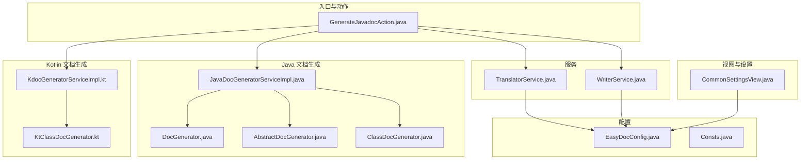
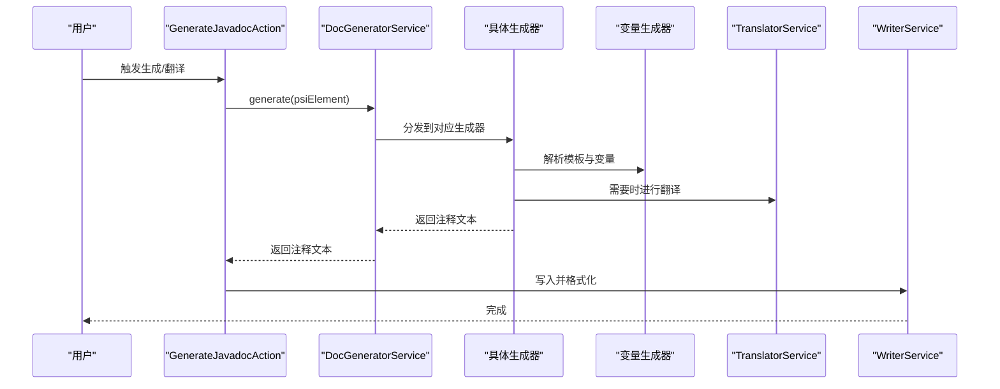
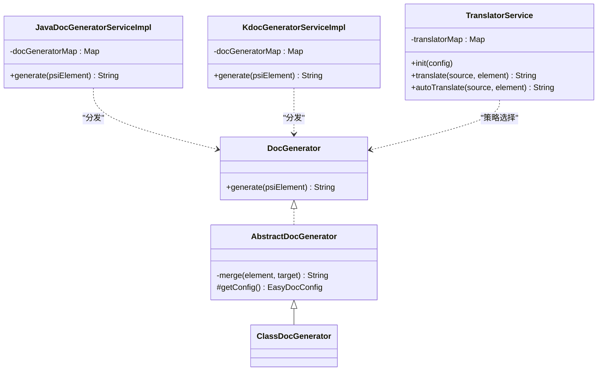
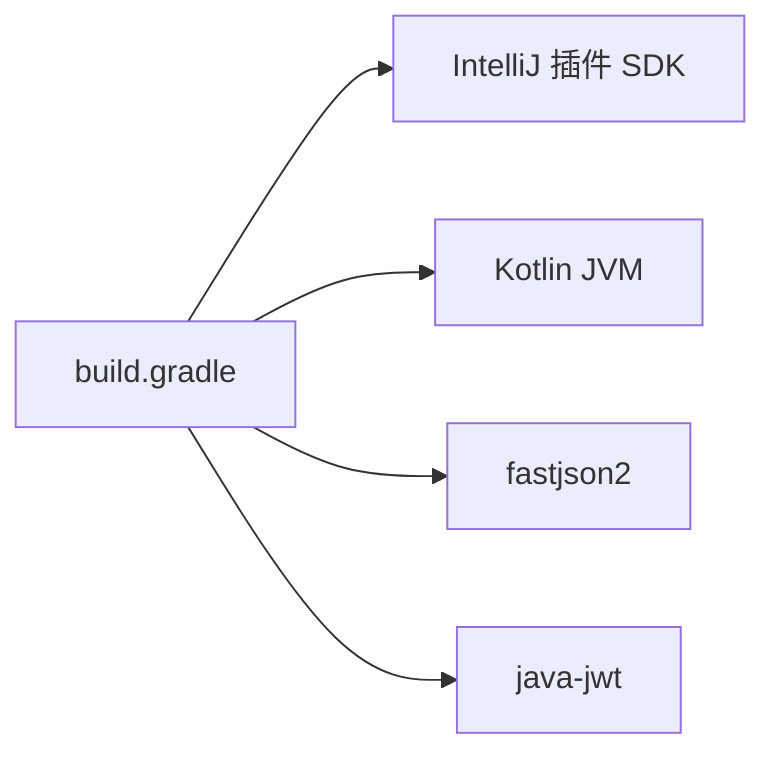

# 代码规范与最佳实践

<cite>
**本文引用的文件**   
- [Consts.java](file://src/main/java/com/star/easydoc/common/Consts.java)
- [EasyDocConfig.java](file://src/main/java/com/star/easydoc/config/EasyDocConfig.java)
- [GenerateJavadocAction.java](file://src/main/java/com/star/easydoc/action/GenerateJavadocAction.java)
- [JavaDocGeneratorServiceImpl.java](file://src/main/java/com/star/easydoc/javadoc/service/JavaDocGeneratorServiceImpl.java)
- [DocGenerator.java](file://src/main/java/com/star/easydoc/javadoc/service/generator/DocGenerator.java)
- [AbstractDocGenerator.java](file://src/main/java/com/star/easydoc/javadoc/service/generator/impl/AbstractDocGenerator.java)
- [ClassDocGenerator.java](file://src/main/java/com/star/easydoc/javadoc/service/generator/impl/ClassDocGenerator.java)
- [DocGeneratorService.java](file://src/main/java/com/star/easydoc/service/DocGeneratorService.java)
- [WriterService.java](file://src/main/java/com/star/easydoc/service/WriterService.java)
- [TranslatorService.java](file://src/main/java/com/star/easydoc/service/translator/TranslatorService.java)
- [CommonSettingsView.java](file://src/main/java/com/star/easydoc/view/settings/CommonSettingsView.java)
- [KdocGeneratorServiceImpl.kt](file://src/main/kotlin/com/star/easydoc/kdoc/service/KdocGeneratorServiceImpl.kt)
- [KtClassDocGenerator.kt](file://src/main/kotlin/com/star/easydoc/kdoc/service/generator/impl/KtClassDocGenerator.kt)
- [build.gradle](file://build.gradle)
- [settings.gradle](file://settings.gradle)
- [README.md](file://README.md)
</cite>

## 目录
1. [引言](#引言)
2. [项目结构](#项目结构)
3. [核心组件](#核心组件)
4. [架构总览](#架构总览)
5. [详细组件分析](#详细组件分析)
6. [依赖分析](#依赖分析)
7. [性能考虑](#性能考虑)
8. [故障排查指南](#故障排查指南)
9. [结论](#结论)
10. [附录](#附录)

## 引言
本指南面向 Easy Javadoc 插件的开发者与维护者，旨在建立统一的代码规范与最佳实践，涵盖 Java 与 Kotlin 的命名约定、包结构与文件命名、注释标准、代码格式化、异常处理与日志记录、设计模式应用（策略、工厂）、以及代码审查清单与质量保障措施。目标是提升代码一致性、可读性、可维护性与可扩展性。

## 项目结构
项目采用按职责分层与按语言混合开发的组织方式：
- action：IDEA 动作入口，负责触发生成流程与翻译交互
- common：通用常量与工具
- config：持久化配置模型与组件
- javadoc/kdoc：两类文档生成体系（Java Javadoc 与 Kotlin Kdoc），包含生成器与变量解析器
- service：业务服务（翻译、写入、包信息等）
- view/settings：设置页 UI 与配置导入导出
- resources：插件元数据与提示词资源
- build.gradle/settings.gradle：构建与版本管理

**图表来源**
- [GenerateJavadocAction.java:1-175](file://src/main/java/com/star/easydoc/action/GenerateJavadocAction.java#L1-L175)
- [JavaDocGeneratorServiceImpl.java:1-50](file://src/main/java/com/star/easydoc/javadoc/service/JavaDocGeneratorServiceImpl.java#L1-L50)
- [DocGenerator.java:1-20](file://src/main/java/com/star/easydoc/javadoc/service/generator/DocGenerator.java#L1-L20)
- [AbstractDocGenerator.java:1-80](file://src/main/java/com/star/easydoc/javadoc/service/generator/impl/AbstractDocGenerator.java#L1-L80)
- [ClassDocGenerator.java:1-116](file://src/main/java/com/star/easydoc/javadoc/service/generator/impl/ClassDocGenerator.java#L1-L116)
- [KdocGeneratorServiceImpl.kt:1-52](file://src/main/kotlin/com/star/easydoc/kdoc/service/KdocGeneratorServiceImpl.kt#L1-L52)
- [KtClassDocGenerator.kt:1-81](file://src/main/kotlin/com/star/easydoc/kdoc/service/generator/impl/KtClassDocGenerator.kt#L1-L81)
- [WriterService.java:1-139](file://src/main/java/com/star/easydoc/service/WriterService.java#L1-L139)
- [TranslatorService.java:1-238](file://src/main/java/com/star/easydoc/service/translator/TranslatorService.java#L1-L238)
- [CommonSettingsView.java:1-739](file://src/main/java/com/star/easydoc/view/settings/CommonSettingsView.java#L1-L739)
- [EasyDocConfig.java:1-680](file://src/main/java/com/star/easydoc/config/EasyDocConfig.java#L1-L680)
- [Consts.java:1-100](file://src/main/java/com/star/easydoc/common/Consts.java#L1-L100)

**章节来源**
- [README.md:1-266](file://README.md#L1-L266)
- [build.gradle:1-78](file://build.gradle#L1-L78)
- [settings.gradle:1-3](file://settings.gradle#L1-L3)

## 核心组件
- 动作入口：接收 IDE 快捷键事件，识别 Java/Kotlin 元素，调用对应生成器与写入器，并联动翻译服务
- 配置中心：集中管理作者、日期格式、模板、覆盖模式、翻译器与超时等配置
- 文档生成器：基于 PSI 元素类型分发到具体生成器；支持模板与变量替换、与已有注释合并
- 翻译服务：策略模式聚合多种翻译实现，支持自定义单词映射与整句/逐词翻译
- 写入服务：在事务中安全写入注释并格式化，处理空行与异常日志
- 设置视图：提供 UI 以导入/导出配置、切换翻译器、管理项目级单词映射

**章节来源**
- [GenerateJavadocAction.java:46-175](file://src/main/java/com/star/easydoc/action/GenerateJavadocAction.java#L46-L175)
- [EasyDocConfig.java:22-680](file://src/main/java/com/star/easydoc/config/EasyDocConfig.java#L22-L680)
- [JavaDocGeneratorServiceImpl.java:25-50](file://src/main/java/com/star/easydoc/javadoc/service/JavaDocGeneratorServiceImpl.java#L25-L50)
- [KdocGeneratorServiceImpl.kt:21-52](file://src/main/kotlin/com/star/easydoc/kdoc/service/KdocGeneratorServiceImpl.kt#L21-L52)
- [TranslatorService.java:41-238](file://src/main/java/com/star/easydoc/service/translator/TranslatorService.java#L41-L238)
- [WriterService.java:25-139](file://src/main/java/com/star/easydoc/service/WriterService.java#L25-L139)
- [CommonSettingsView.java:42-739](file://src/main/java/com/star/easydoc/view/settings/CommonSettingsView.java#L42-L739)

## 架构总览

**图表来源**
- [GenerateJavadocAction.java:71-175](file://src/main/java/com/star/easydoc/action/GenerateJavadocAction.java#L71-L175)
- [DocGeneratorService.java:11-21](file://src/main/java/com/star/easydoc/service/DocGeneratorService.java#L11-L21)
- [JavaDocGeneratorServiceImpl.java:35-48](file://src/main/java/com/star/easydoc/javadoc/service/JavaDocGeneratorServiceImpl.java#L35-L48)
- [ClassDocGenerator.java:44-93](file://src/main/java/com/star/easydoc/javadoc/service/generator/impl/ClassDocGenerator.java#L44-L93)
- [TranslatorService.java:157-163](file://src/main/java/com/star/easydoc/service/translator/TranslatorService.java#L157-L163)
- [WriterService.java:36-75](file://src/main/java/com/star/easydoc/service/WriterService.java#L36-L75)

## 详细组件分析

### 命名约定与包结构
- 包命名
  - 统一使用 com.star.easydoc 下的子包划分领域与层次，如 action、common、config、javadoc、kdoc、service、view
  - Kotlin 文件位于与 Java 对应的包路径下，保持层级一致
- 类与接口
  - 使用帕斯卡命名法（PascalCase），如 EasyDocConfig、JavaDocGeneratorServiceImpl、DocGenerator
  - 接口以名词或抽象概念命名，实现类以 Impl 结尾（如 AbstractDocGenerator、ClassDocGenerator）
- 方法与变量
  - 方法与变量使用驼峰命名法（camelCase），避免下划线
  - 常量使用全大写下划线风格（如 DEFAULT_DATE_FORMAT），枚举值同常量
- 文件命名
  - Java/Kotlin 类文件与类名一致
  - 资源文件（如提示词）置于 resources/prompts 下，按模块分目录
- 注解与枚举
  - 枚举值使用全大写与下划线风格，描述字段使用中文注释，便于 UI 显示

**章节来源**
- [Consts.java:14-100](file://src/main/java/com/star/easydoc/common/Consts.java#L14-L100)
- [EasyDocConfig.java:22-680](file://src/main/java/com/star/easydoc/config/EasyDocConfig.java#L22-L680)
- [DocGenerator.java:11-20](file://src/main/java/com/star/easydoc/javadoc/service/generator/DocGenerator.java#L11-L20)
- [AbstractDocGenerator.java:20-80](file://src/main/java/com/star/easydoc/javadoc/service/generator/impl/AbstractDocGenerator.java#L20-L80)
- [ClassDocGenerator.java:29-116](file://src/main/java/com/star/easydoc/javadoc/service/generator/impl/ClassDocGenerator.java#L29-L116)
- [KdocGeneratorServiceImpl.kt:21-52](file://src/main/kotlin/com/star/easydoc/kdoc/service/KdocGeneratorServiceImpl.kt#L21-L52)
- [KtClassDocGenerator.kt:16-81](file://src/main/kotlin/com/star/easydoc/kdoc/service/generator/impl/KtClassDocGenerator.kt#L16-L81)

### 注释标准
- 类注释
  - Java：使用标准 Javadoc 注释块，包含作者、日期、简要描述
  - Kotlin：使用 KDoc 注释块，包含作者、日期、构造函数与参数等
- 方法注释
  - @param/@return/@throws/@since/@version 等标签按需补充
  - 返回值模式支持 code/link/doc 三种模式，由配置控制
- 字段注释
  - 属性支持简单/复杂模式，复杂模式下包含参数与异常等标签
- 合并策略
  - 支持忽略、智能合并、强制覆盖三种模式，避免覆盖已有注释
- 模板与变量
  - 支持自定义模板与变量映射，变量类型支持固定值与 Groovy 脚本

**章节来源**
- [AbstractDocGenerator.java:29-71](file://src/main/java/com/star/easydoc/javadoc/service/generator/impl/AbstractDocGenerator.java#L29-L71)
- [EasyDocConfig.java:49-680](file://src/main/java/com/star/easydoc/config/EasyDocConfig.java#L49-L680)
- [ClassDocGenerator.java:37-68](file://src/main/java/com/star/easydoc/javadoc/service/generator/impl/ClassDocGenerator.java#L37-L68)
- [KtClassDocGenerator.kt:38-63](file://src/main/kotlin/com/star/easydoc/kdoc/service/generator/impl/KtClassDocGenerator.kt#L38-L63)

### 代码格式化与排版
- 编码与版本
  - Java/Kotlin 源码与构建均使用 UTF-8 编码，Java 目标版本为 17
- 缩进与换行
  - 使用空格缩进，统一两空格缩进
  - 行宽建议不超过 120 列，长表达式分行书写
  - 方法体与控制块大括号独占一行，条件语句与循环语句必须使用大括号
- 空白与对齐
  - 二元运算符两侧保留空格，逗号后保留空格
  - 变量声明与赋值尽量对齐，保持视觉整洁
- 文档注释格式
  - Javadoc/Kdoc 注释块统一使用星号开头的行，避免 IDE 默认格式化破坏结构
  - 若需保留特定顺序，可在 IDE 中关闭 Javadoc 格式化

**章节来源**
- [build.gradle:15-40](file://build.gradle#L15-L40)
- [WriterService.java:36-75](file://src/main/java/com/star/easydoc/service/WriterService.java#L36-L75)
- [README.md:71-85](file://README.md#L71-L85)

### 异常处理与日志记录
- 日志记录
  - 使用 Logger 记录错误堆栈，定位写入失败、IO 异常等问题
- 异常传播
  - 写入与翻译过程捕获 Throwable 并记录日志，避免中断用户操作
- 空值与边界
  - 对 PSI 元素、编辑器、文件等进行空值检查，防止空指针
- 超时与缓存
  - 提供超时配置与翻译缓存清理能力，减少网络请求开销

**章节来源**
- [WriterService.java:26, 72-74](file://src/main/java/com/star/easydoc/service/WriterService.java#L26,L72-L74)
- [CommonSettingsView.java:107-148](file://src/main/java/com/star/easydoc/view/settings/CommonSettingsView.java#L107-L148)
- [TranslatorService.java:234-237](file://src/main/java/com/star/easydoc/service/translator/TranslatorService.java#L234-L237)

### 设计模式应用
- 策略模式
  - 翻译服务通过 Map 将翻译器名称映射到具体实现，动态选择翻译器
- 工厂模式
  - 文档生成器通过 Map 将 PSI 元素类型映射到具体生成器，实现分发工厂
- 模板方法/抽象基类
  - 抽象生成器提供合并逻辑与配置访问，具体生成器专注模板与变量解析
- 单例/服务管理
  - 通过 ServiceManager 获取全局配置与服务实例，确保线程安全与生命周期管理

**图表来源**
- [DocGenerator.java:11-20](file://src/main/java/com/star/easydoc/javadoc/service/generator/DocGenerator.java#L11-L20)
- [AbstractDocGenerator.java:20-80](file://src/main/java/com/star/easydoc/javadoc/service/generator/impl/AbstractDocGenerator.java#L20-L80)
- [ClassDocGenerator.java:29-116](file://src/main/java/com/star/easydoc/javadoc/service/generator/impl/ClassDocGenerator.java#L29-L116)
- [JavaDocGeneratorServiceImpl.java:27-48](file://src/main/java/com/star/easydoc/javadoc/service/JavaDocGeneratorServiceImpl.java#L27-L48)
- [KdocGeneratorServiceImpl.kt:22-27](file://src/main/kotlin/com/star/easydoc/kdoc/service/KdocGeneratorServiceImpl.kt#L22-L27)
- [TranslatorService.java:60-77](file://src/main/java/com/star/easydoc/service/translator/TranslatorService.java#L60-L77)

**章节来源**
- [JavaDocGeneratorServiceImpl.java:27-48](file://src/main/java/com/star/easydoc/javadoc/service/JavaDocGeneratorServiceImpl.java#L27-L48)
- [KdocGeneratorServiceImpl.kt:22-27](file://src/main/kotlin/com/star/easydoc/kdoc/service/KdocGeneratorServiceImpl.kt#L22-L27)
- [TranslatorService.java:60-77](file://src/main/java/com/star/easydoc/service/translator/TranslatorService.java#L60-L77)

### 代码审查清单
- 命名与结构
  - 类/接口/方法/变量命名是否符合约定
  - 包结构是否清晰，职责是否单一
- 注释与文档
  - 是否包含必要的类/方法/参数注释
  - 模板与变量是否完整且可读
- 错误处理
  - 是否存在未捕获的异常与空值风险
  - 日志记录是否充分
- 性能与并发
  - 是否存在不必要的同步与锁
  - 翻译与 IO 是否异步或带超时
- 可测试性
  - 是否易于单元测试与集成测试
  - 是否有外部依赖（网络/文件）的隔离

## 依赖分析
- 外部依赖
  - fastjson2：用于配置序列化/反序列化
  - java-jwt：用于令牌处理（若启用）
- 构建与运行
  - IntelliJ 插件 SDK 版本与最低 IDEA 版本要求
  - Java/Kotlin 编译目标版本与编码统一

**图表来源**
- [build.gradle:58-61](file://build.gradle#L58-L61)

**章节来源**
- [build.gradle:1-78](file://build.gradle#L1-L78)
- [settings.gradle:1-3](file://settings.gradle#L1-L3)

## 性能考虑
- 翻译性能
  - 优先使用整句翻译，必要时再降级为逐词翻译
  - 提供超时配置与缓存清理，避免频繁网络请求
- 写入性能
  - 在单个 WriteCommandAction 中完成注释写入与格式化，减少 PSI 树变更次数
- 模板渲染
  - 模板与变量解析尽量复用，避免重复计算
- UI 响应
  - 导入/导出与配置刷新在后台执行，避免阻塞 UI 线程

**章节来源**
- [TranslatorService.java:85-111](file://src/main/java/com/star/easydoc/service/translator/TranslatorService.java#L85-L111)
- [WriterService.java:36-75](file://src/main/java/com/star/easydoc/service/WriterService.java#L36-L75)
- [CommonSettingsView.java:107-148](file://src/main/java/com/star/easydoc/view/settings/CommonSettingsView.java#L107-L148)

## 故障排查指南
- 快捷键无效
  - 确认光标位于类/方法/属性上，而非选中文本或鼠标点击
  - 检查 IDEA 快捷键是否与 AI Assistant 冲突
- 注释未生成或被覆盖
  - 检查覆盖模式配置（忽略/智能合并/强制覆盖）
  - 若使用 AI 翻译，确认提示词资源加载成功
- 翻译结果不准确
  - 使用自定义单词映射提升关键术语翻译质量
  - 切换翻译器或调整超时设置
- 格式化问题
  - 关闭 IDE 的 Javadoc 格式化，或在模板中保留期望顺序
  - 单行注释可能被格式化为多行，需调整 IDE 格式化设置

**章节来源**
- [README.md:71-85](file://README.md#L71-L85)
- [AbstractDocGenerator.java:29-71](file://src/main/java/com/star/easydoc/javadoc/service/generator/impl/AbstractDocGenerator.java#L29-L71)
- [CommonSettingsView.java:107-148](file://src/main/java/com/star/easydoc/view/settings/CommonSettingsView.java#L107-L148)

## 结论
通过统一命名与包结构、严格的注释与模板规范、健壮的异常与日志处理、清晰的设计模式应用与性能优化，以及完善的代码审查与故障排查机制，Easy Javadoc 插件能够在保持高可维护性的同时，持续提升用户体验与开发效率。建议在团队内推广并定期回顾这些规范，确保代码质量稳定提升。

## 附录
- 配置项概览（节选）
  - 作者、日期格式、模板开关与模板内容、覆盖模式、翻译器与密钥、超时、单词映射、项目级单词映射
- 常用常量（节选）
  - 基础类型集合、停用词、默认日期格式、可用翻译器集合、AI 翻译器集合

**章节来源**
- [EasyDocConfig.java:49-680](file://src/main/java/com/star/easydoc/config/EasyDocConfig.java#L49-L680)
- [Consts.java:14-100](file://src/main/java/com/star/easydoc/common/Consts.java#L14-L100)