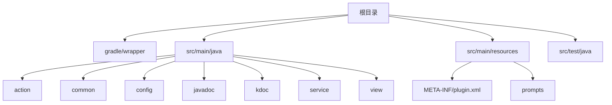
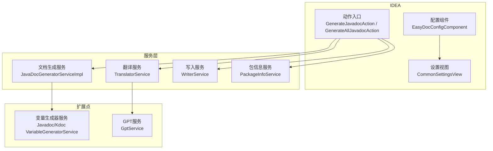
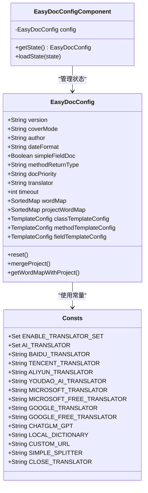
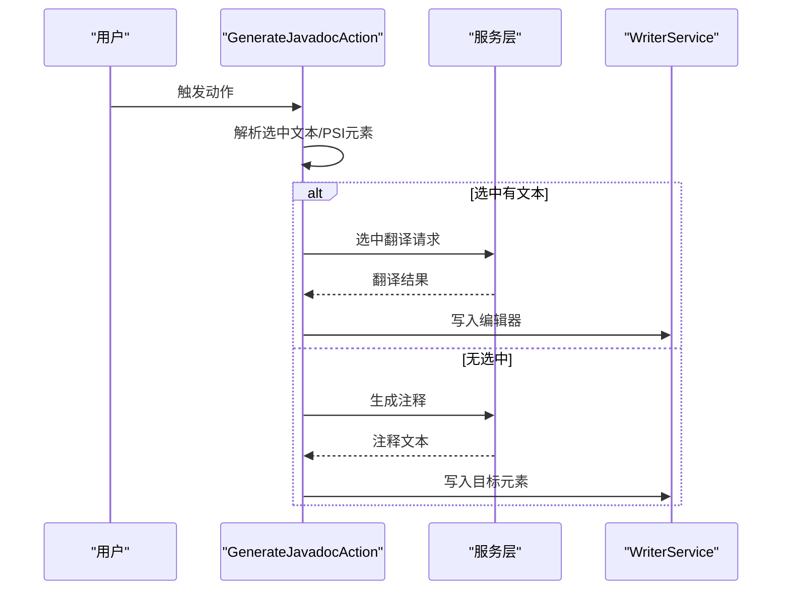
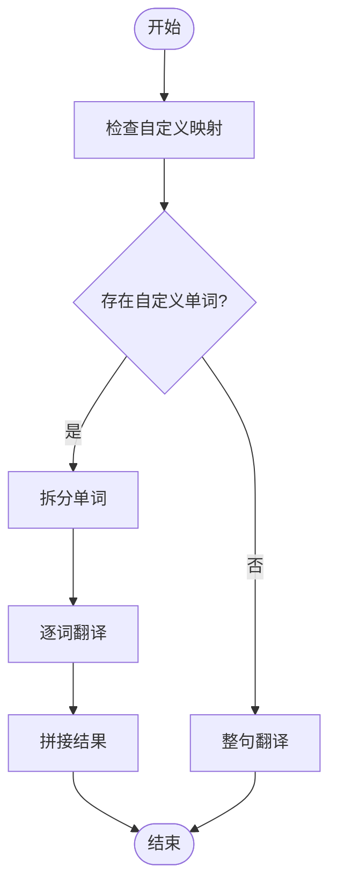
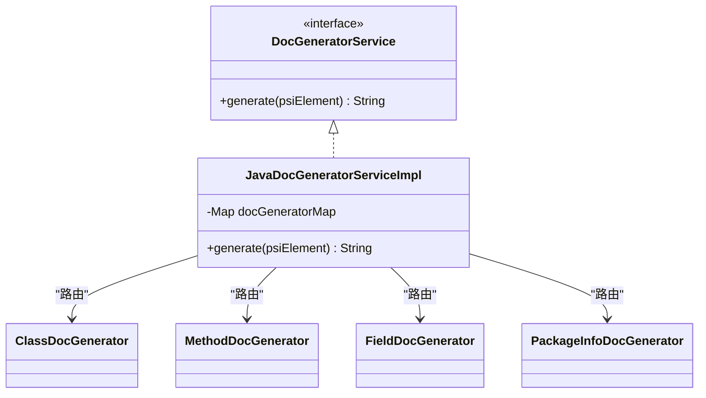
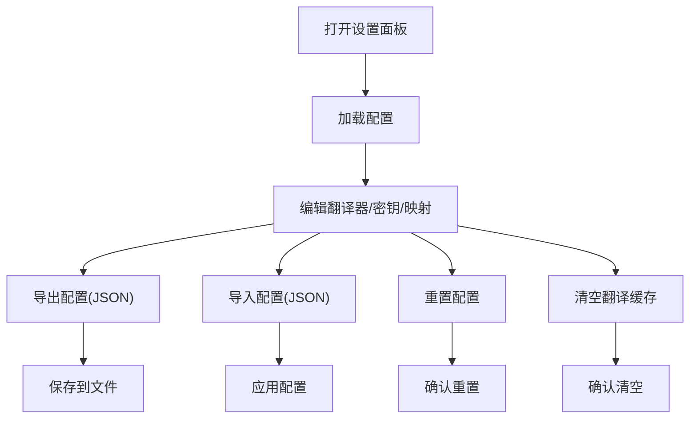
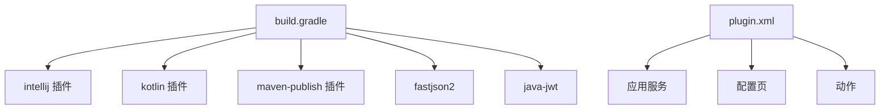

# 开发指南

<cite>
**本文引用的文件**
- [README.md](file://README.md)
- [build.gradle](file://build.gradle)
- [settings.gradle](file://settings.gradle)
- [gradle-wrapper.properties](file://gradle/wrapper/gradle-wrapper.properties)
- [plugin.xml](file://src/main/resources/META-INF/plugin.xml)
- [EasyDocConfig.java](file://src/main/java/com/star/easydoc/config/EasyDocConfig.java)
- [EasyDocConfigComponent.java](file://src/main/java/com/star/easydoc/config/EasyDocConfigComponent.java)
- [Consts.java](file://src/main/java/com/star/easydoc/common/Consts.java)
- [GenerateJavadocAction.java](file://src/main/java/com/star/easydoc/action/GenerateJavadocAction.java)
- [GenerateAllJavadocAction.java](file://src/main/java/com/star/easydoc/action/GenerateAllJavadocAction.java)
- [TranslatorService.java](file://src/main/java/com/star/easydoc/service/translator/TranslatorService.java)
- [JavaDocGeneratorServiceImpl.java](file://src/main/java/com/star/easydoc/javadoc/service/JavaDocGeneratorServiceImpl.java)
- [DocGeneratorService.java](file://src/main/java/com/star/easydoc/service/DocGeneratorService.java)
- [CommonSettingsView.java](file://src/main/java/com/star/easydoc/view/settings/CommonSettingsView.java)
- [MainTest.java](file://src/test/java/com/star/easydoc/MainTest.java)
</cite>

## 目录
1. [简介](#简介)
2. [项目结构](#项目结构)
3. [核心组件](#核心组件)
4. [架构总览](#架构总览)
5. [详细组件分析](#详细组件分析)
6. [依赖分析](#依赖分析)
7. [性能考量](#性能考量)
8. [故障排查指南](#故障排查指南)
9. [结论](#结论)
10. [附录](#附录)

## 简介
本指南面向 Easy Javadoc 插件的开发者，提供从环境搭建、代码规范与最佳实践、构建与打包、调试与测试到扩展开发的全流程说明。插件支持在 IntelliJ IDEA 中为 Java/Kotlin 代码生成 Javadoc/Kdoc 注释，并提供多种翻译器与自定义变量生成器能力。

## 项目结构
该仓库采用按模块与职责分层的组织方式：
- 根目录包含构建脚本与说明文档
- 主程序位于 src/main/java，按功能划分为 action、common、config、javadoc、kdoc、service、view 等包
- 资源文件位于 src/main/resources，包含插件声明与提示模板
- 测试位于 src/test/java

**图表来源**
- [plugin.xml:1-82](file://src/main/resources/META-INF/plugin.xml#L1-L82)
- [build.gradle:1-78](file://build.gradle#L1-L78)

**章节来源**
- [build.gradle:1-78](file://build.gradle#L1-L78)
- [settings.gradle:1-3](file://settings.gradle#L1-L3)

## 核心组件
- 配置与常量
  - EasyDocConfig：持久化配置对象，涵盖作者、日期格式、模板、覆盖模式、翻译器与密钥、超时、单词映射、项目级单词映射等
  - EasyDocConfigComponent：基于 IntelliJ PersistentStateComponent 的配置持久化组件
  - Consts：常量与可用翻译器集合
- 动作与入口
  - GenerateJavadocAction：单元素注释生成与选中翻译
  - GenerateAllJavadocAction：批量生成注释（类/方法/属性/内部类）
- 服务层
  - JavaDocGeneratorServiceImpl：根据 PSI 元素类型路由到具体生成器
  - TranslatorService：统一翻译入口，支持多种翻译器与自定义映射
  - DocGeneratorService：文档生成服务接口
- 视图与设置
  - CommonSettingsView：通用设置面板，支持导入/导出、重置、清空缓存、翻译器密钥配置、单词映射与项目级映射维护

**章节来源**
- [EasyDocConfig.java:1-680](file://src/main/java/com/star/easydoc/config/EasyDocConfig.java#L1-L680)
- [EasyDocConfigComponent.java:1-69](file://src/main/java/com/star/easydoc/config/EasyDocConfigComponent.java#L1-L69)
- [Consts.java:1-100](file://src/main/java/com/star/easydoc/common/Consts.java#L1-L100)
- [GenerateJavadocAction.java:1-175](file://src/main/java/com/star/easydoc/action/GenerateJavadocAction.java#L1-L175)
- [GenerateAllJavadocAction.java:1-218](file://src/main/java/com/star/easydoc/action/GenerateAllJavadocAction.java#L1-L218)
- [JavaDocGeneratorServiceImpl.java:1-50](file://src/main/java/com/star/easydoc/javadoc/service/JavaDocGeneratorServiceImpl.java#L1-L50)
- [TranslatorService.java:1-238](file://src/main/java/com/star/easydoc/service/translator/TranslatorService.java#L1-L238)
- [DocGeneratorService.java:1-21](file://src/main/java/com/star/easydoc/service/DocGeneratorService.java#L1-L21)
- [CommonSettingsView.java:1-739](file://src/main/java/com/star/easydoc/view/settings/CommonSettingsView.java#L1-L739)

## 架构总览
插件通过 IntelliJ 插件机制注册动作与配置项，运行时由动作触发服务层逻辑，服务层调用翻译与生成器完成注释生成与写入。

**图表来源**
- [plugin.xml:27-53](file://src/main/resources/META-INF/plugin.xml#L27-L53)
- [GenerateJavadocAction.java:46-175](file://src/main/java/com/star/easydoc/action/GenerateJavadocAction.java#L46-L175)
- [GenerateAllJavadocAction.java:47-218](file://src/main/java/com/star/easydoc/action/GenerateAllJavadocAction.java#L47-L218)
- [JavaDocGeneratorServiceImpl.java:25-50](file://src/main/java/com/star/easydoc/javadoc/service/JavaDocGeneratorServiceImpl.java#L25-L50)
- [TranslatorService.java:41-238](file://src/main/java/com/star/easydoc/service/translator/TranslatorService.java#L41-L238)
- [CommonSettingsView.java:42-739](file://src/main/java/com/star/easydoc/view/settings/CommonSettingsView.java#L42-L739)

## 详细组件分析

### 配置与持久化
- EasyDocConfig 提供丰富的配置项，包括覆盖模式、作者与日期格式、模板配置、翻译器与密钥、超时、单词映射与项目级映射等
- EasyDocConfigComponent 实现 PersistentStateComponent，负责初始化与加载状态
- Consts 定义可用翻译器集合与基础常量

**图表来源**
- [EasyDocConfig.java:22-680](file://src/main/java/com/star/easydoc/config/EasyDocConfig.java#L22-L680)
- [EasyDocConfigComponent.java:20-69](file://src/main/java/com/star/easydoc/config/EasyDocConfigComponent.java#L20-L69)
- [Consts.java:29-99](file://src/main/java/com/star/easydoc/common/Consts.java#L29-L99)

**章节来源**
- [EasyDocConfig.java:1-680](file://src/main/java/com/star/easydoc/config/EasyDocConfig.java#L1-L680)
- [EasyDocConfigComponent.java:1-69](file://src/main/java/com/star/easydoc/config/EasyDocConfigComponent.java#L1-L69)
- [Consts.java:1-100](file://src/main/java/com/star/easydoc/common/Consts.java#L1-L100)

### 动作与交互流程
- GenerateJavadocAction：处理选中翻译与单元素注释生成；对 Java/Kotlin 文件分别调用对应生成器
- GenerateAllJavadocAction：批量生成，支持类/方法/属性/内部类选择，支持包描述生成

**图表来源**
- [GenerateJavadocAction.java:71-175](file://src/main/java/com/star/easydoc/action/GenerateJavadocAction.java#L71-L175)

**章节来源**
- [GenerateJavadocAction.java:1-175](file://src/main/java/com/star/easydoc/action/GenerateJavadocAction.java#L1-L175)
- [GenerateAllJavadocAction.java:1-218](file://src/main/java/com/star/easydoc/action/GenerateAllJavadocAction.java#L1-L218)

### 翻译服务与扩展点
- TranslatorService 统一管理多种翻译器，支持自定义单词映射与整句/单词级翻译策略
- 支持的翻译器类型由 Consts 定义，如百度、腾讯、阿里云、有道、微软、谷歌、本地词典、自定义 URL、仅单词分割、关闭翻译等

**图表来源**
- [TranslatorService.java:85-111](file://src/main/java/com/star/easydoc/service/translator/TranslatorService.java#L85-L111)
- [Consts.java:29-99](file://src/main/java/com/star/easydoc/common/Consts.java#L29-L99)

**章节来源**
- [TranslatorService.java:1-238](file://src/main/java/com/star/easydoc/service/translator/TranslatorService.java#L1-L238)
- [Consts.java:1-100](file://src/main/java/com/star/easydoc/common/Consts.java#L1-L100)

### 文档生成器与变量生成器
- JavaDocGeneratorServiceImpl 根据 PSI 元素类型选择对应 DocGenerator（类/方法/属性/包信息）
- DocGeneratorService 为生成器服务接口，便于扩展新的生成器

**图表来源**
- [DocGeneratorService.java:11-21](file://src/main/java/com/star/easydoc/service/DocGeneratorService.java#L11-L21)
- [JavaDocGeneratorServiceImpl.java:25-50](file://src/main/java/com/star/easydoc/javadoc/service/JavaDocGeneratorServiceImpl.java#L25-L50)

**章节来源**
- [DocGeneratorService.java:1-21](file://src/main/java/com/star/easydoc/service/DocGeneratorService.java#L1-L21)
- [JavaDocGeneratorServiceImpl.java:1-50](file://src/main/java/com/star/easydoc/javadoc/service/JavaDocGeneratorServiceImpl.java#L1-L50)

### 设置面板与导入导出
- CommonSettingsView 提供翻译器选择、密钥输入、超时设置、单词映射与项目级映射维护、导入/导出配置、重置与清空缓存等功能

**图表来源**
- [CommonSettingsView.java:107-211](file://src/main/java/com/star/easydoc/view/settings/CommonSettingsView.java#L107-L211)

**章节来源**
- [CommonSettingsView.java:1-739](file://src/main/java/com/star/easydoc/view/settings/CommonSettingsView.java#L1-L739)

## 依赖分析
- 构建与运行
  - Gradle 插件：intellij、kotlin、maven-publish
  - JDK 版本：17（源/目标/编译选项）
  - IDEA 版本：2023.1（IC）
  - 依赖：fastjson2、java-jwt
- 插件声明
  - 在 plugin.xml 中注册应用服务、配置页与动作

**图表来源**
- [build.gradle:1-78](file://build.gradle#L1-L78)
- [plugin.xml:27-82](file://src/main/resources/META-INF/plugin.xml#L27-L82)

**章节来源**
- [build.gradle:1-78](file://build.gradle#L1-L78)
- [plugin.xml:1-82](file://src/main/resources/META-INF/plugin.xml#L1-L82)

## 性能考量
- 翻译缓存：通过 TranslatorService.clearCache 清理缓存，避免重复网络请求
- 生成策略：整句翻译通常优于单词级翻译，但在存在自定义映射时优先单词级以提升准确性
- 批量生成：GenerateAllJavadocAction 支持按需选择生成范围，减少不必要的处理

**章节来源**
- [TranslatorService.java:234-237](file://src/main/java/com/star/easydoc/service/translator/TranslatorService.java#L234-L237)
- [GenerateAllJavadocAction.java:114-136](file://src/main/java/com/star/easydoc/action/GenerateAllJavadocAction.java#L114-L136)

## 故障排查指南
- 快捷键无效
  - 确认光标置于类/方法/属性上，而非选中文本
  - 检查 IDEA 快捷键设置是否存在冲突
- 单行注释不生效
  - 修改 IDEA 格式化设置，避免将单行注释转换为多行
- Javadoc 标签顺序被格式化
  - 关闭 IDEA 的 Javadoc 格式化，保留自定义顺序
- 网络翻译失败
  - 检查翻译器密钥与网络代理设置
  - 清空翻译缓存后重试

**章节来源**
- [README.md:71-84](file://README.md#L71-L84)

## 结论
本指南提供了 Easy Javadoc 插件的开发与扩展路径，涵盖环境搭建、代码结构、服务层设计、配置持久化、动作交互、翻译与生成器扩展、设置面板与测试等方面。遵循本文档可高效完成二次开发与功能扩展。

## 附录

### 开发环境搭建
- JDK 版本：17
- IDE：IntelliJ IDEA（建议使用 2023.1 或以上）
- Gradle：使用仓库内 gradle-wrapper.properties 指定的版本
- 插件开发工具：JetBrains IntelliJ Platform Plugin

**章节来源**
- [build.gradle:15-56](file://build.gradle#L15-L56)
- [gradle-wrapper.properties:1-7](file://gradle/wrapper/gradle-wrapper.properties#L1-L7)
- [README.md:6-7](file://README.md#L6-L7)

### 代码规范与最佳实践
- 命名约定
  - 类与接口：帕斯卡命名（如 JavaDocGeneratorServiceImpl）
  - 方法与变量：驼峰命名（如 generateJavadoc、translatorService）
  - 常量：全大写+下划线（如 ENABLE_TRANSLATOR_SET）
- 代码结构
  - 按功能分层：action（动作）、service（服务）、config（配置）、view（UI）、javadoc/kdoc（语言特化）
  - 服务接口化：DocGeneratorService、WriterService 等
- 注释标准
  - 公共 API 与复杂逻辑应提供清晰注释
  - 配置项与常量需标注用途与取值范围

### 构建与打包
- 构建命令
  - 使用 Gradle 构建插件
  - 可选：fatJar 任务生成包含依赖的打包产物
- 发布准备
  - 更新版本号与变更日志
  - 通过 maven-publish 配置发布到公共仓库（如适用）

**章节来源**
- [build.gradle:1-78](file://build.gradle#L1-L78)

### 调试与测试
- 单元测试
  - 项目包含基础测试入口 MainTest，建议在此基础上扩展断言与模拟
- 集成测试
  - 在 IDEA 中运行插件并手动验证动作、生成器与翻译器行为
- 性能测试
  - 对翻译器与生成器进行批量注释生成，观察耗时与内存占用

**章节来源**
- [MainTest.java:1-18](file://src/test/java/com/star/easydoc/MainTest.java#L1-L18)

### 扩展开发指南
- 自定义翻译器
  - 新增实现 Translator 接口的类，并在 TranslatorService 初始化时注册
  - 在 Consts 中新增翻译器标识
- 自定义生成器
  - 实现 DocGenerator 接口，并在 JavaDocGeneratorServiceImpl 中注册类型映射
- 自定义变量生成器
  - 利用 Javadoc/Kdoc VariableGeneratorService 的扩展点，实现变量替换逻辑

**章节来源**
- [TranslatorService.java:52-77](file://src/main/java/com/star/easydoc/service/translator/TranslatorService.java#L52-L77)
- [JavaDocGeneratorServiceImpl.java:27-33](file://src/main/java/com/star/easydoc/javadoc/service/JavaDocGeneratorServiceImpl.java#L27-L33)
- [plugin.xml:35-37](file://src/main/resources/META-INF/plugin.xml#L35-L37)