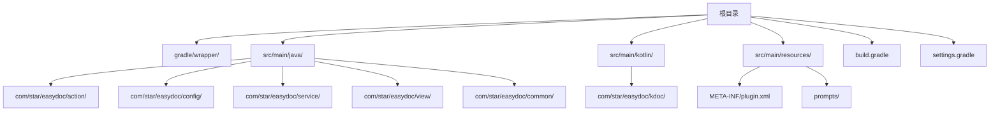
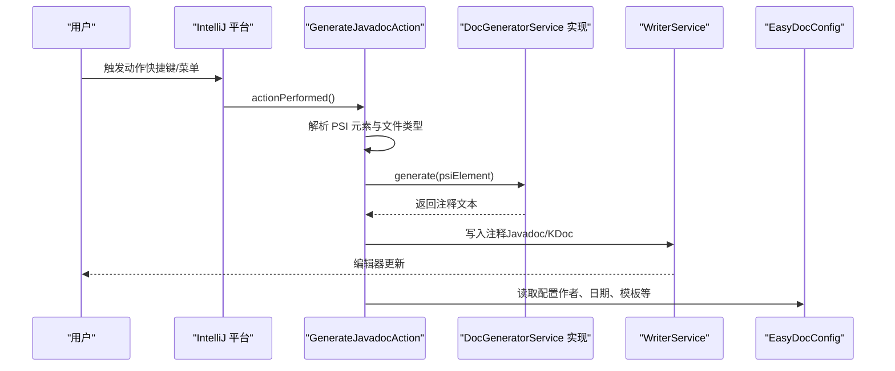
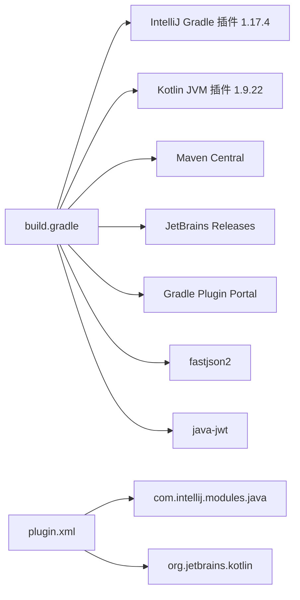
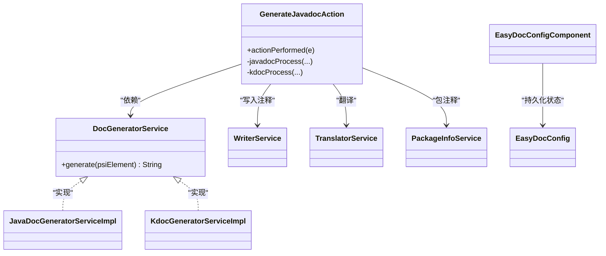

# 开发环境搭建

<cite>
**本文引用的文件**
- [build.gradle](file://build.gradle)
- [settings.gradle](file://settings.gradle)
- [gradle-wrapper.properties](file://gradle/wrapper/gradle-wrapper.properties)
- [plugin.xml](file://src/main/resources/META-INF/plugin.xml)
- [README.md](file://README.md)
- [GenerateJavadocAction.java](file://src/main/java/com/star/easydoc/action/GenerateJavadocAction.java)
- [DocGeneratorService.java](file://src/main/java/com/star/easydoc/service/DocGeneratorService.java)
- [EasyDocConfig.java](file://src/main/java/com/star/easydoc/config/EasyDocConfig.java)
- [EasyDocConfigComponent.java](file://src/main/java/com/star/easydoc/config/EasyDocConfigComponent.java)
- [KdocGeneratorServiceImpl.kt](file://src/main/kotlin/com/star/easydoc/kdoc/service/KdocGeneratorServiceImpl.kt)
</cite>

## 目录
1. [简介](#简介)
2. [项目结构](#项目结构)
3. [核心组件](#核心组件)
4. [架构总览](#架构总览)
5. [详细组件分析](#详细组件分析)
6. [依赖分析](#依赖分析)
7. [性能考虑](#性能考虑)
8. [故障排除指南](#故障排除指南)
9. [结论](#结论)
10. [附录](#附录)

## 简介
本指南面向希望参与 Easy Javadoc 插件开发的工程师，提供从零搭建开发环境的完整步骤与注意事项。重点涵盖：
- JDK 17 的安装与配置、环境变量设置与版本验证
- IntelliJ IDEA 的安装与必要插件配置（Gradle、Kotlin）
- Gradle 构建工具的使用与 Gradle Wrapper 版本管理
- 项目克隆与导入流程、同步依赖与常见问题排查
- 支持 Java 与 Kotlin 源码编译的开发环境配置
- 环境验证清单与故障排除建议

## 项目结构
该项目为 IntelliJ IDEA 插件工程，采用 Gradle 构建，源码分为 Java 与 Kotlin 两部分，并通过 Gradle 插件与 Intellij Plugin SDK 进行集成。

图表来源
- [settings.gradle:1-3](file://settings.gradle#L1-L3)
- [plugin.xml:1-82](file://src/main/resources/META-INF/plugin.xml#L1-L82)

章节来源
- [settings.gradle:1-3](file://settings.gradle#L1-L3)
- [plugin.xml:1-82](file://src/main/resources/META-INF/plugin.xml#L1-L82)

## 核心组件
- 构建与运行时要求
  - Java 源/目标兼容性：JDK 17
  - Kotlin 编译目标：JVM 17
  - IDE 版本：最低支持 2023.1（IC）
  - 插件依赖：IntelliJ 平台模块 java 与 Kotlin
- 关键构建配置
  - Gradle Wrapper：gradle-8.14
  - Gradle 插件：IntelliJ Gradle 插件、Kotlin JVM 插件
  - 仓库：Maven Central、JetBrains Releases/Snapshots、Gradle Plugin Portal
- 源码组织
  - Java：核心逻辑、动作、配置、服务与视图
  - Kotlin：KDoc 生成器与变量生成器
  - 资源：插件声明、提示词模板

章节来源
- [build.gradle:15-56](file://build.gradle#L15-L56)
- [gradle-wrapper.properties:1-7](file://gradle/wrapper/gradle-wrapper.properties#L1-L7)
- [plugin.xml:25-82](file://src/main/resources/META-INF/plugin.xml#L25-L82)

## 架构总览
插件通过 IntelliJ 平台提供的 Action 机制触发生成逻辑；根据 PSI 元素类型（Java 或 Kotlin），调用对应的生成器生成注释并写回编辑器。

图表来源
- [GenerateJavadocAction.java:71-175](file://src/main/java/com/star/easydoc/action/GenerateJavadocAction.java#L71-L175)
- [DocGeneratorService.java:11-21](file://src/main/java/com/star/easydoc/service/DocGeneratorService.java#L11-L21)
- [EasyDocConfig.java:22-200](file://src/main/java/com/star/easydoc/config/EasyDocConfig.java#L22-L200)

## 详细组件分析

### JDK 17 安装与配置
- 安装要求
  - 使用 JDK 17（源/目标兼容性与 Kotlin 目标均需 17）
  - 确保 JAVA_HOME 指向 JDK 17 安装目录
- 环境变量设置
  - Windows/Linux/macOS：设置 JAVA_HOME 指向 JDK 17
  - 将 %JAVA_HOME%/bin（Windows）或 $JAVA_HOME/bin（Linux/macOS）加入 PATH
- 版本验证
  - 在终端执行 java -version 与 javac -version，确认输出为 JDK 17.x
- IDE 集成
  - 在 IntelliJ IDEA 中设置 Project SDK 为 JDK 17
  - 设置 Project Language Level 为 17
  - 设置 Project bytecode version 为 17

章节来源
- [build.gradle:15-26](file://build.gradle#L15-L26)
- [build.gradle:28-40](file://build.gradle#L28-L40)

### IntelliJ IDEA 安装与配置
- 安装要求
  - 最低版本：2023.1（IC）
  - 插件：Gradle、Kotlin
- 插件市场安装
  - 打开 Settings/Preferences > Plugins，搜索并安装 Gradle、Kotlin
- 项目导入
  - File > Open，选择项目根目录
  - 选择 “Open as Project”，等待 Gradle 同步完成
- 验证
  - 确认 Gradle 工具窗口显示任务列表
  - 确认项目结构包含 src/main/java 与 src/main/kotlin

章节来源
- [plugin.xml:51-56](file://src/main/resources/META-INF/plugin.xml#L51-L56)
- [README.md:7-7](file://README.md#L7-L7)

### Gradle 构建工具与 Gradle Wrapper
- Gradle Wrapper 版本
  - 当前使用 gradle-8.14
  - 修改 distributionUrl 可升级/降级 Gradle 版本
- 常用命令
  - ./gradlew build：构建插件
  - ./gradlew runIde：启动 IDE 实例进行调试
  - ./gradlew clean：清理构建产物
- 仓库与插件
  - Maven Central、JetBrains Releases/Snapshots、Gradle Plugin Portal
  - IntelliJ Gradle 插件版本：1.17.4
  - Kotlin JVM 插件版本：1.9.22

章节来源
- [gradle-wrapper.properties:1-7](file://gradle/wrapper/gradle-wrapper.properties#L1-L7)
- [build.gradle:1-6](file://build.gradle#L1-L6)
- [build.gradle:42-56](file://build.gradle#L42-L56)

### 项目克隆与导入步骤
- 克隆仓库
  - git clone <仓库地址>
  - 进入项目根目录
- 导入项目
  - 打开 IntelliJ IDEA，选择 “Open”
  - 选择项目根目录，勾选 “Open as Project”
  - 等待 Gradle 同步完成（首次可能较慢）
- 同步依赖
  - 若依赖下载失败，检查网络与代理设置
  - 清理缓存后重试：File > Invalidate Caches and Restart
- 常见问题
  - Gradle 版本不匹配：更新 gradle-wrapper.properties 中的 distributionUrl
  - 仓库不可达：检查网络或配置企业代理
  - Kotlin/Java 版本不兼容：确保 JDK 17 且 Gradle 使用 JDK 17

章节来源
- [gradle-wrapper.properties:1-7](file://gradle/wrapper/gradle-wrapper.properties#L1-L7)
- [build.gradle:42-56](file://build.gradle#L42-L56)

### Java 与 Kotlin 源码编译配置
- Java 编译
  - sourceCompatibility/targetCompatibility：17
  - UTF-8 编码
- Kotlin 编译
  - jvmTarget：17
  - apiVersion/languageVersion：1.8
- 源集与资源
  - Java 源码位于 src/main/java
  - Kotlin 源码位于 src/main/kotlin
  - 资源位于 src/main/resources

章节来源
- [build.gradle:15-40](file://build.gradle#L15-L40)

### 开发环境验证清单
- 环境变量
  - JAVA_HOME 指向 JDK 17
  - PATH 包含 %JAVA_HOME%/bin 或 $JAVA_HOME/bin
- IDE 配置
  - Project SDK：JDK 17
  - Language Level：17
  - Gradle JDK：JDK 17
- 构建验证
  - ./gradlew build 成功
  - ./gradlew runIde 能启动 IDE 实例
- 功能验证
  - 在 IDE 中打开项目，执行 GenerateJavadocAction，验证注释生成与写入

章节来源
- [build.gradle:15-40](file://build.gradle#L15-L40)
- [plugin.xml:51-56](file://src/main/resources/META-INF/plugin.xml#L51-L56)

## 依赖分析
- 构建插件
  - org.jetbrains.intellij：1.17.4
  - org.jetbrains.kotlin.jvm：1.9.22
- 仓库
  - mavenCentral()
  - JetBrains Releases/Snapshots
  - gradlePluginPortal()
- 运行时依赖
  - fastjson2：JSON 处理
  - java-jwt：JWT 工具
- IDE 依赖
  - com.intellij.modules.java
  - org.jetbrains.kotlin

图表来源
- [build.gradle:1-6](file://build.gradle#L1-L6)
- [build.gradle:42-61](file://build.gradle#L42-L61)
- [plugin.xml:51-82](file://src/main/resources/META-INF/plugin.xml#L51-L82)

章节来源
- [build.gradle:1-6](file://build.gradle#L1-L6)
- [build.gradle:42-61](file://build.gradle#L42-L61)
- [plugin.xml:51-82](file://src/main/resources/META-INF/plugin.xml#L51-L82)

## 性能考虑
- 构建性能
  - 使用 Gradle Wrapper 统一版本，避免跨机器差异
  - 合理配置 Gradle Daemon 与并行构建参数
- 运行性能
  - 避免在主线程执行耗时网络请求
  - 合理缓存翻译结果与模板解析结果
- 资源与编码
  - 统一 UTF-8 编码，减少字符集转换开销

## 故障排除指南
- JDK 版本不匹配
  - 症状：编译报错或运行时报错
  - 处理：确保 JAVA_HOME 指向 JDK 17，IDE 项目 SDK 也为 JDK 17
- Gradle 同步失败
  - 症状：Gradle 无法解析依赖或下载失败
  - 处理：检查网络与代理；清理 Gradle 缓存；更新 gradle-wrapper.properties
- IDE 版本过低
  - 症状：插件无法加载或功能异常
  - 处理：升级到 2023.1 或更高版本
- 快捷键无效
  - 症状：触发动作无响应
  - 处理：确认快捷键未被其他功能占用；将光标置于正确元素上
- 翻译/网络问题
  - 症状：翻译失败或超时
  - 处理：检查翻译服务配置与网络连通性；调整超时参数

章节来源
- [README.md:71-84](file://README.md#L71-L84)
- [plugin.xml:51-56](file://src/main/resources/META-INF/plugin.xml#L51-L56)

## 结论
按照本指南完成 JDK 17、IntelliJ IDEA、Gradle Wrapper 的安装与配置，并正确导入项目后，即可顺利进行 Easy Javadoc 插件的开发与调试。遇到问题时，优先核对 JDK/Gradle/IDE 版本与依赖仓库可达性，再结合故障排除清单逐项排查。

## 附录

### 关键类关系概览

图表来源
- [DocGeneratorService.java:11-21](file://src/main/java/com/star/easydoc/service/DocGeneratorService.java#L11-L21)
- [GenerateJavadocAction.java:46-175](file://src/main/java/com/star/easydoc/action/GenerateJavadocAction.java#L46-L175)
- [KdocGeneratorServiceImpl.kt:21-52](file://src/main/kotlin/com/star/easydoc/kdoc/service/KdocGeneratorServiceImpl.kt#L21-L52)
- [EasyDocConfig.java:22-200](file://src/main/java/com/star/easydoc/config/EasyDocConfig.java#L22-L200)
- [EasyDocConfigComponent.java:19-22](file://src/main/java/com/star/easydoc/config/EasyDocConfigComponent.java#L19-L22)