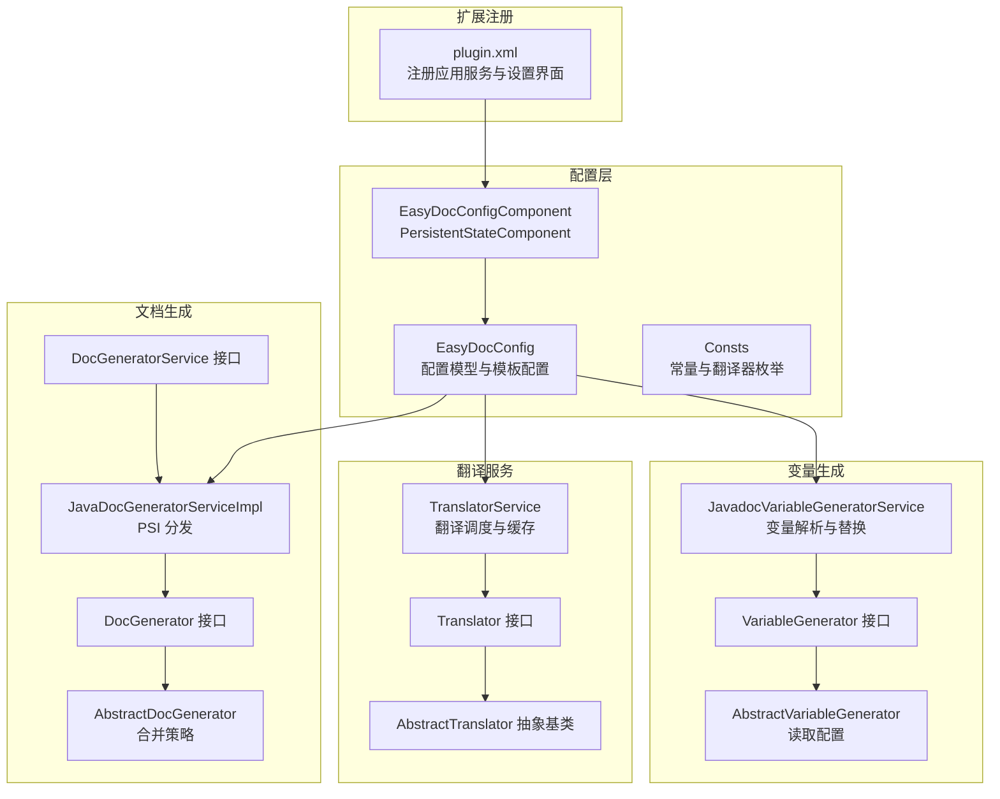
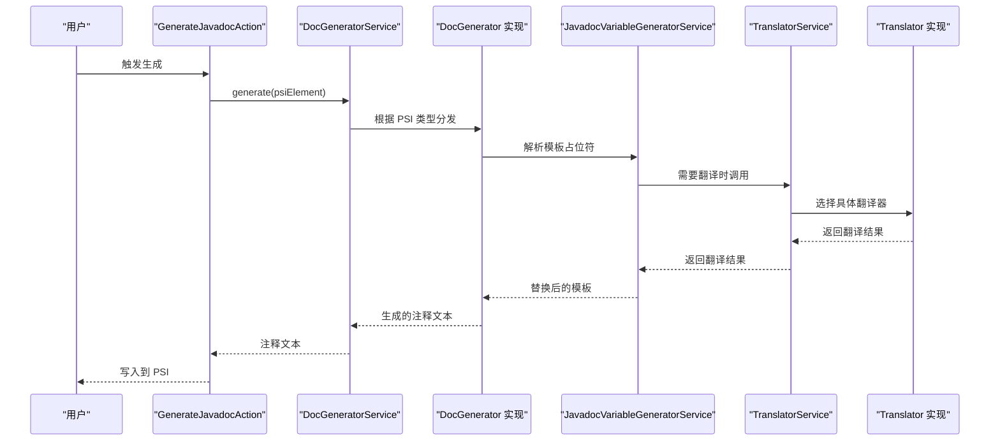
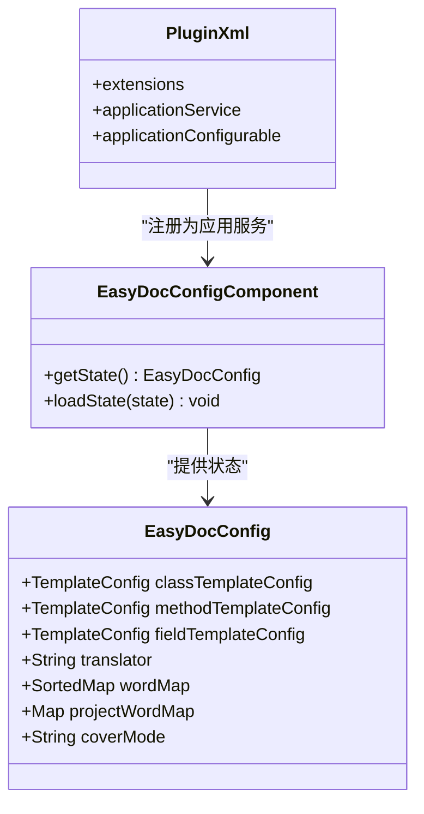
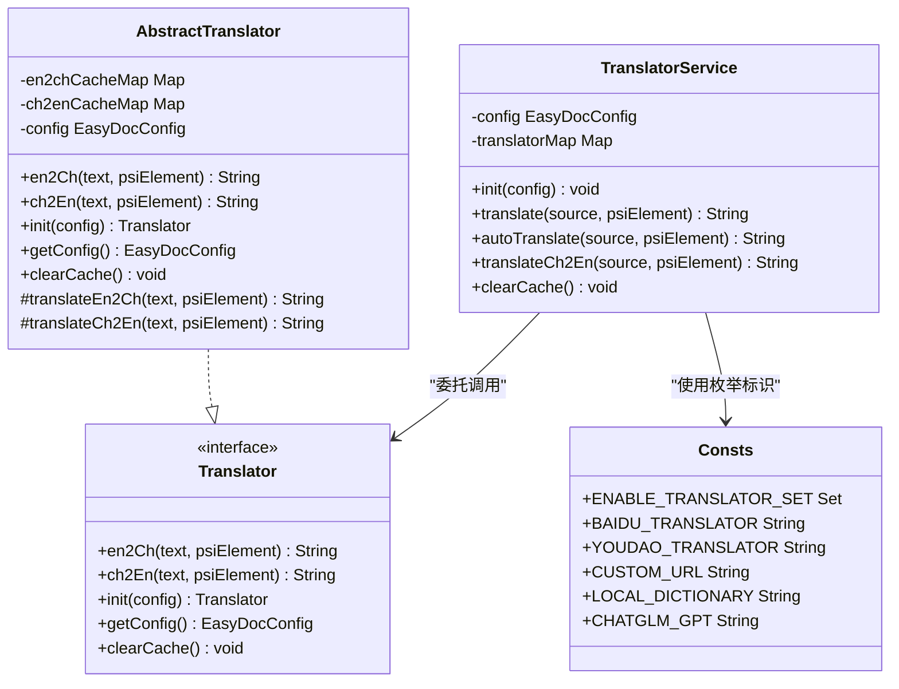
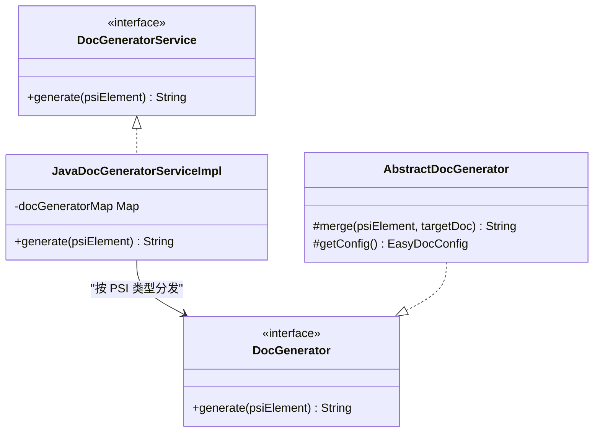
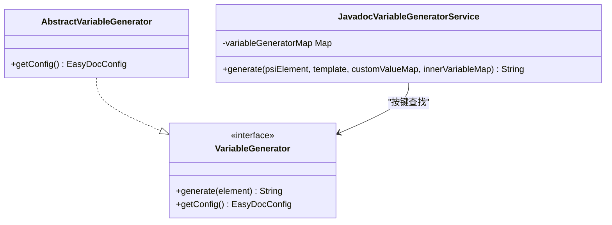
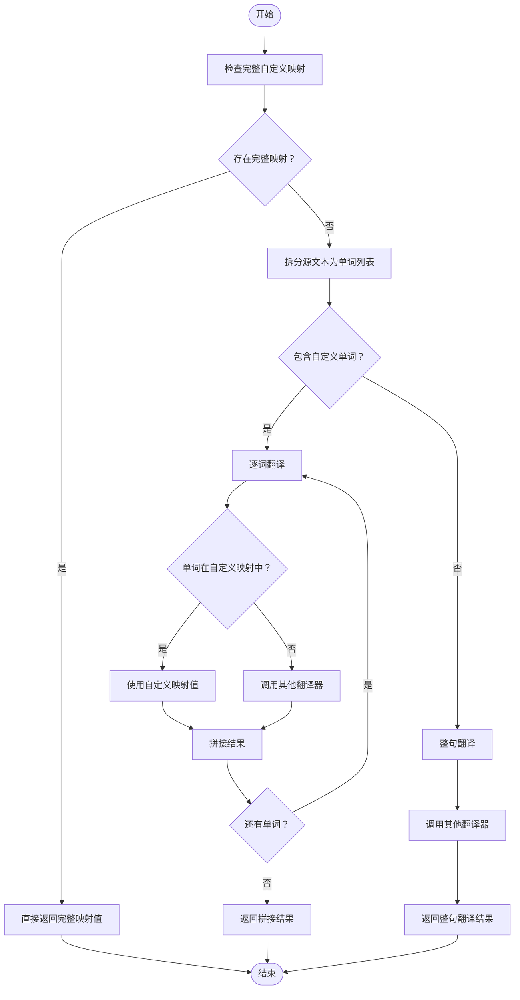
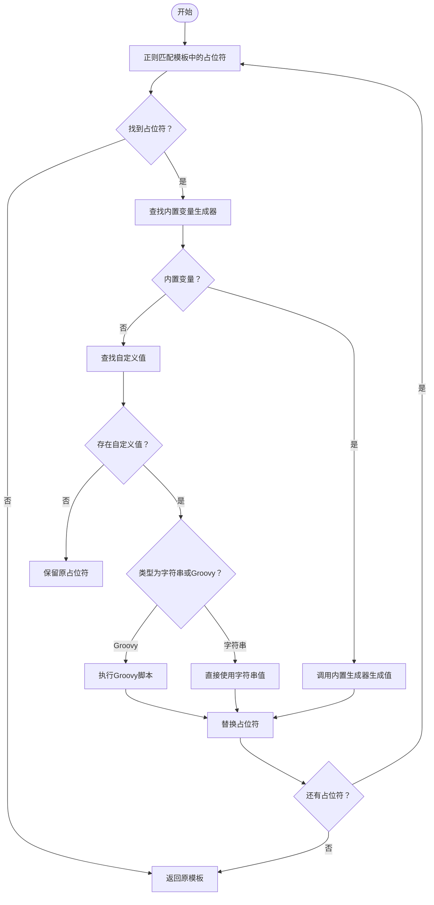
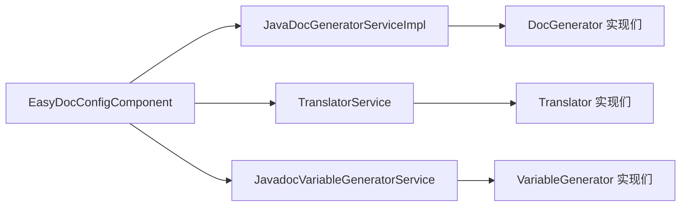

# 扩展开发指南

<cite>
**本文引用的文件**
- [plugin.xml](file://src/main/resources/META-INF/plugin.xml)
- [Translator.java](file://src/main/java/com/star/easydoc/service/translator/Translator.java)
- [AbstractTranslator.java](file://src/main/java/com/star/easydoc/service/translator/impl/AbstractTranslator.java)
- [TranslatorService.java](file://src/main/java/com/star/easydoc/service/translator/TranslatorService.java)
- [DocGenerator.java](file://src/main/java/com/star/easydoc/javadoc/service/generator/DocGenerator.java)
- [AbstractDocGenerator.java](file://src/main/java/com/star/easydoc/javadoc/service/generator/impl/AbstractDocGenerator.java)
- [JavaDocGeneratorServiceImpl.java](file://src/main/java/com/star/easydoc/javadoc/service/JavaDocGeneratorServiceImpl.java)
- [DocGeneratorService.java](file://src/main/java/com/star/easydoc/service/DocGeneratorService.java)
- [VariableGenerator.java](file://src/main/java/com/star/easydoc/javadoc/service/variable/VariableGenerator.java)
- [AbstractVariableGenerator.java](file://src/main/java/com/star/easydoc/javadoc/service/variable/impl/AbstractVariableGenerator.java)
- [JavadocVariableGeneratorService.java](file://src/main/java/com/star/easydoc/javadoc/service/variable/JavadocVariableGeneratorService.java)
- [EasyDocConfig.java](file://src/main/java/com/star/easydoc/config/EasyDocConfig.java)
- [EasyDocConfigComponent.java](file://src/main/java/com/star/easydoc/config/EasyDocConfigComponent.java)
- [Consts.java](file://src/main/java/com/star/easydoc/common/Consts.java)
</cite>

## 目录
1. [简介](#简介)
2. [项目结构](#项目结构)
3. [核心组件](#核心组件)
4. [架构总览](#架构总览)
5. [详细组件分析](#详细组件分析)
6. [依赖分析](#依赖分析)
7. [性能考虑](#性能考虑)
8. [故障排查指南](#故障排查指南)
9. [结论](#结论)
10. [附录](#附录)

## 简介
本指南面向希望为 Easy Javadoc 插件进行扩展开发的工程师，系统讲解插件的扩展点机制与实现方法，涵盖以下主题：
- 扩展点注册与配置：如何通过 plugin.xml 注册应用级服务与设置界面
- 自定义翻译器：实现 Translator 接口、配置参数、集成第三方或自定义 API
- 自定义文档生成器：实现 DocGenerator 接口、处理 PSI 元素、模板渲染与合并策略
- 自定义变量生成器：实现 VariableGenerator 接口、变量解析与 Groovy 脚本执行
- 最佳实践与常见陷阱
- 完整扩展开发示例与测试建议

## 项目结构
插件采用 IntelliJ 平台标准结构，核心扩展点集中在以下包：
- config：持久化配置与配置组件
- service：应用级服务（翻译、文档生成、写入、包信息、GPT）
- javadoc/service/generator：Javadoc 文档生成器接口与实现
- javadoc/service/variable：Javadoc 变量生成器接口与实现
- kdoc/service：Kdoc 对应扩展（不在本次目标范围内，但遵循相同模式）
- view/settings：设置界面与模板配置
- common：常量与工具

图表来源
- [plugin.xml:27-53](file://src/main/resources/META-INF/plugin.xml#L27-L53)
- [EasyDocConfigComponent.java:19-68](file://src/main/java/com/star/easydoc/config/EasyDocConfigComponent.java#L19-L68)
- [EasyDocConfig.java:22-680](file://src/main/java/com/star/easydoc/config/EasyDocConfig.java#L22-L680)
- [Consts.java:14-100](file://src/main/java/com/star/easydoc/common/Consts.java#L14-L100)
- [Translator.java:13-53](file://src/main/java/com/star/easydoc/service/translator/Translator.java#L13-L53)
- [AbstractTranslator.java:14-92](file://src/main/java/com/star/easydoc/service/translator/impl/AbstractTranslator.java#L14-L92)
- [TranslatorService.java:41-238](file://src/main/java/com/star/easydoc/service/translator/TranslatorService.java#L41-L238)
- [DocGeneratorService.java:11-21](file://src/main/java/com/star/easydoc/service/DocGeneratorService.java#L11-L21)
- [JavaDocGeneratorServiceImpl.java:25-50](file://src/main/java/com/star/easydoc/javadoc/service/JavaDocGeneratorServiceImpl.java#L25-L50)
- [DocGenerator.java:11-20](file://src/main/java/com/star/easydoc/javadoc/service/generator/DocGenerator.java#L11-L20)
- [AbstractDocGenerator.java:20-80](file://src/main/java/com/star/easydoc/javadoc/service/generator/impl/AbstractDocGenerator.java#L20-L80)
- [VariableGenerator.java:12-28](file://src/main/java/com/star/easydoc/javadoc/service/variable/VariableGenerator.java#L12-L28)
- [AbstractVariableGenerator.java:14-21](file://src/main/java/com/star/easydoc/javadoc/service/variable/impl/AbstractVariableGenerator.java#L14-L21)
- [JavadocVariableGeneratorService.java:35-128](file://src/main/java/com/star/easydoc/javadoc/service/variable/JavadocVariableGeneratorService.java#L35-L128)

章节来源
- [plugin.xml:1-82](file://src/main/resources/META-INF/plugin.xml#L1-L82)

## 核心组件
本节概述三大扩展点接口及其职责：
- 翻译器接口：负责英译中/中译英，并支持初始化与缓存清理
- 文档生成器接口：根据 PSI 元素生成对应注释内容
- 变量生成器接口：解析模板中的占位符并替换为实际值

章节来源
- [Translator.java:13-53](file://src/main/java/com/star/easydoc/service/translator/Translator.java#L13-L53)
- [DocGenerator.java:11-20](file://src/main/java/com/star/easydoc/javadoc/service/generator/DocGenerator.java#L11-L20)
- [VariableGenerator.java:12-28](file://src/main/java/com/star/easydoc/javadoc/service/variable/VariableGenerator.java#L12-L28)

## 架构总览
下图展示扩展点在插件生命周期内的交互关系与调用路径。

图表来源
- [JavaDocGeneratorServiceImpl.java:25-50](file://src/main/java/com/star/easydoc/javadoc/service/JavaDocGeneratorServiceImpl.java#L25-L50)
- [JavadocVariableGeneratorService.java:35-128](file://src/main/java/com/star/easydoc/javadoc/service/variable/JavadocVariableGeneratorService.java#L35-L128)
- [TranslatorService.java:41-238](file://src/main/java/com/star/easydoc/service/translator/TranslatorService.java#L41-L238)
- [Translator.java:13-53](file://src/main/java/com/star/easydoc/service/translator/Translator.java#L13-L53)

## 详细组件分析

### 扩展点注册与配置
- 应用服务注册：通过 plugin.xml 在 com.intellij 命名空间下注册应用级服务，确保插件启动时加载
- 设置界面注册：注册通用设置与 Javadoc/Kdoc 模板设置界面，支持嵌套子配置项
- 配置持久化：EasyDocConfigComponent 实现 PersistentStateComponent，使用 XML 存储配置；EasyDocConfig 提供模板配置、翻译参数、覆盖模式等

图表来源
- [plugin.xml:27-53](file://src/main/resources/META-INF/plugin.xml#L27-L53)
- [EasyDocConfigComponent.java:19-68](file://src/main/java/com/star/easydoc/config/EasyDocConfigComponent.java#L19-L68)
- [EasyDocConfig.java:22-680](file://src/main/java/com/star/easydoc/config/EasyDocConfig.java#L22-L680)

章节来源
- [plugin.xml:27-53](file://src/main/resources/META-INF/plugin.xml#L27-L53)
- [EasyDocConfigComponent.java:19-68](file://src/main/java/com/star/easydoc/config/EasyDocConfigComponent.java#L19-L68)
- [EasyDocConfig.java:22-680](file://src/main/java/com/star/easydoc/config/EasyDocConfig.java#L22-L680)

### 自定义翻译器开发
目标：实现 Translator 接口，接入第三方翻译 API 或本地字典，支持英译中/中译英、初始化配置与缓存清理。

实现步骤
- 实现 Translator 接口：提供 en2Ch、ch2En、init、getConfig、clearCache 方法
- 继承 AbstractTranslator：复用缓存逻辑与基础初始化流程
- 在 TranslatorService 中注册：通过常量枚举标识翻译器名称，加入翻译器映射
- 配置参数：在 EasyDocConfig 中添加必要字段（如 appKey、secret、region、自定义 URL 等），并在设置界面提供输入项
- 使用场景：在需要翻译的流程中由 TranslatorService 根据配置选择具体实现

图表来源
- [Translator.java:13-53](file://src/main/java/com/star/easydoc/service/translator/Translator.java#L13-L53)
- [AbstractTranslator.java:14-92](file://src/main/java/com/star/easydoc/service/translator/impl/AbstractTranslator.java#L14-L92)
- [TranslatorService.java:41-238](file://src/main/java/com/star/easydoc/service/translator/TranslatorService.java#L41-L238)
- [Consts.java:14-100](file://src/main/java/com/star/easydoc/common/Consts.java#L14-L100)

章节来源
- [Translator.java:13-53](file://src/main/java/com/star/easydoc/service/translator/Translator.java#L13-L53)
- [AbstractTranslator.java:14-92](file://src/main/java/com/star/easydoc/service/translator/impl/AbstractTranslator.java#L14-L92)
- [TranslatorService.java:41-238](file://src/main/java/com/star/easydoc/service/translator/TranslatorService.java#L41-L238)
- [Consts.java:14-100](file://src/main/java/com/star/easydoc/common/Consts.java#L14-L100)

### 自定义文档生成器实现
目标：实现 DocGenerator 接口，针对不同 PSI 元素（类、方法、字段、包）生成注释；通过 DocGeneratorService 进行分发；利用 AbstractDocGenerator 提供合并策略。

实现步骤
- 实现 DocGenerator 接口：generate 方法接收 PSI 元素并返回注释文本
- 继承 AbstractDocGenerator：复用注释合并逻辑（保留已有标签、智能追加 param/throws/exception 等）
- 注册到 DocGeneratorService：在 JavaDocGeneratorServiceImpl 中将 PSI 类型映射到具体生成器
- 模板与变量：结合 JavadocVariableGeneratorService 解析模板占位符，完成最终文本生成

图表来源
- [DocGeneratorService.java:11-21](file://src/main/java/com/star/easydoc/service/DocGeneratorService.java#L11-L21)
- [JavaDocGeneratorServiceImpl.java:25-50](file://src/main/java/com/star/easydoc/javadoc/service/JavaDocGeneratorServiceImpl.java#L25-L50)
- [DocGenerator.java:11-20](file://src/main/java/com/star/easydoc/javadoc/service/generator/DocGenerator.java#L11-L20)
- [AbstractDocGenerator.java:20-80](file://src/main/java/com/star/easydoc/javadoc/service/generator/impl/AbstractDocGenerator.java#L20-L80)

章节来源
- [DocGeneratorService.java:11-21](file://src/main/java/com/star/easydoc/service/DocGeneratorService.java#L11-L21)
- [JavaDocGeneratorServiceImpl.java:25-50](file://src/main/java/com/star/easydoc/javadoc/service/JavaDocGeneratorServiceImpl.java#L25-L50)
- [DocGenerator.java:11-20](file://src/main/java/com/star/easydoc/javadoc/service/generator/DocGenerator.java#L11-L20)
- [AbstractDocGenerator.java:20-80](file://src/main/java/com/star/easydoc/javadoc/service/generator/impl/AbstractDocGenerator.java#L20-L80)

### 自定义变量生成器开发
目标：实现 VariableGenerator 接口，解析模板中的占位符（如 $author$、$date$ 等），支持自定义字符串与 Groovy 脚本两种类型。

实现步骤
- 实现 VariableGenerator 接口：generate 方法返回占位符对应的值；getConfig 提供配置访问
- 继承 AbstractVariableGenerator：统一从 EasyDocConfigComponent 读取配置
- 注册到 JavadocVariableGeneratorService：在变量映射表中注册新变量键
- 模板解析：JavadocVariableGeneratorService 使用正则匹配占位符，先查内置变量，再查自定义值（字符串/Groovy）

图表来源
- [VariableGenerator.java:12-28](file://src/main/java/com/star/easydoc/javadoc/service/variable/VariableGenerator.java#L12-L28)
- [AbstractVariableGenerator.java:14-21](file://src/main/java/com/star/easydoc/javadoc/service/variable/impl/AbstractVariableGenerator.java#L14-L21)
- [JavadocVariableGeneratorService.java:35-128](file://src/main/java/com/star/easydoc/javadoc/service/variable/JavadocVariableGeneratorService.java#L35-L128)

章节来源
- [VariableGenerator.java:12-28](file://src/main/java/com/star/easydoc/javadoc/service/variable/VariableGenerator.java#L12-L28)
- [AbstractVariableGenerator.java:14-21](file://src/main/java/com/star/easydoc/javadoc/service/variable/impl/AbstractVariableGenerator.java#L14-L21)
- [JavadocVariableGeneratorService.java:35-128](file://src/main/java/com/star/easydoc/javadoc/service/variable/JavadocVariableGeneratorService.java#L35-L128)

### 配置参数定义与使用
- 翻译器配置：在 EasyDocConfig 中添加字段（如 appId、token、secretKey、accessKeyId、youdaoAppKey、googleKey、microsoftKey、chatGlmApiKey、customUrl、microsoftRegion 等），并在 Translator 实现中读取
- 模板配置：TemplateConfig 支持 isDefault、template、customMap；可通过设置界面配置类/方法/字段模板
- 项目级词典：projectWordMap 支持按项目隔离的单词映射，提升翻译准确性
- 覆盖模式：coverMode 支持“忽略”“智能合并”“强制覆盖”，影响注释生成与合并策略

章节来源
- [EasyDocConfig.java:22-680](file://src/main/java/com/star/easydoc/config/EasyDocConfig.java#L22-L680)
- [Consts.java:14-100](file://src/main/java/com/star/easydoc/common/Consts.java#L14-L100)

### API 集成方法
- 第三方翻译 API：在 AbstractTranslator 的抽象方法中实现具体网络请求与响应解析
- 本地词典：实现本地字典查询逻辑，返回翻译结果
- 自定义 HTTP 接口：通过 EasyDocConfig 的 customUrl 字段配置，由 TranslatorService 统一调度
- 缓存策略：AbstractTranslator 已内置并发安全的英译中/中译英缓存，减少重复请求

章节来源
- [AbstractTranslator.java:14-92](file://src/main/java/com/star/easydoc/service/translator/impl/AbstractTranslator.java#L14-L92)
- [TranslatorService.java:41-238](file://src/main/java/com/star/easydoc/service/translator/TranslatorService.java#L41-L238)
- [EasyDocConfig.java:22-680](file://src/main/java/com/star/easydoc/config/EasyDocConfig.java#L22-L680)

### 复杂逻辑流程图：翻译与变量解析

#### 翻译流程

图表来源
- [TranslatorService.java:85-111](file://src/main/java/com/star/easydoc/service/translator/TranslatorService.java#L85-L111)
- [TranslatorService.java:213-232](file://src/main/java/com/star/easydoc/service/translator/TranslatorService.java#L213-L232)

#### 变量解析与替换

图表来源
- [JavadocVariableGeneratorService.java:60-92](file://src/main/java/com/star/easydoc/javadoc/service/variable/JavadocVariableGeneratorService.java#L60-L92)
- [JavadocVariableGeneratorService.java:102-125](file://src/main/java/com/star/easydoc/javadoc/service/variable/JavadocVariableGeneratorService.java#L102-L125)

## 依赖分析
- 组件耦合：DocGeneratorService 与 DocGenerator 之间为策略分发关系；JavadocVariableGeneratorService 与 VariableGenerator 之间为映射查找关系；TranslatorService 与 Translator 之间为工厂/调度关系
- 外部依赖：Guava（ImmutableMap/List/Maps）、Apache Commons Lang（StringUtils/ObjectUtils）、IntelliJ PSI API（PsiElement、PsiDocComment、PsiJavaDocumentedElement 等）
- 配置依赖：EasyDocConfigComponent 作为 PersistentStateComponent，向各服务提供配置状态

图表来源
- [JavaDocGeneratorServiceImpl.java:25-50](file://src/main/java/com/star/easydoc/javadoc/service/JavaDocGeneratorServiceImpl.java#L25-L50)
- [JavadocVariableGeneratorService.java:35-128](file://src/main/java/com/star/easydoc/javadoc/service/variable/JavadocVariableGeneratorService.java#L35-L128)
- [TranslatorService.java:41-238](file://src/main/java/com/star/easydoc/service/translator/TranslatorService.java#L41-L238)
- [EasyDocConfigComponent.java:19-68](file://src/main/java/com/star/easydoc/config/EasyDocConfigComponent.java#L19-L68)

章节来源
- [JavaDocGeneratorServiceImpl.java:25-50](file://src/main/java/com/star/easydoc/javadoc/service/JavaDocGeneratorServiceImpl.java#L25-L50)
- [JavadocVariableGeneratorService.java:35-128](file://src/main/java/com/star/easydoc/javadoc/service/variable/JavadocVariableGeneratorService.java#L35-L128)
- [TranslatorService.java:41-238](file://src/main/java/com/star/easydoc/service/translator/TranslatorService.java#L41-L238)
- [EasyDocConfigComponent.java:19-68](file://src/main/java/com/star/easydoc/config/EasyDocConfigComponent.java#L19-L68)

## 性能考虑
- 缓存优化：AbstractTranslator 内置并发安全的英译中/中译英缓存，减少重复请求；TranslatorService 提供 clearCache 以刷新缓存
- 模板解析：JavadocVariableGeneratorService 使用正则一次性匹配所有占位符，避免多次扫描
- PSI 访问：DocGenerator 与 VariableGenerator 仅在必要时访问 PSI 元素，避免不必要的解析开销
- 翻译策略：未检测到自定义单词时采用整句翻译，通常翻译质量更高且更高效

[本节为通用指导，无需列出章节来源]

## 故障排查指南
- 翻译结果为空或异常
  - 检查 TranslatorService.init 是否正确传入配置
  - 确认所选翻译器名称在 Consts 中存在且已注册到 TranslatorService
  - 查看 AbstractTranslator 缓存是否命中，必要时调用 clearCache 刷新
- 变量占位符未替换
  - 确认占位符格式为 $key$，且 key 与内置映射一致或已在自定义值中配置
  - 若使用 Groovy，检查脚本语法与返回值类型
- 注释未生成或被覆盖
  - 检查 EasyDocConfig.coverMode 设置，确认是否为“强制覆盖”
  - 查看 AbstractDocGenerator.merge 的合并逻辑是否符合预期

章节来源
- [TranslatorService.java:41-238](file://src/main/java/com/star/easydoc/service/translator/TranslatorService.java#L41-L238)
- [AbstractTranslator.java:14-92](file://src/main/java/com/star/easydoc/service/translator/impl/AbstractTranslator.java#L14-L92)
- [JavadocVariableGeneratorService.java:35-128](file://src/main/java/com/star/easydoc/javadoc/service/variable/JavadocVariableGeneratorService.java#L35-L128)
- [AbstractDocGenerator.java:20-80](file://src/main/java/com/star/easydoc/javadoc/service/generator/impl/AbstractDocGenerator.java#L20-L80)

## 结论
通过明确的扩展点接口与完善的注册机制，Easy Javadoc 插件为第三方开发者提供了清晰的扩展路径。遵循本文档的实现步骤与最佳实践，即可快速实现自定义翻译器、文档生成器与变量生成器，并与现有配置体系无缝集成。

[本节为总结性内容，无需列出章节来源]

## 附录

### 扩展开发示例（步骤清单）
- 自定义翻译器
  - 新建类实现 Translator 接口，或继承 AbstractTranslator
  - 在 TranslatorService 中注册翻译器名称与实例
  - 在 EasyDocConfig 中添加所需参数字段
  - 在设置界面增加输入项，保存到 EasyDocConfig
  - 测试：调用 TranslatorService.translate 或 autoTranslate，验证结果
- 自定义文档生成器
  - 新建类实现 DocGenerator 接口，或继承 AbstractDocGenerator
  - 在 JavaDocGeneratorServiceImpl 中注册 PSI 类型到生成器的映射
  - 在模板配置中定义模板，使用变量生成器解析占位符
  - 测试：对类/方法/字段 PSI 元素调用 DocGeneratorService.generate
- 自定义变量生成器
  - 新建类实现 VariableGenerator 接口，或继承 AbstractVariableGenerator
  - 在 JavadocVariableGeneratorService 的映射表中注册变量键
  - 在模板中使用 $key$ 占位符，或通过自定义值提供字符串/Groovy
  - 测试：调用 JavadocVariableGeneratorService.generate，验证替换结果

### 测试方法
- 单元测试：针对 Translator、DocGenerator、VariableGenerator 的核心逻辑编写单元测试，模拟 PSI 元素与配置对象
- 集成测试：在 IDE 中运行插件，使用 GenerateJavadocAction 触发完整流程，验证注释生成与写入
- 性能测试：对翻译与变量解析进行基准测试，评估缓存命中率与批量生成效率

[本节为通用指导，无需列出章节来源]