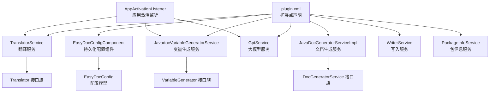
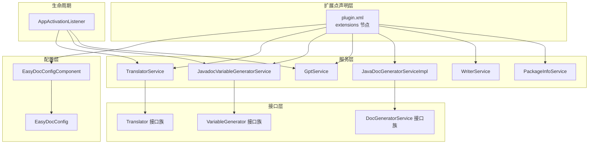
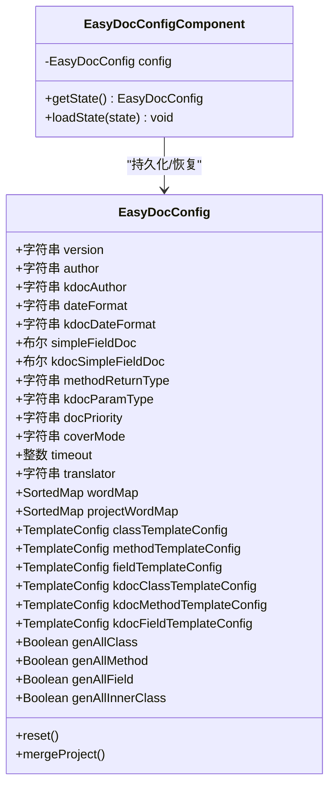
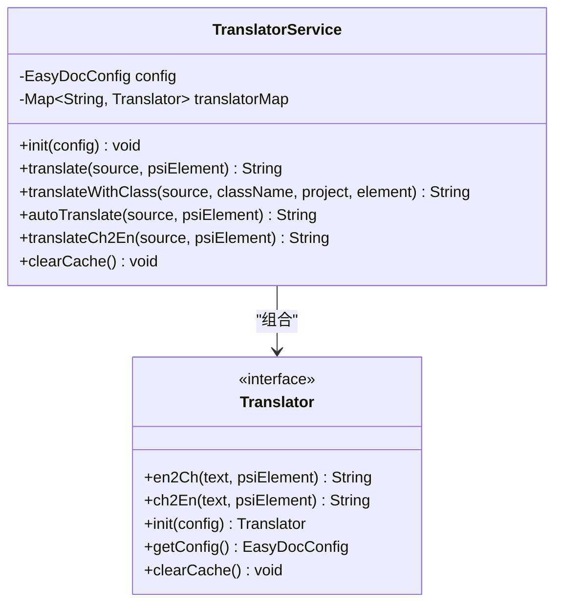
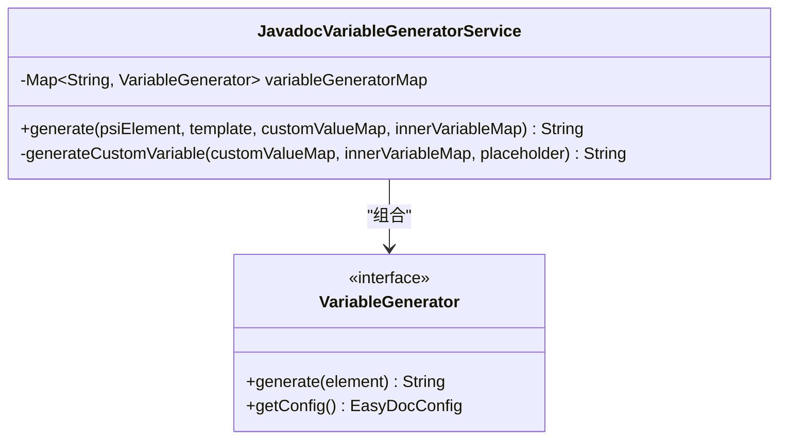
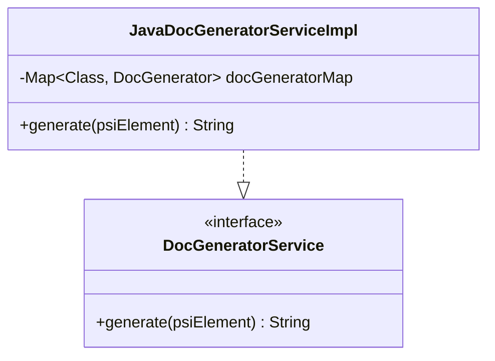
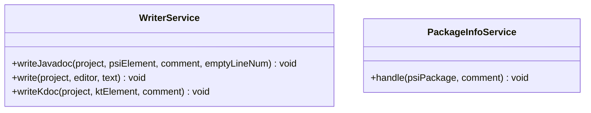
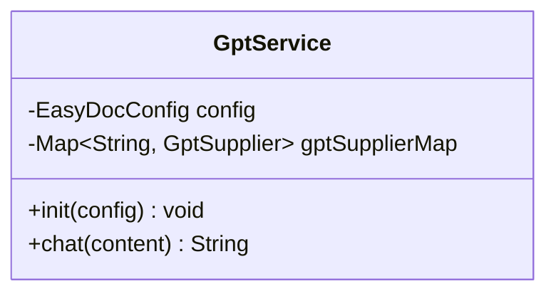
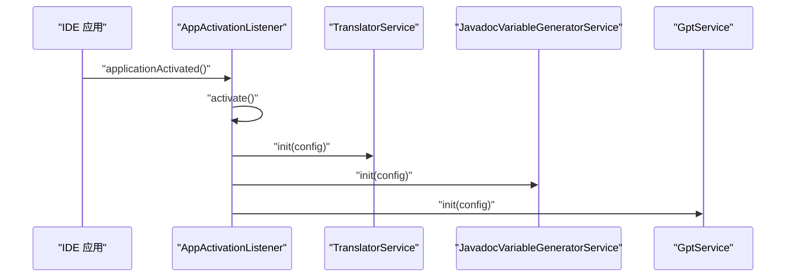
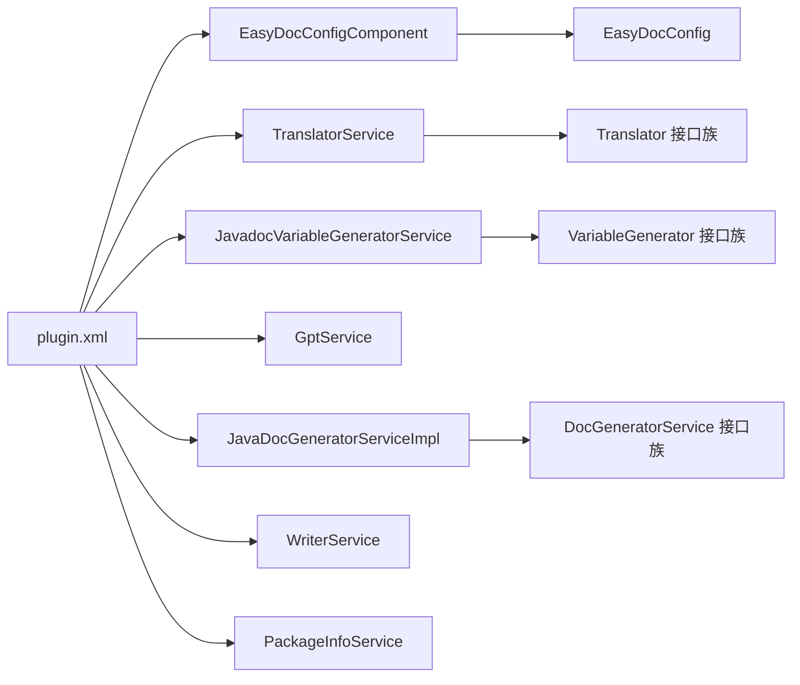

# 插件扩展点配置

<cite>
**本文引用的文件**
- [plugin.xml](file://src/main/resources/META-INF/plugin.xml)
- [EasyDocConfig.java](file://src/main/java/com/star/easydoc/config/EasyDocConfig.java)
- [EasyDocConfigComponent.java](file://src/main/java/com/star/easydoc/config/EasyDocConfigComponent.java)
- [TranslatorService.java](file://src/main/java/com/star/easydoc/service/translator/TranslatorService.java)
- [JavadocVariableGeneratorService.java](file://src/main/java/com/star/easydoc/javadoc/service/variable/JavadocVariableGeneratorService.java)
- [GptService.java](file://src/main/java/com/star/easydoc/service/gpt/GptService.java)
- [JavaDocGeneratorServiceImpl.java](file://src/main/java/com/star/easydoc/javadoc/service/JavaDocGeneratorServiceImpl.java)
- [WriterService.java](file://src/main/java/com/star/easydoc/service/WriterService.java)
- [PackageInfoService.java](file://src/main/java/com/star/easydoc/service/PackageInfoService.java)
- [Translator.java](file://src/main/java/com/star/easydoc/service/translator/Translator.java)
- [VariableGenerator.java](file://src/main/java/com/star/easydoc/javadoc/service/variable/VariableGenerator.java)
- [DocGeneratorService.java](file://src/main/java/com/star/easydoc/service/DocGeneratorService.java)
- [AppActivationListener.java](file://src/main/java/com/star/easydoc/listener/AppActivationListener.java)
</cite>

## 目录
1. [简介](#简介)
2. [项目结构](#项目结构)
3. [核心组件](#核心组件)
4. [架构总览](#架构总览)
5. [详细组件分析](#详细组件分析)
6. [依赖分析](#依赖分析)
7. [性能考虑](#性能考虑)
8. [故障排查指南](#故障排查指南)
9. [结论](#结论)
10. [附录](#附录)

## 简介
本指南面向希望基于 IntelliJ 平台插件框架扩展 EasyDoc 的开发者，系统讲解如何通过 plugin.xml 定义扩展点、注册自定义翻译器、生成器与变量生成器，并说明 EasyDocConfig 与 EasyDocConfigComponent 在扩展点中的职责与配置方法。文档还涵盖扩展点的生命周期管理、动态加载与卸载机制、状态维护与错误处理策略，以及与插件主程序的交互与数据交换机制。

## 项目结构
本项目采用按功能分层的组织方式：
- 配置层：EasyDocConfig 与 EasyDocConfigComponent 提供持久化配置与状态管理
- 服务层：翻译、变量生成、文档生成、写入、包信息等服务
- 扩展点层：通过 plugin.xml 声明应用级服务与配置页
- 监听器：AppActivationListener 实现插件激活时的服务初始化

图表来源
- [plugin.xml:27-53](file://src/main/resources/META-INF/plugin.xml#L27-L53)
- [EasyDocConfigComponent.java:19-68](file://src/main/java/com/star/easydoc/config/EasyDocConfigComponent.java#L19-L68)
- [EasyDocConfig.java:22-680](file://src/main/java/com/star/easydoc/config/EasyDocConfig.java#L22-L680)
- [TranslatorService.java:41-238](file://src/main/java/com/star/easydoc/service/translator/TranslatorService.java#L41-L238)
- [JavadocVariableGeneratorService.java:35-128](file://src/main/java/com/star/easydoc/javadoc/service/variable/JavadocVariableGeneratorService.java#L35-L128)
- [GptService.java:16-57](file://src/main/java/com/star/easydoc/service/gpt/GptService.java#L16-L57)
- [JavaDocGeneratorServiceImpl.java:25-50](file://src/main/java/com/star/easydoc/javadoc/service/JavaDocGeneratorServiceImpl.java#L25-L50)
- [WriterService.java:25-139](file://src/main/java/com/star/easydoc/service/WriterService.java#L25-L139)
- [PackageInfoService.java:22-90](file://src/main/java/com/star/easydoc/service/PackageInfoService.java#L22-L90)
- [AppActivationListener.java:28-75](file://src/main/java/com/star/easydoc/listener/AppActivationListener.java#L28-L75)

章节来源
- [plugin.xml:1-82](file://src/main/resources/META-INF/plugin.xml#L1-L82)
- [EasyDocConfigComponent.java:19-68](file://src/main/java/com/star/easydoc/config/EasyDocConfigComponent.java#L19-L68)
- [EasyDocConfig.java:22-680](file://src/main/java/com/star/easydoc/config/EasyDocConfig.java#L22-L680)

## 核心组件
- 扩展点声明与服务注册：通过 plugin.xml 的 extensions 节点注册应用级服务与配置页
- 配置模型与持久化：EasyDocConfig 提供丰富的配置项；EasyDocConfigComponent 实现持久化与默认值初始化
- 翻译扩展点：TranslatorService 统一调度多种 Translator 实现
- 变量生成扩展点：JavadocVariableGeneratorService 统一调度多种 VariableGenerator 实现
- 文档生成扩展点：JavaDocGeneratorServiceImpl 依据 PSI 类型分发到具体 DocGenerator
- 写入与包信息扩展点：WriterService 负责注释写入；PackageInfoService 负责 package-info.java 的生成与更新
- 大模型扩展点：GptService 统一调度 GptSupplier 实现
- 生命周期与初始化：AppActivationListener 在 IDE 激活时完成服务初始化

章节来源
- [plugin.xml:27-53](file://src/main/resources/META-INF/plugin.xml#L27-L53)
- [EasyDocConfig.java:22-680](file://src/main/java/com/star/easydoc/config/EasyDocConfig.java#L22-L680)
- [EasyDocConfigComponent.java:19-68](file://src/main/java/com/star/easydoc/config/EasyDocConfigComponent.java#L19-L68)
- [TranslatorService.java:41-238](file://src/main/java/com/star/easydoc/service/translator/TranslatorService.java#L41-L238)
- [JavadocVariableGeneratorService.java:35-128](file://src/main/java/com/star/easydoc/javadoc/service/variable/JavadocVariableGeneratorService.java#L35-L128)
- [GptService.java:16-57](file://src/main/java/com/star/easydoc/service/gpt/GptService.java#L16-L57)
- [JavaDocGeneratorServiceImpl.java:25-50](file://src/main/java/com/star/easydoc/javadoc/service/JavaDocGeneratorServiceImpl.java#L25-L50)
- [WriterService.java:25-139](file://src/main/java/com/star/easydoc/service/WriterService.java#L25-L139)
- [PackageInfoService.java:22-90](file://src/main/java/com/star/easydoc/service/PackageInfoService.java#L22-L90)
- [AppActivationListener.java:28-75](file://src/main/java/com/star/easydoc/listener/AppActivationListener.java#L28-L75)

## 架构总览
下图展示了扩展点在插件中的装配关系与调用链路：

图表来源
- [plugin.xml:27-53](file://src/main/resources/META-INF/plugin.xml#L27-L53)
- [EasyDocConfigComponent.java:19-68](file://src/main/java/com/star/easydoc/config/EasyDocConfigComponent.java#L19-L68)
- [EasyDocConfig.java:22-680](file://src/main/java/com/star/easydoc/config/EasyDocConfig.java#L22-L680)
- [TranslatorService.java:41-238](file://src/main/java/com/star/easydoc/service/translator/TranslatorService.java#L41-L238)
- [JavadocVariableGeneratorService.java:35-128](file://src/main/java/com/star/easydoc/javadoc/service/variable/JavadocVariableGeneratorService.java#L35-L128)
- [GptService.java:16-57](file://src/main/java/com/star/easydoc/service/gpt/GptService.java#L16-L57)
- [JavaDocGeneratorServiceImpl.java:25-50](file://src/main/java/com/star/easydoc/javadoc/service/JavaDocGeneratorServiceImpl.java#L25-L50)
- [WriterService.java:25-139](file://src/main/java/com/star/easydoc/service/WriterService.java#L25-L139)
- [PackageInfoService.java:22-90](file://src/main/java/com/star/easydoc/service/PackageInfoService.java#L22-L90)
- [AppActivationListener.java:28-75](file://src/main/java/com/star/easydoc/listener/AppActivationListener.java#L28-L75)

## 详细组件分析

### 扩展点声明与注册（plugin.xml）
- 应用级服务注册：通过 applicationService 节点注册 EasyDocConfigComponent、JavaDocGeneratorServiceImpl、KDoc 生成器、WriterService、PackageInfoService、TranslatorService、Javadoc/KDoc 变量生成服务、GptService 等
- 配置页注册：通过 applicationConfigurable 节点注册通用设置与 Javadoc/KDoc 子设置页，支持父子层级嵌套
- 行为注册：actions 节点注册工具菜单组与动作，绑定具体 Action 类

章节来源
- [plugin.xml:27-53](file://src/main/resources/META-INF/plugin.xml#L27-L53)
- [plugin.xml:55-78](file://src/main/resources/META-INF/plugin.xml#L55-L78)

### EasyDocConfig 与 EasyDocConfigComponent
- EasyDocConfig：集中定义配置项（如作者、日期格式、覆盖模式、翻译器、超时、各类模板配置、单词映射、批量生成开关等），并提供模板配置、自定义变量类型等内部类
- EasyDocConfigComponent：实现 PersistentStateComponent，负责从 XML 持久化加载与默认值初始化，确保首次使用时具备合理默认值

图表来源
- [EasyDocConfig.java:22-680](file://src/main/java/com/star/easydoc/config/EasyDocConfig.java#L22-L680)
- [EasyDocConfigComponent.java:19-68](file://src/main/java/com/star/easydoc/config/EasyDocConfigComponent.java#L19-L68)

章节来源
- [EasyDocConfig.java:22-680](file://src/main/java/com/star/easydoc/config/EasyDocConfig.java#L22-L680)
- [EasyDocConfigComponent.java:19-68](file://src/main/java/com/star/easydoc/config/EasyDocConfigComponent.java#L19-L68)

### 翻译扩展点（TranslatorService 与 Translator 接口族）
- TranslatorService：集中管理多种 Translator 实现，根据配置选择具体实现；提供英译中、中译英、自动翻译、缓存清理等能力
- Translator 接口：定义 en2Ch、ch2En、init、getConfig、clearCache 等标准方法，便于扩展新的翻译提供商

图表来源
- [TranslatorService.java:41-238](file://src/main/java/com/star/easydoc/service/translator/TranslatorService.java#L41-L238)
- [Translator.java:13-54](file://src/main/java/com/star/easydoc/service/translator/Translator.java#L13-L54)

章节来源
- [TranslatorService.java:41-238](file://src/main/java/com/star/easydoc/service/translator/TranslatorService.java#L41-L238)
- [Translator.java:13-54](file://src/main/java/com/star/easydoc/service/translator/Translator.java#L13-L54)

### 变量生成扩展点（JavadocVariableGeneratorService 与 VariableGenerator 接口族）
- JavadocVariableGeneratorService：统一管理多种 VariableGenerator 实现，支持占位符匹配与替换、自定义变量（字符串与 Groovy 脚本）、内部变量映射
- VariableGenerator 接口：定义 generate(element) 与 getConfig()，便于扩展新的变量生成器

图表来源
- [JavadocVariableGeneratorService.java:35-128](file://src/main/java/com/star/easydoc/javadoc/service/variable/JavadocVariableGeneratorService.java#L35-L128)
- [VariableGenerator.java:12-28](file://src/main/java/com/star/easydoc/javadoc/service/variable/VariableGenerator.java#L12-L28)

章节来源
- [JavadocVariableGeneratorService.java:35-128](file://src/main/java/com/star/easydoc/javadoc/service/variable/JavadocVariableGeneratorService.java#L35-L128)
- [VariableGenerator.java:12-28](file://src/main/java/com/star/easydoc/javadoc/service/variable/VariableGenerator.java#L12-L28)

### 文档生成扩展点（JavaDocGeneratorServiceImpl 与 DocGeneratorService 接口族）
- JavaDocGeneratorServiceImpl：根据 PSI 元素类型（类、方法、属性、包）分发到对应 DocGenerator 实现
- DocGeneratorService 接口：定义 generate(psiElement) 用于统一生成入口

图表来源
- [JavaDocGeneratorServiceImpl.java:25-50](file://src/main/java/com/star/easydoc/javadoc/service/JavaDocGeneratorServiceImpl.java#L25-L50)
- [DocGeneratorService.java:11-21](file://src/main/java/com/star/easydoc/service/DocGeneratorService.java#L11-L21)

章节来源
- [JavaDocGeneratorServiceImpl.java:25-50](file://src/main/java/com/star/easydoc/javadoc/service/JavaDocGeneratorServiceImpl.java#L25-L50)
- [DocGeneratorService.java:11-21](file://src/main/java/com/star/easydoc/service/DocGeneratorService.java#L11-L21)

### 写入与包信息扩展点（WriterService 与 PackageInfoService）
- WriterService：封装注释写入、格式化与空行控制，支持 Java 与 Kotlin 文档写入
- PackageInfoService：负责 package-info.java 的创建与内容注入

图表来源
- [WriterService.java:25-139](file://src/main/java/com/star/easydoc/service/WriterService.java#L25-L139)
- [PackageInfoService.java:22-90](file://src/main/java/com/star/easydoc/service/PackageInfoService.java#L22-L90)

章节来源
- [WriterService.java:25-139](file://src/main/java/com/star/easydoc/service/WriterService.java#L25-L139)
- [PackageInfoService.java:22-90](file://src/main/java/com/star/easydoc/service/PackageInfoService.java#L22-L90)

### 大模型扩展点（GptService）
- GptService：集中管理 GptSupplier 实现，提供聊天接口，按配置选择具体供应商

图表来源
- [GptService.java:16-57](file://src/main/java/com/star/easydoc/service/gpt/GptService.java#L16-L57)

章节来源
- [GptService.java:16-57](file://src/main/java/com/star/easydoc/service/gpt/GptService.java#L16-L57)

### 生命周期与初始化（AppActivationListener）
- 应用激活时执行一次性初始化：支持提示、服务初始化（翻译、变量、大模型等），避免重复初始化

图表来源
- [AppActivationListener.java:28-75](file://src/main/java/com/star/easydoc/listener/AppActivationListener.java#L28-L75)
- [TranslatorService.java:52-77](file://src/main/java/com/star/easydoc/service/translator/TranslatorService.java#L52-L77)
- [JavadocVariableGeneratorService.java:60-92](file://src/main/java/com/star/easydoc/javadoc/service/variable/JavadocVariableGeneratorService.java#L60-L92)
- [GptService.java:27-40](file://src/main/java/com/star/easydoc/service/gpt/GptService.java#L27-L40)

章节来源
- [AppActivationListener.java:28-75](file://src/main/java/com/star/easydoc/listener/AppActivationListener.java#L28-L75)

## 依赖分析
- 组件内聚性：各扩展点服务职责清晰，接口抽象良好，便于替换与扩展
- 组件耦合性：服务间通过接口解耦，仅在初始化阶段相互依赖；运行期主要依赖配置与 PSI 元素类型
- 外部依赖：Guava、Apache Commons Lang、Fastjson2、IntelliJ 平台 API
- 循环依赖：未发现循环依赖迹象

图表来源
- [plugin.xml:27-53](file://src/main/resources/META-INF/plugin.xml#L27-L53)
- [EasyDocConfigComponent.java:19-68](file://src/main/java/com/star/easydoc/config/EasyDocConfigComponent.java#L19-L68)
- [EasyDocConfig.java:22-680](file://src/main/java/com/star/easydoc/config/EasyDocConfig.java#L22-L680)
- [TranslatorService.java:41-238](file://src/main/java/com/star/easydoc/service/translator/TranslatorService.java#L41-L238)
- [JavadocVariableGeneratorService.java:35-128](file://src/main/java/com/star/easydoc/javadoc/service/variable/JavadocVariableGeneratorService.java#L35-L128)
- [GptService.java:16-57](file://src/main/java/com/star/easydoc/service/gpt/GptService.java#L16-L57)
- [JavaDocGeneratorServiceImpl.java:25-50](file://src/main/java/com/star/easydoc/javadoc/service/JavaDocGeneratorServiceImpl.java#L25-L50)
- [WriterService.java:25-139](file://src/main/java/com/star/easydoc/service/WriterService.java#L25-L139)
- [PackageInfoService.java:22-90](file://src/main/java/com/star/easydoc/service/PackageInfoService.java#L22-L90)

章节来源
- [plugin.xml:27-53](file://src/main/resources/META-INF/plugin.xml#L27-L53)

## 性能考虑
- 延迟初始化：翻译、变量、大模型服务均采用延迟初始化与双重检查锁，避免启动开销
- 缓存与复用：翻译服务提供 clearCache 能力，便于在配置变更后清理缓存
- 线程安全：使用同步块保护初始化逻辑，防止并发重复初始化
- I/O 与写入：写入操作封装在 WriteCommandAction 中，保证线程安全与一致性

## 故障排查指南
- 快捷键无效：确认光标位于类名、方法名或属性名上，且未与 IDE 快捷键冲突
- 注释格式化问题：若@param/@link/@see 顺序被 IDE 格式化调整，可在设置中关闭 Javadoc 格式化
- 单行注释不生效：IDE 默认格式化可能将单行注释转为多行，需调整格式化设置
- 翻译不可用：检查翻译器配置与密钥，必要时清理缓存后重试
- 配置未持久化：确认 EasyDocConfigComponent 的存储文件存在且可读写

章节来源
- [README.md:71-85](file://README.md#L71-L85)
- [EasyDocConfigComponent.java:19-68](file://src/main/java/com/star/easydoc/config/EasyDocConfigComponent.java#L19-L68)

## 结论
通过 plugin.xml 的扩展点声明，EasyDoc 将配置、翻译、变量生成、文档生成、写入与包信息等功能模块化、接口化，既满足易用性，又便于扩展与维护。配合 AppActivationListener 的生命周期管理与 EasyDocConfig 的持久化能力，实现了稳定可靠的动态加载与状态维护。

## 附录

### 扩展点配置语法与属性设置要点
- 应用级服务注册：使用 applicationService 节点，指定 serviceImplementation 指向实现类
- 配置页注册：使用 applicationConfigurable 节点，支持 id、displayName、instance 与父子关系
- 依赖声明：使用 depends 节点声明对 Java/Kotlin 模块的依赖
- 行为注册：使用 actions 节点声明菜单组与动作，绑定具体 Action 类

章节来源
- [plugin.xml:27-53](file://src/main/resources/META-INF/plugin.xml#L27-L53)
- [plugin.xml:55-78](file://src/main/resources/META-INF/plugin.xml#L55-L78)

### 依赖关系管理
- 通过接口与实现分离，降低耦合度
- 利用平台服务管理器与组件持久化机制，确保配置与服务的生命周期一致

章节来源
- [plugin.xml:27-53](file://src/main/resources/META-INF/plugin.xml#L27-L53)
- [EasyDocConfigComponent.java:19-68](file://src/main/java/com/star/easydoc/config/EasyDocConfigComponent.java#L19-L68)

### 动态加载与卸载机制
- 插件启动时由平台加载扩展点；服务初始化在 AppActivationListener 中完成
- 卸载时由平台负责释放资源，建议在服务中提供清理方法（如 clearCache）

章节来源
- [AppActivationListener.java:28-75](file://src/main/java/com/star/easydoc/listener/AppActivationListener.java#L28-L75)
- [TranslatorService.java:234-237](file://src/main/java/com/star/easydoc/service/translator/TranslatorService.java#L234-L237)

### 生命周期管理与状态维护
- 初始化：AppActivationListener.activate() 中完成服务初始化
- 运行期：通过 EasyDocConfig 维护状态，EasyDocConfigComponent 负责持久化
- 错误处理：服务层普遍记录日志并返回空值或默认值，避免中断流程

章节来源
- [AppActivationListener.java:28-75](file://src/main/java/com/star/easydoc/listener/AppActivationListener.java#L28-L75)
- [EasyDocConfig.java:22-680](file://src/main/java/com/star/easydoc/config/EasyDocConfig.java#L22-L680)
- [WriterService.java:25-139](file://src/main/java/com/star/easydoc/service/WriterService.java#L25-L139)

### 数据交换机制
- 配置交换：EasyDocConfig 作为数据载体，通过 EasyDocConfigComponent 持久化
- PSI 元素交换：DocGeneratorService、WriterService 等以 PSI 元素为输入，生成或写入注释
- 事件与回调：通过平台事件与监听器实现初始化与状态变更通知

章节来源
- [EasyDocConfig.java:22-680](file://src/main/java/com/star/easydoc/config/EasyDocConfig.java#L22-L680)
- [JavaDocGeneratorServiceImpl.java:25-50](file://src/main/java/com/star/easydoc/javadoc/service/JavaDocGeneratorServiceImpl.java#L25-L50)
- [WriterService.java:25-139](file://src/main/java/com/star/easydoc/service/WriterService.java#L25-L139)