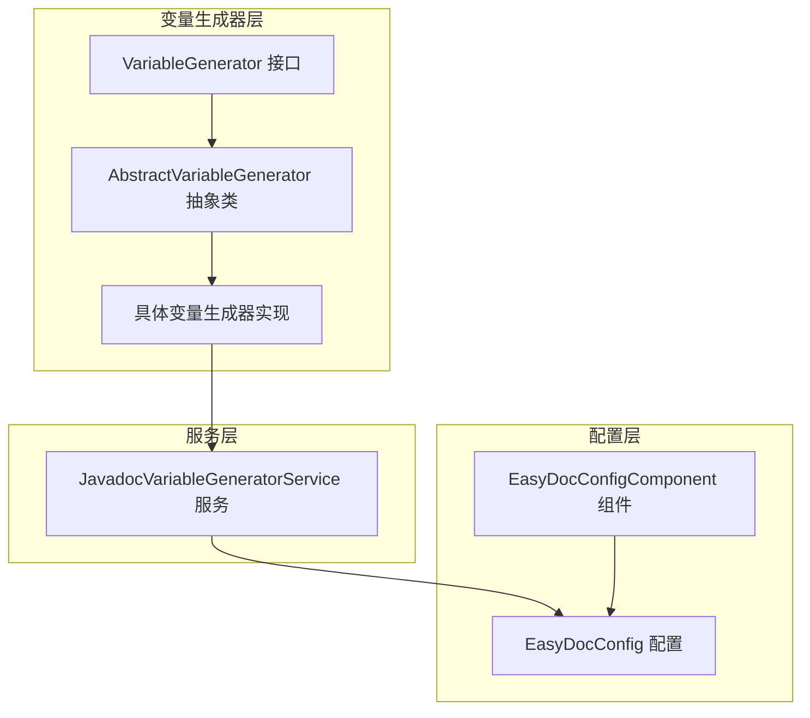
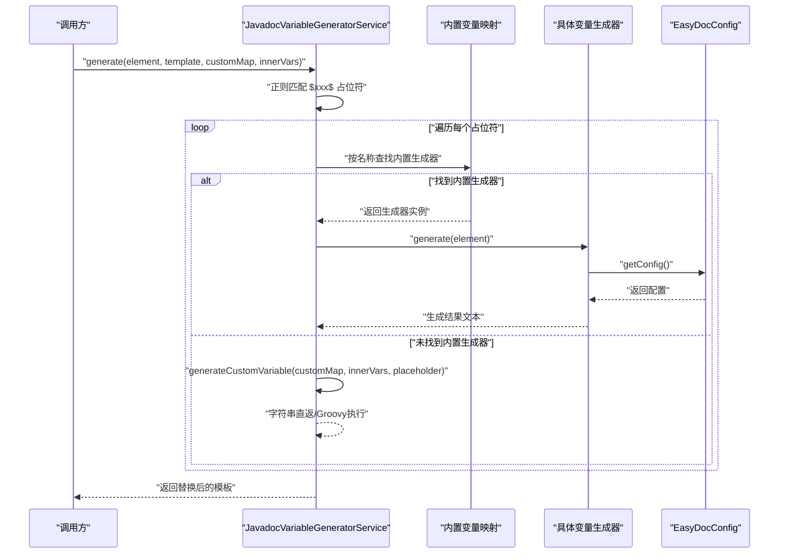
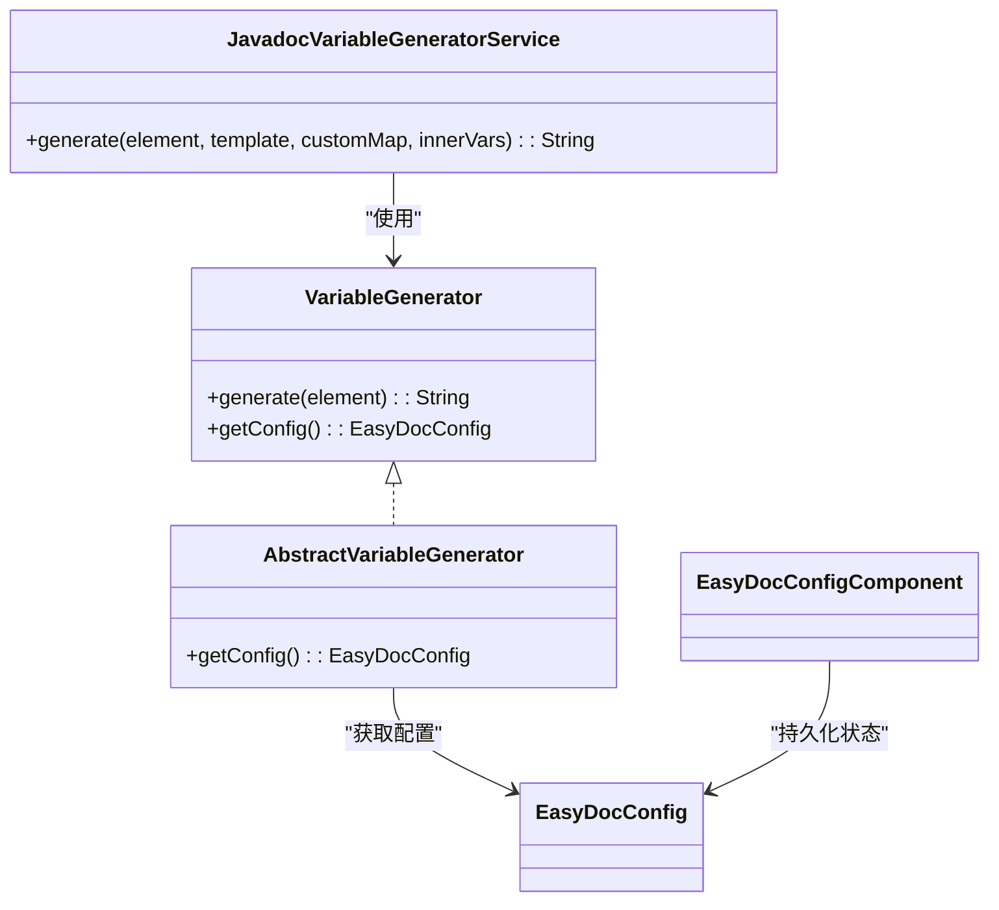
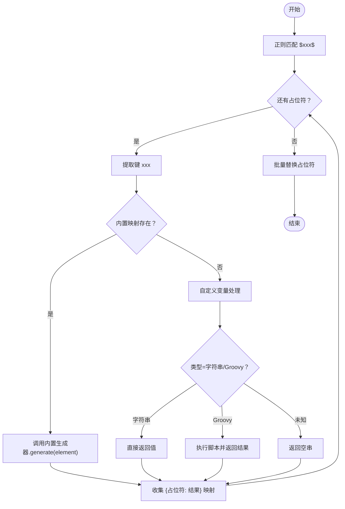
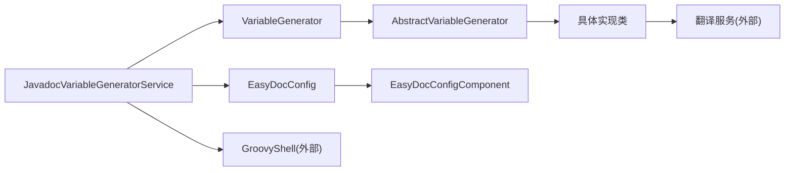

# 自定义变量生成器开发

<cite>
**本文档引用的文件**
- [VariableGenerator.java](file://src/main/java/com/star/easydoc/javadoc/service/variable/VariableGenerator.java)
- [AbstractVariableGenerator.java](file://src/main/java/com/star/easydoc/javadoc/service/variable/impl/AbstractVariableGenerator.java)
- [JavadocVariableGeneratorService.java](file://src/main/java/com/star/easydoc/javadoc/service/variable/JavadocVariableGeneratorService.java)
- [EasyDocConfig.java](file://src/main/java/com/star/easydoc/config/EasyDocConfig.java)
- [EasyDocConfigComponent.java](file://src/main/java/com/star/easydoc/config/EasyDocConfigComponent.java)
- [AuthorVariableGenerator.java](file://src/main/java/com/star/easydoc/javadoc/service/variable/impl/AuthorVariableGenerator.java)
- [DateVariableGenerator.java](file://src/main/java/com/star/easydoc/javadoc/service/variable/impl/DateVariableGenerator.java)
- [ParamsVariableGenerator.java](file://src/main/java/com/star/easydoc/javadoc/service/variable/impl/ParamsVariableGenerator.java)
- [ReturnVariableGenerator.java](file://src/main/java/com/star/easydoc/javadoc/service/variable/impl/ReturnVariableGenerator.java)
- [ThrowsVariableGenerator.java](file://src/main/java/com/star/easydoc/javadoc/service/variable/impl/ThrowsVariableGenerator.java)
- [VersionVariableGenerator.java](file://src/main/java/com/star/easydoc/javadoc/service/variable/impl/VersionVariableGenerator.java)
- [Consts.java](file://src/main/java/com/star/easydoc/common/Consts.java)
</cite>

## 目录
1. [简介](#简介)
2. [项目结构](#项目结构)
3. [核心组件](#核心组件)
4. [架构总览](#架构总览)
5. [详细组件分析](#详细组件分析)
6. [依赖分析](#依赖分析)
7. [性能考虑](#性能考虑)
8. [故障排查指南](#故障排查指南)
9. [结论](#结论)
10. [附录](#附录)

## 简介
本指南面向希望在 EasyDoc 中扩展自定义变量生成器的开发者。文档从接口设计、抽象基类能力、模板集成机制、变量类型支持、注册与配置、到调试与性能优化进行系统讲解，帮助你快速实现高质量的变量生成器。

## 项目结构
变量生成器体系位于 javadoc/service/variable 目录下，采用“接口 + 抽象基类 + 具体实现 + 服务编排”的分层设计：
- 接口层：定义统一的 generate/PsiElement 输入与 EasyDocConfig 获取能力
- 抽象层：封装配置读取、简化实现
- 实现层：内置多种变量生成器（作者、日期、参数、返回值、异常、版本等）
- 服务层：负责模板解析、占位符匹配、变量替换与自定义变量执行（字符串/Groovy）

图表来源
- [VariableGenerator.java:12-27](file://src/main/java/com/star/easydoc/javadoc/service/variable/VariableGenerator.java#L12-L27)
- [AbstractVariableGenerator.java:14-19](file://src/main/java/com/star/easydoc/javadoc/service/variable/impl/AbstractVariableGenerator.java#L14-L19)
- [JavadocVariableGeneratorService.java:35-127](file://src/main/java/com/star/easydoc/javadoc/service/variable/JavadocVariableGeneratorService.java#L35-L127)
- [EasyDocConfig.java:22-680](file://src/main/java/com/star/easydoc/config/EasyDocConfig.java#L22-L680)
- [EasyDocConfigComponent.java:20-66](file://src/main/java/com/star/easydoc/config/EasyDocConfigComponent.java#L20-L66)

章节来源
- [VariableGenerator.java:12-27](file://src/main/java/com/star/easydoc/javadoc/service/variable/VariableGenerator.java#L12-L27)
- [AbstractVariableGenerator.java:14-19](file://src/main/java/com/star/easydoc/javadoc/service/variable/impl/AbstractVariableGenerator.java#L14-L19)
- [JavadocVariableGeneratorService.java:35-127](file://src/main/java/com/star/easydoc/javadoc/service/variable/JavadocVariableGeneratorService.java#L35-L127)
- [EasyDocConfig.java:22-680](file://src/main/java/com/star/easydoc/config/EasyDocConfig.java#L22-L680)
- [EasyDocConfigComponent.java:20-66](file://src/main/java/com/star/easydoc/config/EasyDocConfigComponent.java#L20-L66)

## 核心组件
- VariableGenerator 接口：定义 generate(PsiElement) 与 getConfig() 两个方法，作为所有变量生成器的契约
- AbstractVariableGenerator 抽象类：提供统一的配置获取能力（通过 ServiceManager 获取 EasyDocConfigComponent.getState()）
- JavadocVariableGeneratorService：模板解析与变量替换的核心服务，负责：
  - 占位符匹配（$xxx$）
  - 内置变量生成器映射
  - 自定义变量（字符串/脚本）执行
  - Groovy 脚本绑定与错误处理
- EasyDocConfig/EasyDocConfigComponent：持久化配置与默认值初始化，提供作者、日期格式、返回值类型、覆盖模式等全局开关

章节来源
- [VariableGenerator.java:12-27](file://src/main/java/com/star/easydoc/javadoc/service/variable/VariableGenerator.java#L12-L27)
- [AbstractVariableGenerator.java:14-19](file://src/main/java/com/star/easydoc/javadoc/service/variable/impl/AbstractVariableGenerator.java#L14-L19)
- [JavadocVariableGeneratorService.java:35-127](file://src/main/java/com/star/easydoc/javadoc/service/variable/JavadocVariableGeneratorService.java#L35-L127)
- [EasyDocConfig.java:22-680](file://src/main/java/com/star/easydoc/config/EasyDocConfig.java#L22-L680)
- [EasyDocConfigComponent.java:20-66](file://src/main/java/com/star/easydoc/config/EasyDocConfigComponent.java#L20-L66)

## 架构总览
变量生成器在模板渲染中的工作流如下：

图表来源
- [JavadocVariableGeneratorService.java:60-92](file://src/main/java/com/star/easydoc/javadoc/service/variable/JavadocVariableGeneratorService.java#L60-L92)
- [JavadocVariableGeneratorService.java:102-125](file://src/main/java/com/star/easydoc/javadoc/service/variable/JavadocVariableGeneratorService.java#L102-L125)
- [VariableGenerator.java:19-26](file://src/main/java/com/star/easydoc/javadoc/service/variable/VariableGenerator.java#L19-L26)
- [AbstractVariableGenerator.java:17-19](file://src/main/java/com/star/easydoc/javadoc/service/variable/impl/AbstractVariableGenerator.java#L17-L19)
- [EasyDocConfig.java:22-680](file://src/main/java/com/star/easydoc/config/EasyDocConfig.java#L22-L680)

## 详细组件分析

### 接口与抽象基类
- 设计原则
  - generate(PsiElement)：以 PSI 元素为上下文输入，保证生成器能访问方法签名、参数、返回类型、抛出异常等信息
  - getConfig()：统一从 EasyDocConfigComponent 获取配置，避免各实现重复读取
- 抽象类职责
  - 提供 getConfig() 的默认实现，减少样板代码
  - 保持与 EasyDocConfig 的解耦，便于测试与替换

图表来源
- [VariableGenerator.java:12-27](file://src/main/java/com/star/easydoc/javadoc/service/variable/VariableGenerator.java#L12-L27)
- [AbstractVariableGenerator.java:14-19](file://src/main/java/com/star/easydoc/javadoc/service/variable/impl/AbstractVariableGenerator.java#L14-L19)
- [JavadocVariableGeneratorService.java:35-127](file://src/main/java/com/star/easydoc/javadoc/service/variable/JavadocVariableGeneratorService.java#L35-L127)
- [EasyDocConfig.java:22-680](file://src/main/java/com/star/easydoc/config/EasyDocConfig.java#L22-L680)
- [EasyDocConfigComponent.java:20-66](file://src/main/java/com/star/easydoc/config/EasyDocConfigComponent.java#L20-L66)

章节来源
- [VariableGenerator.java:12-27](file://src/main/java/com/star/easydoc/javadoc/service/variable/VariableGenerator.java#L12-L27)
- [AbstractVariableGenerator.java:14-19](file://src/main/java/com/star/easydoc/javadoc/service/variable/impl/AbstractVariableGenerator.java#L14-L19)
- [EasyDocConfig.java:22-680](file://src/main/java/com/star/easydoc/config/EasyDocConfig.java#L22-L680)
- [EasyDocConfigComponent.java:20-66](file://src/main/java/com/star/easydoc/config/EasyDocConfigComponent.java#L20-L66)

### 模板解析与变量替换机制
- 占位符格式：$xxx$
- 解析流程
  - 正则匹配所有占位符
  - 若键存在于内置映射，则委托对应生成器
  - 否则进入自定义变量处理：先查 customMap，再根据类型执行字符串直返或 Groovy 脚本
- 优先级与冲突
  - 内置变量优先于自定义变量
  - 若自定义值缺失，保留原占位符，避免误删模板内容
- 返回值格式
  - 生成器返回文本片段，服务层统一替换后输出完整模板

图表来源
- [JavadocVariableGeneratorService.java:67-92](file://src/main/java/com/star/easydoc/javadoc/service/variable/JavadocVariableGeneratorService.java#L67-L92)
- [JavadocVariableGeneratorService.java:102-125](file://src/main/java/com/star/easydoc/javadoc/service/variable/JavadocVariableGeneratorService.java#L102-L125)

章节来源
- [JavadocVariableGeneratorService.java:37-92](file://src/main/java/com/star/easydoc/javadoc/service/variable/JavadocVariableGeneratorService.java#L37-L92)
- [JavadocVariableGeneratorService.java:102-125](file://src/main/java/com/star/easydoc/javadoc/service/variable/JavadocVariableGeneratorService.java#L102-L125)

### 内置变量类型与实现要点
- 作者变量：直接返回配置中的作者名
- 日期变量：按配置的日期格式格式化当前时间，异常时回退到默认格式
- 参数变量：解析方法参数列表，结合现有 @param 注释与覆盖策略，必要时调用翻译服务
- 返回值变量：根据配置的返回值类型策略（code/link/doc），对基础类型、void、复杂类型分别处理
- 异常变量：遍历 throws 列表，逐个翻译并拼接 @throws 文本
- 版本变量：返回固定版本号（可扩展为从配置读取）

章节来源
- [AuthorVariableGenerator.java:10-16](file://src/main/java/com/star/easydoc/javadoc/service/variable/impl/AuthorVariableGenerator.java#L10-L16)
- [DateVariableGenerator.java:15-27](file://src/main/java/com/star/easydoc/javadoc/service/variable/impl/DateVariableGenerator.java#L15-L27)
- [ParamsVariableGenerator.java:27-83](file://src/main/java/com/star/easydoc/javadoc/service/variable/impl/ParamsVariableGenerator.java#L27-L83)
- [ReturnVariableGenerator.java:16-45](file://src/main/java/com/star/easydoc/javadoc/service/variable/impl/ReturnVariableGenerator.java#L16-L45)
- [ThrowsVariableGenerator.java:19-36](file://src/main/java/com/star/easydoc/javadoc/service/variable/impl/ThrowsVariableGenerator.java#L19-L36)
- [VersionVariableGenerator.java:11-18](file://src/main/java/com/star/easydoc/javadoc/service/variable/impl/VersionVariableGenerator.java#L11-L18)

### 自定义变量的注册与配置
- 注册方式
  - 在服务的内置映射中添加新键与生成器实例
  - 键名即模板中的占位符名（大小写不敏感）
- 配置来源
  - 通过 EasyDocConfigComponent 初始化默认值
  - 通过 EasyDocConfig 的 TemplateConfig.customMap 存储自定义变量
  - 支持两种类型：固定字符串、Groovy 脚本
- Groovy 执行
  - 使用 GroovyShell + Binding 将内部变量注入脚本上下文
  - 发生异常时记录日志并回退为原始值

章节来源
- [JavadocVariableGeneratorService.java:42-52](file://src/main/java/com/star/easydoc/javadoc/service/variable/JavadocVariableGeneratorService.java#L42-L52)
- [JavadocVariableGeneratorService.java:102-125](file://src/main/java/com/star/easydoc/javadoc/service/variable/JavadocVariableGeneratorService.java#L102-L125)
- [EasyDocConfig.java:211-292](file://src/main/java/com/star/easydoc/config/EasyDocConfig.java#L211-L292)
- [EasyDocConfig.java:297-325](file://src/main/java/com/star/easydoc/config/EasyDocConfig.java#L297-L325)
- [EasyDocConfigComponent.java:30-56](file://src/main/java/com/star/easydoc/config/EasyDocConfigComponent.java#L30-L56)

### 开发自定义变量生成器示例（步骤）
- 步骤一：创建实现类
  - 继承 AbstractVariableGenerator
  - 实现 generate(PsiElement)，基于 element 上下文生成文本
- 步骤二：注册到服务
  - 在 JavadocVariableGeneratorService 的映射中添加键与实例
- 步骤三：在模板中使用
  - 使用 $your_key$ 占位符
- 步骤四：配置自定义变量（可选）
  - 在 EasyDocConfig.TemplateConfig.customMap 中添加条目
  - 类型选择 STRING 或 GROOVY
- 步骤五：传入内部变量（可选）
  - 通过 generate 方法的 innerVariableMap 将变量注入 Groovy 上下文

章节来源
- [AbstractVariableGenerator.java:14-19](file://src/main/java/com/star/easydoc/javadoc/service/variable/impl/AbstractVariableGenerator.java#L14-L19)
- [JavadocVariableGeneratorService.java:42-52](file://src/main/java/com/star/easydoc/javadoc/service/variable/JavadocVariableGeneratorService.java#L42-L52)
- [JavadocVariableGeneratorService.java:60-92](file://src/main/java/com/star/easydoc/javadoc/service/variable/JavadocVariableGeneratorService.java#L60-L92)
- [EasyDocConfig.java:211-292](file://src/main/java/com/star/easydoc/config/EasyDocConfig.java#L211-L292)

## 依赖分析
- 组件内聚与耦合
  - VariableGenerator 与 AbstractVariableGenerator 低耦合，通过接口约束实现
  - JavadocVariableGeneratorService 对内置生成器强依赖，但对自定义变量弱依赖（通过 Map 查找）
  - 配置层通过 EasyDocConfigComponent 提供集中管理
- 外部依赖
  - Groovy 执行用于自定义脚本
  - 翻译服务用于参数与异常描述的自动翻译
  - 日志用于 Groovy 执行失败时的错误提示

图表来源
- [JavadocVariableGeneratorService.java:35-127](file://src/main/java/com/star/easydoc/javadoc/service/variable/JavadocVariableGeneratorService.java#L35-L127)
- [AbstractVariableGenerator.java:14-19](file://src/main/java/com/star/easydoc/javadoc/service/variable/impl/AbstractVariableGenerator.java#L14-L19)
- [EasyDocConfig.java:22-680](file://src/main/java/com/star/easydoc/config/EasyDocConfig.java#L22-L680)
- [EasyDocConfigComponent.java:20-66](file://src/main/java/com/star/easydoc/config/EasyDocConfigComponent.java#L20-L66)

章节来源
- [JavadocVariableGeneratorService.java:35-127](file://src/main/java/com/star/easydoc/javadoc/service/variable/JavadocVariableGeneratorService.java#L35-L127)
- [AbstractVariableGenerator.java:14-19](file://src/main/java/com/star/easydoc/javadoc/service/variable/impl/AbstractVariableGenerator.java#L14-L19)
- [EasyDocConfig.java:22-680](file://src/main/java/com/star/easydoc/config/EasyDocConfig.java#L22-L680)
- [EasyDocConfigComponent.java:20-66](file://src/main/java/com/star/easydoc/config/EasyDocConfigComponent.java#L20-L66)

## 性能考虑
- 正则匹配与批量替换
  - 占位符匹配与替换为 O(n) 遍历，注意模板规模
- Groovy 执行
  - 每次执行都会创建 Binding 和 Shell，建议缓存或复用（如需高性能场景）
- 翻译服务
  - 参数与异常描述可能触发网络请求，建议控制并发与重试
- 配置读取
  - 抽象类每次通过 ServiceManager 获取配置，通常为单例读取，影响较小

## 故障排查指南
- 占位符未生效
  - 检查占位符格式是否为 $xxx$，键名大小写是否正确
  - 确认是否已注册到内置映射或配置到 customMap
- 自定义变量报错
  - Groovy 语法错误会记录日志并回退为原始值；检查脚本语法与返回值类型
- 日期格式异常
  - 配置的日期格式非法会导致格式化失败，回退到默认格式
- 翻译结果为空
  - 检查翻译服务可用性与网络配置
- 返回值类型策略无效
  - 确认 EasyDocConfig 中 methodReturnType 设置与 isCode/isLink/isDoc 判断逻辑

章节来源
- [JavadocVariableGeneratorService.java:115-121](file://src/main/java/com/star/easydoc/javadoc/service/variable/JavadocVariableGeneratorService.java#L115-L121)
- [DateVariableGenerator.java:20-26](file://src/main/java/com/star/easydoc/javadoc/service/variable/impl/DateVariableGenerator.java#L20-L26)
- [EasyDocConfig.java:561-574](file://src/main/java/com/star/easydoc/config/EasyDocConfig.java#L561-L574)

## 结论
通过接口 + 抽象基类 + 服务编排的设计，EasyDoc 的变量生成器体系实现了高扩展性与易用性。开发者只需实现 generate(PsiElement) 并按需注册，即可无缝接入模板系统。配合 EasyDocConfig 的灵活配置与自定义变量（字符串/Groovy）能力，能够满足多样化的注释生成需求。

## 附录

### 变量类型与策略对照
- 作者：来自配置作者字段
- 日期：来自配置日期格式，异常回退默认格式
- 参数：结合现有 @param 注释与覆盖模式，必要时翻译
- 返回值：根据策略（code/link/doc）生成不同格式
- 异常：遍历 throws 列表并翻译
- 版本：固定版本号（可扩展）

章节来源
- [AuthorVariableGenerator.java:10-16](file://src/main/java/com/star/easydoc/javadoc/service/variable/impl/AuthorVariableGenerator.java#L10-L16)
- [DateVariableGenerator.java:15-27](file://src/main/java/com/star/easydoc/javadoc/service/variable/impl/DateVariableGenerator.java#L15-L27)
- [ParamsVariableGenerator.java:27-83](file://src/main/java/com/star/easydoc/javadoc/service/variable/impl/ParamsVariableGenerator.java#L27-L83)
- [ReturnVariableGenerator.java:16-45](file://src/main/java/com/star/easydoc/javadoc/service/variable/impl/ReturnVariableGenerator.java#L16-L45)
- [ThrowsVariableGenerator.java:19-36](file://src/main/java/com/star/easydoc/javadoc/service/variable/impl/ThrowsVariableGenerator.java#L19-L36)
- [VersionVariableGenerator.java:11-18](file://src/main/java/com/star/easydoc/javadoc/service/variable/impl/VersionVariableGenerator.java#L11-L18)
- [Consts.java:22-27](file://src/main/java/com/star/easydoc/common/Consts.java#L22-L27)