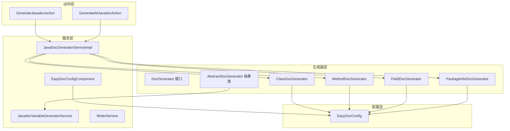
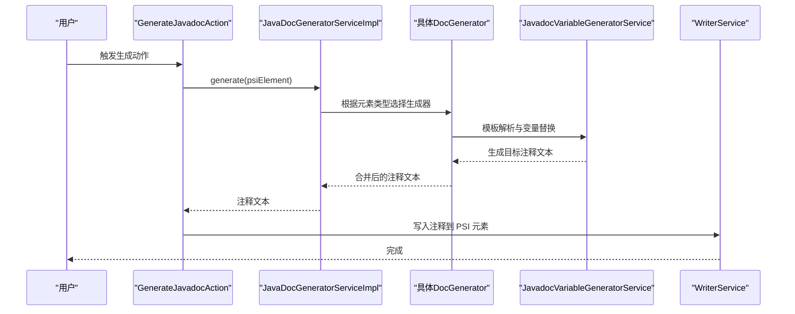
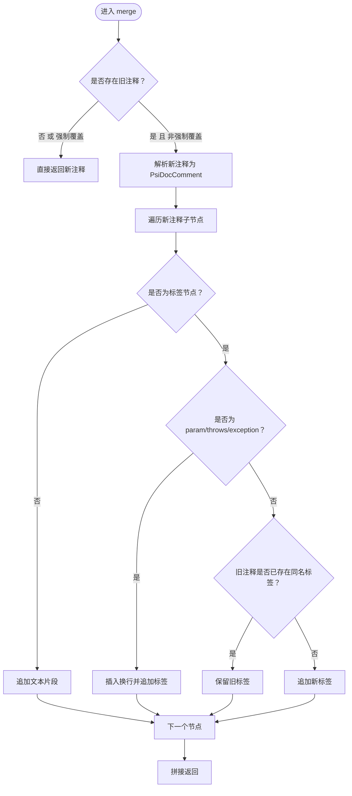
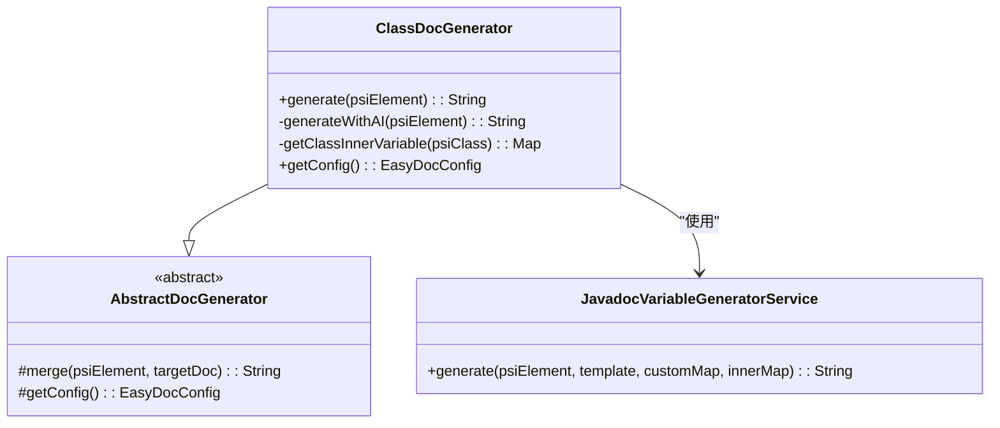
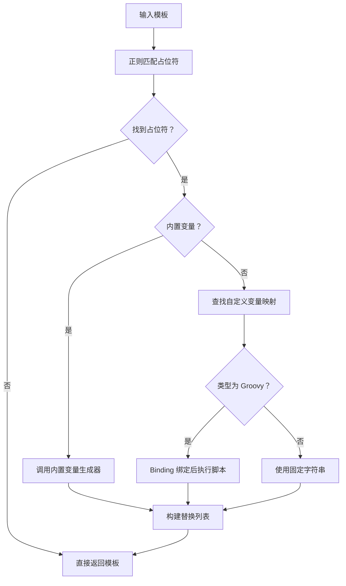
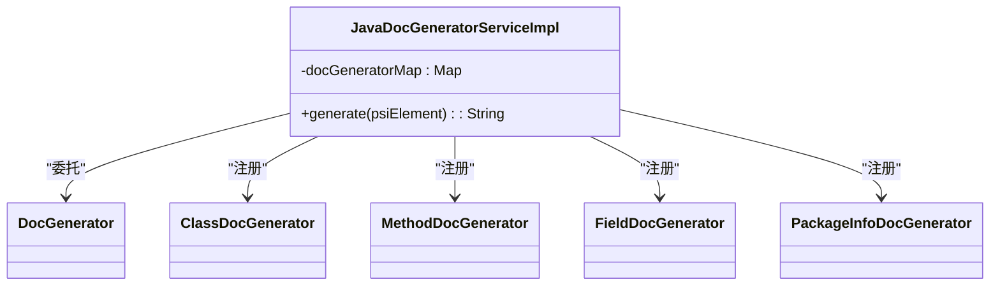
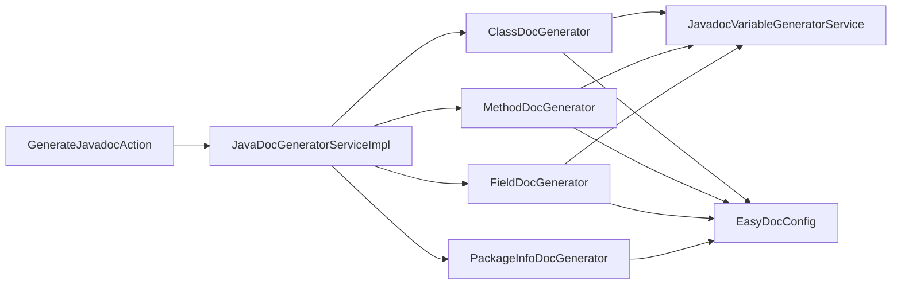

# 自定义文档生成器开发

<cite>
**本文引用的文件**
- [DocGenerator.java](file://src/main/java/com/star/easydoc/javadoc/service/generator/DocGenerator.java)
- [AbstractDocGenerator.java](file://src/main/java/com/star/easydoc/javadoc/service/generator/impl/AbstractDocGenerator.java)
- [ClassDocGenerator.java](file://src/main/java/com/star/easydoc/javadoc/service/generator/impl/ClassDocGenerator.java)
- [MethodDocGenerator.java](file://src/main/java/com/star/easydoc/javadoc/service/generator/impl/MethodDocGenerator.java)
- [FieldDocGenerator.java](file://src/main/java/com/star/easydoc/javadoc/service/generator/impl/FieldDocGenerator.java)
- [PackageInfoDocGenerator.java](file://src/main/java/com/star/easydoc/javadoc/service/generator/impl/PackageInfoDocGenerator.java)
- [JavadocVariableGeneratorService.java](file://src/main/java/com/star/easydoc/javadoc/service/variable/JavadocVariableGeneratorService.java)
- [VariableGenerator.java](file://src/main/java/com/star/easydoc/javadoc/service/variable/VariableGenerator.java)
- [EasyDocConfig.java](file://src/main/java/com/star/easydoc/config/EasyDocConfig.java)
- [EasyDocConfigComponent.java](file://src/main/java/com/star/easydoc/config/EasyDocConfigComponent.java)
- [JavaDocGeneratorServiceImpl.java](file://src/main/java/com/star/easydoc/javadoc/service/JavaDocGeneratorServiceImpl.java)
- [plugin.xml](file://src/main/resources/META-INF/plugin.xml)
- [GenerateJavadocAction.java](file://src/main/java/com/star/easydoc/action/GenerateJavadocAction.java)
- [GenerateAllJavadocAction.java](file://src/main/java/com/star/easydoc/action/GenerateAllJavadocAction.java)
</cite>

## 目录
1. [简介](#简介)
2. [项目结构](#项目结构)
3. [核心组件](#核心组件)
4. [架构总览](#架构总览)
5. [详细组件分析](#详细组件分析)
6. [依赖分析](#依赖分析)
7. [性能考量](#性能考量)
8. [故障排查指南](#故障排查指南)
9. [结论](#结论)
10. [附录](#附录)

## 简介
本指南面向希望在 IntelliJ 平台上扩展或自定义“文档注释”生成能力的开发者。项目基于 PSI（Program Structure Interface）与可插拔的服务体系，提供了统一的 DocGenerator 接口、抽象基类与多种具体生成器（类、方法、字段、包信息），并内置变量替换、模板解析、AI 提示词生成、配置持久化与注册机制。通过本指南，你将掌握：
- DocGenerator 接口的设计理念与实现规范
- AbstractDocGenerator 的通用能力与合并策略
- PSI 元素处理、模板解析、变量替换的核心流程
- 生成器注册、优先级与协作方式
- 测试与调试方法

## 项目结构
项目采用按领域分层与按语言分层相结合的组织方式：
- action：IDE 动作入口，负责触发生成与写入
- config：配置持久化与默认值管理
- javadoc/service：Javadoc 生成服务与生成器实现
- kdoc/service：KDoc 生成服务与生成器实现（与本指南相关性较低）
- service：通用服务（写入、翻译、GPT、包信息等）
- view：设置界面与交互视图
- resources/META-INF/plugin.xml：插件声明与服务注册

图表来源
- [plugin.xml:27-53](file://src/main/resources/META-INF/plugin.xml#L27-L53)
- [JavaDocGeneratorServiceImpl.java:25-49](file://src/main/java/com/star/easydoc/javadoc/service/JavaDocGeneratorServiceImpl.java#L25-L49)
- [ClassDocGenerator.java:29](file://src/main/java/com/star/easydoc/javadoc/service/generator/impl/ClassDocGenerator.java#L29)
- [MethodDocGenerator.java:30](file://src/main/java/com/star/easydoc/javadoc/service/generator/impl/MethodDocGenerator.java#L30)
- [FieldDocGenerator.java:28](file://src/main/java/com/star/easydoc/javadoc/service/generator/impl/FieldDocGenerator.java#L28)
- [PackageInfoDocGenerator.java:15](file://src/main/java/com/star/easydoc/javadoc/service/generator/impl/PackageInfoDocGenerator.java#L15)
- [JavadocVariableGeneratorService.java:35](file://src/main/java/com/star/easydoc/javadoc/service/variable/JavadocVariableGeneratorService.java#L35)
- [EasyDocConfigComponent.java:20](file://src/main/java/com/star/easydoc/config/EasyDocConfigComponent.java#L20)
- [EasyDocConfig.java:22](file://src/main/java/com/star/easydoc/config/EasyDocConfig.java#L22)

章节来源
- [plugin.xml:1-82](file://src/main/resources/META-INF/plugin.xml#L1-L82)
- [JavaDocGeneratorServiceImpl.java:1-50](file://src/main/java/com/star/easydoc/javadoc/service/JavaDocGeneratorServiceImpl.java#L1-L50)

## 核心组件
- DocGenerator 接口：定义统一的 generate(PsiElement) 方法，输入为 PSI 元素，输出为注释文本字符串。
- AbstractDocGenerator 抽象类：提供 merge 合并逻辑与配置访问抽象方法，供具体生成器复用。
- 具体生成器：针对类、方法、字段、包信息分别实现模板解析、变量替换与 AI 提示词生成。
- JavadocVariableGeneratorService：占位符匹配与变量替换引擎，支持内置变量与自定义变量（含 Groovy 脚本）。
- EasyDocConfig/EasyDocConfigComponent：配置持久化与默认值初始化，控制覆盖模式、模板、翻译器等。
- JavaDocGeneratorServiceImpl：生成器注册表与路由选择，根据 PSI 元素类型选择对应生成器。

章节来源
- [DocGenerator.java:11-18](file://src/main/java/com/star/easydoc/javadoc/service/generator/DocGenerator.java#L11-L18)
- [AbstractDocGenerator.java:20](file://src/main/java/com/star/easydoc/javadoc/service/generator/impl/AbstractDocGenerator.java#L20)
- [JavadocVariableGeneratorService.java:35](file://src/main/java/com/star/easydoc/javadoc/service/variable/JavadocVariableGeneratorService.java#L35)
- [EasyDocConfig.java:22](file://src/main/java/com/star/easydoc/config/EasyDocConfig.java#L22)
- [EasyDocConfigComponent.java:20](file://src/main/java/com/star/easydoc/config/EasyDocConfigComponent.java#L20)
- [JavaDocGeneratorServiceImpl.java:25-49](file://src/main/java/com/star/easydoc/javadoc/service/JavaDocGeneratorServiceImpl.java#L25-L49)

## 架构总览
以下序列图展示了从用户触发到最终写入注释的整体流程：

图表来源
- [GenerateJavadocAction.java:71-154](file://src/main/java/com/star/easydoc/action/GenerateJavadocAction.java#L71-L154)
- [JavaDocGeneratorServiceImpl.java:35-48](file://src/main/java/com/star/easydoc/javadoc/service/JavaDocGeneratorServiceImpl.java#L35-L48)
- [JavadocVariableGeneratorService.java:60-92](file://src/main/java/com/star/easydoc/javadoc/service/variable/JavadocVariableGeneratorService.java#L60-L92)

## 详细组件分析

### DocGenerator 接口与实现规范
- 设计理念：以 PSI 元素为中心，统一生成注释文本；返回值为字符串，便于后续合并与写入。
- 参数处理：接收任意 PsiElement，由具体实现进行类型判断与处理。
- 返回值格式：返回标准 JavaDoc 注释文本；若不适用当前生成器，应返回空字符串或空值以便上层跳过。
- 异常处理：建议在生成失败时抛出运行时异常或返回空值，避免中断整体流程；调用方应进行判空处理。

章节来源
- [DocGenerator.java:11-18](file://src/main/java/com/star/easydoc/javadoc/service/generator/DocGenerator.java#L11-L18)
- [GenerateJavadocAction.java:145-153](file://src/main/java/com/star/easydoc/action/GenerateJavadocAction.java#L145-L153)

### AbstractDocGenerator 通用能力
- 合并策略：当已有注释存在且覆盖模式非“强制覆盖”时，对新旧注释进行智能合并，保留双方标签并避免重复。
- 关键点：
  - 对 param/throws/exception 标签进行特殊处理，确保换行与格式正确。
  - 对其他标签（如 see、since、version 等）若新注释未包含则保留旧值。
- 配置访问：通过抽象方法 getConfig() 提供 EasyDocConfig 访问，供子类使用覆盖模式、模板开关等。

图表来源
- [AbstractDocGenerator.java:29-71](file://src/main/java/com/star/easydoc/javadoc/service/generator/impl/AbstractDocGenerator.java#L29-L71)

章节来源
- [AbstractDocGenerator.java:20-79](file://src/main/java/com/star/easydoc/javadoc/service/generator/impl/AbstractDocGenerator.java#L20-L79)

### 类文档生成器（ClassDocGenerator）
- 类型判断：仅处理 PsiClass。
- 覆盖策略：若覆盖模式为“忽略”且已有注释，直接返回空值跳过。
- 模板与变量：
  - 支持默认模板与用户自定义模板切换。
  - 变量替换通过 JavadocVariableGeneratorService 完成，内置 author、date、className、simpleClassName、branch、projectName 等。
- AI 生成：当翻译器为 AI 类型时，读取 class.prompt，替换作者、日期、代码片段后调用 GPT 服务生成注释。
- 合并：调用父类 merge 合并与现有注释。

图表来源
- [ClassDocGenerator.java:29](file://src/main/java/com/star/easydoc/javadoc/service/generator/impl/ClassDocGenerator.java#L29)
- [AbstractDocGenerator.java:20](file://src/main/java/com/star/easydoc/javadoc/service/generator/impl/AbstractDocGenerator.java#L20)
- [JavadocVariableGeneratorService.java:35](file://src/main/java/com/star/easydoc/javadoc/service/variable/JavadocVariableGeneratorService.java#L35)

章节来源
- [ClassDocGenerator.java:44-116](file://src/main/java/com/star/easydoc/javadoc/service/generator/impl/ClassDocGenerator.java#L44-L116)

### 方法文档生成器（MethodDocGenerator）
- 类型判断：仅处理 PsiMethod。
- 模板动态生成：根据方法参数、返回类型、异常声明动态决定是否包含 $PARAMS$、$RETURN$、$THROWS$ 占位符。
- 变量替换：内置 author、methodName、methodReturnType、methodParamTypes、methodParamNames、branch、projectName。
- AI 生成：读取 method.prompt，替换代码片段后调用 GPT 服务。
- 合并：调用父类 merge。

章节来源
- [MethodDocGenerator.java:38-138](file://src/main/java/com/star/easydoc/javadoc/service/generator/impl/MethodDocGenerator.java#L38-L138)

### 字段文档生成器（FieldDocGenerator）
- 类型判断：仅处理 PsiField。
- 模板选择：支持简单模板与文档模板，可通过配置切换。
- 变量替换：内置 author、fieldName、fieldType、branch、projectName。
- AI 生成：读取 field.prompt，替换代码片段后调用 GPT 服务。
- 合并：调用父类 merge。

章节来源
- [FieldDocGenerator.java:42-111](file://src/main/java/com/star/easydoc/javadoc/service/generator/impl/FieldDocGenerator.java#L42-L111)

### 包信息文档生成器（PackageInfoDocGenerator）
- 类型判断：仅处理 PsiPackage。
- 默认模板：使用占位符 ${PACKAGE_INFO_DESCRIBE}，由 PackageInfoService 提供描述内容。
- 不继承 AbstractDocGenerator，直接返回默认注释文本。

章节来源
- [PackageInfoDocGenerator.java:15-39](file://src/main/java/com/star/easydoc/javadoc/service/generator/impl/PackageInfoDocGenerator.java#L15-L39)

### 变量生成与模板解析（JavadocVariableGeneratorService）
- 占位符匹配：使用正则匹配 $xxx$ 形式占位符。
- 变量生成：
  - 内置变量：author、date、doc、params、return、see、since、throws、version。
  - 自定义变量：支持 STRING 固定值与 GROOVY 脚本；脚本通过 GroovyShell 执行，绑定内部变量映射。
- 错误处理：Groovy 执行异常记录日志并回退为原始值。

图表来源
- [JavadocVariableGeneratorService.java:60-125](file://src/main/java/com/star/easydoc/javadoc/service/variable/JavadocVariableGeneratorService.java#L60-L125)

章节来源
- [JavadocVariableGeneratorService.java:35-128](file://src/main/java/com/star/easydoc/javadoc/service/variable/JavadocVariableGeneratorService.java#L35-L128)
- [VariableGenerator.java:12-27](file://src/main/java/com/star/easydoc/javadoc/service/variable/VariableGenerator.java#L12-L27)

### 配置系统（EasyDocConfig 与 EasyDocConfigComponent）
- EasyDocConfig：集中管理作者、日期格式、覆盖模式、模板配置、翻译器、超时、单词映射、批量生成开关等。
- EasyDocConfigComponent：作为 PersistentStateComponent，负责默认值初始化与状态加载。
- 模板配置：TemplateConfig 支持 isDefault、template、customMap；CustomValue 支持 STRING 与 GROOVY 两种类型。

章节来源
- [EasyDocConfig.java:22](file://src/main/java/com/star/easydoc/config/EasyDocConfig.java#L22)
- [EasyDocConfigComponent.java:20](file://src/main/java/com/star/easydoc/config/EasyDocConfigComponent.java#L20)

### 生成器注册与路由（JavaDocGeneratorServiceImpl）
- 注册表：以 PSI 元素类型为键，DocGenerator 实例为值的不可变映射。
- 路由：遍历映射，使用 isAssignableFrom 判断元素类型归属，命中后调用对应生成器。
- 未命中：返回空字符串，表示不支持该类型。

图表来源
- [JavaDocGeneratorServiceImpl.java:27-48](file://src/main/java/com/star/easydoc/javadoc/service/JavaDocGeneratorServiceImpl.java#L27-L48)
- [plugin.xml:29-37](file://src/main/resources/META-INF/plugin.xml#L29-L37)

章节来源
- [JavaDocGeneratorServiceImpl.java:25-49](file://src/main/java/com/star/easydoc/javadoc/service/JavaDocGeneratorServiceImpl.java#L25-L49)
- [plugin.xml:27-53](file://src/main/resources/META-INF/plugin.xml#L27-L53)

### PSI API 使用与最佳实践
- 元素类型判断：使用 instanceof 或 isAssignableFrom 进行类型筛选，避免强转异常。
- 注释获取：通过 PsiJavaDocumentedElement.getDocComment 获取现有注释，用于合并策略。
- 文档对象构造：使用 PsiElementFactory.createDocCommentFromText 将字符串转换为 PSI 文档对象。
- 上下文分析：利用 Project、VcsUtil 等工具获取分支、项目名称等上下文信息。
- 最佳实践：
  - 在生成前先检查覆盖模式与已有注释，避免不必要的计算。
  - 模板与变量分离，便于用户自定义与扩展。
  - 对外部依赖（如 GPT）做好异常捕获与降级处理。

章节来源
- [ClassDocGenerator.java:46-53](file://src/main/java/com/star/easydoc/javadoc/service/generator/impl/ClassDocGenerator.java#L46-L53)
- [MethodDocGenerator.java:39-47](file://src/main/java/com/star/easydoc/javadoc/service/generator/impl/MethodDocGenerator.java#L39-L47)
- [FieldDocGenerator.java:42-51](file://src/main/java/com/star/easydoc/javadoc/service/generator/impl/FieldDocGenerator.java#L42-L51)
- [GenerateJavadocAction.java:150-153](file://src/main/java/com/star/easydoc/action/GenerateJavadocAction.java#L150-L153)

### 生成器注册机制、优先级与协作
- 注册机制：通过 plugin.xml 声明 applicationService，JavaDocGeneratorServiceImpl 在构造函数中完成 DocGenerator 注册表初始化。
- 优先级：注册表顺序决定了类型匹配的优先级；当前实现按 PSI 类型精确匹配，不存在显式优先级配置。
- 协作方式：各生成器独立工作，共享 JavadocVariableGeneratorService 与 EasyDocConfig；合并策略由 AbstractDocGenerator 统一提供。

章节来源
- [plugin.xml:29-37](file://src/main/resources/META-INF/plugin.xml#L29-L37)
- [JavaDocGeneratorServiceImpl.java:27-33](file://src/main/java/com/star/easydoc/javadoc/service/JavaDocGeneratorServiceImpl.java#L27-L33)

### 开发示例：实现自定义 DocGenerator
- 步骤概览
  1) 实现 DocGenerator 接口，定义 generate(PsiElement)。
  2) 如需合并策略，继承 AbstractDocGenerator 并实现 getConfig()。
  3) 在 generate 中进行类型判断与模板解析，必要时调用 JavadocVariableGeneratorService。
  4) 若需要 AI 生成，读取资源提示词并调用 GptService。
  5) 在 JavaDocGeneratorServiceImpl 注册表中加入你的生成器实例。
  6) 在 plugin.xml 中声明服务（如需全局可用）。
- 注意事项
  - 处理覆盖模式与已有注释，避免破坏用户手写注释。
  - 模板与变量解耦，支持用户自定义模板与自定义变量。
  - 对外部依赖做好异常处理与降级。

章节来源
- [DocGenerator.java:11-18](file://src/main/java/com/star/easydoc/javadoc/service/generator/DocGenerator.java#L11-L18)
- [AbstractDocGenerator.java:20-79](file://src/main/java/com/star/easydoc/javadoc/service/generator/impl/AbstractDocGenerator.java#L20-L79)
- [JavadocVariableGeneratorService.java:60-92](file://src/main/java/com/star/easydoc/javadoc/service/variable/JavadocVariableGeneratorService.java#L60-L92)
- [JavaDocGeneratorServiceImpl.java:27-33](file://src/main/java/com/star/easydoc/javadoc/service/JavaDocGeneratorServiceImpl.java#L27-L33)
- [plugin.xml:29-37](file://src/main/resources/META-INF/plugin.xml#L29-L37)

## 依赖分析
- 组件内聚与耦合
  - 生成器之间低耦合，通过 DocGenerator 接口与 JavaDocGeneratorServiceImpl 路由联系。
  - AbstractDocGenerator 提供高复用的合并逻辑，降低重复代码。
  - JavadocVariableGeneratorService 作为纯函数式服务，被多个生成器复用。
- 外部依赖
  - IntelliJ PSI API：用于元素类型判断、注释获取与构造。
  - Guava：集合工具类（Lists、Maps、ImmutableMap）。
  - Apache Commons：IO、Lang3 工具类。
  - Groovy：脚本执行环境。
- 循环依赖
  - 未发现循环依赖；生成器仅依赖服务与配置，不反向依赖注册表。

图表来源
- [GenerateJavadocAction.java:48-52](file://src/main/java/com/star/easydoc/action/GenerateJavadocAction.java#L48-L52)
- [JavaDocGeneratorServiceImpl.java:27-33](file://src/main/java/com/star/easydoc/javadoc/service/JavaDocGeneratorServiceImpl.java#L27-L33)
- [ClassDocGenerator.java:31-34](file://src/main/java/com/star/easydoc/javadoc/service/generator/impl/ClassDocGenerator.java#L31-L34)
- [MethodDocGenerator.java:33-36](file://src/main/java/com/star/easydoc/javadoc/service/generator/impl/MethodDocGenerator.java#L33-L36)
- [FieldDocGenerator.java:30-33](file://src/main/java/com/star/easydoc/javadoc/service/generator/impl/FieldDocGenerator.java#L30-L33)
- [EasyDocConfig.java:22](file://src/main/java/com/star/easydoc/config/EasyDocConfig.java#L22)

## 性能考量
- 模板解析与变量替换：尽量减少正则匹配次数，批量构建替换列表后一次性替换。
- 合并策略：仅在需要时解析新注释为 PSI 对象，避免重复解析。
- AI 生成：合理设置超时与重试策略，避免阻塞 UI 线程。
- 批量生成：在 GenerateAllJavadocAction 中按需生成类、方法、字段与内部类，避免全量递归导致性能问题。

## 故障排查指南
- 生成为空
  - 检查覆盖模式与已有注释：若为“忽略”，且已有注释则会返回空值。
  - 检查 PSI 元素类型是否匹配：确保传入元素为目标生成器支持的类型。
- 合并异常
  - 确认新注释字符串格式正确，能被 PsiElementFactory.createDocCommentFromText 解析。
  - 检查合并策略配置，确认是否为“强制覆盖”。
- 变量替换无效
  - 检查占位符格式是否为 $xxx$。
  - 自定义变量类型是否正确（STRING/GROOVY），脚本语法是否合法。
- AI 生成失败
  - 检查提示词资源路径与内容。
  - 检查 GPT 服务可用性与网络配置。
- 插件未生效
  - 确认 plugin.xml 中服务声明与加载顺序。
  - 确认 EasyDocConfigComponent 的持久化文件位置与状态加载。

章节来源
- [ClassDocGenerator.java:51-53](file://src/main/java/com/star/easydoc/javadoc/service/generator/impl/ClassDocGenerator.java#L51-L53)
- [MethodDocGenerator.java:45-47](file://src/main/java/com/star/easydoc/javadoc/service/generator/impl/MethodDocGenerator.java#L45-L47)
- [FieldDocGenerator.java:49-51](file://src/main/java/com/star/easydoc/javadoc/service/generator/impl/FieldDocGenerator.java#L49-L51)
- [JavadocVariableGeneratorService.java:115-124](file://src/main/java/com/star/easydoc/javadoc/service/variable/JavadocVariableGeneratorService.java#L115-L124)
- [plugin.xml:29-37](file://src/main/resources/META-INF/plugin.xml#L29-L37)

## 结论
本项目以 DocGenerator 接口为核心，结合 AbstractDocGenerator 的合并策略与 JavadocVariableGeneratorService 的模板解析能力，形成了可扩展、可配置的文档生成框架。通过 JavaDocGeneratorServiceImpl 的注册表与路由机制，实现了对类、方法、字段、包信息的统一处理。开发者可在不破坏既有流程的前提下，新增自定义生成器并接入模板与变量系统，实现高度定制化的注释生成体验。

## 附录
- 快速定位参考
  - DocGenerator 接口定义：[DocGenerator.java:11-18](file://src/main/java/com/star/easydoc/javadoc/service/generator/DocGenerator.java#L11-L18)
  - 抽象合并逻辑：[AbstractDocGenerator.java:29-71](file://src/main/java/com/star/easydoc/javadoc/service/generator/impl/AbstractDocGenerator.java#L29-L71)
  - 类生成器实现：[ClassDocGenerator.java:44-116](file://src/main/java/com/star/easydoc/javadoc/service/generator/impl/ClassDocGenerator.java#L44-L116)
  - 方法生成器实现：[MethodDocGenerator.java:38-138](file://src/main/java/com/star/easydoc/javadoc/service/generator/impl/MethodDocGenerator.java#L38-L138)
  - 字段生成器实现：[FieldDocGenerator.java:42-111](file://src/main/java/com/star/easydoc/javadoc/service/generator/impl/FieldDocGenerator.java#L42-L111)
  - 包信息生成器实现：[PackageInfoDocGenerator.java:15-39](file://src/main/java/com/star/easydoc/javadoc/service/generator/impl/PackageInfoDocGenerator.java#L15-L39)
  - 变量解析服务：[JavadocVariableGeneratorService.java:60-125](file://src/main/java/com/star/easydoc/javadoc/service/variable/JavadocVariableGeneratorService.java#L60-L125)
  - 配置与持久化：[EasyDocConfig.java:22](file://src/main/java/com/star/easydoc/config/EasyDocConfig.java#L22)，[EasyDocConfigComponent.java:20](file://src/main/java/com/star/easydoc/config/EasyDocConfigComponent.java#L20)
  - 生成器注册与路由：[JavaDocGeneratorServiceImpl.java:27-48](file://src/main/java/com/star/easydoc/javadoc/service/JavaDocGeneratorServiceImpl.java#L27-L48)
  - 插件声明与服务注册：[plugin.xml:27-53](file://src/main/resources/META-INF/plugin.xml#L27-L53)
  - 动作入口与写入流程：[GenerateJavadocAction.java:71-154](file://src/main/java/com/star/easydoc/action/GenerateJavadocAction.java#L71-L154)，[GenerateAllJavadocAction.java:60-217](file://src/main/java/com/star/easydoc/action/GenerateAllJavadocAction.java#L60-L217)