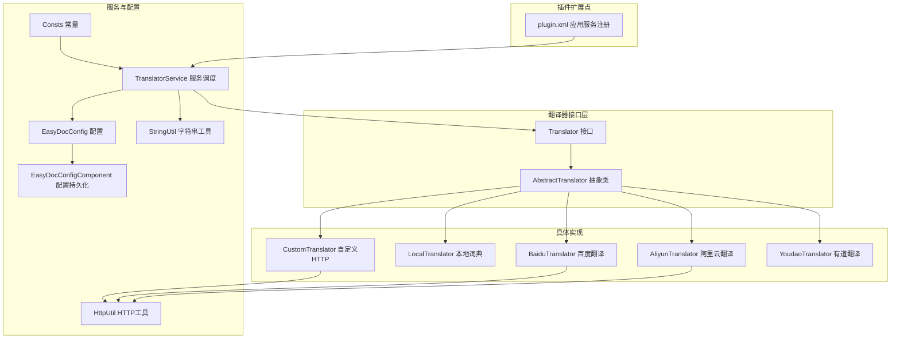
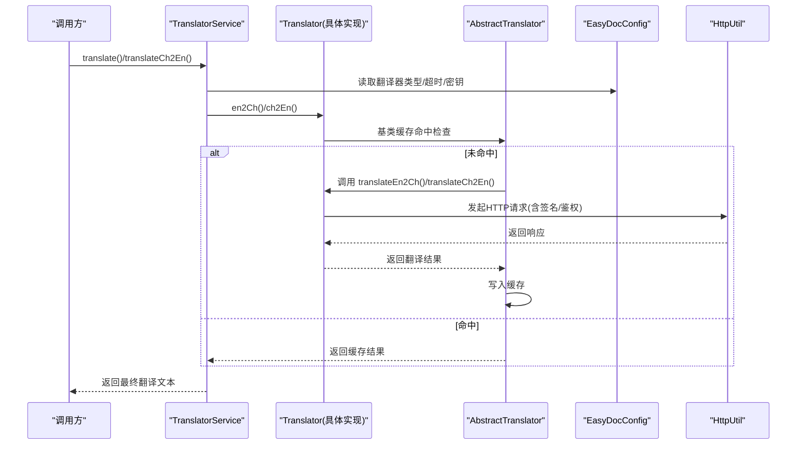
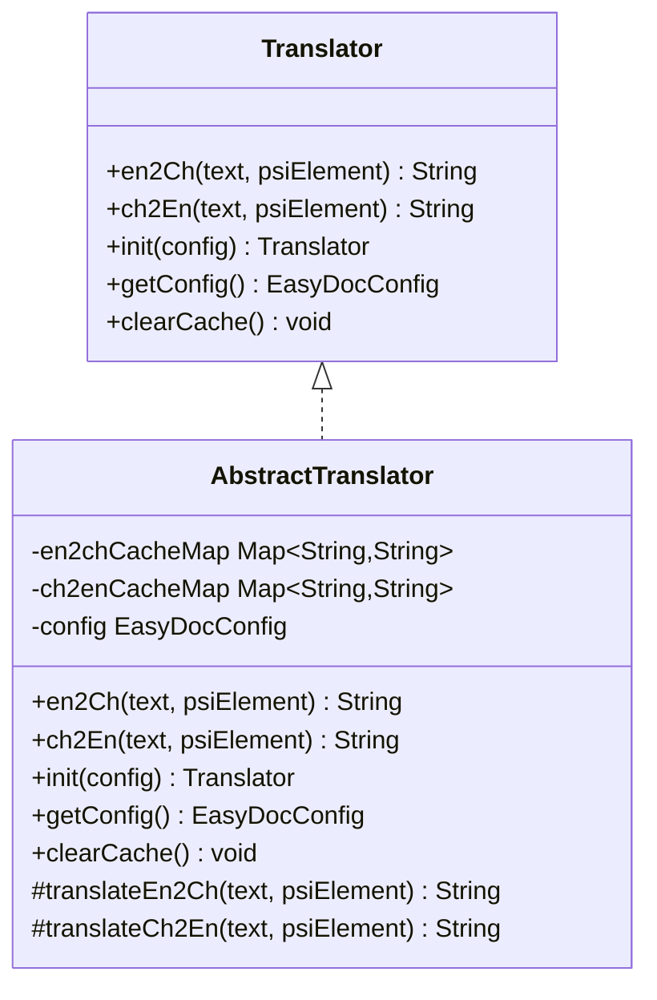
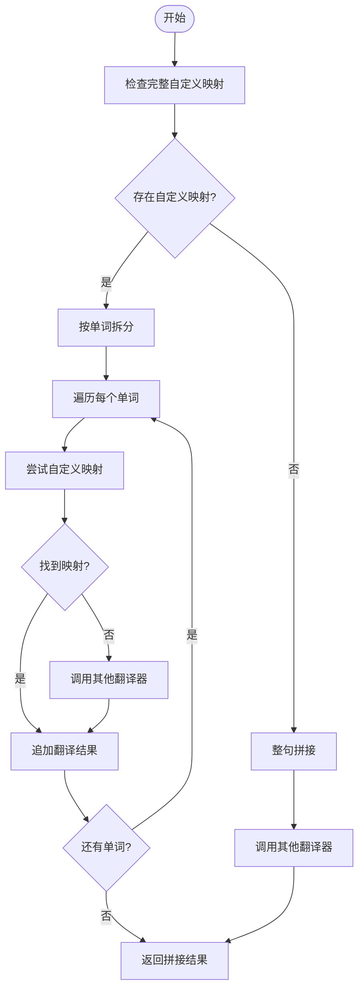
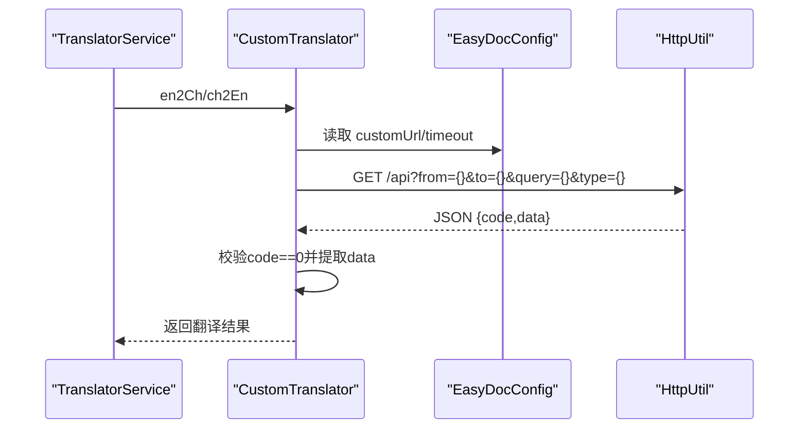
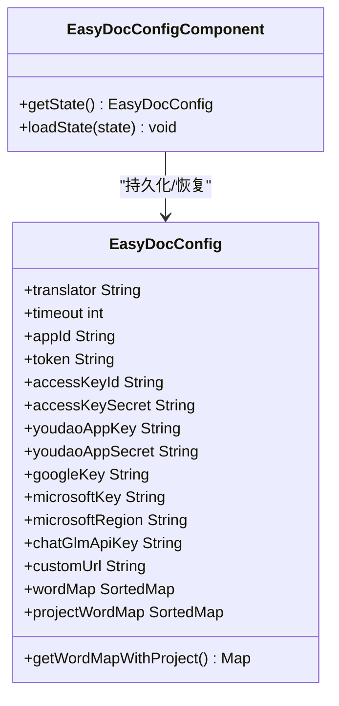
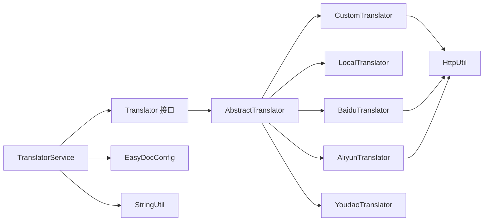

# 自定义翻译器开发

<cite>
**本文档引用的文件**
- [Translator.java](file://src/main/java/com/star/easydoc/service/translator/Translator.java)
- [AbstractTranslator.java](file://src/main/java/com/star/easydoc/service/translator/impl/AbstractTranslator.java)
- [TranslatorService.java](file://src/main/java/com/star/easydoc/service/translator/TranslatorService.java)
- [EasyDocConfig.java](file://src/main/java/com/star/easydoc/config/EasyDocConfig.java)
- [EasyDocConfigComponent.java](file://src/main/java/com/star/easydoc/config/EasyDocConfigComponent.java)
- [Consts.java](file://src/main/java/com/star/easydoc/common/Consts.java)
- [CustomTranslator.java](file://src/main/java/com/star/easydoc/service/translator/impl/CustomTranslator.java)
- [LocalTranslator.java](file://src/main/java/com/star/easydoc/service/translator/impl/LocalTranslator.java)
- [AliyunTranslator.java](file://src/main/java/com/star/easydoc/service/translator/impl/AliyunTranslator.java)
- [BaiduTranslator.java](file://src/main/java/com/star/easydoc/service/translator/impl/BaiduTranslator.java)
- [YoudaoTranslator.java](file://src/main/java/com/star/easydoc/service/translator/impl/YoudaoTranslator.java)
- [HttpUtil.java](file://src/main/java/com/star/easydoc/common/util/HttpUtil.java)
- [StringUtil.java](file://src/main/java/com/star/easydoc/common/util/StringUtil.java)
- [plugin.xml](file://src/main/resources/META-INF/plugin.xml)
</cite>

## 目录
1. [简介](#简介)
2. [项目结构](#项目结构)
3. [核心组件](#核心组件)
4. [架构总览](#架构总览)
5. [详细组件分析](#详细组件分析)
6. [依赖分析](#依赖分析)
7. [性能考虑](#性能考虑)
8. [故障排除指南](#故障排除指南)
9. [结论](#结论)
10. [附录](#附录)

## 简介
本指南面向需要为 Easy Javadoc 插件开发自定义翻译器的开发者。文档从接口设计、抽象基类提供的通用能力、具体实现模式、配置与注册流程、错误处理与缓存策略、认证与速率控制等方面进行系统讲解，并给出完整的开发步骤与最佳实践，帮助你在 IntelliJ 平台上快速实现稳定可靠的翻译器。

## 项目结构
翻译器体系位于 service.translator 包下，核心接口与抽象类定义于接口层，具体实现位于 impl 子包，配置由 EasyDocConfig 提供，服务层负责统一调度与缓存清理。

**图表来源**
- [Translator.java:13-53](file://src/main/java/com/star/easydoc/service/translator/Translator.java#L13-L53)
- [AbstractTranslator.java:14-91](file://src/main/java/com/star/easydoc/service/translator/impl/AbstractTranslator.java#L14-L91)
- [CustomTranslator.java:20-60](file://src/main/java/com/star/easydoc/service/translator/impl/CustomTranslator.java#L20-L60)
- [LocalTranslator.java:25-70](file://src/main/java/com/star/easydoc/service/translator/impl/LocalTranslator.java#L25-L70)
- [BaiduTranslator.java:21-137](file://src/main/java/com/star/easydoc/service/translator/impl/BaiduTranslator.java#L21-L137)
- [AliyunTranslator.java:35-282](file://src/main/java/com/star/easydoc/service/translator/impl/AliyunTranslator.java#L35-L282)
- [YoudaoTranslator.java:22-160](file://src/main/java/com/star/easydoc/service/translator/impl/YoudaoTranslator.java#L22-L160)
- [TranslatorService.java:41-237](file://src/main/java/com/star/easydoc/service/translator/TranslatorService.java#L41-L237)
- [EasyDocConfig.java:22-679](file://src/main/java/com/star/easydoc/config/EasyDocConfig.java#L22-L679)
- [EasyDocConfigComponent.java:20-68](file://src/main/java/com/star/easydoc/config/EasyDocConfigComponent.java#L20-L68)
- [Consts.java:14-99](file://src/main/java/com/star/easydoc/common/Consts.java#L14-L99)
- [HttpUtil.java:39-245](file://src/main/java/com/star/easydoc/common/util/HttpUtil.java#L39-L245)
- [StringUtil.java:13-71](file://src/main/java/com/star/easydoc/common/util/StringUtil.java#L13-L71)
- [plugin.xml:27-53](file://src/main/resources/META-INF/plugin.xml#L27-L53)

**章节来源**
- [plugin.xml:27-53](file://src/main/resources/META-INF/plugin.xml#L27-L53)
- [Consts.java:29-34](file://src/main/java/com/star/easydoc/common/Consts.java#L29-L34)

## 核心组件
- Translator 接口：定义 en2Ch、ch2En、init、getConfig、clearCache 五项能力，统一翻译器契约。
- AbstractTranslator 抽象类：提供并发安全的英译中/中译英缓存、基础 init/getConfig/clearCache 实现，子类只需实现 translateEn2Ch/translateCh2En 两个抽象方法。
- TranslatorService：负责翻译器实例化、注册、按配置选择具体实现、整句/单词粒度翻译、自动翻译、中译英格式化与缓存清理。
- EasyDocConfig/EasyDocConfigComponent：提供翻译器类型、超时、各平台密钥、自定义URL、单词映射等配置项，支持项目级词表合并。
- 工具类：HttpUtil 提供 GET/POST、编码、代理；StringUtil 提供英文单词拆分。

**章节来源**
- [Translator.java:13-53](file://src/main/java/com/star/easydoc/service/translator/Translator.java#L13-L53)
- [AbstractTranslator.java:14-91](file://src/main/java/com/star/easydoc/service/translator/impl/AbstractTranslator.java#L14-L91)
- [TranslatorService.java:41-237](file://src/main/java/com/star/easydoc/service/translator/TranslatorService.java#L41-L237)
- [EasyDocConfig.java:22-679](file://src/main/java/com/star/easydoc/config/EasyDocConfig.java#L22-L679)
- [EasyDocConfigComponent.java:20-68](file://src/main/java/com/star/easydoc/config/EasyDocConfigComponent.java#L20-L68)
- [HttpUtil.java:39-245](file://src/main/java/com/star/easydoc/common/util/HttpUtil.java#L39-L245)
- [StringUtil.java:13-71](file://src/main/java/com/star/easydoc/common/util/StringUtil.java#L13-L71)

## 架构总览
翻译调用链路如下：调用方通过 TranslatorService 调用，根据配置选择具体 Translator 实例；AbstractTranslator 提供缓存与 init/getConfig/clearCache；具体实现负责认证与请求构建；EasyDocConfig 提供密钥与超时等参数。

**图表来源**
- [TranslatorService.java:85-111](file://src/main/java/com/star/easydoc/service/translator/TranslatorService.java#L85-L111)
- [AbstractTranslator.java:22-52](file://src/main/java/com/star/easydoc/service/translator/impl/AbstractTranslator.java#L22-L52)
- [CustomTranslator.java:34-58](file://src/main/java/com/star/easydoc/service/translator/impl/CustomTranslator.java#L34-L58)
- [HttpUtil.java:53-103](file://src/main/java/com/star/easydoc/common/util/HttpUtil.java#L53-L103)

**章节来源**
- [TranslatorService.java:85-111](file://src/main/java/com/star/easydoc/service/translator/TranslatorService.java#L85-L111)
- [AbstractTranslator.java:22-52](file://src/main/java/com/star/easydoc/service/translator/impl/AbstractTranslator.java#L22-L52)

## 详细组件分析

### Translator 接口设计与实现要求
- en2Ch(text, psiElement)：英文到中文翻译入口，返回翻译结果或空字符串。
- ch2En(text, psiElement)：中文到英文翻译入口，返回翻译结果或空字符串。
- init(config)：接收 EasyDocConfig 完成初始化并返回自身，便于服务层统一注册。
- getConfig()：获取当前配置对象，供实现类读取密钥、超时、自定义URL等。
- clearCache()：清空缓存，服务层在配置变更或手动触发时调用。

实现要点
- 必须保证线程安全与幂等性，避免重复请求。
- 对空输入返回空字符串，保持调用方行为一致。
- 在实现中优先使用 getConfig() 读取配置，减少耦合。

**章节来源**
- [Translator.java:13-53](file://src/main/java/com/star/easydoc/service/translator/Translator.java#L13-L53)

### AbstractTranslator 抽象类通用能力
- 缓存机制：分别维护英文到中文与中文到英文的并发安全缓存，提升重复查询性能。
- 初始化与配置：提供 init/setConfig/getConfig，简化子类实现。
- 清理缓存：clearCache 清空两类缓存，便于重载配置后生效。
- 抽象方法：translateEn2Ch/translateCh2En 交由子类实现具体逻辑。

**图表来源**
- [Translator.java:13-53](file://src/main/java/com/star/easydoc/service/translator/Translator.java#L13-L53)
- [AbstractTranslator.java:14-91](file://src/main/java/com/star/easydoc/service/translator/impl/AbstractTranslator.java#L14-L91)

**章节来源**
- [AbstractTranslator.java:14-91](file://src/main/java/com/star/easydoc/service/translator/impl/AbstractTranslator.java#L14-L91)

### TranslatorService 调度与集成
- 初始化：在服务层统一注册所有内置翻译器实现，并通过 init(config) 完成各自初始化。
- 翻译策略：先检查自定义完整映射，再判断是否存在自定义单词；若存在则逐词翻译，否则整句翻译。
- 自动翻译：根据配置选择具体翻译器执行 en2Ch。
- 中译英格式化：过滤停用词、规范化大小写，输出适合变量命名的英文标识。
- 缓存管理：提供 clearCache 统一调用各实现的缓存清理。

**图表来源**
- [TranslatorService.java:85-111](file://src/main/java/com/star/easydoc/service/translator/TranslatorService.java#L85-L111)
- [TranslatorService.java:213-232](file://src/main/java/com/star/easydoc/service/translator/TranslatorService.java#L213-L232)

**章节来源**
- [TranslatorService.java:41-237](file://src/main/java/com/star/easydoc/service/translator/TranslatorService.java#L41-L237)

### 具体实现模式与认证差异

#### 自定义HTTP接口 (CustomTranslator)
- 功能：基于 EasyDocConfig.getCustomUrl 构建请求，支持 {from}、{to}、{query}、{type} 占位符。
- 认证：无内置签名，按自定义服务约定处理。
- 错误处理：解析响应码，失败记录日志并返回空字符串。
- 适用场景：对接企业内网翻译服务或自建翻译接口。

**图表来源**
- [CustomTranslator.java:34-58](file://src/main/java/com/star/easydoc/service/translator/impl/CustomTranslator.java#L34-L58)
- [HttpUtil.java:53-103](file://src/main/java/com/star/easydoc/common/util/HttpUtil.java#L53-L103)

**章节来源**
- [CustomTranslator.java:20-60](file://src/main/java/com/star/easydoc/service/translator/impl/CustomTranslator.java#L20-L60)

#### 本地词典 (LocalTranslator)
- 功能：加载 resources 下的 words.json，建立中英双向映射表。
- 初始化：懒加载与双重检查锁，避免重复解析。
- 适用场景：离线、低延迟、无需网络的轻量翻译。

**章节来源**
- [LocalTranslator.java:25-70](file://src/main/java/com/star/easydoc/service/translator/impl/LocalTranslator.java#L25-L70)

#### 百度翻译 (BaiduTranslator)
- 认证：appid + token + salt + q + sign 的 MD5 签名。
- 速率控制：当返回特定错误码时进行退避重试。
- 适用场景：公开API，需正确配置密钥。

**章节来源**
- [BaiduTranslator.java:21-137](file://src/main/java/com/star/easydoc/service/translator/impl/BaiduTranslator.java#L21-L137)

#### 阿里云翻译 (AliyunTranslator)
- 认证：HMAC-SHA1 签名，包含 Content-MD5、Date、Authorization 等头字段。
- 请求：POST JSON，包含 FormatType、SourceLanguage、TargetLanguage、SourceText、Scene 等字段。
- 适用场景：企业级服务，需准备 AK 与密钥。

**章节来源**
- [AliyunTranslator.java:35-282](file://src/main/java/com/star/easydoc/service/translator/impl/AliyunTranslator.java#L35-L282)

#### 有道翻译 (YoudaoTranslator)
- 状态：官方免费接口已停止，实现仅作提示与引导切换到付费方案。
- 适用场景：作为迁移参考，不建议直接使用。

**章节来源**
- [YoudaoTranslator.java:22-160](file://src/main/java/com/star/easydoc/service/translator/impl/YoudaoTranslator.java#L22-L160)

### 配置与注册流程

#### 配置项与易用性
- 翻译器类型：通过 EasyDocConfig.translator 选择，默认有多种内置实现。
- 超时：EasyDocConfig.timeout 控制HTTP请求超时。
- 各平台密钥：如 appId/token、accessKeyId/accessKeySecret、youdaoAppKey/youdaoAppSecret、googleKey、microsoftKey/microsoftRegion、chatGlmApiKey 等。
- 自定义URL：EasyDocConfig.customUrl 用于自定义HTTP翻译接口。
- 单词映射：支持全局与项目级词表合并，提高术语一致性。

**图表来源**
- [EasyDocConfig.java:82-136](file://src/main/java/com/star/easydoc/config/EasyDocConfig.java#L82-L136)
- [EasyDocConfig.java:426-450](file://src/main/java/com/star/easydoc/config/EasyDocConfig.java#L426-L450)
- [EasyDocConfigComponent.java:20-68](file://src/main/java/com/star/easydoc/config/EasyDocConfigComponent.java#L20-L68)

**章节来源**
- [EasyDocConfig.java:22-679](file://src/main/java/com/star/easydoc/config/EasyDocConfig.java#L22-L679)
- [EasyDocConfigComponent.java:20-68](file://src/main/java/com/star/easydoc/config/EasyDocConfigComponent.java#L20-L68)

#### 插件注册与服务发现
- plugin.xml 将 TranslatorService 注册为应用级服务，确保全局可用。
- Consts 定义了所有可用翻译器名称常量，服务层据此构建映射。

**章节来源**
- [plugin.xml:27-53](file://src/main/resources/META-INF/plugin.xml#L27-L53)
- [Consts.java:29-34](file://src/main/java/com/star/easydoc/common/Consts.java#L29-L34)

## 依赖分析
- 接口与抽象层：Translator → AbstractTranslator，职责清晰，子类仅关注业务实现。
- 服务层：TranslatorService 依赖 EasyDocConfig、Consts、StringUtil、各具体实现类。
- 工具层：HttpUtil 提供统一HTTP访问；StringUtil 提供英文单词拆分。
- 配置层：EasyDocConfigComponent 负责配置持久化与默认值初始化。

**图表来源**
- [TranslatorService.java:41-77](file://src/main/java/com/star/easydoc/service/translator/TranslatorService.java#L41-L77)
- [AbstractTranslator.java:14-91](file://src/main/java/com/star/easydoc/service/translator/impl/AbstractTranslator.java#L14-L91)
- [CustomTranslator.java:20-60](file://src/main/java/com/star/easydoc/service/translator/impl/CustomTranslator.java#L20-L60)
- [LocalTranslator.java:25-70](file://src/main/java/com/star/easydoc/service/translator/impl/LocalTranslator.java#L25-L70)
- [BaiduTranslator.java:21-137](file://src/main/java/com/star/easydoc/service/translator/impl/BaiduTranslator.java#L21-L137)
- [AliyunTranslator.java:35-282](file://src/main/java/com/star/easydoc/service/translator/impl/AliyunTranslator.java#L35-L282)
- [YoudaoTranslator.java:22-160](file://src/main/java/com/star/easydoc/service/translator/impl/YoudaoTranslator.java#L22-L160)
- [HttpUtil.java:39-245](file://src/main/java/com/star/easydoc/common/util/HttpUtil.java#L39-L245)
- [StringUtil.java:13-71](file://src/main/java/com/star/easydoc/common/util/StringUtil.java#L13-L71)

**章节来源**
- [TranslatorService.java:41-77](file://src/main/java/com/star/easydoc/service/translator/TranslatorService.java#L41-L77)

## 性能考虑
- 缓存优先：利用 AbstractTranslator 的缓存减少重复请求，显著降低延迟与成本。
- 整句 vs 单词：整句翻译通常更准确；存在自定义单词时采用逐词翻译，兼顾术语一致性。
- 超时与重试：合理设置 EasyDocConfig.timeout；对易限流的服务（如百度）进行退避重试。
- 代理与网络：HttpUtil 支持系统代理，必要时配置代理以提升稳定性。
- 本地词典：在离线或低延迟场景优先使用 LocalTranslator。

[本节为通用指导，无需特定文件引用]

## 故障排除指南
- 空输入与返回空字符串：确保对空文本的处理一致，避免上层误判。
- 日志与异常：实现类应捕获异常并记录详细日志，包含请求URL与响应体片段。
- 配置校验：确认密钥、区域、URL等配置正确；必要时在服务层打印关键配置。
- 速率限制：对易限流服务（如百度）增加重试与退避；对阿里云等需严格遵循签名规范。
- 缓存问题：手动调用 clearCache 或重启IDE后重试，确保新配置生效。

**章节来源**
- [AbstractTranslator.java:22-52](file://src/main/java/com/star/easydoc/service/translator/impl/AbstractTranslator.java#L22-L52)
- [CustomTranslator.java:44-58](file://src/main/java/com/star/easydoc/service/translator/impl/CustomTranslator.java#L44-L58)
- [BaiduTranslator.java:38-62](file://src/main/java/com/star/easydoc/service/translator/impl/BaiduTranslator.java#L38-L62)
- [AliyunTranslator.java:117-153](file://src/main/java/com/star/easydoc/service/translator/impl/AliyunTranslator.java#L117-L153)

## 结论
通过 Translator 接口与 AbstractTranslator 抽象类，Easy Javadoc 为自定义翻译器提供了清晰的扩展点。结合 TranslatorService 的统一调度、EasyDocConfig 的灵活配置与 HttpUtil 的网络工具，开发者可以快速实现稳定高效的翻译器，满足不同认证方式、API 限制与性能需求。

[本节为总结，无需特定文件引用]

## 附录

### 自定义翻译器开发步骤
- 新建类继承 AbstractTranslator，实现 translateEn2Ch 与 translateCh2En 两个方法。
- 在实现中使用 getConfig() 读取 EasyDocConfig，构建请求参数与鉴权信息。
- 使用 HttpUtil 发起HTTP请求，解析响应并返回翻译结果。
- 如需本地资源，可在首次使用时懒加载并缓存。
- 在 Consts 中新增翻译器名称常量，在 TranslatorService.init 中注册。
- 在 plugin.xml 中确保服务可用（如需），并在设置界面暴露配置项。

**章节来源**
- [AbstractTranslator.java:14-91](file://src/main/java/com/star/easydoc/service/translator/impl/AbstractTranslator.java#L14-L91)
- [Consts.java:89-90](file://src/main/java/com/star/easydoc/common/Consts.java#L89-L90)
- [TranslatorService.java:60-76](file://src/main/java/com/star/easydoc/service/translator/TranslatorService.java#L60-L76)
- [HttpUtil.java:53-103](file://src/main/java/com/star/easydoc/common/util/HttpUtil.java#L53-L103)
- [EasyDocConfig.java:135-136](file://src/main/java/com/star/easydoc/config/EasyDocConfig.java#L135-L136)

### 常见认证方式与速率控制
- 自定义HTTP：按服务端约定处理，常见为查询参数或请求头。
- 百度翻译：MD5 签名，出现特定错误码时进行退避重试。
- 阿里云翻译：HMAC-SHA1 签名，严格遵循 Content-MD5、Date、Authorization 等头字段。
- 有道翻译：官方免费接口已停止，建议切换至付费方案或自定义实现。

**章节来源**
- [CustomTranslator.java:34-58](file://src/main/java/com/star/easydoc/service/translator/impl/CustomTranslator.java#L34-L58)
- [BaiduTranslator.java:42-62](file://src/main/java/com/star/easydoc/service/translator/impl/BaiduTranslator.java#L42-L62)
- [AliyunTranslator.java:117-153](file://src/main/java/com/star/easydoc/service/translator/impl/AliyunTranslator.java#L117-L153)
- [YoudaoTranslator.java:32-42](file://src/main/java/com/star/easydoc/service/translator/impl/YoudaoTranslator.java#L32-L42)

### 与 EasyDocConfig 的集成要点
- 读取配置：在 init 中保存 EasyDocConfig 引用，后续在实现中通过 getConfig() 获取。
- 项目级词表：使用 getWordMapWithProject() 合并全局与项目级词表，提升术语一致性。
- 配置持久化：通过 EasyDocConfigComponent 的 getState/loadState 管理默认值与恢复。

**章节来源**
- [AbstractTranslator.java:54-63](file://src/main/java/com/star/easydoc/service/translator/impl/AbstractTranslator.java#L54-L63)
- [EasyDocConfig.java:426-450](file://src/main/java/com/star/easydoc/config/EasyDocConfig.java#L426-L450)
- [EasyDocConfigComponent.java:31-66](file://src/main/java/com/star/easydoc/config/EasyDocConfigComponent.java#L31-L66)