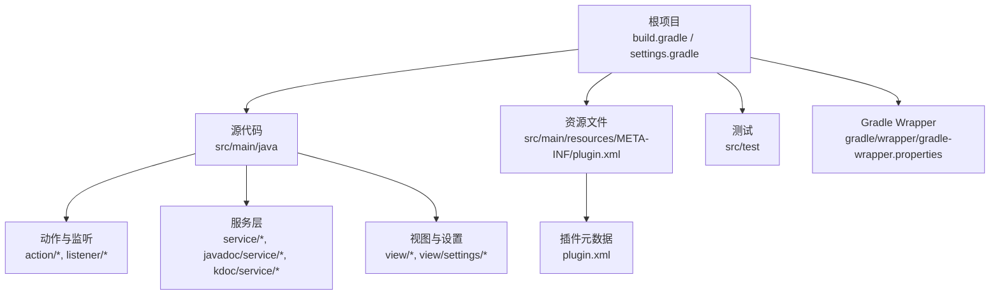
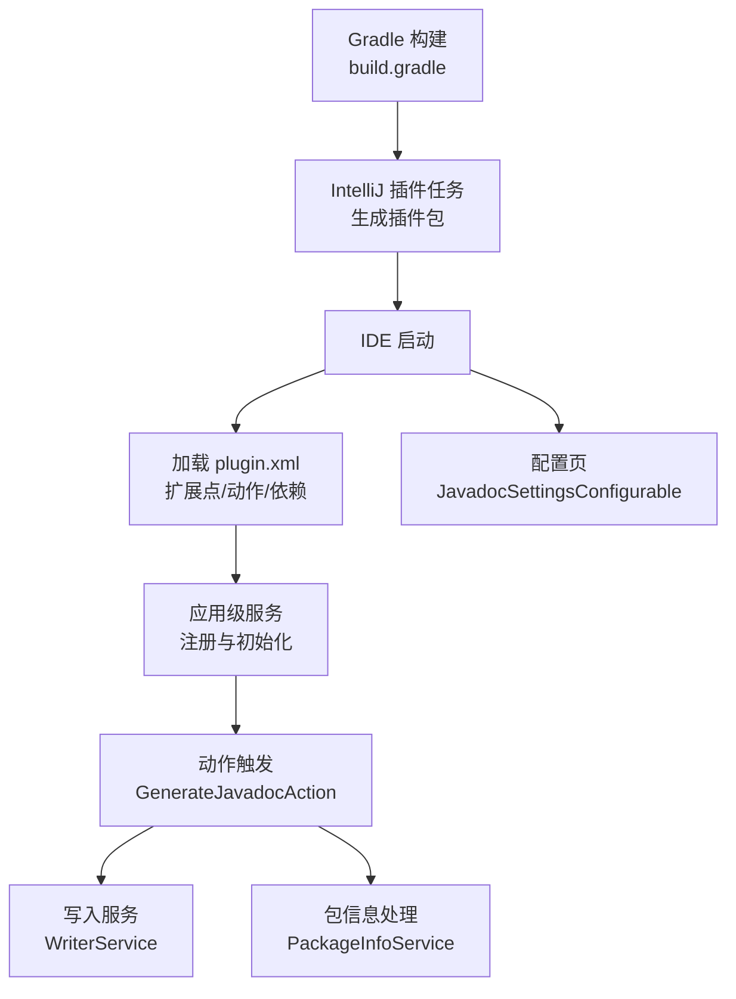
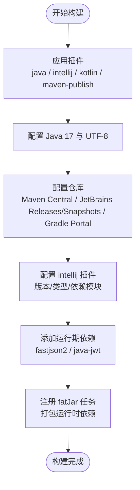
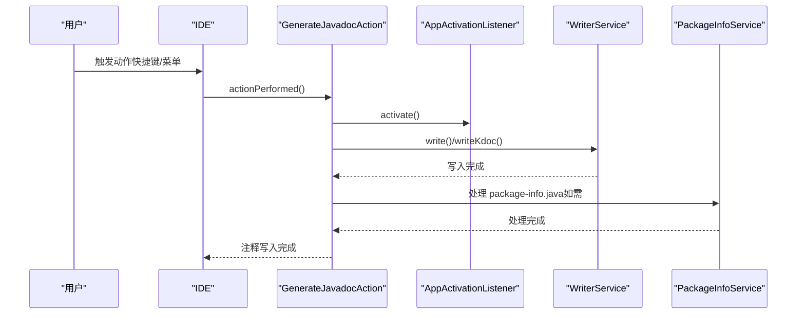
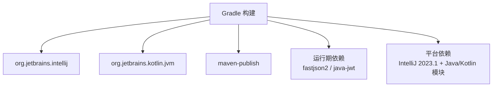

# 构建与部署

<cite>
**本文引用的文件**
- [build.gradle](file://build.gradle)
- [settings.gradle](file://settings.gradle)
- [gradle/wrapper/gradle-wrapper.properties](file://gradle/wrapper/gradle-wrapper.properties)
- [src/main/resources/META-INF/plugin.xml](file://src/main/resources/META-INF/plugin.xml)
- [README.md](file://README.md)
- [src/main/java/com/star/easydoc/action/GenerateJavadocAction.java](file://src/main/java/com/star/easydoc/action/GenerateJavadocAction.java)
- [src/main/java/com/star/easydoc/config/EasyDocConfigComponent.java](file://src/main/java/com/star/easydoc/config/EasyDocConfigComponent.java)
- [src/main/java/com/star/easydoc/service/WriterService.java](file://src/main/java/com/star/easydoc/service/WriterService.java)
- [src/main/java/com/star/easydoc/service/PackageInfoService.java](file://src/main/java/com/star/easydoc/service/PackageInfoService.java)
- [src/main/java/com/star/easydoc/listener/AppActivationListener.java](file://src/main/java/com/star/easydoc/listener/AppActivationListener.java)
- [src/main/java/com/star/easydoc/view/settings/javadoc/JavadocSettingsConfigurable.java](file://src/main/java/com/star/easydoc/view/settings/javadoc/JavadocSettingsConfigurable.java)
- [src/test/java/com/star/easydoc/MainTest.java](file://src/test/java/com/star/easydoc/MainTest.java)
</cite>

## 目录
1. [简介](#简介)
2. [项目结构](#项目结构)
3. [核心组件](#核心组件)
4. [架构总览](#架构总览)
5. [详细组件分析](#详细组件分析)
6. [依赖分析](#依赖分析)
7. [性能考虑](#性能考虑)
8. [故障排查指南](#故障排查指南)
9. [结论](#结论)
10. [附录](#附录)

## 简介
本指南面向 Easy Javadoc 插件的构建与部署，聚焦于 Gradle 构建脚本的配置与使用、构建任务与依赖管理、插件打包流程（JAR 生成、版本号管理、发布配置）、安装与分发方式（本地安装、IDEA 插件市场发布）、版本控制与发布流程（版本号规范、变更日志维护、发布标签管理），并提供构建优化技巧、常见失败原因与解决方案，以及部署注意事项。

## 项目结构
该仓库采用标准的 IntelliJ 平台插件工程布局，主要模块与职责如下：
- 根目录 Gradle 构建脚本与设置：定义插件、仓库、依赖、编译选项与打包任务。
- 源码目录 src/main/java：包含插件的核心业务逻辑、服务层、视图与配置项。
- 资源目录 src/main/resources：包含插件元数据文件 plugin.xml，声明插件 ID、名称、描述、变更日志、依赖模块、扩展点与动作等。
- 测试目录 src/test：包含基础测试入口。
- Gradle Wrapper：固定 Gradle 版本以确保构建一致性。

图表来源
- [build.gradle](file://build.gradle)
- [settings.gradle](file://settings.gradle)
- [gradle/wrapper/gradle-wrapper.properties](file://gradle/wrapper/gradle-wrapper.properties)
- [src/main/resources/META-INF/plugin.xml](file://src/main/resources/META-INF/plugin.xml)

章节来源
- [build.gradle:1-78](file://build.gradle#L1-L78)
- [settings.gradle:1-3](file://settings.gradle#L1-L3)
- [gradle/wrapper/gradle-wrapper.properties:1-7](file://gradle/wrapper/gradle-wrapper.properties#L1-L7)

## 核心组件
- 构建与打包
  - Gradle 插件：java、org.jetbrains.intellij、org.jetbrains.kotlin.jvm、maven-publish。
  - 编译目标：Java 17；Kotlin JVM 目标 17；统一 UTF-8 编码。
  - 仓库：Maven Central、JetBrains 发布与快照仓库、Gradle 插件门户。
  - 插件运行环境：IntelliJ IDEA 2023.1（IC 类型），依赖 Java 与 Kotlin 模块。
  - 依赖：fastjson2、java-jwt。
  - 自定义任务：fatJar（生成包含运行时依赖的可执行 JAR，带 classifier）。
- 插件元数据
  - 插件 ID、名称、供应商、描述、变更日志、最低兼容构建号、依赖模块。
  - 扩展点：应用级服务注册、配置页注册。
  - 动作：工具菜单下的“生成 Javadoc/KDoc”相关动作及快捷键绑定。
- 运行期组件
  - 动作与监听：GenerateJavadocAction、AppActivationListener。
  - 服务层：WriterService（写入注释）、PackageInfoService（package-info.java 处理）、配置组件 EasyDocConfigComponent。
  - 设置页：JavadocSettingsConfigurable 等。

章节来源
- [build.gradle:1-78](file://build.gradle#L1-L78)
- [src/main/resources/META-INF/plugin.xml:1-82](file://src/main/resources/META-INF/plugin.xml#L1-L82)
- [src/main/java/com/star/easydoc/action/GenerateJavadocAction.java:46-74](file://src/main/java/com/star/easydoc/action/GenerateJavadocAction.java#L46-L74)
- [src/main/java/com/star/easydoc/listener/AppActivationListener.java:77-119](file://src/main/java/com/star/easydoc/listener/AppActivationListener.java#L77-L119)
- [src/main/java/com/star/easydoc/service/WriterService.java:77-113](file://src/main/java/com/star/easydoc/service/WriterService.java#L77-L113)
- [src/main/java/com/star/easydoc/service/PackageInfoService.java:22-79](file://src/main/java/com/star/easydoc/service/PackageInfoService.java#L22-L79)
- [src/main/java/com/star/easydoc/config/EasyDocConfigComponent.java:19-22](file://src/main/java/com/star/easydoc/config/EasyDocConfigComponent.java#L19-L22)
- [src/main/java/com/star/easydoc/view/settings/javadoc/JavadocSettingsConfigurable.java:19-34](file://src/main/java/com/star/easydoc/view/settings/javadoc/JavadocSettingsConfigurable.java#L19-L34)

## 架构总览
下图展示了从构建到运行的关键交互：Gradle 通过 intellij 插件生成平台兼容的插件包，IDE 启动后加载 plugin.xml 中声明的扩展与动作，并由服务层完成注释生成与写入。

图表来源
- [build.gradle:1-78](file://build.gradle#L1-L78)
- [src/main/resources/META-INF/plugin.xml:1-82](file://src/main/resources/META-INF/plugin.xml#L1-L82)
- [src/main/java/com/star/easydoc/action/GenerateJavadocAction.java:46-74](file://src/main/java/com/star/easydoc/action/GenerateJavadocAction.java#L46-L74)
- [src/main/java/com/star/easydoc/service/WriterService.java:77-113](file://src/main/java/com/star/easydoc/service/WriterService.java#L77-L113)
- [src/main/java/com/star/easydoc/service/PackageInfoService.java:22-79](file://src/main/java/com/star/easydoc/service/PackageInfoService.java#L22-L79)
- [src/main/java/com/star/easydoc/view/settings/javadoc/JavadocSettingsConfigurable.java:19-34](file://src/main/java/com/star/easydoc/view/settings/javadoc/JavadocSettingsConfigurable.java#L19-L34)

## 详细组件分析

### 构建与打包流程
- 插件与仓库
  - 使用 org.jetbrains.intellij 插件生成与验证平台兼容的插件包。
  - 使用 maven-publish 插件便于后续发布到公共仓库（如需要）。
  - 仓库优先使用 Maven Central 与 JetBrains 发布/快照仓库，保证依赖稳定性与可获得性。
- 编译与语言级别
  - 统一 Java 与 Kotlin 的编译目标为 17，Kotlin 语言与 API 版本为 1.8。
  - 全局设置 UTF-8 编码，避免资源与注释中的字符问题。
- 插件运行环境
  - 指定 IDE 版本与类型（IC），并声明对 Java 与 Kotlin 模块的依赖。
- 依赖管理
  - fastjson2 与 java-jwt 作为运行期依赖引入。
- 自定义打包任务
  - fatJar 任务将 runtimeClasspath 依赖打包进输出 JAR，并设置 classifier 为 all，便于区分与分发。

图表来源
- [build.gradle:1-78](file://build.gradle#L1-L78)

章节来源
- [build.gradle:1-78](file://build.gradle#L1-L78)

### 版本号管理与变更日志
- 版本号来源
  - Gradle 构建脚本中定义了插件版本号。
  - plugin.xml 的 change-notes 中也包含对应版本的更新记录。
- 版本号规范建议
  - 采用语义化版本（主.次.补丁），并在发布前同步更新 plugin.xml 的 change-notes 与 README 的更新履历。
  - 在 Git 打标签时与版本号保持一致，便于回溯与发布。
- 变更日志维护
  - 建议每次发布更新 README 的“更新履历”与 plugin.xml 的“change-notes”，明确列出新增功能、修复与兼容性说明。

章节来源
- [build.gradle:12-13](file://build.gradle#L12-L13)
- [src/main/resources/META-INF/plugin.xml:16-23](file://src/main/resources/META-INF/plugin.xml#L16-L23)
- [README.md:86-266](file://README.md#L86-L266)

### 插件安装与分发
- 本地安装
  - 通过 Gradle 生成插件包后，在 IDE 插件设置中选择“从磁盘安装”方式进行安装。
- IDEA 插件市场发布
  - 通过 JetBrains 官方渠道提交插件包，需满足平台兼容性要求与审核规范。
  - 发布前确保 plugin.xml 的变更日志、描述、图标与兼容性声明完整准确。

章节来源
- [src/main/resources/META-INF/plugin.xml:1-82](file://src/main/resources/META-INF/plugin.xml#L1-L82)

### 运行期组件与交互序列
以下序列图展示了用户触发生成注释的动作到最终写入编辑器的完整流程。

图表来源
- [src/main/java/com/star/easydoc/action/GenerateJavadocAction.java:46-74](file://src/main/java/com/star/easydoc/action/GenerateJavadocAction.java#L46-L74)
- [src/main/java/com/star/easydoc/listener/AppActivationListener.java:77-119](file://src/main/java/com/star/easydoc/listener/AppActivationListener.java#L77-L119)
- [src/main/java/com/star/easydoc/service/WriterService.java:77-113](file://src/main/java/com/star/easydoc/service/WriterService.java#L77-L113)
- [src/main/java/com/star/easydoc/service/PackageInfoService.java:22-79](file://src/main/java/com/star/easydoc/service/PackageInfoService.java#L22-L79)

## 依赖分析
- 构建期依赖
  - org.jetbrains.intellij：生成与打包插件。
  - org.jetbrains.kotlin.jvm：Kotlin 编译支持。
  - maven-publish：发布支持（可选）。
- 运行期依赖
  - fastjson2：JSON 解析。
  - java-jwt：JWT 处理。
- 平台依赖
  - IntelliJ IDEA 2023.1（IC）及以上。
  - Java 与 Kotlin 模块。

图表来源
- [build.gradle:1-78](file://build.gradle#L1-L78)

章节来源
- [build.gradle:1-78](file://build.gradle#L1-L78)

## 性能考虑
- 编译与打包
  - 固定 Java 与 Kotlin 目标版本，减少跨版本兼容性问题与编译差异。
  - 统一 UTF-8 编码，避免资源与注释中的字符集问题导致的额外处理开销。
  - 使用 fatJar 任务时注意排除重复策略，避免重复文件带来的包体膨胀。
- 运行期性能
  - 服务层尽量复用实例与连接，避免频繁创建对象。
  - 对网络请求（翻译、AI 等）增加超时与重试策略，提升稳定性与用户体验。
- 构建优化
  - 使用 Gradle Wrapper 固定版本，确保团队与 CI 环境一致。
  - 合理拆分任务，避免不必要的全量构建。

## 故障排查指南
- 构建失败
  - Java/Kotlin 版本不匹配：确认 Java 与 Kotlin 目标版本均为 17。
  - 仓库不可达：检查网络与代理设置，确保可访问 Maven Central 与 JetBrains 仓库。
  - intellij 插件版本不兼容：根据目标 IDE 版本调整 intellij 插件版本与 IDE 类型。
- 插件安装失败
  - 平台兼容性：确认 IDE 版本满足 since-build 要求。
  - 依赖缺失：确保运行期依赖已正确打包或可用。
- 运行期异常
  - 写入失败：检查 WriterService 的写入逻辑与权限。
  - package-info 处理异常：检查 PackageInfoService 的文件创建与写入流程。
  - 配置未生效：确认 EasyDocConfigComponent 的状态持久化与初始化流程。

章节来源
- [build.gradle:12-13](file://build.gradle#L12-L13)
- [build.gradle:42-47](file://build.gradle#L42-L47)
- [build.gradle:51-56](file://build.gradle#L51-L56)
- [src/main/resources/META-INF/plugin.xml:25-25](file://src/main/resources/META-INF/plugin.xml#L25-L25)
- [src/main/java/com/star/easydoc/service/WriterService.java:77-113](file://src/main/java/com/star/easydoc/service/WriterService.java#L77-L113)
- [src/main/java/com/star/easydoc/service/PackageInfoService.java:22-79](file://src/main/java/com/star/easydoc/service/PackageInfoService.java#L22-L79)
- [src/main/java/com/star/easydoc/config/EasyDocConfigComponent.java:19-22](file://src/main/java/com/star/easydoc/config/EasyDocConfigComponent.java#L19-L22)

## 结论
本指南基于现有构建与源码配置，给出了 Easy Javadoc 插件的构建与部署实践路径。建议在持续集成中固定 Gradle 版本与 JDK 版本，严格遵循版本号与变更日志规范，并在发布前完成本地与 IDE 的回归验证，以确保插件的稳定性与可维护性。

## 附录
- 构建命令参考
  - 生成插件包：使用 intellij 插件提供的打包任务。
  - 生成 fatJar：使用自定义 fatJar 任务，输出带 classifier 的可运行 JAR。
- 发布准备清单
  - 更新版本号与变更日志。
  - 生成并校验插件包。
  - 准备插件市场所需材料（截图、描述、图标等）。
  - 提交至 JetBrains 插件市场并跟踪审核反馈。