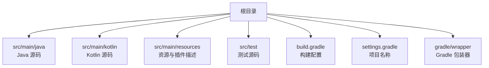
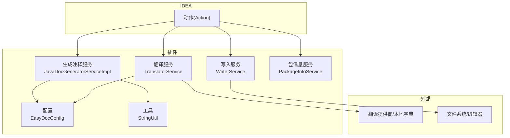
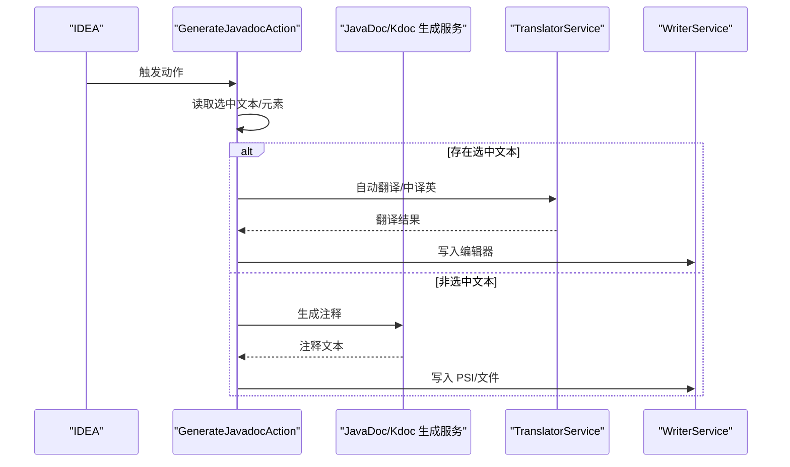
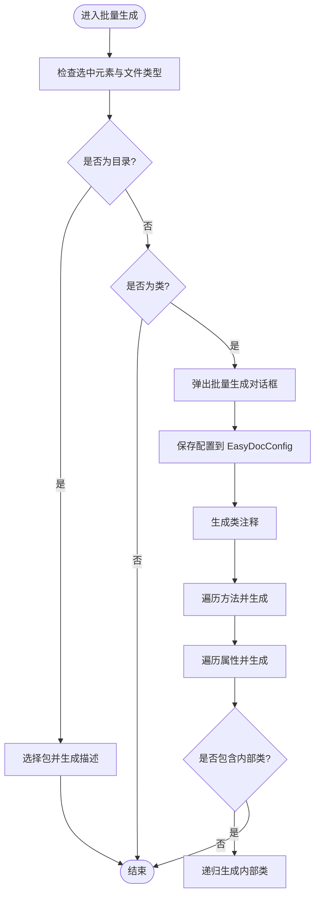
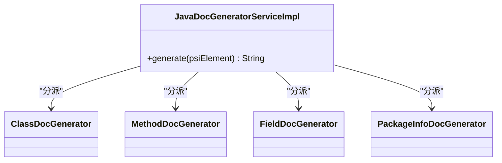
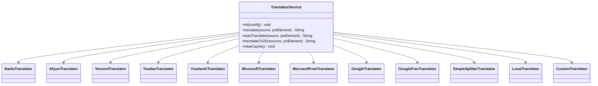
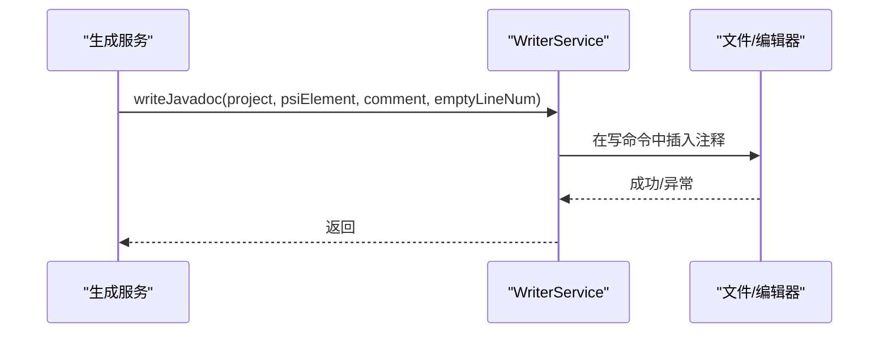
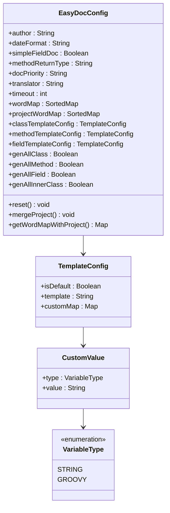
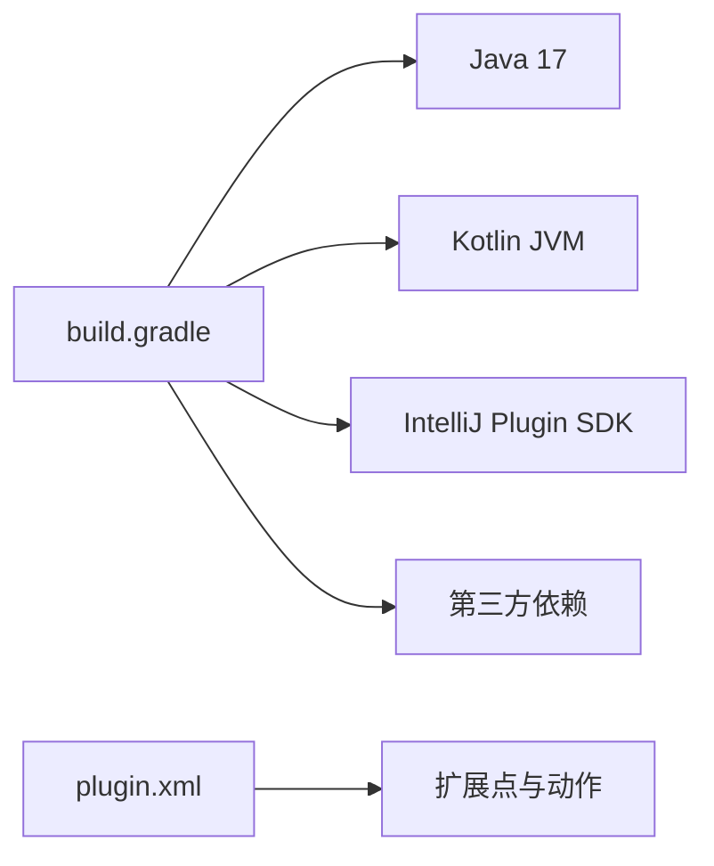

# 测试与调试

<cite>
**本文引用的文件**
- [README.md](file://README.md)
- [build.gradle](file://build.gradle)
- [settings.gradle](file://settings.gradle)
- [gradle-wrapper.properties](file://gradle/wrapper/gradle-wrapper.properties)
- [plugin.xml](file://src/main/resources/META-INF/plugin.xml)
- [MainTest.java](file://src/test/java/com/star/easydoc/MainTest.java)
- [GenerateJavadocAction.java](file://src/main/java/com/star/easydoc/action/GenerateJavadocAction.java)
- [GenerateAllJavadocAction.java](file://src/main/java/com/star/easydoc/action/GenerateAllJavadocAction.java)
- [JavaDocGeneratorServiceImpl.java](file://src/main/java/com/star/easydoc/javadoc/service/JavaDocGeneratorServiceImpl.java)
- [TranslatorService.java](file://src/main/java/com/star/easydoc/service/translator/TranslatorService.java)
- [WriterService.java](file://src/main/java/com/star/easydoc/service/WriterService.java)
- [EasyDocConfig.java](file://src/main/java/com/star/easydoc/config/EasyDocConfig.java)
- [StringUtil.java](file://src/main/java/com/star/easydoc/common/util/StringUtil.java)
</cite>

## 目录
1. [简介](#简介)
2. [项目结构](#项目结构)
3. [核心组件](#核心组件)
4. [架构总览](#架构总览)
5. [详细组件分析](#详细组件分析)
6. [依赖分析](#依赖分析)
7. [性能考量](#性能考量)
8. [故障排除指南](#故障排除指南)
9. [结论](#结论)
10. [附录](#附录)

## 简介
本指南面向 Easy Javadoc 插件的测试与调试工作，目标是帮助开发者建立完善的单元测试、集成测试与调试流程，涵盖以下方面：
- 单元测试：JUnit 使用、测试用例设计、断言方法与边界条件覆盖
- 集成测试：插件功能测试、IDEA 集成测试要点
- 调试技巧：IDEA 调试器配置、断点设置、变量监控与日志定位
- 性能测试：内存使用分析、执行时间测量与热点识别
- 测试覆盖率：覆盖率要求与提升策略
- 常见问题与故障排除：典型问题定位与解决思路
- 持续集成与自动化测试：CI/CD 配置建议与自动化测试落地

## 项目结构
该项目为 IntelliJ IDEA 插件工程，采用 Gradle 构建，主模块包含 Java/Kotlin 源码与资源文件，测试位于独立的测试源集中。根构建脚本定义了 Java/Kotlin 版本、IntelliJ 插件开发插件以及依赖仓库。

**图表来源**
- [build.gradle:1-78](file://build.gradle#L1-L78)
- [settings.gradle:1-3](file://settings.gradle#L1-L3)
- [gradle-wrapper.properties:1-7](file://gradle/wrapper/gradle-wrapper.properties#L1-L7)

**章节来源**
- [build.gradle:1-78](file://build.gradle#L1-L78)
- [settings.gradle:1-3](file://settings.gradle#L1-L3)
- [gradle-wrapper.properties:1-7](file://gradle/wrapper/gradle-wrapper.properties#L1-L7)

## 核心组件
- 动作(Action)层：负责响应 IDE 快捷键与菜单动作，协调服务层生成注释与写入编辑器/文件。
- 服务(Service)层：封装业务逻辑，如注释生成、翻译、写入、包信息处理等。
- 配置(Config)层：持久化用户配置与模板，提供全局开关与参数。
- 工具(Util)层：通用工具类，如字符串处理、集合操作等。

**章节来源**
- [plugin.xml:27-53](file://src/main/resources/META-INF/plugin.xml#L27-L53)
- [GenerateJavadocAction.java:46-175](file://src/main/java/com/star/easydoc/action/GenerateJavadocAction.java#L46-L175)
- [GenerateAllJavadocAction.java:47-218](file://src/main/java/com/star/easydoc/action/GenerateAllJavadocAction.java#L47-L218)
- [JavaDocGeneratorServiceImpl.java:25-50](file://src/main/java/com/star/easydoc/javadoc/service/JavaDocGeneratorServiceImpl.java#L25-L50)
- [TranslatorService.java:41-238](file://src/main/java/com/star/easydoc/service/translator/TranslatorService.java#L41-L238)
- [WriterService.java:25-113](file://src/main/java/com/star/easydoc/service/WriterService.java#L25-L113)
- [EasyDocConfig.java:22-680](file://src/main/java/com/star/easydoc/config/EasyDocConfig.java#L22-L680)
- [StringUtil.java:13-72](file://src/main/java/com/star/easydoc/common/util/StringUtil.java#L13-L72)

## 架构总览
插件通过动作(Action)触发，调用服务层完成注释生成、翻译与写入；配置层提供参数与模板；工具层提供通用能力；资源文件(plugin.xml)声明扩展点与快捷键。

**图表来源**
- [plugin.xml:55-78](file://src/main/resources/META-INF/plugin.xml#L55-L78)
- [GenerateJavadocAction.java:48-52](file://src/main/java/com/star/easydoc/action/GenerateJavadocAction.java#L48-L52)
- [GenerateAllJavadocAction.java:52-57](file://src/main/java/com/star/easydoc/action/GenerateAllJavadocAction.java#L52-L57)
- [JavaDocGeneratorServiceImpl.java:27-33](file://src/main/java/com/star/easydoc/javadoc/service/JavaDocGeneratorServiceImpl.java#L27-L33)
- [TranslatorService.java:52-77](file://src/main/java/com/star/easydoc/service/translator/TranslatorService.java#L52-L77)
- [WriterService.java:36-98](file://src/main/java/com/star/easydoc/service/WriterService.java#L36-L98)
- [EasyDocConfig.java:426-450](file://src/main/java/com/star/easydoc/config/EasyDocConfig.java#L426-L450)
- [StringUtil.java:40-45](file://src/main/java/com/star/easydoc/common/util/StringUtil.java#L40-L45)

## 详细组件分析

### 动作层：GenerateJavadocAction
该动作负责处理单个元素的注释生成与选中文本的翻译功能；同时支持 Java 与 Kotlin 文件的差异化处理，并在必要时创建 package-info.java 的注释。

**图表来源**
- [GenerateJavadocAction.java:72-115](file://src/main/java/com/star/easydoc/action/GenerateJavadocAction.java#L72-L115)
- [GenerateJavadocAction.java:124-154](file://src/main/java/com/star/easydoc/action/GenerateJavadocAction.java#L124-L154)
- [GenerateJavadocAction.java:163-173](file://src/main/java/com/star/easydoc/action/GenerateJavadocAction.java#L163-L173)
- [JavaDocGeneratorServiceImpl.java:35-48](file://src/main/java/com/star/easydoc/javadoc/service/JavaDocGeneratorServiceImpl.java#L35-L48)
- [TranslatorService.java:157-163](file://src/main/java/com/star/easydoc/service/translator/TranslatorService.java#L157-L163)
- [WriterService.java:36-98](file://src/main/java/com/star/easydoc/service/WriterService.java#L36-L98)

**章节来源**
- [GenerateJavadocAction.java:46-175](file://src/main/java/com/star/easydoc/action/GenerateJavadocAction.java#L46-L175)

### 动作层：GenerateAllJavadocAction
该动作负责批量生成注释，支持类、方法、属性与内部类的选择性生成，并在文件夹场景下引导用户选择包并生成 package-info.java 的描述注释。

**图表来源**
- [GenerateAllJavadocAction.java:59-74](file://src/main/java/com/star/easydoc/action/GenerateAllJavadocAction.java#L59-L74)
- [GenerateAllJavadocAction.java:79-136](file://src/main/java/com/star/easydoc/action/GenerateAllJavadocAction.java#L79-L136)
- [GenerateAllJavadocAction.java:155-216](file://src/main/java/com/star/easydoc/action/GenerateAllJavadocAction.java#L155-L216)
- [EasyDocConfig.java:576-606](file://src/main/java/com/star/easydoc/config/EasyDocConfig.java#L576-L606)

**章节来源**
- [GenerateAllJavadocAction.java:47-218](file://src/main/java/com/star/easydoc/action/GenerateAllJavadocAction.java#L47-L218)

### 服务层：JavaDocGeneratorServiceImpl
根据 PSI 元素类型分派到对应的 Doc 生成器，实现类、方法、属性与包信息的注释生成。

**图表来源**
- [JavaDocGeneratorServiceImpl.java:27-33](file://src/main/java/com/star/easydoc/javadoc/service/JavaDocGeneratorServiceImpl.java#L27-L33)
- [JavaDocGeneratorServiceImpl.java:35-48](file://src/main/java/com/star/easydoc/javadoc/service/JavaDocGeneratorServiceImpl.java#L35-L48)

**章节来源**
- [JavaDocGeneratorServiceImpl.java:25-50](file://src/main/java/com/star/easydoc/javadoc/service/JavaDocGeneratorServiceImpl.java#L25-L50)

### 服务层：TranslatorService
统一管理多种翻译实现，支持自定义单词映射、整句翻译与逐词翻译策略，并提供中译英命名生成能力。

**图表来源**
- [TranslatorService.java:52-77](file://src/main/java/com/star/easydoc/service/translator/TranslatorService.java#L52-L77)
- [TranslatorService.java:85-111](file://src/main/java/com/star/easydoc/service/translator/TranslatorService.java#L85-L111)
- [TranslatorService.java:157-163](file://src/main/java/com/star/easydoc/service/translator/TranslatorService.java#L157-L163)
- [TranslatorService.java:171-205](file://src/main/java/com/star/easydoc/service/translator/TranslatorService.java#L171-L205)

**章节来源**
- [TranslatorService.java:41-238](file://src/main/java/com/star/easydoc/service/translator/TranslatorService.java#L41-L238)

### 服务层：WriterService
负责将生成的注释写入 PSI 或编辑器，确保线程安全与异常处理。

**图表来源**
- [WriterService.java:36-98](file://src/main/java/com/star/easydoc/service/WriterService.java#L36-L98)

**章节来源**
- [WriterService.java:25-113](file://src/main/java/com/star/easydoc/service/WriterService.java#L25-L113)

### 配置层：EasyDocConfig
提供作者、日期格式、返回值类型、覆盖模式、翻译提供商、超时、单词映射、模板配置等持久化参数，并支持项目级单词映射合并。

**图表来源**
- [EasyDocConfig.java:22-680](file://src/main/java/com/star/easydoc/config/EasyDocConfig.java#L22-L680)

**章节来源**
- [EasyDocConfig.java:22-680](file://src/main/java/com/star/easydoc/config/EasyDocConfig.java#L22-L680)

### 工具层：StringUtil
提供字符串处理能力，如单词分割、统计结尾字符数量等。

**章节来源**
- [StringUtil.java:13-72](file://src/main/java/com/star/easydoc/common/util/StringUtil.java#L13-L72)

## 依赖分析
- 构建与运行环境：Java 17、Kotlin JVM、IntelliJ 插件 SDK、Gradle 包装器。
- 外部依赖：JSON 序列化库、JWT 工具库等。
- 插件扩展点：动作(Action)、应用服务(Application Service)、配置面板(Configurable)。

**图表来源**
- [build.gradle:16-35](file://build.gradle#L16-L35)
- [plugin.xml:27-53](file://src/main/resources/META-INF/plugin.xml#L27-L53)

**章节来源**
- [build.gradle:1-78](file://build.gradle#L1-L78)
- [plugin.xml:1-82](file://src/main/resources/META-INF/plugin.xml#L1-L82)

## 性能考量
- 翻译链路性能
  - 整句翻译 vs 单词翻译：当存在自定义单词映射时，逐词翻译会增加调用次数，建议在大规模批量生成时评估翻译提供商的速率限制与延迟。
  - 缓存清理：提供统一的缓存清理入口，避免长时间运行导致的缓存膨胀。
- 写入性能
  - 使用写命令批量写入，减少 UI 线程阻塞；对空行与注释格式化进行最小化处理。
- 批量生成
  - 对方法/属性/内部类的遍历应避免不必要的 PSI 查询；可考虑按需生成与异步化（在允许范围内）。
- 内存与 GC
  - 避免在循环中累积大量中间对象；对模板与注释字符串进行复用与及时释放。

[本节为通用指导，无需特定文件来源]

## 故障排除指南
- 快捷键无效
  - 检查光标位置是否正确（不应选中文本/鼠标点击），确认 IDE 快捷键未冲突。
- 单行注释不生效
  - IDEA 默认格式化可能将单行注释转换为多行，需调整格式化设置。
- Javadoc 标签顺序被重排
  - 关闭 IDEA 的 Javadoc 格式化或自定义顺序。
- 翻译结果不准确
  - 检查翻译提供商配置与密钥；利用自定义单词映射提升准确性；必要时切换翻译提供商。
- 空指针或 PSI 为空
  - 在访问 PSI 元素前进行空值检查；确保元素处于有效文件上下文中。
- 写入失败
  - 检查项目与编辑器对象是否为空；查看日志输出定位异常。

**章节来源**
- [README.md:71-84](file://README.md#L71-L84)
- [WriterService.java:36-42](file://src/main/java/com/star/easydoc/service/WriterService.java#L36-L42)
- [GenerateJavadocAction.java:142-144](file://src/main/java/com/star/easydoc/action/GenerateJavadocAction.java#L142-L144)

## 结论
通过明确的动作-服务-配置-工具分层，Easy Javadoc 插件实现了清晰的职责划分与可扩展性。建议在现有基础上完善单元测试与集成测试，强化边界与异常场景覆盖，结合 IDEA 调试器与日志定位问题，并在 CI 中引入自动化测试与覆盖率统计，以持续提升质量与稳定性。

[本节为总结，无需特定文件来源]

## 附录

### 单元测试编写指南
- 测试框架
  - 使用 JUnit 进行测试；在测试类中使用注解声明测试方法。
- 测试用例设计
  - 正向用例：验证正常输入与期望输出。
  - 边界用例：空字符串、null、单字符、特殊字符、超长字符串。
  - 异常用例：异常抛出、空指针、非法状态。
- 断言方法
  - 使用断言判断结果相等、异常类型、集合大小、字符串包含等。
- 示例参考
  - 当前测试骨架位于测试源码中，可在此基础上扩展具体用例。

**章节来源**
- [MainTest.java:9-17](file://src/test/java/com/star/easydoc/MainTest.java#L9-L17)

### 集成测试实施策略
- 插件功能测试
  - 通过模拟 PSI 元素与配置，驱动动作(Action)与服务(Service)执行，验证注释生成与写入流程。
- IDEA 集成测试
  - 使用 IntelliJ 插件 SDK 提供的测试工具与 Mock，搭建最小化测试环境，验证动作注册、快捷键响应与 UI 行为。
- 翻译链路测试
  - 使用占位实现或本地翻译器替代真实提供商，确保翻译逻辑与缓存策略可测。

[本节为通用指导，无需特定文件来源]

### 调试技巧与工具使用
- IDEA 调试器配置
  - 在构建脚本中启用调试参数，或在运行配置中附加调试器。
- 断点设置
  - 在动作入口、服务关键路径、异常捕获处设置断点，逐步跟踪。
- 变量监控
  - 观察 PSI 元素类型、配置项、翻译结果与注释文本长度等关键变量。
- 日志定位
  - 利用服务层的日志记录定位异常与性能瓶颈。

**章节来源**
- [WriterService.java:26-27](file://src/main/java/com/star/easydoc/service/WriterService.java#L26-L27)
- [TranslatorService.java:234-236](file://src/main/java/com/star/easydoc/service/translator/TranslatorService.java#L234-L236)

### 性能测试与基准测试
- 内存使用分析
  - 使用 IDE 性能分析工具观察堆内存与 GC 行为，关注翻译缓存与注释模板的内存占用。
- 执行时间测量
  - 对翻译与注释生成的关键路径进行基准测试，记录平均耗时与 P95/P99。
- 热点识别
  - 关注 PSI 查询、字符串拼接、翻译调用次数与异常处理开销。

[本节为通用指导，无需特定文件来源]

### 测试覆盖率要求与提升
- 覆盖率要求
  - 建议关键服务与工具类达到较高行/分支覆盖率，动作层与配置层至少达到中等覆盖率。
- 提升方法
  - 针对边界与异常路径补充用例；对复杂流程拆分为可测试的子方法；引入参数化测试覆盖多输入组合。

[本节为通用指导，无需特定文件来源]

### 持续集成与自动化测试
- CI 配置建议
  - 在 CI 中执行单元测试与集成测试任务，收集覆盖率报告；对关键分支进行构建与打包验证。
- 自动化测试落地
  - 将测试任务纳入构建流水线，失败即阻断；对测试报告与覆盖率进行阈值控制。

**章节来源**
- [build.gradle:1-78](file://build.gradle#L1-L78)