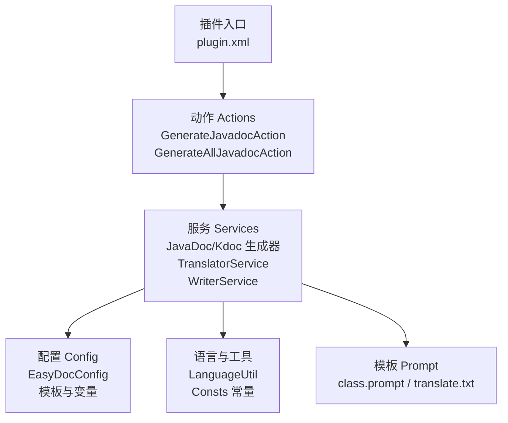
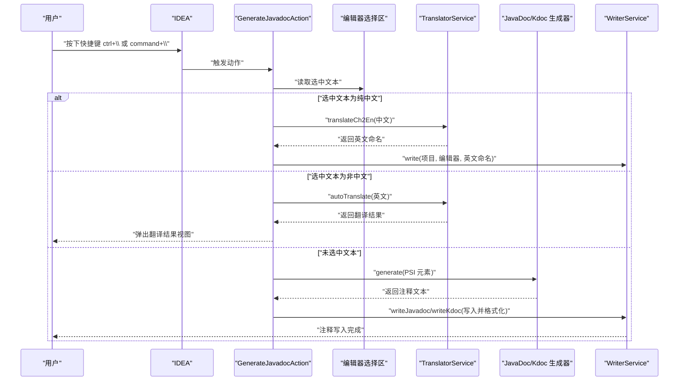
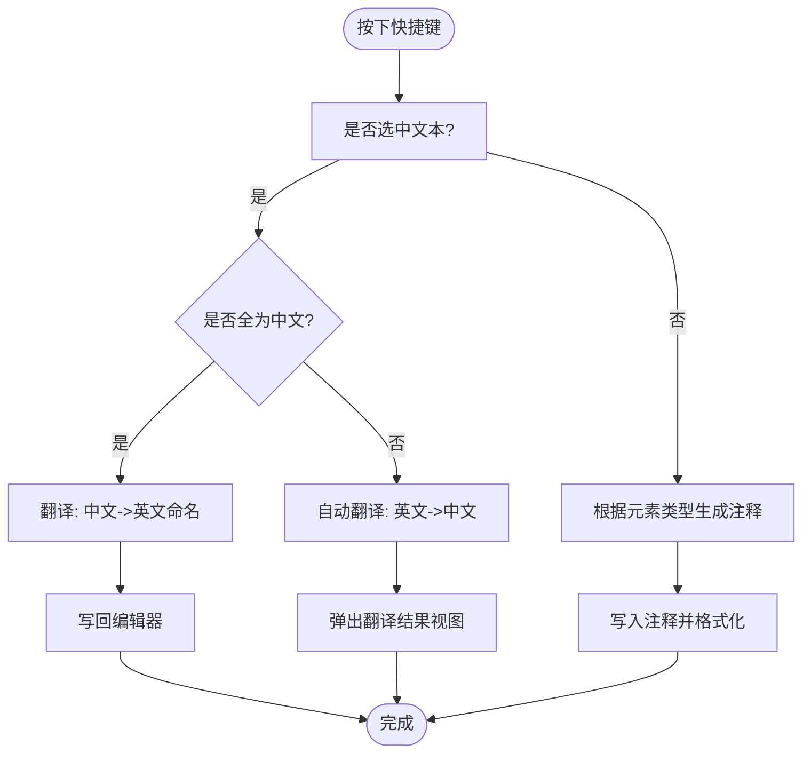
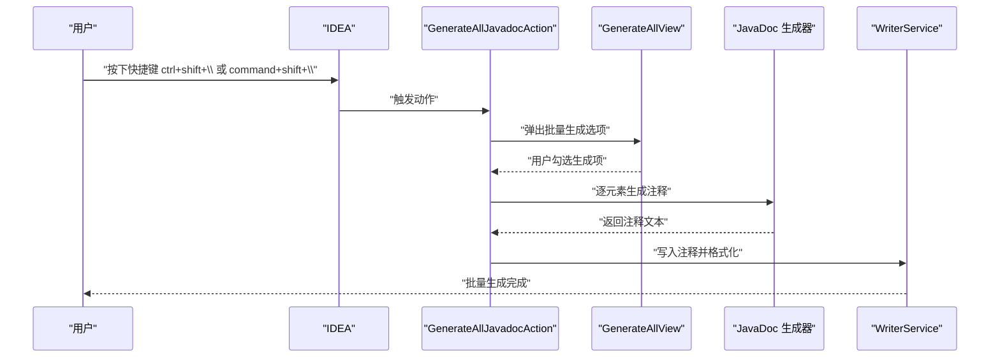
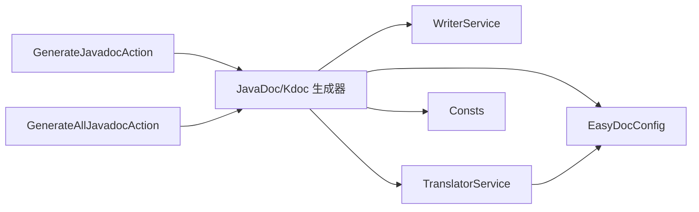

# 快速开始

<cite>
**本文引用的文件**
- [README.md](file://README.md)
- [plugin.xml](file://src/main/resources/META-INF/plugin.xml)
- [GenerateJavadocAction.java](file://src/main/java/com/star/easydoc/action/GenerateJavadocAction.java)
- [GenerateAllJavadocAction.java](file://src/main/java/com/star/easydoc/action/GenerateAllJavadocAction.java)
- [LanguageUtil.java](file://src/main/java/com/star/easydoc/common/util/LanguageUtil.java)
- [TranslatorService.java](file://src/main/java/com/star/easydoc/service/translator/TranslatorService.java)
- [CommonSettingsView.java](file://src/main/java/com/star/easydoc/view/settings/CommonSettingsView.java)
- [EasyDocConfig.java](file://src/main/java/com/star/easydoc/config/EasyDocConfig.java)
- [WriterService.java](file://src/main/java/com/star/easydoc/service/WriterService.java)
- [Consts.java](file://src/main/java/com/star/easydoc/common/Consts.java)
- [ClassDocGenerator.java](file://src/main/java/com/star/easydoc/javadoc/service/generator/impl/ClassDocGenerator.java)
- [MethodDocGenerator.java](file://src/main/java/com/star/easydoc/javadoc/service/generator/impl/MethodDocGenerator.java)
- [class.prompt](file://src/main/resources/prompts/chatglm/class.prompt)
- [translate.txt](file://src/main/resources/prompts/translate.txt)
</cite>

## 目录
1. [简介](#简介)
2. [项目结构](#项目结构)
3. [核心组件](#核心组件)
4. [架构总览](#架构总览)
5. [详细组件解析](#详细组件解析)
6. [依赖关系分析](#依赖关系分析)
7. [性能与最佳实践](#性能与最佳实践)
8. [故障排查](#故障排查)
9. [结语](#结语)
10. [附录](#附录)

## 简介
本指南面向首次使用 Easy Javadoc 插件的开发者，目标是在 5 分钟内完成安装、基础使用与常见场景实践。你将学会：
- 通过 IDEA 插件市场安装插件
- 使用快捷键一键生成单个元素注释与批量注释
- 利用中文命名生成与翻译功能提升注释质量
- 查看与修改默认快捷键
- 在常见问题中定位并解决使用障碍

## 项目结构
该插件基于 IntelliJ Platform 构建，核心模块围绕“动作（Action）—服务（Service）—配置（Config）—模板（Template）”展开，同时提供 Java 与 Kotlin 的注释生成能力，并集成多种翻译与 AI 服务。

图表来源
- [plugin.xml:55-78](file://src/main/resources/META-INF/plugin.xml#L55-L78)
- [GenerateJavadocAction.java:46-175](file://src/main/java/com/star/easydoc/action/GenerateJavadocAction.java#L46-L175)
- [GenerateAllJavadocAction.java:47-218](file://src/main/java/com/star/easydoc/action/GenerateAllJavadocAction.java#L47-L218)
- [TranslatorService.java:41-238](file://src/main/java/com/star/easydoc/service/translator/TranslatorService.java#L41-L238)
- [WriterService.java:25-139](file://src/main/java/com/star/easydoc/service/WriterService.java#L25-L139)
- [EasyDocConfig.java:22-680](file://src/main/java/com/star/easydoc/config/EasyDocConfig.java#L22-L680)
- [class.prompt:1-30](file://src/main/resources/prompts/chatglm/class.prompt#L1-L30)
- [translate.txt:1-2](file://src/main/resources/prompts/translate.txt#L1-L2)

章节来源
- [plugin.xml:1-82](file://src/main/resources/META-INF/plugin.xml#L1-L82)
- [README.md:1-266](file://README.md#L1-L266)

## 核心组件
- 动作层：提供快捷键触发的两类核心操作
  - 单个元素注释生成：对应快捷键 ctrl+\ 或 command+\（Windows/macOS）
  - 批量注释生成：对应快捷键 ctrl+shift+\ 或 command+shift+\（Windows/macOS）
- 服务层：负责注释生成、翻译、写入与格式化
  - 生成器：类、方法、字段、包信息等注释模板与变量替换
  - 翻译器：多源翻译与本地词典、自定义接口
  - 写入器：在 PSI 层安全写入注释并格式化
- 配置层：持久化配置、模板、变量、覆盖策略与翻译提供商
- 工具层：语言识别、常量与提示词模板

章节来源
- [GenerateJavadocAction.java:71-175](file://src/main/java/com/star/easydoc/action/GenerateJavadocAction.java#L71-L175)
- [GenerateAllJavadocAction.java:59-218](file://src/main/java/com/star/easydoc/action/GenerateAllJavadocAction.java#L59-L218)
- [TranslatorService.java:41-238](file://src/main/java/com/star/easydoc/service/translator/TranslatorService.java#L41-L238)
- [WriterService.java:25-139](file://src/main/java/com/star/easydoc/service/WriterService.java#L25-L139)
- [EasyDocConfig.java:22-680](file://src/main/java/com/star/easydoc/config/EasyDocConfig.java#L22-L680)

## 架构总览
下面的序列图展示了“单个元素注释生成”的端到端流程，涵盖选中文本翻译、元素注释生成与写入。

图表来源
- [GenerateJavadocAction.java:71-175](file://src/main/java/com/star/easydoc/action/GenerateJavadocAction.java#L71-L175)
- [TranslatorService.java:157-205](file://src/main/java/com/star/easydoc/service/translator/TranslatorService.java#L157-L205)
- [WriterService.java:36-98](file://src/main/java/com/star/easydoc/service/WriterService.java#L36-L98)

章节来源
- [README.md:26-31](file://README.md#L26-L31)
- [plugin.xml:55-78](file://src/main/resources/META-INF/plugin.xml#L55-L78)

## 详细组件解析

### 安装与启用
- 通过 IDEA 插件市场搜索“Easy Javadoc”，安装后重启即可使用
- 插件声明支持 Java 与 Kotlin 模块，最低版本要求见插件描述

章节来源
- [README.md:18-19](file://README.md#L18-L19)
- [plugin.xml:80-82](file://src/main/resources/META-INF/plugin.xml#L80-L82)

### 快捷键与默认行为
- Windows/macOS 默认快捷键
  - 单个元素注释：ctrl+\ 或 command+\
  - 批量注释（类）：ctrl+shift+\ 或 command+shift+\
- 行为说明
  - 光标置于类/方法/属性上：生成当前元素注释
  - 选中中文：生成英文命名（类似“程序员起名神器”）
  - 选中非中文：弹出翻译结果视图
  - 选中类：批量生成类、方法、属性注释（Kdoc 暂不支持）

章节来源
- [README.md:26-31](file://README.md#L26-L31)
- [plugin.xml:63-77](file://src/main/resources/META-INF/plugin.xml#L63-L77)

### 单个元素注释生成（ctrl+/ 或 command+/）
- 触发条件：将光标放在类、方法或属性上（不要选中整段文字）
- 处理流程
  - 若选中纯中文：调用翻译服务进行中译英，得到英文命名后写回编辑器
  - 若选中非中文：调用翻译服务进行英译中，弹出翻译结果视图
  - 若未选中：根据 PSI 元素类型调用对应生成器（JavaDoc 或 Kdoc），再写入注释

图表来源
- [GenerateJavadocAction.java:81-114](file://src/main/java/com/star/easydoc/action/GenerateJavadocAction.java#L81-L114)
- [LanguageUtil.java:39-63](file://src/main/java/com/star/easydoc/common/util/LanguageUtil.java#L39-L63)
- [TranslatorService.java:157-205](file://src/main/java/com/star/easydoc/service/translator/TranslatorService.java#L157-L205)
- [WriterService.java:36-98](file://src/main/java/com/star/easydoc/service/WriterService.java#L36-L98)

章节来源
- [README.md:26-31](file://README.md#L26-L31)
- [GenerateJavadocAction.java:71-175](file://src/main/java/com/star/easydoc/action/GenerateJavadocAction.java#L71-L175)

### 批量注释生成（ctrl+shift+/ 或 command+shift+/）
- 触发条件：将光标置于类上
- 处理流程
  - 弹出选择面板，允许勾选是否生成类、方法、属性与内部类注释
  - 逐项生成并写入，支持覆盖策略与模板配置

图表来源
- [GenerateAllJavadocAction.java:59-136](file://src/main/java/com/star/easydoc/action/GenerateAllJavadocAction.java#L59-L136)
- [WriterService.java:36-75](file://src/main/java/com/star/easydoc/service/WriterService.java#L36-L75)

章节来源
- [README.md:26-29](file://README.md#L26-L29)
- [GenerateAllJavadocAction.java:59-136](file://src/main/java/com/star/easydoc/action/GenerateAllJavadocAction.java#L59-L136)

### 中文命名生成与翻译
- 中文命名生成
  - 选中中文文本，按快捷键触发中译英，返回的英文命名会写回编辑器
- 翻译功能
  - 选中非中文文本，按快捷键触发自动翻译，弹出翻译结果视图
- 翻译源与优先级
  - 支持百度、腾讯、阿里云、有道、微软、谷歌、本地词典、自定义 URL 等
  - 可通过“单词映射”提升特定术语的翻译质量

章节来源
- [README.md:29-31](file://README.md#L29-L31)
- [TranslatorService.java:85-111](file://src/main/java/com/star/easydoc/service/translator/TranslatorService.java#L85-L111)
- [CommonSettingsView.java:42-739](file://src/main/java/com/star/easydoc/view/settings/CommonSettingsView.java#L42-L739)
- [Consts.java:29-99](file://src/main/java/com/star/easydoc/common/Consts.java#L29-L99)

### 注释生成器与模板
- JavaDoc 生成器
  - 类注释：默认模板包含作者与日期变量；支持自定义模板与变量映射
  - 方法注释：默认模板包含参数、返回值、异常等占位符；支持 AI 提示词生成
- Kdoc 生成器（Kotlin）
  - 对应类、方法、属性的注释生成逻辑
- AI 与提示词
  - 当选择 AI 翻译（如智谱清言）时，使用内置提示词模板生成注释

章节来源
- [ClassDocGenerator.java:44-93](file://src/main/java/com/star/easydoc/javadoc/service/generator/impl/ClassDocGenerator.java#L44-L93)
- [MethodDocGenerator.java:38-63](file://src/main/java/com/star/easydoc/javadoc/service/generator/impl/MethodDocGenerator.java#L38-L63)
- [class.prompt:1-30](file://src/main/resources/prompts/chatglm/class.prompt#L1-L30)
- [translate.txt:1-2](file://src/main/resources/prompts/translate.txt#L1-L2)

### 写入与格式化
- 写入策略
  - JavaDoc：在 PSI 层插入或替换注释，随后进行代码风格格式化
  - Kdoc：同理，针对 Kotlin 元素
- 空行控制
  - 根据注释末尾换行数调整注释后的空白行数量

章节来源
- [WriterService.java:36-75](file://src/main/java/com/star/easydoc/service/WriterService.java#L36-L75)
- [WriterService.java:107-136](file://src/main/java/com/star/easydoc/service/WriterService.java#L107-L136)

## 依赖关系分析
- 动作依赖服务：GenerateJavadocAction 与 GenerateAllJavadocAction 通过服务管理器获取生成器、翻译器、写入器与包信息服务
- 服务依赖配置：生成器与翻译器读取 EasyDocConfig 的模板、变量与覆盖策略
- 配置依赖常量：Consts 定义可用翻译源与停止词等

图表来源
- [GenerateJavadocAction.java:48-53](file://src/main/java/com/star/easydoc/action/GenerateJavadocAction.java#L48-L53)
- [GenerateAllJavadocAction.java:52-57](file://src/main/java/com/star/easydoc/action/GenerateAllJavadocAction.java#L52-L57)
- [EasyDocConfig.java:22-680](file://src/main/java/com/star/easydoc/config/EasyDocConfig.java#L22-L680)
- [Consts.java:14-100](file://src/main/java/com/star/easydoc/common/Consts.java#L14-L100)
- [TranslatorService.java:41-77](file://src/main/java/com/star/easydoc/service/translator/TranslatorService.java#L41-L77)
- [WriterService.java:25-139](file://src/main/java/com/star/easydoc/service/WriterService.java#L25-L139)

章节来源
- [plugin.xml:27-53](file://src/main/resources/META-INF/plugin.xml#L27-L53)

## 性能与最佳实践
- 选择合适的翻译源
  - 整句翻译通常优于单词级拼接，可在“单词映射”中补充术语
- 合理使用 AI 生成
  - AI 生成适合初稿，建议人工审阅与微调
- 批量生成建议
  - 先在小范围内验证模板与变量，再扩大范围
- 注释覆盖策略
  - 根据团队规范选择“忽略/智能合并/强制覆盖”
- 快捷键冲突
  - 若快捷键无效，检查 IDEA 快捷键设置，避免与系统或 IDE 其他功能冲突

[本节为通用建议，无需列出章节来源]

## 故障排查
- 快捷键无效
  - 确认光标位于类/方法/属性上，而非选中整段文字
  - 检查 IDEA 快捷键设置是否存在冲突
- 单行注释不生效
  - IDEA 默认格式化可能将单行注释转为多行，需调整格式化设置
- Javadoc 标签顺序被重排
  - 关闭 IDEA 的 Javadoc 格式化，或在模板中固定顺序
- 翻译不准
  - 使用“单词映射”提升术语一致性；必要时切换翻译源或启用本地词典

章节来源
- [README.md:71-84](file://README.md#L71-L84)

## 结语
通过本快速开始指南，你已掌握 Easy Javadoc 的安装、基础使用与常见问题处理。建议进一步探索“设置”中的模板与变量配置，结合团队规范定制注释风格，持续提升文档质量与协作效率。

[本节为总结性内容，无需列出章节来源]

## 附录

### 快捷键一览（默认）
- Windows/macOS
  - 单个元素注释：ctrl+\ 或 command+\
  - 批量注释（类）：ctrl+shift+\ 或 command+shift+\

章节来源
- [README.md:54-69](file://README.md#L54-L69)
- [plugin.xml:63-77](file://src/main/resources/META-INF/plugin.xml#L63-L77)

### 常用配置入口
- 打开“设置/首选项” -> “Tools” -> “EasyDoc”
- 在“EasyDocJavadoc/EasyDocKdoc”中配置模板与变量
- 在“单词映射”中添加术语翻译，提升准确性

章节来源
- [CommonSettingsView.java:42-739](file://src/main/java/com/star/easydoc/view/settings/CommonSettingsView.java#L42-L739)
- [EasyDocConfig.java:138-199](file://src/main/java/com/star/easydoc/config/EasyDocConfig.java#L138-L199)