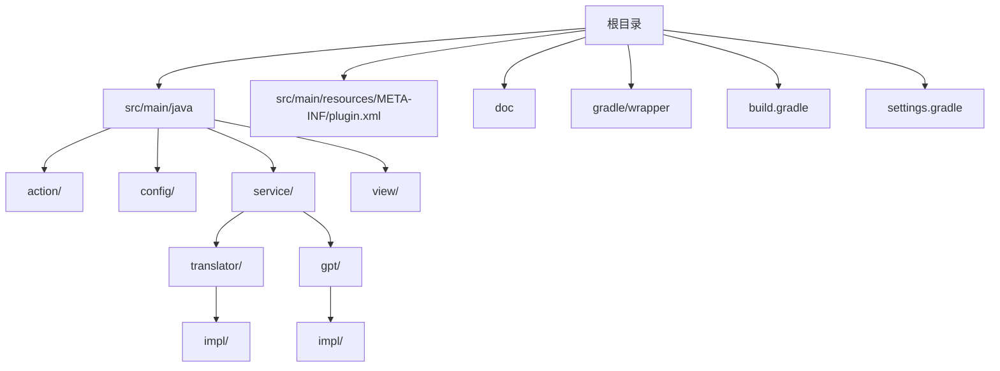
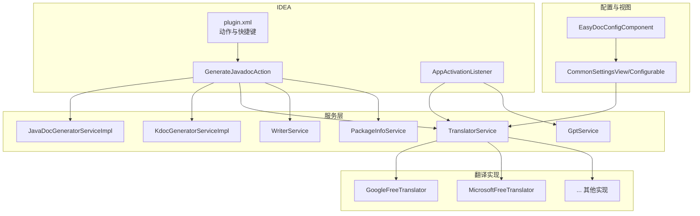
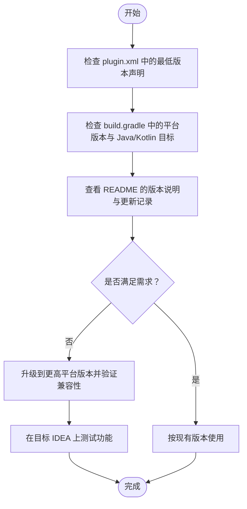
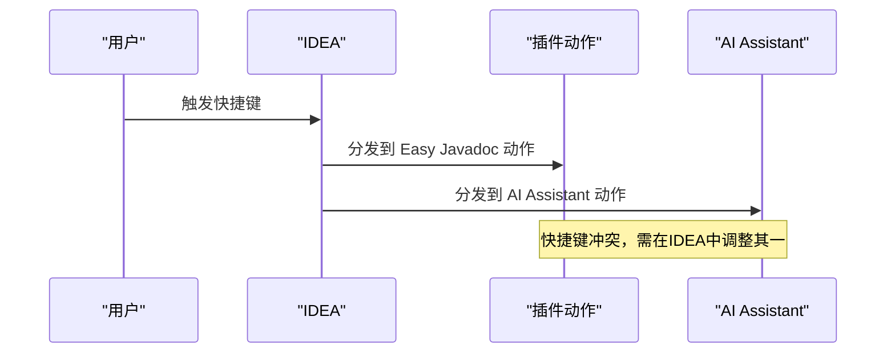
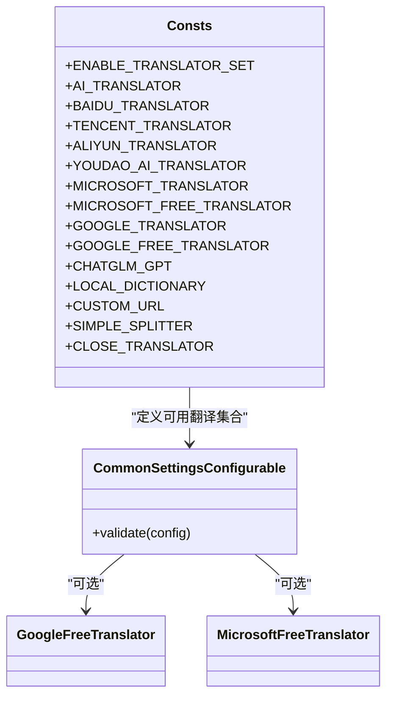
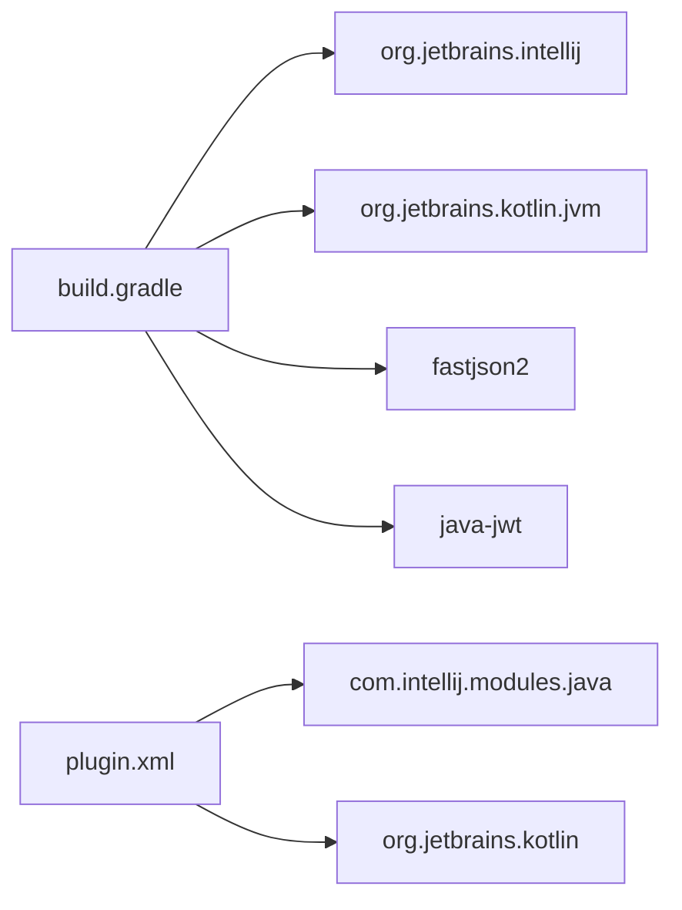
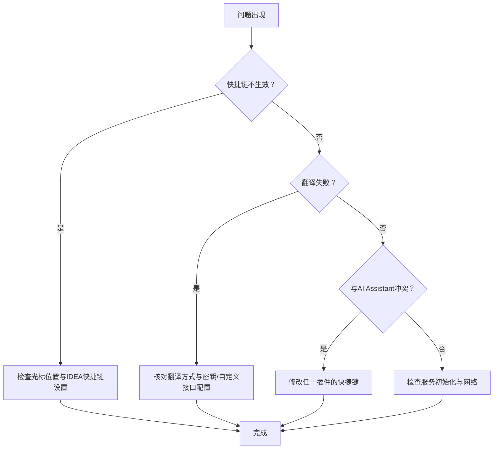

# 兼容性问题

<cite>
**本文引用的文件列表**
- [README.md](file://README.md)
- [build.gradle](file://build.gradle)
- [settings.gradle](file://settings.gradle)
- [gradle-wrapper.properties](file://gradle-wrapper.properties)
- [plugin.xml](file://src/main/resources/META-INF/plugin.xml)
- [Consts.java](file://src/main/java/com/star/easydoc/common/Consts.java)
- [EasyDocConfig.java](file://src/main/java/com/star/easydoc/config/EasyDocConfig.java)
- [EasyDocConfigComponent.java](file://src/main/java/com/star/easydoc/config/EasyDocConfigComponent.java)
- [CommonSettingsConfigurable.java](file://src/main/java/com/star/easydoc/view/settings/CommonSettingsConfigurable.java)
- [CommonSettingsView.java](file://src/main/java/com/star/easydoc/view/settings/CommonSettingsView.java)
- [CommonSettingsView.form](file://src/main/java/com/star/easydoc/view/settings/CommonSettingsView.form)
- [GoogleFreeTranslator.java](file://src/main/java/com/star/easydoc/service/translator/impl/GoogleFreeTranslator.java)
- [MicrosoftFreeTranslator.java](file://src/main/java/com/star/easydoc/service/translator/impl/MicrosoftFreeTranslator.java)
- [自定义接口说明.md](file://doc/自定义接口说明.md)
- [GenerateJavadocAction.java](file://src/main/java/com/star/easydoc/action/GenerateJavadocAction.java)
- [AppActivationListener.java](file://src/main/java/com/star/easydoc/listener/AppActivationListener.java)
</cite>

## 目录
1. [简介](#简介)
2. [项目结构](#项目结构)
3. [核心组件](#核心组件)
4. [架构总览](#架构总览)
5. [详细组件分析](#详细组件分析)
6. [依赖关系分析](#依赖关系分析)
7. [性能考量](#性能考量)
8. [故障排查指南](#故障排查指南)
9. [结论](#结论)
10. [附录](#附录)

## 简介
本指南聚焦于 Easy Javadoc 插件的兼容性问题，覆盖以下方面：
- IDEA 版本兼容性：最低支持版本、最新版本支持、升级注意事项
- 插件间兼容性：与 AI Assistant 等插件的快捷键冲突及解决方案
- 操作系统兼容性：Windows、macOS、Linux 的特殊注意事项
- 第三方翻译服务兼容性：可用翻译方式、免费/付费接口、替代方案
- 在不同环境下的稳定使用建议

## 项目结构
该仓库采用标准 IntelliJ 平台插件工程结构，包含 Java/Kotlin 源码、资源文件、Gradle 构建脚本与插件描述文件。关键目录与文件如下：
- 根目录：构建脚本、版本信息、README
- src/main/java：Java/Kotlin 实现，含动作、配置、服务、视图、翻译器等
- src/main/resources/META-INF/plugin.xml：插件元数据与快捷键声明
- doc：文档与图片资源，含“自定义接口说明”
- gradle/wrapper：Gradle Wrapper 配置

**图表来源**
- [plugin.xml:1-82](file://src/main/resources/META-INF/plugin.xml#L1-L82)
- [build.gradle:1-78](file://build.gradle#L1-L78)

**章节来源**
- [README.md:1-266](file://README.md#L1-L266)
- [plugin.xml:1-82](file://src/main/resources/META-INF/plugin.xml#L1-L82)
- [build.gradle:1-78](file://build.gradle#L1-L78)

## 核心组件
- 配置持久化：EasyDocConfig 与 EasyDocConfigComponent 提供插件配置的读取、初始化与持久化
- 翻译服务：Consts 定义可用翻译方式集合；具体实现由各 Translator 实现类提供
- 快捷键与动作：plugin.xml 声明默认快捷键；GenerateJavadocAction 处理触发逻辑
- 设置界面：CommonSettingsView/Configurable 提供翻译方式、密钥、超时等配置入口
- 应用激活监听：AppActivationListener 在 IDE 激活时初始化翻译与 GPT 服务

**章节来源**
- [EasyDocConfig.java:1-680](file://src/main/java/com/star/easydoc/config/EasyDocConfig.java#L1-L680)
- [EasyDocConfigComponent.java:1-69](file://src/main/java/com/star/easydoc/config/EasyDocConfigComponent.java#L1-L69)
- [Consts.java:1-100](file://src/main/java/com/star/easydoc/common/Consts.java#L1-L100)
- [plugin.xml:55-78](file://src/main/resources/META-INF/plugin.xml#L55-L78)
- [CommonSettingsConfigurable.java:117-171](file://src/main/java/com/star/easydoc/view/settings/CommonSettingsConfigurable.java#L117-L171)
- [CommonSettingsView.java:189-343](file://src/main/java/com/star/easydoc/view/settings/CommonSettingsView.java#L189-L343)
- [AppActivationListener.java:37-119](file://src/main/java/com/star/easydoc/listener/AppActivationListener.java#L37-L119)

## 架构总览
插件通过插件描述文件注册动作与快捷键，动作执行时调用服务层生成注释、调用翻译器进行翻译，并通过设置界面管理配置项。应用激活监听器负责初始化翻译与 GPT 服务。

**图表来源**
- [plugin.xml:25-78](file://src/main/resources/META-INF/plugin.xml#L25-L78)
- [GenerateJavadocAction.java:46-74](file://src/main/java/com/star/easydoc/action/GenerateJavadocAction.java#L46-L74)
- [AppActivationListener.java:106-113](file://src/main/java/com/star/easydoc/listener/AppActivationListener.java#L106-L113)
- [GoogleFreeTranslator.java:1-47](file://src/main/java/com/star/easydoc/service/translator/impl/GoogleFreeTranslator.java#L1-L47)
- [MicrosoftFreeTranslator.java:92-120](file://src/main/java/com/star/easydoc/service/translator/impl/MicrosoftFreeTranslator.java#L92-L120)

## 详细组件分析

### IDEA 版本兼容性
- 最低支持版本
  - 插件元数据声明最低版本为 191（对应 IDEA 2019.1）
  - 构建脚本中指定平台版本为 2023.1
  - README 明确“支持的 IDEA 版本为 2019.1 及以上”，并在更新记录中标注“最低支持IDEA版本2023.1”
- 最新版本支持
  - 构建脚本使用 2023.1 作为平台版本
  - Gradle Wrapper 使用 Gradle 8.14
- 升级注意事项
  - Java/Kotlin 编译目标均为 17
  - 若升级到更高版本 IDEA，需确保插件仍以 2023.1 或更高平台版本构建
  - 注意插件依赖的 Kotlin 版本与 Gradle 版本是否匹配

**图表来源**
- [plugin.xml:25](file://src/main/resources/META-INF/plugin.xml#L25)
- [build.gradle:51-56](file://build.gradle#L51-L56)
- [build.gradle:16-40](file://build.gradle#L16-L40)
- [README.md:7](file://README.md#L7)
- [README.md:87-89](file://README.md#L87-L89)

**章节来源**
- [plugin.xml:25](file://src/main/resources/META-INF/plugin.xml#L25)
- [build.gradle:51-56](file://build.gradle#L51-L56)
- [build.gradle:16-40](file://build.gradle#L16-L40)
- [README.md:7](file://README.md#L7)
- [README.md:87-89](file://README.md#L87-L89)

### 插件间兼容性：与 AI Assistant 快捷键冲突
- 冲突现象
  - README 明确指出“新版 IDEA 的 AI Assistant 插件和本插件快捷键冲突了，请修改任一一个”
- 快捷键现状
  - plugin.xml 中默认快捷键为 ctrl/backslash（Windows）与 command/backslash（macOS），以及对应的 shift 变体用于批量生成
- 解决方案
  - 方案一：在 IDEA 快捷键设置中修改 Easy Javadoc 的快捷键
  - 方案二：在 IDEA 快捷键设置中修改 AI Assistant 的快捷键
  - 建议统一使用 macOS 的 command/backslash 或 Windows 的 ctrl/backslash，避免跨平台差异

**图表来源**
- [plugin.xml:63-77](file://src/main/resources/META-INF/plugin.xml#L63-L77)
- [README.md:3](file://README.md#L3)

**章节来源**
- [plugin.xml:63-77](file://src/main/resources/META-INF/plugin.xml#L63-L77)
- [README.md:3](file://README.md#L3)

### 操作系统兼容性
- Windows
  - README 提供 Windows 快捷键表
  - 插件未声明特定 Windows 限制，常规使用无特殊要求
- macOS
  - README 提供 macOS 快捷键表
  - 插件元数据与动作均支持 macOS keymap
- Linux
  - README 未单独列出 Linux 快捷键，但 plugin.xml 中存在 Default for XWin 与 $default keymap，表明对 Linux 有默认快捷键映射
- 通用注意事项
  - 网络访问：部分翻译服务需要网络，需确保代理与防火墙允许访问
  - 字体与格式化：README 提及字体与 IDEA 格式化设置对注释效果的影响

**章节来源**
- [README.md:55-69](file://README.md#L55-L69)
- [plugin.xml:63-77](file://src/main/resources/META-INF/plugin.xml#L63-L77)

### 第三方翻译服务兼容性与替代方案
- 可用翻译方式
  - Consts 定义了多种翻译方式集合，包括有道、百度、腾讯、阿里云、有道智云、微软、谷歌、智谱清言、本地词典、仅单词分割、关闭（只使用自定义翻译）、自定义 HTTP 接口等
- 免费/付费接口
  - 谷歌免费翻译与微软免费翻译：无需密钥，但可能受网络与地区限制
  - 其余翻译通常需要申请密钥或凭据
- 配置校验
  - CommonSettingsConfigurable 对不同翻译方式的必填项进行校验，如 appId/token、secretKey/secretId、accessKeyId/accessKeySecret、appKey/appSecret、microsoftKey、googleKey、apiKey、自定义地址等
- 替代方案
  - 自定义 HTTP 接口：通过 doc/自定义接口说明.md 提供的占位符与返回格式，可在内网或私有部署翻译服务
  - 本地词典：适用于离线场景，减少对外部服务依赖
  - 仅单词分割：在无法联网或外部服务受限时，可作为基础替代

**图表来源**
- [Consts.java:29-99](file://src/main/java/com/star/easydoc/common/Consts.java#L29-L99)
- [CommonSettingsConfigurable.java:117-171](file://src/main/java/com/star/easydoc/view/settings/CommonSettingsConfigurable.java#L117-L171)
- [GoogleFreeTranslator.java:1-47](file://src/main/java/com/star/easydoc/service/translator/impl/GoogleFreeTranslator.java#L1-L47)
- [MicrosoftFreeTranslator.java:92-120](file://src/main/java/com/star/easydoc/service/translator/impl/MicrosoftFreeTranslator.java#L92-L120)

**章节来源**
- [Consts.java:29-99](file://src/main/java/com/star/easydoc/common/Consts.java#L29-L99)
- [CommonSettingsConfigurable.java:117-171](file://src/main/java/com/star/easydoc/view/settings/CommonSettingsConfigurable.java#L117-L171)
- [CommonSettingsView.java:189-343](file://src/main/java/com/star/easydoc/view/settings/CommonSettingsView.java#L189-L343)
- [CommonSettingsView.form:203-227](file://src/main/java/com/star/easydoc/view/settings/CommonSettingsView.form#L203-L227)
- [CommonSettingsView.form:328-353](file://src/main/java/com/star/easydoc/view/settings/CommonSettingsView.form#L328-L353)
- [自定义接口说明.md:1-38](file://doc/自定义接口说明.md#L1-L38)

## 依赖关系分析
- 构建与平台
  - Gradle 插件：org.jetbrains.intellij 1.17.4
  - 平台版本：2023.1（IC）
  - Java/Kotlin 目标：17
- 运行时依赖
  - fastjson2、java-jwt 等
- 插件依赖
  - 依赖 Java 与 Kotlin 模块
  - 通过 plugin.xml 注册动作与服务扩展

**图表来源**
- [build.gradle:1-78](file://build.gradle#L1-L78)
- [plugin.xml:80-82](file://src/main/resources/META-INF/plugin.xml#L80-L82)

**章节来源**
- [build.gradle:1-78](file://build.gradle#L1-L78)
- [plugin.xml:80-82](file://src/main/resources/META-INF/plugin.xml#L80-L82)

## 性能考量
- 超时设置
  - 配置项包含超时时间（毫秒），默认值在配置类中定义
  - CommonSettingsView.form 中提供超时输入控件，建议根据网络状况合理设置
- 翻译服务
  - 免费翻译可能受网络波动影响，建议在网络稳定时使用
  - 自定义 HTTP 接口可降低外部依赖风险，提高稳定性
- 格式化与标签顺序
  - README 提示 IDEA 默认格式化可能改变标签顺序或单行注释行为，建议在设置中关闭相关格式化以保持期望输出

**章节来源**
- [EasyDocConfig.java:77](file://src/main/java/com/star/easydoc/config/EasyDocConfig.java#L77)
- [CommonSettingsView.form:328-353](file://src/main/java/com/star/easydoc/view/settings/CommonSettingsView.form#L328-L353)
- [README.md:84](file://README.md#L84)
- [README.md:82](file://README.md#L82)

## 故障排查指南
- 快捷键不生效
  - README 提示检查光标位置与快捷键冲突
  - 建议在 IDEA 快捷键设置中确认 Easy Javadoc 的快捷键绑定
- 与 AI Assistant 冲突
  - README 明确冲突，需在 IDEA 快捷键设置中修改任一插件的快捷键
- 翻译失败
  - 检查翻译方式与密钥配置是否正确
  - 使用自定义 HTTP 接口时，确保请求参数与返回格式符合规范
- 应用激活与服务初始化
  - AppActivationListener 在应用激活时初始化翻译与 GPT 服务，若初始化失败，检查配置与网络

**图表来源**
- [README.md:77-81](file://README.md#L77-L81)
- [README.md:3](file://README.md#L3)
- [CommonSettingsConfigurable.java:117-171](file://src/main/java/com/star/easydoc/view/settings/CommonSettingsConfigurable.java#L117-L171)
- [AppActivationListener.java:106-113](file://src/main/java/com/star/easydoc/listener/AppActivationListener.java#L106-L113)

**章节来源**
- [README.md:77-81](file://README.md#L77-L81)
- [README.md:3](file://README.md#L3)
- [CommonSettingsConfigurable.java:117-171](file://src/main/java/com/star/easydoc/view/settings/CommonSettingsConfigurable.java#L117-L171)
- [AppActivationListener.java:106-113](file://src/main/java/com/star/easydoc/listener/AppActivationListener.java#L106-L113)

## 结论
- IDEA 版本：最低支持 2019.1，构建平台版本为 2023.1；升级时需关注平台版本与编译目标
- 快捷键冲突：与 AI Assistant 存在冲突，建议在 IDEA 快捷键设置中调整任一插件
- 翻译服务：支持多种翻译方式，含免费与付费接口；推荐使用自定义 HTTP 接口或本地词典以提升稳定性
- 操作系统：Windows/macOS/Linux 均可使用，注意网络与格式化设置差异

## 附录
- 构建与版本
  - Gradle Wrapper 使用 Gradle 8.14
  - 插件版本：4.4.1
- 快捷键参考
  - Windows：ctrl + 反斜杠；批量生成：ctrl + shift + 反斜杠
  - macOS：command + 反斜杠；批量生成：command + shift + 反斜杠

**章节来源**
- [gradle-wrapper.properties:1-7](file://gradle/wrapper/gradle-wrapper.properties#L1-L7)
- [build.gradle:12-13](file://build.gradle#L12-L13)
- [README.md:55-69](file://README.md#L55-L69)