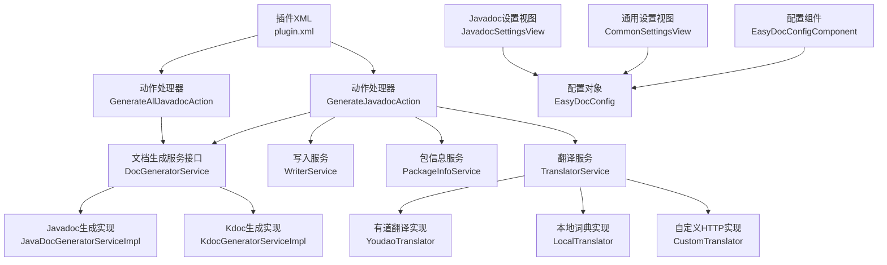
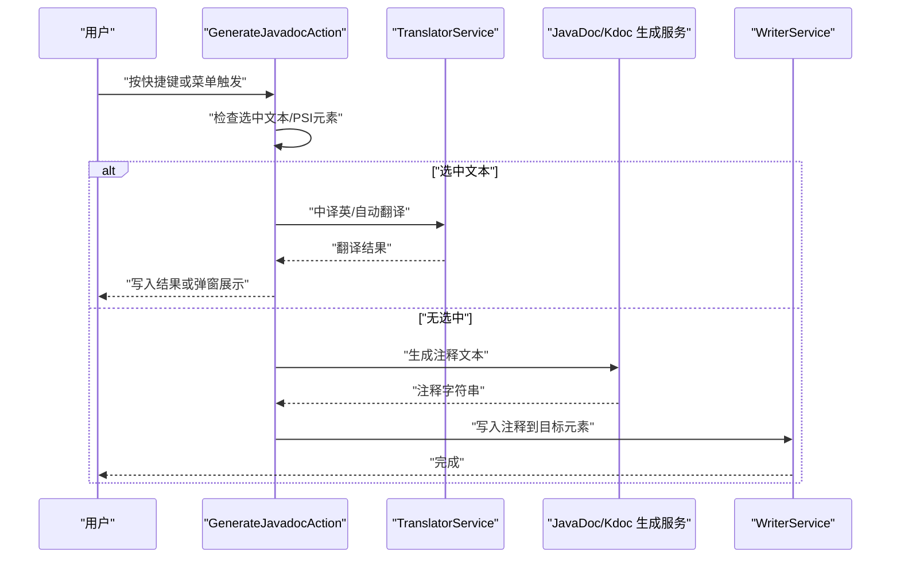
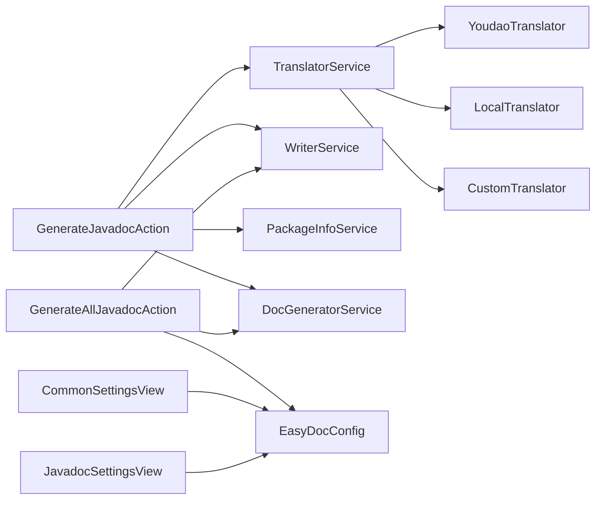

# 常见问题

<cite>
**本文引用的文件**
- [plugin.xml](file://src/main/resources/META-INF/plugin.xml)
- [README.md](file://README.md)
- [EasyDocConfig.java](file://src/main/java/com/star/easydoc/config/EasyDocConfig.java)
- [EasyDocConfigComponent.java](file://src/main/java/com/star/easydoc/config/EasyDocConfigComponent.java)
- [GenerateJavadocAction.java](file://src/main/java/com/star/easydoc/action/GenerateJavadocAction.java)
- [GenerateAllJavadocAction.java](file://src/main/java/com/star/easydoc/action/GenerateAllJavadocAction.java)
- [CommonSettingsView.java](file://src/main/java/com/star/easydoc/view/settings/CommonSettingsView.java)
- [JavadocSettingsView.java](file://src/main/java/com/star/easydoc/view/settings/javadoc/JavadocSettingsView.java)
- [TranslatorService.java](file://src/main/java/com/star/easydoc/service/translator/TranslatorService.java)
- [YoudaoTranslator.java](file://src/main/java/com/star/easydoc/service/translator/impl/YoudaoTranslator.java)
- [LocalTranslator.java](file://src/main/java/com/star/easydoc/service/translator/impl/LocalTranslator.java)
- [CustomTranslator.java](file://src/main/java/com/star/easydoc/service/translator/impl/CustomTranslator.java)
- [DocGeneratorService.java](file://src/main/java/com/star/easydoc/service/DocGeneratorService.java)
- [Consts.java](file://src/main/java/com/star/easydoc/common/Consts.java)
- [build.gradle](file://build.gradle)
</cite>

## 目录
1. [简介](#简介)
2. [项目结构](#项目结构)
3. [核心组件](#核心组件)
4. [架构总览](#架构总览)
5. [详细组件分析](#详细组件分析)
6. [依赖分析](#依赖分析)
7. [性能考量](#性能考量)
8. [故障排查指南](#故障排查指南)
9. [结论](#结论)
10. [附录](#附录)

## 简介
本FAQ面向使用 Easy Javadoc 插件的用户，聚焦于“快捷键不生效”“属性单行注释不生效”“文档标签格式化问题”等高频问题，提供原因分析、诊断步骤与解决方案，并补充IDEA快捷键冲突检查、格式化设置调整、插件版本兼容性等建议，帮助快速定位与解决。

## 项目结构
- 插件入口与动作注册位于 plugin.xml，定义了工具菜单组、动作与快捷键。
- 动作处理器分别处理单元素注释生成与批量注释生成。
- 配置持久化与视图位于 config 与 view/settings 下，涵盖通用配置、Javadoc/Kdoc 模板配置。
- 翻译服务与多种翻译器实现位于 service/translator 及其 impl 包。
- 构建脚本与最低IDEA版本、Java/Kotlin版本在 build.gradle 中声明。

图表来源
- [plugin.xml:55-78](file://src/main/resources/META-INF/plugin.xml#L55-L78)
- [GenerateJavadocAction.java:46-175](file://src/main/java/com/star/easydoc/action/GenerateJavadocAction.java#L46-L175)
- [GenerateAllJavadocAction.java:47-218](file://src/main/java/com/star/easydoc/action/GenerateAllJavadocAction.java#L47-L218)
- [TranslatorService.java:41-238](file://src/main/java/com/star/easydoc/service/translator/TranslatorService.java#L41-L238)
- [EasyDocConfigComponent.java:19-69](file://src/main/java/com/star/easydoc/config/EasyDocConfigComponent.java#L19-L69)
- [EasyDocConfig.java:22-680](file://src/main/java/com/star/easydoc/config/EasyDocConfig.java#L22-L680)
- [CommonSettingsView.java:42-739](file://src/main/java/com/star/easydoc/view/settings/CommonSettingsView.java#L42-L739)
- [JavadocSettingsView.java:14-218](file://src/main/java/com/star/easydoc/view/settings/javadoc/JavadocSettingsView.java#L14-L218)

章节来源
- [plugin.xml:1-82](file://src/main/resources/META-INF/plugin.xml#L1-L82)
- [build.gradle:12-56](file://build.gradle#L12-L56)

## 核心组件
- 动作与快捷键
  - 单元素注释生成：工具菜单组“EasyJavadoc”下动作“GenerateJavadoc”，支持 Windows/Ctrl+\`、macOS/Command+\`；同时支持选中文本的中译英与自动翻译弹窗。
  - 批量注释生成：动作“生成文档注释”，支持 Windows/Ctrl+Shift+\`、macOS/Command+Shift+\`，用于类及其方法/属性批量生成。
- 配置与模板
  - EasyDocConfig/EasyDocConfigComponent 提供作者、日期格式、覆盖模式、模板配置、单词映射、翻译器等持久化配置。
  - Javadoc/Kdoc 的模板与参数类型、返回值模式、优先策略等通过设置视图进行管理。
- 翻译与本地化
  - TranslatorService 统一调度各翻译器，支持百度、腾讯、阿里、有道、微软、谷歌、本地词典、自定义HTTP等。
  - YoudaoTranslator 对官方免费接口已禁用给出提示；LocalTranslator 内置词典；CustomTranslator 支持自定义HTTP接口。
- 文档生成与写入
  - DocGeneratorService 定义生成接口；具体实现负责根据 PSI 元素生成注释文本并由 WriterService 写入。

章节来源
- [plugin.xml:55-78](file://src/main/resources/META-INF/plugin.xml#L55-L78)
- [GenerateJavadocAction.java:71-175](file://src/main/java/com/star/easydoc/action/GenerateJavadocAction.java#L71-L175)
- [GenerateAllJavadocAction.java:59-218](file://src/main/java/com/star/easydoc/action/GenerateAllJavadocAction.java#L59-L218)
- [EasyDocConfig.java:22-680](file://src/main/java/com/star/easydoc/config/EasyDocConfig.java#L22-L680)
- [EasyDocConfigComponent.java:19-69](file://src/main/java/com/star/easydoc/config/EasyDocConfigComponent.java#L19-L69)
- [TranslatorService.java:41-238](file://src/main/java/com/star/easydoc/service/translator/TranslatorService.java#L41-L238)
- [YoudaoTranslator.java:22-161](file://src/main/java/com/star/easydoc/service/translator/impl/YoudaoTranslator.java#L22-L161)
- [LocalTranslator.java:25-71](file://src/main/java/com/star/easydoc/service/translator/impl/LocalTranslator.java#L25-L71)
- [CustomTranslator.java:20-61](file://src/main/java/com/star/easydoc/service/translator/impl/CustomTranslator.java#L20-L61)
- [DocGeneratorService.java:11-21](file://src/main/java/com/star/easydoc/service/DocGeneratorService.java#L11-L21)

## 架构总览
以下序列图展示“生成单个Javadoc注释”的典型流程，从动作触发到最终写入。

图表来源
- [GenerateJavadocAction.java:71-175](file://src/main/java/com/star/easydoc/action/GenerateJavadocAction.java#L71-L175)
- [TranslatorService.java:85-163](file://src/main/java/com/star/easydoc/service/translator/TranslatorService.java#L85-L163)
- [DocGeneratorService.java:11-21](file://src/main/java/com/star/easydoc/service/DocGeneratorService.java#L11-L21)

## 详细组件分析

### 问题一：快捷键不生效
- 现象
  - Windows/macOS 快捷键无效，或点击工具菜单无响应。
- 可能原因
  - 光标未置于有效元素上（类、方法、属性），需将光标放在元素名处而非选中状态。
  - IDEA 快捷键冲突，尤其是新版 IDEA 的 AI Assistant 插件与本插件快捷键冲突。
  - 插件未正确加载或IDEA版本不满足要求。
- 诊断步骤
  - 确认光标位置：将光标置于类名、方法名或属性名上，不要选中文本或使用鼠标点击。
  - 检查IDEA快捷键设置：File → Settings → Keymap，搜索“EasyJavadoc”或对应动作，确认未被其他快捷键覆盖。
  - 若使用新版IDEA，留意AI Assistant快捷键与本插件冲突，建议修改任一快捷键。
  - 查看插件是否启用：Plugins → 已安装，确认插件已启用。
  - 查看IDEA版本：插件声明最低支持版本，确保不低于要求。
- 解决方案
  - 修改冲突快捷键：在Keymap中为本插件或AI Assistant重新分配快捷键。
  - 重新安装插件：卸载后重启IDEA再安装最新版本。
  - 升级IDEA至满足最低版本要求。
- 预防措施
  - 在团队内统一快捷键策略，避免与AI Assistant等常用插件冲突。
  - 定期更新插件与IDEA，保持兼容性。

章节来源
- [README.md:3-3](file://README.md#L3-L3)
- [README.md:77-82](file://README.md#L77-L82)
- [plugin.xml:55-78](file://src/main/resources/META-INF/plugin.xml#L55-L78)
- [build.gradle:51-56](file://build.gradle#L51-L56)

### 问题二：属性单行注释不生效
- 现象
  - 生成注释后，属性注释被IDEA格式化为多行，导致单行注释效果消失。
- 原因分析
  - IDEA 默认格式化行为会将单行注释转换为多行，影响显示与预期。
- 诊断步骤
  - 生成注释后观察注释形态，确认是否被IDEA格式化为多行。
- 解决方案
  - 在IDEA设置中调整格式化行为，关闭对Javadoc的自动格式化，或允许保留单行注释。
  - 在插件设置中调整模板，使生成内容符合期望的单行形态。
- 预防措施
  - 在团队规范中明确注释风格与格式化策略，避免频繁被IDEA重写。

章节来源
- [README.md:81-84](file://README.md#L81-L84)

### 问题三：文档标签@param/@link/@return等顺序不正确
- 现象
  - 生成的Javadoc注释中，标签顺序与期望不符，或被IDEA格式化打乱。
- 原因分析
  - IDEA 默认格式化会重排Javadoc标签顺序，导致自定义顺序被覆盖。
- 诊断步骤
  - 生成注释后对比标签顺序，确认是否被IDEA格式化重排。
- 解决方案
  - 在IDEA设置中关闭Javadoc格式化，或调整格式化偏好以保留自定义顺序。
  - 在插件模板中尽量减少对顺序敏感的标签组合，或通过自定义变量控制输出。
- 预防措施
  - 在团队内约定Javadoc标签书写规范，减少对顺序的强依赖。

章节来源
- [README.md:83-84](file://README.md#L83-L84)

### 问题四：选中文本翻译结果不符合预期
- 现象
  - 选中文本为中文时，希望生成英文命名；选中非中文时，希望弹出翻译结果。
- 原因分析
  - 动作处理器会区分选中文本的语言与内容，调用翻译服务或弹窗展示。
- 诊断步骤
  - 确认选中文本是否为纯中文或包含空格分隔的英文单词。
  - 检查翻译器配置与可用额度。
- 解决方案
  - 使用“中译英”场景：选中中文文本，触发快捷键生成英文命名。
  - 使用“自动翻译”场景：选中非中文文本，触发快捷键查看翻译结果弹窗。
  - 切换翻译器或配置自定义HTTP接口，提升准确性。
- 预防措施
  - 在插件设置中维护单词映射，提高特定术语的翻译质量。

章节来源
- [GenerateJavadocAction.java:81-103](file://src/main/java/com/star/easydoc/action/GenerateJavadocAction.java#L81-L103)
- [TranslatorService.java:85-111](file://src/main/java/com/star/easydoc/service/translator/TranslatorService.java#L85-L111)

### 问题五：有道翻译不可用
- 现象
  - 使用有道翻译时提示接口不可用或返回空。
- 原因分析
  - 官方已禁用免费接口，插件实现中明确记录该问题并给出替代建议。
- 诊断步骤
  - 观察IDEA通知或日志，确认提示信息。
  - 检查是否仍选择了“有道翻译（免费）”作为翻译器。
- 解决方案
  - 更换为付费翻译器（如百度、腾讯、阿里、有道智云）或本地词典、自定义HTTP接口。
  - 在插件设置中配置相应密钥或接口地址。
- 预防措施
  - 优先使用付费或自定义接口，避免依赖不稳定免费接口。

章节来源
- [YoudaoTranslator.java:32-42](file://src/main/java/com/star/easydoc/service/translator/impl/YoudaoTranslator.java#L32-L42)
- [YoudaoTranslator.java:90-95](file://src/main/java/com/star/easydoc/service/translator/impl/YoudaoTranslator.java#L90-L95)

### 问题六：批量生成注释不生效（Kdoc暂不支持）
- 现象
  - 使用“生成文档注释”快捷键对类批量生成注释时，Kdoc未生成。
- 原因分析
  - 批量动作当前仅支持Java类、方法、属性的批量生成，Kdoc批量生成尚未实现。
- 诊断步骤
  - 确认当前文件类型为Java类，而非Kotlin文件。
- 解决方案
  - 对Kotlin文件逐个生成注释，或等待后续版本支持批量Kdoc生成。
- 预防措施
  - 在使用前确认目标文件类型与功能支持范围。

章节来源
- [GenerateAllJavadocAction.java:141-143](file://src/main/java/com/star/easydoc/action/GenerateAllJavadocAction.java#L141-L143)

### 问题七：插件版本兼容性与IDEA最低版本
- 现象
  - 在较低版本IDEA上无法安装或运行插件。
- 原因分析
  - 插件声明最低IDEA版本与Java/Kotlin版本要求。
- 诊断步骤
  - 查看插件描述与构建配置，确认IDEA版本是否满足要求。
- 解决方案
  - 升级IDEA至满足最低版本要求（例如2023.1及以上）。
  - 确保Java/Kotlin编译目标版本与IDEA匹配。
- 预防措施
  - 在团队内统一IDEA与JDK版本，避免兼容性问题。

章节来源
- [plugin.xml:25-25](file://src/main/resources/META-INF/plugin.xml#L25-L25)
- [build.gradle:51-56](file://build.gradle#L51-L56)
- [build.gradle:15-19](file://build.gradle#L15-L19)

## 依赖分析
- 动作到服务
  - GenerateJavadocAction 依赖 TranslatorService、WriterService、PackageInfoService、JavaDoc/Kdoc 生成服务。
  - GenerateAllJavadocAction 依赖 JavaDoc 生成服务与 WriterService，并读取 EasyDocConfig 以决定批量生成选项。
- 配置与视图
  - CommonSettingsView 与 JavadocSettingsView 读取/写入 EasyDocConfig，提供翻译器、模板、覆盖模式等配置入口。
- 翻译器
  - TranslatorService 统一调度多种翻译器实现，包括本地词典与自定义HTTP接口，便于扩展与替换。

图表来源
- [GenerateJavadocAction.java:48-53](file://src/main/java/com/star/easydoc/action/GenerateJavadocAction.java#L48-L53)
- [GenerateAllJavadocAction.java:52-57](file://src/main/java/com/star/easydoc/action/GenerateAllJavadocAction.java#L52-L57)
- [CommonSettingsView.java:44-45](file://src/main/java/com/star/easydoc/view/settings/CommonSettingsView.java#L44-L45)
- [JavadocSettingsView.java:16-16](file://src/main/java/com/star/easydoc/view/settings/javadoc/JavadocSettingsView.java#L16-L16)
- [TranslatorService.java:52-77](file://src/main/java/com/star/easydoc/service/translator/TranslatorService.java#L52-L77)
- [YoudaoTranslator.java:22-161](file://src/main/java/com/star/easydoc/service/translator/impl/YoudaoTranslator.java#L22-L161)
- [LocalTranslator.java:25-71](file://src/main/java/com/star/easydoc/service/translator/impl/LocalTranslator.java#L25-L71)
- [CustomTranslator.java:20-61](file://src/main/java/com/star/easydoc/service/translator/impl/CustomTranslator.java#L20-L61)

## 性能考量
- 翻译请求与缓存
  - 多数翻译器支持缓存机制，可在设置中清空缓存以避免陈旧数据影响。
- 网络与超时
  - 自定义HTTP翻译器支持超时配置，合理设置可避免长时间阻塞。
- 本地词典
  - LocalTranslator 使用内置词典，首次加载时可能有一定开销，后续复用效率高。

章节来源
- [CommonSettingsView.java:159-165](file://src/main/java/com/star/easydoc/view/settings/CommonSettingsView.java#L159-L165)
- [EasyDocConfig.java:76-87](file://src/main/java/com/star/easydoc/config/EasyDocConfig.java#L76-L87)
- [LocalTranslator.java:47-69](file://src/main/java/com/star/easydoc/service/translator/impl/LocalTranslator.java#L47-L69)

## 故障排查指南
- 快捷键冲突
  - 检查Keymap中是否存在与AI Assistant或其他插件的冲突，必要时修改快捷键。
- 注释被格式化
  - 关闭IDEA的Javadoc格式化或调整格式化偏好，以保留单行注释与标签顺序。
- 翻译失败
  - 切换翻译器或配置自定义HTTP接口；检查密钥与额度；使用本地词典作为备选。
- 批量生成限制
  - 当前仅支持Java类、方法、属性的批量生成；Kdoc暂不支持批量。

章节来源
- [README.md:3-3](file://README.md#L3-L3)
- [README.md:81-84](file://README.md#L81-L84)
- [YoudaoTranslator.java:32-42](file://src/main/java/com/star/easydoc/service/translator/impl/YoudaoTranslator.java#L32-L42)
- [GenerateAllJavadocAction.java:141-143](file://src/main/java/com/star/easydoc/action/GenerateAllJavadocAction.java#L141-L143)

## 结论
本FAQ围绕快捷键、注释格式化、翻译器选择与批量生成等常见问题，提供了系统性的诊断与解决方案。建议在团队内统一快捷键策略与注释规范，优先使用稳定可靠的翻译器或本地词典，并定期升级IDEA与插件版本，以获得最佳使用体验。

## 附录
- 常用配置项参考
  - 作者、日期格式、覆盖模式、模板开关、返回值类型、文档优先策略等。
- 常用翻译器
  - 百度、腾讯、阿里、有道智云、微软、谷歌、本地词典、自定义HTTP接口等。
- 快捷键参考
  - 单元素注释：Windows/Ctrl+\`、macOS/Command+\`；批量注释：Windows/Ctrl+Shift+\`、macOS/Command+Shift+\`。

章节来源
- [EasyDocConfig.java:54-679](file://src/main/java/com/star/easydoc/config/EasyDocConfig.java#L54-L679)
- [Consts.java:29-99](file://src/main/java/com/star/easydoc/common/Consts.java#L29-L99)
- [plugin.xml:55-78](file://src/main/resources/META-INF/plugin.xml#L55-L78)