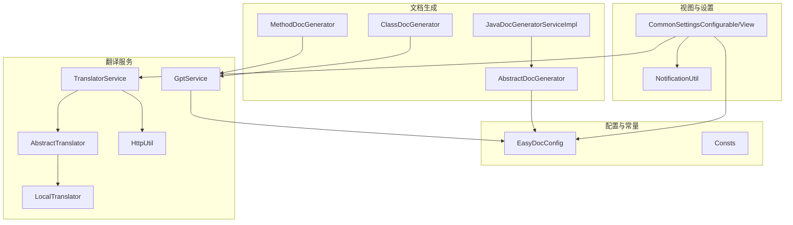
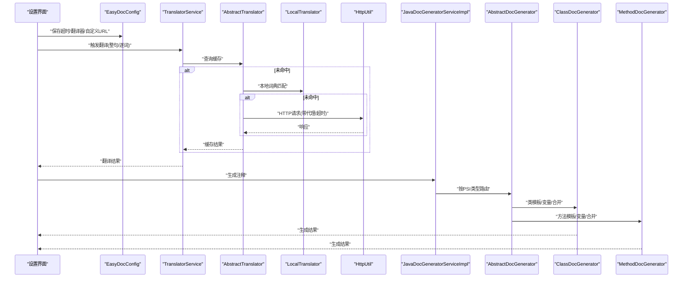
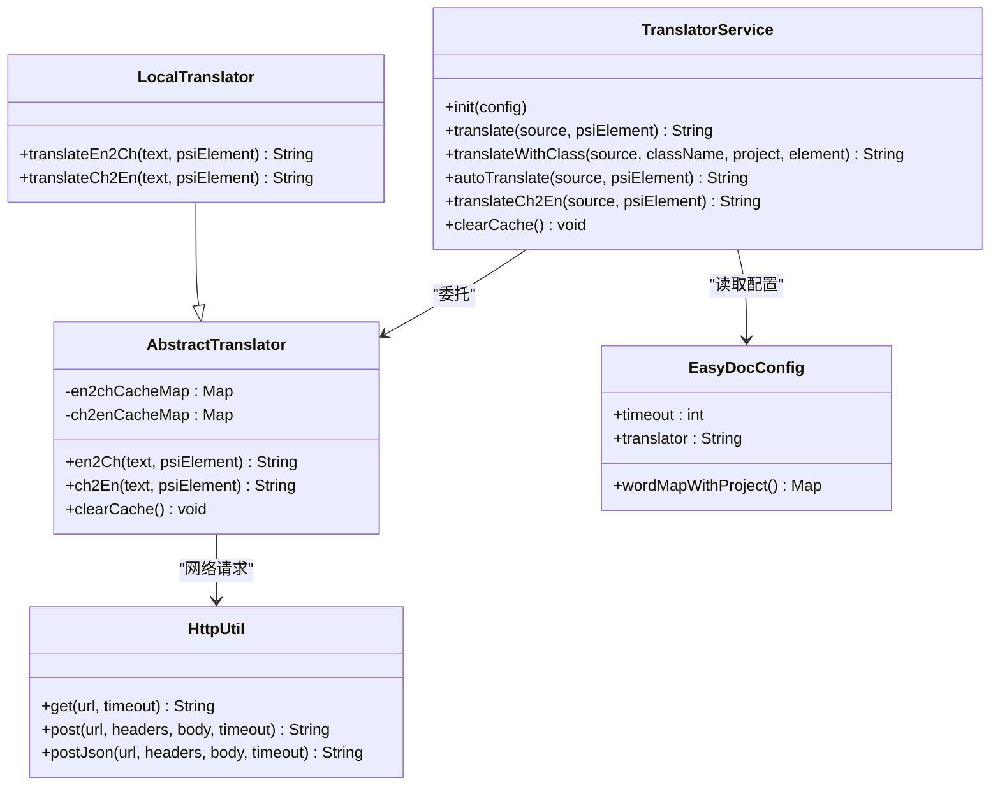
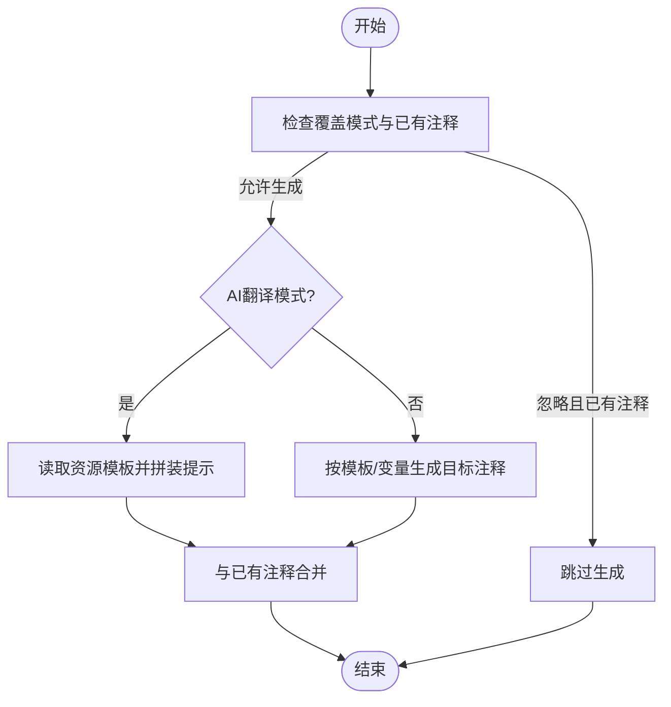
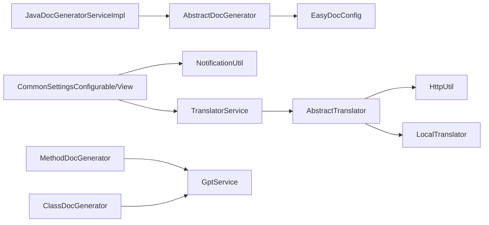

# 性能优化

<cite>
**本文引用的文件**
- [EasyDocConfig.java](file://src/main/java/com/star/easydoc/config/EasyDocConfig.java)
- [Consts.java](file://src/main/java/com/star/easydoc/common/Consts.java)
- [TranslatorService.java](file://src/main/java/com/star/easydoc/service/translator/TranslatorService.java)
- [AbstractTranslator.java](file://src/main/java/com/star/easydoc/service/translator/impl/AbstractTranslator.java)
- [LocalTranslator.java](file://src/main/java/com/star/easydoc/service/translator/impl/LocalTranslator.java)
- [GptService.java](file://src/main/java/com/star/easydoc/service/gpt/GptService.java)
- [HttpUtil.java](file://src/main/java/com/star/easydoc/common/util/HttpUtil.java)
- [JavaDocGeneratorServiceImpl.java](file://src/main/java/com/star/easydoc/javadoc/service/JavaDocGeneratorServiceImpl.java)
- [AbstractDocGenerator.java](file://src/main/java/com/star/easydoc/javadoc/service/generator/impl/AbstractDocGenerator.java)
- [ClassDocGenerator.java](file://src/main/java/com/star/easydoc/javadoc/service/generator/impl/ClassDocGenerator.java)
- [MethodDocGenerator.java](file://src/main/java/com/star/easydoc/javadoc/service/generator/impl/MethodDocGenerator.java)
- [CommonSettingsConfigurable.java](file://src/main/java/com/star/easydoc/view/settings/CommonSettingsConfigurable.java)
- [CommonSettingsView.java](file://src/main/java/com/star/easydoc/view/settings/CommonSettingsView.java)
- [NotificationUtil.java](file://src/main/java/com/star/easydoc/common/util/NotificationUtil.java)
- [build.gradle](file://build.gradle)
- [README.md](file://README.md)
</cite>

## 目录
1. [简介](#简介)
2. [项目结构](#项目结构)
3. [核心组件](#核心组件)
4. [架构总览](#架构总览)
5. [详细组件分析](#详细组件分析)
6. [依赖分析](#依赖分析)
7. [性能考虑](#性能考虑)
8. [故障排查指南](#故障排查指南)
9. [结论](#结论)
10. [附录](#附录)

## 简介
本指南聚焦于 Easy Javadoc 插件的性能优化，围绕“翻译服务性能优化”“文档生成性能优化”“运行时性能监控与最佳实践”三大主题，结合代码实现给出可操作的建议与策略，帮助用户在实际开发中获得更流畅、稳定的使用体验。

## 项目结构
插件采用分层清晰的模块化组织：
- 配置层：EasyDocConfig 提供持久化配置与模板配置，包含翻译参数、超时、覆盖模式等。
- 翻译层：TranslatorService 统一调度各翻译供应商；AbstractTranslator 实现通用缓存；LocalTranslator 提供本地词典；HttpUtil 提供网络请求能力。
- 文档生成层：JavaDocGeneratorServiceImpl 根据 PSI 元素类型路由到具体生成器；AbstractDocGenerator 提供合并逻辑；ClassDocGenerator、MethodDocGenerator 等负责模板渲染与变量替换。
- 视图与设置：CommonSettingsConfigurable/View 提供配置入口与缓存清理入口。
- 工具与常量：Consts 定义可用翻译项与停止词；NotificationUtil 提供通知；build.gradle 定义构建与依赖。

图表来源
- [EasyDocConfig.java:1-680](file://src/main/java/com/star/easydoc/config/EasyDocConfig.java#L1-L680)
- [Consts.java:1-100](file://src/main/java/com/star/easydoc/common/Consts.java#L1-L100)
- [TranslatorService.java:1-238](file://src/main/java/com/star/easydoc/service/translator/TranslatorService.java#L1-L238)
- [AbstractTranslator.java:1-92](file://src/main/java/com/star/easydoc/service/translator/impl/AbstractTranslator.java#L1-L92)
- [LocalTranslator.java:1-71](file://src/main/java/com/star/easydoc/service/translator/impl/LocalTranslator.java#L1-L71)
- [GptService.java:1-57](file://src/main/java/com/star/easydoc/service/gpt/GptService.java#L1-L57)
- [HttpUtil.java:1-246](file://src/main/java/com/star/easydoc/common/util/HttpUtil.java#L1-L246)
- [JavaDocGeneratorServiceImpl.java:1-50](file://src/main/java/com/star/easydoc/javadoc/service/JavaDocGeneratorServiceImpl.java#L1-L50)
- [AbstractDocGenerator.java:1-80](file://src/main/java/com/star/easydoc/javadoc/service/generator/impl/AbstractDocGenerator.java#L1-L80)
- [ClassDocGenerator.java:1-116](file://src/main/java/com/star/easydoc/javadoc/service/generator/impl/ClassDocGenerator.java#L1-L116)
- [MethodDocGenerator.java:1-138](file://src/main/java/com/star/easydoc/javadoc/service/generator/impl/MethodDocGenerator.java#L1-L138)
- [CommonSettingsConfigurable.java:1-200](file://src/main/java/com/star/easydoc/view/settings/CommonSettingsConfigurable.java#L1-L200)
- [CommonSettingsView.java:150-192](file://src/main/java/com/star/easydoc/view/settings/CommonSettingsView.java#L150-L192)
- [NotificationUtil.java:1-46](file://src/main/java/com/star/easydoc/common/util/NotificationUtil.java#L1-L46)

章节来源
- [build.gradle:1-78](file://build.gradle#L1-L78)
- [README.md:1-266](file://README.md#L1-L266)

## 核心组件
- 配置中心：EasyDocConfig 提供翻译参数、超时、覆盖模式、模板配置、单词映射、项目级映射等；支持重置与合并项目映射。
- 翻译调度：TranslatorService 统一注册与选择翻译器，支持自定义单词映射优先、整句/逐词翻译策略、缓存清理。
- 翻译实现：AbstractTranslator 提供并发安全的英中/中英缓存；LocalTranslator 提供本地词典加载与映射。
- 文档生成：JavaDocGeneratorServiceImpl 按 PSI 类型路由；AbstractDocGenerator 提供与已有注释的合并策略；ClassDocGenerator/MethodDocGenerator 负责模板渲染与变量替换，并支持 AI 生成。
- 网络工具：HttpUtil 提供 GET/POST、代理、超时配置与统一异常记录。
- 设置与监控：CommonSettingsConfigurable/View 提供超时校验、缓存清理入口与通知；NotificationUtil 统一通知。

章节来源
- [EasyDocConfig.java:1-680](file://src/main/java/com/star/easydoc/config/EasyDocConfig.java#L1-L680)
- [TranslatorService.java:1-238](file://src/main/java/com/star/easydoc/service/translator/TranslatorService.java#L1-L238)
- [AbstractTranslator.java:1-92](file://src/main/java/com/star/easydoc/service/translator/impl/AbstractTranslator.java#L1-L92)
- [LocalTranslator.java:1-71](file://src/main/java/com/star/easydoc/service/translator/impl/LocalTranslator.java#L1-L71)
- [JavaDocGeneratorServiceImpl.java:1-50](file://src/main/java/com/star/easydoc/javadoc/service/JavaDocGeneratorServiceImpl.java#L1-L50)
- [AbstractDocGenerator.java:1-80](file://src/main/java/com/star/easydoc/javadoc/service/generator/impl/AbstractDocGenerator.java#L1-L80)
- [ClassDocGenerator.java:1-116](file://src/main/java/com/star/easydoc/javadoc/service/generator/impl/ClassDocGenerator.java#L1-L116)
- [MethodDocGenerator.java:1-138](file://src/main/java/com/star/easydoc/javadoc/service/generator/impl/MethodDocGenerator.java#L1-L138)
- [HttpUtil.java:1-246](file://src/main/java/com/star/easydoc/common/util/HttpUtil.java#L1-L246)
- [CommonSettingsConfigurable.java:170-195](file://src/main/java/com/star/easydoc/view/settings/CommonSettingsConfigurable.java#L170-L195)
- [CommonSettingsView.java:159-165](file://src/main/java/com/star/easydoc/view/settings/CommonSettingsView.java#L159-L165)
- [NotificationUtil.java:1-46](file://src/main/java/com/star/easydoc/common/util/NotificationUtil.java#L1-L46)

## 架构总览
翻译与文档生成的关键流程如下：

图表来源
- [CommonSettingsConfigurable.java:170-195](file://src/main/java/com/star/easydoc/view/settings/CommonSettingsConfigurable.java#L170-L195)
- [TranslatorService.java:85-111](file://src/main/java/com/star/easydoc/service/translator/TranslatorService.java#L85-L111)
- [AbstractTranslator.java:23-52](file://src/main/java/com/star/easydoc/service/translator/impl/AbstractTranslator.java#L23-L52)
- [LocalTranslator.java:34-45](file://src/main/java/com/star/easydoc/service/translator/impl/LocalTranslator.java#L34-L45)
- [HttpUtil.java:76-103](file://src/main/java/com/star/easydoc/common/util/HttpUtil.java#L76-L103)
- [JavaDocGeneratorServiceImpl.java:35-48](file://src/main/java/com/star/easydoc/javadoc/service/JavaDocGeneratorServiceImpl.java#L35-L48)
- [AbstractDocGenerator.java:29-71](file://src/main/java/com/star/easydoc/javadoc/service/generator/impl/AbstractDocGenerator.java#L29-L71)
- [ClassDocGenerator.java:45-68](file://src/main/java/com/star/easydoc/javadoc/service/generator/impl/ClassDocGenerator.java#L45-L68)
- [MethodDocGenerator.java:39-63](file://src/main/java/com/star/easydoc/javadoc/service/generator/impl/MethodDocGenerator.java#L39-L63)

## 详细组件分析

### 翻译服务性能优化
- 缓存策略
  - 英中/中英双向缓存：AbstractTranslator 使用并发 Map 存储翻译结果，避免重复网络请求。
  - 本地词典优先：LocalTranslator 在首次使用时加载词典，减少网络依赖。
  - 缓存清理：通过设置界面的“清空缓存”按钮调用 TranslatorService.clearCache()，统一清理各翻译器缓存。
- 翻译策略
  - 整句 vs 逐词：当存在自定义单词映射时，优先逐词翻译以保证术语一致性；否则整句翻译提升准确性。
  - 自定义映射优先：TranslatorService 在翻译前先检查完整映射与单词映射，命中则直接返回。
- 网络与代理
  - HttpUtil 统一设置连接与读超时，自动检测 IDE 代理并应用。
  - 设置界面校验超时输入为正整数，确保合理超时配置。
- 配置项
  - 超时：EasyDocConfig.timeout，默认值较小，可在设置中调整。
  - 翻译器：Consts 定义可用翻译器集合，支持本地词典、自定义 URL、AI 等。

图表来源
- [TranslatorService.java:52-77](file://src/main/java/com/star/easydoc/service/translator/TranslatorService.java#L52-L77)
- [AbstractTranslator.java:14-92](file://src/main/java/com/star/easydoc/service/translator/impl/AbstractTranslator.java#L14-L92)
- [LocalTranslator.java:25-71](file://src/main/java/com/star/easydoc/service/translator/impl/LocalTranslator.java#L25-L71)
- [HttpUtil.java:53-180](file://src/main/java/com/star/easydoc/common/util/HttpUtil.java#L53-L180)
- [EasyDocConfig.java:664-670](file://src/main/java/com/star/easydoc/config/EasyDocConfig.java#L664-L670)

章节来源
- [AbstractTranslator.java:16-72](file://src/main/java/com/star/easydoc/service/translator/impl/AbstractTranslator.java#L16-L72)
- [LocalTranslator.java:47-69](file://src/main/java/com/star/easydoc/service/translator/impl/LocalTranslator.java#L47-L69)
- [TranslatorService.java:85-111](file://src/main/java/com/star/easydoc/service/translator/TranslatorService.java#L85-L111)
- [HttpUtil.java:76-103](file://src/main/java/com/star/easydoc/common/util/HttpUtil.java#L76-L103)
- [CommonSettingsConfigurable.java:184-189](file://src/main/java/com/star/easydoc/view/settings/CommonSettingsConfigurable.java#L184-L189)

### 文档生成性能优化
- 模板与变量
  - 模板配置：EasyDocConfig.TemplateConfig 支持默认/自定义模板与自定义变量映射。
  - 变量生成：AbstractDocGenerator.merge 对已有注释进行智能合并，避免覆盖与重复。
- 生成器路由
  - JavaDocGeneratorServiceImpl 基于 PSI 类型选择对应生成器，减少不必要的分支判断。
- AI 生成
  - ClassDocGenerator/MethodDocGenerator 在 AI 模式下读取资源模板，拼装提示后交由 GptService 处理，避免重复解析与构造。
- 覆盖模式
  - EasyDocConfig.COVER_MODE_IGNORE：若已有注释且模式为忽略，直接跳过生成，节省时间。

图表来源
- [AbstractDocGenerator.java:29-71](file://src/main/java/com/star/easydoc/javadoc/service/generator/impl/AbstractDocGenerator.java#L29-L71)
- [ClassDocGenerator.java:45-68](file://src/main/java/com/star/easydoc/javadoc/service/generator/impl/ClassDocGenerator.java#L45-L68)
- [MethodDocGenerator.java:39-63](file://src/main/java/com/star/easydoc/javadoc/service/generator/impl/MethodDocGenerator.java#L39-L63)
- [JavaDocGeneratorServiceImpl.java:35-48](file://src/main/java/com/star/easydoc/javadoc/service/JavaDocGeneratorServiceImpl.java#L35-L48)

章节来源
- [AbstractDocGenerator.java:29-71](file://src/main/java/com/star/easydoc/javadoc/service/generator/impl/AbstractDocGenerator.java#L29-L71)
- [ClassDocGenerator.java:45-93](file://src/main/java/com/star/easydoc/javadoc/service/generator/impl/ClassDocGenerator.java#L45-L93)
- [MethodDocGenerator.java:39-108](file://src/main/java/com/star/easydoc/javadoc/service/generator/impl/MethodDocGenerator.java#L39-L108)
- [JavaDocGeneratorServiceImpl.java:27-33](file://src/main/java/com/star/easydoc/javadoc/service/JavaDocGeneratorServiceImpl.java#L27-L33)

### 运行时性能监控与最佳实践
- 日志与通知
  - HttpUtil 在网络异常时记录警告日志；NotificationUtil 提供统一通知入口，便于用户感知状态。
- 配置校验
  - 设置界面校验超时为正整数，自定义 URL 必须以 http/https 开头且包含占位符，防止无效配置导致性能退化。
- 缓存管理
  - 通过设置界面提供“清空缓存”按钮，快速释放翻译缓存占用的内存。

章节来源
- [HttpUtil.java:96-98](file://src/main/java/com/star/easydoc/common/util/HttpUtil.java#L96-L98)
- [NotificationUtil.java:30-44](file://src/main/java/com/star/easydoc/common/util/NotificationUtil.java#L30-L44)
- [CommonSettingsConfigurable.java:170-195](file://src/main/java/com/star/easydoc/view/settings/CommonSettingsConfigurable.java#L170-L195)
- [CommonSettingsView.java:159-165](file://src/main/java/com/star/easydoc/view/settings/CommonSettingsView.java#L159-L165)

## 依赖分析
- 翻译链路依赖
  - TranslatorService 依赖 AbstractTranslator 与 HttpUtil；LocalTranslator 作为本地词典实现。
  - GptService 依赖 EasyDocConfig 的翻译器配置，用于 AI 生成。
- 生成链路依赖
  - JavaDocGeneratorServiceImpl 依赖具体生成器；AbstractDocGenerator 依赖 EasyDocConfig 与 PSI 工厂。
- 设置链路依赖
  - CommonSettingsConfigurable/View 依赖 TranslatorService 与 NotificationUtil。

图表来源
- [TranslatorService.java:60-76](file://src/main/java/com/star/easydoc/service/translator/TranslatorService.java#L60-L76)
- [AbstractTranslator.java:14-92](file://src/main/java/com/star/easydoc/service/translator/impl/AbstractTranslator.java#L14-L92)
- [LocalTranslator.java:25-71](file://src/main/java/com/star/easydoc/service/translator/impl/LocalTranslator.java#L25-L71)
- [HttpUtil.java:53-180](file://src/main/java/com/star/easydoc/common/util/HttpUtil.java#L53-L180)
- [JavaDocGeneratorServiceImpl.java:27-33](file://src/main/java/com/star/easydoc/javadoc/service/JavaDocGeneratorServiceImpl.java#L27-L33)
- [AbstractDocGenerator.java:29-71](file://src/main/java/com/star/easydoc/javadoc/service/generator/impl/AbstractDocGenerator.java#L29-L71)
- [ClassDocGenerator.java:31-34](file://src/main/java/com/star/easydoc/javadoc/service/generator/impl/ClassDocGenerator.java#L31-L34)
- [MethodDocGenerator.java:32-36](file://src/main/java/com/star/easydoc/javadoc/service/generator/impl/MethodDocGenerator.java#L32-L36)
- [CommonSettingsConfigurable.java:170-195](file://src/main/java/com/star/easydoc/view/settings/CommonSettingsConfigurable.java#L170-L195)
- [NotificationUtil.java:30-44](file://src/main/java/com/star/easydoc/common/util/NotificationUtil.java#L30-L44)

## 性能考虑
- 翻译缓存配置
  - 利用 AbstractTranslator 的并发缓存，减少重复网络请求；在频繁切换翻译器或大量术语场景下，建议开启本地词典以降低外部依赖。
  - 定期通过“清空缓存”按钮清理缓存，避免内存膨胀。
- API 调用频率控制
  - 合理设置 EasyDocConfig.timeout，避免过短导致频繁失败与重试；结合 HttpUtil 的代理与超时配置，平衡成功率与延迟。
  - 对于整句翻译，尽量减少一次性请求的文本长度，必要时拆分为多个请求。
- 网络连接优化
  - 使用 IDE 代理时，确保代理稳定与可用；对自定义 URL 翻译，确保占位符齐全且协议正确。
- 文档生成性能优化
  - 模板渲染：优先使用默认模板，减少复杂变量与 Groovy 脚本开销；自定义模板应简洁明了。
  - 批量生成：利用覆盖模式与合并策略，避免重复生成与覆盖成本。
  - 内存使用：在大型项目中，建议分批生成注释，避免一次性解析过多 PSI 元素导致内存压力。
- 系统资源建议
  - 构建与运行环境：插件基于 Java 17/Kotlin 1.8，建议在支持的 IDE 版本上运行，以获得更好的性能与稳定性。
  - 资源占用：AI 生成与网络请求会带来额外 CPU/IO 开销，建议在空闲时段执行大批量任务。

章节来源
- [AbstractTranslator.java:16-72](file://src/main/java/com/star/easydoc/service/translator/impl/AbstractTranslator.java#L16-L72)
- [HttpUtil.java:76-103](file://src/main/java/com/star/easydoc/common/util/HttpUtil.java#L76-L103)
- [AbstractDocGenerator.java:29-71](file://src/main/java/com/star/easydoc/javadoc/service/generator/impl/AbstractDocGenerator.java#L29-L71)
- [build.gradle:16-39](file://build.gradle#L16-L39)
- [README.md:87-102](file://README.md#L87-L102)

## 故障排查指南
- 翻译失败
  - 检查超时设置是否合理；查看 HttpUtil 日志输出定位网络问题；确认代理可用性。
  - 若使用本地词典，确认词典加载成功；若使用自定义 URL，确认占位符与协议正确。
- 缓存异常
  - 通过设置界面“清空缓存”，重新触发翻译以验证缓存是否恢复正常。
- 生成注释不符合预期
  - 检查覆盖模式与已有注释合并策略；确认模板与变量配置是否符合预期。
- 通知与提示
  - 使用 NotificationUtil 的通知能力，关注插件提示与引导。

章节来源
- [HttpUtil.java:96-98](file://src/main/java/com/star/easydoc/common/util/HttpUtil.java#L96-L98)
- [CommonSettingsConfigurable.java:170-195](file://src/main/java/com/star/easydoc/view/settings/CommonSettingsConfigurable.java#L170-L195)
- [CommonSettingsView.java:159-165](file://src/main/java/com/star/easydoc/view/settings/CommonSettingsView.java#L159-L165)
- [NotificationUtil.java:30-44](file://src/main/java/com/star/easydoc/common/util/NotificationUtil.java#L30-L44)

## 结论
通过合理的翻译缓存策略、API 调用频率控制、网络连接优化以及文档生成的模板与内存优化，可以显著提升 Easy Javadoc 插件的性能与稳定性。建议用户结合自身项目规模与网络环境，灵活调整超时、覆盖模式与翻译器配置，并定期清理缓存与分批生成注释，以获得最佳使用体验。

## 附录
- 常用配置要点
  - 超时：在设置界面输入正整数毫秒值。
  - 翻译器：根据免费额度与稳定性选择合适翻译器。
  - 本地词典：在术语较多场景下启用，减少网络依赖。
  - 自定义 URL：确保包含 {from}/{to}/{query} 占位符且以 http/https 开头。

章节来源
- [CommonSettingsConfigurable.java:170-195](file://src/main/java/com/star/easydoc/view/settings/CommonSettingsConfigurable.java#L170-L195)
- [Consts.java:29-38](file://src/main/java/com/star/easydoc/common/Consts.java#L29-L38)
- [README.md:41-48](file://README.md#L41-L48)