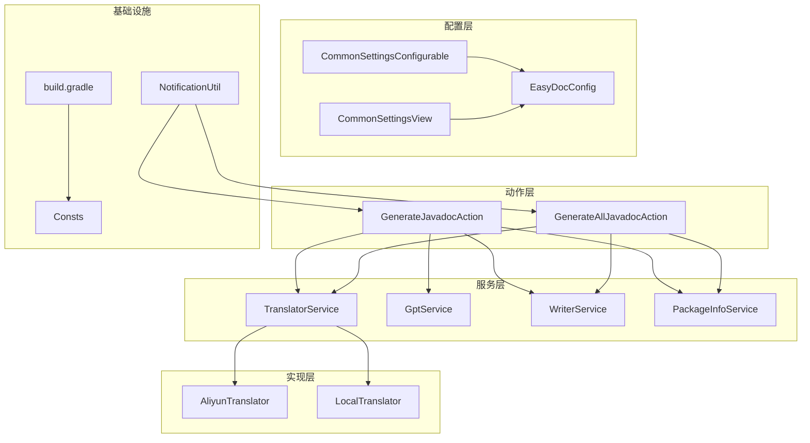
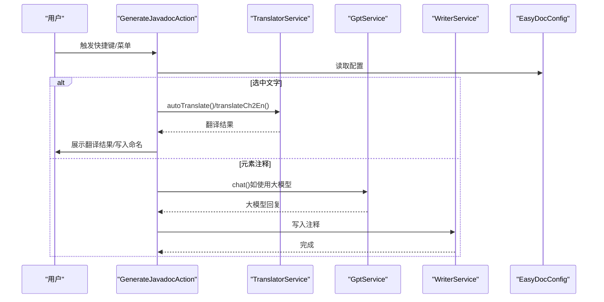
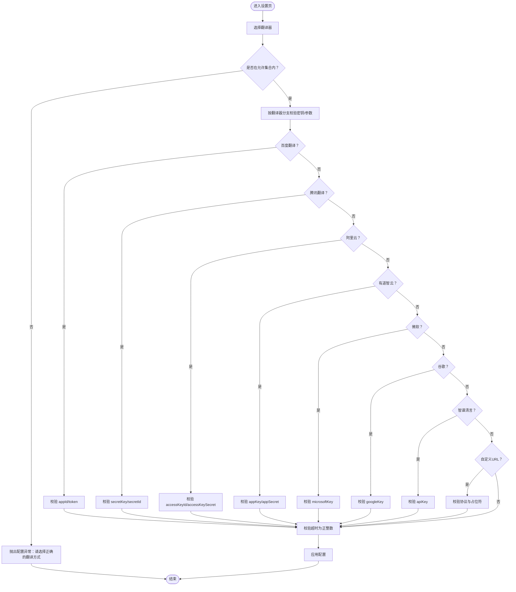
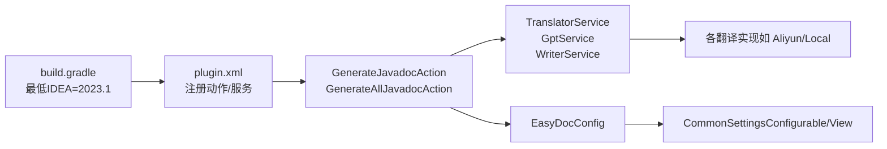

# 故障排除

<cite>
**本文引用的文件**
- [README.md](file://README.md)
- [plugin.xml](file://src/main/resources/META-INF/plugin.xml)
- [EasyDocConfig.java](file://src/main/java/com/star/easydoc/config/EasyDocConfig.java)
- [CommonSettingsConfigurable.java](file://src/main/java/com/star/easydoc/view/settings/CommonSettingsConfigurable.java)
- [CommonSettingsView.java](file://src/main/java/com/star/easydoc/view/settings/CommonSettingsView.java)
- [GenerateJavadocAction.java](file://src/main/java/com/star/easydoc/action/GenerateJavadocAction.java)
- [GenerateAllJavadocAction.java](file://src/main/java/com/star/easydoc/action/GenerateAllJavadocAction.java)
- [TranslatorService.java](file://src/main/java/com/star/easydoc/service/translator/TranslatorService.java)
- [AliyunTranslator.java](file://src/main/java/com/star/easydoc/service/translator/impl/AliyunTranslator.java)
- [LocalTranslator.java](file://src/main/java/com/star/easydoc/service/translator/impl/LocalTranslator.java)
- [GptService.java](file://src/main/java/com/star/easydoc/service/gpt/GptService.java)
- [NotificationUtil.java](file://src/main/java/com/star/easydoc/common/util/NotificationUtil.java)
- [Consts.java](file://src/main/java/com/star/easydoc/common/Consts.java)
- [build.gradle](file://build.gradle)
</cite>

## 目录
1. [简介](#简介)
2. [项目结构](#项目结构)
3. [核心组件](#核心组件)
4. [架构总览](#架构总览)
5. [详细组件分析](#详细组件分析)
6. [依赖分析](#依赖分析)
7. [性能考虑](#性能考虑)
8. [故障排除指南](#故障排除指南)
9. [结论](#结论)
10. [附录](#附录)

## 简介
本指南面向使用 Easy Javadoc 插件的开发者，聚焦于常见问题与系统化排障流程，涵盖快捷键不生效、翻译服务配置错误、模板渲染异常、插件兼容性问题、性能优化建议以及版本兼容性说明。同时提供日志分析、配置验证、环境检查等方法，帮助快速定位并解决问题。

## 项目结构
插件采用 IntelliJ 平台标准结构，核心模块包括：
- 动作与入口：GenerateJavadocAction、GenerateAllJavadocAction
- 配置与设置：EasyDocConfig、CommonSettingsConfigurable、CommonSettingsView
- 翻译服务：TranslatorService 及各具体实现（如阿里云、本地词典等）
- GPT 服务：GptService（智谱清言）
- 通知与日志：NotificationUtil
- 常量与构建：Consts、build.gradle

图表来源
- [plugin.xml:55-78](file://src/main/resources/META-INF/plugin.xml#L55-L78)
- [GenerateJavadocAction.java:46-175](file://src/main/java/com/star/easydoc/action/GenerateJavadocAction.java#L46-L175)
- [GenerateAllJavadocAction.java:47-218](file://src/main/java/com/star/easydoc/action/GenerateAllJavadocAction.java#L47-L218)
- [TranslatorService.java:41-238](file://src/main/java/com/star/easydoc/service/translator/TranslatorService.java#L41-L238)
- [AliyunTranslator.java:35-283](file://src/main/java/com/star/easydoc/service/translator/impl/AliyunTranslator.java#L35-L283)
- [LocalTranslator.java:25-71](file://src/main/java/com/star/easydoc/service/translator/impl/LocalTranslator.java#L25-L71)
- [CommonSettingsConfigurable.java:25-196](file://src/main/java/com/star/easydoc/view/settings/CommonSettingsConfigurable.java#L25-L196)
- [CommonSettingsView.java:159-192](file://src/main/java/com/star/easydoc/view/settings/CommonSettingsView.java#L159-L192)
- [NotificationUtil.java:18-46](file://src/main/java/com/star/easydoc/common/util/NotificationUtil.java#L18-L46)
- [Consts.java:14-100](file://src/main/java/com/star/easydoc/common/Consts.java#L14-L100)
- [build.gradle:51-56](file://build.gradle#L51-L56)

章节来源
- [plugin.xml:1-82](file://src/main/resources/META-INF/plugin.xml#L1-L82)
- [build.gradle:1-78](file://build.gradle#L1-L78)

## 核心组件
- 动作与入口
  - GenerateJavadocAction：处理单个元素注释生成、选中翻译、包描述生成等
  - GenerateAllJavadocAction：批量生成注释（类/方法/属性/内部类）
- 配置与设置
  - EasyDocConfig：持久化配置（翻译器、超时、密钥、模板、覆盖策略等）
  - CommonSettingsConfigurable/CommonSettingsView：设置页校验与应用逻辑
- 翻译与 GPT
  - TranslatorService：统一调度各翻译实现，支持自定义词典与整句/单词模式
  - GptService：封装智谱清言等大模型能力
- 通知与日志
  - NotificationUtil：统一通知展示
- 常量与构建
  - Consts：翻译器枚举、停止词、基础类型集合等
  - build.gradle：IDEA 版本与最低支持版本声明

章节来源
- [GenerateJavadocAction.java:46-175](file://src/main/java/com/star/easydoc/action/GenerateJavadocAction.java#L46-L175)
- [GenerateAllJavadocAction.java:47-218](file://src/main/java/com/star/easydoc/action/GenerateAllJavadocAction.java#L47-L218)
- [EasyDocConfig.java:22-680](file://src/main/java/com/star/easydoc/config/EasyDocConfig.java#L22-L680)
- [CommonSettingsConfigurable.java:25-196](file://src/main/java/com/star/easydoc/view/settings/CommonSettingsConfigurable.java#L25-L196)
- [CommonSettingsView.java:159-192](file://src/main/java/com/star/easydoc/view/settings/CommonSettingsView.java#L159-L192)
- [TranslatorService.java:41-238](file://src/main/java/com/star/easydoc/service/translator/TranslatorService.java#L41-L238)
- [GptService.java:16-57](file://src/main/java/com/star/easydoc/service/gpt/GptService.java#L16-L57)
- [NotificationUtil.java:18-46](file://src/main/java/com/star/easydoc/common/util/NotificationUtil.java#L18-L46)
- [Consts.java:14-100](file://src/main/java/com/star/easydoc/common/Consts.java#L14-L100)
- [build.gradle:51-56](file://build.gradle#L51-L56)

## 架构总览
插件通过动作触发，调用服务层完成注释生成与写入；配置层负责参数校验与持久化；翻译层负责文本翻译与本地词典；通知层负责用户反馈。

图表来源
- [GenerateJavadocAction.java:72-115](file://src/main/java/com/star/easydoc/action/GenerateJavadocAction.java#L72-L115)
- [TranslatorService.java:157-163](file://src/main/java/com/star/easydoc/service/translator/TranslatorService.java#L157-L163)
- [GptService.java:48-54](file://src/main/java/com/star/easydoc/service/gpt/GptService.java#L48-L54)
- [EasyDocConfig.java:426-450](file://src/main/java/com/star/easydoc/config/EasyDocConfig.java#L426-L450)

## 详细组件分析

### 动作与快捷键
- 快捷键绑定与冲突
  - 插件在 plugin.xml 中注册了默认快捷键（Windows/Ctrl；macOS/Command），若与 IDEA 或其他插件冲突，需在 IDE 快捷键设置中调整
  - README 提示最新 IDEA 的 AI Assistant 插件与本插件快捷键存在冲突，建议修改任一快捷键
- 光标与选区
  - 生成注释需将光标置于类/方法/属性上，而非选中文本；选中文本时会触发翻译功能
- 批量生成
  - 仅支持 Java 类，Kdoc 批量尚未实现

章节来源
- [plugin.xml:55-78](file://src/main/resources/META-INF/plugin.xml#L55-L78)
- [README.md:71-84](file://README.md#L71-L84)
- [GenerateJavadocAction.java:72-115](file://src/main/java/com/star/easydoc/action/GenerateJavadocAction.java#L72-L115)
- [GenerateAllJavadocAction.java:141-143](file://src/main/java/com/star/easydoc/action/GenerateAllJavadocAction.java#L141-L143)

### 翻译服务与配置校验
- 翻译器选择与密钥校验
  - CommonSettingsConfigurable 在 apply 时对所选翻译器及对应密钥进行严格校验，不满足条件会抛出配置异常
  - 支持的翻译器集合由 Consts.ENABLE_TRANSLATOR_SET 维护
- 自定义 HTTP 接口
  - 需包含 {from}/{to}/{query} 占位符且协议为 http/https
- 超时时间
  - 必须为正整数
- 缓存清理
  - 设置页提供“清空缓存”按钮，调用 TranslatorService.clearCache()

图表来源
- [CommonSettingsConfigurable.java:117-189](file://src/main/java/com/star/easydoc/view/settings/CommonSettingsConfigurable.java#L117-L189)
- [Consts.java:29-34](file://src/main/java/com/star/easydoc/common/Consts.java#L29-L34)

章节来源
- [CommonSettingsConfigurable.java:94-189](file://src/main/java/com/star/easydoc/view/settings/CommonSettingsConfigurable.java#L94-L189)
- [Consts.java:29-34](file://src/main/java/com/star/easydoc/common/Consts.java#L29-L34)
- [CommonSettingsView.java:159-165](file://src/main/java/com/star/easydoc/view/settings/CommonSettingsView.java#L159-L165)

### 模板与变量生成
- 模板配置
  - EasyDocConfig.TemplateConfig 支持默认模板与自定义映射，变量类型包括“固定值”和“Groovy脚本”
- 变量生成器
  - 通过 TranslatorService.translateWithClass 可从已有类注释中读取描述，实现“类注释优先”
- 常见问题
  - IDEA 默认格式化可能重排 Javadoc 标签顺序或将单行注释格式化为多行，需在设置中关闭相关格式化或调整注释顺序

章节来源
- [EasyDocConfig.java:211-254](file://src/main/java/com/star/easydoc/config/EasyDocConfig.java#L211-L254)
- [TranslatorService.java:119-148](file://src/main/java/com/star/easydoc/service/translator/TranslatorService.java#L119-L148)
- [README.md:81-84](file://README.md#L81-L84)

### GPT 与本地翻译
- GPT 服务
  - GptService 初始化时根据配置选择供应商（如智谱清言），chat() 返回大模型回复
- 本地翻译
  - LocalTranslator 从资源加载本地词典，初始化时解析 JSON 并建立双向映射；加载失败会记录错误日志

章节来源
- [GptService.java:16-57](file://src/main/java/com/star/easydoc/service/gpt/GptService.java#L16-L57)
- [LocalTranslator.java:47-69](file://src/main/java/com/star/easydoc/service/translator/impl/LocalTranslator.java#L47-L69)

## 依赖分析
- 插件依赖
  - 构建配置声明最低 IDEA 版本为 2023.1，支持 Java/Kotlin 模块
- 运行时依赖
  - TranslatorService 通过 ImmutableMap 注册各翻译实现
  - 动作层依赖服务层与配置层，服务层依赖翻译实现与工具类

图表来源
- [build.gradle:51-56](file://build.gradle#L51-L56)
- [plugin.xml:27-53](file://src/main/resources/META-INF/plugin.xml#L27-L53)
- [GenerateJavadocAction.java:48-53](file://src/main/java/com/star/easydoc/action/GenerateJavadocAction.java#L48-L53)
- [TranslatorService.java:60-76](file://src/main/java/com/star/easydoc/service/translator/TranslatorService.java#L60-L76)

章节来源
- [build.gradle:51-56](file://build.gradle#L51-L56)
- [plugin.xml:27-53](file://src/main/resources/META-INF/plugin.xml#L27-L53)

## 性能考虑
- 翻译缓存
  - 设置页提供“清空缓存”按钮，调用 TranslatorService.clearCache() 清理各翻译实现的缓存
- 超时控制
  - 通过设置页输入超时时间（毫秒），影响网络请求等待时长
- 本地词典
  - LocalTranslator 使用本地词典减少网络请求，适合高频场景
- 模板与变量
  - 合理使用“固定值/脚本”变量，避免复杂 Groovy 脚本带来的运行时开销

章节来源
- [CommonSettingsView.java:159-165](file://src/main/java/com/star/easydoc/view/settings/CommonSettingsView.java#L159-L165)
- [TranslatorService.java:234-236](file://src/main/java/com/star/easydoc/service/translator/TranslatorService.java#L234-L236)
- [CommonSettingsConfigurable.java:184-188](file://src/main/java/com/star/easydoc/view/settings/CommonSettingsConfigurable.java#L184-L188)
- [LocalTranslator.java:47-69](file://src/main/java/com/star/easydoc/service/translator/impl/LocalTranslator.java#L47-L69)

## 故障排除指南

### 快捷键不生效
- 检查项
  - 光标是否位于类/方法/属性上，而非选中文本
  - IDE 快捷键设置是否存在冲突（尤其是与 AI Assistant 插件）
- 处理步骤
  - 在 IDE 快捷键设置中修改冲突快捷键
  - 重新加载项目或重启 IDE
- 参考
  - [README.md:71-84](file://README.md#L71-L84)
  - [plugin.xml:55-78](file://src/main/resources/META-INF/plugin.xml#L55-L78)

章节来源
- [README.md:71-84](file://README.md#L71-L84)
- [plugin.xml:55-78](file://src/main/resources/META-INF/plugin.xml#L55-L78)

### 翻译服务配置错误
- 症状
  - 应用设置时报错，如“请选择正确的翻译方式”“密钥不能为空”“自定义地址只支持http或https”等
- 诊断
  - 打开设置页，逐一核对所选翻译器与对应密钥/参数
  - 检查超时时间是否为正整数
- 处理
  - 补充缺失的密钥或参数
  - 修正自定义 URL 协议与占位符
  - 修改超时时间为有效数值
- 参考
  - [CommonSettingsConfigurable.java:117-189](file://src/main/java/com/star/easydoc/view/settings/CommonSettingsConfigurable.java#L117-L189)

章节来源
- [CommonSettingsConfigurable.java:94-189](file://src/main/java/com/star/easydoc/view/settings/CommonSettingsConfigurable.java#L94-L189)

### 翻译异常与日志
- 症状
  - 网络请求失败、签名错误、响应解析异常
- 诊断
  - 查看翻译实现的日志输出（如阿里云翻译在异常时记录错误信息）
  - 确认密钥、区域、超时等配置正确
- 处理
  - 修正密钥与参数
  - 提升超时时间或切换可用翻译器
- 参考
  - [AliyunTranslator.java:69-72](file://src/main/java/com/star/easydoc/service/translator/impl/AliyunTranslator.java#L69-L72)

章节来源
- [AliyunTranslator.java:69-72](file://src/main/java/com/star/easydoc/service/translator/impl/AliyunTranslator.java#L69-L72)

### 模板渲染异常
- 症状
  - 注释标签顺序被格式化、单行注释被转为多行、自定义变量未生效
- 诊断
  - 检查 IDEA 的 Javadoc 格式化设置
  - 确认模板变量与自定义映射配置正确
- 处理
  - 关闭 Javadoc 格式化或调整格式化策略
  - 在设置页中启用“类注释优先”，从已有类注释中读取描述
- 参考
  - [README.md:81-84](file://README.md#L81-L84)
  - [TranslatorService.java:119-148](file://src/main/java/com/star/easydoc/service/translator/TranslatorService.java#L119-L148)

章节来源
- [README.md:81-84](file://README.md#L81-L84)
- [TranslatorService.java:119-148](file://src/main/java/com/star/easydoc/service/translator/TranslatorService.java#L119-L148)

### 插件兼容性问题
- IDEA 版本
  - 构建配置声明最低支持 2023.1；建议使用较新的稳定版以获得最佳兼容性
- 插件版本
  - 请确保使用最新版本，以获得最新的兼容性修复与功能增强
- 参考
  - [build.gradle:51-56](file://build.gradle#L51-L56)
  - [README.md:86-110](file://README.md#L86-L110)

章节来源
- [build.gradle:51-56](file://build.gradle#L51-L56)
- [README.md:86-110](file://README.md#L86-L110)

### 性能优化建议
- 翻译缓存
  - 定期清理缓存，避免陈旧数据影响体验
- 超时与重试
  - 合理设置超时时间，网络不稳定时适当提高
- 本地词典
  - 启用本地词典以减少网络往返
- 模板优化
  - 使用“固定值”变量替代复杂脚本，减少运行时开销

章节来源
- [CommonSettingsView.java:159-165](file://src/main/java/com/star/easydoc/view/settings/CommonSettingsView.java#L159-L165)
- [CommonSettingsConfigurable.java:184-188](file://src/main/java/com/star/easydoc/view/settings/CommonSettingsConfigurable.java#L184-L188)
- [LocalTranslator.java:47-69](file://src/main/java/com/star/easydoc/service/translator/impl/LocalTranslator.java#L47-L69)

### 日志分析与通知
- 日志
  - 翻译实现会在异常时记录错误日志，便于定位问题
- 通知
  - 使用 NotificationUtil 统一展示信息与警告，便于用户感知
- 参考
  - [AliyunTranslator.java:69-72](file://src/main/java/com/star/easydoc/service/translator/impl/AliyunTranslator.java#L69-L72)
  - [NotificationUtil.java:30-44](file://src/main/java/com/star/easydoc/common/util/NotificationUtil.java#L30-L44)

章节来源
- [AliyunTranslator.java:69-72](file://src/main/java/com/star/easydoc/service/translator/impl/AliyunTranslator.java#L69-L72)
- [NotificationUtil.java:30-44](file://src/main/java/com/star/easydoc/common/util/NotificationUtil.java#L30-L44)

### 用户反馈与社区支持
- 官方仓库与评价页
  - 设置页提供“打开仓库”“查看评价”按钮，便于用户反馈与参考他人评价
- 参考
  - [CommonSettingsView.java:167-187](file://src/main/java/com/star/easydoc/view/settings/CommonSettingsView.java#L167-L187)

章节来源
- [CommonSettingsView.java:167-187](file://src/main/java/com/star/easydoc/view/settings/CommonSettingsView.java#L167-L187)

## 结论
通过系统化的配置校验、日志分析与兼容性检查，大多数问题可在设置页与动作行为层面快速定位与修复。建议优先检查快捷键冲突、翻译器密钥与超时设置，再结合模板与格式化策略进行微调。对于性能问题，优先启用本地词典与合理设置缓存清理策略。

## 附录
- 常见术语
  - “类注释优先”：当已有类注释存在时，优先使用其描述作为翻译依据
  - “智能合并”：在已有注释基础上进行合并，避免覆盖
- 快速检查清单
  - 快捷键未生效：确认光标位置与冲突设置
  - 翻译失败：核对密钥/URL/占位符/超时
  - 注释格式异常：关闭 Javadoc 格式化或调整顺序
  - 性能不佳：清理缓存、提升超时、启用本地词典