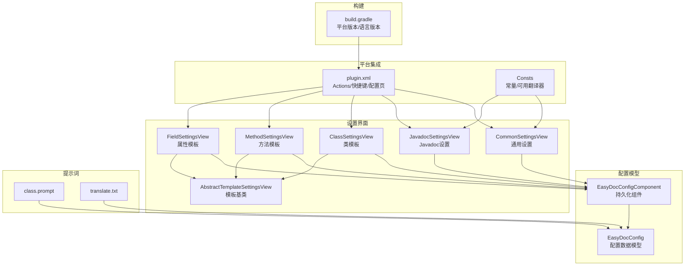
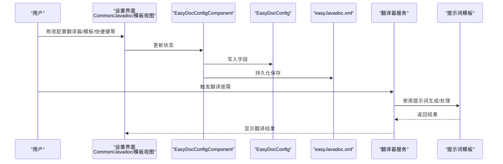
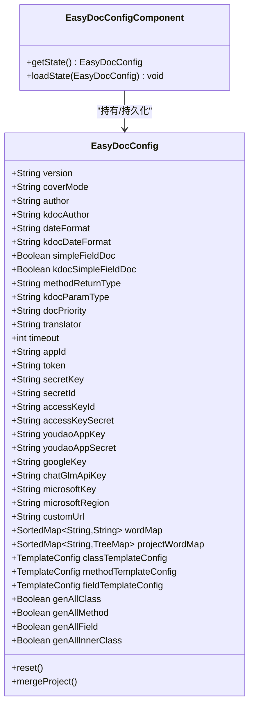
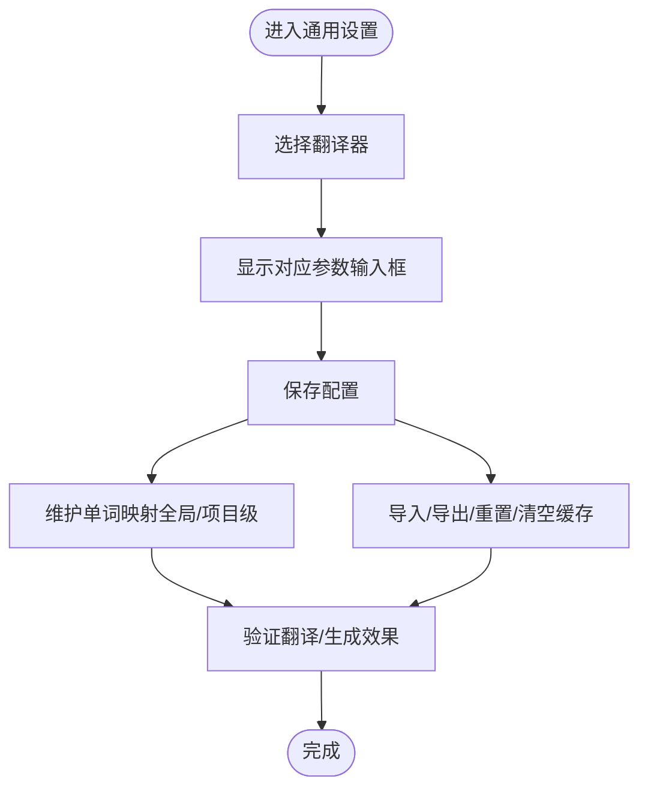
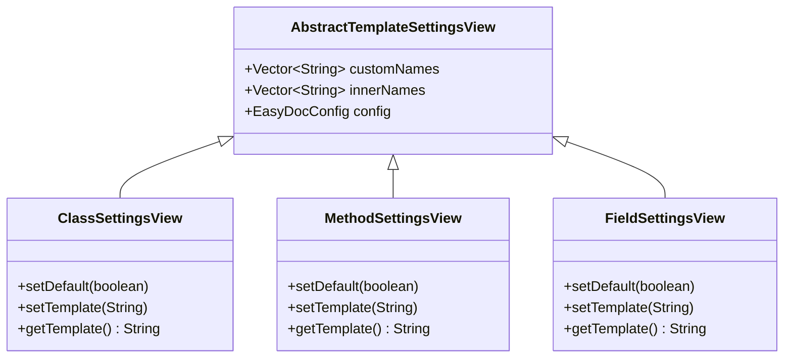
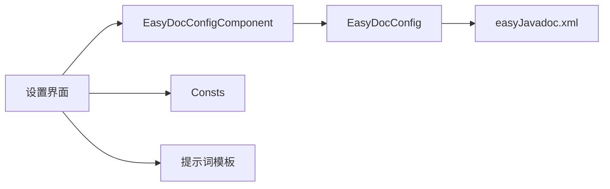

# 配置问题排查

<cite>
**本文引用的文件**
- [EasyDocConfig.java](file://src/main/java/com/star/easydoc/config/EasyDocConfig.java)
- [EasyDocConfigComponent.java](file://src/main/java/com/star/easydoc/config/EasyDocConfigComponent.java)
- [CommonSettingsView.java](file://src/main/java/com/star/easydoc/view/settings/CommonSettingsView.java)
- [JavadocSettingsView.java](file://src/main/java/com/star/easydoc/view/settings/javadoc/JavadocSettingsView.java)
- [ClassSettingsView.java](file://src/main/java/com/star/easydoc/view/settings/javadoc/template/ClassSettingsView.java)
- [MethodSettingsView.java](file://src/main/java/com/star/easydoc/view/settings/javadoc/template/MethodSettingsView.java)
- [FieldSettingsView.java](file://src/main/java/com/star/easydoc/view/settings/javadoc/template/FieldSettingsView.java)
- [AbstractTemplateSettingsView.java](file://src/main/java/com/star/easydoc/view/settings/javadoc/template/AbstractTemplateSettingsView.java)
- [plugin.xml](file://src/main/resources/META-INF/plugin.xml)
- [Consts.java](file://src/main/java/com/star/easydoc/common/Consts.java)
- [class.prompt](file://src/main/resources/prompts/chatglm/class.prompt)
- [translate.txt](file://src/main/resources/prompts/translate.txt)
- [build.gradle](file://build.gradle)
</cite>

## 目录
1. [简介](#简介)
2. [项目结构](#项目结构)
3. [核心组件](#核心组件)
4. [架构总览](#架构总览)
5. [详细组件分析](#详细组件分析)
6. [依赖分析](#依赖分析)
7. [性能考虑](#性能考虑)
8. [故障排查指南](#故障排查指南)
9. [结论](#结论)
10. [附录](#附录)

## 简介
本指南面向使用 Easy Javadoc 插件的用户与维护者，聚焦“配置问题排查”。内容涵盖：
- 配置项的正确设置方法：翻译服务、模板、快捷键、批量生成策略等
- 配置验证方法与常见错误诊断
- 配置文件存储位置、备份与重置恢复
- 不同 IDEA 版本的兼容性与迁移升级建议

## 项目结构
插件配置相关的核心模块分布如下：
- 配置模型与持久化：EasyDocConfig、EasyDocConfigComponent
- 通用设置界面：CommonSettingsView（翻译、超时、单词映射、导入导出、重置）
- Javadoc 设置界面：JavadocSettingsView（作者、日期格式、字段模式、返回类型、优先级、覆盖模式）
- 模板设置界面：ClassSettingsView、MethodSettingsView、FieldSettingsView（内置变量、自定义变量、模板文本）
- 快捷键与入口：plugin.xml（Actions 与快捷键）
- 常量与可用翻译器：Consts
- 提示词模板：class.prompt、translate.txt
- 构建与版本：build.gradle（IntelliJ 平台版本、Kotlin/Java 版本）

图表来源
- [EasyDocConfig.java:1-680](file://src/main/java/com/star/easydoc/config/EasyDocConfig.java#L1-L680)
- [EasyDocConfigComponent.java:1-69](file://src/main/java/com/star/easydoc/config/EasyDocConfigComponent.java#L1-L69)
- [CommonSettingsView.java:1-739](file://src/main/java/com/star/easydoc/view/settings/CommonSettingsView.java#L1-L739)
- [JavadocSettingsView.java:1-218](file://src/main/java/com/star/easydoc/view/settings/javadoc/JavadocSettingsView.java#L1-L218)
- [ClassSettingsView.java:1-180](file://src/main/java/com/star/easydoc/view/settings/javadoc/template/ClassSettingsView.java#L1-L180)
- [MethodSettingsView.java:1-179](file://src/main/java/com/star/easydoc/view/settings/javadoc/template/MethodSettingsView.java#L1-L179)
- [FieldSettingsView.java:1-176](file://src/main/java/com/star/easydoc/view/settings/javadoc/template/FieldSettingsView.java#L1-L176)
- [AbstractTemplateSettingsView.java:1-37](file://src/main/java/com/star/easydoc/view/settings/javadoc/template/AbstractTemplateSettingsView.java#L1-L37)
- [plugin.xml:1-82](file://src/main/resources/META-INF/plugin.xml#L1-L82)
- [Consts.java:1-100](file://src/main/java/com/star/easydoc/common/Consts.java#L1-L100)
- [class.prompt:1-30](file://src/main/resources/prompts/chatglm/class.prompt#L1-L30)
- [translate.txt:1-2](file://src/main/resources/prompts/translate.txt#L1-L2)
- [build.gradle:1-78](file://build.gradle#L1-L78)

章节来源
- [plugin.xml:1-82](file://src/main/resources/META-INF/plugin.xml#L1-L82)
- [build.gradle:1-78](file://build.gradle#L1-L78)

## 核心组件
- 配置模型与持久化
  - EasyDocConfig：集中管理作者、日期格式、字段模式、方法返回类型、翻译器、超时、单词映射、模板配置、批量生成开关、覆盖模式等
  - EasyDocConfigComponent：实现 PersistentStateComponent，负责读取/写入持久化配置文件（名称为 easyJavadoc.xml），并提供默认值初始化
- 设置界面
  - CommonSettingsView：翻译器选择与参数输入、超时、单词映射、导入/导出、重置、清空缓存
  - JavadocSettingsView：作者、日期格式、字段模式、方法返回类型、注释优先级、覆盖模式
  - Class/Method/FieldSettingsView：模板选择（默认/自定义）、模板文本、内置变量说明、自定义变量增删改
- 平台集成
  - plugin.xml：注册配置页、Actions 与快捷键；声明最低平台版本
  - Consts：定义可用翻译器集合、默认日期格式等常量

章节来源
- [EasyDocConfig.java:1-680](file://src/main/java/com/star/easydoc/config/EasyDocConfig.java#L1-L680)
- [EasyDocConfigComponent.java:1-69](file://src/main/java/com/star/easydoc/config/EasyDocConfigComponent.java#L1-L69)
- [CommonSettingsView.java:1-739](file://src/main/java/com/star/easydoc/view/settings/CommonSettingsView.java#L1-L739)
- [JavadocSettingsView.java:1-218](file://src/main/java/com/star/easydoc/view/settings/javadoc/JavadocSettingsView.java#L1-L218)
- [ClassSettingsView.java:1-180](file://src/main/java/com/star/easydoc/view/settings/javadoc/template/ClassSettingsView.java#L1-L180)
- [MethodSettingsView.java:1-179](file://src/main/java/com/star/easydoc/view/settings/javadoc/template/MethodSettingsView.java#L1-L179)
- [FieldSettingsView.java:1-176](file://src/main/java/com/star/easydoc/view/settings/javadoc/template/FieldSettingsView.java#L1-L176)
- [plugin.xml:1-82](file://src/main/resources/META-INF/plugin.xml#L1-L82)
- [Consts.java:1-100](file://src/main/java/com/star/easydoc/common/Consts.java#L1-L100)

## 架构总览
下图展示配置从界面到持久化的流转路径，以及与翻译器、模板提示词的关系。

图表来源
- [CommonSettingsView.java:1-739](file://src/main/java/com/star/easydoc/view/settings/CommonSettingsView.java#L1-L739)
- [JavadocSettingsView.java:1-218](file://src/main/java/com/star/easydoc/view/settings/javadoc/JavadocSettingsView.java#L1-L218)
- [ClassSettingsView.java:1-180](file://src/main/java/com/star/easydoc/view/settings/javadoc/template/ClassSettingsView.java#L1-L180)
- [MethodSettingsView.java:1-179](file://src/main/java/com/star/easydoc/view/settings/javadoc/template/MethodSettingsView.java#L1-L179)
- [FieldSettingsView.java:1-176](file://src/main/java/com/star/easydoc/view/settings/javadoc/template/FieldSettingsView.java#L1-L176)
- [EasyDocConfigComponent.java:1-69](file://src/main/java/com/star/easydoc/config/EasyDocConfigComponent.java#L1-L69)
- [EasyDocConfig.java:1-680](file://src/main/java/com/star/easydoc/config/EasyDocConfig.java#L1-L680)
- [class.prompt:1-30](file://src/main/resources/prompts/chatglm/class.prompt#L1-L30)
- [translate.txt:1-2](file://src/main/resources/prompts/translate.txt#L1-L2)

## 详细组件分析

### 配置模型与持久化（EasyDocConfig + EasyDocConfigComponent）
- EasyDocConfig
  - 字段覆盖模式、作者、日期格式、字段模式、方法返回类型、注释优先级、超时、翻译器类型与密钥、单词映射、模板配置（类/方法/属性）、批量生成开关、版本等
  - 提供 reset() 一键重置为默认值，并合并项目级单词映射
- EasyDocConfigComponent
  - 实现 PersistentStateComponent，状态文件名为 easyJavadoc.xml
  - 首次加载时填充默认值（作者、日期格式、字段模式、方法返回类型、模板配置、覆盖模式、翻译器、超时等）

图表来源
- [EasyDocConfig.java:1-680](file://src/main/java/com/star/easydoc/config/EasyDocConfig.java#L1-L680)
- [EasyDocConfigComponent.java:1-69](file://src/main/java/com/star/easydoc/config/EasyDocConfigComponent.java#L1-L69)

章节来源
- [EasyDocConfig.java:1-680](file://src/main/java/com/star/easydoc/config/EasyDocConfig.java#L1-L680)
- [EasyDocConfigComponent.java:1-69](file://src/main/java/com/star/easydoc/config/EasyDocConfigComponent.java#L1-L69)

### 通用设置（CommonSettingsView）
- 功能要点
  - 翻译器选择与参数联动显示（百度、腾讯、阿里云、有道智云、微软、谷歌、智谱清言、自定义HTTP接口等）
  - 超时设置、自定义URL帮助链接
  - 单词映射：全局与项目级（自动同步已打开项目）
  - 导入/导出配置（JSON）、重置（清空所有配置）、清空翻译缓存
- 常见问题
  - 未选择翻译器或参数不完整导致翻译失败
  - 项目级单词映射未生效：检查项目列表是否已初始化并选择了对应项目
  - 导入失败：确保 JSON 结构与 EasyDocConfig 兼容

图表来源
- [CommonSettingsView.java:1-739](file://src/main/java/com/star/easydoc/view/settings/CommonSettingsView.java#L1-L739)
- [Consts.java:1-100](file://src/main/java/com/star/easydoc/common/Consts.java#L1-L100)

章节来源
- [CommonSettingsView.java:1-739](file://src/main/java/com/star/easydoc/view/settings/CommonSettingsView.java#L1-L739)
- [Consts.java:1-100](file://src/main/java/com/star/easydoc/common/Consts.java#L1-L100)

### Javadoc 设置（JavadocSettingsView）
- 功能要点
  - 作者、日期格式
  - 字段注释模式：简单/普通
  - 方法返回类型：code/link/doc
  - 注释优先级：注释优先/仅翻译
  - 覆盖模式：忽略/智能合并/强制覆盖
- 常见问题
  - 方法返回类型与模板变量不匹配导致生成异常
  - 日期格式不符合预期：检查 DateFormat 与系统环境
  - 覆盖模式选择不当导致历史注释丢失

章节来源
- [JavadocSettingsView.java:1-218](file://src/main/java/com/star/easydoc/view/settings/javadoc/JavadocSettingsView.java#L1-L218)
- [EasyDocConfig.java:1-680](file://src/main/java/com/star/easydoc/config/EasyDocConfig.java#L1-L680)

### 模板设置（Class/Method/FieldSettingsView）
- 功能要点
  - 模板选择：默认模板/自定义模板
  - 内置变量说明（类/方法/属性各有不同）
  - 自定义变量：变量名、类型（固定值/Groovy脚本）、值
  - 模板文本编辑区
- 常见问题
  - 自定义变量类型选择错误（如固定值误选 Groovy）
  - Groovy 脚本语法错误导致渲染失败
  - 内置变量拼写错误或遗漏

图表来源
- [AbstractTemplateSettingsView.java:1-37](file://src/main/java/com/star/easydoc/view/settings/javadoc/template/AbstractTemplateSettingsView.java#L1-L37)
- [ClassSettingsView.java:1-180](file://src/main/java/com/star/easydoc/view/settings/javadoc/template/ClassSettingsView.java#L1-L180)
- [MethodSettingsView.java:1-179](file://src/main/java/com/star/easydoc/view/settings/javadoc/template/MethodSettingsView.java#L1-L179)
- [FieldSettingsView.java:1-176](file://src/main/java/com/star/easydoc/view/settings/javadoc/template/FieldSettingsView.java#L1-L176)

章节来源
- [ClassSettingsView.java:1-180](file://src/main/java/com/star/easydoc/view/settings/javadoc/template/ClassSettingsView.java#L1-L180)
- [MethodSettingsView.java:1-179](file://src/main/java/com/star/easydoc/view/settings/javadoc/template/MethodSettingsView.java#L1-L179)
- [FieldSettingsView.java:1-176](file://src/main/java/com/star/easydoc/view/settings/javadoc/template/FieldSettingsView.java#L1-L176)

### 快捷键与入口（plugin.xml）
- Actions
  - 生成单个 Javadoc：默认快捷键（多平台）
  - 生成全部 Javadoc：默认快捷键（多平台）
- 配置页
  - EasyDoc（通用设置）
  - EasyDocJavadoc（Javadoc 设置）
  - EasyDocKdoc（Kdoc 设置）
  - 各子模板配置页（类/方法/属性）

章节来源
- [plugin.xml:1-82](file://src/main/resources/META-INF/plugin.xml#L1-L82)

## 依赖分析
- 组件耦合
  - 设置视图通过 ServiceManager 获取 EasyDocConfigComponent 的状态，实现 UI 与模型解耦
  - 模板视图共享 AbstractTemplateSettingsView，减少重复逻辑
- 外部依赖
  - 翻译器：Consts 定义可用翻译器集合，CommonSettingsView 根据选择动态显示参数
  - 提示词：class.prompt、translate.txt 作为 LLM/翻译提示模板
- 平台版本
  - since-build=191，IDEA 2019.1+；build.gradle 指定 IntelliJ 版本与 Kotlin/Java 版本

图表来源
- [CommonSettingsView.java:1-739](file://src/main/java/com/star/easydoc/view/settings/CommonSettingsView.java#L1-L739)
- [EasyDocConfigComponent.java:1-69](file://src/main/java/com/star/easydoc/config/EasyDocConfigComponent.java#L1-L69)
- [Consts.java:1-100](file://src/main/java/com/star/easydoc/common/Consts.java#L1-L100)
- [class.prompt:1-30](file://src/main/resources/prompts/chatglm/class.prompt#L1-L30)
- [translate.txt:1-2](file://src/main/resources/prompts/translate.txt#L1-L2)

章节来源
- [Consts.java:1-100](file://src/main/java/com/star/easydoc/common/Consts.java#L1-L100)
- [build.gradle:1-78](file://build.gradle#L1-L78)

## 性能考虑
- 翻译超时：合理设置 timeout，避免长时间阻塞
- 缓存清理：通过“清空缓存”降低网络请求压力
- 模板渲染：避免复杂 Groovy 脚本导致生成耗时过长
- 批量生成：谨慎开启“递归内部类”，减少不必要的扫描

## 故障排查指南

### 一、翻译服务配置问题
- 症状
  - 翻译失败或报错
  - 选择翻译器后参数输入框不显示
- 排查步骤
  - 在“通用设置”中确认已选择正确的翻译器
  - 根据翻译器类型填写对应参数（如百度/腾讯/阿里云/有道/微软/谷歌/智谱/自定义URL）
  - 若使用“自定义HTTP接口”，点击帮助链接查看说明
  - 检查超时设置是否过短
- 修复建议
  - 补充缺失的密钥/参数
  - 调整超时至合理范围
  - 切换到其他翻译器进行对比验证

章节来源
- [CommonSettingsView.java:1-739](file://src/main/java/com/star/easydoc/view/settings/CommonSettingsView.java#L1-L739)
- [Consts.java:1-100](file://src/main/java/com/star/easydoc/common/Consts.java#L1-L100)

### 二、模板配置问题
- 症状
  - 模板变量无效或渲染异常
  - Groovy 脚本报错
- 排查步骤
  - 在“类/方法/属性模板设置”中确认模板选择（默认/自定义）
  - 查看内置变量说明，核对变量拼写
  - 检查自定义变量类型与值是否匹配
- 修复建议
  - 将变量类型从 Groovy 改为固定值，或修正脚本语法
  - 使用默认模板进行对比，逐步定位问题

章节来源
- [ClassSettingsView.java:1-180](file://src/main/java/com/star/easydoc/view/settings/javadoc/template/ClassSettingsView.java#L1-L180)
- [MethodSettingsView.java:1-179](file://src/main/java/com/star/easydoc/view/settings/javadoc/template/MethodSettingsView.java#L1-L179)
- [FieldSettingsView.java:1-176](file://src/main/java/com/star/easydoc/view/settings/javadoc/template/FieldSettingsView.java#L1-L176)
- [AbstractTemplateSettingsView.java:1-37](file://src/main/java/com/star/easydoc/view/settings/javadoc/template/AbstractTemplateSettingsView.java#L1-L37)

### 三、快捷键冲突或失效
- 症状
  - 快捷键无法触发
  - 动作不在菜单中
- 排查步骤
  - 在“设置/工具/Actions”中搜索 EasyJavadoc 相关动作，确认快捷键绑定
  - 检查当前操作系统/键盘布局对应的 keymap
- 修复建议
  - 在“设置/按键映射”中重新分配快捷键
  - 将动作添加到常用工具栏或菜单组

章节来源
- [plugin.xml:1-82](file://src/main/resources/META-INF/plugin.xml#L1-L82)

### 四、配置文件存储位置与备份
- 存储位置
  - 文件名：easyJavadoc.xml
  - 由 EasyDocConfigComponent 通过 @Storage 指定
- 备份与恢复
  - 在“通用设置”中使用“导出”将配置保存为 JSON
  - 使用“导入”将备份 JSON 恢复到当前环境
  - “重置”会清除所有配置并恢复默认值
- 注意事项
  - 导入前建议先备份当前配置
  - 导入后重启 IDE 以确保配置生效

章节来源
- [EasyDocConfigComponent.java:1-69](file://src/main/java/com/star/easydoc/config/EasyDocConfigComponent.java#L1-L69)
- [CommonSettingsView.java:1-739](file://src/main/java/com/star/easydoc/view/settings/CommonSettingsView.java#L1-L739)

### 五、配置验证方法
- 翻译验证
  - 在“通用设置”中切换翻译器并填写参数，尝试翻译一段示例文本
- 模板验证
  - 在“类/方法/属性模板设置”中预览模板变量渲染效果
- 快捷键验证
  - 使用默认快捷键触发生成动作，观察是否弹出进度或结果

章节来源
- [CommonSettingsView.java:1-739](file://src/main/java/com/star/easydoc/view/settings/CommonSettingsView.java#L1-L739)
- [ClassSettingsView.java:1-180](file://src/main/java/com/star/easydoc/view/settings/javadoc/template/ClassSettingsView.java#L1-L180)
- [MethodSettingsView.java:1-179](file://src/main/java/com/star/easydoc/view/settings/javadoc/template/MethodSettingsView.java#L1-L179)
- [FieldSettingsView.java:1-176](file://src/main/java/com/star/easydoc/view/settings/javadoc/template/FieldSettingsView.java#L1-L176)
- [plugin.xml:1-82](file://src/main/resources/META-INF/plugin.xml#L1-L82)

### 六、常见配置错误与修复
- 错误：翻译器参数缺失
  - 现象：调用翻译时报错
  - 修复：补齐对应翻译器的密钥/参数
- 错误：模板变量拼写错误
  - 现象：注释生成异常或变量未替换
  - 修复：对照内置变量说明修正拼写
- 错误：Groovy 脚本语法错误
  - 现象：模板渲染失败
  - 修复：简化脚本或改为固定值
- 错误：快捷键冲突
  - 现象：动作不响应
  - 修复：在“按键映射”中重新绑定

章节来源
- [CommonSettingsView.java:1-739](file://src/main/java/com/star/easydoc/view/settings/CommonSettingsView.java#L1-L739)
- [ClassSettingsView.java:1-180](file://src/main/java/com/star/easydoc/view/settings/javadoc/template/ClassSettingsView.java#L1-L180)
- [MethodSettingsView.java:1-179](file://src/main/java/com/star/easydoc/view/settings/javadoc/template/MethodSettingsView.java#L1-L179)
- [FieldSettingsView.java:1-176](file://src/main/java/com/star/easydoc/view/settings/javadoc/template/FieldSettingsView.java#L1-L176)
- [plugin.xml:1-82](file://src/main/resources/META-INF/plugin.xml#L1-L82)

### 七、不同 IDEA 版本的配置差异与兼容性
- 最低版本
  - since-build=191，支持 IDEA 2019.1+
- 构建目标
  - build.gradle 指定 IntelliJ 版本与 Kotlin/Java 版本（如 2023.1、17）
- 升级建议
  - 建议使用 2023.1+ 以获得最佳兼容性
  - 如从旧版本升级，优先执行“重置”并重新导入配置备份

章节来源
- [plugin.xml:1-82](file://src/main/resources/META-INF/plugin.xml#L1-L82)
- [build.gradle:1-78](file://build.gradle#L1-L78)

### 八、配置迁移与升级指导
- 升级流程
  - 备份：使用“导出”生成 JSON 备份
  - 升级插件版本
  - 恢复：使用“导入”恢复配置
  - 验证：检查翻译、模板、快捷键是否正常
- 重置策略
  - 若升级后出现异常，可使用“重置”恢复默认配置，再逐步恢复自定义项

章节来源
- [CommonSettingsView.java:1-739](file://src/main/java/com/star/easydoc/view/settings/CommonSettingsView.java#L1-L739)

## 结论
通过本指南，您可以系统地排查与修复 Easy Javadoc 的配置问题，掌握翻译服务、模板、快捷键等关键配置的正确设置方法，并了解配置文件的存储、备份与重置流程。建议在升级或迁移前后做好配置备份，遇到疑难问题时优先使用“重置+逐项恢复”的策略，以快速定位并解决问题。

## 附录

### A. 配置项速查表
- 通用设置
  - 翻译器：选择可用翻译器并填写对应参数
  - 超时：单位毫秒，建议 5000-15000
  - 自定义URL：用于“自定义HTTP接口”
  - 单词映射：全局与项目级分别维护
  - 导入/导出/重置/清空缓存
- Javadoc 设置
  - 作者、日期格式、字段模式、方法返回类型、注释优先级、覆盖模式
- 模板设置
  - 默认/自定义模板、内置变量、自定义变量（类型/值）、模板文本

章节来源
- [CommonSettingsView.java:1-739](file://src/main/java/com/star/easydoc/view/settings/CommonSettingsView.java#L1-L739)
- [JavadocSettingsView.java:1-218](file://src/main/java/com/star/easydoc/view/settings/javadoc/JavadocSettingsView.java#L1-L218)
- [ClassSettingsView.java:1-180](file://src/main/java/com/star/easydoc/view/settings/javadoc/template/ClassSettingsView.java#L1-L180)
- [MethodSettingsView.java:1-179](file://src/main/java/com/star/easydoc/view/settings/javadoc/template/MethodSettingsView.java#L1-L179)
- [FieldSettingsView.java:1-176](file://src/main/java/com/star/easydoc/view/settings/javadoc/template/FieldSettingsView.java#L1-L176)