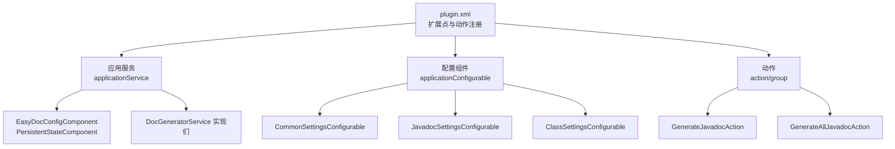
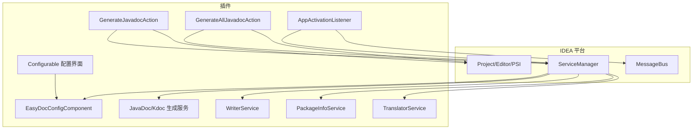
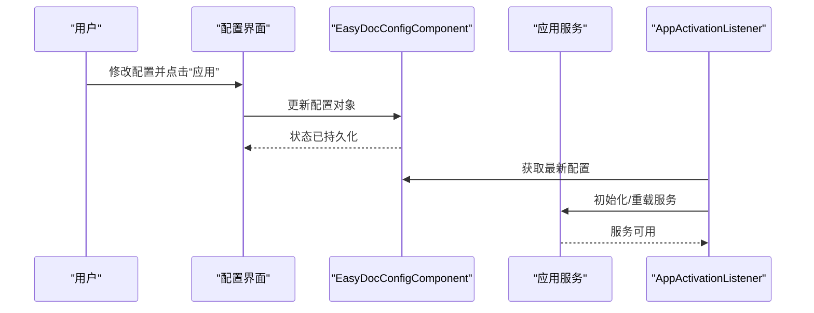
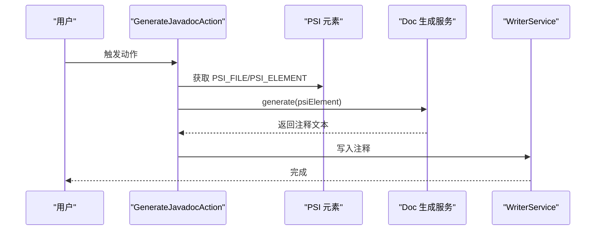
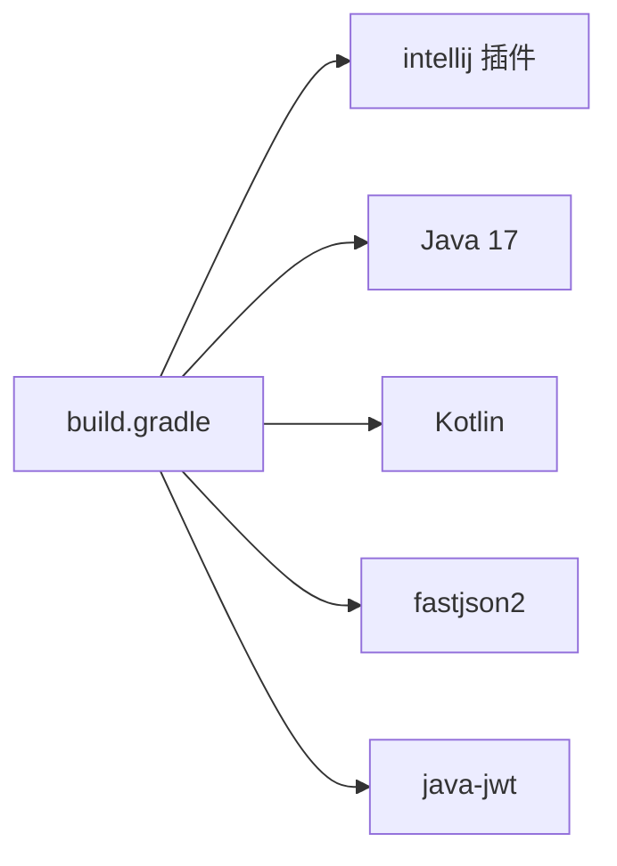

# 平台集成机制

<cite>
**本文引用的文件**
- [plugin.xml](file://src/main/resources/META-INF/plugin.xml)
- [EasyDocConfigComponent.java](file://src/main/java/com/star/easydoc/config/EasyDocConfigComponent.java)
- [EasyDocConfig.java](file://src/main/java/com/star/easydoc/config/EasyDocConfig.java)
- [AppActivationListener.java](file://src/main/java/com/star/easydoc/listener/AppActivationListener.java)
- [GenerateJavadocAction.java](file://src/main/java/com/star/easydoc/action/GenerateJavadocAction.java)
- [GenerateAllJavadocAction.java](file://src/main/java/com/star/easydoc/action/GenerateAllJavadocAction.java)
- [CommonSettingsConfigurable.java](file://src/main/java/com/star/easydoc/view/settings/CommonSettingsConfigurable.java)
- [JavadocSettingsConfigurable.java](file://src/main/java/com/star/easydoc/view/settings/javadoc/JavadocSettingsConfigurable.java)
- [ClassSettingsConfigurable.java](file://src/main/java/com/star/easydoc/view/settings/javadoc/template/ClassSettingsConfigurable.java)
- [DocGeneratorService.java](file://src/main/java/com/star/easydoc/service/DocGeneratorService.java)
- [build.gradle](file://build.gradle)
- [settings.gradle](file://settings.gradle)
- [README.md](file://README.md)
</cite>

## 目录
1. [简介](#简介)
2. [项目结构](#项目结构)
3. [核心组件](#核心组件)
4. [架构总览](#架构总览)
5. [详细组件分析](#详细组件分析)
6. [依赖分析](#依赖分析)
7. [性能考量](#性能考量)
8. [故障排查指南](#故障排查指南)
9. [结论](#结论)
10. [附录](#附录)

## 简介
本文件面向 Easy Javadoc 插件的平台集成机制，系统性阐述插件与 IntelliJ IDEA 平台的集成方式与技术实现，涵盖扩展点注册、服务接口设计、PSI API 集成、配置组件生命周期与状态同步、以及最佳实践与注意事项。目标读者既包括需要快速上手的开发者，也包括希望深入理解插件与 IDE 平台交互原理的高级用户。

## 项目结构
插件采用标准的 IntelliJ 平台插件目录组织方式，核心入口为 plugin.xml，扩展点与动作在此注册；配置持久化通过 PersistentStateComponent 实现；业务服务通过 ServiceManager 注册为应用级服务；UI 配置通过 Configurable 组件接入 Settings；动作处理器通过继承 AnAction 实现，并在 plugin.xml 中声明。

图表来源
- [plugin.xml:27-53](file://src/main/resources/META-INF/plugin.xml#L27-L53)
- [plugin.xml:55-78](file://src/main/resources/META-INF/plugin.xml#L55-L78)

章节来源
- [plugin.xml:1-82](file://src/main/resources/META-INF/plugin.xml#L1-L82)
- [build.gradle:1-78](file://build.gradle#L1-L78)
- [settings.gradle:1-3](file://settings.gradle#L1-L3)

## 核心组件
- 扩展点与动作
  - 在 plugin.xml 中通过 extensions/defaultExtensionNs 与 actions 节点注册应用级服务与配置项，并定义工具菜单组与具体动作。
- 应用服务
  - 通过 applicationService 节点注册多个服务实现，包括文档生成、写入、包信息、翻译、GPT 等，作为全局可注入的服务。
- 配置组件
  - 通过 applicationConfigurable 节点注册通用设置、Javadoc 设置及模板设置，形成层级化的配置树。
- 动作处理器
  - 通过 action 节点注册工具菜单组与具体动作，绑定快捷键与分组，实现用户触发的自动化流程。

章节来源
- [plugin.xml:27-53](file://src/main/resources/META-INF/plugin.xml#L27-L53)
- [plugin.xml:55-78](file://src/main/resources/META-INF/plugin.xml#L55-L78)

## 架构总览
插件整体架构围绕“扩展点注册 + 服务注入 + PSI 操作 + 配置驱动”的模式展开。用户通过工具菜单或快捷键触发动作，动作从 ServiceManager 获取应用级服务，结合 EasyJavadoc 的配置，调用 PSI API 获取与修改代码元素，最终通过 WriterService 写入注释。

图表来源
- [plugin.xml:27-53](file://src/main/resources/META-INF/plugin.xml#L27-L53)
- [plugin.xml:55-78](file://src/main/resources/META-INF/plugin.xml#L55-L78)
- [GenerateJavadocAction.java:46-69](file://src/main/java/com/star/easydoc/action/GenerateJavadocAction.java#L46-L69)
- [GenerateAllJavadocAction.java:47-58](file://src/main/java/com/star/easydoc/action/GenerateAllJavadocAction.java#L47-L58)
- [AppActivationListener.java:28-57](file://src/main/java/com/star/easydoc/listener/AppActivationListener.java#L28-L57)

## 详细组件分析

### 扩展点注册机制
- 应用级服务
  - 在 plugin.xml 的 extensions 节点下，通过 applicationService 注册多个服务实现，这些服务由 ServiceManager 管理，可在任意组件中按类型注入使用。
- 配置组件
  - 通过 applicationConfigurable 注册通用设置、Javadoc 设置与模板设置，形成父子层级关系，便于在 IDE 设置页中导航与管理。
- 动作
  - 在 actions 节点下定义工具菜单组与具体动作，绑定快捷键与分组，实现用户触发的自动化流程。

章节来源
- [plugin.xml:27-53](file://src/main/resources/META-INF/plugin.xml#L27-L53)
- [plugin.xml:55-78](file://src/main/resources/META-INF/plugin.xml#L55-L78)

### 服务接口设计：ApplicationService 与 ProjectService
- 应用级服务（ApplicationService）
  - 通过 applicationService 注册的应用服务，生命周期与 IDE 应用进程一致，适合跨项目共享的状态与能力，如翻译服务、GPT 服务、模板变量解析服务、写入服务、包信息服务等。
- 项目级服务（ProjectService）
  - 本插件未显式在 plugin.xml 中注册项目级服务。若需项目级能力，通常通过 Project 组件或 ProjectManager 获取项目上下文，结合应用级服务完成逻辑。
- 注入与使用
  - 在动作或监听器中通过 ServiceManager.getService(服务类型) 获取实例，避免手动管理生命周期。

章节来源
- [plugin.xml:27-53](file://src/main/resources/META-INF/plugin.xml#L27-L53)
- [GenerateJavadocAction.java:48-53](file://src/main/java/com/star/easydoc/action/GenerateJavadocAction.java#L48-L53)
- [GenerateAllJavadocAction.java:52-57](file://src/main/java/com/star/easydoc/action/GenerateAllJavadocAction.java#L52-L57)

### 配置组件生命周期与状态同步
- 配置持久化
  - EasyDocConfigComponent 实现 PersistentStateComponent，通过 @State 注解指定存储文件名，首次访问时初始化默认配置，加载时通过 XmlSerializerUtil 合并状态。
- 配置读取与更新
  - 在动作与配置界面中通过 ServiceManager.getService(EasyDocConfigComponent.class).getState() 获取当前配置快照，随后在配置界面 apply 时更新配置对象。
- 状态同步
  - 配置变更后，应用层服务（如翻译服务、GPT 服务）在 AppActivationListener 中被初始化并读取最新配置，确保后续生成流程使用最新设置。

图表来源
- [EasyDocConfigComponent.java:19-68](file://src/main/java/com/star/easydoc/config/EasyDocConfigComponent.java#L19-L68)
- [CommonSettingsConfigurable.java:95-189](file://src/main/java/com/star/easydoc/view/settings/CommonSettingsConfigurable.java#L95-L189)
- [AppActivationListener.java:106-113](file://src/main/java/com/star/easydoc/listener/AppActivationListener.java#L106-L113)

章节来源
- [EasyDocConfigComponent.java:19-68](file://src/main/java/com/star/easydoc/config/EasyDocConfigComponent.java#L19-L68)
- [CommonSettingsConfigurable.java:25-195](file://src/main/java/com/star/easydoc/view/settings/CommonSettingsConfigurable.java#L25-L195)
- [AppActivationListener.java:28-113](file://src/main/java/com/star/easydoc/listener/AppActivationListener.java#L28-L113)

### PSI API 集成应用
- 获取与操作代码元素
  - 动作处理器通过 AnActionEvent 获取 Project、Editor、PSI_FILE、PSI_ELEMENT 等上下文，根据文件类型（Java/Kotlin）分别调用对应的生成服务。
  - 对于 Java 文件，使用 PsiElementFactory 创建文档注释，再通过 WriterService 写入；对于 Kotlin 文件，使用 KtPsiFactory 创建 KDoc 注释并写入。
- 包信息处理
  - 当选中目录或 package-info.java 文件时，通过 PackageInfoService 处理包注释生成与写入。
- 选中文本翻译
  - 若编辑器中存在选中文本，根据文本内容是否为中文决定中英互译或自动翻译结果展示。

图表来源
- [GenerateJavadocAction.java:72-115](file://src/main/java/com/star/easydoc/action/GenerateJavadocAction.java#L72-L115)
- [GenerateJavadocAction.java:124-154](file://src/main/java/com/star/easydoc/action/GenerateJavadocAction.java#L124-L154)
- [GenerateJavadocAction.java:163-173](file://src/main/java/com/star/easydoc/action/GenerateJavadocAction.java#L163-L173)

章节来源
- [GenerateJavadocAction.java:46-175](file://src/main/java/com/star/easydoc/action/GenerateJavadocAction.java#L46-L175)
- [GenerateAllJavadocAction.java:47-218](file://src/main/java/com/star/easydoc/action/GenerateAllJavadocAction.java#L47-L218)

### 配置组件的生命周期管理
- 生命周期
  - 配置组件在 IDE 启动时由平台加载，PersistentStateComponent 在首次访问时初始化默认值，随后从 XML 恢复状态。
- 界面交互
  - Configurable 实现负责 UI 组件与配置对象之间的双向绑定，提供 isModified、apply、reset 等方法，确保用户在设置页的修改能够正确持久化。
- 状态同步
  - 配置变更后，应用层服务在 AppActivationListener 中被初始化，确保后续生成流程使用最新配置。

章节来源
- [EasyDocConfigComponent.java:19-68](file://src/main/java/com/star/easydoc/config/EasyDocConfigComponent.java#L19-L68)
- [CommonSettingsConfigurable.java:25-195](file://src/main/java/com/star/easydoc/view/settings/CommonSettingsConfigurable.java#L25-L195)
- [JavadocSettingsConfigurable.java:19-94](file://src/main/java/com/star/easydoc/view/settings/javadoc/JavadocSettingsConfigurable.java#L19-L94)
- [ClassSettingsConfigurable.java:20-77](file://src/main/java/com/star/easydoc/view/settings/javadoc/template/ClassSettingsConfigurable.java#L20-L77)

### 服务接口设计与实现
- DocGeneratorService 接口
  - 统一的文档生成入口，接收 PSI 元素并返回注释文本，JavaDoc/Kdoc 生成服务实现该接口。
- 应用服务注册
  - 在 plugin.xml 中注册多个应用服务，包括 JavaDoc/Kdoc 生成服务、写入服务、包信息服务、翻译服务、GPT 服务等，供动作与监听器按需注入。

章节来源
- [DocGeneratorService.java:11-20](file://src/main/java/com/star/easydoc/service/DocGeneratorService.java#L11-L20)
- [plugin.xml:27-53](file://src/main/resources/META-INF/plugin.xml#L27-L53)

### 监听器与激活时机
- AppActivationListener
  - 监听 IDE 应用激活事件，在首次激活时弹出支持通知并初始化翻译与 GPT 服务，确保服务可用且配置已加载。

章节来源
- [AppActivationListener.java:28-119](file://src/main/java/com/star/easydoc/listener/AppActivationListener.java#L28-L119)

## 依赖分析
- 构建与运行环境
  - Gradle 配置使用 intellij 插件，目标平台版本为 2023.1，模块包含 Kotlin 与 Java；Java/Kotlin 编译版本为 17。
- 运行时依赖
  - 通过 Gradle 依赖引入 fastjson2 与 java-jwt 等库，用于 JSON 解析与 JWT 处理。

图表来源
- [build.gradle:51-61](file://build.gradle#L51-L61)

章节来源
- [build.gradle:1-78](file://build.gradle#L1-L78)
- [settings.gradle:1-3](file://settings.gradle#L1-L3)

## 性能考量
- 服务懒加载与初始化
  - 通过 AppActivationListener 在应用激活时初始化翻译与 GPT 服务，避免在插件加载阶段造成不必要的开销。
- 批量生成策略
  - 批量生成动作支持按类、方法、属性与内部类开关，建议在大规模项目中谨慎启用内部类递归，避免长时间阻塞 UI。
- 翻译与网络请求
  - 配置超时时间与选择合适的翻译服务，避免因网络波动影响生成体验。
- PSI 操作
  - 在动作中尽量减少 PSI 查询次数，合并必要的写入操作，降低磁盘与索引更新压力。

## 故障排查指南
- 快捷键不生效
  - 检查光标是否位于类、方法或属性上，而非选中文本或鼠标点击；确认快捷键与 IDE 冲突。
- 注释未生成或被覆盖
  - 检查覆盖模式与注释优先级设置；确认模板配置是否正确。
- 翻译失败或异常
  - 校验翻译服务配置（如密钥、区域、URL 占位符），确认超时时间合理。
- 配置未生效
  - 在设置页点击“应用”后确认配置已持久化；必要时重启 IDE 以确保服务重新初始化。

章节来源
- [README.md:71-84](file://README.md#L71-L84)
- [CommonSettingsConfigurable.java:117-189](file://src/main/java/com/star/easydoc/view/settings/CommonSettingsConfigurable.java#L117-L189)

## 结论
Easy Javadoc 插件通过标准的 IntelliJ 平台扩展点注册机制，将应用级服务、配置组件与动作处理器有机整合，借助 PSI API 实现对 Java/Kotlin 代码元素的注释生成与写入。配合 PersistentStateComponent 与 Configurable，实现了配置的持久化与 UI 同步；通过 AppActivationListener 确保服务在合适时机初始化。遵循本文的最佳实践与注意事项，可帮助开发者更高效地扩展与维护插件与 IDE 平台的交互。

## 附录
- 平台版本与模块依赖
  - 目标平台版本：2023.1
  - 模块：Java、Kotlin
- 常用配置项参考
  - 翻译服务与密钥配置、超时时间、模板与变量映射、覆盖模式等。

章节来源
- [build.gradle:51-56](file://build.gradle#L51-L56)
- [README.md:49-53](file://README.md#L49-L53)