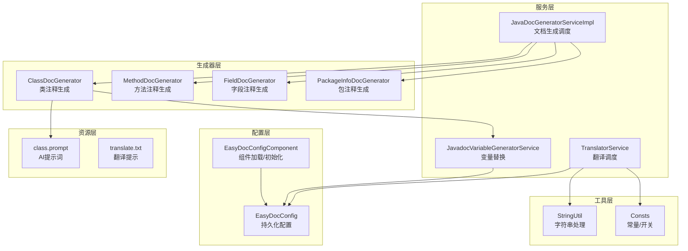
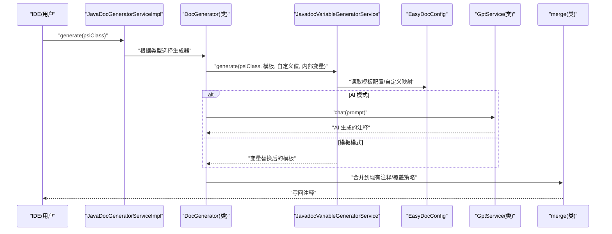
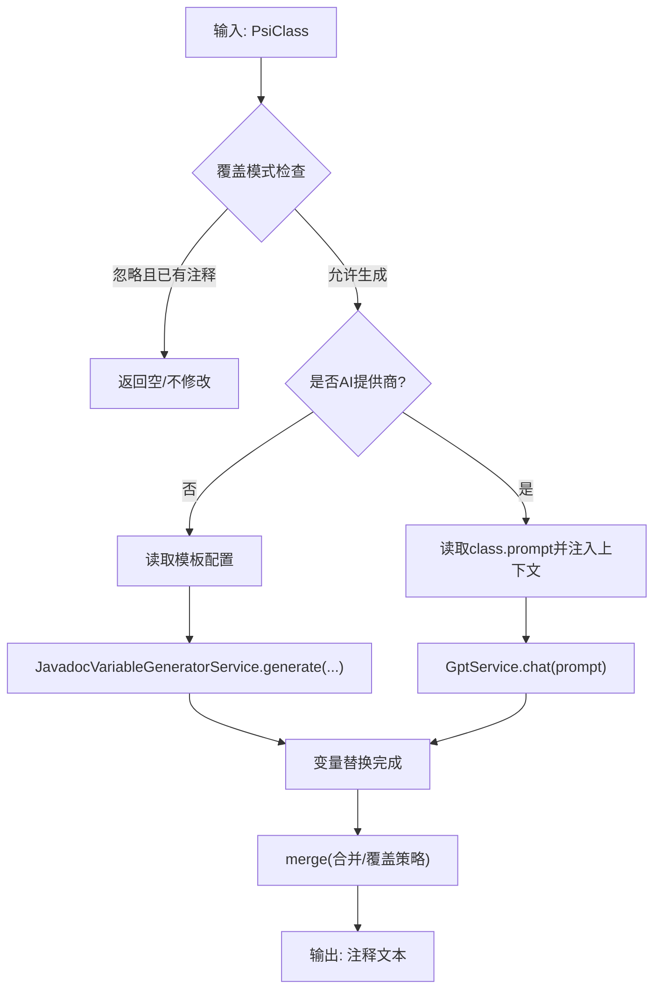
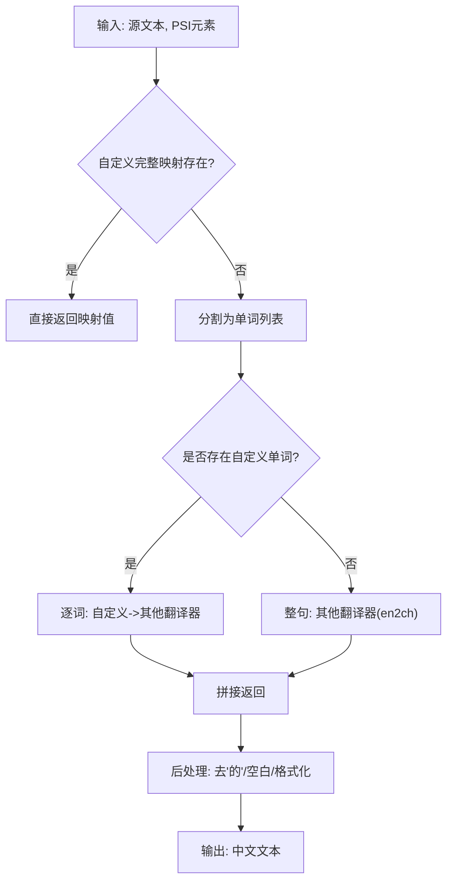
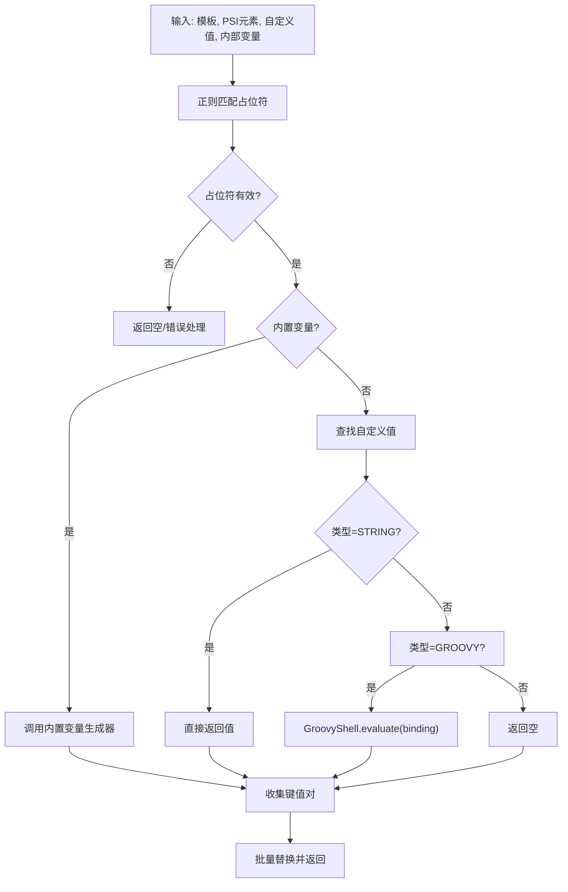
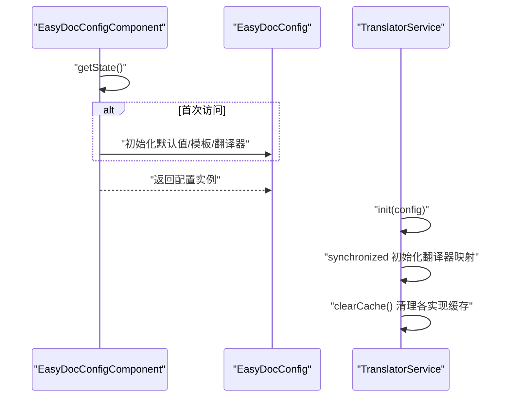
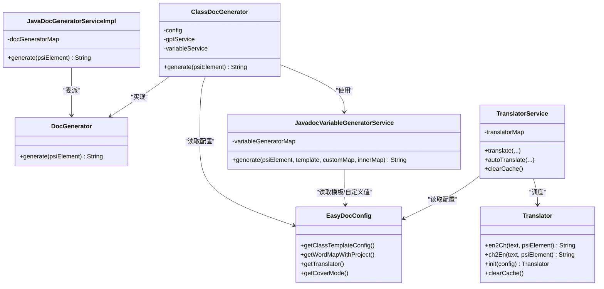

# 数据流设计

<cite>
**本文引用的文件**
- [EasyDocConfig.java](file://src/main/java/com/star/easydoc/config/EasyDocConfig.java)
- [EasyDocConfigComponent.java](file://src/main/java/com/star/easydoc/config/EasyDocConfigComponent.java)
- [JavaDocGeneratorServiceImpl.java](file://src/main/java/com/star/easydoc/javadoc/service/JavaDocGeneratorServiceImpl.java)
- [DocGenerator.java](file://src/main/java/com/star/easydoc/javadoc/service/generator/DocGenerator.java)
- [ClassDocGenerator.java](file://src/main/java/com/star/easydoc/javadoc/service/generator/impl/ClassDocGenerator.java)
- [JavadocVariableGeneratorService.java](file://src/main/java/com/star/easydoc/javadoc/service/variable/JavadocVariableGeneratorService.java)
- [VariableGenerator.java](file://src/main/java/com/star/easydoc/javadoc/service/variable/VariableGenerator.java)
- [TranslatorService.java](file://src/main/java/com/star/easydoc/service/translator/TranslatorService.java)
- [Translator.java](file://src/main/java/com/star/easydoc/service/translator/Translator.java)
- [AliyunTranslator.java](file://src/main/java/com/star/easydoc/service/translator/impl/AliyunTranslator.java)
- [StringUtil.java](file://src/main/java/com/star/easydoc/common/util/StringUtil.java)
- [Consts.java](file://src/main/java/com/star/easydoc/common/Consts.java)
- [class.prompt](file://src/main/resources/prompts/chatglm/class.prompt)
- [translate.txt](file://src/main/resources/prompts/translate.txt)
</cite>

## 目录
1. [引言](#引言)
2. [项目结构](#项目结构)
3. [核心组件](#核心组件)
4. [架构总览](#架构总览)
5. [详细组件分析](#详细组件分析)
6. [依赖分析](#依赖分析)
7. [性能考虑](#性能考虑)
8. [故障排查指南](#故障排查指南)
9. [结论](#结论)
10. [附录](#附录)

## 引言
本文件面向 Easy Javadoc 插件的开发者与维护者，系统性梳理插件内部“数据流”的设计与实现，重点覆盖以下方面：
- 文档生成的数据流：从 PSI 元素解析到模板渲染的完整链路
- 翻译服务的数据处理：翻译请求构建、API 调用、结果缓存与回退策略
- 变量替换的数据流：变量生成器工作原理与模板变量处理流程
- 缓存策略：翻译缓存与配置缓存的管理机制
- 通过数据流图与时序图帮助理解核心算法与数据处理逻辑

## 项目结构
插件采用按功能域分层的组织方式：
- 配置层：持久化配置与组件加载
- 服务层：文档生成、变量替换、翻译服务
- 生成器层：针对不同 PSI 元素（类、方法、字段、包）的文档生成器
- 工具层：字符串处理、HTTP 工具、常量定义
- 资源层：提示词模板与翻译提示

图表来源
- [EasyDocConfig.java:1-680](file://src/main/java/com/star/easydoc/config/EasyDocConfig.java#L1-L680)
- [EasyDocConfigComponent.java:1-69](file://src/main/java/com/star/easydoc/config/EasyDocConfigComponent.java#L1-L69)
- [JavaDocGeneratorServiceImpl.java:1-50](file://src/main/java/com/star/easydoc/javadoc/service/JavaDocGeneratorServiceImpl.java#L1-L50)
- [JavadocVariableGeneratorService.java:1-128](file://src/main/java/com/star/easydoc/javadoc/service/variable/JavadocVariableGeneratorService.java#L1-L128)
- [TranslatorService.java:1-238](file://src/main/java/com/star/easydoc/service/translator/TranslatorService.java#L1-L238)
- [ClassDocGenerator.java:1-116](file://src/main/java/com/star/easydoc/javadoc/service/generator/impl/ClassDocGenerator.java#L1-L116)
- [StringUtil.java:1-72](file://src/main/java/com/star/easydoc/common/util/StringUtil.java#L1-L72)
- [Consts.java:1-100](file://src/main/java/com/star/easydoc/common/Consts.java#L1-L100)
- [class.prompt:1-30](file://src/main/resources/prompts/chatglm/class.prompt#L1-L30)
- [translate.txt:1-2](file://src/main/resources/prompts/translate.txt#L1-L2)

章节来源
- [EasyDocConfig.java:1-680](file://src/main/java/com/star/easydoc/config/EasyDocConfig.java#L1-L680)
- [EasyDocConfigComponent.java:1-69](file://src/main/java/com/star/easydoc/config/EasyDocConfigComponent.java#L1-L69)
- [JavaDocGeneratorServiceImpl.java:1-50](file://src/main/java/com/star/easydoc/javadoc/service/JavaDocGeneratorServiceImpl.java#L1-L50)
- [JavadocVariableGeneratorService.java:1-128](file://src/main/java/com/star/easydoc/javadoc/service/variable/JavadocVariableGeneratorService.java#L1-L128)
- [TranslatorService.java:1-238](file://src/main/java/com/star/easydoc/service/translator/TranslatorService.java#L1-L238)
- [ClassDocGenerator.java:1-116](file://src/main/java/com/star/easydoc/javadoc/service/generator/impl/ClassDocGenerator.java#L1-L116)
- [StringUtil.java:1-72](file://src/main/java/com/star/easydoc/common/util/StringUtil.java#L1-L72)
- [Consts.java:1-100](file://src/main/java/com/star/easydoc/common/Consts.java#L1-L100)
- [class.prompt:1-30](file://src/main/resources/prompts/chatglm/class.prompt#L1-L30)
- [translate.txt:1-2](file://src/main/resources/prompts/translate.txt#L1-L2)

## 核心组件
- 配置中心：集中管理翻译提供商、模板、单词映射、覆盖策略、超时等
- 文档生成服务：根据 PSI 元素类型选择对应生成器，执行变量替换与合并
- 变量替换服务：解析模板占位符，调用内置或自定义变量生成器
- 翻译服务：统一调度各翻译实现，支持单词级与整句级翻译、自定义词典、AI 翻译
- 生成器实现：类、方法、字段、包注释的差异化生成策略与模板

章节来源
- [EasyDocConfig.java:1-680](file://src/main/java/com/star/easydoc/config/EasyDocConfig.java#L1-L680)
- [JavaDocGeneratorServiceImpl.java:1-50](file://src/main/java/com/star/easydoc/javadoc/service/JavaDocGeneratorServiceImpl.java#L1-L50)
- [JavadocVariableGeneratorService.java:1-128](file://src/main/java/com/star/easydoc/javadoc/service/variable/JavadocVariableGeneratorService.java#L1-L128)
- [TranslatorService.java:1-238](file://src/main/java/com/star/easydoc/service/translator/TranslatorService.java#L1-L238)

## 架构总览
下图展示从 PSI 元素到最终注释输出的端到端数据流。

图表来源
- [JavaDocGeneratorServiceImpl.java:35-48](file://src/main/java/com/star/easydoc/javadoc/service/JavaDocGeneratorServiceImpl.java#L35-L48)
- [ClassDocGenerator.java:44-68](file://src/main/java/com/star/easydoc/javadoc/service/generator/impl/ClassDocGenerator.java#L44-L68)
- [JavadocVariableGeneratorService.java:60-92](file://src/main/java/com/star/easydoc/javadoc/service/variable/JavadocVariableGeneratorService.java#L60-L92)
- [EasyDocConfig.java:146-160](file://src/main/java/com/star/easydoc/config/EasyDocConfig.java#L146-L160)

## 详细组件分析

### 文档生成数据流（类）
- 元素识别与策略选择：根据 PSI 类型映射到具体生成器
- 模板选择：若非默认模板则使用用户自定义模板
- 变量替换：解析占位符，调用内置变量生成器或自定义值（字符串/Groovy）
- 合并策略：依据覆盖模式决定是否跳过、合并或强制覆盖
- AI 生成：当使用 AI 提供商时，读取提示词模板，注入上下文后调用 GPT 服务

图表来源
- [ClassDocGenerator.java:44-93](file://src/main/java/com/star/easydoc/javadoc/service/generator/impl/ClassDocGenerator.java#L44-L93)
- [JavadocVariableGeneratorService.java:60-92](file://src/main/java/com/star/easydoc/javadoc/service/variable/JavadocVariableGeneratorService.java#L60-L92)
- [class.prompt:1-30](file://src/main/resources/prompts/chatglm/class.prompt#L1-L30)

章节来源
- [ClassDocGenerator.java:1-116](file://src/main/java/com/star/easydoc/javadoc/service/generator/impl/ClassDocGenerator.java#L1-L116)
- [JavadocVariableGeneratorService.java:1-128](file://src/main/java/com/star/easydoc/javadoc/service/variable/JavadocVariableGeneratorService.java#L1-L128)
- [class.prompt:1-30](file://src/main/resources/prompts/chatglm/class.prompt#L1-L30)

### 翻译服务数据流
- 初始化：按配置实例化多种翻译实现，形成名称到实现的映射
- 翻译入口：
  - 整句翻译：若无自定义单词，整句调用翻译器
  - 单词级翻译：若有自定义单词，逐词翻译并拼接
  - 自定义词典优先：优先从自定义映射返回
  - 类注释优先：当开启“注释优先”时，尝试从目标类注释提取
- 结果处理：去除多余字符、过滤停用词、中英互译的后处理
- 缓存清理：支持统一清理所有翻译实现的缓存

图表来源
- [TranslatorService.java:85-111](file://src/main/java/com/star/easydoc/service/translator/TranslatorService.java#L85-L111)
- [TranslatorService.java:213-232](file://src/main/java/com/star/easydoc/service/translator/TranslatorService.java#L213-L232)
- [StringUtil.java:40-45](file://src/main/java/com/star/easydoc/common/util/StringUtil.java#L40-L45)

章节来源
- [TranslatorService.java:1-238](file://src/main/java/com/star/easydoc/service/translator/TranslatorService.java#L1-L238)
- [Translator.java:1-54](file://src/main/java/com/star/easydoc/service/translator/Translator.java#L1-L54)
- [AliyunTranslator.java:1-283](file://src/main/java/com/star/easydoc/service/translator/impl/AliyunTranslator.java#L1-L283)
- [StringUtil.java:1-72](file://src/main/java/com/star/easydoc/common/util/StringUtil.java#L1-L72)

### 变量替换数据流
- 占位符匹配：使用正则匹配形如 $var$ 的占位符
- 变量解析：
  - 内置变量：author/date/doc/params/return/see/since/throws/version
  - 自定义变量：STRING 直接返回；GROOVY 通过 GroovyShell 执行绑定变量
- 替换执行：批量替换模板中的占位符，返回最终文本

图表来源
- [JavadocVariableGeneratorService.java:67-92](file://src/main/java/com/star/easydoc/javadoc/service/variable/JavadocVariableGeneratorService.java#L67-L92)
- [JavadocVariableGeneratorService.java:102-125](file://src/main/java/com/star/easydoc/javadoc/service/variable/JavadocVariableGeneratorService.java#L102-L125)

章节来源
- [JavadocVariableGeneratorService.java:1-128](file://src/main/java/com/star/easydoc/javadoc/service/variable/JavadocVariableGeneratorService.java#L1-L128)
- [VariableGenerator.java:1-28](file://src/main/java/com/star/easydoc/javadoc/service/variable/VariableGenerator.java#L1-L28)

### 缓存策略数据流
- 配置缓存：EasyDocConfigComponent 在首次访问时初始化默认配置，并持久化到 XML；后续 loadState 复制状态
- 翻译缓存：各 Translator 实现可自行维护缓存；TranslatorService 提供统一清理入口
- 运行期一致性：初始化阶段使用同步锁避免重复初始化

图表来源
- [EasyDocConfigComponent.java:29-66](file://src/main/java/com/star/easydoc/config/EasyDocConfigComponent.java#L29-L66)
- [TranslatorService.java:52-77](file://src/main/java/com/star/easydoc/service/translator/TranslatorService.java#L52-L77)
- [TranslatorService.java:234-237](file://src/main/java/com/star/easydoc/service/translator/TranslatorService.java#L234-L237)

章节来源
- [EasyDocConfigComponent.java:1-69](file://src/main/java/com/star/easydoc/config/EasyDocConfigComponent.java#L1-L69)
- [EasyDocConfig.java:1-680](file://src/main/java/com/star/easydoc/config/EasyDocConfig.java#L1-L680)
- [TranslatorService.java:1-238](file://src/main/java/com/star/easydoc/service/translator/TranslatorService.java#L1-L238)

## 依赖分析
- 低耦合高内聚：生成器通过 DocGenerator 接口解耦；变量生成器通过 VariableGenerator 接口解耦
- 配置驱动：所有行为由 EasyDocConfig 控制（模板、覆盖模式、翻译器、单词映射）
- 翻译器多态：Translator 接口抽象，具体实现封装各自 API 与签名逻辑
- 工具函数：StringUtil 提供单词拆分等基础能力，Consts 提供开关与集合常量

图表来源
- [JavaDocGeneratorServiceImpl.java:27-48](file://src/main/java/com/star/easydoc/javadoc/service/JavaDocGeneratorServiceImpl.java#L27-L48)
- [DocGenerator.java:11-19](file://src/main/java/com/star/easydoc/javadoc/service/generator/DocGenerator.java#L11-L19)
- [ClassDocGenerator.java:31-34](file://src/main/java/com/star/easydoc/javadoc/service/generator/impl/ClassDocGenerator.java#L31-L34)
- [JavadocVariableGeneratorService.java:42-52](file://src/main/java/com/star/easydoc/javadoc/service/variable/JavadocVariableGeneratorService.java#L42-L52)
- [TranslatorService.java:44-77](file://src/main/java/com/star/easydoc/service/translator/TranslatorService.java#L44-L77)
- [Translator.java:13-53](file://src/main/java/com/star/easydoc/service/translator/Translator.java#L13-L53)
- [EasyDocConfig.java:146-160](file://src/main/java/com/star/easydoc/config/EasyDocConfig.java#L146-L160)

章节来源
- [JavaDocGeneratorServiceImpl.java:1-50](file://src/main/java/com/star/easydoc/javadoc/service/JavaDocGeneratorServiceImpl.java#L1-L50)
- [JavadocVariableGeneratorService.java:1-128](file://src/main/java/com/star/easydoc/javadoc/service/variable/JavadocVariableGeneratorService.java#L1-L128)
- [TranslatorService.java:1-238](file://src/main/java/com/star/easydoc/service/translator/TranslatorService.java#L1-L238)
- [EasyDocConfig.java:1-680](file://src/main/java/com/star/easydoc/config/EasyDocConfig.java#L1-L680)

## 性能考虑
- 翻译路径优化：无自定义单词时整句翻译，减少 API 调用次数；有自定义单词时逐词翻译，保证术语一致性
- 缓存与并发：翻译器实现可按需缓存；全局缓存清理接口便于重置
- 模板变量批量化：一次性匹配与替换，避免多次字符串操作
- 配置懒加载：组件首次访问才初始化，降低启动开销

## 故障排查指南
- 翻译失败
  - 检查翻译器配置与密钥是否正确
  - 查看网络与超时设置
  - 使用“清除缓存”按钮重置缓存
- 变量替换异常
  - 检查自定义 Groovy 脚本语法与返回值
  - 确认占位符格式是否为 $name$
- 注释未生成
  - 检查覆盖模式与是否已有注释
  - 确认模板配置是否启用

章节来源
- [TranslatorService.java:234-237](file://src/main/java/com/star/easydoc/service/translator/TranslatorService.java#L234-L237)
- [JavadocVariableGeneratorService.java:115-121](file://src/main/java/com/star/easydoc/javadoc/service/variable/JavadocVariableGeneratorService.java#L115-L121)

## 结论
本设计以“配置驱动 + 接口抽象 + 模板化变量替换”为核心，实现了从 PSI 元素到注释文本的清晰数据流。翻译服务通过“整句/单词级”双路径与自定义词典提升准确性；变量替换服务支持内置与动态脚本扩展；缓存与配置管理确保运行期稳定性与可维护性。整体架构易于扩展新的生成器与翻译器实现。

## 附录
- 常量与开关：参考常量定义，快速定位可用翻译器与 AI 提供商集合
- 提示词模板：AI 生成时读取资源模板，注入作者、日期与代码片段

章节来源
- [Consts.java:1-100](file://src/main/java/com/star/easydoc/common/Consts.java#L1-L100)
- [class.prompt:1-30](file://src/main/resources/prompts/chatglm/class.prompt#L1-L30)
- [translate.txt:1-2](file://src/main/resources/prompts/translate.txt#L1-L2)