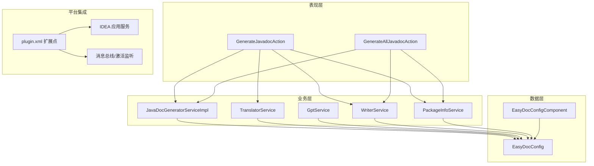
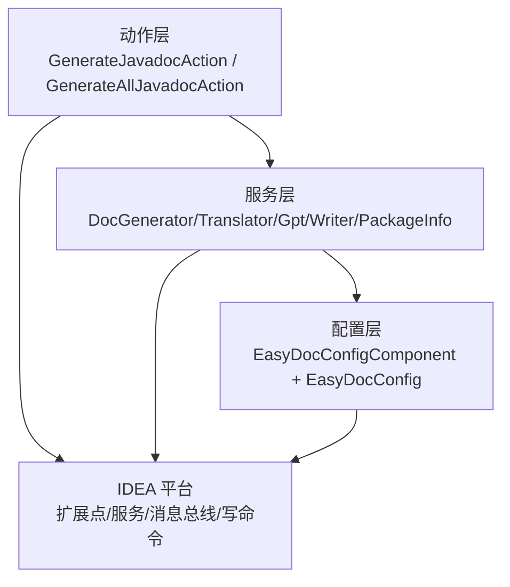
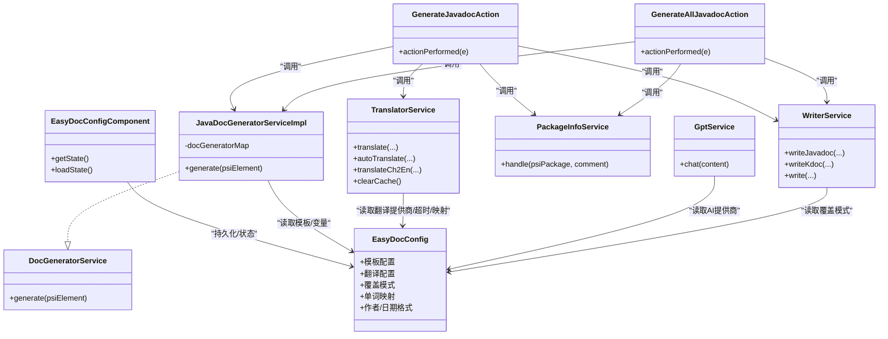
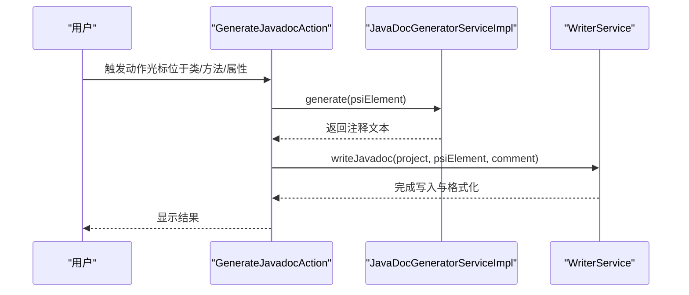
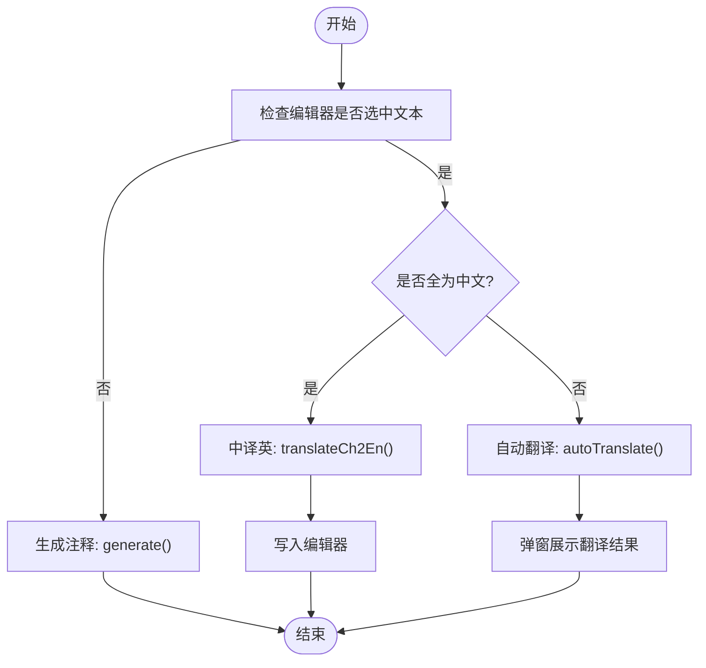
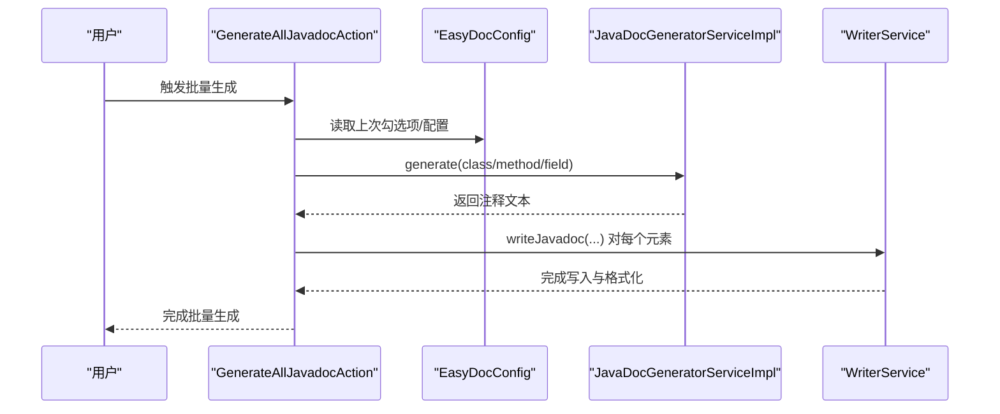
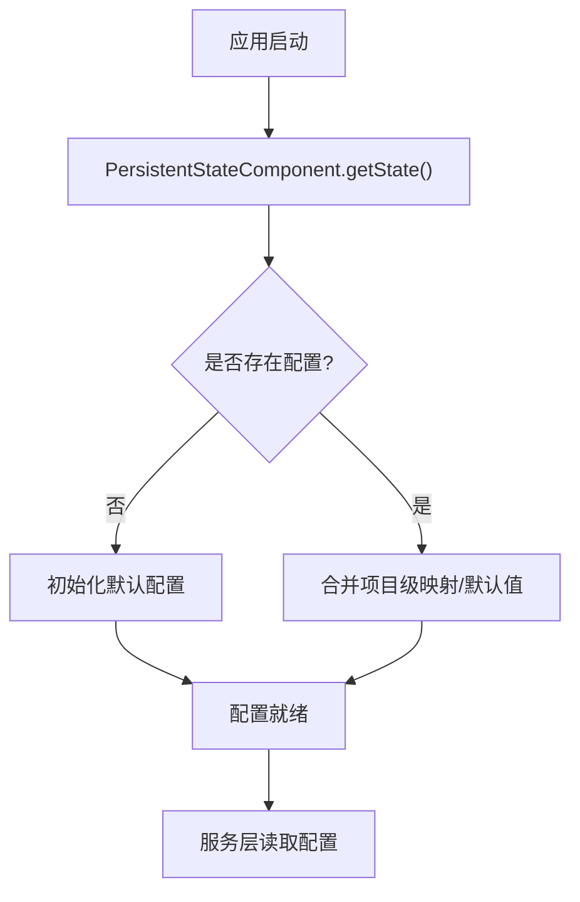
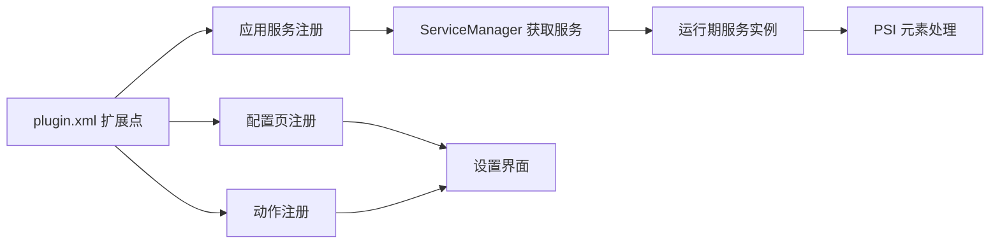

# 整体架构

<cite>
**本文引用的文件**
- [plugin.xml](file://src/main/resources/META-INF/plugin.xml)
- [build.gradle](file://build.gradle)
- [README.md](file://README.md)
- [Consts.java](file://src/main/java/com/star/easydoc/common/Consts.java)
- [EasyDocConfig.java](file://src/main/java/com/star/easydoc/config/EasyDocConfig.java)
- [EasyDocConfigComponent.java](file://src/main/java/com/star/easydoc/config/EasyDocConfigComponent.java)
- [DocGeneratorService.java](file://src/main/java/com/star/easydoc/service/DocGeneratorService.java)
- [JavaDocGeneratorServiceImpl.java](file://src/main/java/com/star/easydoc/javadoc/service/JavaDocGeneratorServiceImpl.java)
- [WriterService.java](file://src/main/java/com/star/easydoc/service/WriterService.java)
- [PackageInfoService.java](file://src/main/java/com/star/easydoc/service/PackageInfoService.java)
- [TranslatorService.java](file://src/main/java/com/star/easydoc/service/translator/TranslatorService.java)
- [GptService.java](file://src/main/java/com/star/easydoc/service/gpt/GptService.java)
- [GenerateJavadocAction.java](file://src/main/java/com/star/easydoc/action/GenerateJavadocAction.java)
- [GenerateAllJavadocAction.java](file://src/main/java/com/star/easydoc/action/GenerateAllJavadocAction.java)
</cite>

## 目录
1. [简介](#简介)
2. [项目结构](#项目结构)
3. [核心组件](#核心组件)
4. [架构总览](#架构总览)
5. [详细组件分析](#详细组件分析)
6. [依赖分析](#依赖分析)
7. [性能考量](#性能考量)
8. [故障排查指南](#故障排查指南)
9. [结论](#结论)
10. [附录](#附录)

## 简介
本文件面向 Easy Javadoc 插件的整体架构文档，围绕 IntelliJ IDEA 插件的分层设计与模块化组织展开，重点说明表现层（UI/动作）、业务层（服务/策略）、数据层（配置持久化）的职责划分与交互关系；同时阐述与 IDE 平台的集成方式（扩展点注册、服务接口设计、生命周期管理），并提供架构图与流程图帮助开发者快速理解插件的技术架构。

## 项目结构
插件采用按功能域分层的模块化组织方式：
- 表现层：动作（Actions）负责响应用户触发，调用服务层完成具体任务，并通过写入服务落盘。
- 业务层：服务层封装生成、翻译、GPT、模板变量等能力，面向 PSI 元素进行文档生成与注释写入。
- 数据层：配置组件负责持久化与加载用户配置，提供全局可用的配置状态。
- 平台集成：通过 plugin.xml 注册扩展点（应用服务、配置页、动作），并与 IDE 生命周期、消息总线、写命令等机制协作。

**图表来源**
- [plugin.xml:27-53](file://src/main/resources/META-INF/plugin.xml#L27-L53)
- [GenerateJavadocAction.java:46-175](file://src/main/java/com/star/easydoc/action/GenerateJavadocAction.java#L46-L175)
- [GenerateAllJavadocAction.java:47-218](file://src/main/java/com/star/easydoc/action/GenerateAllJavadocAction.java#L47-L218)
- [JavaDocGeneratorServiceImpl.java:25-49](file://src/main/java/com/star/easydoc/javadoc/service/JavaDocGeneratorServiceImpl.java#L25-L49)
- [TranslatorService.java:41-238](file://src/main/java/com/star/easydoc/service/translator/TranslatorService.java#L41-L238)
- [GptService.java:16-57](file://src/main/java/com/star/easydoc/service/gpt/GptService.java#L16-L57)
- [WriterService.java:25-139](file://src/main/java/com/star/easydoc/service/WriterService.java#L25-L139)
- [PackageInfoService.java:22-90](file://src/main/java/com/star/easydoc/service/PackageInfoService.java#L22-L90)
- [EasyDocConfigComponent.java:20-69](file://src/main/java/com/star/easydoc/config/EasyDocConfigComponent.java#L20-L69)
- [EasyDocConfig.java:22-680](file://src/main/java/com/star/easydoc/config/EasyDocConfig.java#L22-L680)

**章节来源**
- [plugin.xml:27-53](file://src/main/resources/META-INF/plugin.xml#L27-L53)
- [build.gradle:51-56](file://build.gradle#L51-L56)

## 核心组件
- 配置层
  - EasyDocConfig：集中定义各类配置项（作者、日期格式、模板、覆盖模式、翻译提供商、超时、单词映射、项目级映射等），并提供模板配置与变量类型枚举。
  - EasyDocConfigComponent：基于 PersistentStateComponent 的持久化组件，负责初始化默认配置、加载/保存状态。
- 服务层
  - DocGeneratorService：文档生成服务接口，统一生成入口。
  - JavaDocGeneratorServiceImpl：根据 PSI 元素类型路由到对应 DocGenerator 实现（类、方法、属性、包信息）。
  - WriterService：负责在 IDE 中安全地写入 Javadoc/KDoc 注释并格式化。
  - PackageInfoService：处理 package-info.java 的创建与注释注入。
  - TranslatorService：翻译服务聚合器，支持多家翻译与本地词典、自定义接口、AI 等多种策略。
  - GptService：AI 提供商适配器（当前接入智谱清言）。
- 动作层
  - GenerateJavadocAction：处理单个元素的注释生成、选中文本的自动翻译/中译英、目录/包信息生成。
  - GenerateAllJavadocAction：处理批量生成（类、方法、属性、内部类），并支持包描述生成。

**章节来源**
- [EasyDocConfig.java:22-680](file://src/main/java/com/star/easydoc/config/EasyDocConfig.java#L22-L680)
- [EasyDocConfigComponent.java:20-69](file://src/main/java/com/star/easydoc/config/EasyDocConfigComponent.java#L20-L69)
- [DocGeneratorService.java:11-21](file://src/main/java/com/star/easydoc/service/DocGeneratorService.java#L11-L21)
- [JavaDocGeneratorServiceImpl.java:25-49](file://src/main/java/com/star/easydoc/javadoc/service/JavaDocGeneratorServiceImpl.java#L25-L49)
- [WriterService.java:25-139](file://src/main/java/com/star/easydoc/service/WriterService.java#L25-L139)
- [PackageInfoService.java:22-90](file://src/main/java/com/star/easydoc/service/PackageInfoService.java#L22-L90)
- [TranslatorService.java:41-238](file://src/main/java/com/star/easydoc/service/translator/TranslatorService.java#L41-L238)
- [GptService.java:16-57](file://src/main/java/com/star/easydoc/service/gpt/GptService.java#L16-L57)
- [GenerateJavadocAction.java:46-175](file://src/main/java/com/star/easydoc/action/GenerateJavadocAction.java#L46-L175)
- [GenerateAllJavadocAction.java:47-218](file://src/main/java/com/star/easydoc/action/GenerateAllJavadocAction.java#L47-L218)

## 架构总览
插件遵循“表现层-业务层-数据层”的分层架构，配合 IDEA 扩展点实现模块解耦与平台集成：
- 表现层：通过 Actions 接收用户输入，调用服务层生成文档或翻译文本。
- 业务层：以服务为中心，封装生成、翻译、AI、写入等能力，面向 PSI 元素与配置进行处理。
- 数据层：通过 PersistentStateComponent 持久化配置，提供全局可读取的状态。
- 平台集成：在 plugin.xml 中注册应用服务、配置页、动作；利用 IDEA 的消息总线、写命令、编辑器 API 等能力。

**图表来源**
- [plugin.xml:27-53](file://src/main/resources/META-INF/plugin.xml#L27-L53)
- [GenerateJavadocAction.java:46-175](file://src/main/java/com/star/easydoc/action/GenerateJavadocAction.java#L46-L175)
- [GenerateAllJavadocAction.java:47-218](file://src/main/java/com/star/easydoc/action/GenerateAllJavadocAction.java#L47-L218)
- [JavaDocGeneratorServiceImpl.java:25-49](file://src/main/java/com/star/easydoc/javadoc/service/JavaDocGeneratorServiceImpl.java#L25-L49)
- [TranslatorService.java:41-238](file://src/main/java/com/star/easydoc/service/translator/TranslatorService.java#L41-L238)
- [GptService.java:16-57](file://src/main/java/com/star/easydoc/service/gpt/GptService.java#L16-L57)
- [WriterService.java:25-139](file://src/main/java/com/star/easydoc/service/WriterService.java#L25-L139)
- [PackageInfoService.java:22-90](file://src/main/java/com/star/easydoc/service/PackageInfoService.java#L22-L90)
- [EasyDocConfigComponent.java:20-69](file://src/main/java/com/star/easydoc/config/EasyDocConfigComponent.java#L20-L69)

## 详细组件分析

### 组件关系与依赖图

**图表来源**
- [EasyDocConfig.java:22-680](file://src/main/java/com/star/easydoc/config/EasyDocConfig.java#L22-L680)
- [EasyDocConfigComponent.java:20-69](file://src/main/java/com/star/easydoc/config/EasyDocConfigComponent.java#L20-L69)
- [DocGeneratorService.java:11-21](file://src/main/java/com/star/easydoc/service/DocGeneratorService.java#L11-L21)
- [JavaDocGeneratorServiceImpl.java:25-49](file://src/main/java/com/star/easydoc/javadoc/service/JavaDocGeneratorServiceImpl.java#L25-L49)
- [WriterService.java:25-139](file://src/main/java/com/star/easydoc/service/WriterService.java#L25-L139)
- [PackageInfoService.java:22-90](file://src/main/java/com/star/easydoc/service/PackageInfoService.java#L22-L90)
- [TranslatorService.java:41-238](file://src/main/java/com/star/easydoc/service/translator/TranslatorService.java#L41-L238)
- [GptService.java:16-57](file://src/main/java/com/star/easydoc/service/gpt/GptService.java#L16-L57)
- [GenerateJavadocAction.java:46-175](file://src/main/java/com/star/easydoc/action/GenerateJavadocAction.java#L46-L175)
- [GenerateAllJavadocAction.java:47-218](file://src/main/java/com/star/easydoc/action/GenerateAllJavadocAction.java#L47-L218)

**章节来源**
- [Consts.java:14-100](file://src/main/java/com/star/easydoc/common/Consts.java#L14-L100)
- [EasyDocConfig.java:22-680](file://src/main/java/com/star/easydoc/config/EasyDocConfig.java#L22-L680)
- [EasyDocConfigComponent.java:20-69](file://src/main/java/com/star/easydoc/config/EasyDocConfigComponent.java#L20-L69)
- [DocGeneratorService.java:11-21](file://src/main/java/com/star/easydoc/service/DocGeneratorService.java#L11-L21)
- [JavaDocGeneratorServiceImpl.java:25-49](file://src/main/java/com/star/easydoc/javadoc/service/JavaDocGeneratorServiceImpl.java#L25-L49)
- [WriterService.java:25-139](file://src/main/java/com/star/easydoc/service/WriterService.java#L25-L139)
- [PackageInfoService.java:22-90](file://src/main/java/com/star/easydoc/service/PackageInfoService.java#L22-L90)
- [TranslatorService.java:41-238](file://src/main/java/com/star/easydoc/service/translator/TranslatorService.java#L41-L238)
- [GptService.java:16-57](file://src/main/java/com/star/easydoc/service/gpt/GptService.java#L16-L57)
- [GenerateJavadocAction.java:46-175](file://src/main/java/com/star/easydoc/action/GenerateJavadocAction.java#L46-L175)
- [GenerateAllJavadocAction.java:47-218](file://src/main/java/com/star/easydoc/action/GenerateAllJavadocAction.java#L47-L218)

### 文档生成流程（单元素）

**图表来源**
- [GenerateJavadocAction.java:72-154](file://src/main/java/com/star/easydoc/action/GenerateJavadocAction.java#L72-L154)
- [JavaDocGeneratorServiceImpl.java:35-48](file://src/main/java/com/star/easydoc/javadoc/service/JavaDocGeneratorServiceImpl.java#L35-L48)
- [WriterService.java:36-75](file://src/main/java/com/star/easydoc/service/WriterService.java#L36-L75)

**章节来源**
- [GenerateJavadocAction.java:72-154](file://src/main/java/com/star/easydoc/action/GenerateJavadocAction.java#L72-L154)
- [JavaDocGeneratorServiceImpl.java:35-48](file://src/main/java/com/star/easydoc/javadoc/service/JavaDocGeneratorServiceImpl.java#L35-L48)
- [WriterService.java:36-75](file://src/main/java/com/star/easydoc/service/WriterService.java#L36-L75)

### 翻译与中译英流程

**图表来源**
- [GenerateJavadocAction.java:81-103](file://src/main/java/com/star/easydoc/action/GenerateJavadocAction.java#L81-L103)
- [TranslatorService.java:157-205](file://src/main/java/com/star/easydoc/service/translator/TranslatorService.java#L157-L205)

**章节来源**
- [GenerateJavadocAction.java:81-103](file://src/main/java/com/star/easydoc/action/GenerateJavadocAction.java#L81-L103)
- [TranslatorService.java:157-205](file://src/main/java/com/star/easydoc/service/translator/TranslatorService.java#L157-L205)

### 批量生成流程（类/方法/属性/内部类）

**图表来源**
- [GenerateAllJavadocAction.java:60-136](file://src/main/java/com/star/easydoc/action/GenerateAllJavadocAction.java#L60-L136)
- [JavaDocGeneratorServiceImpl.java:35-48](file://src/main/java/com/star/easydoc/javadoc/service/JavaDocGeneratorServiceImpl.java#L35-L48)
- [WriterService.java:36-75](file://src/main/java/com/star/easydoc/service/WriterService.java#L36-L75)

**章节来源**
- [GenerateAllJavadocAction.java:60-136](file://src/main/java/com/star/easydoc/action/GenerateAllJavadocAction.java#L60-L136)
- [WriterService.java:36-75](file://src/main/java/com/star/easydoc/service/WriterService.java#L36-L75)

### 配置持久化与加载

**图表来源**
- [EasyDocConfigComponent.java:30-66](file://src/main/java/com/star/easydoc/config/EasyDocConfigComponent.java#L30-L66)
- [EasyDocConfig.java:201-206](file://src/main/java/com/star/easydoc/config/EasyDocConfig.java#L201-L206)

**章节来源**
- [EasyDocConfigComponent.java:30-66](file://src/main/java/com/star/easydoc/config/EasyDocConfigComponent.java#L30-L66)
- [EasyDocConfig.java:201-206](file://src/main/java/com/star/easydoc/config/EasyDocConfig.java#L201-L206)

## 依赖分析
- 扩展点注册
  - 在 plugin.xml 中注册应用服务（配置、生成器、写入、翻译、变量生成、GPT 等），使服务可在应用范围内通过 ServiceManager 获取。
  - 注册配置页（通用、Javadoc、KDoc 模板），形成统一的设置入口。
  - 注册动作（工具菜单组、Java 生成组），绑定快捷键与图标。
- 服务接口设计
  - DocGeneratorService 抽象文档生成入口，便于扩展不同语言（JavaDoc/KDoc）与不同元素类型。
  - TranslatorService/GptService 采用策略聚合，支持多种翻译/AI 提供商，便于替换与扩展。
- 生命周期管理
  - 通过 PersistentStateComponent 实现配置的持久化与加载。
  - 通过消息总线订阅应用激活事件，确保运行期状态正确初始化。

**图表来源**
- [plugin.xml:27-53](file://src/main/resources/META-INF/plugin.xml#L27-L53)
- [plugin.xml:55-78](file://src/main/resources/META-INF/plugin.xml#L55-L78)

**章节来源**
- [plugin.xml:27-53](file://src/main/resources/META-INF/plugin.xml#L27-L53)
- [plugin.xml:55-78](file://src/main/resources/META-INF/plugin.xml#L55-L78)

## 性能考量
- 翻译策略
  - 优先整句翻译以提升准确性，当存在自定义单词映射时逐词翻译，兼顾灵活性与性能。
  - 提供超时配置与缓存清理能力，避免频繁请求影响体验。
- 写入与格式化
  - 使用写命令（WriteCommandAction）保证线程安全与一致性。
  - 利用 CodeStyleManager 进行注释格式化，减少手动调整成本。
- 批量生成
  - 逐元素生成与写入，避免一次性大量 I/O；可考虑在上层引入并发策略以进一步提升吞吐（当前实现为顺序处理）。

[本节为通用指导，无需特定文件引用]

## 故障排查指南
- 快捷键无效
  - 确认光标位于类名/方法名/属性名上，而非选中文本或鼠标点击。
  - 检查 IDEA 快捷键设置是否存在冲突。
- 注释未覆盖/合并行为不符合预期
  - 检查覆盖模式（忽略/智能合并/强制覆盖）与模板配置。
- 翻译结果不理想
  - 为关键术语建立单词映射，优先使用整句翻译；必要时切换翻译提供商。
  - 清理翻译缓存后重试。
- 包信息未生成
  - 确认目录下是否存在 package-info.java，若无将自动生成；若存在将注入注释块。

**章节来源**
- [README.md:77-84](file://README.md#L77-L84)
- [EasyDocConfig.java:41-44](file://src/main/java/com/star/easydoc/config/EasyDocConfig.java#L41-L44)
- [TranslatorService.java:234-236](file://src/main/java/com/star/easydoc/service/translator/TranslatorService.java#L234-L236)

## 结论
本插件通过清晰的分层架构与模块化设计，实现了对 Java/Kotlin 文档注释的高效生成与翻译能力。借助 IDEA 扩展点与服务接口，插件在保持良好可维护性的同时，具备较强的可扩展性与平台兼容性。建议后续在批量生成场景引入并发策略，并持续完善模板与变量系统的易用性。

[本节为总结性内容，无需特定文件引用]

## 附录
- 平台与版本
  - 支持 IDEA 2019.1 及以上，Kotlin 与 Java 模块为必需依赖。
- 插件构建
  - 使用 Gradle 与 JetBrains IntelliJ 插件开发工具链，目标版本为 2023.1。

**章节来源**
- [build.gradle:51-56](file://build.gradle#L51-L56)
- [README.md:6-7](file://README.md#L6-L7)