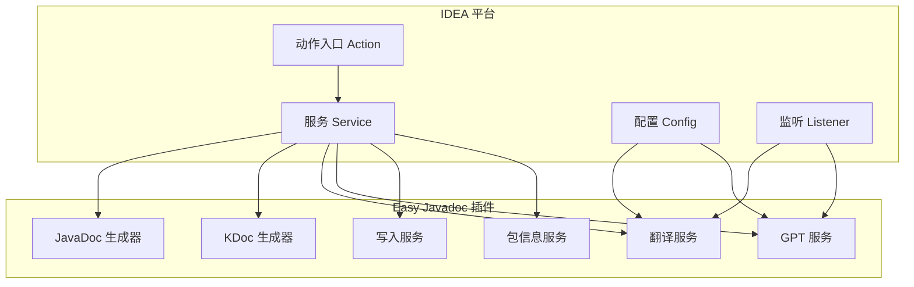
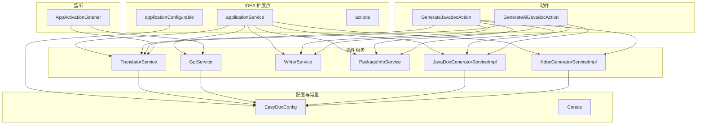
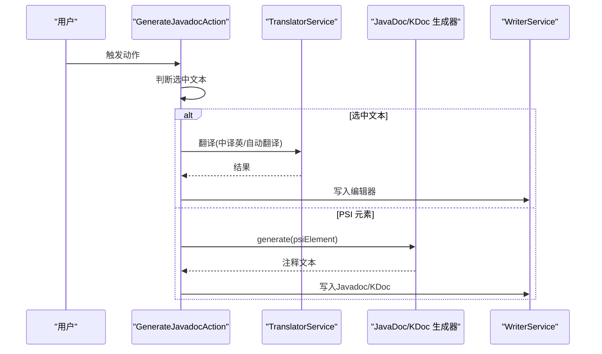
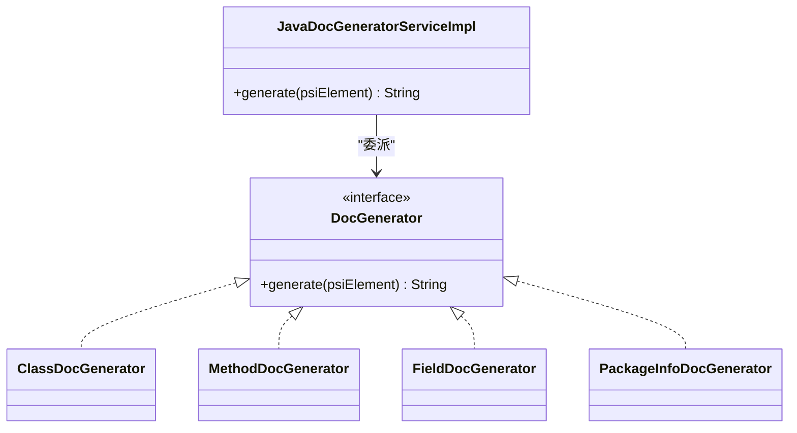
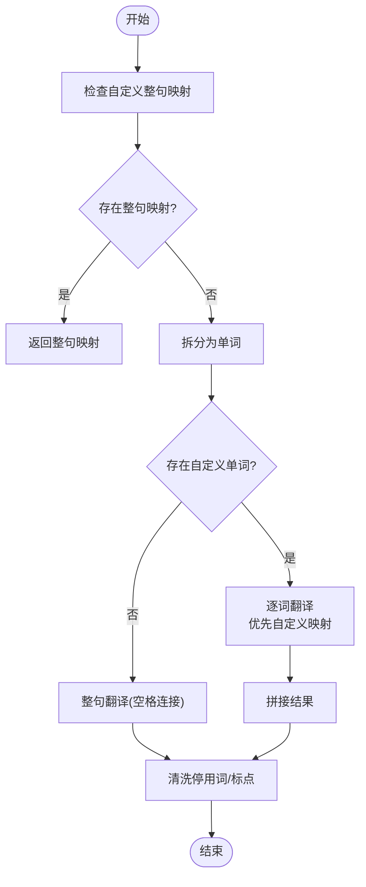
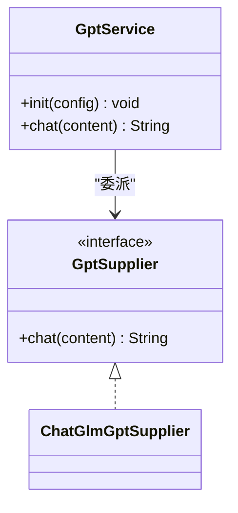
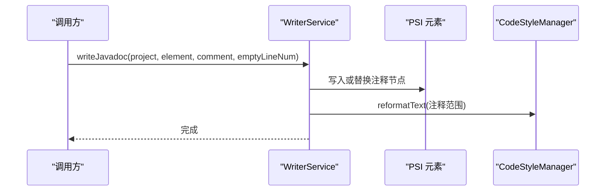
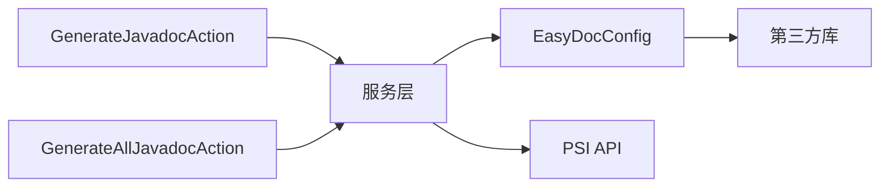

# 架构设计

<cite>
**本文引用的文件**
- [plugin.xml](file://src/main/resources/META-INF/plugin.xml)
- [build.gradle](file://build.gradle)
- [README.md](file://README.md)
- [EasyDocConfig.java](file://src/main/java/com/star/easydoc/config/EasyDocConfig.java)
- [Consts.java](file://src/main/java/com/star/easydoc/common/Consts.java)
- [GenerateJavadocAction.java](file://src/main/java/com/star/easydoc/action/GenerateJavadocAction.java)
- [GenerateAllJavadocAction.java](file://src/main/java/com/star/easydoc/action/GenerateAllJavadocAction.java)
- [AppActivationListener.java](file://src/main/java/com/star/easydoc/listener/AppActivationListener.java)
- [DocGeneratorService.java](file://src/main/java/com/star/easydoc/service/DocGeneratorService.java)
- [WriterService.java](file://src/main/java/com/star/easydoc/service/WriterService.java)
- [TranslatorService.java](file://src/main/java/com/star/easydoc/service/translator/TranslatorService.java)
- [GptService.java](file://src/main/java/com/star/easydoc/service/gpt/GptService.java)
- [JavaDocGeneratorServiceImpl.java](file://src/main/java/com/star/easydoc/javadoc/service/JavaDocGeneratorServiceImpl.java)
- [PackageInfoService.java](file://src/main/java/com/star/easydoc/service/PackageInfoService.java)
</cite>

## 目录
1. [引言](#引言)
2. [项目结构](#项目结构)
3. [核心组件](#核心组件)
4. [架构总览](#架构总览)
5. [详细组件分析](#详细组件分析)
6. [依赖分析](#依赖分析)
7. [性能考量](#性能考量)
8. [故障排查指南](#故障排查指南)
9. [结论](#结论)
10. [附录](#附录)

## 引言
本文件面向 Easy Javadoc 插件的架构设计，系统性阐述其分层架构、模块化组织、组件间依赖关系与关键设计模式的应用。重点包括：
- 分层架构与模块边界：动作层、服务层、工具层、配置层
- 设计模式落地：策略模式在翻译器实现中的使用、工厂模式在文档生成器创建中的应用、观察者模式在应用激活监听中的实现
- 与 IntelliJ IDEA 平台的集成：PSI API 使用、扩展点注册机制、服务接口设计
- 数据流与关键算法：文档生成流程、翻译缓存策略、模板渲染机制
- 架构图表与组件关系说明，帮助开发者快速理解技术实现

## 项目结构
插件采用按功能域划分的模块化组织方式，核心目录与职责如下：
- action：IDEA 动作入口，绑定快捷键与菜单项，协调服务层完成文档生成与翻译
- config：配置持久化与常量定义，集中管理模板、变量、翻译器与超时等配置
- javadoc/service：Java 文档生成服务，包含生成器与变量生成器服务
- kdoc/service：Kotlin 文档生成服务（KDoc），与 Java 对应
- service：通用服务层，如写入服务、包信息服务、翻译服务、GPT 服务
- listener：应用生命周期监听，负责初始化与通知
- view：UI 配置视图与内嵌对话框
- resources：插件元数据与提示词资源

**图表来源**
- [plugin.xml:27-53](file://src/main/resources/META-INF/plugin.xml#L27-L53)
- [GenerateJavadocAction.java:46-70](file://src/main/java/com/star/easydoc/action/GenerateJavadocAction.java#L46-L70)
- [GenerateAllJavadocAction.java:47-74](file://src/main/java/com/star/easydoc/action/GenerateAllJavadocAction.java#L47-L74)

**章节来源**
- [plugin.xml:27-53](file://src/main/resources/META-INF/plugin.xml#L27-L53)
- [build.gradle:51-56](file://build.gradle#L51-L56)

## 核心组件
- 动作层
  - GenerateJavadocAction：处理单元素文档生成与选中文本翻译；支持 Java 与 Kotlin 文件
  - GenerateAllJavadocAction：批量生成类、方法、属性注释，并支持包信息生成
- 服务层
  - JavaDocGeneratorServiceImpl：根据 PSI 元素类型选择对应 DocGenerator 实现
  - WriterService：统一写入 Javadoc/KDoc，处理格式化与空行控制
  - TranslatorService：策略模式聚合多种翻译器，支持自定义词典与整句/单词混合翻译
  - GptService：策略模式聚合 GPT 供应商（当前为智谱清言）
  - PackageInfoService：生成/更新 package-info.java
- 配置层
  - EasyDocConfig：模板、变量、覆盖模式、翻译器、超时、单词映射等配置
  - Consts：翻译器枚举与常量集合
- 监听层
  - AppActivationListener：应用激活时初始化服务与发送支持通知

**章节来源**
- [GenerateJavadocAction.java:46-175](file://src/main/java/com/star/easydoc/action/GenerateJavadocAction.java#L46-L175)
- [GenerateAllJavadocAction.java:47-218](file://src/main/java/com/star/easydoc/action/GenerateAllJavadocAction.java#L47-L218)
- [JavaDocGeneratorServiceImpl.java:25-50](file://src/main/java/com/star/easydoc/javadoc/service/JavaDocGeneratorServiceImpl.java#L25-L50)
- [WriterService.java:25-139](file://src/main/java/com/star/easydoc/service/WriterService.java#L25-L139)
- [TranslatorService.java:41-238](file://src/main/java/com/star/easydoc/service/translator/TranslatorService.java#L41-L238)
- [GptService.java:16-57](file://src/main/java/com/star/easydoc/service/gpt/GptService.java#L16-L57)
- [PackageInfoService.java:22-90](file://src/main/java/com/star/easydoc/service/PackageInfoService.java#L22-L90)
- [EasyDocConfig.java:22-680](file://src/main/java/com/star/easydoc/config/EasyDocConfig.java#L22-L680)
- [Consts.java:14-100](file://src/main/java/com/star/easydoc/common/Consts.java#L14-L100)
- [AppActivationListener.java:28-119](file://src/main/java/com/star/easydoc/listener/AppActivationListener.java#L28-L119)

## 架构总览
插件遵循分层与模块化设计，通过 IDEA 扩展点注册服务，动作层通过 ServiceManager 获取服务实例，调用 PSI API 解析与修改源码，最终通过写入服务落盘。

**图表来源**
- [plugin.xml:27-53](file://src/main/resources/META-INF/plugin.xml#L27-L53)
- [GenerateJavadocAction.java:48-53](file://src/main/java/com/star/easydoc/action/GenerateJavadocAction.java#L48-L53)
- [GenerateAllJavadocAction.java:52-57](file://src/main/java/com/star/easydoc/action/GenerateAllJavadocAction.java#L52-L57)
- [AppActivationListener.java:107-113](file://src/main/java/com/star/easydoc/listener/AppActivationListener.java#L107-L113)

## 详细组件分析

### 动作层组件
- GenerateJavadocAction
  - 职责：响应快捷键，区分选中文本翻译与 PSI 元素文档生成；支持 Java 与 Kotlin
  - 关键流程：选中文本优先处理；否则根据 PSI 文件类型调用对应生成器；通过 WriterService 写入
- GenerateAllJavadocAction
  - 职责：批量生成类、方法、属性注释；支持包信息生成与递归内部类
  - 关键流程：弹出配置视图；遍历 PSI 元素生成并写入

**图表来源**
- [GenerateJavadocAction.java:72-175](file://src/main/java/com/star/easydoc/action/GenerateJavadocAction.java#L72-L175)
- [TranslatorService.java:85-111](file://src/main/java/com/star/easydoc/service/translator/TranslatorService.java#L85-L111)
- [WriterService.java:36-75](file://src/main/java/com/star/easydoc/service/WriterService.java#L36-L75)

**章节来源**
- [GenerateJavadocAction.java:46-175](file://src/main/java/com/star/easydoc/action/GenerateJavadocAction.java#L46-L175)
- [GenerateAllJavadocAction.java:47-218](file://src/main/java/com/star/easydoc/action/GenerateAllJavadocAction.java#L47-L218)

### 服务层组件

#### JavaDoc 生成器服务
- JavaDocGeneratorServiceImpl
  - 职责：基于 PSI 元素类型选择对应 DocGenerator 实现（类、方法、属性、包）
  - 设计要点：使用不可变映射注册各类型生成器，简化扩展

**图表来源**
- [JavaDocGeneratorServiceImpl.java:25-50](file://src/main/java/com/star/easydoc/javadoc/service/JavaDocGeneratorServiceImpl.java#L25-L50)

**章节来源**
- [JavaDocGeneratorServiceImpl.java:25-50](file://src/main/java/com/star/easydoc/javadoc/service/JavaDocGeneratorServiceImpl.java#L25-L50)

#### 翻译服务与策略模式
- TranslatorService
  - 职责：聚合多种翻译器（百度、阿里云、腾讯、有道、微软、谷歌、本地词典、自定义 URL、单词分割等）
  - 策略模式：通过不可变映射将名称与实现绑定；按配置动态选择
  - 翻译策略：整句翻译优先；若存在自定义单词映射则逐词翻译；支持中译英命名生成
  - 缓存策略：提供统一清理缓存接口，便于维护

**图表来源**
- [TranslatorService.java:85-111](file://src/main/java/com/star/easydoc/service/translator/TranslatorService.java#L85-L111)
- [Consts.java:24-25](file://src/main/java/com/star/easydoc/common/Consts.java#L24-L25)

**章节来源**
- [TranslatorService.java:41-238](file://src/main/java/com/star/easydoc/service/translator/TranslatorService.java#L41-L238)
- [Consts.java:14-100](file://src/main/java/com/star/easydoc/common/Consts.java#L14-L100)

#### GPT 服务与工厂模式
- GptService
  - 职责：聚合 GPT 供应商（当前为智谱清言）
  - 工厂模式：通过不可变映射注册供应商，按配置选择

**图表来源**
- [GptService.java:16-57](file://src/main/java/com/star/easydoc/service/gpt/GptService.java#L16-L57)

**章节来源**
- [GptService.java:16-57](file://src/main/java/com/star/easydoc/service/gpt/GptService.java#L16-L57)

#### 写入服务与格式化
- WriterService
  - 职责：统一写入 Javadoc/KDoc；处理覆盖、格式化与空行
  - 关键点：使用 WriteCommandAction 保证线程安全；调用 CodeStyleManager 进行格式化；支持编辑器文本替换

**图表来源**
- [WriterService.java:36-75](file://src/main/java/com/star/easydoc/service/WriterService.java#L36-L75)

**章节来源**
- [WriterService.java:25-139](file://src/main/java/com/star/easydoc/service/WriterService.java#L25-L139)

#### 包信息服务
- PackageInfoService
  - 职责：生成/更新 package-info.java，注入描述注释
  - 关键点：通过 PSI 与虚拟文件系统操作；写入后刷新 VFS

**章节来源**
- [PackageInfoService.java:22-90](file://src/main/java/com/star/easydoc/service/PackageInfoService.java#L22-L90)

### 配置与常量
- EasyDocConfig
  - 职责：集中管理模板、变量、覆盖模式、翻译器、超时、单词映射等
  - 特性：支持项目级单词映射合并；提供变量类型枚举（固定值/脚本）
- Consts
  - 职责：定义可用翻译器集合、AI 翻译集合、停用词、基础类型集合等

**章节来源**
- [EasyDocConfig.java:22-680](file://src/main/java/com/star/easydoc/config/EasyDocConfig.java#L22-L680)
- [Consts.java:14-100](file://src/main/java/com/star/easydoc/common/Consts.java#L14-L100)

### 监听与扩展点
- AppActivationListener
  - 职责：应用激活时初始化翻译与 GPT 服务，发送支持通知
  - 设计要点：双重检查锁避免重复初始化；通过 IDEA 消息总线订阅激活事件
- plugin.xml
  - 职责：注册应用服务、配置页与动作；声明依赖模块

**章节来源**
- [AppActivationListener.java:28-119](file://src/main/java/com/star/easydoc/listener/AppActivationListener.java#L28-L119)
- [plugin.xml:27-82](file://src/main/resources/META-INF/plugin.xml#L27-L82)

## 依赖分析
- 组件耦合
  - 动作层仅依赖服务接口与 PSI API，低耦合高内聚
  - 服务层通过 ServiceManager 获取，避免硬编码依赖
  - 配置层被翻译与 GPT 服务依赖，形成清晰的数据驱动
- 外部依赖
  - IntelliJ 平台模块：java、Kotlin
  - 第三方库：fastjson2、java-jwt（用于 JSON 与 JWT）

**图表来源**
- [plugin.xml:50-56](file://src/main/resources/META-INF/plugin.xml#L50-L56)
- [build.gradle:58-61](file://build.gradle#L58-L61)

**章节来源**
- [plugin.xml:50-56](file://src/main/resources/META-INF/plugin.xml#L50-L56)
- [build.gradle:58-61](file://build.gradle#L58-L61)

## 性能考量
- 翻译性能
  - 整句翻译优先，减少 API 调用次数；单词粒度翻译用于提升术语一致性
  - 提供统一缓存清理接口，便于在配置变更后重置
- 写入性能
  - 使用 WriteCommandAction 与 CodeStyleManager 批量格式化，避免 UI 线程阻塞
- 批量生成
  - GenerateAllJavadocAction 支持递归内部类与多选项配置，建议在大型项目中谨慎使用以避免长时间占用

## 故障排查指南
- 快捷键无效
  - 检查光标位置是否在类/方法/属性上；确认与 IDEA 快捷键冲突
- 注释未覆盖或格式异常
  - 检查覆盖模式与合并模式配置；确认 IDE Javadoc 格式化设置
- 翻译结果不准确
  - 检查自定义单词映射；尝试调整翻译器或启用整句翻译
- 服务初始化失败
  - 查看应用激活监听初始化日志；确认配置项与密钥正确

**章节来源**
- [README.md:77-84](file://README.md#L77-L84)
- [AppActivationListener.java:107-113](file://src/main/java/com/star/easydoc/listener/AppActivationListener.java#L107-L113)

## 结论
Easy Javadoc 插件通过清晰的分层架构与模块化组织，结合策略模式、工厂模式与观察者模式，实现了对 Java 与 Kotlin 文档注释的高效生成与翻译。其与 IntelliJ IDEA 的深度集成体现在扩展点注册、PSI API 使用与服务接口设计上，具备良好的可扩展性与可维护性。建议在生产环境中合理配置翻译器与覆盖模式，并关注批量生成对工程规模的影响。

## 附录
- 快捷键与使用说明可参考项目自述文件
- 插件版本与依赖可在构建脚本中查看

**章节来源**
- [README.md:26-30](file://README.md#L26-L30)
- [build.gradle:51-56](file://build.gradle#L51-L56)