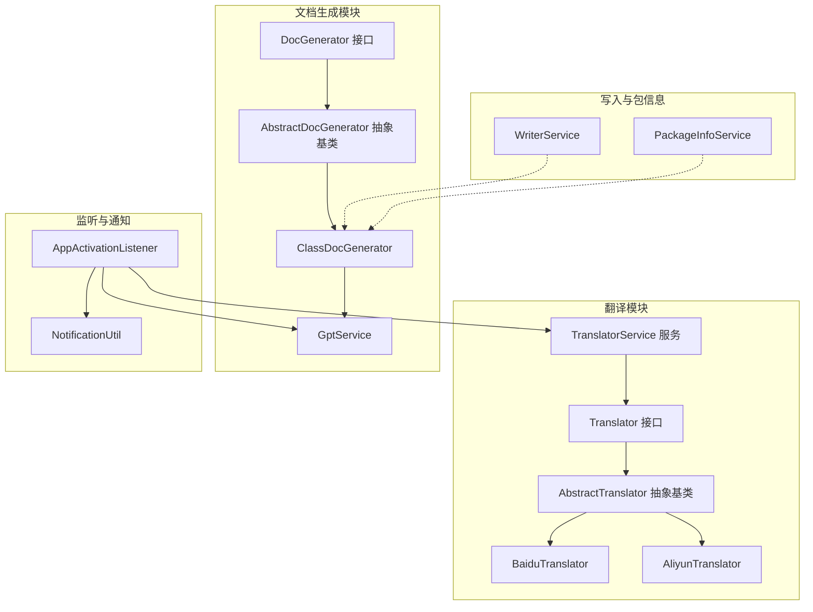
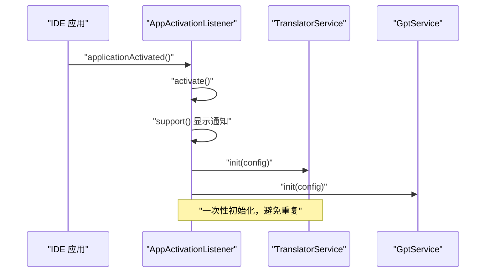
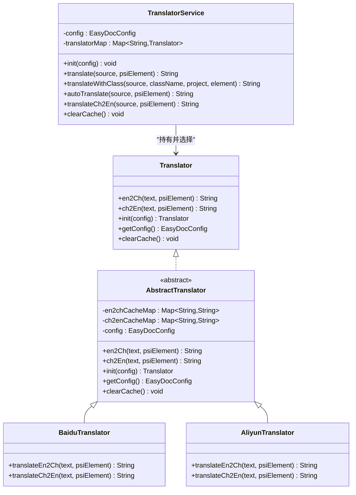
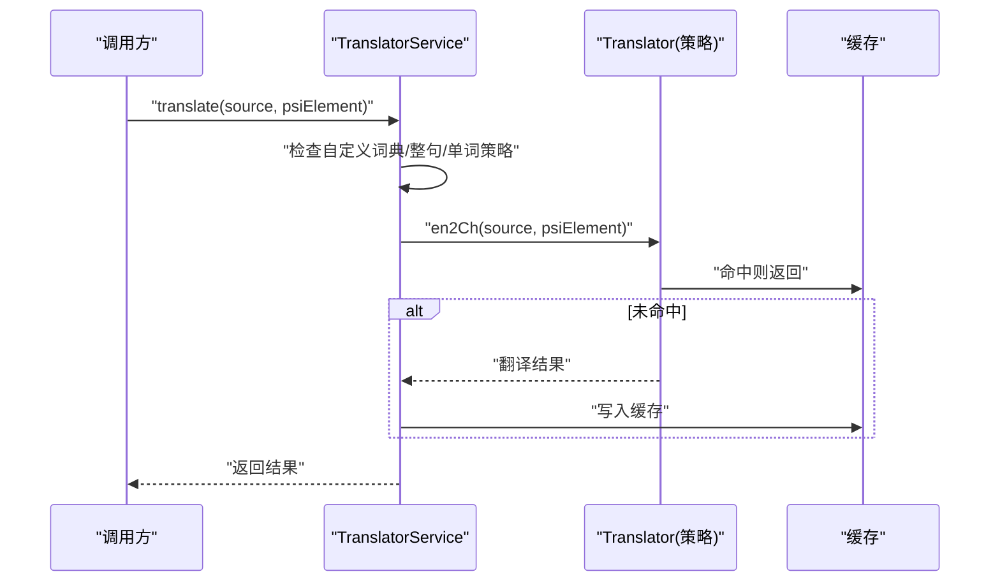
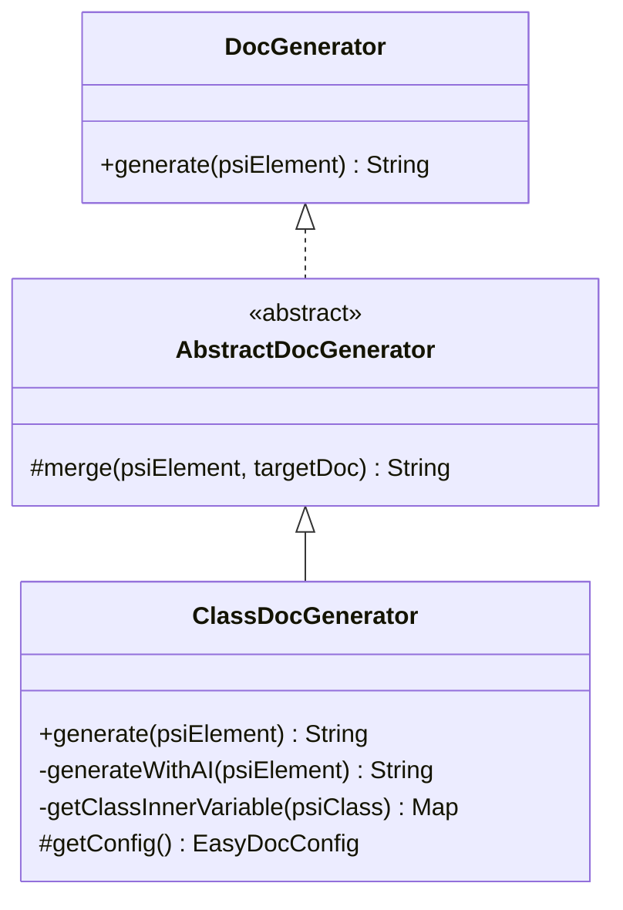
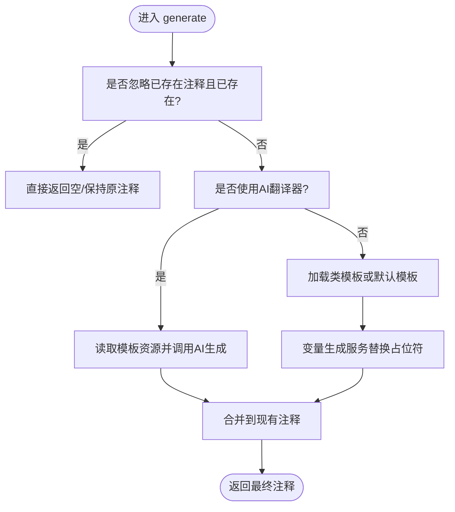
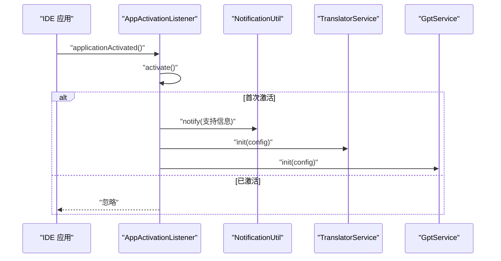
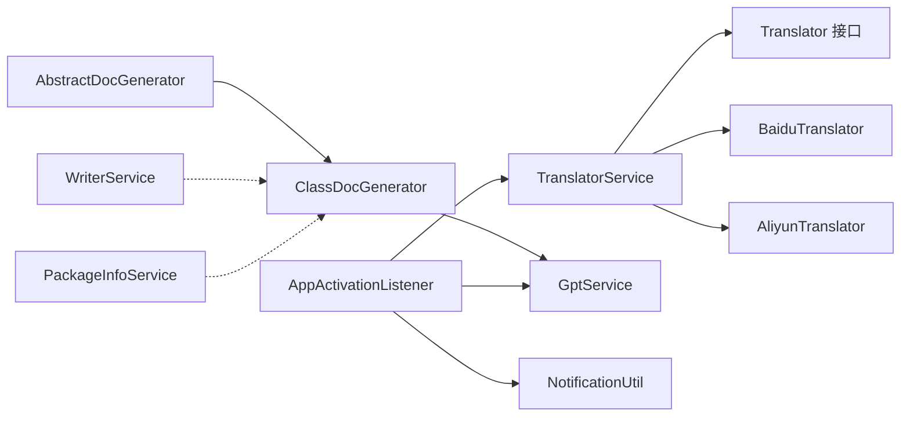

# 设计模式应用

<cite>
**本文引用的文件**
- [AbstractTranslator.java](file://src/main/java/com/star/easydoc/service/translator/impl/AbstractTranslator.java)
- [Translator.java](file://src/main/java/com/star/easydoc/service/translator/Translator.java)
- [TranslatorService.java](file://src/main/java/com/star/easydoc/service/translator/TranslatorService.java)
- [AliyunTranslator.java](file://src/main/java/com/star/easydoc/service/translator/impl/AliyunTranslator.java)
- [BaiduTranslator.java](file://src/main/java/com/star/easydoc/service/translator/impl/BaiduTranslator.java)
- [AbstractDocGenerator.java](file://src/main/java/com/star/easydoc/javadoc/service/generator/impl/AbstractDocGenerator.java)
- [DocGenerator.java](file://src/main/java/com/star/easydoc/javadoc/service/generator/DocGenerator.java)
- [ClassDocGenerator.java](file://src/main/java/com/star/easydoc/javadoc/service/generator/impl/ClassDocGenerator.java)
- [GptService.java](file://src/main/java/com/star/easydoc/service/gpt/GptService.java)
- [AppActivationListener.java](file://src/main/java/com/star/easydoc/listener/AppActivationListener.java)
- [NotificationUtil.java](file://src/main/java/com/star/easydoc/common/util/NotificationUtil.java)
- [WriterService.java](file://src/main/java/com/star/easydoc/service/WriterService.java)
- [PackageInfoService.java](file://src/main/java/com/star/easydoc/service/PackageInfoService.java)
</cite>

## 目录
1. [引言](#引言)
2. [项目结构](#项目结构)
3. [核心组件](#核心组件)
4. [架构总览](#架构总览)
5. [详细组件分析](#详细组件分析)
6. [依赖分析](#依赖分析)
7. [性能考虑](#性能考虑)
8. [故障排查指南](#故障排查指南)
9. [结论](#结论)

## 引言
本文件聚焦于 Easy Javadoc 插件中设计模式的应用与落地，围绕以下主题展开：  
- 策略模式在“翻译器”模块中的实现（抽象翻译器基类与多种具体翻译器），以及其带来的可扩展性与可替换性优势；  
- 工厂模式在“文档生成器”创建中的体现（通过统一入口按需选择具体生成器）；  
- 模板方法模式在“文档生成流程”中的应用（由抽象生成器定义骨架，子类填充细节）；  
- 观察者模式在“应用激活监听”中的实现（IDE 应用激活事件驱动初始化与通知）。  

通过对关键类与调用序列的深入剖析，帮助读者快速理解各模式在真实工程中的价值与边界。

## 项目结构
从设计模式视角看，项目采用“分层 + 模块化”的组织方式：  
- 翻译模块：接口 + 抽象基类 + 多种具体实现，配合服务层进行装配与调度；  
- 文档生成模块：接口 + 抽象基类 + 具体生成器，配合变量生成器、AI 服务等协作；  
- 监听与通知模块：应用激活监听器负责一次性初始化与用户引导；  
- 写入与包信息模块：封装 IDE 文件写入与 package-info 处理逻辑。

图表来源
- [Translator.java:13-53](file://src/main/java/com/star/easydoc/service/translator/Translator.java#L13-L53)
- [AbstractTranslator.java:14-91](file://src/main/java/com/star/easydoc/service/translator/impl/AbstractTranslator.java#L14-L91)
- [BaiduTranslator.java:21-36](file://src/main/java/com/star/easydoc/service/translator/impl/BaiduTranslator.java#L21-L36)
- [AliyunTranslator.java:35-49](file://src/main/java/com/star/easydoc/service/translator/impl/AliyunTranslator.java#L35-L49)
- [TranslatorService.java:41-77](file://src/main/java/com/star/easydoc/service/translator/TranslatorService.java#L41-L77)
- [DocGenerator.java:11-19](file://src/main/java/com/star/easydoc/javadoc/service/generator/DocGenerator.java#L11-L19)
- [AbstractDocGenerator.java:20-79](file://src/main/java/com/star/easydoc/javadoc/service/generator/impl/AbstractDocGenerator.java#L20-L79)
- [ClassDocGenerator.java:29-68](file://src/main/java/com/star/easydoc/javadoc/service/generator/impl/ClassDocGenerator.java#L29-L68)
- [GptService.java:16-54](file://src/main/java/com/star/easydoc/service/gpt/GptService.java#L16-L54)
- [AppActivationListener.java:28-57](file://src/main/java/com/star/easydoc/listener/AppActivationListener.java#L28-L57)
- [NotificationUtil.java:18-44](file://src/main/java/com/star/easydoc/common/util/NotificationUtil.java#L18-L44)
- [WriterService.java:25-75](file://src/main/java/com/star/easydoc/service/WriterService.java#L25-L75)
- [PackageInfoService.java:22-87](file://src/main/java/com/star/easydoc/service/PackageInfoService.java#L22-L87)

章节来源
- [Translator.java:13-53](file://src/main/java/com/star/easydoc/service/translator/Translator.java#L13-L53)
- [AbstractTranslator.java:14-91](file://src/main/java/com/star/easydoc/service/translator/impl/AbstractTranslator.java#L14-L91)
- [TranslatorService.java:41-77](file://src/main/java/com/star/easydoc/service/translator/TranslatorService.java#L41-L77)
- [DocGenerator.java:11-19](file://src/main/java/com/star/easydoc/javadoc/service/generator/DocGenerator.java#L11-L19)
- [AbstractDocGenerator.java:20-79](file://src/main/java/com/star/easydoc/javadoc/service/generator/impl/AbstractDocGenerator.java#L20-L79)
- [ClassDocGenerator.java:29-68](file://src/main/java/com/star/easydoc/javadoc/service/generator/impl/ClassDocGenerator.java#L29-L68)
- [GptService.java:16-54](file://src/main/java/com/star/easydoc/service/gpt/GptService.java#L16-L54)
- [AppActivationListener.java:28-57](file://src/main/java/com/star/easydoc/listener/AppActivationListener.java#L28-L57)
- [NotificationUtil.java:18-44](file://src/main/java/com/star/easydoc/common/util/NotificationUtil.java#L18-L44)
- [WriterService.java:25-75](file://src/main/java/com/star/easydoc/service/WriterService.java#L25-L75)
- [PackageInfoService.java:22-87](file://src/main/java/com/star/easydoc/service/PackageInfoService.java#L22-L87)

## 核心组件
- 策略模式（翻译器）：通过统一接口与抽象基类，屏蔽具体实现差异，允许运行期按配置切换不同翻译服务。
- 模板方法模式（文档生成）：抽象生成器定义“合并已有注释 + 生成目标注释 + 合并输出”的流程骨架，子类仅关注模板解析与变量替换等细节。
- 工厂模式（文档生成器）：由服务层根据上下文选择合适的生成器实例，集中管理创建与装配。
- 观察者模式（应用激活监听）：IDE 应用激活事件作为“被观察者”，监听器作为“观察者”执行一次性初始化与用户引导。

章节来源
- [AbstractTranslator.java:14-91](file://src/main/java/com/star/easydoc/service/translator/impl/AbstractTranslator.java#L14-L91)
- [TranslatorService.java:41-77](file://src/main/java/com/star/easydoc/service/translator/TranslatorService.java#L41-L77)
- [AbstractDocGenerator.java:20-79](file://src/main/java/com/star/easydoc/javadoc/service/generator/impl/AbstractDocGenerator.java#L20-L79)
- [ClassDocGenerator.java:29-68](file://src/main/java/com/star/easydoc/javadoc/service/generator/impl/ClassDocGenerator.java#L29-L68)
- [AppActivationListener.java:28-57](file://src/main/java/com/star/easydoc/listener/AppActivationListener.java#L28-L57)

## 架构总览
下图展示了“策略 + 模板方法 + 工厂 + 观察者”的协同关系：  
- 策略模式：TranslatorService 统一持有多种 Translator 实现，并依据配置选择当前策略；  
- 模板方法：AbstractDocGenerator 定义生成流程骨架，ClassDocGenerator 等子类填充模板与变量生成细节；  
- 工厂模式：GptService 与 TranslatorService 分别以不可变映射的方式“生产”具体供应商/翻译器实例；  
- 观察者模式：AppActivationListener 在 IDE 激活时触发初始化与通知。

图表来源
- [AppActivationListener.java:37-57](file://src/main/java/com/star/easydoc/listener/AppActivationListener.java#L37-L57)
- [TranslatorService.java:52-77](file://src/main/java/com/star/easydoc/service/translator/TranslatorService.java#L52-L77)
- [GptService.java:27-40](file://src/main/java/com/star/easydoc/service/gpt/GptService.java#L27-L40)

## 详细组件分析

### 策略模式：翻译器实现
- 抽象与接口：Translator 定义统一能力；AbstractTranslator 提供缓存、初始化、清理等通用逻辑，子类仅实现核心翻译方法。
- 具体实现：BaiduTranslator、AliyunTranslator 等各自封装第三方 API 的请求细节。
- 服务装配：TranslatorService 以不可变映射持有所有实现，并按配置选择当前策略；同时提供“整句/单词级”翻译策略与自定义词典优先策略。

图表来源
- [Translator.java:13-53](file://src/main/java/com/star/easydoc/service/translator/Translator.java#L13-L53)
- [AbstractTranslator.java:14-91](file://src/main/java/com/star/easydoc/service/translator/impl/AbstractTranslator.java#L14-L91)
- [BaiduTranslator.java:21-36](file://src/main/java/com/star/easydoc/service/translator/impl/BaiduTranslator.java#L21-L36)
- [AliyunTranslator.java:35-49](file://src/main/java/com/star/easydoc/service/translator/impl/AliyunTranslator.java#L35-L49)
- [TranslatorService.java:41-77](file://src/main/java/com/star/easydoc/service/translator/TranslatorService.java#L41-L77)

图表来源
- [TranslatorService.java:85-111](file://src/main/java/com/star/easydoc/service/translator/TranslatorService.java#L85-L111)
- [AbstractTranslator.java:22-52](file://src/main/java/com/star/easydoc/service/translator/impl/AbstractTranslator.java#L22-L52)

优势与要点
- 可扩展：新增翻译源只需实现 Translator 并在服务中注册；  
- 可替换：通过配置即可切换策略；  
- 性能：内置并发安全缓存，减少重复请求；  
- 稳健：失败兜底与重试逻辑（如百度翻译）提升可用性。

章节来源
- [AbstractTranslator.java:14-91](file://src/main/java/com/star/easydoc/service/translator/impl/AbstractTranslator.java#L14-L91)
- [TranslatorService.java:41-77](file://src/main/java/com/star/easydoc/service/translator/TranslatorService.java#L41-L77)
- [BaiduTranslator.java:21-36](file://src/main/java/com/star/easydoc/service/translator/impl/BaiduTranslator.java#L21-L36)
- [AliyunTranslator.java:35-49](file://src/main/java/com/star/easydoc/service/translator/impl/AliyunTranslator.java#L35-L49)

### 模板方法模式：文档生成流程
- 抽象骨架：AbstractDocGenerator 定义“合并已有注释 + 生成目标注释 + 合并输出”的流程；  
- 子类填充：ClassDocGenerator 负责模板选择、变量生成与 AI 生成分支；  
- 流程控制：覆盖模式（忽略/强制覆盖）、参数/异常标签保留顺序等细节由抽象层统一处理。

图表来源
- [DocGenerator.java:11-19](file://src/main/java/com/star/easydoc/javadoc/service/generator/DocGenerator.java#L11-L19)
- [AbstractDocGenerator.java:20-79](file://src/main/java/com/star/easydoc/javadoc/service/generator/impl/AbstractDocGenerator.java#L20-L79)
- [ClassDocGenerator.java:29-68](file://src/main/java/com/star/easydoc/javadoc/service/generator/impl/ClassDocGenerator.java#L29-L68)

图表来源
- [ClassDocGenerator.java:44-68](file://src/main/java/com/star/easydoc/javadoc/service/generator/impl/ClassDocGenerator.java#L44-L68)
- [AbstractDocGenerator.java:29-71](file://src/main/java/com/star/easydoc/javadoc/service/generator/impl/AbstractDocGenerator.java#L29-L71)

优势与要点
- 统一流程：保证不同元素（类/方法/字段）的注释生成遵循一致的合并与覆盖规则；  
- 易扩展：新增元素类型只需实现 DocGenerator 或继承 AbstractDocGenerator；  
- 可定制：模板与变量生成解耦，便于个性化配置。

章节来源
- [AbstractDocGenerator.java:20-79](file://src/main/java/com/star/easydoc/javadoc/service/generator/impl/AbstractDocGenerator.java#L20-L79)
- [ClassDocGenerator.java:29-68](file://src/main/java/com/star/easydoc/javadoc/service/generator/impl/ClassDocGenerator.java#L29-L68)

### 工厂模式：文档生成器创建
- 统一入口：服务层集中管理生成器实例的创建与缓存；  
- 策略选择：根据上下文（如元素类型、配置项）选择合适的具体生成器；  
- 不可变映射：使用不可变映射确保线程安全与初始化幂等。

说明：本节为概念性总结，不直接分析具体文件。

### 观察者模式：应用激活监听
- 触发事件：IDE 应用激活事件；  
- 观察者行为：AppActivationListener 在首次激活时执行一次性初始化与用户引导通知；  
- 用户交互：通过 NotificationUtil 展示“去点star/五星好评/加个鸡腿”等动作按钮。

图表来源
- [AppActivationListener.java:37-57](file://src/main/java/com/star/easydoc/listener/AppActivationListener.java#L37-L57)
- [NotificationUtil.java:30-44](file://src/main/java/com/star/easydoc/common/util/NotificationUtil.java#L30-L44)
- [TranslatorService.java:52-77](file://src/main/java/com/star/easydoc/service/translator/TranslatorService.java#L52-L77)
- [GptService.java:27-40](file://src/main/java/com/star/easydoc/service/gpt/GptService.java#L27-L40)

优势与要点
- 低侵入：监听器独立于业务流程，仅在激活时执行；  
- 用户体验：首次激活即引导，提升留存与口碑；  
- 幂等保护：双重检查与锁机制避免重复初始化。

章节来源
- [AppActivationListener.java:28-57](file://src/main/java/com/star/easydoc/listener/AppActivationListener.java#L28-L57)
- [NotificationUtil.java:18-44](file://src/main/java/com/star/easydoc/common/util/NotificationUtil.java#L18-L44)

## 依赖分析
- 翻译模块内部：AbstractTranslator 为所有具体翻译器提供公共能力；TranslatorService 作为工厂与调度中心；  
- 文档生成模块：AbstractDocGenerator 与 ClassDocGenerator 形成模板方法；GptService 作为外部能力补充；  
- 监听模块：AppActivationListener 依赖 TranslatorService 与 GptService 进行初始化；  
- 写入与包信息：WriterService 负责注释写入与格式化；PackageInfoService 负责 package-info 文件生成与更新。

图表来源
- [TranslatorService.java:41-77](file://src/main/java/com/star/easydoc/service/translator/TranslatorService.java#L41-L77)
- [AbstractDocGenerator.java:20-79](file://src/main/java/com/star/easydoc/javadoc/service/generator/impl/AbstractDocGenerator.java#L20-L79)
- [ClassDocGenerator.java:29-68](file://src/main/java/com/star/easydoc/javadoc/service/generator/impl/ClassDocGenerator.java#L29-L68)
- [GptService.java:16-54](file://src/main/java/com/star/easydoc/service/gpt/GptService.java#L16-L54)
- [AppActivationListener.java:28-57](file://src/main/java/com/star/easydoc/listener/AppActivationListener.java#L28-L57)
- [NotificationUtil.java:18-44](file://src/main/java/com/star/easydoc/common/util/NotificationUtil.java#L18-L44)
- [WriterService.java:25-75](file://src/main/java/com/star/easydoc/service/WriterService.java#L25-L75)
- [PackageInfoService.java:22-87](file://src/main/java/com/star/easydoc/service/PackageInfoService.java#L22-L87)

章节来源
- [TranslatorService.java:41-77](file://src/main/java/com/star/easydoc/service/translator/TranslatorService.java#L41-L77)
- [AbstractDocGenerator.java:20-79](file://src/main/java/com/star/easydoc/javadoc/service/generator/impl/AbstractDocGenerator.java#L20-L79)
- [ClassDocGenerator.java:29-68](file://src/main/java/com/star/easydoc/javadoc/service/generator/impl/ClassDocGenerator.java#L29-L68)
- [GptService.java:16-54](file://src/main/java/com/star/easydoc/service/gpt/GptService.java#L16-L54)
- [AppActivationListener.java:28-57](file://src/main/java/com/star/easydoc/listener/AppActivationListener.java#L28-L57)
- [NotificationUtil.java:18-44](file://src/main/java/com/star/easydoc/common/util/NotificationUtil.java#L18-L44)
- [WriterService.java:25-75](file://src/main/java/com/star/easydoc/service/WriterService.java#L25-L75)
- [PackageInfoService.java:22-87](file://src/main/java/com/star/easydoc/service/PackageInfoService.java#L22-L87)

## 性能考虑
- 策略模式缓存：AbstractTranslator 内置并发安全缓存，显著降低重复翻译开销；  
- 工厂模式幂等：服务初始化使用双重检查与同步块，避免重复创建与竞态；  
- 模板方法合并：在合并已有注释时尽量复用已有标签，减少字符串拼接与格式化成本；  
- I/O 与网络：翻译与 AI 服务调用应结合超时与重试策略，避免阻塞主线程。

## 故障排查指南
- 翻译失败：检查 TranslatorService 中当前策略是否正确、第三方密钥与网络连通性；  
- 注释未生效：确认 WriterService 写入流程是否成功、是否被覆盖或格式化导致显示异常；  
- 包信息未生成：检查 PackageInfoService 的文件创建/更新逻辑与权限；  
- 首次激活无通知：确认 AppActivationListener 的激活条件与 NotificationUtil 的通知组配置。

章节来源
- [TranslatorService.java:222-232](file://src/main/java/com/star/easydoc/service/translator/TranslatorService.java#L222-L232)
- [WriterService.java:36-75](file://src/main/java/com/star/easydoc/service/WriterService.java#L36-L75)
- [PackageInfoService.java:33-87](file://src/main/java/com/star/easydoc/service/PackageInfoService.java#L33-L87)
- [AppActivationListener.java:62-101](file://src/main/java/com/star/easydoc/listener/AppActivationListener.java#L62-L101)

## 结论
本插件通过策略模式实现了“可插拔”的翻译能力，通过模板方法模式规范了“注释生成 + 合并”的流程，通过工厂模式实现了“按需创建 + 幂等初始化”，并通过观察者模式在应用激活时完成一次性引导与初始化。这些设计模式共同提升了系统的可扩展性、可维护性与用户体验。