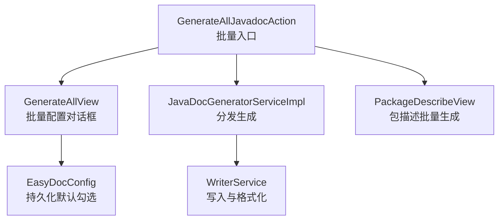
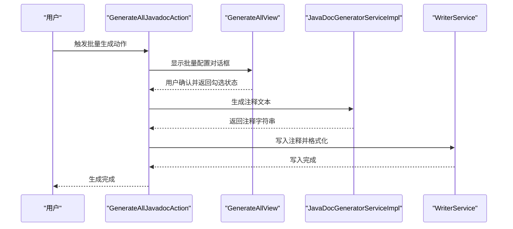
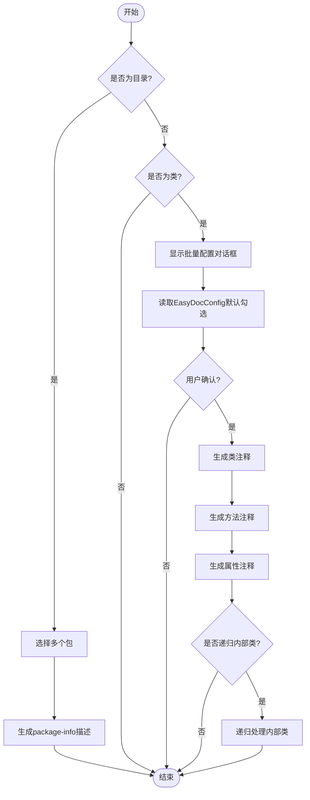
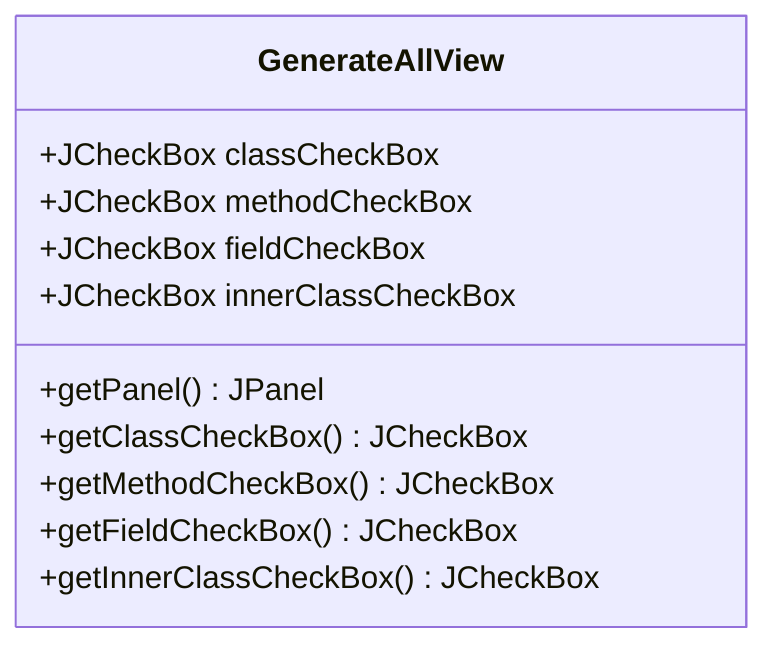
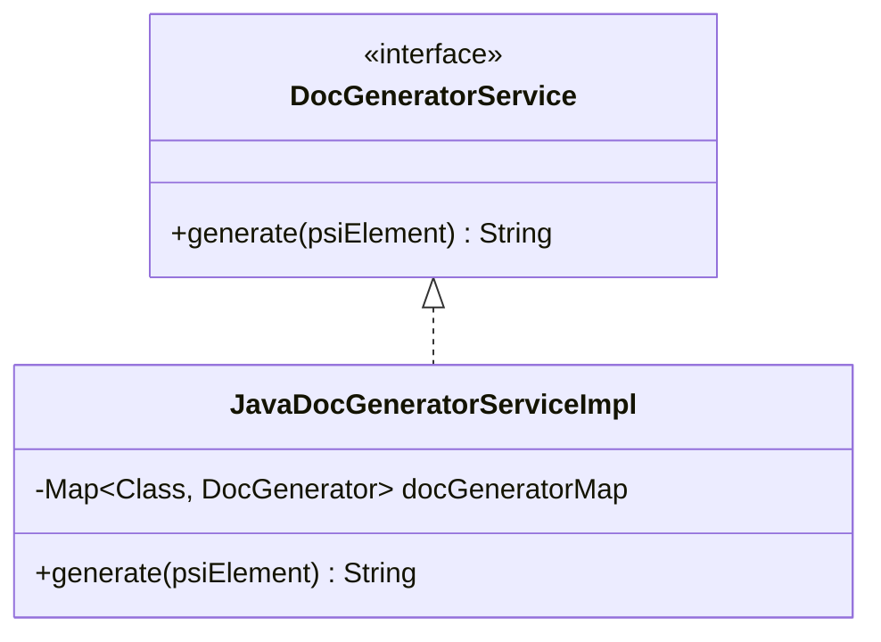
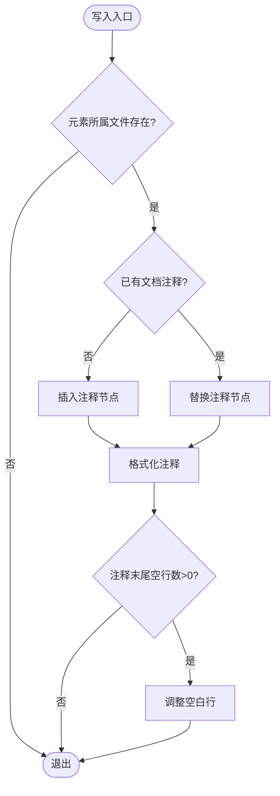
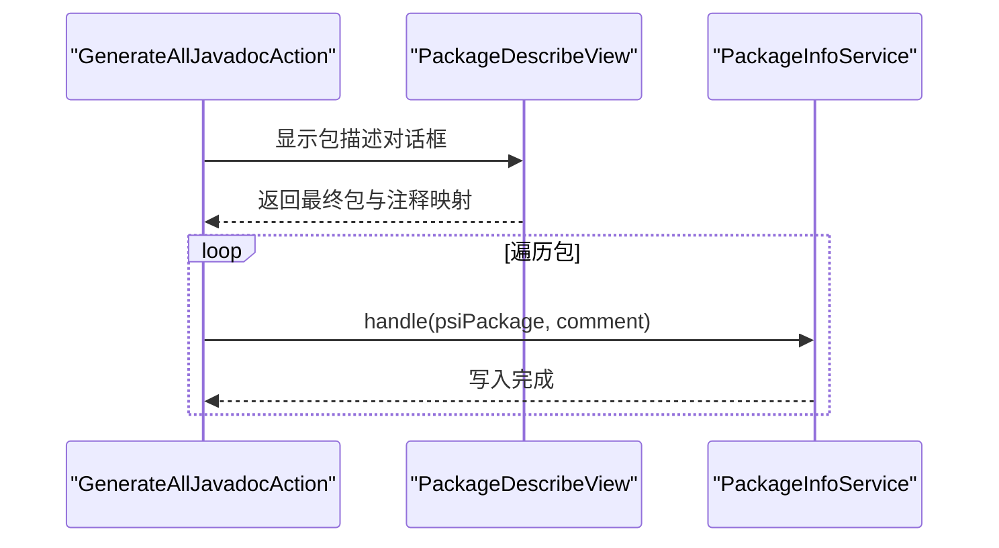
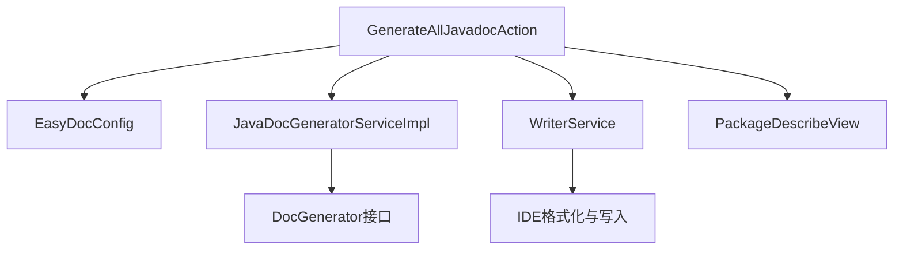

# 批量注释生成

<cite>
**本文引用的文件**
- [GenerateAllJavadocAction.java](file://src/main/java/com/star/easydoc/action/GenerateAllJavadocAction.java)
- [GenerateAllView.java](file://src/main/java/com/star/easydoc/view/inner/GenerateAllView.java)
- [GenerateAllView.form](file://src/main/java/com/star/easydoc/view/inner/GenerateAllView.form)
- [GenerateJavadocAction.java](file://src/main/java/com/star/easydoc/action/GenerateJavadocAction.java)
- [JavaDocGeneratorServiceImpl.java](file://src/main/java/com/star/easydoc/javadoc/service/JavaDocGeneratorServiceImpl.java)
- [DocGeneratorService.java](file://src/main/java/com/star/easydoc/service/DocGeneratorService.java)
- [WriterService.java](file://src/main/java/com/star/easydoc/service/WriterService.java)
- [EasyDocConfig.java](file://src/main/java/com/star/easydoc/config/EasyDocConfig.java)
- [PackageDescribeView.java](file://src/main/java/com/star/easydoc/view/inner/PackageDescribeView.java)
- [plugin.xml](file://src/main/resources/META-INF/plugin.xml)
- [README.md](file://README.md)
- [NotificationUtil.java](file://src/main/java/com/star/easydoc/common/util/NotificationUtil.java)
</cite>

## 目录
1. [简介](#简介)
2. [项目结构](#项目结构)
3. [核心组件](#核心组件)
4. [架构总览](#架构总览)
5. [详细组件分析](#详细组件分析)
6. [依赖分析](#依赖分析)
7. [性能考量](#性能考量)
8. [故障排查指南](#故障排查指南)
9. [结论](#结论)
10. [附录](#附录)

## 简介
本章节面向使用 Easy Javadoc 插件的开发者，聚焦“批量注释生成”能力，帮助您理解其使用场景、操作流程、与单个元素生成的区别与优势，并提供实际案例、最佳实践以及进度监控、错误处理与结果验证机制的说明。通过本文，您可以高效地在大型项目中统一注释风格，提升团队协作效率。

## 项目结构
批量注释生成功能主要由以下模块协同完成：
- 动作入口：GenerateAllJavadocAction 提供批量生成入口，负责接收用户选择并弹出批量配置对话框。
- 配置界面：GenerateAllView 提供勾选项，控制是否生成类、方法、属性及内部类的注释。
- 生成服务：JavaDocGeneratorServiceImpl 根据 PSI 元素类型分发到具体生成器。
- 写入服务：WriterService 完成注释写入、格式化与空行处理。
- 配置持久化：EasyDocConfig 存储批量生成的默认勾选状态。
- 包注释辅助：PackageDescribeView 用于批量生成 package-info 的描述注释。
- 插件注册：plugin.xml 注册动作与快捷键。
- 使用说明：README.md 提供快捷键与使用场景说明。

图表来源
- [GenerateAllJavadocAction.java:47-136](file://src/main/java/com/star/easydoc/action/GenerateAllJavadocAction.java#L47-L136)
- [GenerateAllView.java:13-51](file://src/main/java/com/star/easydoc/view/inner/GenerateAllView.java#L13-L51)
- [EasyDocConfig.java:161-168](file://src/main/java/com/star/easydoc/config/EasyDocConfig.java#L161-L168)
- [JavaDocGeneratorServiceImpl.java:25-48](file://src/main/java/com/star/easydoc/javadoc/service/JavaDocGeneratorServiceImpl.java#L25-L48)
- [WriterService.java:25-75](file://src/main/java/com/star/easydoc/service/WriterService.java#L25-L75)
- [PackageDescribeView.java:17-74](file://src/main/java/com/star/easydoc/view/inner/PackageDescribeView.java#L17-L74)

章节来源
- [plugin.xml:55-77](file://src/main/resources/META-INF/plugin.xml#L55-L77)
- [README.md:26-30](file://README.md#L26-L30)

## 核心组件
- 批量入口动作：GenerateAllJavadocAction
  - 接收用户在类、方法、属性或目录上的选择，弹出批量配置对话框，根据勾选生成对应注释。
  - 支持目录选择时的包描述生成流程。
- 批量配置对话框：GenerateAllView
  - 提供类、方法、属性、内部类四个勾选项，用户确认后执行批量生成。
- 生成服务：JavaDocGeneratorServiceImpl
  - 基于 PSI 元素类型映射到具体生成器（类、方法、属性、包），统一生成注释文本。
- 写入服务：WriterService
  - 在线程安全上下文中写入注释，调用 IDE 格式化器进行格式化，并按注释末尾空行数调整空白行。
- 配置持久化：EasyDocConfig
  - 记录批量生成的默认勾选状态，便于下次使用时保持一致体验。
- 包描述视图：PackageDescribeView
  - 用于批量生成 package-info 的描述注释，允许用户编辑每个包的注释内容。

章节来源
- [GenerateAllJavadocAction.java:47-136](file://src/main/java/com/star/easydoc/action/GenerateAllJavadocAction.java#L47-L136)
- [GenerateAllView.java:13-51](file://src/main/java/com/star/easydoc/view/inner/GenerateAllView.java#L13-L51)
- [GenerateAllView.form:1-1](file://src/main/java/com/star/easydoc/view/inner/GenerateAllView.form#L1-L1)
- [JavaDocGeneratorServiceImpl.java:25-48](file://src/main/java/com/star/easydoc/javadoc/service/JavaDocGeneratorServiceImpl.java#L25-L48)
- [WriterService.java:25-75](file://src/main/java/com/star/easydoc/service/WriterService.java#L25-L75)
- [EasyDocConfig.java:161-168](file://src/main/java/com/star/easydoc/config/EasyDocConfig.java#L161-L168)
- [PackageDescribeView.java:17-74](file://src/main/java/com/star/easydoc/view/inner/PackageDescribeView.java#L17-L74)

## 架构总览
批量注释生成的端到端流程如下：
- 用户在类上触发批量生成动作（快捷键或菜单）。
- 弹出批量配置对话框，用户勾选生成范围。
- 生成服务根据 PSI 元素类型分发到具体生成器，生成注释文本。
- 写入服务在线程安全上下文中写入注释，并进行格式化与空行处理。
- 对于目录选择，进入包描述生成流程，允许用户编辑每个包的注释内容后批量写入。

图表来源
- [GenerateAllJavadocAction.java:115-136](file://src/main/java/com/star/easydoc/action/GenerateAllJavadocAction.java#L115-L136)
- [GenerateAllView.java:13-51](file://src/main/java/com/star/easydoc/view/inner/GenerateAllView.java#L13-L51)
- [JavaDocGeneratorServiceImpl.java:35-48](file://src/main/java/com/star/easydoc/javadoc/service/JavaDocGeneratorServiceImpl.java#L35-L48)
- [WriterService.java:36-75](file://src/main/java/com/star/easydoc/service/WriterService.java#L36-L75)

## 详细组件分析

### 组件A：批量入口动作（GenerateAllJavadocAction）
- 功能职责
  - 判断当前 PSI 元素类型（类、目录、Kotlin 文件等），分别走不同流程。
  - 对类元素：弹出批量配置对话框，读取用户勾选，递归生成类、方法、属性与内部类注释。
  - 对目录：弹出包选择器，生成 package-info 的描述注释。
- 关键流程
  - 读取 EasyDocConfig 的默认勾选状态，初始化对话框。
  - 用户确认后，调用生成与写入服务，逐个元素处理。
  - 对内部类采用递归策略，确保层级结构完整。
- 与单个元素生成的区别
  - 单个元素生成仅针对当前 PSI 元素；批量生成基于用户勾选，覆盖类、方法、属性、内部类等多个维度。
  - 批量生成更适合大规模注释规范化与团队协作。

图表来源
- [GenerateAllJavadocAction.java:79-136](file://src/main/java/com/star/easydoc/action/GenerateAllJavadocAction.java#L79-L136)
- [EasyDocConfig.java:161-168](file://src/main/java/com/star/easydoc/config/EasyDocConfig.java#L161-L168)

章节来源
- [GenerateAllJavadocAction.java:47-136](file://src/main/java/com/star/easydoc/action/GenerateAllJavadocAction.java#L47-L136)
- [GenerateJavadocAction.java:109-154](file://src/main/java/com/star/easydoc/action/GenerateJavadocAction.java#L109-L154)

### 组件B：批量配置对话框（GenerateAllView）
- 功能职责
  - 提供四个复选框：类、方法、属性、内部类。
  - 将用户勾选状态写回 EasyDocConfig，作为后续默认值。
- UI 组成
  - 通过 .form 文件声明布局，包含面板与四个 JCheckBox。

图表来源
- [GenerateAllView.java:13-51](file://src/main/java/com/star/easydoc/view/inner/GenerateAllView.java#L13-L51)
- [GenerateAllView.form:1-1](file://src/main/java/com/star/easydoc/view/inner/GenerateAllView.form#L1-L1)

章节来源
- [GenerateAllView.java:13-51](file://src/main/java/com/star/easydoc/view/inner/GenerateAllView.java#L13-L51)
- [GenerateAllView.form:1-1](file://src/main/java/com/star/easydoc/view/inner/GenerateAllView.form#L1-L1)

### 组件C：生成服务（JavaDocGeneratorServiceImpl）
- 功能职责
  - 基于 PSI 元素类型映射到具体生成器（类、方法、属性、包），统一生成注释文本。
- 处理逻辑
  - 遍历映射表，匹配元素类型，调用对应 DocGenerator 的 generate 方法。
  - 若未找到匹配生成器，返回空字符串。

图表来源
- [DocGeneratorService.java:11-20](file://src/main/java/com/star/easydoc/service/DocGeneratorService.java#L11-L20)
- [JavaDocGeneratorServiceImpl.java:25-48](file://src/main/java/com/star/easydoc/javadoc/service/JavaDocGeneratorServiceImpl.java#L25-L48)

章节来源
- [DocGeneratorService.java:11-20](file://src/main/java/com/star/easydoc/service/DocGeneratorService.java#L11-L20)
- [JavaDocGeneratorServiceImpl.java:25-48](file://src/main/java/com/star/easydoc/javadoc/service/JavaDocGeneratorServiceImpl.java#L25-L48)

### 组件D：写入服务（WriterService）
- 功能职责
  - 在线程安全上下文中写入注释，调用 IDE 格式化器进行格式化，并按注释末尾空行数调整空白行。
- 关键点
  - 使用 WriteCommandAction 确保写入在正确的线程上下文执行。
  - 对已有注释与新建注释分别处理，避免覆盖。
  - 调用 CodeStyleManager 进行格式化，确保注释风格一致。

图表来源
- [WriterService.java:36-75](file://src/main/java/com/star/easydoc/service/WriterService.java#L36-L75)

章节来源
- [WriterService.java:25-75](file://src/main/java/com/star/easydoc/service/WriterService.java#L25-L75)

### 组件E：包描述批量生成（PackageDescribeView）
- 功能职责
  - 在目录选择场景下，允许用户为多个包批量生成 package-info 描述注释，并支持逐项编辑。
- 流程
  - 从包选择器获取包集合，生成初始注释文本。
  - 用户编辑后，逐个调用包信息服务生成并写入。

图表来源
- [GenerateAllJavadocAction.java:82-109](file://src/main/java/com/star/easydoc/action/GenerateAllJavadocAction.java#L82-L109)
- [PackageDescribeView.java:34-47](file://src/main/java/com/star/easydoc/view/inner/PackageDescribeView.java#L34-L47)

章节来源
- [PackageDescribeView.java:17-74](file://src/main/java/com/star/easydoc/view/inner/PackageDescribeView.java#L17-L74)
- [GenerateAllJavadocAction.java:82-109](file://src/main/java/com/star/easydoc/action/GenerateAllJavadocAction.java#L82-L109)

## 依赖分析
- 动作与服务
  - GenerateAllJavadocAction 依赖 EasyDocConfig、JavaDocGeneratorServiceImpl、WriterService、PackageInfoService、TranslatorService、PackageDescribeView。
  - GenerateAllView 依赖 EasyDocConfig 读取默认勾选。
- 生成与写入
  - JavaDocGeneratorServiceImpl 依赖 DocGenerator 接口族（类、方法、属性、包）。
  - WriterService 依赖 IDE 的 WriteCommandAction、CodeStyleManager。
- 插件注册
  - plugin.xml 注册批量生成动作与快捷键，绑定到 Java 生成组。

图表来源
- [GenerateAllJavadocAction.java:47-57](file://src/main/java/com/star/easydoc/action/GenerateAllJavadocAction.java#L47-L57)
- [JavaDocGeneratorServiceImpl.java:25-48](file://src/main/java/com/star/easydoc/javadoc/service/JavaDocGeneratorServiceImpl.java#L25-L48)
- [WriterService.java:25-75](file://src/main/java/com/star/easydoc/service/WriterService.java#L25-L75)
- [plugin.xml:55-77](file://src/main/resources/META-INF/plugin.xml#L55-L77)

章节来源
- [plugin.xml:55-77](file://src/main/resources/META-INF/plugin.xml#L55-L77)

## 性能考量
- 递归深度与范围
  - 批量生成内部类时，递归遍历可能带来较大的处理量。建议在大型项目中谨慎启用“递归内部类”，或先在小范围内测试。
- 写入与格式化
  - WriterService 使用 IDE 的格式化器进行格式化，通常性能稳定；大量写入时建议在空闲时段执行，避免 IDE 卡顿。
- 网络与翻译
  - 若启用了翻译功能，网络请求会增加整体耗时。建议合理配置超时与翻译源，必要时离线或本地化处理。

## 故障排查指南
- 快捷键无效
  - 确认将光标放在类名、方法名或属性名上，而非选中文本或鼠标点击。
  - 检查 IDEA 快捷键设置是否存在冲突。
- 注释未生成
  - 确认已正确勾选生成范围（类、方法、属性、内部类）。
  - 检查生成服务是否返回了注释文本（若为空，可能是生成器未匹配到对应类型）。
- 格式异常
  - 若注释格式不符合预期，检查 IDE 的 Javadoc 格式化设置。
- 包描述未生成
  - 确认选择了正确的包集合，并在对话框中确认后执行。
- 错误通知
  - 插件提供通知工具类，可在关键流程中弹出提示，便于定位问题。

章节来源
- [README.md:71-84](file://README.md#L71-L84)
- [NotificationUtil.java:18-45](file://src/main/java/com/star/easydoc/common/util/NotificationUtil.java#L18-L45)

## 结论
批量注释生成通过“范围可控、配置持久化、统一生成与写入”的设计，在大型项目与团队协作中显著提升注释规范化效率与一致性。结合合理的范围选择与配置，可有效降低重复劳动，保障注释质量与风格统一。

## 附录

### 使用场景与操作流程
- 场景一：大型项目注释规范化
  - 步骤
    - 在根类上触发批量生成动作。
    - 勾选“类”、“方法”、“属性”，根据需要勾选“递归内部类”。
    - 确认后等待生成完成。
- 场景二：团队协作批量处理
  - 步骤
    - 在团队约定的模块根目录上触发批量生成动作。
    - 统一勾选生成范围，确保风格一致。
    - 如需生成包描述，使用包选择器并逐项编辑后批量写入。

章节来源
- [README.md:26-30](file://README.md#L26-L30)
- [GenerateAllJavadocAction.java:115-136](file://src/main/java/com/star/easydoc/action/GenerateAllJavadocAction.java#L115-L136)
- [GenerateAllView.java:13-51](file://src/main/java/com/star/easydoc/view/inner/GenerateAllView.java#L13-L51)

### 与单个元素生成的区别与优势
- 区别
  - 单个元素生成仅针对当前 PSI 元素；批量生成基于用户勾选，覆盖类、方法、属性、内部类等多个维度。
- 优势
  - 效率提升：一次性处理多个元素，减少重复操作。
  - 一致性保证：统一模板与配置，避免风格差异。

章节来源
- [GenerateAllJavadocAction.java:155-170](file://src/main/java/com/star/easydoc/action/GenerateAllJavadocAction.java#L155-L170)
- [GenerateJavadocAction.java:124-154](file://src/main/java/com/star/easydoc/action/GenerateJavadocAction.java#L124-L154)

### 进度监控、错误处理与结果验证
- 进度监控
  - 插件提供通知工具类，可在关键流程中弹出提示，便于用户感知进度与结果。
- 错误处理
  - 写入服务在异常时记录日志，避免影响整体流程。
- 结果验证
  - 生成完成后，注释会经过 IDE 格式化器格式化，确保风格一致；可在编辑器中核对注释内容。

章节来源
- [NotificationUtil.java:18-45](file://src/main/java/com/star/easydoc/common/util/NotificationUtil.java#L18-L45)
- [WriterService.java:72-74](file://src/main/java/com/star/easydoc/service/WriterService.java#L72-L74)