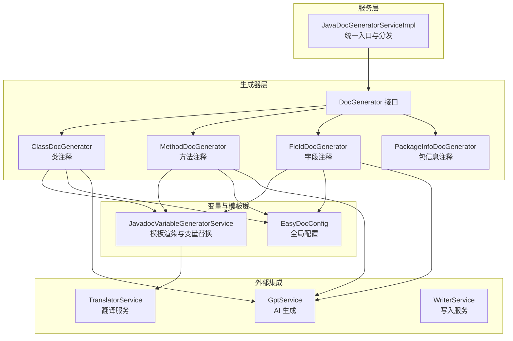
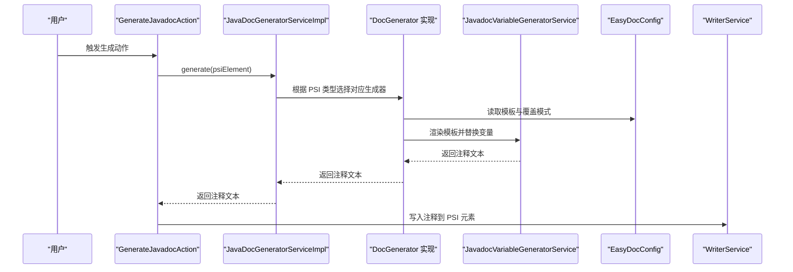
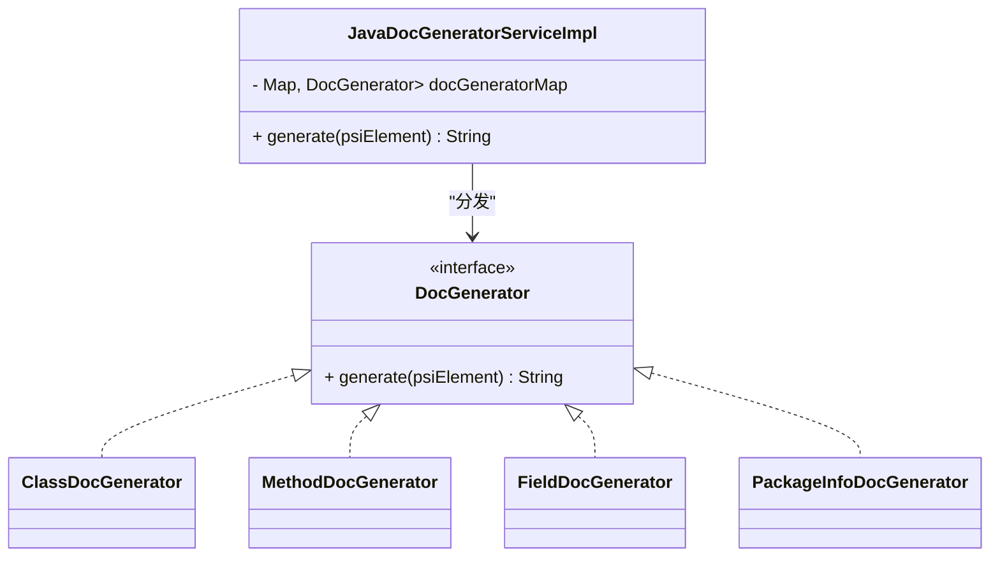
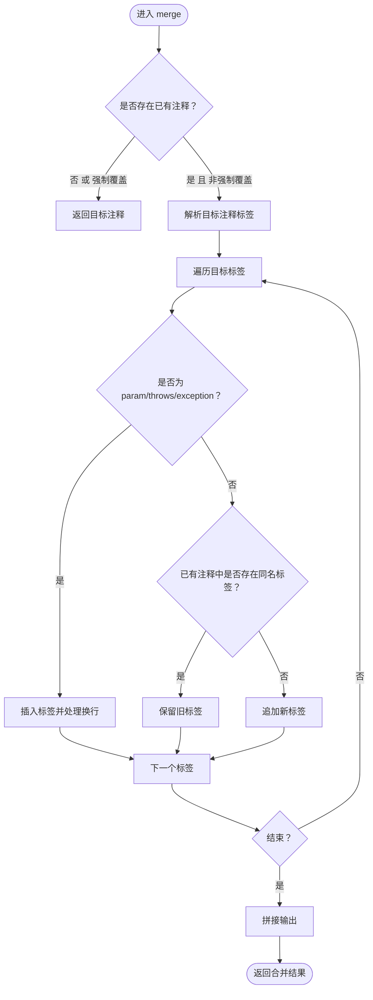
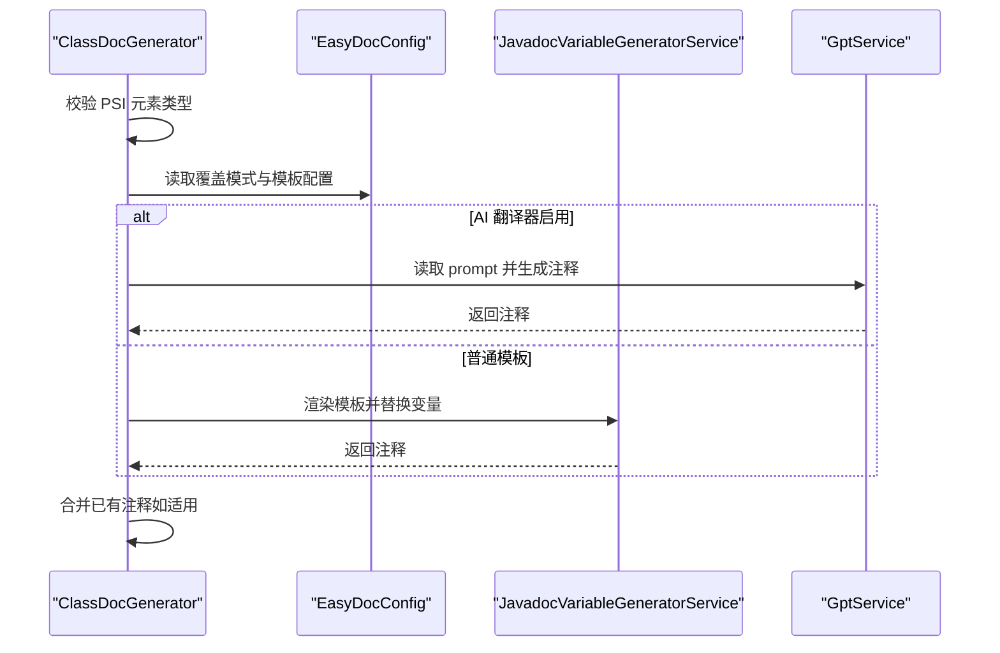
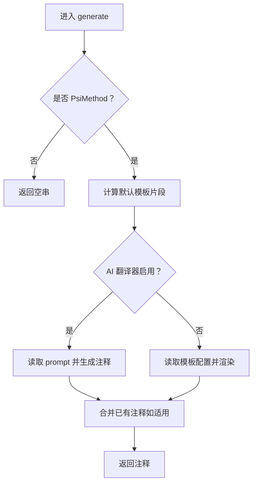
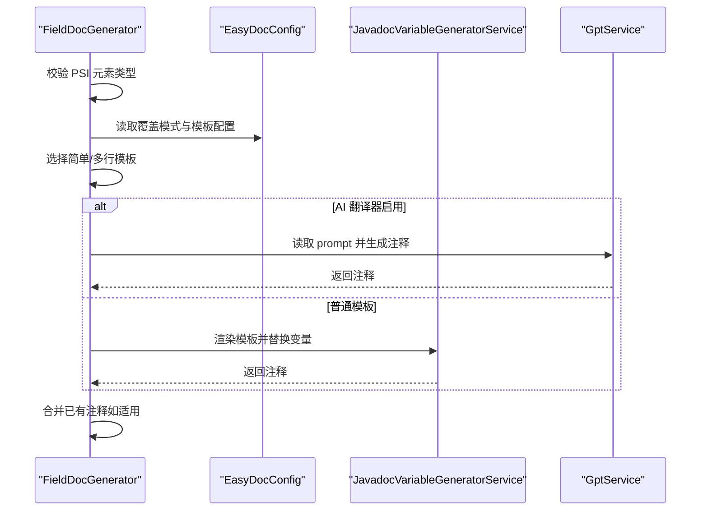
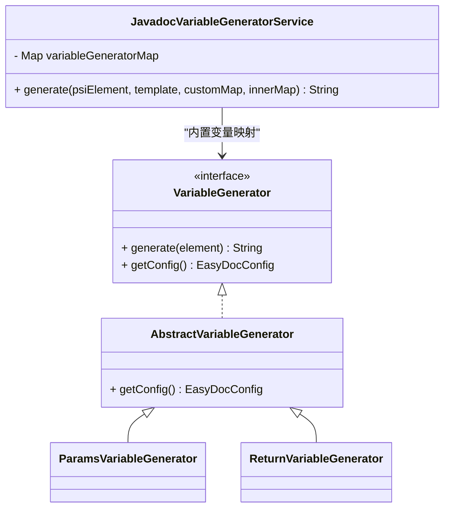
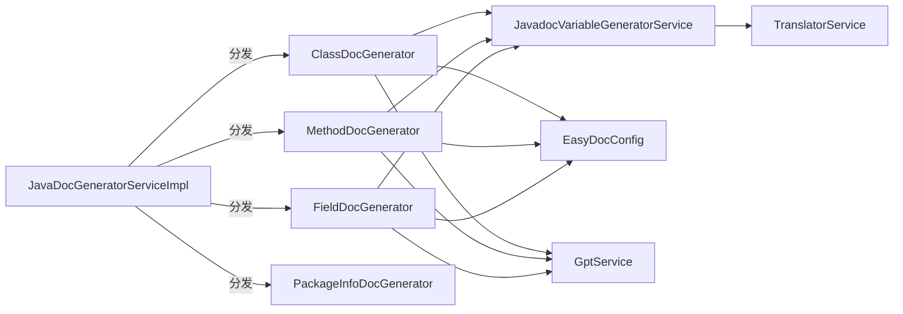

# JavaDoc 注释生成

<cite>
**本文引用的文件**
- [JavaDocGeneratorServiceImpl.java](file://src/main/java/com/star/easydoc/javadoc/service/JavaDocGeneratorServiceImpl.java)
- [DocGenerator.java](file://src/main/java/com/star/easydoc/javadoc/service/generator/DocGenerator.java)
- [AbstractDocGenerator.java](file://src/main/java/com/star/easydoc/javadoc/service/generator/impl/AbstractDocGenerator.java)
- [ClassDocGenerator.java](file://src/main/java/com/star/easydoc/javadoc/service/generator/impl/ClassDocGenerator.java)
- [MethodDocGenerator.java](file://src/main/java/com/star/easydoc/javadoc/service/generator/impl/MethodDocGenerator.java)
- [FieldDocGenerator.java](file://src/main/java/com/star/easydoc/javadoc/service/generator/impl/FieldDocGenerator.java)
- [PackageInfoDocGenerator.java](file://src/main/java/com/star/easydoc/javadoc/service/generator/impl/PackageInfoDocGenerator.java)
- [JavadocVariableGeneratorService.java](file://src/main/java/com/star/easydoc/javadoc/service/variable/JavadocVariableGeneratorService.java)
- [VariableGenerator.java](file://src/main/java/com/star/easydoc/javadoc/service/variable/VariableGenerator.java)
- [AbstractVariableGenerator.java](file://src/main/java/com/star/easydoc/javadoc/service/variable/impl/AbstractVariableGenerator.java)
- [ParamsVariableGenerator.java](file://src/main/java/com/star/easydoc/javadoc/service/variable/impl/ParamsVariableGenerator.java)
- [ReturnVariableGenerator.java](file://src/main/java/com/star/easydoc/javadoc/service/variable/impl/ReturnVariableGenerator.java)
- [EasyDocConfig.java](file://src/main/java/com/star/easydoc/config/EasyDocConfig.java)
- [GenerateJavadocAction.java](file://src/main/java/com/star/easydoc/action/GenerateJavadocAction.java)
- [class.prompt](file://src/main/resources/prompts/chatglm/class.prompt)
- [method.prompt](file://src/main/resources/prompts/chatglm/method.prompt)
- [field.prompt](file://src/main/resources/prompts/chatglm/field.prompt)
- [README.md](file://README.md)
</cite>

## 目录
1. [简介](#简介)
2. [项目结构](#项目结构)
3. [核心组件](#核心组件)
4. [架构总览](#架构总览)
5. [详细组件分析](#详细组件分析)
6. [依赖分析](#依赖分析)
7. [性能考虑](#性能考虑)
8. [故障排查指南](#故障排查指南)
9. [结论](#结论)
10. [附录](#附录)

## 简介
本文件面向 JavaDoc 注释生成功能，系统性阐述服务实现机制与扩展点，重点包括：
- JavaDocGeneratorServiceImpl 的工厂模式设计与 PSI 元素映射关系
- 类、方法、字段、包信息等不同 Java 代码元素的注释生成策略与实现细节
- 单个元素注释生成与批量注释生成的工作流程，涵盖 PSI 元素分析、模板渲染、变量替换等关键步骤
- 使用示例与配置选项，帮助开发者在不同场景下高效使用该功能

## 项目结构
围绕 JavaDoc 生成的核心模块位于 javadoc/service 下，主要分为三部分：
- 服务层：JavaDocGeneratorServiceImpl 提供统一入口，按 PSI 元素类型分发到具体生成器
- 生成器层：DocGenerator 接口及其实现类，分别负责类、方法、字段、包信息的注释生成
- 变量与模板层：JavadocVariableGeneratorService 负责模板占位符解析与变量替换，配合 EasyDocConfig 提供配置项

图表来源
- [JavaDocGeneratorServiceImpl.java:25-48](file://src/main/java/com/star/easydoc/javadoc/service/JavaDocGeneratorServiceImpl.java#L25-L48)
- [DocGenerator.java:11-18](file://src/main/java/com/star/easydoc/javadoc/service/generator/DocGenerator.java#L11-L18)
- [ClassDocGenerator.java:29-68](file://src/main/java/com/star/easydoc/javadoc/service/generator/impl/ClassDocGenerator.java#L29-L68)
- [MethodDocGenerator.java:30-63](file://src/main/java/com/star/easydoc/javadoc/service/generator/impl/MethodDocGenerator.java#L30-L63)
- [FieldDocGenerator.java:28-71](file://src/main/java/com/star/easydoc/javadoc/service/generator/impl/FieldDocGenerator.java#L28-L71)
- [PackageInfoDocGenerator.java:15-25](file://src/main/java/com/star/easydoc/javadoc/service/generator/impl/PackageInfoDocGenerator.java#L15-L25)
- [JavadocVariableGeneratorService.java:35-92](file://src/main/java/com/star/easydoc/javadoc/service/variable/JavadocVariableGeneratorService.java#L35-L92)
- [EasyDocConfig.java:22-680](file://src/main/java/com/star/easydoc/config/EasyDocConfig.java#L22-L680)

章节来源
- [JavaDocGeneratorServiceImpl.java:25-48](file://src/main/java/com/star/easydoc/javadoc/service/JavaDocGeneratorServiceImpl.java#L25-L48)
- [README.md:26-31](file://README.md#L26-L31)

## 核心组件
- JavaDocGeneratorServiceImpl：基于 PSI 元素类型映射到对应 DocGenerator 实现，采用“工厂 + 映射表”的设计，便于扩展新的元素类型
- DocGenerator 接口：定义统一的 generate(PsiElement) 签名，确保各生成器行为一致
- AbstractDocGenerator：提供通用的注释合并逻辑 merge，支持“忽略、智能合并、强制覆盖”三种覆盖模式
- 具体生成器：ClassDocGenerator、MethodDocGenerator、FieldDocGenerator、PackageInfoDocGenerator 分别针对类、方法、字段、包信息生成注释
- JavadocVariableGeneratorService：模板占位符匹配与变量替换，支持内置变量与自定义变量（含 Groovy 表达式）
- EasyDocConfig：集中管理模板配置、覆盖模式、翻译器、返回值样式、批量生成开关等全局参数

章节来源
- [JavaDocGeneratorServiceImpl.java:27-33](file://src/main/java/com/star/easydoc/javadoc/service/JavaDocGeneratorServiceImpl.java#L27-L33)
- [DocGenerator.java:11-18](file://src/main/java/com/star/easydoc/javadoc/service/generator/DocGenerator.java#L11-L18)
- [AbstractDocGenerator.java:29-71](file://src/main/java/com/star/easydoc/javadoc/service/generator/impl/AbstractDocGenerator.java#L29-L71)
- [JavadocVariableGeneratorService.java:42-52](file://src/main/java/com/star/easydoc/javadoc/service/variable/JavadocVariableGeneratorService.java#L42-L52)
- [EasyDocConfig.java:41-44](file://src/main/java/com/star/easydoc/config/EasyDocConfig.java#L41-L44)

## 架构总览
整体工作流从 GenerateJavadocAction 入手，根据 PSI 文件类型调用对应的生成服务；对于 Java 文件，走 JavaDocGeneratorServiceImpl；随后由具体生成器完成模板渲染与变量替换，并通过 WriterService 写回注释。

图表来源
- [GenerateJavadocAction.java:109-154](file://src/main/java/com/star/easydoc/action/GenerateJavadocAction.java#L109-L154)
- [JavaDocGeneratorServiceImpl.java:35-48](file://src/main/java/com/star/easydoc/javadoc/service/JavaDocGeneratorServiceImpl.java#L35-L48)
- [ClassDocGenerator.java:44-68](file://src/main/java/com/star/easydoc/javadoc/service/generator/impl/ClassDocGenerator.java#L44-L68)
- [MethodDocGenerator.java:38-63](file://src/main/java/com/star/easydoc/javadoc/service/generator/impl/MethodDocGenerator.java#L38-L63)
- [FieldDocGenerator.java:42-71](file://src/main/java/com/star/easydoc/javadoc/service/generator/impl/FieldDocGenerator.java#L42-L71)
- [JavadocVariableGeneratorService.java:60-92](file://src/main/java/com/star/easydoc/javadoc/service/variable/JavadocVariableGeneratorService.java#L60-L92)
- [EasyDocConfig.java:648-654](file://src/main/java/com/star/easydoc/config/EasyDocConfig.java#L648-L654)

## 详细组件分析

### 工厂与映射：JavaDocGeneratorServiceImpl
- 设计要点
  - 维护 PSI 元素类型到 DocGenerator 的不可变映射表
  - 在 generate 中按类型匹配，若未命中返回空串
- 扩展方式
  - 新增映射条目即可接入新的 PSI 元素类型
  - 保持 DocGenerator 接口一致性，避免破坏现有行为

图表来源
- [JavaDocGeneratorServiceImpl.java:27-33](file://src/main/java/com/star/easydoc/javadoc/service/JavaDocGeneratorServiceImpl.java#L27-L33)
- [DocGenerator.java:11-18](file://src/main/java/com/star/easydoc/javadoc/service/generator/DocGenerator.java#L11-L18)
- [ClassDocGenerator.java:29](file://src/main/java/com/star/easydoc/javadoc/service/generator/impl/ClassDocGenerator.java#L29)
- [MethodDocGenerator.java:30](file://src/main/java/com/star/easydoc/javadoc/service/generator/impl/MethodDocGenerator.java#L30)
- [FieldDocGenerator.java:28](file://src/main/java/com/star/easydoc/javadoc/service/generator/impl/FieldDocGenerator.java#L28)
- [PackageInfoDocGenerator.java:15](file://src/main/java/com/star/easydoc/javadoc/service/generator/impl/PackageInfoDocGenerator.java#L15)

章节来源
- [JavaDocGeneratorServiceImpl.java:27-48](file://src/main/java/com/star/easydoc/javadoc/service/JavaDocGeneratorServiceImpl.java#L27-L48)

### 抽象与合并：AbstractDocGenerator
- 合并策略
  - 若无已有注释或覆盖模式为“强制覆盖”，直接返回目标注释
  - 否则对目标注释的标签逐个处理，保留已有注释中同名标签，其余追加
  - 对 param/throws/exception 标签做特殊换行与去重处理
- 配置依赖
  - 通过抽象方法获取 EasyDocConfig，从而读取覆盖模式等配置

图表来源
- [AbstractDocGenerator.java:29-71](file://src/main/java/com/star/easydoc/javadoc/service/generator/impl/AbstractDocGenerator.java#L29-L71)
- [EasyDocConfig.java:41-44](file://src/main/java/com/star/easydoc/config/EasyDocConfig.java#L41-L44)

章节来源
- [AbstractDocGenerator.java:29-71](file://src/main/java/com/star/easydoc/javadoc/service/generator/impl/AbstractDocGenerator.java#L29-L71)

### 类注释生成：ClassDocGenerator
- 生成流程
  - 判断是否为 PsiClass，否则返回空串
  - 若覆盖模式为“忽略”且已有注释，直接返回空串
  - 若启用 AI 翻译器，读取模板 prompt 并调用 GptService 生成
  - 否则读取类模板配置，调用 JavadocVariableGeneratorService 渲染模板并合并已有注释
- 内置变量
  - author、className、simpleClassName、branch、projectName

图表来源
- [ClassDocGenerator.java:44-93](file://src/main/java/com/star/easydoc/javadoc/service/generator/impl/ClassDocGenerator.java#L44-L93)
- [class.prompt:1-30](file://src/main/resources/prompts/chatglm/class.prompt#L1-L30)
- [JavadocVariableGeneratorService.java:60-92](file://src/main/java/com/star/easydoc/javadoc/service/variable/JavadocVariableGeneratorService.java#L60-L92)
- [AbstractDocGenerator.java:29-71](file://src/main/java/com/star/easydoc/javadoc/service/generator/impl/AbstractDocGenerator.java#L29-L71)

章节来源
- [ClassDocGenerator.java:44-116](file://src/main/java/com/star/easydoc/javadoc/service/generator/impl/ClassDocGenerator.java#L44-L116)
- [class.prompt:1-30](file://src/main/resources/prompts/chatglm/class.prompt#L1-L30)

### 方法注释生成：MethodDocGenerator
- 生成流程
  - 判断是否为 PsiMethod，否则返回空串
  - 动态决定默认模板是否包含 $PARAMS$/$RETURN$/$THROWS$
  - 若启用 AI 翻译器，读取模板 prompt 并调用 GptService 生成
  - 否则读取方法模板配置，调用 JavadocVariableGeneratorService 渲染模板并合并已有注释
- 内置变量
  - author、methodName、methodReturnType、methodParamTypes、methodParamNames、branch、projectName

图表来源
- [MethodDocGenerator.java:38-137](file://src/main/java/com/star/easydoc/javadoc/service/generator/impl/MethodDocGenerator.java#L38-L137)
- [method.prompt:1-31](file://src/main/resources/prompts/chatglm/method.prompt#L1-L31)
- [JavadocVariableGeneratorService.java:60-92](file://src/main/java/com/star/easydoc/javadoc/service/variable/JavadocVariableGeneratorService.java#L60-L92)
- [AbstractDocGenerator.java:29-71](file://src/main/java/com/star/easydoc/javadoc/service/generator/impl/AbstractDocGenerator.java#L29-L71)

章节来源
- [MethodDocGenerator.java:38-138](file://src/main/java/com/star/easydoc/javadoc/service/generator/impl/MethodDocGenerator.java#L38-L138)
- [method.prompt:1-31](file://src/main/resources/prompts/chatglm/method.prompt#L1-L31)

### 字段注释生成：FieldDocGenerator
- 生成流程
  - 判断是否为 PsiField，否则返回空串
  - 根据配置选择简单模板或多行模板
  - 若启用 AI 翻译器，读取模板 prompt 并调用 GptService 生成
  - 否则读取字段模板配置，调用 JavadocVariableGeneratorService 渲染模板并合并已有注释
- 内置变量
  - author、fieldName、fieldType、branch、projectName

图表来源
- [FieldDocGenerator.java:42-111](file://src/main/java/com/star/easydoc/javadoc/service/generator/impl/FieldDocGenerator.java#L42-L111)
- [field.prompt:1-20](file://src/main/resources/prompts/chatglm/field.prompt#L1-L20)
- [JavadocVariableGeneratorService.java:60-92](file://src/main/java/com/star/easydoc/javadoc/service/variable/JavadocVariableGeneratorService.java#L60-L92)
- [AbstractDocGenerator.java:29-71](file://src/main/java/com/star/easydoc/javadoc/service/generator/impl/AbstractDocGenerator.java#L29-L71)

章节来源
- [FieldDocGenerator.java:42-111](file://src/main/java/com/star/easydoc/javadoc/service/generator/impl/FieldDocGenerator.java#L42-L111)
- [field.prompt:1-20](file://src/main/resources/prompts/chatglm/field.prompt#L1-L20)

### 包信息注释生成：PackageInfoDocGenerator
- 生成策略
  - 仅处理 PsiPackage，返回默认模板，其中占位符指向 PackageInfoService 的描述键
- 适用场景
  - 选中目录或 package-info.java 文件时，自动生成包注释并写入

章节来源
- [PackageInfoDocGenerator.java:17-37](file://src/main/java/com/star/easydoc/javadoc/service/generator/impl/PackageInfoDocGenerator.java#L17-L37)

### 模板与变量：JavadocVariableGeneratorService
- 模板渲染
  - 使用正则匹配 $占位符$，优先使用内置变量生成器，否则回退到自定义变量
  - 支持自定义变量类型：固定字符串、Groovy 脚本（异常时记录日志并回退）
- 内置变量生成器
  - author、date、doc、params、return、see、since、throws、version
- 自定义变量
  - 支持 STRING 与 GROOVY 两种类型，Groovy 可访问内部变量映射

图表来源
- [JavadocVariableGeneratorService.java:42-52](file://src/main/java/com/star/easydoc/javadoc/service/variable/JavadocVariableGeneratorService.java#L42-L52)
- [VariableGenerator.java:12-26](file://src/main/java/com/star/easydoc/javadoc/service/variable/VariableGenerator.java#L12-L26)
- [AbstractVariableGenerator.java:14-19](file://src/main/java/com/star/easydoc/javadoc/service/variable/impl/AbstractVariableGenerator.java#L14-L19)
- [ParamsVariableGenerator.java:27-83](file://src/main/java/com/star/easydoc/javadoc/service/variable/impl/ParamsVariableGenerator.java#L27-L83)
- [ReturnVariableGenerator.java:16-45](file://src/main/java/com/star/easydoc/javadoc/service/variable/impl/ReturnVariableGenerator.java#L16-L45)

章节来源
- [JavadocVariableGeneratorService.java:60-126](file://src/main/java/com/star/easydoc/javadoc/service/variable/JavadocVariableGeneratorService.java#L60-L126)
- [ParamsVariableGenerator.java:30-83](file://src/main/java/com/star/easydoc/javadoc/service/variable/impl/ParamsVariableGenerator.java#L30-L83)
- [ReturnVariableGenerator.java:19-45](file://src/main/java/com/star/easydoc/javadoc/service/variable/impl/ReturnVariableGenerator.java#L19-L45)

### 配置：EasyDocConfig
- 覆盖模式
  - 忽略、智能合并、强制覆盖
- 模板配置
  - 类、方法、字段分别维护 TemplateConfig，支持默认模板与自定义模板
- 返回值样式
  - code/link/doc 三种模式，影响 @return 标签生成
- 批量生成开关
  - 控制是否生成类/方法/字段注释以及是否递归内部类
- 其他
  - 作者、日期格式、翻译器、超时、单词映射、项目级单词映射等

章节来源
- [EasyDocConfig.java:41-44](file://src/main/java/com/star/easydoc/config/EasyDocConfig.java#L41-L44)
- [EasyDocConfig.java:211-254](file://src/main/java/com/star/easydoc/config/EasyDocConfig.java#L211-L254)
- [EasyDocConfig.java:553-574](file://src/main/java/com/star/easydoc/config/EasyDocConfig.java#L553-L574)
- [EasyDocConfig.java:576-606](file://src/main/java/com/star/easydoc/config/EasyDocConfig.java#L576-L606)

### 批量注释生成工作流
- 触发条件
  - 选中类并按下“生成全部”快捷键
- 处理流程
  - GenerateJavadocAction 检测 PSI 文件类型，Java 文件走 JavaDocGeneratorServiceImpl
  - 依据 EasyDocConfig 的批量生成开关，遍历目标元素（类/方法/字段），逐个调用 generate 并写入
- 注意事项
  - 覆盖模式会影响是否跳过已有注释
  - 模板配置可针对不同元素类型独立定制

章节来源
- [GenerateJavadocAction.java:109-154](file://src/main/java/com/star/easydoc/action/GenerateJavadocAction.java#L109-L154)
- [EasyDocConfig.java:576-606](file://src/main/java/com/star/easydoc/config/EasyDocConfig.java#L576-L606)

## 依赖分析
- 组件内聚与耦合
  - JavaDocGeneratorServiceImpl 与 DocGenerator 实现松耦合，通过映射表解耦
  - 具体生成器依赖 JavadocVariableGeneratorService 与 EasyDocConfig，形成清晰的职责边界
- 外部依赖
  - GptService（AI 生成）、TranslatorService（翻译）、WriterService（写入）
- 潜在循环依赖
  - 未发现直接循环依赖；生成器通过服务管理器获取配置与工具，避免静态依赖

图表来源
- [JavaDocGeneratorServiceImpl.java:27-33](file://src/main/java/com/star/easydoc/javadoc/service/JavaDocGeneratorServiceImpl.java#L27-L33)
- [ClassDocGenerator.java:31-34](file://src/main/java/com/star/easydoc/javadoc/service/generator/impl/ClassDocGenerator.java#L31-L34)
- [MethodDocGenerator.java:32-36](file://src/main/java/com/star/easydoc/javadoc/service/generator/impl/MethodDocGenerator.java#L32-L36)
- [FieldDocGenerator.java:29-33](file://src/main/java/com/star/easydoc/javadoc/service/generator/impl/FieldDocGenerator.java#L29-L33)
- [JavadocVariableGeneratorService.java:35](file://src/main/java/com/star/easydoc/javadoc/service/variable/JavadocVariableGeneratorService.java#L35)

章节来源
- [JavaDocGeneratorServiceImpl.java:27-33](file://src/main/java/com/star/easydoc/javadoc/service/JavaDocGeneratorServiceImpl.java#L27-L33)
- [ClassDocGenerator.java:31-34](file://src/main/java/com/star/easydoc/javadoc/service/generator/impl/ClassDocGenerator.java#L31-L34)
- [MethodDocGenerator.java:32-36](file://src/main/java/com/star/easydoc/javadoc/service/generator/impl/MethodDocGenerator.java#L32-L36)
- [FieldDocGenerator.java:29-33](file://src/main/java/com/star/easydoc/javadoc/service/generator/impl/FieldDocGenerator.java#L29-L33)

## 性能考虑
- 模板渲染
  - 正则匹配与字符串替换为 O(n) 操作，建议控制模板长度与复杂度
- 变量替换
  - 内置变量生成器开销较低；Groovy 脚本执行需谨慎，避免复杂逻辑
- 覆盖模式
  - “智能合并”会解析已有注释并进行标签比对，建议在批量生成时合理设置覆盖模式
- 翻译与 AI
  - 网络请求成本较高，建议合理设置超时与缓存策略（由翻译服务与 GPT 服务负责）

## 故障排查指南
- 快捷键无效
  - 确认光标位于类名、方法名或属性名上，而非选中文本区域
  - 检查 IDE 快捷键是否与其他插件冲突
- 注释未生成或被覆盖
  - 检查覆盖模式配置（忽略/智能合并/强制覆盖）
  - 若已有注释，确认是否被“智能合并”保留
- 模板变量未替换
  - 检查自定义变量类型与 Groovy 语法
  - 确认占位符大小写与模板一致
- AI 生成失败
  - 检查 AI 接口密钥与网络连通性
  - 查看日志中 Groovy 执行异常（如有）

章节来源
- [README.md:77-84](file://README.md#L77-L84)
- [JavadocVariableGeneratorService.java:115-121](file://src/main/java/com/star/easydoc/javadoc/service/variable/JavadocVariableGeneratorService.java#L115-L121)

## 结论
本实现以工厂映射为核心，结合抽象合并策略与灵活的模板变量系统，实现了对类、方法、字段、包信息的统一注释生成能力。通过 EasyDocConfig 的集中配置与覆盖模式，开发者可在不同场景下平衡“保留已有注释”与“批量覆盖”的需求。配合翻译与 AI 生成，进一步提升注释质量与效率。

## 附录
- 使用示例
  - 单个元素：将光标置于类/方法/字段上，按下快捷键生成注释
  - 批量生成：选中类后按下“生成全部”快捷键，按配置生成类/方法/字段注释
- 配置选项
  - 覆盖模式：忽略、智能合并、强制覆盖
  - 模板配置：类/方法/字段分别可配置默认模板与自定义模板
  - 返回值样式：code/link/doc 三种模式
  - 批量生成开关：控制是否生成类/方法/字段注释以及是否递归内部类
  - 翻译器与超时：支持多种翻译服务与自定义超时

章节来源
- [README.md:26-31](file://README.md#L26-L31)
- [EasyDocConfig.java:41-44](file://src/main/java/com/star/easydoc/config/EasyDocConfig.java#L41-L44)
- [EasyDocConfig.java:211-254](file://src/main/java/com/star/easydoc/config/EasyDocConfig.java#L211-L254)
- [EasyDocConfig.java:553-574](file://src/main/java/com/star/easydoc/config/EasyDocConfig.java#L553-L574)
- [EasyDocConfig.java:576-606](file://src/main/java/com/star/easydoc/config/EasyDocConfig.java#L576-L606)