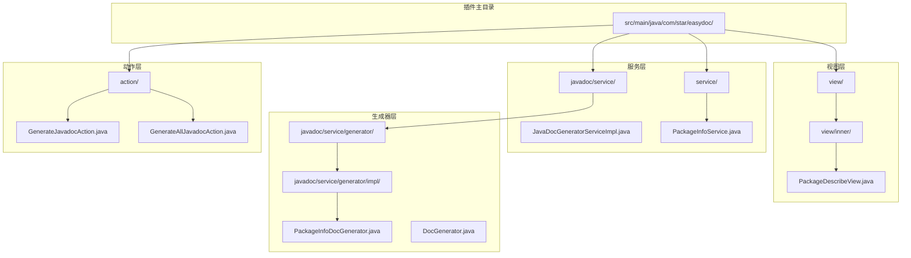
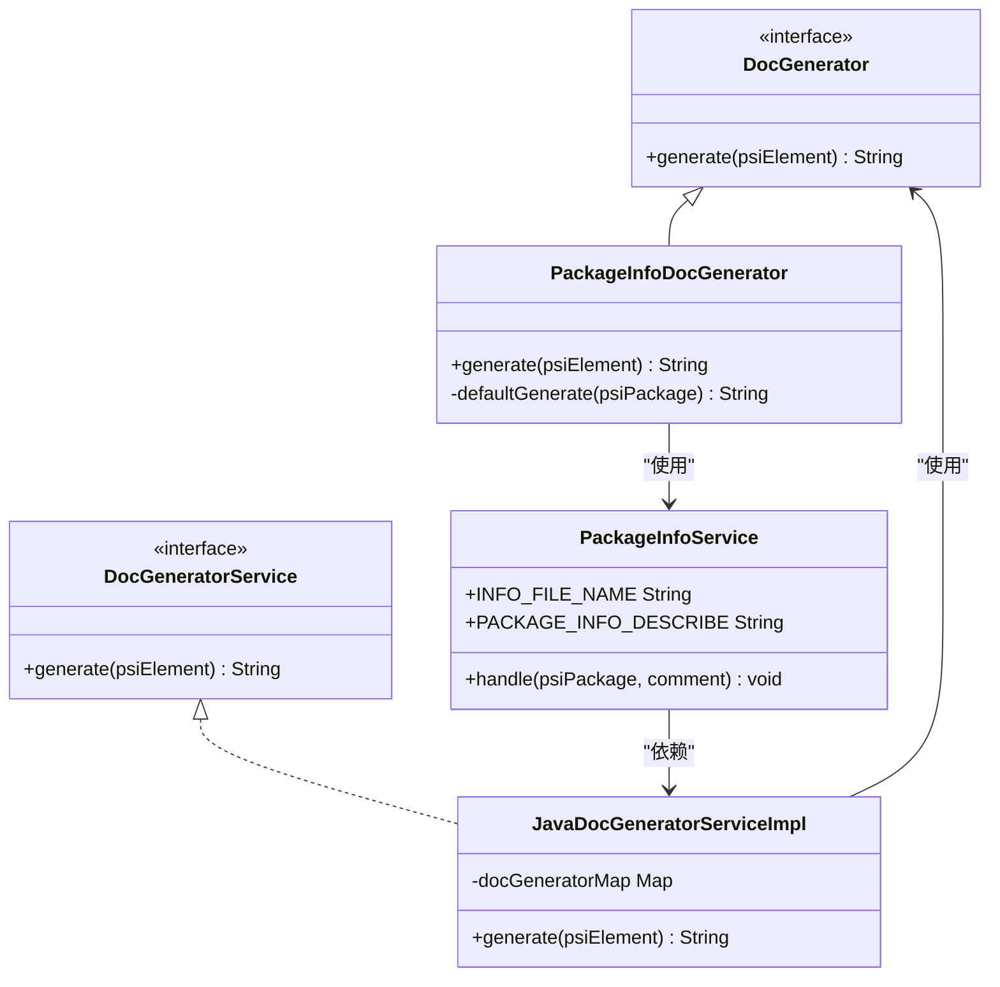
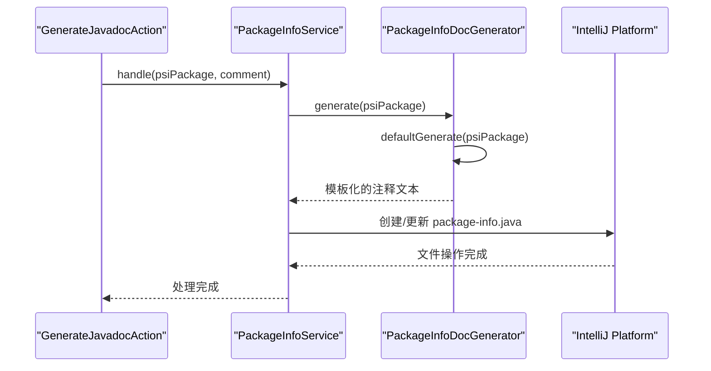
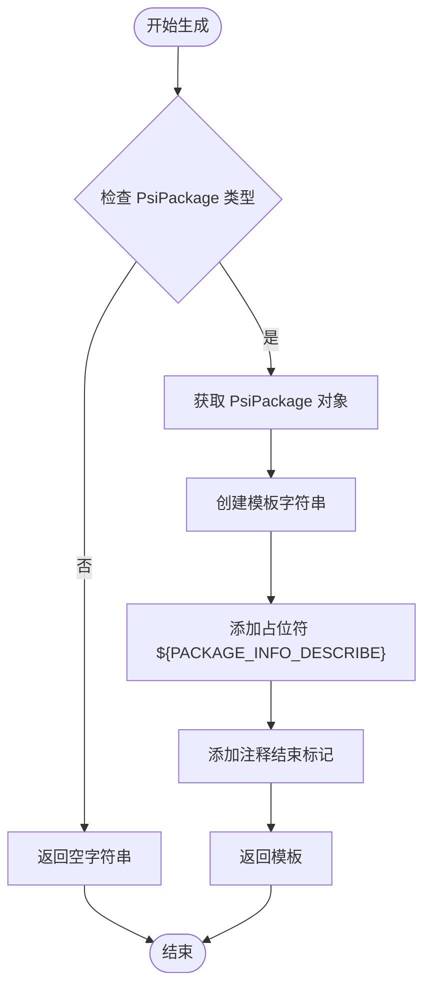
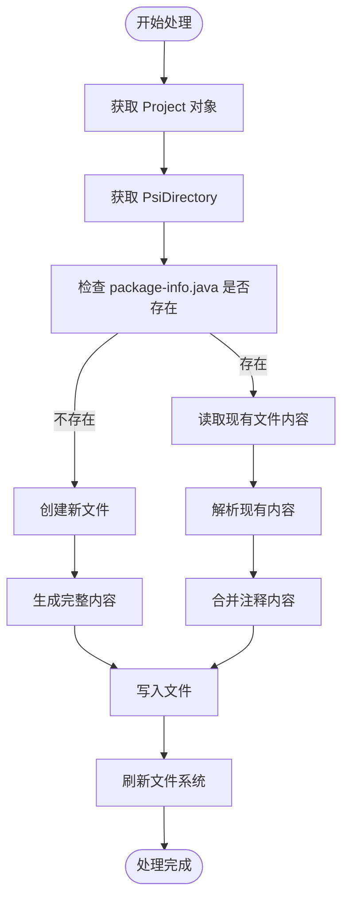
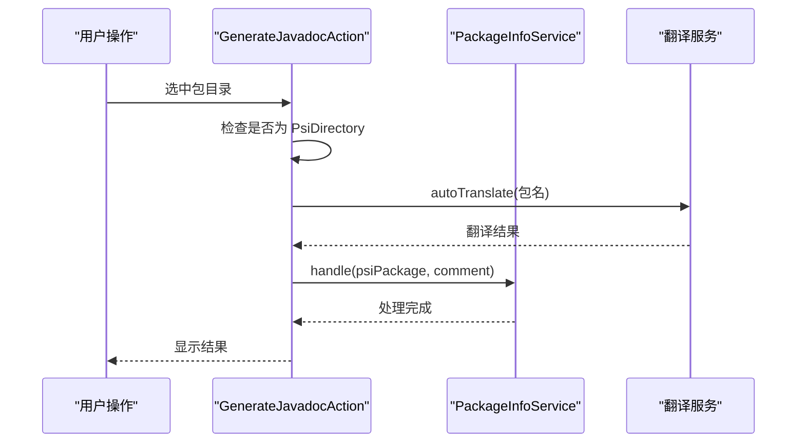
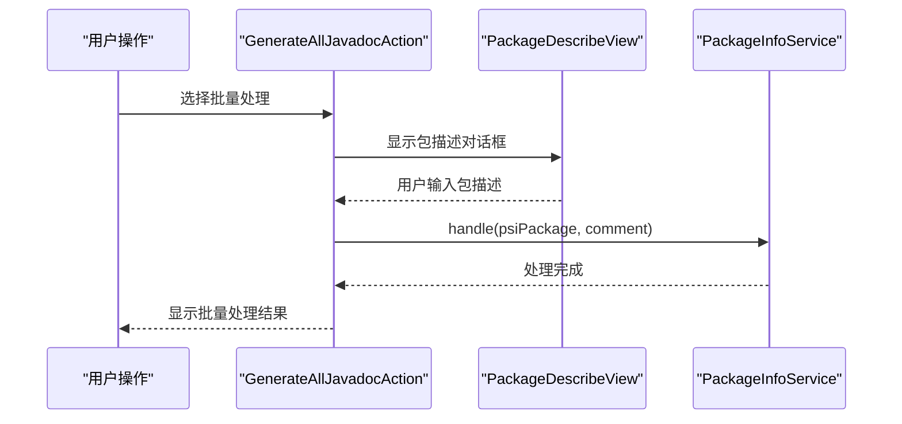
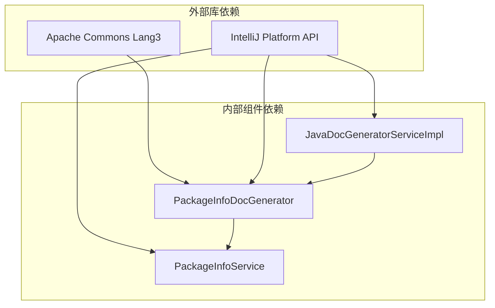

# 包信息文档生成器

<cite>
**本文档引用的文件**
- [PackageInfoDocGenerator.java](file://src/main/java/com/star/easydoc/javadoc/service/generator/impl/PackageInfoDocGenerator.java)
- [PackageInfoService.java](file://src/main/java/com/star/easydoc/service/PackageInfoService.java)
- [JavaDocGeneratorServiceImpl.java](file://src/main/java/com/star/easydoc/javadoc/service/JavaDocGeneratorServiceImpl.java)
- [DocGenerator.java](file://src/main/java/com/star/easydoc/javadoc/service/generator/DocGenerator.java)
- [DocGeneratorService.java](file://src/main/java/com/star/easydoc/service/DocGeneratorService.java)
- [GenerateJavadocAction.java](file://src/main/java/com/star/easydoc/action/GenerateJavadocAction.java)
- [GenerateAllJavadocAction.java](file://src/main/java/com/star/easydoc/action/GenerateAllJavadocAction.java)
- [PackageDescribeView.java](file://src/main/java/com/star/easydoc/view/inner/PackageDescribeView.java)
- [VersionVariableGenerator.java](file://src/main/java/com/star/easydoc/javadoc/service/variable/impl/VersionVariableGenerator.java)
- [StringUtil.java](file://src/main/java/com/star/easydoc/common/util/StringUtil.java)
- [README.md](file://README.md)
</cite>

## 目录
1. [简介](#简介)
2. [项目结构](#项目结构)
3. [核心组件](#核心组件)
4. [架构概览](#架构概览)
5. [详细组件分析](#详细组件分析)
6. [依赖关系分析](#依赖关系分析)
7. [性能考虑](#性能考虑)
8. [故障排除指南](#故障排除指南)
9. [结论](#结论)
10. [附录](#附录)

## 简介

包信息文档生成器是 Easy Javadoc 插件中的一个专门组件，用于为 Java 包创建和管理 `package-info.java` 文件。该组件实现了对 PsiPackage 元素的处理，能够自动生成包级别的 Javadoc 注释，并将其嵌入到相应的包信息文件中。

该生成器支持以下核心功能：
- 处理 PsiPackage 元素并生成对应的包信息注释
- 创建或更新 `package-info.java` 文件
- 模板化的注释生成策略
- 包名解析和版本信息处理
- 模块信息识别和管理

## 项目结构

Easy Javadoc 插件采用分层架构设计，包信息文档生成器位于以下层次结构中：



**图表来源**
- [PackageInfoDocGenerator.java:1-39](file://src/main/java/com/star/easydoc/javadoc/service/generator/impl/PackageInfoDocGenerator.java#L1-L39)
- [JavaDocGeneratorServiceImpl.java:1-50](file://src/main/java/com/star/easydoc/javadoc/service/JavaDocGeneratorServiceImpl.java#L1-L50)
- [PackageInfoService.java:1-90](file://src/main/java/com/star/easydoc/service/PackageInfoService.java#L1-L90)

**章节来源**
- [PackageInfoDocGenerator.java:1-39](file://src/main/java/com/star/easydoc/javadoc/service/generator/impl/PackageInfoDocGenerator.java#L1-L39)
- [JavaDocGeneratorServiceImpl.java:1-50](file://src/main/java/com/star/easydoc/javadoc/service/JavaDocGeneratorServiceImpl.java#L1-L50)
- [PackageInfoService.java:1-90](file://src/main/java/com/star/easydoc/service/PackageInfoService.java#L1-L90)

## 核心组件

包信息文档生成器系统由以下核心组件构成：

### 主要组件职责

1. **PackageInfoDocGenerator**: 实现包信息注释的生成逻辑
2. **PackageInfoService**: 处理包信息文件的创建和更新
3. **JavaDocGeneratorServiceImpl**: 管理文档生成器的注册和调用
4. **DocGenerator 接口**: 定义文档生成的标准接口
5. **DocGeneratorService 接口**: 提供统一的文档生成服务

### 组件交互关系



**图表来源**
- [DocGenerator.java:1-20](file://src/main/java/com/star/easydoc/javadoc/service/generator/DocGenerator.java#L1-L20)
- [PackageInfoDocGenerator.java:1-39](file://src/main/java/com/star/easydoc/javadoc/service/generator/impl/PackageInfoDocGenerator.java#L1-L39)
- [DocGeneratorService.java:1-21](file://src/main/java/com/star/easydoc/service/DocGeneratorService.java#L1-L21)
- [JavaDocGeneratorServiceImpl.java:1-50](file://src/main/java/com/star/easydoc/javadoc/service/JavaDocGeneratorServiceImpl.java#L1-L50)
- [PackageInfoService.java:1-90](file://src/main/java/com/star/easydoc/service/PackageInfoService.java#L1-L90)

**章节来源**
- [DocGenerator.java:1-20](file://src/main/java/com/star/easydoc/javadoc/service/generator/DocGenerator.java#L1-L20)
- [PackageInfoDocGenerator.java:1-39](file://src/main/java/com/star/easydoc/javadoc/service/generator/impl/PackageInfoDocGenerator.java#L1-L39)
- [DocGeneratorService.java:1-21](file://src/main/java/com/star/easydoc/service/DocGeneratorService.java#L1-L21)
- [JavaDocGeneratorServiceImpl.java:1-50](file://src/main/java/com/star/easydoc/javadoc/service/JavaDocGeneratorServiceImpl.java#L1-L50)
- [PackageInfoService.java:1-90](file://src/main/java/com/star/easydoc/service/PackageInfoService.java#L1-L90)

## 架构概览

包信息文档生成器采用工厂模式和策略模式相结合的设计，通过统一的服务接口管理不同的文档生成器。

### 整体架构流程



**图表来源**
- [GenerateJavadocAction.java:126-151](file://src/main/java/com/star/easydoc/action/GenerateJavadocAction.java#L126-L151)
- [PackageInfoService.java:33-87](file://src/main/java/com/star/easydoc/service/PackageInfoService.java#L33-L87)
- [PackageInfoDocGenerator.java:17-37](file://src/main/java/com/star/easydoc/javadoc/service/generator/impl/PackageInfoDocGenerator.java#L17-L37)

### 模板生成策略

包信息文档生成器使用模板化的注释生成策略，通过占位符机制实现灵活的内容替换：



**图表来源**
- [PackageInfoDocGenerator.java:18-37](file://src/main/java/com/star/easydoc/javadoc/service/generator/impl/PackageInfoDocGenerator.java#L18-L37)

**章节来源**
- [PackageInfoDocGenerator.java:1-39](file://src/main/java/com/star/easydoc/javadoc/service/generator/impl/PackageInfoDocGenerator.java#L1-L39)
- [PackageInfoService.java:33-87](file://src/main/java/com/star/easydoc/service/PackageInfoService.java#L33-L87)

## 详细组件分析

### PackageInfoDocGenerator 组件

PackageInfoDocGenerator 是包信息文档生成器的核心实现，负责处理 PsiPackage 元素并生成相应的注释模板。

#### 核心实现机制

1. **类型检查**: 验证输入的 PsiElement 是否为 PsiPackage 类型
2. **模板生成**: 使用预定义的模板结构生成注释框架
3. **占位符处理**: 通过 `${PACKAGE_INFO_DESCRIBE}` 占位符实现动态内容注入

#### 关键方法分析

```mermaid
classDiagram
class PackageInfoDocGenerator {
+generate(psiElement) String
-defaultGenerate(psiPackage) String
}
note for PackageInfoDocGenerator : "实现 DocGenerator 接口\n处理 PsiPackage 元素\n生成包信息注释模板"
```

**图表来源**
- [PackageInfoDocGenerator.java:15-37](file://src/main/java/com/star/easydoc/javadoc/service/generator/impl/PackageInfoDocGenerator.java#L15-L37)

**章节来源**
- [PackageInfoDocGenerator.java:15-37](file://src/main/java/com/star/easydoc/javadoc/service/generator/impl/PackageInfoDocGenerator.java#L15-L37)

### PackageInfoService 组件

PackageInfoService 负责包信息文件的实际创建和更新操作，是连接模板生成和文件系统的桥梁。

#### 文件处理流程



**图表来源**
- [PackageInfoService.java:33-87](file://src/main/java/com/star/easydoc/service/PackageInfoService.java#L33-L87)

#### 文件创建和更新策略

1. **文件检测**: 检查目标包目录下是否存在 `package-info.java` 文件
2. **文件创建**: 如果文件不存在，创建新的包信息文件
3. **内容合并**: 如果文件已存在，合并新的注释内容到现有文件中
4. **注释定位**: 通过查找 `/**` 标记来精确定位注释位置

**章节来源**
- [PackageInfoService.java:33-87](file://src/main/java/com/star/easydoc/service/PackageInfoService.java#L33-L87)

### JavaDocGeneratorServiceImpl 组件

JavaDocGeneratorServiceImpl 作为文档生成服务的实现类，负责管理各种文档生成器的注册和调用。

#### 生成器注册机制

```mermaid
graph LR
subgraph "生成器映射"
A[PsiClass.class] --> B[ClassDocGenerator]
C[PsiMethod.class] --> D[MethodDocGenerator]
E[PsiField.class] --> F[FieldDocGenerator]
G[PsiPackage.class] --> H[PackageInfoDocGenerator]
end
subgraph "调用流程"
I[generate(psiElement)] --> J{查找匹配的生成器}
J --> K[返回对应生成器]
K --> L[执行生成逻辑]
end
```

**图表来源**
- [JavaDocGeneratorServiceImpl.java:27-48](file://src/main/java/com/star/easydoc/javadoc/service/JavaDocGeneratorServiceImpl.java#L27-L48)

**章节来源**
- [JavaDocGeneratorServiceImpl.java:25-49](file://src/main/java/com/star/easydoc/javadoc/service/JavaDocGeneratorServiceImpl.java#L25-L49)

### 动作触发机制

包信息文档生成器通过 IntelliJ IDEA 的动作系统触发，主要涉及以下两个核心动作：

#### 单个包处理



**图表来源**
- [GenerateJavadocAction.java:126-140](file://src/main/java/com/star/easydoc/action/GenerateJavadocAction.java#L126-L140)

#### 批量包处理



**图表来源**
- [GenerateAllJavadocAction.java:99-121](file://src/main/java/com/star/easydoc/action/GenerateAllJavadocAction.java#L99-L121)
- [PackageDescribeView.java:34-47](file://src/main/java/com/star/easydoc/view/inner/PackageDescribeView.java#L34-L47)

**章节来源**
- [GenerateJavadocAction.java:126-151](file://src/main/java/com/star/easydoc/action/GenerateJavadocAction.java#L126-L151)
- [GenerateAllJavadocAction.java:99-121](file://src/main/java/com/star/easydoc/action/GenerateAllJavadocAction.java#L99-L121)
- [PackageDescribeView.java:17-75](file://src/main/java/com/star/easydoc/view/inner/PackageDescribeView.java#L17-L75)

## 依赖关系分析

包信息文档生成器的依赖关系相对简单，主要依赖于 IntelliJ IDEA 的 PSI API 和 Apache Commons Lang 库。

### 外部依赖



**图表来源**
- [PackageInfoDocGenerator.java:3-7](file://src/main/java/com/star/easydoc/javadoc/service/generator/impl/PackageInfoDocGenerator.java#L3-L7)
- [PackageInfoService.java:3-14](file://src/main/java/com/star/easydoc/service/PackageInfoService.java#L3-L14)

### 内部组件耦合

组件间的耦合度较低，遵循了单一职责原则：

1. **PackageInfoDocGenerator**: 专注于模板生成
2. **PackageInfoService**: 专注于文件操作
3. **JavaDocGeneratorServiceImpl**: 专注于生成器管理

这种设计使得每个组件职责明确，便于维护和扩展。

**章节来源**
- [PackageInfoDocGenerator.java:3-7](file://src/main/java/com/star/easydoc/javadoc/service/generator/impl/PackageInfoDocGenerator.java#L3-L7)
- [PackageInfoService.java:3-14](file://src/main/java/com/star/easydoc/service/PackageInfoService.java#L3-L14)
- [JavaDocGeneratorServiceImpl.java:7-19](file://src/main/java/com/star/easydoc/javadoc/service/JavaDocGeneratorServiceImpl.java#L7-L19)

## 性能考虑

包信息文档生成器在设计时充分考虑了性能因素：

### 内存使用优化

1. **字符串处理**: 使用 `StringBuilder` 进行字符串拼接，避免频繁的字符串对象创建
2. **流式读取**: 对于现有文件的读取使用流式处理，减少内存占用
3. **延迟初始化**: 生成器映射使用不可变集合，避免重复创建

### I/O 操作优化

1. **批量处理**: 支持批量处理多个包，减少文件系统操作次数
2. **增量更新**: 对现有文件进行增量更新而非完全重写
3. **异步操作**: 使用 `WriteCommandAction` 进行异步文件写入

### 缓存策略

虽然包信息文档生成器本身不实现复杂的缓存机制，但可以通过以下方式优化性能：
- 利用 IntelliJ IDEA 的内置缓存机制
- 合理使用 `VirtualFileManager.refreshWithoutFileWatcher` 减少不必要的文件系统扫描

## 故障排除指南

### 常见问题及解决方案

#### 1. 包信息文件未正确创建

**问题症状**: 选中包目录后未生成 `package-info.java` 文件

**可能原因**:
- 目标包目录权限不足
- IntelliJ IDEA 缓存问题
- PSI 元素类型识别错误

**解决步骤**:
1. 检查包目录的读写权限
2. 清理 IntelliJ IDEA 缓存并重启
3. 验证 `psiElement instanceof PsiPackage` 条件

#### 2. 注释内容未正确嵌入

**问题症状**: `package-info.java` 文件创建成功但注释内容缺失

**可能原因**:
- 模板占位符替换失败
- 文件写入操作异常
- 字符编码问题

**解决步骤**:
1. 检查 `${PACKAGE_INFO_DESCRIBE}` 占位符是否正确替换
2. 验证文件写入操作的日志输出
3. 确认 UTF-8 字符编码设置

#### 3. 批量处理失败

**问题症状**: 批量处理多个包时部分包处理失败

**可能原因**:
- 某些包的名称包含特殊字符
- 文件系统权限问题
- 翻译服务调用超时

**解决步骤**:
1. 检查包名称的合法性
2. 分别测试每个包的处理情况
3. 查看翻译服务的错误日志

### 调试技巧

1. **启用详细日志**: 在开发模式下查看详细的错误日志
2. **断点调试**: 在关键方法处设置断点观察变量状态
3. **单元测试**: 为关键功能编写单元测试验证行为

**章节来源**
- [PackageInfoService.java:43-87](file://src/main/java/com/star/easydoc/service/PackageInfoService.java#L43-L87)

## 结论

包信息文档生成器是一个设计精良的组件，它成功地将模板生成、文件操作和用户交互有机结合在一起。通过采用清晰的分层架构和单一职责原则，该组件具有良好的可维护性和扩展性。

### 主要优势

1. **架构清晰**: 采用分层设计，职责分离明确
2. **易于扩展**: 通过接口抽象支持新的文档生成器
3. **性能优化**: 采用流式处理和异步操作提升性能
4. **用户体验**: 提供直观的批量处理界面

### 改进建议

1. **增强错误处理**: 添加更详细的错误信息和恢复机制
2. **增加配置选项**: 允许用户自定义模板和生成策略
3. **性能监控**: 添加性能指标收集和分析功能
4. **国际化支持**: 支持多语言的包信息注释生成

## 附录

### 使用示例

#### 示例1: 单个包处理

```java
// 选中包目录后触发
GenerateJavadocAction action = new GenerateJavadocAction();
action.actionPerformed(event);
// 自动生成 package-info.java 文件
```

#### 示例2: 批量包处理

```java
// 批量处理多个包
GenerateAllJavadocAction action = new GenerateAllJavadocAction();
action.actionPerformed(event);
// 弹出对话框让用户输入包描述
PackageDescribeView view = new PackageDescribeView(packageMap);
view.showAndGet();
```

#### 示例3: 自定义模板

```java
// 修改包信息模板
PackageInfoDocGenerator generator = new PackageInfoDocGenerator();
String template = generator.defaultGenerate(psiPackage);
// 替换占位符内容
String customContent = template.replace("${PACKAGE_INFO_DESCRIBE}", customDescription);
```

### 配置选项

| 配置项 | 默认值 | 说明 |
|--------|--------|------|
| `INFO_FILE_NAME` | `"package-info.java"` | 包信息文件名 |
| `PACKAGE_INFO_DESCRIBE` | `"PACKAGE_INFO_DESCRIBE"` | 注释描述占位符 |
| `genAllClass` | `true` | 批量生成是否包含类注释 |
| `genAllMethod` | `true` | 批量生成是否包含方法注释 |
| `genAllField` | `true` | 批量生成是否包含属性注释 |

### 相关资源

- **IntelliJ IDEA 插件开发文档**: https://plugins.jetbrains.com/docs/intellij/welcome.html
- **PSI API 参考**: https://plugins.jetbrains.com/docs/intellij/psi.html
- **Apache Commons Lang**: https://commons.apache.org/proper/commons-lang/

**章节来源**
- [README.md:176-178](file://README.md#L176-L178)
- [PackageInfoDocGenerator.java:23-36](file://src/main/java/com/star/easydoc/javadoc/service/generator/impl/PackageInfoDocGenerator.java#L23-L36)
- [PackageInfoService.java:23-24](file://src/main/java/com/star/easydoc/service/PackageInfoService.java#L23-L24)