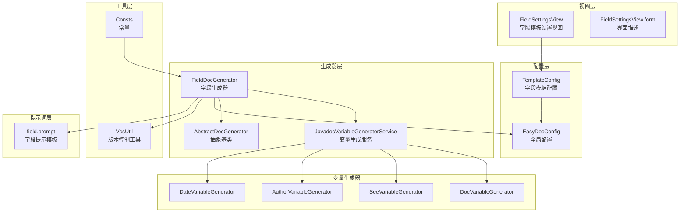
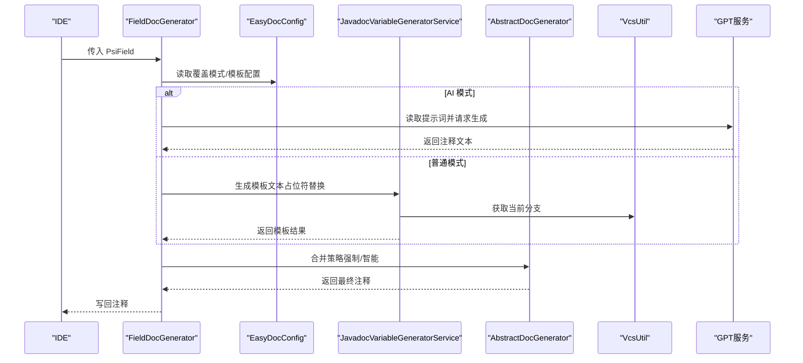
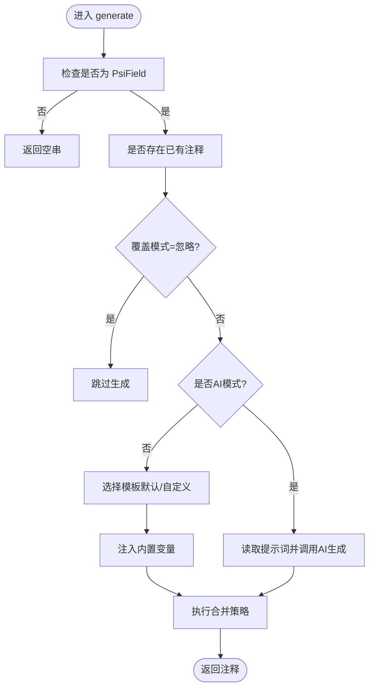
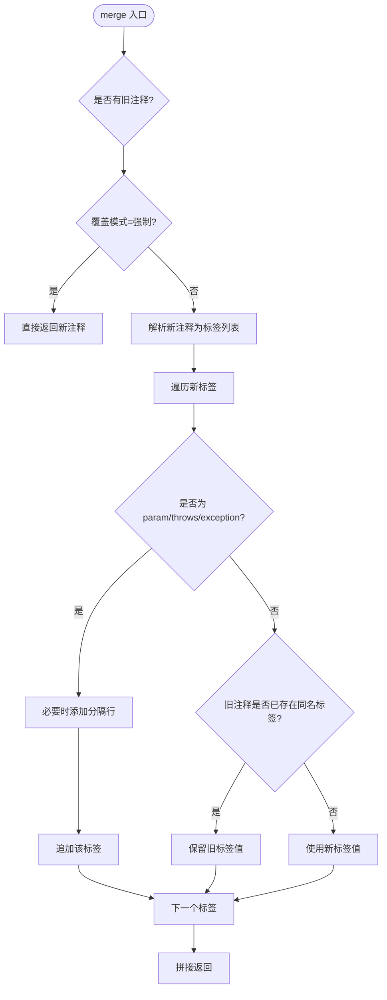
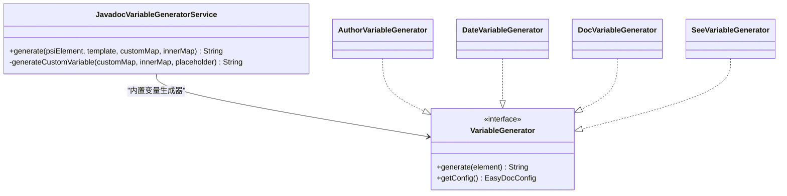
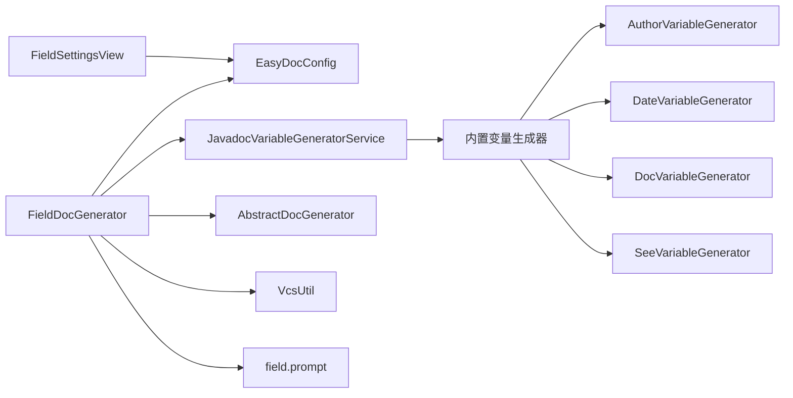

# 字段文档生成器

<cite>
**本文引用的文件**
- [FieldDocGenerator.java](file://src/main/java/com/star/easydoc/javadoc/service/generator/impl/FieldDocGenerator.java)
- [AbstractDocGenerator.java](file://src/main/java/com/star/easydoc/javadoc/service/generator/impl/AbstractDocGenerator.java)
- [JavadocVariableGeneratorService.java](file://src/main/java/com/star/easydoc/javadoc/service/variable/JavadocVariableGeneratorService.java)
- [FieldSettingsView.java](file://src/main/java/com/star/easydoc/view/settings/javadoc/template/FieldSettingsView.java)
- [FieldSettingsView.form](file://src/main/java/com/star/easydoc/view/settings/javadoc/template/FieldSettingsView.form)
- [EasyDocConfig.java](file://src/main/java/com/star/easydoc/config/EasyDocConfig.java)
- [VcsUtil.java](file://src/main/java/com/star/easydoc/common/util/VcsUtil.java)
- [Consts.java](file://src/main/java/com/star/easydoc/common/Consts.java)
- [field.prompt](file://src/main/resources/prompts/chatglm/field.prompt)
- [SeeVariableGenerator.java](file://src/main/java/com/star/easydoc/javadoc/service/variable/impl/SeeVariableGenerator.java)
- [DocVariableGenerator.java](file://src/main/java/com/star/easydoc/javadoc/service/variable/impl/DocVariableGenerator.java)
- [AuthorVariableGenerator.java](file://src/main/java/com/star/easydoc/javadoc/service/variable/impl/AuthorVariableGenerator.java)
- [DateVariableGenerator.java](file://src/main/java/com/star/easydoc/javadoc/service/variable/impl/DateVariableGenerator.java)
</cite>

## 目录
1. [简介](#简介)
2. [项目结构](#项目结构)
3. [核心组件](#核心组件)
4. [架构总览](#架构总览)
5. [详细组件分析](#详细组件分析)
6. [依赖关系分析](#依赖关系分析)
7. [性能考量](#性能考量)
8. [故障排查指南](#故障排查指南)
9. [结论](#结论)
10. [附录：使用示例与最佳实践](#附录使用示例与最佳实践)

## 简介
本文件面向“字段文档生成器”（FieldDocGenerator），系统性阐述其在 IntelliJ 平台下的实现机制与工作流。重点覆盖以下方面：
- 如何处理 PsiField 元素、字段类型分析、常量检测、注解处理等核心能力
- 字段注释生成的模板策略、访问修饰符处理、默认值提取、序列化字段识别等技术细节
- 字段文档生成的完整流程：字段签名解析、注释插入位置确定、模板变量替换、格式化输出等关键步骤
- 提供针对不同类型字段（普通字段、静态字段、final 字段、枚举常量等）的实际应用示例与最佳实践

## 项目结构
围绕字段文档生成器的关键模块与文件组织如下：
- 生成器层：字段生成器、抽象基类、变量替换服务
- 配置层：全局配置、字段模板配置、自定义变量
- 视图层：字段模板设置界面（含内置变量、自定义变量）
- 工具层：常量、版本控制工具
- 提示词层：AI 场景下的字段注释提示模板

图表来源
- [FieldDocGenerator.java:1-111](file://src/main/java/com/star/easydoc/javadoc/service/generator/impl/FieldDocGenerator.java#L1-L111)
- [AbstractDocGenerator.java:1-80](file://src/main/java/com/star/easydoc/javadoc/service/generator/impl/AbstractDocGenerator.java#L1-L80)
- [JavadocVariableGeneratorService.java:1-128](file://src/main/java/com/star/easydoc/javadoc/service/variable/JavadocVariableGeneratorService.java#L1-L128)
- [FieldSettingsView.java:1-176](file://src/main/java/com/star/easydoc/view/settings/javadoc/template/FieldSettingsView.java#L1-L176)
- [FieldSettingsView.form:1-119](file://src/main/java/com/star/easydoc/view/settings/javadoc/template/FieldSettingsView.form#L1-L119)
- [EasyDocConfig.java:1-680](file://src/main/java/com/star/easydoc/config/EasyDocConfig.java#L1-L680)
- [VcsUtil.java:1-38](file://src/main/java/com/star/easydoc/common/util/VcsUtil.java#L1-L38)
- [Consts.java:1-100](file://src/main/java/com/star/easydoc/common/Consts.java#L1-L100)
- [field.prompt:1-20](file://src/main/resources/prompts/chatglm/field.prompt#L1-L20)
- [DocVariableGenerator.java:1-47](file://src/main/java/com/star/easydoc/javadoc/service/variable/impl/DocVariableGenerator.java#L1-L47)
- [SeeVariableGenerator.java:1-65](file://src/main/java/com/star/easydoc/javadoc/service/variable/impl/SeeVariableGenerator.java#L1-L65)
- [AuthorVariableGenerator.java:1-17](file://src/main/java/com/star/easydoc/javadoc/service/variable/impl/AuthorVariableGenerator.java#L1-L17)
- [DateVariableGenerator.java:1-28](file://src/main/java/com/star/easydoc/javadoc/service/variable/impl/DateVariableGenerator.java#L1-L28)

章节来源
- [FieldDocGenerator.java:1-111](file://src/main/java/com/star/easydoc/javadoc/service/generator/impl/FieldDocGenerator.java#L1-L111)
- [AbstractDocGenerator.java:1-80](file://src/main/java/com/star/easydoc/javadoc/service/generator/impl/AbstractDocGenerator.java#L1-L80)
- [JavadocVariableGeneratorService.java:1-128](file://src/main/java/com/star/easydoc/javadoc/service/variable/JavadocVariableGeneratorService.java#L1-L128)
- [FieldSettingsView.java:1-176](file://src/main/java/com/star/easydoc/view/settings/javadoc/template/FieldSettingsView.java#L1-L176)
- [FieldSettingsView.form:1-119](file://src/main/java/com/star/easydoc/view/settings/javadoc/template/FieldSettingsView.form#L1-L119)
- [EasyDocConfig.java:1-680](file://src/main/java/com/star/easydoc/config/EasyDocConfig.java#L1-L680)
- [VcsUtil.java:1-38](file://src/main/java/com/star/easydoc/common/util/VcsUtil.java#L1-L38)
- [Consts.java:1-100](file://src/main/java/com/star/easydoc/common/Consts.java#L1-L100)
- [field.prompt:1-20](file://src/main/resources/prompts/chatglm/field.prompt#L1-L20)
- [DocVariableGenerator.java:1-47](file://src/main/java/com/star/easydoc/javadoc/service/variable/impl/DocVariableGenerator.java#L1-L47)
- [SeeVariableGenerator.java:1-65](file://src/main/java/com/star/easydoc/javadoc/service/variable/impl/SeeVariableGenerator.java#L1-L65)
- [AuthorVariableGenerator.java:1-17](file://src/main/java/com/star/easydoc/javadoc/service/variable/impl/AuthorVariableGenerator.java#L1-L17)
- [DateVariableGenerator.java:1-28](file://src/main/java/com/star/easydoc/javadoc/service/variable/impl/DateVariableGenerator.java#L1-L28)

## 核心组件
- 字段生成器（FieldDocGenerator）
  - 负责接收 PsiField，判断覆盖模式，选择模板（默认或自定义），调用变量生成服务进行占位符替换，并通过合并逻辑写回注释。
- 抽象文档生成器（AbstractDocGenerator）
  - 提供通用的注释合并策略：支持强制覆盖、智能合并（去重标签、保留已有标签）、以及与现有注释的组合。
- 变量生成服务（JavadocVariableGeneratorService）
  - 统一解析模板中的占位符，按内置变量映射表或自定义变量（字符串或 Groovy 脚本）进行替换。
- 字段模板设置视图（FieldSettingsView）
  - 提供字段模板的“默认/自定义”切换、模板文本编辑、内置变量展示、自定义变量增删改查等 UI 能力。
- 配置中心（EasyDocConfig）
  - 存储覆盖模式、作者、日期格式、字段模板配置（是否默认、模板文本、自定义变量映射）等。
- 工具与常量
  - VcsUtil：从项目仓库获取当前分支名，用于模板变量注入。
  - Consts：基础类型集合、AI 翻译集合等常量。

章节来源
- [FieldDocGenerator.java:28-111](file://src/main/java/com/star/easydoc/javadoc/service/generator/impl/FieldDocGenerator.java#L28-L111)
- [AbstractDocGenerator.java:20-80](file://src/main/java/com/star/easydoc/javadoc/service/generator/impl/AbstractDocGenerator.java#L20-L80)
- [JavadocVariableGeneratorService.java:35-128](file://src/main/java/com/star/easydoc/javadoc/service/variable/JavadocVariableGeneratorService.java#L35-L128)
- [FieldSettingsView.java:24-176](file://src/main/java/com/star/easydoc/view/settings/javadoc/template/FieldSettingsView.java#L24-L176)
- [EasyDocConfig.java:22-680](file://src/main/java/com/star/easydoc/config/EasyDocConfig.java#L22-L680)
- [VcsUtil.java:15-38](file://src/main/java/com/star/easydoc/common/util/VcsUtil.java#L15-L38)
- [Consts.java:14-100](file://src/main/java/com/star/easydoc/common/Consts.java#L14-L100)

## 架构总览
字段文档生成器的整体调用链如下：

图表来源
- [FieldDocGenerator.java:42-88](file://src/main/java/com/star/easydoc/javadoc/service/generator/impl/FieldDocGenerator.java#L42-L88)
- [AbstractDocGenerator.java:29-71](file://src/main/java/com/star/easydoc/javadoc/service/generator/impl/AbstractDocGenerator.java#L29-L71)
- [JavadocVariableGeneratorService.java:60-92](file://src/main/java/com/star/easydoc/javadoc/service/variable/JavadocVariableGeneratorService.java#L60-L92)
- [VcsUtil.java:27-35](file://src/main/java/com/star/easydoc/common/util/VcsUtil.java#L27-L35)
- [field.prompt:1-20](file://src/main/resources/prompts/chatglm/field.prompt#L1-L20)

## 详细组件分析

### 字段生成器（FieldDocGenerator）
- 输入校验与覆盖策略
  - 若传入非 PsiField，直接返回空；若已有注释且覆盖模式为“忽略”，则跳过生成。
- 模板选择
  - 根据配置决定使用简单模板还是多行模板；若字段模板配置为非默认，则使用自定义模板。
- 变量注入
  - 注入内置变量：作者、字段名、字段类型、当前分支、项目名。
- 合并与返回
  - 通过合并逻辑决定是直接覆盖还是与现有注释智能合并，最终返回目标注释文本。

图表来源
- [FieldDocGenerator.java:42-111](file://src/main/java/com/star/easydoc/javadoc/service/generator/impl/FieldDocGenerator.java#L42-L111)
- [AbstractDocGenerator.java:29-71](file://src/main/java/com/star/easydoc/javadoc/service/generator/impl/AbstractDocGenerator.java#L29-L71)

章节来源
- [FieldDocGenerator.java:28-111](file://src/main/java/com/star/easydoc/javadoc/service/generator/impl/FieldDocGenerator.java#L28-L111)

### 抽象文档生成器（AbstractDocGenerator）
- 合并策略
  - 强制覆盖：直接返回新注释。
  - 智能合并：解析新注释的标签，对 param、throws、exception 等特殊标签进行分行处理；对其他标签若已在旧注释中存在则保留旧值，否则采用新值。
- 工厂解析
  - 使用 PsiElementFactory 将字符串注释转换为 PsiDocComment，便于统一处理。

图表来源
- [AbstractDocGenerator.java:29-71](file://src/main/java/com/star/easydoc/javadoc/service/generator/impl/AbstractDocGenerator.java#L29-L71)

章节来源
- [AbstractDocGenerator.java:20-80](file://src/main/java/com/star/easydoc/javadoc/service/generator/impl/AbstractDocGenerator.java#L20-L80)

### 变量生成服务（JavadocVariableGeneratorService）
- 占位符匹配
  - 使用正则匹配形如 $var$ 的占位符。
- 变量解析顺序
  - 若存在内置变量生成器（author/date/doc/params/return/see/since/throws/version），优先使用内置生成器。
  - 否则尝试自定义变量：字符串直接返回；Groovy 脚本通过 GroovyShell 执行并返回结果，异常时记录日志并回退。
- 替换与返回
  - 将所有占位符替换后返回最终模板文本。

图表来源
- [JavadocVariableGeneratorService.java:35-128](file://src/main/java/com/star/easydoc/javadoc/service/variable/JavadocVariableGeneratorService.java#L35-L128)
- [AuthorVariableGenerator.java:10-17](file://src/main/java/com/star/easydoc/javadoc/service/variable/impl/AuthorVariableGenerator.java#L10-L17)
- [DateVariableGenerator.java:15-28](file://src/main/java/com/star/easydoc/javadoc/service/variable/impl/DateVariableGenerator.java#L15-L28)
- [DocVariableGenerator.java:23-47](file://src/main/java/com/star/easydoc/javadoc/service/variable/impl/DocVariableGenerator.java#L23-L47)
- [SeeVariableGenerator.java:17-65](file://src/main/java/com/star/easydoc/javadoc/service/variable/impl/SeeVariableGenerator.java#L17-L65)

章节来源
- [JavadocVariableGeneratorService.java:35-128](file://src/main/java/com/star/easydoc/javadoc/service/variable/JavadocVariableGeneratorService.java#L35-L128)

### 字段模板设置视图（FieldSettingsView）
- 功能概览
  - 支持“默认/自定义”两种模板模式；默认模式下禁用模板编辑与自定义变量；自定义模式下启用模板编辑与自定义变量管理。
  - 内置变量表格展示 $DOC$、$SEE$ 等占位符含义；自定义变量表格支持新增、删除与宽度自适应。
- 数据绑定
  - 通过 EasyDocConfig 的 TemplateConfig 获取/设置字段模板配置，包括是否默认、模板文本、自定义变量映射。

章节来源
- [FieldSettingsView.java:24-176](file://src/main/java/com/star/easydoc/view/settings/javadoc/template/FieldSettingsView.java#L24-L176)
- [FieldSettingsView.form:1-119](file://src/main/java/com/star/easydoc/view/settings/javadoc/template/FieldSettingsView.form#L1-L119)
- [EasyDocConfig.java:211-254](file://src/main/java/com/star/easydoc/config/EasyDocConfig.java#L211-L254)

### 配置中心（EasyDocConfig）
- 字段模板配置
  - TemplateConfig：包含 isDefault、template、customMap 三个字段，分别表示是否默认、模板文本、自定义变量映射。
- 全局开关
  - simpleFieldDoc：是否使用简单字段注释模式（单行）。
  - coverMode：覆盖模式（忽略/智能合并/强制覆盖）。
  - author/dateFormat：作者与日期格式。
- 字段模板配置入口
  - getFieldTemplateConfig() 提供字段模板配置对象。

章节来源
- [EasyDocConfig.java:211-254](file://src/main/java/com/star/easydoc/config/EasyDocConfig.java#L211-L254)
- [EasyDocConfig.java:402-408](file://src/main/java/com/star/easydoc/config/EasyDocConfig.java#L402-L408)
- [EasyDocConfig.java:648-654](file://src/main/java/com/star/easydoc/config/EasyDocConfig.java#L648-L654)
- [EasyDocConfig.java:478-487](file://src/main/java/com/star/easydoc/config/EasyDocConfig.java#L478-L487)

### 工具与常量
- VcsUtil
  - 从项目仓库中获取当前分支名称，作为模板变量注入。
- Consts
  - 基础类型集合（用于 See 变量生成器过滤基本类型）。
  - AI 翻译集合（用于判断是否走 AI 生成路径）。

章节来源
- [VcsUtil.java:27-35](file://src/main/java/com/star/easydoc/common/util/VcsUtil.java#L27-L35)
- [Consts.java:22-37](file://src/main/java/com/star/easydoc/common/Consts.java#L22-L37)

## 依赖关系分析
- 字段生成器依赖
  - EasyDocConfig：读取覆盖模式、模板配置、作者、日期格式等。
  - JavadocVariableGeneratorService：模板变量替换。
  - AbstractDocGenerator：合并策略。
  - VcsUtil：注入当前分支。
  - AI 提示词资源：在 AI 模式下读取提示词并调用 GPT 服务。
- 变量生成器依赖
  - 内置变量生成器：author/date/doc/params/return/see/since/throws/version。
  - 自定义变量：字符串或 Groovy 脚本。
- 视图层依赖
  - EasyDocConfig.TemplateConfig：持久化模板配置。
  - Swing 组件：表格、单选框、文本域等。

图表来源
- [FieldDocGenerator.java:28-111](file://src/main/java/com/star/easydoc/javadoc/service/generator/impl/FieldDocGenerator.java#L28-L111)
- [JavadocVariableGeneratorService.java:35-128](file://src/main/java/com/star/easydoc/javadoc/service/variable/JavadocVariableGeneratorService.java#L35-L128)
- [FieldSettingsView.java:24-176](file://src/main/java/com/star/easydoc/view/settings/javadoc/template/FieldSettingsView.java#L24-L176)
- [EasyDocConfig.java:211-254](file://src/main/java/com/star/easydoc/config/EasyDocConfig.java#L211-L254)

章节来源
- [FieldDocGenerator.java:28-111](file://src/main/java/com/star/easydoc/javadoc/service/generator/impl/FieldDocGenerator.java#L28-L111)
- [JavadocVariableGeneratorService.java:35-128](file://src/main/java/com/star/easydoc/javadoc/service/variable/JavadocVariableGeneratorService.java#L35-L128)
- [FieldSettingsView.java:24-176](file://src/main/java/com/star/easydoc/view/settings/javadoc/template/FieldSettingsView.java#L24-L176)
- [EasyDocConfig.java:211-254](file://src/main/java/com/star/easydoc/config/EasyDocConfig.java#L211-L254)

## 性能考量
- 模板解析与替换
  - 正则匹配占位符与字符串替换均为线性复杂度，通常开销较小。
- 合并策略
  - 解析新注释标签、遍历旧注释标签进行去重，整体复杂度与标签数量线性相关。
- AI 生成
  - 仅在 AI 翻译模式下触发，网络调用为外部瓶颈，建议合理设置超时与重试策略。
- Groovy 脚本
  - 脚本执行可能带来额外开销，应避免复杂计算与频繁调用。

## 故障排查指南
- 生成结果为空
  - 检查传入元素是否为 PsiField；确认覆盖模式是否为“忽略”。
- 模板未生效
  - 确认字段模板配置是否为“自定义”模式；核对模板文本与占位符是否正确。
- 自定义变量无效
  - 检查自定义变量键名大小写与模板一致；Groovy 脚本语法错误会记录日志并回退到原始值。
- 合并异常
  - 检查现有注释标签是否与新注释冲突；确保 param/throws/exception 标签分行处理逻辑符合预期。
- AI 模式报错
  - 确认提示词资源可读；检查网络与鉴权配置。

章节来源
- [FieldDocGenerator.java:42-71](file://src/main/java/com/star/easydoc/javadoc/service/generator/impl/FieldDocGenerator.java#L42-L71)
- [AbstractDocGenerator.java:29-71](file://src/main/java/com/star/easydoc/javadoc/service/generator/impl/AbstractDocGenerator.java#L29-L71)
- [JavadocVariableGeneratorService.java:102-125](file://src/main/java/com/star/easydoc/javadoc/service/variable/JavadocVariableGeneratorService.java#L102-L125)

## 结论
字段文档生成器通过“模板+变量替换+合并策略”的组合，在保证灵活性的同时兼顾稳定性。其设计将配置、模板、变量与合并逻辑解耦，便于扩展与维护。配合视图层的可视化配置与工具层的常量与 VCS 支持，能够满足多种场景下的字段注释生成需求。

## 附录：使用示例与最佳实践
- 普通字段
  - 在“字段模板设置”中选择“默认”或“自定义”，使用内置变量 $DOC$、$SEE$ 等，生成简洁注释。
- 静态字段
  - 可通过自定义变量注入“静态”标识；或在模板中加入固定文案，明确字段用途。
- final 字段
  - 利用 See 变量生成器自动链接到字段类型（非基本类型），增强可读性。
- 枚举常量
  - 若字段类型为基础类型，See 变量生成器会自动忽略；可结合 Doc 变量生成器从已有注释中抽取描述。
- 访问修饰符处理
  - 生成器不直接解析访问修饰符；可在模板中通过自定义变量统一注入“public/private/protected”等标识。
- 默认值提取
  - 生成器不自动提取字段默认值；可通过自定义变量或 Groovy 脚本从 PSI 或上下文中推导（需自行实现）。
- 序列化字段识别
  - 生成器不直接识别序列化字段；可通过自定义变量注入“序列化”标识，或在模板中统一标注。

章节来源
- [SeeVariableGenerator.java:55-61](file://src/main/java/com/star/easydoc/javadoc/service/variable/impl/SeeVariableGenerator.java#L55-L61)
- [DocVariableGenerator.java:26-45](file://src/main/java/com/star/easydoc/javadoc/service/variable/impl/DocVariableGenerator.java#L26-L45)
- [FieldSettingsView.java:38-66](file://src/main/java/com/star/easydoc/view/settings/javadoc/template/FieldSettingsView.java#L38-L66)
- [EasyDocConfig.java:402-408](file://src/main/java/com/star/easydoc/config/EasyDocConfig.java#L402-L408)