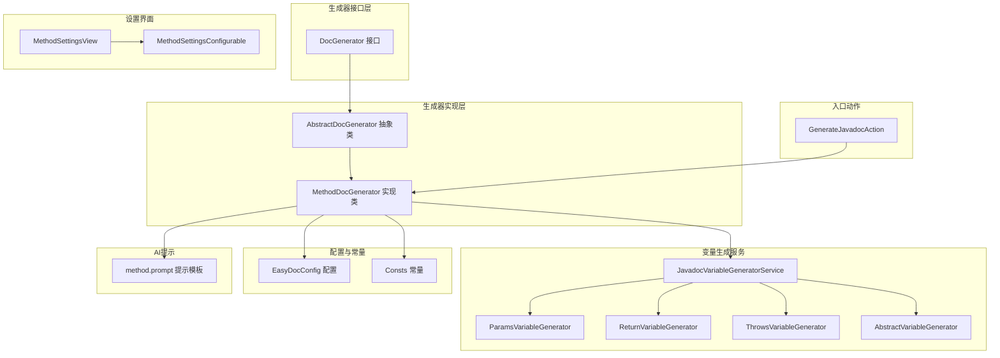
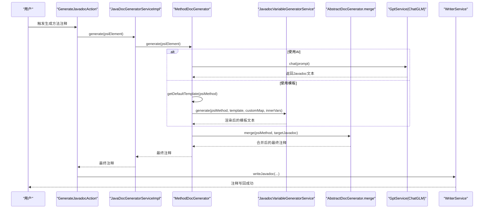
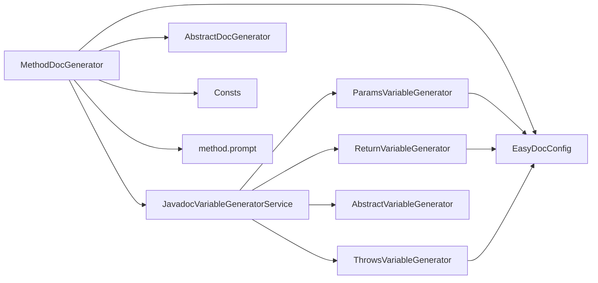

# 方法文档生成器

<cite>
**本文引用的文件**
- [MethodDocGenerator.java](file://src/main/java/com/star/easydoc/javadoc/service/generator/impl/MethodDocGenerator.java)
- [AbstractDocGenerator.java](file://src/main/java/com/star/easydoc/javadoc/service/generator/impl/AbstractDocGenerator.java)
- [DocGenerator.java](file://src/main/java/com/star/easydoc/javadoc/service/generator/DocGenerator.java)
- [JavadocVariableGeneratorService.java](file://src/main/java/com/star/easydoc/javadoc/service/variable/JavadocVariableGeneratorService.java)
- [ParamsVariableGenerator.java](file://src/main/java/com/star/easydoc/javadoc/service/variable/impl/ParamsVariableGenerator.java)
- [ReturnVariableGenerator.java](file://src/main/java/com/star/easydoc/javadoc/service/variable/impl/ReturnVariableGenerator.java)
- [ThrowsVariableGenerator.java](file://src/main/java/com/star/easydoc/javadoc/service/variable/impl/ThrowsVariableGenerator.java)
- [AbstractVariableGenerator.java](file://src/main/java/com/star/easydoc/javadoc/service/variable/impl/AbstractVariableGenerator.java)
- [EasyDocConfig.java](file://src/main/java/com/star/easydoc/config/EasyDocConfig.java)
- [Consts.java](file://src/main/java/com/star/easydoc/common/Consts.java)
- [MethodSettingsView.java](file://src/main/java/com/star/easydoc/view/settings/javadoc/template/MethodSettingsView.java)
- [MethodSettingsConfigurable.java](file://src/main/java/com/star/easydoc/view/settings/javadoc/template/MethodSettingsConfigurable.java)
- [method.prompt](file://src/main/resources/prompts/chatglm/method.prompt)
- [GenerateJavadocAction.java](file://src/main/java/com/star/easydoc/action/GenerateJavadocAction.java)
</cite>

## 目录
1. [简介](#简介)
2. [项目结构](#项目结构)
3. [核心组件](#核心组件)
4. [架构总览](#架构总览)
5. [详细组件分析](#详细组件分析)
6. [依赖分析](#依赖分析)
7. [性能考虑](#性能考虑)
8. [故障排查指南](#故障排查指南)
9. [结论](#结论)
10. [附录：使用示例与最佳实践](#附录使用示例与最佳实践)

## 简介
本文件面向“方法文档生成器”（MethodDocGenerator）的技术文档，系统性阐述其在 IntelliJ 平台上的实现机制与扩展点，涵盖以下主题：
- 如何处理 PsiMethod 元素、方法重载识别、构造函数特殊处理
- 方法注释生成的模板策略、参数列表解析、返回值类型分析、异常声明处理
- 完整的生成流程：方法签名提取、注释位置计算、模板渲染、变量替换
- 在不同成员方法（普通方法、静态方法、抽象方法、重写方法等）上的应用示例与注意事项

## 项目结构
方法文档生成器位于 JavaDoc 生成子系统中，采用“生成器接口 + 抽象基类 + 具体实现”的分层设计，并通过变量生成器服务完成模板占位符的动态替换。

图表来源
- [DocGenerator.java:1-20](file://src/main/java/com/star/easydoc/javadoc/service/generator/DocGenerator.java#L1-L20)
- [AbstractDocGenerator.java:1-80](file://src/main/java/com/star/easydoc/javadoc/service/generator/impl/AbstractDocGenerator.java#L1-L80)
- [MethodDocGenerator.java:1-138](file://src/main/java/com/star/easydoc/javadoc/service/generator/impl/MethodDocGenerator.java#L1-L138)
- [JavadocVariableGeneratorService.java:1-128](file://src/main/java/com/star/easydoc/javadoc/service/variable/JavadocVariableGeneratorService.java#L1-L128)
- [ParamsVariableGenerator.java:1-116](file://src/main/java/com/star/easydoc/javadoc/service/variable/impl/ParamsVariableGenerator.java#L1-L116)
- [ReturnVariableGenerator.java:1-46](file://src/main/java/com/star/easydoc/javadoc/service/variable/impl/ReturnVariableGenerator.java#L1-L46)
- [ThrowsVariableGenerator.java:1-37](file://src/main/java/com/star/easydoc/javadoc/service/variable/impl/ThrowsVariableGenerator.java#L1-L37)
- [AbstractVariableGenerator.java:1-21](file://src/main/java/com/star/easydoc/javadoc/service/variable/impl/AbstractVariableGenerator.java#L1-L21)
- [EasyDocConfig.java:1-680](file://src/main/java/com/star/easydoc/config/EasyDocConfig.java#L1-L680)
- [Consts.java:1-100](file://src/main/java/com/star/easydoc/common/Consts.java#L1-L100)
- [MethodSettingsView.java:1-179](file://src/main/java/com/star/easydoc/view/settings/javadoc/template/MethodSettingsView.java#L1-L179)
- [MethodSettingsConfigurable.java:1-77](file://src/main/java/com/star/easydoc/view/settings/javadoc/template/MethodSettingsConfigurable.java#L1-L77)
- [method.prompt:1-31](file://src/main/resources/prompts/chatglm/method.prompt#L1-L31)
- [GenerateJavadocAction.java:1-175](file://src/main/java/com/star/easydoc/action/GenerateJavadocAction.java#L1-L175)

章节来源
- [MethodDocGenerator.java:1-138](file://src/main/java/com/star/easydoc/javadoc/service/generator/impl/MethodDocGenerator.java#L1-L138)
- [AbstractDocGenerator.java:1-80](file://src/main/java/com/star/easydoc/javadoc/service/generator/impl/AbstractDocGenerator.java#L1-L80)
- [JavadocVariableGeneratorService.java:1-128](file://src/main/java/com/star/easydoc/javadoc/service/variable/JavadocVariableGeneratorService.java#L1-L128)

## 核心组件
- 方法文档生成器（MethodDocGenerator）
  - 负责根据 PsiMethod 元素生成 Javadoc 注释；支持默认模板与自定义模板；支持 AI 生成；负责与变量生成服务协作完成占位符替换；负责与合并逻辑协作决定覆盖/合并行为。
- 抽象文档生成器（AbstractDocGenerator）
  - 提供通用的注释合并能力：在已有注释基础上按标签粒度进行智能合并，避免重复与冲突。
- 变量生成服务（JavadocVariableGeneratorService）
  - 统一解析模板中的占位符，按内置变量或自定义变量（字符串/Groovy）进行替换；内置变量包括 author、date、doc、params、return、see、since、throws、version。
- 参数变量生成器（ParamsVariableGenerator）
  - 解析方法参数列表，结合现有 @param 注释与翻译服务生成参数注释；支持跳过已有注释或强制覆盖。
- 返回值变量生成器（ReturnVariableGenerator）
  - 分析返回类型，依据配置选择 code/link/doc 形式；对基础类型与 void 进行特殊处理。
- 异常变量生成器（ThrowsVariableGenerator）
  - 解析 throws 列表，结合翻译服务生成 @throws 注释。
- 配置与常量（EasyDocConfig、Consts）
  - 提供覆盖模式、返回值类型策略、翻译器集合、AI 翻译集合等全局配置项。
- 设置视图与可配置项（MethodSettingsView、MethodSettingsConfigurable）
  - 提供方法模板的默认/自定义切换、模板编辑、内置变量说明、自定义变量增删改查。
- AI 提示模板（method.prompt）
  - 为 ChatGLM 等 AI 生成提供标准化提示，确保输出符合 Javadoc 规范。
- 入口动作（GenerateJavadocAction）
  - 将用户操作与具体生成流程对接，调用 JavaDoc 生成服务并写回注释。

章节来源
- [MethodDocGenerator.java:30-138](file://src/main/java/com/star/easydoc/javadoc/service/generator/impl/MethodDocGenerator.java#L30-L138)
- [AbstractDocGenerator.java:29-71](file://src/main/java/com/star/easydoc/javadoc/service/generator/impl/AbstractDocGenerator.java#L29-L71)
- [JavadocVariableGeneratorService.java:35-127](file://src/main/java/com/star/easydoc/javadoc/service/variable/JavadocVariableGeneratorService.java#L35-L127)
- [ParamsVariableGenerator.java:27-116](file://src/main/java/com/star/easydoc/javadoc/service/variable/impl/ParamsVariableGenerator.java#L27-L116)
- [ReturnVariableGenerator.java:16-46](file://src/main/java/com/star/easydoc/javadoc/service/variable/impl/ReturnVariableGenerator.java#L16-L46)
- [ThrowsVariableGenerator.java:19-37](file://src/main/java/com/star/easydoc/javadoc/service/variable/impl/ThrowsVariableGenerator.java#L19-L37)
- [EasyDocConfig.java:22-680](file://src/main/java/com/star/easydoc/config/EasyDocConfig.java#L22-L680)
- [Consts.java:14-100](file://src/main/java/com/star/easydoc/common/Consts.java#L14-L100)
- [MethodSettingsView.java:24-179](file://src/main/java/com/star/easydoc/view/settings/javadoc/template/MethodSettingsView.java#L24-L179)
- [MethodSettingsConfigurable.java:20-77](file://src/main/java/com/star/easydoc/view/settings/javadoc/template/MethodSettingsConfigurable.java#L20-L77)
- [method.prompt:1-31](file://src/main/resources/prompts/chatglm/method.prompt#L1-L31)
- [GenerateJavadocAction.java:46-175](file://src/main/java/com/star/easydoc/action/GenerateJavadocAction.java#L46-L175)

## 架构总览
方法文档生成器的整体工作流如下：

图表来源
- [GenerateJavadocAction.java:124-154](file://src/main/java/com/star/easydoc/action/GenerateJavadocAction.java#L124-L154)
- [MethodDocGenerator.java:38-108](file://src/main/java/com/star/easydoc/javadoc/service/generator/impl/MethodDocGenerator.java#L38-L108)
- [AbstractDocGenerator.java:29-71](file://src/main/java/com/star/easydoc/javadoc/service/generator/impl/AbstractDocGenerator.java#L29-L71)
- [JavadocVariableGeneratorService.java:60-92](file://src/main/java/com/star/easydoc/javadoc/service/variable/JavadocVariableGeneratorService.java#L60-L92)

## 详细组件分析

### 方法文档生成器（MethodDocGenerator）
职责与要点
- 输入校验：仅处理 PsiMethod；若处于“忽略已存在注释且已有注释”场景下，直接短路返回。
- AI 生成：当配置的翻译器属于 AI 集合时，读取 method.prompt 提示模板，注入当前方法源码后调用 GptService 生成注释。
- 模板策略：
  - 默认模板：根据是否存在参数、返回值、异常动态拼装 $PARAMS$/$RETURN$/$THROWS$ 占位符。
  - 自定义模板：若用户启用自定义模板，则优先使用自定义模板。
- 变量替换：调用 JavadocVariableGeneratorService 对模板进行占位符解析与替换。
- 注释合并：调用 AbstractDocGenerator.merge 将新注释与已有注释进行智能合并（按标签去重与顺序保留）。

关键实现路径
- 生成入口与分支控制：[generate:38-63](file://src/main/java/com/star/easydoc/javadoc/service/generator/impl/MethodDocGenerator.java#L38-L63)
- 默认模板构建：[getDefaultTemplate:71-91](file://src/main/java/com/star/easydoc/javadoc/service/generator/impl/MethodDocGenerator.java#L71-L91)
- AI 生成流程：[generateWithAI:99-108](file://src/main/java/com/star/easydoc/javadoc/service/generator/impl/MethodDocGenerator.java#L99-L108)
- 内部变量准备：[getMethodInnerVariable:116-131](file://src/main/java/com/star/easydoc/javadoc/service/generator/impl/MethodDocGenerator.java#L116-L131)

章节来源
- [MethodDocGenerator.java:30-138](file://src/main/java/com/star/easydoc/javadoc/service/generator/impl/MethodDocGenerator.java#L30-L138)
- [Consts.java:36-37](file://src/main/java/com/star/easydoc/common/Consts.java#L36-L37)
- [method.prompt:1-31](file://src/main/resources/prompts/chatglm/method.prompt#L1-L31)

### 抽象文档生成器（AbstractDocGenerator）
职责与要点
- 合并策略：
  - 若无已有注释或覆盖模式为“强制覆盖”，直接返回目标注释。
  - 否则对目标注释中的标签进行解析，按标签类型（param、throws、exception）与已有注释进行去重与顺序保留，其余标签按出现顺序拼接。
- 行间空行控制：在特定标签前后插入必要的换行，保证注释格式整洁。

关键实现路径
- 合并逻辑：[merge:29-71](file://src/main/java/com/star/easydoc/javadoc/service/generator/impl/AbstractDocGenerator.java#L29-L71)

章节来源
- [AbstractDocGenerator.java:20-80](file://src/main/java/com/star/easydoc/javadoc/service/generator/impl/AbstractDocGenerator.java#L20-L80)

### 变量生成服务（JavadocVariableGeneratorService）
职责与要点
- 占位符匹配：使用正则匹配形如 $KEY$ 的占位符。
- 内置变量映射：内置变量键（不区分大小写）映射到对应生成器，如 author/date/doc/params/return/see/since/throws/version。
- 自定义变量：
  - 字符串类型：直接替换。
  - Groovy 类型：使用 GroovyShell 与绑定的内部变量执行脚本，返回字符串；失败时记录错误并回退原占位符。
- 替换顺序：先收集所有占位符及其替换结果，再统一替换，避免相互干扰。

关键实现路径
- 生成入口与占位符解析：[generate:60-92](file://src/main/java/com/star/easydoc/javadoc/service/variable/JavadocVariableGeneratorService.java#L60-L92)
- 自定义变量执行：[generateCustomVariable:102-125](file://src/main/java/com/star/easydoc/javadoc/service/variable/JavadocVariableGeneratorService.java#L102-L125)

章节来源
- [JavadocVariableGeneratorService.java:35-127](file://src/main/java/com/star/easydoc/javadoc/service/variable/JavadocVariableGeneratorService.java#L35-L127)
- [AbstractVariableGenerator.java:14-21](file://src/main/java/com/star/easydoc/javadoc/service/variable/impl/AbstractVariableGenerator.java#L14-L21)

### 参数变量生成器（ParamsVariableGenerator）
职责与要点
- 参数解析：从 PsiMethod 的参数列表提取参数名。
- 已有注释检测：扫描现有 @param 注释，建立“参数名 -> 注释”映射。
- 策略选择：
  - 若无注释或覆盖模式为“强制覆盖”，则对参数名进行翻译后生成注释。
  - 否则保留已有注释。
- 输出格式：首行前缀为 @param，后续行前缀为 * @param，便于与模板中的 $PARAMS$ 对齐。

关键实现路径
- 生成逻辑：[generate:30-83](file://src/main/java/com/star/easydoc/javadoc/service/variable/impl/ParamsVariableGenerator.java#L30-L83)

章节来源
- [ParamsVariableGenerator.java:27-116](file://src/main/java/com/star/easydoc/javadoc/service/variable/impl/ParamsVariableGenerator.java#L27-L116)

### 返回值变量生成器（ReturnVariableGenerator）
职责与要点
- 返回类型分析：基于 PsiMethod 的返回类型元素进行分析。
- 基础类型：直接输出 @return 基础类型名。
- void：不输出返回值注释。
- 复杂类型：
  - code：使用 @code 包裹类型名。
  - link：默认链接到类型（或按配置选择）。
  - doc：调用翻译服务对类型名进行翻译后再输出。
- 配置开关：由 EasyDocConfig 的 methodReturnType 控制策略。

关键实现路径
- 生成逻辑：[generate:19-45](file://src/main/java/com/star/easydoc/javadoc/service/variable/impl/ReturnVariableGenerator.java#L19-L45)

章节来源
- [ReturnVariableGenerator.java:16-46](file://src/main/java/com/star/easydoc/javadoc/service/variable/impl/ReturnVariableGenerator.java#L16-L46)
- [EasyDocConfig.java:553-574](file://src/main/java/com/star/easydoc/config/EasyDocConfig.java#L553-L574)

### 异常变量生成器（ThrowsVariableGenerator）
职责与要点
- 异常解析：从 PsiMethod 的 throws 列表提取受检异常类型。
- 翻译策略：对每个异常类型名进行翻译，生成 @throws 注释。
- 输出格式：以换行分隔多个 @throws 标签。

关键实现路径
- 生成逻辑：[generate:22-36](file://src/main/java/com/star/easydoc/javadoc/service/variable/impl/ThrowsVariableGenerator.java#L22-L36)

章节来源
- [ThrowsVariableGenerator.java:19-37](file://src/main/java/com/star/easydoc/javadoc/service/variable/impl/ThrowsVariableGenerator.java#L19-L37)

### 配置与设置界面
- EasyDocConfig
  - 提供覆盖模式（忽略/智能合并/强制覆盖）、方法返回值类型策略（code/link/doc）、翻译器集合、模板配置等。
- MethodSettingsView / MethodSettingsConfigurable
  - 提供方法模板的默认/自定义切换、模板编辑、内置变量说明、自定义变量增删改查与格式校验（必须以 /** 开头、以 */ 结束）。

关键实现路径
- 配置项与模板配置：[EasyDocConfig:22-254](file://src/main/java/com/star/easydoc/config/EasyDocConfig.java#L22-L254)
- 设置视图与校验：[MethodSettingsView:24-179](file://src/main/java/com/star/easydoc/view/settings/javadoc/template/MethodSettingsView.java#L24-L179), [MethodSettingsConfigurable:20-77](file://src/main/java/com/star/easydoc/view/settings/javadoc/template/MethodSettingsConfigurable.java#L20-L77)

章节来源
- [EasyDocConfig.java:22-254](file://src/main/java/com/star/easydoc/config/EasyDocConfig.java#L22-L254)
- [MethodSettingsView.java:24-179](file://src/main/java/com/star/easydoc/view/settings/javadoc/template/MethodSettingsView.java#L24-L179)
- [MethodSettingsConfigurable.java:20-77](file://src/main/java/com/star/easydoc/view/settings/javadoc/template/MethodSettingsConfigurable.java#L20-L77)

### AI 提示模板（method.prompt）
- 作用：为 ChatGLM 等 AI 供应商提供标准化提示，要求输出符合 Javadoc 规范的注释文本。
- 使用：MethodDocGenerator 在 AI 模式下读取该模板，将当前方法源码注入 {code} 占位符后提交给 GptService。

关键实现路径
- 提示模板：[method.prompt:1-31](file://src/main/resources/prompts/chatglm/method.prompt#L1-L31)
- 读取与注入：[generateWithAI:99-108](file://src/main/java/com/star/easydoc/javadoc/service/generator/impl/MethodDocGenerator.java#L99-L108)

章节来源
- [method.prompt:1-31](file://src/main/resources/prompts/chatglm/method.prompt#L1-L31)
- [MethodDocGenerator.java:99-108](file://src/main/java/com/star/easydoc/javadoc/service/generator/impl/MethodDocGenerator.java#L99-L108)

### 入口动作（GenerateJavadocAction）
- 作用：接收用户触发，定位 PSI 元素，调用 JavaDoc 生成服务生成注释，解析为 PsiDocComment 并写回编辑器。
- 支持 Java/Kotlin 文件；对目录与 package-info.java 场景进行特殊处理。

关键实现路径
- 主流程：[javadocProcess:124-154](file://src/main/java/com/star/easydoc/action/GenerateJavadocAction.java#L124-L154)

章节来源
- [GenerateJavadocAction.java:46-175](file://src/main/java/com/star/easydoc/action/GenerateJavadocAction.java#L46-L175)

## 依赖分析
- 组件耦合
  - MethodDocGenerator 依赖 EasyDocConfig、JavadocVariableGeneratorService、AbstractDocGenerator、GptService、Consts。
  - JavadocVariableGeneratorService 依赖各内置变量生成器与翻译服务。
  - Params/Return/Throws 变量生成器依赖翻译服务与配置。
- 外部依赖
  - IntelliJ PSI API（PsiMethod、PsiDocComment、PsiElementFactory 等）。
  - Apache Commons（IOUtils、Lang3、Collections）。
  - Guava（Maps、Lists、Sets）。
  - Groovy Shell（用于自定义变量的 Groovy 脚本执行）。

图表来源
- [MethodDocGenerator.java:33-36](file://src/main/java/com/star/easydoc/javadoc/service/generator/impl/MethodDocGenerator.java#L33-L36)
- [JavadocVariableGeneratorService.java:42-52](file://src/main/java/com/star/easydoc/javadoc/service/variable/JavadocVariableGeneratorService.java#L42-L52)
- [ParamsVariableGenerator.java](file://src/main/java/com/star/easydoc/javadoc/service/variable/impl/ParamsVariableGenerator.java#L28)
- [ReturnVariableGenerator.java](file://src/main/java/com/star/easydoc/javadoc/service/variable/impl/ReturnVariableGenerator.java#L17)
- [ThrowsVariableGenerator.java](file://src/main/java/com/star/easydoc/javadoc/service/variable/impl/ThrowsVariableGenerator.java#L20)
- [Consts.java:36-37](file://src/main/java/com/star/easydoc/common/Consts.java#L36-L37)
- [method.prompt:1-31](file://src/main/resources/prompts/chatglm/method.prompt#L1-L31)

## 性能考虑
- 模板解析与替换
  - 使用正则一次性匹配所有占位符，随后批量替换，避免多次字符串扫描。
  - 自定义 Groovy 脚本执行可能带来额外开销，建议在复杂逻辑中谨慎使用。
- 注释合并
  - 合并过程对标签进行线性扫描与去重，整体复杂度与注释长度线性相关。
- 翻译服务
  - 参数与异常的翻译会触发网络请求，建议在批量生成时合理控制并发与重试策略。
- PSI 访问
  - 通过 PSI API 获取方法签名、参数、返回值、异常等信息，注意避免在 UI 线程中进行大量 PSI 操作。

## 故障排查指南
- 生成结果为空
  - 检查输入是否为 PsiMethod；确认覆盖模式与已有注释状态。
  - 参考：[generate:38-47](file://src/main/java/com/star/easydoc/javadoc/service/generator/impl/MethodDocGenerator.java#L38-L47)
- 模板未生效或格式错误
  - 确认已启用自定义模板且模板以 /** 开头、以 */ 结束；检查内置变量与自定义变量键是否正确。
  - 参考：[MethodSettingsConfigurable.apply:47-64](file://src/main/java/com/star/easydoc/view/settings/javadoc/template/MethodSettingsConfigurable.java#L47-L64)
- 自定义变量 Groovy 执行报错
  - 查看日志中 Groovy 执行错误信息，检查脚本语法与返回值类型。
  - 参考：[generateCustomVariable:114-121](file://src/main/java/com/star/easydoc/javadoc/service/variable/JavadocVariableGeneratorService.java#L114-L121)
- 注释合并异常
  - 检查现有注释标签是否与模板标签冲突；确认合并策略是否符合预期。
  - 参考：[merge:29-71](file://src/main/java/com/star/easydoc/javadoc/service/generator/impl/AbstractDocGenerator.java#L29-L71)
- AI 生成失败
  - 检查 method.prompt 是否正确加载；确认 GptService 配置与网络连通性。
  - 参考：[generateWithAI:99-108](file://src/main/java/com/star/easydoc/javadoc/service/generator/impl/MethodDocGenerator.java#L99-L108)

章节来源
- [MethodDocGenerator.java:38-47](file://src/main/java/com/star/easydoc/javadoc/service/generator/impl/MethodDocGenerator.java#L38-L47)
- [MethodSettingsConfigurable.java:47-64](file://src/main/java/com/star/easydoc/view/settings/javadoc/template/MethodSettingsConfigurable.java#L47-L64)
- [JavadocVariableGeneratorService.java:114-121](file://src/main/java/com/star/easydoc/javadoc/service/variable/JavadocVariableGeneratorService.java#L114-L121)
- [AbstractDocGenerator.java:29-71](file://src/main/java/com/star/easydoc/javadoc/service/generator/impl/AbstractDocGenerator.java#L29-L71)
- [MethodDocGenerator.java:99-108](file://src/main/java/com/star/easydoc/javadoc/service/generator/impl/MethodDocGenerator.java#L99-L108)

## 结论
方法文档生成器通过清晰的分层设计与灵活的模板/变量机制，实现了对 Java 方法注释的自动化生成与智能合并。其核心优势在于：
- 对 PSI 元素的精准解析与对覆盖/合并策略的灵活适配
- 可插拔的变量生成体系，支持内置变量与自定义变量（含 Groovy）
- 对 AI 生成的良好集成，满足多场景下的注释生成需求
- 与设置界面的紧密配合，便于用户定制模板与变量

## 附录：使用示例与最佳实践
- 普通方法
  - 步骤：选中方法 -> 触发生成 -> 选择默认模板或自定义模板 -> 查看合并结果。
  - 注意：若已有 @param/@throws 注释，按“智能合并”策略保留已有内容。
- 静态方法
  - 行为与普通方法一致；返回值类型策略可按配置选择 link/doc/code。
- 抽象方法
  - 由于无方法体，参数与异常仍可从签名解析；返回值类型为空时不会生成 @return。
- 重写方法
  - 若父类已有注释，建议使用“智能合并”避免重复；必要时通过“强制覆盖”刷新注释。
- 构造函数
  - 构造函数在 PSI 中表现为 PsiMethod；生成逻辑与普通方法相同；注意构造函数无返回值，不会生成 @return。
- 自定义模板
  - 在设置中启用自定义模板，编写 /** ... */ 格式的模板，使用 $PARAMS$/$RETURN$/$THROWS$ 等占位符；可添加自定义变量键并在右侧表格中配置。
- AI 生成
  - 选择 AI 翻译器后，系统自动读取 method.prompt 并注入方法源码，生成符合 Javadoc 规范的注释。

章节来源
- [MethodDocGenerator.java:71-91](file://src/main/java/com/star/easydoc/javadoc/service/generator/impl/MethodDocGenerator.java#L71-L91)
- [JavadocVariableGeneratorService.java:60-92](file://src/main/java/com/star/easydoc/javadoc/service/variable/JavadocVariableGeneratorService.java#L60-L92)
- [MethodSettingsView.java:38-45](file://src/main/java/com/star/easydoc/view/settings/javadoc/template/MethodSettingsView.java#L38-L45)
- [MethodSettingsConfigurable.java:47-64](file://src/main/java/com/star/easydoc/view/settings/javadoc/template/MethodSettingsConfigurable.java#L47-L64)
- [ReturnVariableGenerator.java:25-44](file://src/main/java/com/star/easydoc/javadoc/service/variable/impl/ReturnVariableGenerator.java#L25-L44)
- [ParamsVariableGenerator.java:36-83](file://src/main/java/com/star/easydoc/javadoc/service/variable/impl/ParamsVariableGenerator.java#L36-L83)
- [ThrowsVariableGenerator.java:27-36](file://src/main/java/com/star/easydoc/javadoc/service/variable/impl/ThrowsVariableGenerator.java#L27-L36)
- [GenerateJavadocAction.java:124-154](file://src/main/java/com/star/easydoc/action/GenerateJavadocAction.java#L124-L154)