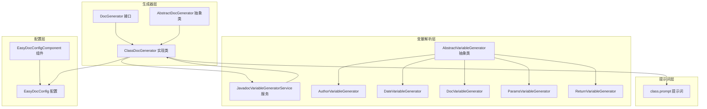
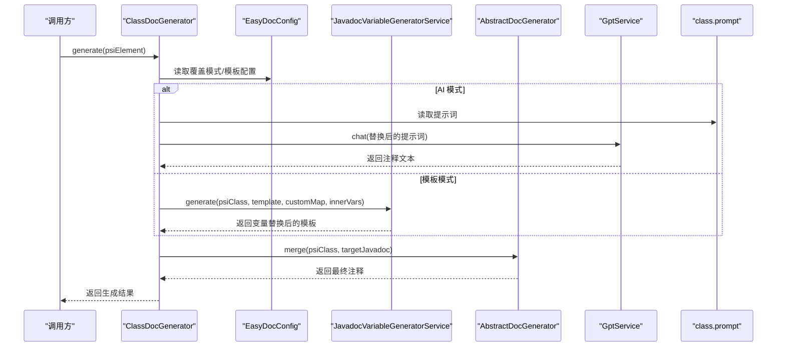
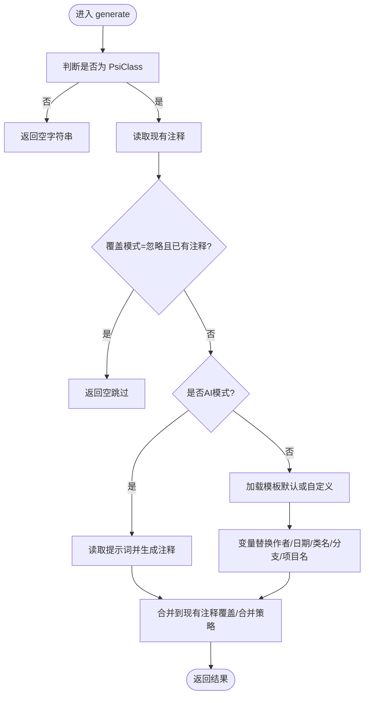
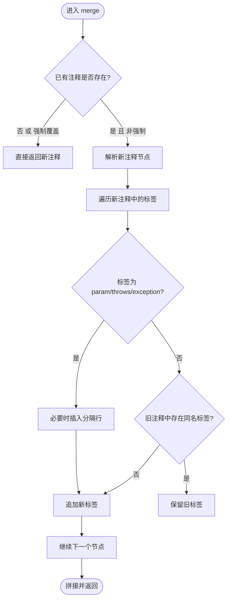
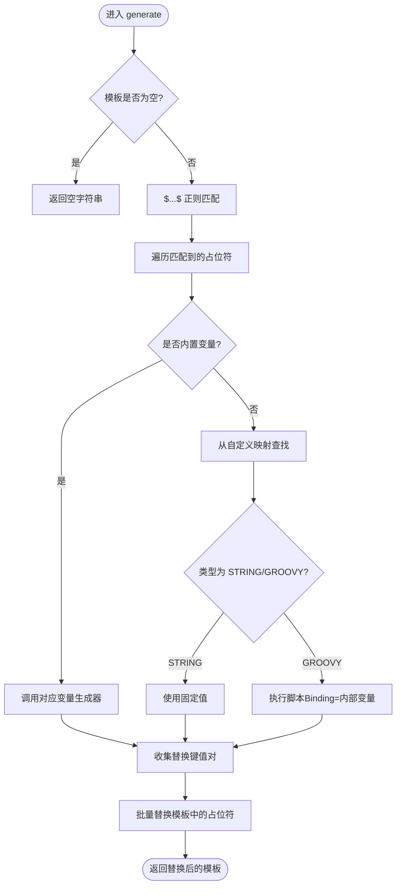
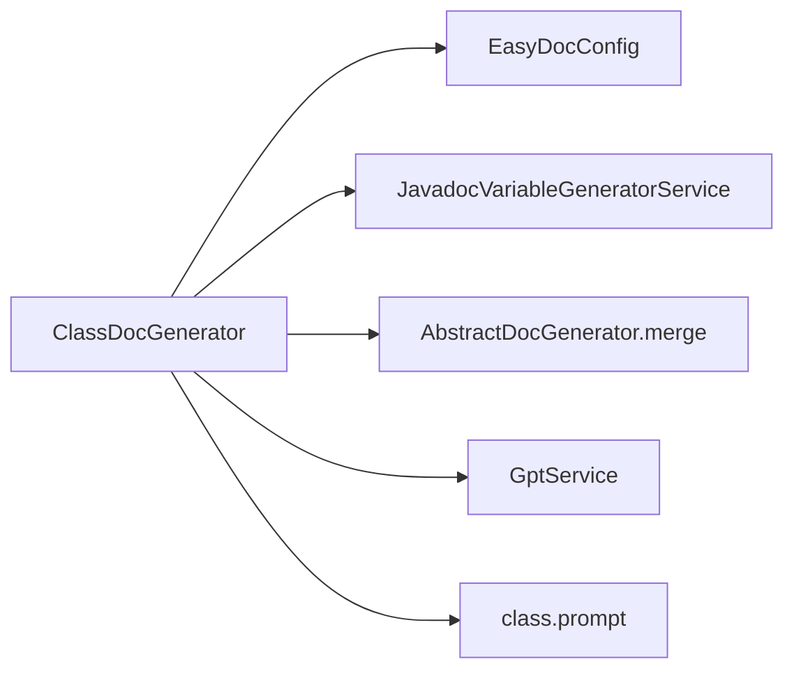

# 类文档生成器

<cite>
**本文引用的文件**
- [ClassDocGenerator.java](file://src/main/java/com/star/easydoc/javadoc/service/generator/impl/ClassDocGenerator.java)
- [AbstractDocGenerator.java](file://src/main/java/com/star/easydoc/javadoc/service/generator/impl/AbstractDocGenerator.java)
- [DocGenerator.java](file://src/main/java/com/star/easydoc/javadoc/service/generator/DocGenerator.java)
- [JavadocVariableGeneratorService.java](file://src/main/java/com/star/easydoc/javadoc/service/variable/JavadocVariableGeneratorService.java)
- [EasyDocConfig.java](file://src/main/java/com/star/easydoc/config/EasyDocConfig.java)
- [EasyDocConfigComponent.java](file://src/main/java/com/star/easydoc/config/EasyDocConfigComponent.java)
- [class.prompt](file://src/main/resources/prompts/chatglm/class.prompt)
- [AuthorVariableGenerator.java](file://src/main/java/com/star/easydoc/javadoc/service/variable/impl/AuthorVariableGenerator.java)
- [DateVariableGenerator.java](file://src/main/java/com/star/easydoc/javadoc/service/variable/impl/DateVariableGenerator.java)
- [DocVariableGenerator.java](file://src/main/java/com/star/easydoc/javadoc/service/variable/impl/DocVariableGenerator.java)
- [ParamsVariableGenerator.java](file://src/main/java/com/star/easydoc/javadoc/service/variable/impl/ParamsVariableGenerator.java)
- [ReturnVariableGenerator.java](file://src/main/java/com/star/easydoc/javadoc/service/variable/impl/ReturnVariableGenerator.java)
</cite>

## 目录
1. [简介](#简介)
2. [项目结构](#项目结构)
3. [核心组件](#核心组件)
4. [架构总览](#架构总览)
5. [详细组件分析](#详细组件分析)
6. [依赖分析](#依赖分析)
7. [性能考虑](#性能考虑)
8. [故障排查指南](#故障排查指南)
9. [结论](#结论)
10. [附录](#附录)

## 简介
本文件面向“类文档生成器”（ClassDocGenerator），系统性阐述其在 IntelliJ 平台上的实现机制与使用方法。重点包括：
- 如何处理 PsiClass 元素、类注释位置确定、覆盖/合并策略
- 模板变量解析与替换（作者、日期、类名、分支、项目名等）
- AI 辅助生成（基于 ChatGLM 提示词）与传统模板生成的切换
- 在不同类型的类（普通类、抽象类、接口、枚举等）上的适用性与注意事项
- 生成流程的关键步骤：模板选择、变量替换、格式化输出、注释合并

## 项目结构
与类文档生成器相关的模块主要位于以下路径：
- 生成器层：generator/impl 下的 Doc 生成器接口与实现
- 变量解析层：variable 与 variable/impl 下的变量生成器与服务
- 配置层：config 下的 EasyDocConfig 与 EasyDocConfigComponent
- 提示词层：resources/prompts/chatglm 下的模板提示

**图表来源**
- [DocGenerator.java:1-20](file://src/main/java/com/star/easydoc/javadoc/service/generator/DocGenerator.java#L1-L20)
- [AbstractDocGenerator.java:1-80](file://src/main/java/com/star/easydoc/javadoc/service/generator/impl/AbstractDocGenerator.java#L1-L80)
- [ClassDocGenerator.java:1-116](file://src/main/java/com/star/easydoc/javadoc/service/generator/impl/ClassDocGenerator.java#L1-L116)
- [JavadocVariableGeneratorService.java:1-128](file://src/main/java/com/star/easydoc/javadoc/service/variable/JavadocVariableGeneratorService.java#L1-L128)
- [EasyDocConfig.java:1-680](file://src/main/java/com/star/easydoc/config/EasyDocConfig.java#L1-L680)
- [EasyDocConfigComponent.java:1-69](file://src/main/java/com/star/easydoc/config/EasyDocConfigComponent.java#L1-L69)
- [class.prompt:1-30](file://src/main/resources/prompts/chatglm/class.prompt#L1-L30)

**章节来源**
- [ClassDocGenerator.java:1-116](file://src/main/java/com/star/easydoc/javadoc/service/generator/impl/ClassDocGenerator.java#L1-L116)
- [AbstractDocGenerator.java:1-80](file://src/main/java/com/star/easydoc/javadoc/service/generator/impl/AbstractDocGenerator.java#L1-L80)
- [DocGenerator.java:1-20](file://src/main/java/com/star/easydoc/javadoc/service/generator/DocGenerator.java#L1-L20)
- [JavadocVariableGeneratorService.java:1-128](file://src/main/java/com/star/easydoc/javadoc/service/variable/JavadocVariableGeneratorService.java#L1-L128)
- [EasyDocConfig.java:1-680](file://src/main/java/com/star/easydoc/config/EasyDocConfig.java#L1-L680)
- [EasyDocConfigComponent.java:1-69](file://src/main/java/com/star/easydoc/config/EasyDocConfigComponent.java#L1-L69)
- [class.prompt:1-30](file://src/main/resources/prompts/chatglm/class.prompt#L1-L30)

## 核心组件
- DocGenerator 接口：定义统一的 generate(PsiElement) 生成入口
- AbstractDocGenerator 抽象类：提供通用的注释合并逻辑 merge(...)
- ClassDocGenerator 实现类：面向类的注释生成，支持模板与 AI 两种模式
- JavadocVariableGeneratorService：模板变量解析与替换服务
- EasyDocConfig/EasyDocConfigComponent：全局配置与持久化存储
- 变量生成器：Author、Date、Doc、Params、Return 等具体变量处理器

**章节来源**
- [DocGenerator.java:1-20](file://src/main/java/com/star/easydoc/javadoc/service/generator/DocGenerator.java#L1-L20)
- [AbstractDocGenerator.java:1-80](file://src/main/java/com/star/easydoc/javadoc/service/generator/impl/AbstractDocGenerator.java#L1-L80)
- [ClassDocGenerator.java:1-116](file://src/main/java/com/star/easydoc/javadoc/service/generator/impl/ClassDocGenerator.java#L1-L116)
- [JavadocVariableGeneratorService.java:1-128](file://src/main/java/com/star/easydoc/javadoc/service/variable/JavadocVariableGeneratorService.java#L1-L128)
- [EasyDocConfig.java:1-680](file://src/main/java/com/star/easydoc/config/EasyDocConfig.java#L1-L680)
- [EasyDocConfigComponent.java:1-69](file://src/main/java/com/star/easydoc/config/EasyDocConfigComponent.java#L1-L69)

## 架构总览
类文档生成器的整体调用链如下：
- 外部调用 DocGenerator.generate(...)，由 ClassDocGenerator 实现
- 若开启 AI 模式，读取 class.prompt 提示词，结合当前类源码与配置生成注释
- 否则使用模板（默认或用户自定义），通过 JavadocVariableGeneratorService 解析占位符
- 最终通过 AbstractDocGenerator.merge(...) 决定覆盖、忽略或智能合并已有注释

**图表来源**
- [ClassDocGenerator.java:44-93](file://src/main/java/com/star/easydoc/javadoc/service/generator/impl/ClassDocGenerator.java#L44-L93)
- [AbstractDocGenerator.java:29-71](file://src/main/java/com/star/easydoc/javadoc/service/generator/impl/AbstractDocGenerator.java#L29-L71)
- [JavadocVariableGeneratorService.java:60-92](file://src/main/java/com/star/easydoc/javadoc/service/variable/JavadocVariableGeneratorService.java#L60-L92)
- [class.prompt:1-30](file://src/main/resources/prompts/chatglm/class.prompt#L1-L30)

## 详细组件分析

### ClassDocGenerator：类注释生成主流程
- 输入校验：仅处理 PsiClass；若处于“忽略已有注释且已存在注释”的场景且覆盖模式为“忽略”，直接返回
- AI 模式：读取 class.prompt，替换作者、日期、代码片段，调用 GptService.chat(...) 生成注释
- 模板模式：选择默认模板或用户自定义模板；调用 JavadocVariableGeneratorService 进行变量替换
- 合并策略：委托 AbstractDocGenerator.merge(...) 处理覆盖/合并逻辑

**图表来源**
- [ClassDocGenerator.java:44-93](file://src/main/java/com/star/easydoc/javadoc/service/generator/impl/ClassDocGenerator.java#L44-L93)
- [AbstractDocGenerator.java:29-71](file://src/main/java/com/star/easydoc/javadoc/service/generator/impl/AbstractDocGenerator.java#L29-L71)

**章节来源**
- [ClassDocGenerator.java:44-93](file://src/main/java/com/star/easydoc/javadoc/service/generator/impl/ClassDocGenerator.java#L44-L93)
- [AbstractDocGenerator.java:29-71](file://src/main/java/com/star/easydoc/javadoc/service/generator/impl/AbstractDocGenerator.java#L29-L71)

### AbstractDocGenerator：注释合并策略
- 强制覆盖：当目标注释为空或覆盖模式为“强制覆盖”时，直接返回新注释
- 智能合并：保留旧注释中的 param/throws/exception 等标签，并避免重复；其他同名标签以旧注释为准
- 格式化：确保合并后的注释段落与星号对齐，避免多余空行

**图表来源**
- [AbstractDocGenerator.java:29-71](file://src/main/java/com/star/easydoc/javadoc/service/generator/impl/AbstractDocGenerator.java#L29-L71)

**章节来源**
- [AbstractDocGenerator.java:29-71](file://src/main/java/com/star/easydoc/javadoc/service/generator/impl/AbstractDocGenerator.java#L29-L71)

### JavadocVariableGeneratorService：模板变量解析与替换
- 占位符匹配：使用正则匹配形如 $VAR$ 的占位符
- 内置变量：author/date/doc/params/return/see/since/throws/version
- 自定义变量：支持 STRING 固定值与 GROOVY 脚本；脚本可访问内部变量映射（如作者、类名、分支、项目名）
- 替换顺序：先内置变量，再自定义变量；最后进行批量替换

**图表来源**
- [JavadocVariableGeneratorService.java:60-125](file://src/main/java/com/star/easydoc/javadoc/service/variable/JavadocVariableGeneratorService.java#L60-L125)

**章节来源**
- [JavadocVariableGeneratorService.java:60-125](file://src/main/java/com/star/easydoc/javadoc/service/variable/JavadocVariableGeneratorService.java#L60-L125)

### 模板变量与内部变量
- 内部变量（内部注入）：作者、类全限定名、简单类名、当前分支、项目名
- 变量生成器：
  - AuthorVariableGenerator：读取配置作者
  - DateVariableGenerator：按配置日期格式生成
  - DocVariableGenerator：优先使用已有注释描述，否则翻译名称
  - ParamsVariableGenerator：为方法参数生成 @param 列表（含翻译）
  - ReturnVariableGenerator：根据配置生成 @return（code/link/doc）

**章节来源**
- [ClassDocGenerator.java:101-109](file://src/main/java/com/star/easydoc/javadoc/service/generator/impl/ClassDocGenerator.java#L101-L109)
- [AuthorVariableGenerator.java:10-17](file://src/main/java/com/star/easydoc/javadoc/service/variable/impl/AuthorVariableGenerator.java#L10-L17)
- [DateVariableGenerator.java:15-28](file://src/main/java/com/star/easydoc/javadoc/service/variable/impl/DateVariableGenerator.java#L15-L28)
- [DocVariableGenerator.java:23-46](file://src/main/java/com/star/easydoc/javadoc/service/variable/impl/DocVariableGenerator.java#L23-L46)
- [ParamsVariableGenerator.java:27-116](file://src/main/java/com/star/easydoc/javadoc/service/variable/impl/ParamsVariableGenerator.java#L27-L116)
- [ReturnVariableGenerator.java:16-46](file://src/main/java/com/star/easydoc/javadoc/service/variable/impl/ReturnVariableGenerator.java#L16-L46)

### 配置与持久化
- EasyDocConfig：集中管理作者、日期格式、覆盖模式、模板配置、翻译器、超时等
- EasyDocConfigComponent：负责初始化默认配置、持久化到 XML 文件（easyJavadoc.xml）

**章节来源**
- [EasyDocConfig.java:456-465](file://src/main/java/com/star/easydoc/config/EasyDocConfig.java#L456-L465)
- [EasyDocConfigComponent.java:31-56](file://src/main/java/com/star/easydoc/config/EasyDocConfigComponent.java#L31-L56)

### AI 提示词与生成
- class.prompt：定义 AI 生成类注释的提示词模板，包含作者、日期、代码片段占位符
- 生成流程：读取提示词 → 替换作者/日期/代码 → 调用 GptService.chat → 返回注释

**章节来源**
- [class.prompt:1-30](file://src/main/resources/prompts/chatglm/class.prompt#L1-L30)
- [ClassDocGenerator.java:76-93](file://src/main/java/com/star/easydoc/javadoc/service/generator/impl/ClassDocGenerator.java#L76-L93)

## 依赖分析
- ClassDocGenerator 依赖：
  - EasyDocConfig/EasyDocConfigComponent：读取覆盖模式、模板配置、作者、日期格式
  - JavadocVariableGeneratorService：模板变量解析与替换
  - AbstractDocGenerator.merge：注释合并
  - GptService（AI 模式）：调用外部模型生成注释
  - class.prompt：AI 模式下的提示词模板

**图表来源**
- [ClassDocGenerator.java:31-34](file://src/main/java/com/star/easydoc/javadoc/service/generator/impl/ClassDocGenerator.java#L31-L34)
- [AbstractDocGenerator.java:29-71](file://src/main/java/com/star/easydoc/javadoc/service/generator/impl/AbstractDocGenerator.java#L29-L71)
- [JavadocVariableGeneratorService.java:60-92](file://src/main/java/com/star/easydoc/javadoc/service/variable/JavadocVariableGeneratorService.java#L60-L92)
- [class.prompt:1-30](file://src/main/resources/prompts/chatglm/class.prompt#L1-L30)

**章节来源**
- [ClassDocGenerator.java:31-34](file://src/main/java/com/star/easydoc/javadoc/service/generator/impl/ClassDocGenerator.java#L31-L34)
- [AbstractDocGenerator.java:29-71](file://src/main/java/com/star/easydoc/javadoc/service/generator/impl/AbstractDocGenerator.java#L29-L71)
- [JavadocVariableGeneratorService.java:60-92](file://src/main/java/com/star/easydoc/javadoc/service/variable/JavadocVariableGeneratorService.java#L60-L92)

## 性能考虑
- 模板解析：正则匹配与批量替换为 O(n) 级别，通常开销较小
- AI 模式：网络请求耗时为主要瓶颈，建议合理设置超时与重试策略
- 合并逻辑：对已有注释的标签遍历与去重为 O(m+n)，m/n 为新旧注释标签数量
- 建议：
  - 对大工程批量生成时，优先使用模板模式，减少网络往返
  - 自定义变量中的 Groovy 脚本应保持简洁，避免复杂计算

[本节为通用指导，无需特定文件引用]

## 故障排查指南
- 生成结果为空
  - 检查输入是否为 PsiClass；非类元素会直接返回空
  - 检查覆盖模式：若为“忽略”且已有注释，将跳过生成
- 模板未生效
  - 确认模板配置是否为“自定义模板”且模板内容非空
  - 检查占位符是否正确（形如 $VAR$），大小写敏感
- 变量未替换
  - 自定义变量类型为 GROOVY 时，检查脚本语法与返回值
  - 确保内部变量映射（作者、类名、分支、项目名）可用
- AI 生成失败
  - 检查提示词读取是否成功、网络连通性、API Key 配置
  - 观察日志错误信息（Groovy 执行异常等）

**章节来源**
- [ClassDocGenerator.java:44-68](file://src/main/java/com/star/easydoc/javadoc/service/generator/impl/ClassDocGenerator.java#L44-L68)
- [JavadocVariableGeneratorService.java:114-125](file://src/main/java/com/star/easydoc/javadoc/service/variable/JavadocVariableGeneratorService.java#L114-L125)

## 结论
ClassDocGenerator 通过“模板模式 + 变量解析 + 注释合并”的组合，实现了对 Java 类注释的高效生成与维护。其设计具备良好的扩展性：可通过自定义模板与变量脚本满足多样化需求；通过配置切换 AI 模式以提升生成效率。在实际使用中，建议结合覆盖模式与模板策略，平衡自动化与人工控制。

[本节为总结性内容，无需特定文件引用]

## 附录

### 使用示例（概念性说明）
- 普通类
  - 选择模板模式，配置默认模板或自定义模板，生成作者、日期、类名等变量
- 抽象类
  - 与普通类一致；若已有注释，采用“智能合并”保留已有标签
- 接口
  - 与普通类一致；注意接口注释通常强调契约与用途，可在模板中加入“接口契约”等变量
- 枚举
  - 与普通类一致；可利用 Doc 变量生成器自动翻译枚举项名称

[本节为概念性说明，无需特定文件引用]