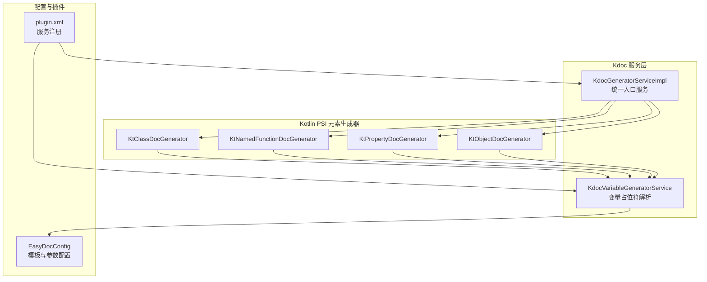
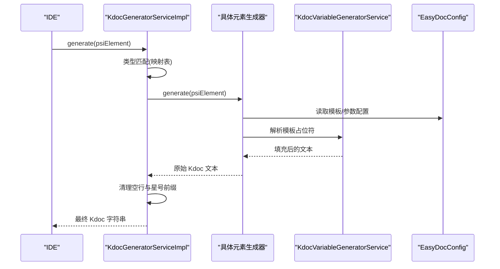
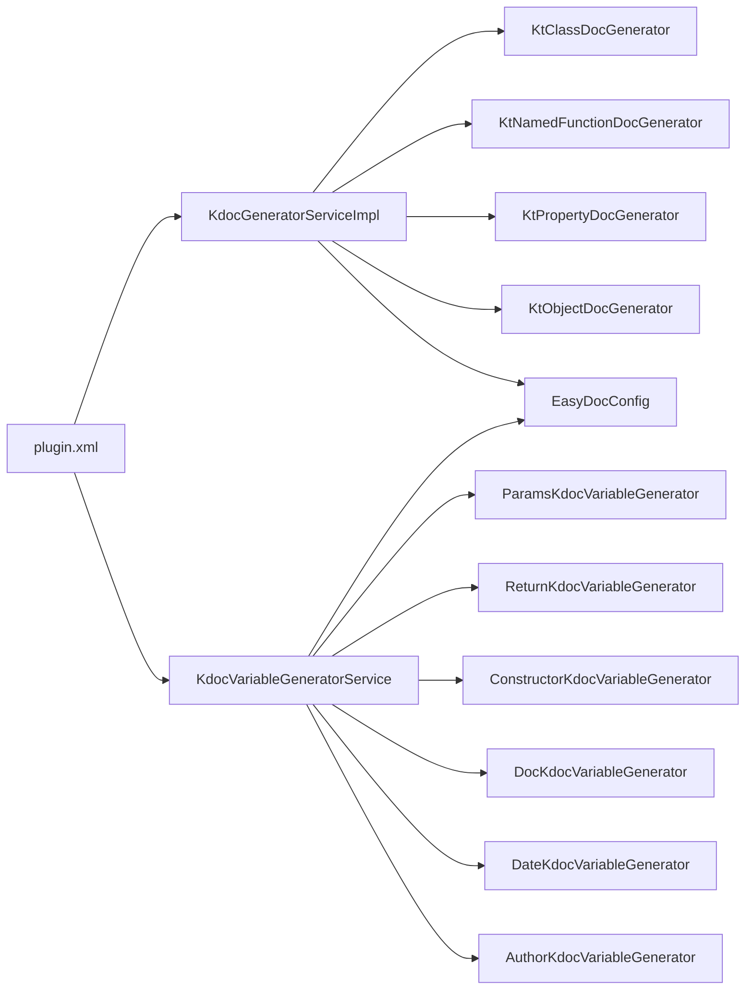

# Kdoc 注释生成

<cite>
**本文引用的文件**
- [KdocGeneratorServiceImpl.kt](file://src/main/kotlin/com/star/easydoc/kdoc/service/KdocGeneratorServiceImpl.kt)
- [KtClassDocGenerator.kt](file://src/main/kotlin/com/star/easydoc/kdoc/service/generator/impl/KtClassDocGenerator.kt)
- [KtNamedFunctionDocGenerator.kt](file://src/main/kotlin/com/star/easydoc/kdoc/service/generator/impl/KtNamedFunctionDocGenerator.kt)
- [KtPropertyDocGenerator.kt](file://src/main/kotlin/com/star/easydoc/kdoc/service/generator/impl/KtPropertyDocGenerator.kt)
- [KtObjectDocGenerator.kt](file://src/main/kotlin/com/star/easydoc/kdoc/service/generator/impl/KtObjectDocGenerator.kt)
- [KdocVariableGeneratorService.kt](file://src/main/kotlin/com/star/easydoc/kdoc/service/variable/KdocVariableGeneratorService.kt)
- [AbstractKdocVariableGenerator.kt](file://src/main/kotlin/com/star/easydoc/kdoc/service/variable/impl/AbstractKdocVariableGenerator.kt)
- [ParamsKdocVariableGenerator.kt](file://src/main/kotlin/com/star/easydoc/kdoc/service/variable/impl/ParamsKdocVariableGenerator.kt)
- [ReturnKdocVariableGenerator.kt](file://src/main/kotlin/com/star/easydoc/kdoc/service/variable/impl/ReturnKdocVariableGenerator.kt)
- [ConstructorKdocVariableGenerator.kt](file://src/main/kotlin/com/star/easydoc/kdoc/service/variable/impl/ConstructorKdocVariableGenerator.kt)
- [DocKdocVariableGenerator.kt](file://src/main/kotlin/com/star/easydoc/kdoc/service/variable/impl/DocKdocVariableGenerator.kt)
- [DateKdocVariableGenerator.kt](file://src/main/kotlin/com/star/easydoc/kdoc/service/variable/impl/DateKdocVariableGenerator.kt)
- [AuthorKdocVariableGenerator.kt](file://src/main/kotlin/com/star/easydoc/kdoc/service/variable/impl/AuthorKdocVariableGenerator.kt)
- [EasyDocConfig.java](file://src/main/java/com/star/easydoc/config/EasyDocConfig.java)
- [DocGeneratorService.java](file://src/main/java/com/star/easydoc/service/DocGeneratorService.java)
- [plugin.xml](file://src/main/resources/META-INF/plugin.xml)
- [KdocSettingsConfigurable.kt](file://src/main/kotlin/com/star/easydoc/view/settings/kdoc/KdocSettingsConfigurable.kt)
</cite>

## 目录
1. [简介](#简介)
2. [项目结构](#项目结构)
3. [核心组件](#核心组件)
4. [架构总览](#架构总览)
5. [详细组件分析](#详细组件分析)
6. [依赖分析](#依赖分析)
7. [性能考虑](#性能考虑)
8. [故障排查指南](#故障排查指南)
9. [结论](#结论)
10. [附录](#附录)

## 简介
本文件面向 Kotlin 项目的 Kdoc 注释生成功能，系统性解析 KdocGeneratorServiceImpl 的服务实现机制，阐明其对 Kotlin PSI 元素（类、函数、属性、对象）的映射与生成策略；对比 Kdoc 与 JavaDoc 的差异及 Kotlin 语言特有规则；并提供可操作的使用示例与配置项说明，帮助开发者在 Kotlin 项目中高效启用与定制 Kdoc 生成。

## 项目结构
Kdoc 功能位于 Kotlin 源码目录下，核心由“服务实现 + 生成器 + 变量生成器 + 配置 + 插件注册”构成，采用“按元素类型分发”的设计，通过统一入口服务根据 PSI 类型选择对应生成器。

图示来源
- [KdocGeneratorServiceImpl.kt:21-51](file://src/main/kotlin/com/star/easydoc/kdoc/service/KdocGeneratorServiceImpl.kt#L21-L51)
- [KdocVariableGeneratorService.kt:22-80](file://src/main/kotlin/com/star/easydoc/kdoc/service/variable/KdocVariableGeneratorService.kt#L22-L80)
- [plugin.xml:29-36](file://src/main/resources/META-INF/plugin.xml#L29-L36)

章节来源
- [plugin.xml:27-51](file://src/main/resources/META-INF/plugin.xml#L27-L51)

## 核心组件
- 统一服务入口：KdocGeneratorServiceImpl 将 PSI 元素类型与具体生成器进行映射，调用对应生成器并清理生成结果中的空行与星号前缀。
- 元素生成器：针对 KtClass、KtNamedFunction、KtProperty、KtObjectDeclaration 提供默认/自定义模板生成逻辑，并注入内部变量（作者、时间、分支、项目名、签名信息等）。
- 变量解析服务：KdocVariableGeneratorService 负责解析模板中的占位符（如 AUTHOR、DATE、DOC、PARAMS、RETURN、CONSTRUCTOR、VERSION 等），支持自定义字符串与 Groovy 脚本两种扩展方式。
- 配置中心：EasyDocConfig 提供 Kdoc 的作者、日期格式、参数模式、模板开关与模板内容、自定义变量映射等配置项。
- 插件注册：plugin.xml 将 KdocGeneratorServiceImpl、KdocVariableGeneratorService 等作为应用级服务注册，使 IDE 启动后即可使用。

章节来源
- [KdocGeneratorServiceImpl.kt:21-51](file://src/main/kotlin/com/star/easydoc/kdoc/service/KdocGeneratorServiceImpl.kt#L21-L51)
- [KdocVariableGeneratorService.kt:22-126](file://src/main/kotlin/com/star/easydoc/kdoc/service/variable/KdocVariableGeneratorService.kt#L22-L126)
- [EasyDocConfig.java:146-392](file://src/main/java/com/star/easydoc/config/EasyDocConfig.java#L146-L392)
- [plugin.xml:29-36](file://src/main/resources/META-INF/plugin.xml#L29-L36)

## 架构总览
Kdoc 生成流程从 PSI 元素入手，经由统一服务分发到对应生成器，再由变量解析服务填充模板占位符，最终输出标准 Kdoc 注释文本。

图示来源
- [KdocGeneratorServiceImpl.kt:35-51](file://src/main/kotlin/com/star/easydoc/kdoc/service/KdocGeneratorServiceImpl.kt#L35-L51)
- [KtClassDocGenerator.kt:20-30](file://src/main/kotlin/com/star/easydoc/kdoc/service/generator/impl/KtClassDocGenerator.kt#L20-L30)
- [KdocVariableGeneratorService.kt:46-80](file://src/main/kotlin/com/star/easydoc/kdoc/service/variable/KdocVariableGeneratorService.kt#L46-L80)

## 详细组件分析

### 统一服务：KdocGeneratorServiceImpl
- 映射关系：以 Kotlin PSI 类型为键，绑定到对应的生成器实例，当前支持 KtClass、KtObjectDeclaration、KtNamedFunction、KtProperty。
- 生成流程：若未命中映射则返回空；命中后调用生成器生成原始文本，再进行行过滤与清理，去除空白行与“*”前缀，保留有效注释行。
- 设计要点：集中式分发 + 清洗输出，保证生成结果整洁一致。

章节来源
- [KdocGeneratorServiceImpl.kt:22-27](file://src/main/kotlin/com/star/easydoc/kdoc/service/KdocGeneratorServiceImpl.kt#L22-L27)
- [KdocGeneratorServiceImpl.kt:35-51](file://src/main/kotlin/com/star/easydoc/kdoc/service/KdocGeneratorServiceImpl.kt#L35-L51)

### 类注释生成：KtClassDocGenerator
- 模板策略：默认模板包含 DOC、AUTHOR、DATE、CONSTRUCTOR、PARAMS 等占位符；自定义模板则直接使用用户配置。
- 内部变量：作者、完整类名、简单类名、当前分支、项目名。
- 返回策略：根据配置判断使用默认模板或自定义模板，随后交由变量解析服务生成。

章节来源
- [KtClassDocGenerator.kt:20-30](file://src/main/kotlin/com/star/easydoc/kdoc/service/generator/impl/KtClassDocGenerator.kt#L20-L30)
- [KtClassDocGenerator.kt:38-50](file://src/main/kotlin/com/star/easydoc/kdoc/service/generator/impl/KtClassDocGenerator.kt#L38-L50)
- [KtClassDocGenerator.kt:58-63](file://src/main/kotlin/com/star/easydoc/kdoc/service/generator/impl/KtClassDocGenerator.kt#L58-L63)
- [KtClassDocGenerator.kt:71-79](file://src/main/kotlin/com/star/easydoc/kdoc/service/generator/impl/KtClassDocGenerator.kt#L71-L79)

### 函数注释生成：KtNamedFunctionDocGenerator
- 模板策略：默认模板包含 DOC、PARAMS、RETURN；自定义模板由配置决定。
- 内部变量：作者、方法名、返回类型、参数类型数组、参数名称数组、当前分支、项目名。
- 返回策略：根据配置选择默认或自定义模板，交由变量解析服务生成。

章节来源
- [KtNamedFunctionDocGenerator.kt:25-35](file://src/main/kotlin/com/star/easydoc/kdoc/service/generator/impl/KtNamedFunctionDocGenerator.kt#L25-L35)
- [KtNamedFunctionDocGenerator.kt:43-55](file://src/main/kotlin/com/star/easydoc/kdoc/service/generator/impl/KtNamedFunctionDocGenerator.kt#L43-L55)
- [KtNamedFunctionDocGenerator.kt:63-68](file://src/main/kotlin/com/star/easydoc/kdoc/service/generator/impl/KtNamedFunctionDocGenerator.kt#L63-L68)
- [KtNamedFunctionDocGenerator.kt:76-87](file://src/main/kotlin/com/star/easydoc/kdoc/service/generator/impl/KtNamedFunctionDocGenerator.kt#L76-L87)

### 属性注释生成：KtPropertyDocGenerator
- 模板策略：默认模板支持“简单单行”与“多行块状”两种风格，由配置控制；自定义模板由配置决定。
- 内部变量：作者、属性名、类型（去除可空标记）、当前分支、项目名。
- 返回策略：根据配置选择默认或自定义模板，交由变量解析服务生成。

章节来源
- [KtPropertyDocGenerator.kt:23-33](file://src/main/kotlin/com/star/easydoc/kdoc/service/generator/impl/KtPropertyDocGenerator.kt#L23-L33)
- [KtPropertyDocGenerator.kt:41-53](file://src/main/kotlin/com/star/easydoc/kdoc/service/generator/impl/KtPropertyDocGenerator.kt#L41-L53)
- [KtPropertyDocGenerator.kt:61-66](file://src/main/kotlin/com/star/easydoc/kdoc/service/generator/impl/KtPropertyDocGenerator.kt#L61-L66)
- [KtPropertyDocGenerator.kt:74-82](file://src/main/kotlin/com/star/easydoc/kdoc/service/generator/impl/KtPropertyDocGenerator.kt#L74-L82)

### 对象注释生成：KtObjectDocGenerator
- 模板策略：默认模板包含 DOC、AUTHOR、DATE；自定义模板由配置决定。
- 内部变量：作者、完整类名、简单类名、项目名、当前分支。
- 返回策略：根据配置选择默认或自定义模板，交由变量解析服务生成。

章节来源
- [KtObjectDocGenerator.kt:31-46](file://src/main/kotlin/com/star/easydoc/kdoc/service/generator/impl/KtObjectDocGenerator.kt#L31-L46)
- [KtObjectDocGenerator.kt:55-63](file://src/main/kotlin/com/star/easydoc/kdoc/service/generator/impl/KtObjectDocGenerator.kt#L55-L63)

### 变量解析服务：KdocVariableGeneratorService
- 占位符匹配：使用正则匹配形如 “${VAR}” 的占位符。
- 分发策略：内置占位符（author/date/doc/params/return/see/since/constructor/version）委派给对应变量生成器；否则回退到自定义变量解析。
- 自定义变量：支持字符串与 Groovy 脚本两类；Groovy 脚本可访问内部变量映射（如作者、方法名、类型等），执行失败会记录日志并回退显示脚本原文。
- 输出处理：将所有占位符替换后返回最终字符串。

章节来源
- [KdocVariableGeneratorService.kt:23-38](file://src/main/kotlin/com/star/easydoc/kdoc/service/variable/KdocVariableGeneratorService.kt#L23-L38)
- [KdocVariableGeneratorService.kt:46-80](file://src/main/kotlin/com/star/easydoc/kdoc/service/variable/KdocVariableGeneratorService.kt#L46-L80)
- [KdocVariableGeneratorService.kt:90-121](file://src/main/kotlin/com/star/easydoc/kdoc/service/variable/KdocVariableGeneratorService.kt#L90-L121)

### 抽象变量生成器与内置变量生成器
- 抽象基类：AbstractKdocVariableGenerator 提供获取配置的能力，便于各变量生成器读取全局设置（如作者、日期格式、参数模式等）。
- 内置变量生成器：
  - ParamsKdocVariableGenerator：从 KDoc 中提取已有 @param 注释，结合翻译服务生成缺失参数注释，支持“链接模式”与“普通模式”。
  - ReturnKdocVariableGenerator：基于函数声明的返回类型生成 @return 注释，支持“链接模式”与“普通模式”。
  - ConstructorKdocVariableGenerator：生成构造函数注释，支持“链接模式”与“普通模式”。
  - DocKdocVariableGenerator：优先使用已有的 KDoc 文本，若为空则回退到基于元素名的翻译文本。
  - DateKdocVariableGenerator：按配置的日期格式生成当前日期。
  - AuthorKdocVariableGenerator：返回配置的作者名。

章节来源
- [AbstractKdocVariableGenerator.kt:14-17](file://src/main/kotlin/com/star/easydoc/kdoc/service/variable/impl/AbstractKdocVariableGenerator.kt#L14-L17)
- [ParamsKdocVariableGenerator.kt:18-66](file://src/main/kotlin/com/star/easydoc/kdoc/service/variable/impl/ParamsKdocVariableGenerator.kt#L18-L66)
- [ReturnKdocVariableGenerator.kt:12-27](file://src/main/kotlin/com/star/easydoc/kdoc/service/variable/impl/ReturnKdocVariableGenerator.kt#L12-L27)
- [ConstructorKdocVariableGenerator.kt:12-24](file://src/main/kotlin/com/star/easydoc/kdoc/service/variable/impl/ConstructorKdocVariableGenerator.kt#L12-L24)
- [DocKdocVariableGenerator.kt:17-49](file://src/main/kotlin/com/star/easydoc/kdoc/service/variable/impl/DocKdocVariableGenerator.kt#L17-L49)
- [DateKdocVariableGenerator.kt:14-27](file://src/main/kotlin/com/star/easydoc/kdoc/service/variable/impl/DateKdocVariableGenerator.kt#L14-L27)
- [AuthorKdocVariableGenerator.kt:11-16](file://src/main/kotlin/com/star/easydoc/kdoc/service/variable/impl/AuthorKdocVariableGenerator.kt#L11-L16)

### 配置与设置界面
- 配置项（Kdoc 相关）：
  - 作者：kdocAuthor
  - 日期格式：kdocDateFormat
  - 参数模式：kdocParamType（普通模式/中括号模式）
  - 属性注释风格：kdocSimpleFieldDoc（单行/多行）
  - 模板配置：kdocClassTemplateConfig、kdocMethodTemplateConfig、kdocFieldTemplateConfig（含 isDefault、template、customMap）
- 设置界面：KdocSettingsConfigurable 提供 UI，校验必填项并在应用时写入配置。

章节来源
- [EasyDocConfig.java:54-66](file://src/main/java/com/star/easydoc/config/EasyDocConfig.java#L54-L66)
- [EasyDocConfig.java:60-61](file://src/main/java/com/star/easydoc/config/EasyDocConfig.java#L60-L61)
- [EasyDocConfig.java:65-66](file://src/main/java/com/star/easydoc/config/EasyDocConfig.java#L65-L66)
- [EasyDocConfig.java:71-72](file://src/main/java/com/star/easydoc/config/EasyDocConfig.java#L71-L72)
- [EasyDocConfig.java:148-159](file://src/main/java/com/star/easydoc/config/EasyDocConfig.java#L148-L159)
- [EasyDocConfig.java:362-384](file://src/main/java/com/star/easydoc/config/EasyDocConfig.java#L362-L384)
- [KdocSettingsConfigurable.kt:15-68](file://src/main/kotlin/com/star/easydoc/view/settings/kdoc/KdocSettingsConfigurable.kt#L15-L68)

## 依赖分析
- 服务注册：plugin.xml 将 KdocGeneratorServiceImpl、KdocVariableGeneratorService 注册为应用级服务，确保 IDE 启动后可用。
- 接口契约：DocGeneratorService 定义统一生成接口，KdocGeneratorServiceImpl 实现该接口，保证与 JavaDoc 服务的一致性。
- 外部依赖：变量解析服务使用 Groovy Shell 执行脚本，需注意脚本错误的容错与日志记录。

图示来源
- [plugin.xml:29-36](file://src/main/resources/META-INF/plugin.xml#L29-L36)
- [DocGeneratorService.java:11-20](file://src/main/java/com/star/easydoc/service/DocGeneratorService.java#L11-L20)
- [KdocVariableGeneratorService.kt:28-38](file://src/main/kotlin/com/star/easydoc/kdoc/service/variable/KdocVariableGeneratorService.kt#L28-L38)

章节来源
- [plugin.xml:29-36](file://src/main/resources/META-INF/plugin.xml#L29-L36)
- [DocGeneratorService.java:11-20](file://src/main/java/com/star/easydoc/service/DocGeneratorService.java#L11-L20)

## 性能考虑
- 模板解析：KdocVariableGeneratorService 使用正则匹配与字符串替换，复杂模板与大量占位符可能带来额外开销；建议保持模板简洁。
- Groovy 脚本：自定义变量的 Groovy 执行存在运行时成本与潜在异常风险，应避免复杂逻辑与频繁调用。
- PSI 访问：生成器直接读取 PSI 元素的类型、参数、注释树等，通常性能可控；但批量生成时仍需关注 IDE UI 线程阻塞问题。
- 缓存策略：当前实现未见显式缓存，可在自定义变量生成器中引入轻量缓存以减少重复计算（例如基于元素哈希的本地缓存）。

## 故障排查指南
- 生成结果为空
  - 检查 PSI 元素类型是否被映射；确认生成器返回非空。
  - 检查模板是否为空或 isDefault 与自定义模板配置冲突。
- 注释不完整或缺少参数/返回
  - 确认 ParamsKdocVariableGenerator 与 ReturnKdocVariableGenerator 的启用状态与参数模式。
  - 若依赖翻译服务，检查网络与翻译配置。
- 自定义变量脚本报错
  - 查看日志中关于 Groovy 执行异常的信息；修正脚本语法与返回值。
- 设置界面无法保存
  - 确认必填项（作者、日期格式、参数模式、属性注释风格）均填写；KdocSettingsConfigurable 会对空值抛出异常。

章节来源
- [KdocGeneratorServiceImpl.kt:43-44](file://src/main/kotlin/com/star/easydoc/kdoc/service/KdocGeneratorServiceImpl.kt#L43-L44)
- [KdocVariableGeneratorService.kt:107-117](file://src/main/kotlin/com/star/easydoc/kdoc/service/variable/KdocVariableGeneratorService.kt#L107-L117)
- [KdocSettingsConfigurable.kt:46-57](file://src/main/kotlin/com/star/easydoc/view/settings/kdoc/KdocSettingsConfigurable.kt#L46-L57)

## 结论
Kdoc 注释生成体系以统一服务为核心，围绕 Kotlin PSI 元素类型提供可扩展的生成器与变量解析能力。通过模板与自定义变量机制，既能满足标准化注释需求，又允许灵活定制。配合插件注册与设置界面，开发者可快速在 Kotlin 项目中启用并优化 Kdoc 生成体验。

## 附录

### Kdoc 与 JavaDoc 的差异与 Kotlin 特有规则
- 注释容器
  - JavaDoc：以块注释形式存在于 Java 源码中，IDE 与工具链广泛支持。
  - Kdoc：Kotlin 的文档注释以 KDoc 形式内嵌于 PSI 树中，可通过 KDocSection、KDocTag 等节点访问。
- 参数与返回
  - JavaDoc：通过 @param、@return 等标签明确描述参数与返回值。
  - Kdoc：同样支持 @param、@return，但可通过变量生成器自动从函数签名与现有 KDoc 中抽取或生成。
- 构造函数
  - JavaDoc：通常通过类注释说明构造行为。
  - Kdoc：提供专门的 CONSTRUCTOR 占位符生成器，可生成构造函数级别的注释。
- 模板与变量
  - 两者均支持占位符与自定义变量；Kdoc 在变量解析上更贴近 Kotlin PSI 语义，如直接读取类型引用、参数列表等。

章节来源
- [ParamsKdocVariableGenerator.kt:28-43](file://src/main/kotlin/com/star/easydoc/kdoc/service/variable/impl/ParamsKdocVariableGenerator.kt#L28-L43)
- [ReturnKdocVariableGenerator.kt:13-26](file://src/main/kotlin/com/star/easydoc/kdoc/service/variable/impl/ReturnKdocVariableGenerator.kt#L13-L26)
- [ConstructorKdocVariableGenerator.kt:13-23](file://src/main/kotlin/com/star/easydoc/kdoc/service/variable/impl/ConstructorKdocVariableGenerator.kt#L13-L23)
- [DocKdocVariableGenerator.kt:19-48](file://src/main/kotlin/com/star/easydoc/kdoc/service/variable/impl/DocKdocVariableGenerator.kt#L19-L48)

### 使用示例与配置步骤
- 启用与入口
  - 在 IDE 中打开设置，进入“EasyDocKdoc”页面，配置作者、日期格式、参数模式、属性注释风格。
  - 通过菜单“Tools > EasyJavadoc”触发生成，或使用快捷键。
- 配置模板
  - 进入“EasyDocKdoc > EasyDocKtClassTemplate/EasyDocKtMethodTemplate/EasyDocKtFieldTemplate”，切换到“自定义模板”并编写模板。
  - 模板中可使用内置占位符（如 AUTHOR、DATE、DOC、PARAMS、RETURN、CONSTRUCTOR、VERSION 等），也可添加自定义占位符并通过 customMap 指定字符串或 Groovy 脚本。
- 常用占位符说明
  - AUTHOR：作者名（来自配置）。
  - DATE：当前日期（格式来自配置）。
  - DOC：基于元素名的翻译文本，若已有 KDoc 则优先使用 KDoc 文本。
  - PARAMS：参数注释，支持从现有 KDoc 提取或自动生成。
  - RETURN：返回值注释，基于函数声明的返回类型。
  - CONSTRUCTOR：构造函数注释，基于类名生成。
  - VERSION：版本占位符（可由自定义变量生成）。
- 注意事项
  - 参数模式会影响 @param 与 @return 的展示风格（普通模式 vs 中括号模式）。
  - 属性注释风格会影响属性注释是单行还是多行块状。
  - 自定义 Groovy 脚本需保证返回字符串，否则将回退显示脚本原文并记录错误日志。

章节来源
- [KdocSettingsConfigurable.kt:20-38](file://src/main/kotlin/com/star/easydoc/view/settings/kdoc/KdocSettingsConfigurable.kt#L20-L38)
- [KdocSettingsConfigurable.kt:40-58](file://src/main/kotlin/com/star/easydoc/view/settings/kdoc/KdocSettingsConfigurable.kt#L40-L58)
- [KdocVariableGeneratorService.kt:28-38](file://src/main/kotlin/com/star/easydoc/kdoc/service/variable/KdocVariableGeneratorService.kt#L28-L38)
- [EasyDocConfig.java:71-72](file://src/main/java/com/star/easydoc/config/EasyDocConfig.java#L71-L72)
- [EasyDocConfig.java:65-66](file://src/main/java/com/star/easydoc/config/EasyDocConfig.java#L65-L66)
- [EasyDocConfig.java:362-384](file://src/main/java/com/star/easydoc/config/EasyDocConfig.java#L362-L384)