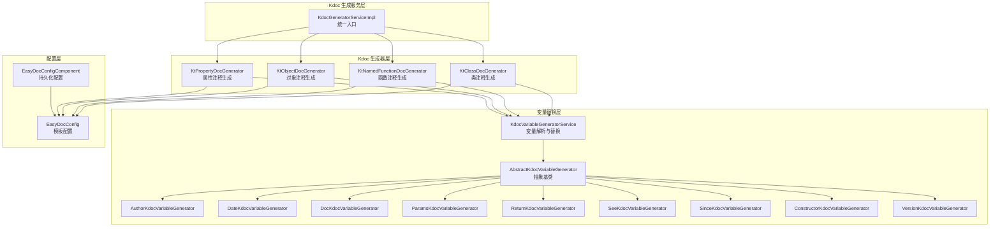
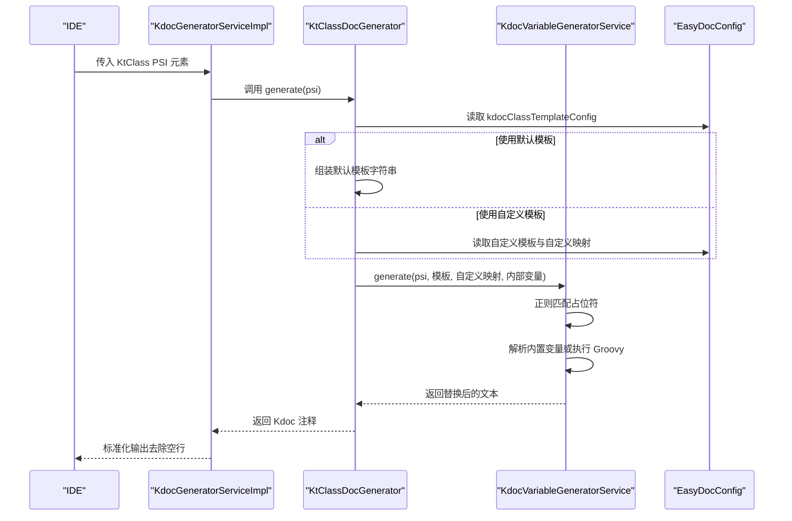
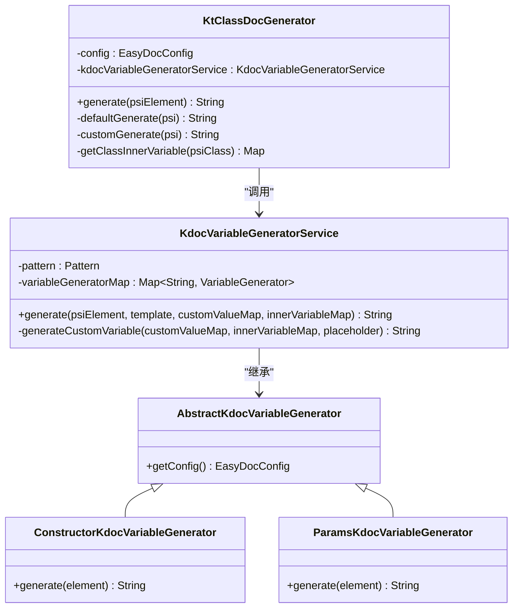
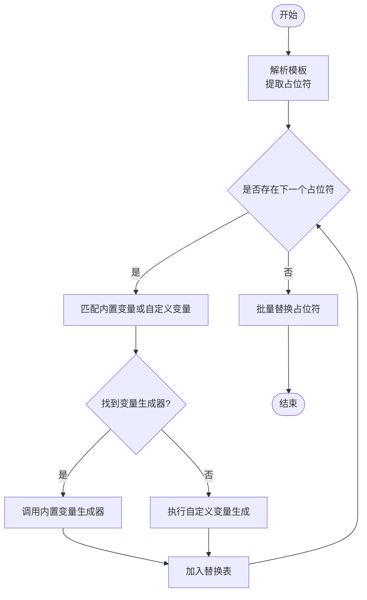
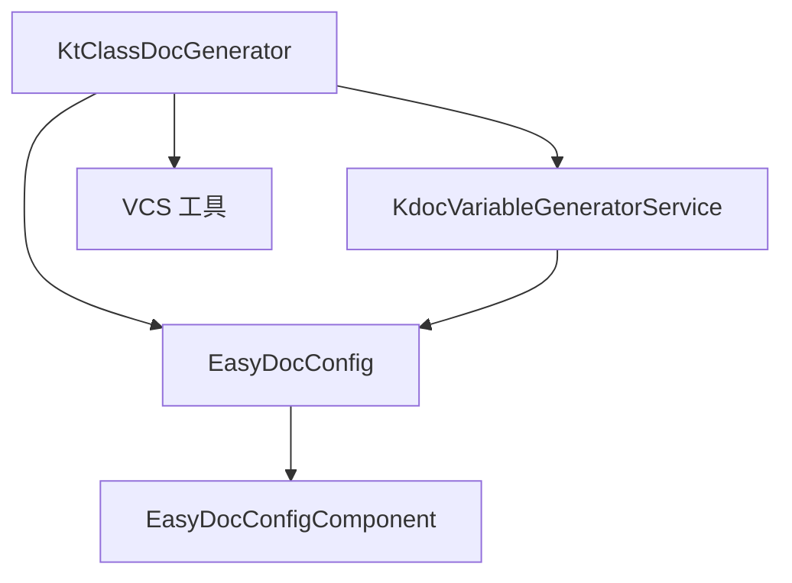

# KtClassDocGenerator 类文档生成器

<cite>
**本文档引用的文件**
- [KtClassDocGenerator.kt](file://src/main/kotlin/com/star/easydoc/kdoc/service/generator/impl/KtClassDocGenerator.kt)
- [KdocGeneratorServiceImpl.kt](file://src/main/kotlin/com/star/easydoc/kdoc/service/KdocGeneratorServiceImpl.kt)
- [KdocVariableGeneratorService.kt](file://src/main/kotlin/com/star/easydoc/kdoc/service/variable/KdocVariableGeneratorService.kt)
- [AbstractKdocVariableGenerator.kt](file://src/main/kotlin/com/star/easydoc/kdoc/service/variable/impl/AbstractKdocVariableGenerator.kt)
- [ConstructorKdocVariableGenerator.kt](file://src/main/kotlin/com/star/easydoc/kdoc/service/variable/impl/ConstructorKdocVariableGenerator.kt)
- [ParamsKdocVariableGenerator.kt](file://src/main/kotlin/com/star/easydoc/kdoc/service/variable/impl/ParamsKdocVariableGenerator.kt)
- [KtNamedFunctionDocGenerator.kt](file://src/main/kotlin/com/star/easydoc/kdoc/service/generator/impl/KtNamedFunctionDocGenerator.kt)
- [KtObjectDocGenerator.kt](file://src/main/kotlin/com/star/easydoc/kdoc/service/generator/impl/KtObjectDocGenerator.kt)
- [KtPropertyDocGenerator.kt](file://src/main/kotlin/com/star/easydoc/kdoc/service/generator/impl/KtPropertyDocGenerator.kt)
- [EasyDocConfig.java](file://src/main/java/com/star/easydoc/config/EasyDocConfig.java)
- [EasyDocConfigComponent.java](file://src/main/java/com/star/easydoc/config/EasyDocConfigComponent.java)
- [plugin.xml](file://src/main/resources/META-INF/plugin.xml)
</cite>

## 目录
1. [简介](#简介)
2. [项目结构](#项目结构)
3. [核心组件](#核心组件)
4. [架构总览](#架构总览)
5. [详细组件分析](#详细组件分析)
6. [依赖关系分析](#依赖关系分析)
7. [性能考虑](#性能考虑)
8. [故障排除指南](#故障排除指南)
9. [结论](#结论)
10. [附录](#附录)

## 简介
本文档围绕 KtClassDocGenerator 类文档生成器展开，系统性阐述其在 Kotlin 代码注释生成中的职责与实现机制。重点涵盖：
- 类级别注释模板的默认与自定义生成策略
- 内部变量与自定义变量替换机制
- Kdoc 注释格式规范与占位符体系
- 对继承关系、泛型参数等特性的处理现状与建议
- 面向普通类、抽象类、密封类等不同类型的注释生成实践

## 项目结构
KtClassDocGenerator 位于 Kotlin 文档生成模块中，与其它 Kdoc 生成器共同构成统一的注释生成体系。整体采用“服务层 + 生成器层 + 变量替换层”的分层设计。

图表来源
- [KdocGeneratorServiceImpl.kt:21-52](file://src/main/kotlin/com/star/easydoc/kdoc/service/KdocGeneratorServiceImpl.kt#L21-L52)
- [KtClassDocGenerator.kt:16-81](file://src/main/kotlin/com/star/easydoc/kdoc/service/generator/impl/KtClassDocGenerator.kt#L16-L81)
- [KdocVariableGeneratorService.kt:22-126](file://src/main/kotlin/com/star/easydoc/kdoc/service/variable/KdocVariableGeneratorService.kt#L22-L126)
- [AbstractKdocVariableGenerator.kt:14-18](file://src/main/kotlin/com/star/easydoc/kdoc/service/variable/impl/AbstractKdocVariableGenerator.kt#L14-L18)
- [EasyDocConfig.java:148-254](file://src/main/java/com/star/easydoc/config/EasyDocConfig.java#L148-L254)
- [EasyDocConfigComponent.java:20-68](file://src/main/java/com/star/easydoc/config/EasyDocConfigComponent.java#L20-L68)

章节来源
- [KdocGeneratorServiceImpl.kt:21-52](file://src/main/kotlin/com/star/easydoc/kdoc/service/KdocGeneratorServiceImpl.kt#L21-L52)
- [plugin.xml:29-36](file://src/main/resources/META-INF/plugin.xml#L29-L36)

## 核心组件
- KtClassDocGenerator：负责 Kotlin 类的 Kdoc 注释生成，支持默认模板与自定义模板两种模式，并通过变量替换服务完成占位符填充。
- KdocGeneratorServiceImpl：统一调度器，根据 PSI 元素类型选择对应的生成器，最终输出标准化的 Kdoc 注释文本。
- KdocVariableGeneratorService：变量解析与替换引擎，支持内置变量（如作者、日期、构造说明、参数列表、返回值、参见、时间、版本）与自定义变量（字符串或 Groovy 脚本），并按模板进行批量替换。
- EasyDocConfig/EasyDocConfigComponent：提供模板配置、参数类型、作者信息、日期格式等全局设置，支撑生成器行为。

章节来源
- [KtClassDocGenerator.kt:16-81](file://src/main/kotlin/com/star/easydoc/kdoc/service/generator/impl/KtClassDocGenerator.kt#L16-L81)
- [KdocGeneratorServiceImpl.kt:21-52](file://src/main/kotlin/com/star/easydoc/kdoc/service/KdocGeneratorServiceImpl.kt#L21-L52)
- [KdocVariableGeneratorService.kt:22-126](file://src/main/kotlin/com/star/easydoc/kdoc/service/variable/KdocVariableGeneratorService.kt#L22-L126)
- [EasyDocConfig.java:148-254](file://src/main/java/com/star/easydoc/config/EasyDocConfig.java#L148-L254)
- [EasyDocConfigComponent.java:20-68](file://src/main/java/com/star/easydoc/config/EasyDocConfigComponent.java#L20-L68)

## 架构总览
KtClassDocGenerator 的工作流由“类型判定 → 模板选择 → 变量注入 → 替换渲染”四步组成。默认模板包含文档主体、作者、日期、构造说明、参数列表等占位符；自定义模板则完全由用户控制。变量替换服务负责解析占位符并生成对应内容，支持内置变量与自定义变量（字符串/Groovy）。

图表来源
- [KdocGeneratorServiceImpl.kt:35-51](file://src/main/kotlin/com/star/easydoc/kdoc/service/KdocGeneratorServiceImpl.kt#L35-L51)
- [KtClassDocGenerator.kt:20-63](file://src/main/kotlin/com/star/easydoc/kdoc/service/generator/impl/KtClassDocGenerator.kt#L20-L63)
- [KdocVariableGeneratorService.kt:46-80](file://src/main/kotlin/com/star/easydoc/kdoc/service/variable/KdocVariableGeneratorService.kt#L46-L80)

## 详细组件分析

### KtClassDocGenerator 类分析
- 角色定位：Kdoc 体系中负责 Kotlin 类注释生成的核心组件。
- 关键职责：
  - 类型校验：确保输入为 KtClass。
  - 模板选择：依据配置判断使用默认模板还是自定义模板。
  - 变量注入：构建内部变量映射（作者、类名、分支、项目名等）。
  - 调用替换：委托变量替换服务完成占位符渲染。
- 默认模板要点：
  - 包含文档主体、作者、日期、构造说明、参数列表等占位符。
  - 支持参数类型模式（链接/普通）对构造说明与参数标签呈现的影响。
- 自定义模板：
  - 用户可完全自定义注释结构与内容。
  - 仍遵循占位符替换规则，支持内置变量与自定义变量。

图表来源
- [KtClassDocGenerator.kt:16-81](file://src/main/kotlin/com/star/easydoc/kdoc/service/generator/impl/KtClassDocGenerator.kt#L16-L81)
- [KdocVariableGeneratorService.kt:22-126](file://src/main/kotlin/com/star/easydoc/kdoc/service/variable/KdocVariableGeneratorService.kt#L22-L126)
- [AbstractKdocVariableGenerator.kt:14-18](file://src/main/kotlin/com/star/easydoc/kdoc/service/variable/impl/AbstractKdocVariableGenerator.kt#L14-L18)
- [ConstructorKdocVariableGenerator.kt:12-24](file://src/main/kotlin/com/star/easydoc/kdoc/service/variable/impl/ConstructorKdocVariableGenerator.kt#L12-L24)
- [ParamsKdocVariableGenerator.kt:18-66](file://src/main/kotlin/com/star/easydoc/kdoc/service/variable/impl/ParamsKdocVariableGenerator.kt#L18-L66)

章节来源
- [KtClassDocGenerator.kt:20-79](file://src/main/kotlin/com/star/easydoc/kdoc/service/generator/impl/KtClassDocGenerator.kt#L20-L79)

### 变量替换机制与占位符体系
- 占位符匹配：使用正则表达式识别形如 “$占位符$” 的标记。
- 内置变量：
  - author/date/doc/params/return/see/since/version/constructor 等。
  - 由对应的变量生成器负责生成具体内容。
- 自定义变量：
  - 支持字符串直接替换与 Groovy 脚本动态计算。
  - Groovy 脚本可访问内部变量映射，便于复杂逻辑。
- 错误处理：Groovy 执行异常会记录日志并回退到原始占位符。

图表来源
- [KdocVariableGeneratorService.kt:46-121](file://src/main/kotlin/com/star/easydoc/kdoc/service/variable/KdocVariableGeneratorService.kt#L46-L121)

章节来源
- [KdocVariableGeneratorService.kt:23-80](file://src/main/kotlin/com/star/easydoc/kdoc/service/variable/KdocVariableGeneratorService.kt#L23-L80)

### Kdoc 注释格式与默认模板
- 默认模板结构：包含文档主体、作者、日期、构造说明、参数列表等段落，便于统一风格。
- 参数类型影响：
  - 构造说明与参数标签在“链接模式”下会使用方括号形式以增强可读性。
- 自定义模板：允许完全自定义注释结构，但需保证占位符语义一致。

章节来源
- [KtClassDocGenerator.kt:38-63](file://src/main/kotlin/com/star/easydoc/kdoc/service/generator/impl/KtClassDocGenerator.kt#L38-L63)
- [ConstructorKdocVariableGenerator.kt:18-23](file://src/main/kotlin/com/star/easydoc/kdoc/service/variable/impl/ConstructorKdocVariableGenerator.kt#L18-L23)
- [ParamsKdocVariableGenerator.kt:47-51](file://src/main/kotlin/com/star/easydoc/kdoc/service/variable/impl/ParamsKdocVariableGenerator.kt#L47-L51)

### 继承关系与泛型参数处理
- 继承关系：当前实现未对类的父类/接口关系进行专门处理，注释生成主要基于 PSI 元素本身信息。
- 泛型参数：默认模板未包含泛型参数说明；若需体现泛型，可在自定义模板中添加相应占位符与变量生成逻辑。
- 建议：
  - 在自定义模板中显式声明泛型参数占位符。
  - 通过自定义变量生成器解析 KtClass 的类型参数并注入到模板。

章节来源
- [KtClassDocGenerator.kt:71-79](file://src/main/kotlin/com/star/easydoc/kdoc/service/generator/impl/KtClassDocGenerator.kt#L71-L79)

### 不同类型 Kotlin 类的注释生成策略
- 普通类：使用类注释生成器，遵循默认或自定义模板。
- 抽象类：注释生成逻辑与普通类一致，可通过自定义模板强调“抽象”语义。
- 密封类：注释生成逻辑与普通类一致，可在自定义模板中补充“密封类”标识与子类概览提示。

章节来源
- [KdocGeneratorServiceImpl.kt:22-27](file://src/main/kotlin/com/star/easydoc/kdoc/service/KdocGeneratorServiceImpl.kt#L22-L27)

## 依赖关系分析
- 组件耦合：
  - KtClassDocGenerator 依赖 EasyDocConfig 与 KdocVariableGeneratorService。
  - KdocVariableGeneratorService 依赖各内置变量生成器与配置。
- 外部依赖：
  - IntelliJ 平台服务（ServiceManager）、VCS 工具（分支信息）。
  - Groovy 引擎用于自定义变量脚本执行。
- 服务注册：
  - KdocGeneratorServiceImpl 作为应用服务被插件框架管理，统一对外提供生成能力。

图表来源
- [KtClassDocGenerator.kt:17-18](file://src/main/kotlin/com/star/easydoc/kdoc/service/generator/impl/KtClassDocGenerator.kt#L17-L18)
- [KdocVariableGeneratorService.kt:22-38](file://src/main/kotlin/com/star/easydoc/kdoc/service/variable/KdocVariableGeneratorService.kt#L22-L38)
- [EasyDocConfig.java:148-254](file://src/main/java/com/star/easydoc/config/EasyDocConfig.java#L148-L254)
- [EasyDocConfigComponent.java:20-68](file://src/main/java/com/star/easydoc/config/EasyDocConfigComponent.java#L20-L68)

章节来源
- [plugin.xml:29-36](file://src/main/resources/META-INF/plugin.xml#L29-L36)

## 性能考虑
- 模板解析：正则匹配与批量替换为 O(n) 级别，通常开销较小。
- Groovy 执行：自定义变量脚本可能带来额外开销，建议避免复杂逻辑或缓存结果。
- PSI 访问：变量生成器频繁访问 PSI 元素，注意在大规模批量生成时的线程安全与资源占用。

## 故障排除指南
- 自定义变量 Groovy 执行失败：
  - 现象：注释中出现原始占位符而非预期内容。
  - 排查：检查 Groovy 脚本语法与返回值类型；查看日志错误信息。
- 占位符未生效：
  - 现象：注释中存在未替换的 “$VAR$”。
  - 排查：确认占位符大小写与内置变量名称一致；检查自定义映射键名是否匹配。
- 参数列表为空：
  - 现象：@param 标签缺失。
  - 排查：确认方法参数存在；检查参数类型模式设置。

章节来源
- [KdocVariableGeneratorService.kt:107-117](file://src/main/kotlin/com/star/easydoc/kdoc/service/variable/KdocVariableGeneratorService.kt#L107-L117)
- [ParamsKdocVariableGenerator.kt:24-27](file://src/main/kotlin/com/star/easydoc/kdoc/service/variable/impl/ParamsKdocVariableGenerator.kt#L24-L27)

## 结论
KtClassDocGenerator 提供了稳定、可扩展的 Kotlin 类注释生成能力。通过默认与自定义模板结合变量替换机制，既能满足标准化需求，又能灵活适配团队规范。对于继承关系与泛型参数等高级特性，建议通过自定义模板与变量生成器进行增强，以获得更贴合业务场景的注释质量。

## 附录

### 使用示例（步骤说明）
- 为普通类生成注释：
  - 在设置界面配置类模板（默认或自定义）。
  - 选中目标 Kotlin 类，触发生成流程。
  - 查看生成的 Kdoc 注释，确认作者、日期、构造说明、参数列表等占位符已正确替换。
- 为抽象类生成注释：
  - 在自定义模板中添加“抽象类”标识与注意事项。
  - 保持参数类型模式一致，确保构造说明与参数标签呈现清晰。
- 为密封类生成注释：
  - 在自定义模板中补充密封类说明与子类概览。
  - 如需泛型参数，新增相应占位符并在变量生成器中实现解析逻辑。

### 配置项参考
- 模板配置：
  - kdocClassTemplateConfig：类模板配置（是否默认、模板内容、自定义映射）。
- 参数类型：
  - kdocParamType：参数类型模式（普通/链接），影响构造说明与参数标签呈现。
- 作者与日期：
  - kdocAuthor、kdocDateFormat：作者与日期格式设置。

章节来源
- [EasyDocConfig.java:148-254](file://src/main/java/com/star/easydoc/config/EasyDocConfig.java#L148-L254)
- [EasyDocConfig.java:386-392](file://src/main/java/com/star/easydoc/config/EasyDocConfig.java#L386-L392)
- [EasyDocConfigComponent.java:47-54](file://src/main/java/com/star/easydoc/config/EasyDocConfigComponent.java#L47-L54)