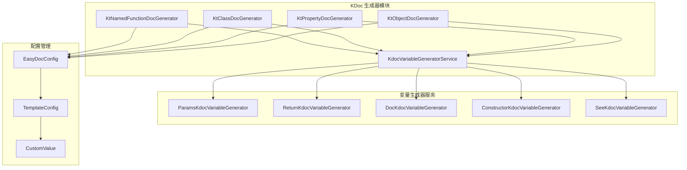
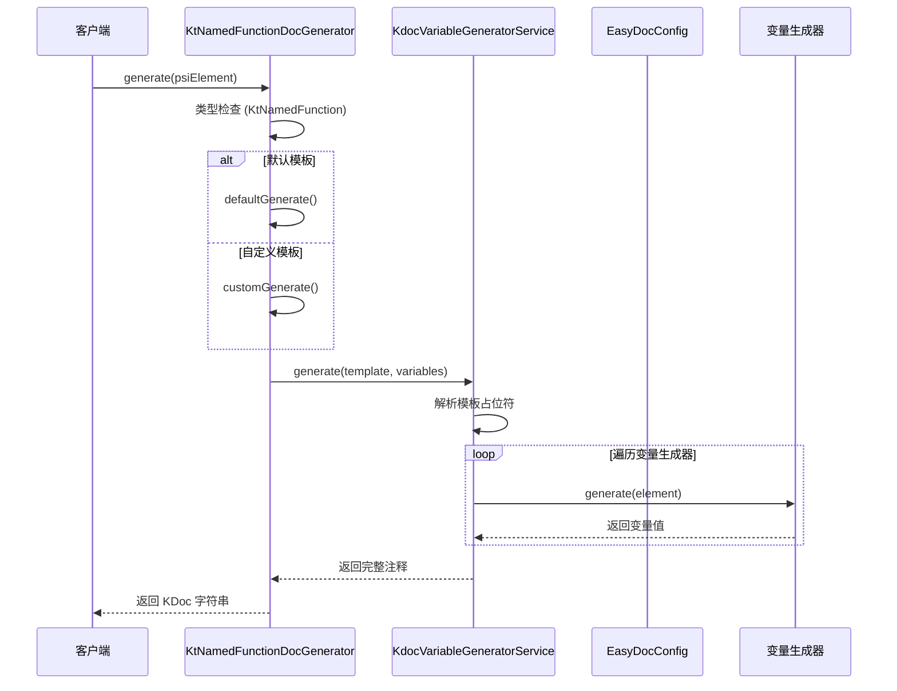
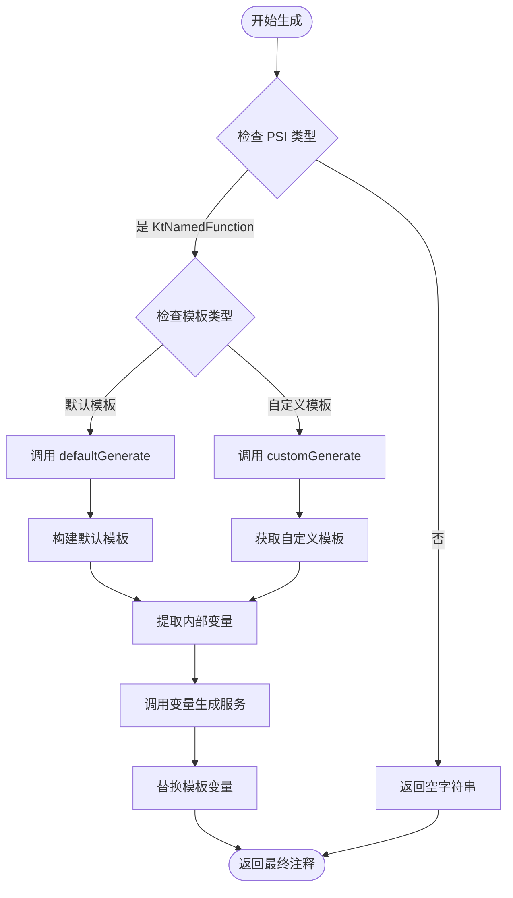
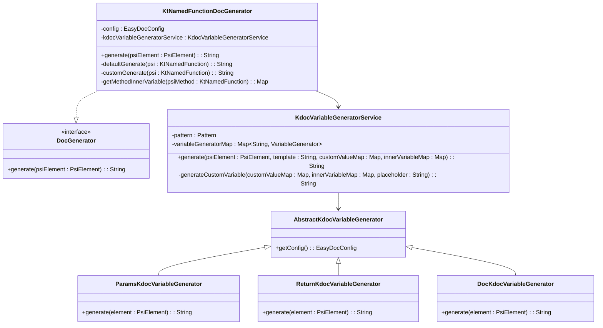
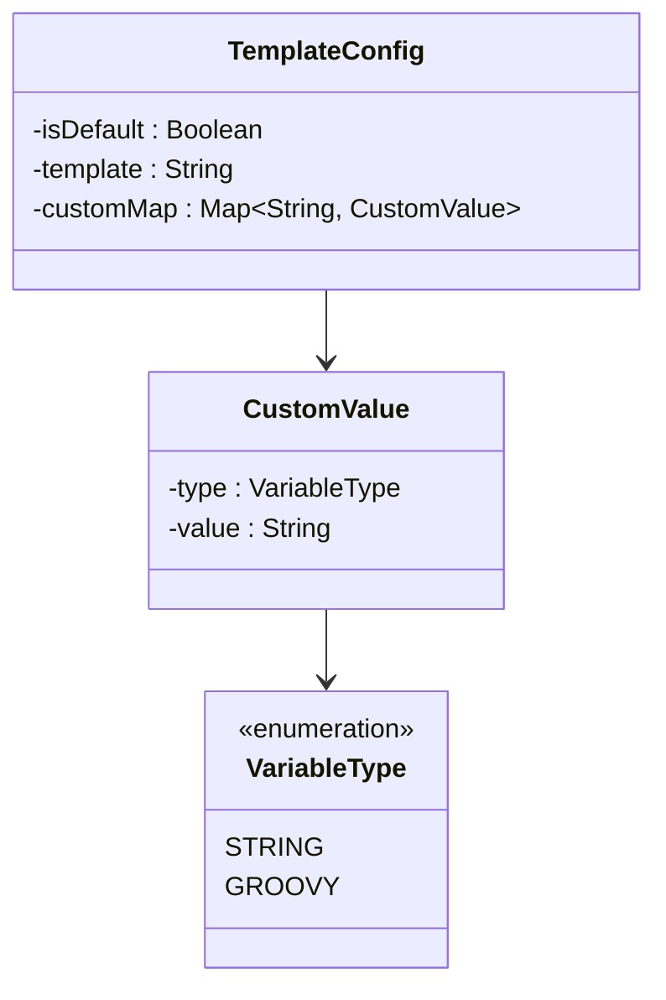
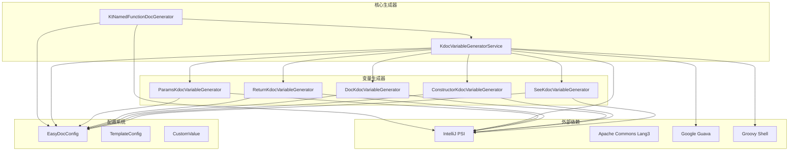

# KtNamedFunctionDocGenerator 函数文档生成器

<cite>
**本文档引用的文件**
- [KtNamedFunctionDocGenerator.kt](file://src/main/kotlin/com/star/easydoc/kdoc/service/generator/impl/KtNamedFunctionDocGenerator.kt)
- [KdocVariableGeneratorService.kt](file://src/main/kotlin/com/star/easydoc/kdoc/service/variable/KdocVariableGeneratorService.kt)
- [ParamsKdocVariableGenerator.kt](file://src/main/kotlin/com/star/easydoc/kdoc/service/variable/impl/ParamsKdocVariableGenerator.kt)
- [ReturnKdocVariableGenerator.kt](file://src/main/kotlin/com/star/easydoc/kdoc/service/variable/impl/ReturnKdocVariableGenerator.kt)
- [DocKdocVariableGenerator.kt](file://src/main/kotlin/com/star/easydoc/kdoc/service/variable/impl/DocKdocVariableGenerator.kt)
- [ConstructorKdocVariableGenerator.kt](file://src/main/kotlin/com/star/easydoc/kdoc/service/variable/impl/ConstructorKdocVariableGenerator.kt)
- [AbstractKdocVariableGenerator.kt](file://src/main/kotlin/com/star/easydoc/kdoc/service/variable/impl/AbstractKdocVariableGenerator.kt)
- [KdocGeneratorServiceImpl.kt](file://src/main/kotlin/com/star/easydoc/kdoc/service/KdocGeneratorServiceImpl.kt)
- [EasyDocConfig.java](file://src/main/java/com/star/easydoc/config/EasyDocConfig.java)
</cite>

## 目录
1. [简介](#简介)
2. [项目结构](#项目结构)
3. [核心组件](#核心组件)
4. [架构概览](#架构概览)
5. [详细组件分析](#详细组件分析)
6. [依赖关系分析](#依赖关系分析)
7. [性能考虑](#性能考虑)
8. [故障排除指南](#故障排除指南)
9. [结论](#结论)

## 简介

KtNamedFunctionDocGenerator 是 EasyDoc 插件中的一个专门用于生成 Kotlin 函数 KDoc 注释的文档生成器。该生成器基于 IntelliJ IDEA 的 PSI（Program Structure Interface）系统，能够自动分析 Kotlin 函数的语法结构，提取函数签名信息，并生成符合标准 KDoc 格式的注释文档。

该生成器支持多种 Kotlin 函数类型，包括普通函数、扩展函数、运算符重载函数等，并提供了灵活的模板配置机制，允许用户自定义注释格式和内容。

## 项目结构

EasyDoc 项目采用模块化的架构设计，KDoc 功能位于 `src/main/kotlin/com/star/easydoc/kdoc/` 目录下，主要包含以下关键组件：

**图表来源**
- [KtNamedFunctionDocGenerator.kt:1-88](file://src/main/kotlin/com/star/easydoc/kdoc/service/generator/impl/KtNamedFunctionDocGenerator.kt#L1-L88)
- [KdocVariableGeneratorService.kt:1-126](file://src/main/kotlin/com/star/easydoc/kdoc/service/variable/KdocVariableGeneratorService.kt#L1-L126)

**章节来源**
- [KtNamedFunctionDocGenerator.kt:1-88](file://src/main/kotlin/com/star/easydoc/kdoc/service/generator/impl/KtNamedFunctionDocGenerator.kt#L1-L88)
- [KdocGeneratorServiceImpl.kt:1-27](file://src/main/kotlin/com/star/easydoc/kdoc/service/KdocGeneratorServiceImpl.kt#L1-L27)

## 核心组件

### KtNamedFunctionDocGenerator 主要功能

KtNamedFunctionDocGenerator 作为核心的函数文档生成器，负责处理 Kotlin 命名函数的注释生成。其主要特性包括：

1. **类型安全检查**：确保只处理 KtNamedFunction 类型的 PSI 元素
2. **模板驱动生成**：支持默认模板和自定义模板两种生成模式
3. **智能变量替换**：通过 KdocVariableGeneratorService 实现动态变量替换
4. **配置集成**：与 EasyDocConfig 系统深度集成，支持各种配置选项

### 变量生成器体系

系统提供了完整的变量生成器体系，每个变量生成器负责特定类型的注释内容生成：

| 变量生成器 | 功能描述 | 处理内容 |
|-----------|----------|----------|
| ParamsKdocVariableGenerator | 参数注释生成 | @param 标签及其描述 |
| ReturnKdocVariableGenerator | 返回值注释生成 | @return 标签及其类型说明 |
| DocKdocVariableGenerator | 文档内容生成 | 函数描述和摘要信息 |
| ConstructorKdocVariableGenerator | 构造函数注释生成 | @constructor 标签 |
| SeeKdocVariableGenerator | 参考链接生成 | @see 标签及其目标 |

**章节来源**
- [KtNamedFunctionDocGenerator.kt:19-88](file://src/main/kotlin/com/star/easydoc/kdoc/service/generator/impl/KtNamedFunctionDocGenerator.kt#L19-L88)
- [KdocVariableGeneratorService.kt:22-126](file://src/main/kotlin/com/star/easydoc/kdoc/service/variable/KdocVariableGeneratorService.kt#L22-L126)

## 架构概览

### 整体架构设计

**图表来源**
- [KtNamedFunctionDocGenerator.kt:25-68](file://src/main/kotlin/com/star/easydoc/kdoc/service/generator/impl/KtNamedFunctionDocGenerator.kt#L25-L68)
- [KdocVariableGeneratorService.kt:46-80](file://src/main/kotlin/com/star/easydoc/kdoc/service/variable/KdocVariableGeneratorService.kt#L46-L80)

### 模板处理流程

**图表来源**
- [KtNamedFunctionDocGenerator.kt:25-87](file://src/main/kotlin/com/star/easydoc/kdoc/service/generator/impl/KtNamedFunctionDocGenerator.kt#L25-L87)

## 详细组件分析

### KtNamedFunctionDocGenerator 类分析

**图表来源**
- [KtNamedFunctionDocGenerator.kt:19-88](file://src/main/kotlin/com/star/easydoc/kdoc/service/generator/impl/KtNamedFunctionDocGenerator.kt#L19-L88)
- [KdocVariableGeneratorService.kt:22-126](file://src/main/kotlin/com/star/easydoc/kdoc/service/variable/KdocVariableGeneratorService.kt#L22-L126)
- [AbstractKdocVariableGenerator.kt:14-18](file://src/main/kotlin/com/star/easydoc/kdoc/service/variable/impl/AbstractKdocVariableGenerator.kt#L14-L18)

#### 参数注释生成器 (ParamsKdocVariableGenerator)

参数注释生成器是处理函数参数文档的核心组件，具有以下特性：

1. **参数提取**：从 KtNamedDeclaration 中提取所有参数名称
2. **现有文档读取**：解析现有的 KDoc 注释，提取已有的 @param 标签
3. **智能翻译**：对未提供的参数描述进行自动翻译
4. **格式化输出**：根据配置生成标准的 @param 格式

#### 返回值注释生成器 (ReturnKdocVariableGenerator)

返回值注释生成器专注于处理函数的返回值文档：

1. **类型检查**：验证函数是否声明了返回类型
2. **条件生成**：只有在存在显式返回类型时才生成 @return 标签
3. **格式适配**：根据配置选择不同的格式风格

#### 文档内容生成器 (DocKdocVariableGenerator)

文档内容生成器负责生成函数的主要描述文本：

1. **名称翻译**：将函数名翻译为可读的描述文本
2. **现有注释读取**：解析并提取现有的 KDoc 文档内容
3. **内容合并**：将翻译后的名称与现有文档内容进行智能合并

**章节来源**
- [ParamsKdocVariableGenerator.kt:18-66](file://src/main/kotlin/com/star/easydoc/kdoc/service/variable/impl/ParamsKdocVariableGenerator.kt#L18-L66)
- [ReturnKdocVariableGenerator.kt:12-27](file://src/main/kotlin/com/star/easydoc/kdoc/service/variable/impl/ReturnKdocVariableGenerator.kt#L12-L27)
- [DocKdocVariableGenerator.kt:17-49](file://src/main/kotlin/com/star/easydoc/kdoc/service/variable/impl/DocKdocVariableGenerator.kt#L17-L49)

### 配置系统集成

EasyDocConfig 提供了丰富的配置选项，支持对 KDoc 生成过程的精细控制：

#### 模板配置结构

**图表来源**
- [EasyDocConfig.java:211-254](file://src/main/java/com/star/easydoc/config/EasyDocConfig.java#L211-L254)
- [EasyDocConfig.java:257-325](file://src/main/java/com/star/easydoc/config/EasyDocConfig.java#L257-L325)

#### 配置选项详解

| 配置项 | 类型 | 默认值 | 描述 |
|--------|------|--------|------|
| kdocParamType | String | "中括号模式" | 参数类型显示模式 |
| kdocMethodTemplateConfig | TemplateConfig | 新建对象 | 方法模板配置 |
| kdocAuthor | String | "admin" | 默认作者信息 |
| kdocSimpleFieldDoc | Boolean | false | 简单字段文档模式 |

**章节来源**
- [EasyDocConfig.java:338-392](file://src/main/java/com/star/easydoc/config/EasyDocConfig.java#L338-L392)
- [EasyDocConfig.java:362-384](file://src/main/java/com/star/easydoc/config/EasyDocConfig.java#L362-L384)

## 依赖关系分析

### 组件依赖图

**图表来源**
- [KtNamedFunctionDocGenerator.kt:3-11](file://src/main/kotlin/com/star/easydoc/kdoc/service/generator/impl/KtNamedFunctionDocGenerator.kt#L3-L11)
- [KdocVariableGeneratorService.kt:3-14](file://src/main/kotlin/com/star/easydoc/kdoc/service/variable/KdocVariableGeneratorService.kt#L3-L14)

### 关键依赖关系

1. **IntelliJ PSI 依赖**：所有生成器都依赖于 IntelliJ 的 PSI 系统来解析 Kotlin 代码结构
2. **配置系统集成**：通过 ServiceManager 获取 EasyDocConfig 实例
3. **变量生成器注册**：KdocVariableGeneratorService 维护变量生成器的映射关系
4. **翻译服务集成**：部分变量生成器依赖翻译服务进行智能内容生成

**章节来源**
- [KtNamedFunctionDocGenerator.kt:20-23](file://src/main/kotlin/com/star/easydoc/kdoc/service/generator/impl/KtNamedFunctionDocGenerator.kt#L20-L23)
- [KdocVariableGeneratorService.kt:28-38](file://src/main/kotlin/com/star/easydoc/kdoc/service/variable/KdocVariableGeneratorService.kt#L28-L38)

## 性能考虑

### 生成器性能优化策略

1. **延迟初始化**：变量生成器采用按需初始化策略，避免不必要的资源消耗
2. **缓存机制**：利用 IntelliJ 的 PSI 缓存机制减少重复解析
3. **模板预编译**：KdocVariableGeneratorService 预编译正则表达式以提高匹配效率
4. **条件执行**：只有在必要时才执行复杂的操作，如翻译服务调用

### 内存使用优化

- **流式处理**：大量使用 Kotlin 的集合操作符进行流式处理，减少中间对象创建
- **不可变数据结构**：优先使用不可变的数据结构，避免意外的内存泄漏
- **及时释放**：在生成完成后及时释放不需要的临时变量

## 故障排除指南

### 常见问题及解决方案

#### 1. 生成结果为空字符串

**可能原因**：
- PSI 元素类型不匹配
- 模板配置为空
- 变量生成器返回空值

**解决步骤**：
1. 检查 PSI 元素是否为 KtNamedFunction 类型
2. 验证模板配置是否正确设置
3. 查看具体变量生成器的日志输出

#### 2. 参数注释缺失

**可能原因**：
- 函数没有参数定义
- 现有 KDoc 中缺少 @param 标签
- 翻译服务调用失败

**解决步骤**：
1. 确认函数签名中包含参数
2. 检查现有注释中 @param 标签的完整性
3. 验证翻译服务的可用性和配置

#### 3. 返回值注释不正确

**可能原因**：
- 函数声明了 Unit 返回类型
- 配置中的参数类型设置不正确
- 类型引用解析失败

**解决步骤**：
1. 检查函数的返回类型声明
2. 验证 kdocParamType 配置设置
3. 确认类型引用的正确性

**章节来源**
- [KtNamedFunctionDocGenerator.kt:25-35](file://src/main/kotlin/com/star/easydoc/kdoc/service/generator/impl/KtNamedFunctionDocGenerator.kt#L25-L35)
- [KdocVariableGeneratorService.kt:107-118](file://src/main/kotlin/com/star/easydoc/kdoc/service/variable/KdocVariableGeneratorService.kt#L107-L118)

## 结论

KtNamedFunctionDocGenerator 作为 EasyDoc 插件中的核心组件，展现了优秀的架构设计和实现质量。该生成器通过以下特点实现了高效的 Kotlin 函数文档生成：

1. **模块化设计**：清晰的职责分离和组件化架构
2. **配置灵活性**：支持默认模板和自定义模板的双重模式
3. **扩展性强**：易于添加新的变量生成器和处理逻辑
4. **性能优化**：合理的缓存策略和延迟初始化机制
5. **错误处理**：完善的异常处理和故障恢复机制

该生成器不仅满足了基本的函数文档生成需求，还为未来的功能扩展和性能优化奠定了坚实的基础。通过与其他组件的紧密协作，形成了一个完整而强大的文档生成生态系统。