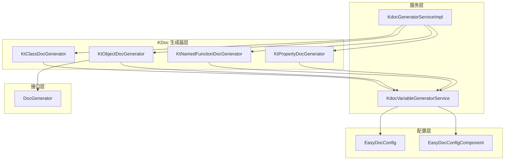
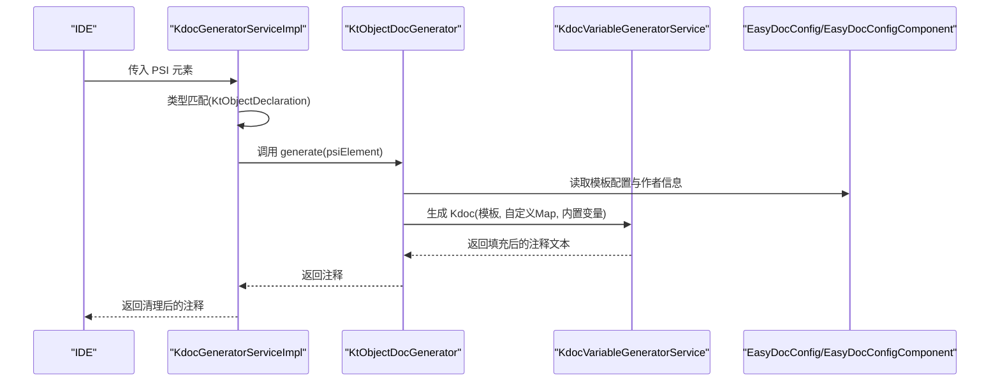
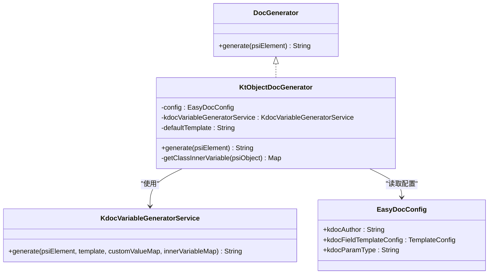
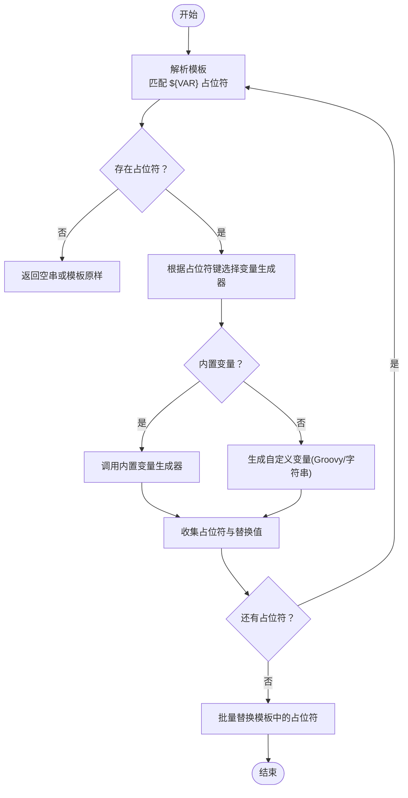
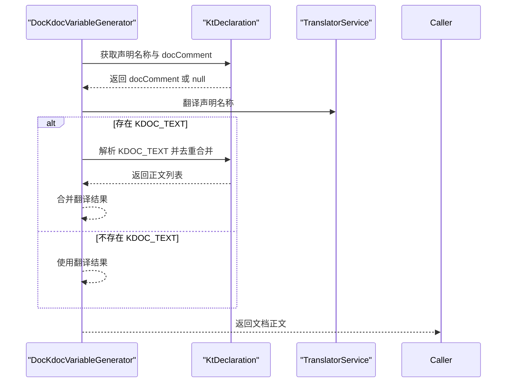
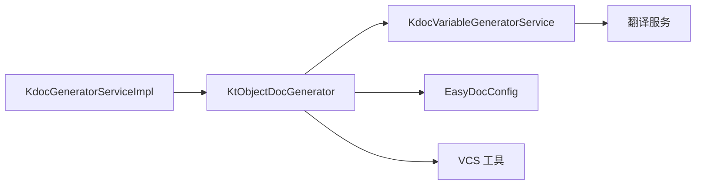

# KtObjectDocGenerator 对象文档生成器

<cite>
**本文引用的文件**
- [KtObjectDocGenerator.kt](file://src/main/kotlin/com/star/easydoc/kdoc/service/generator/impl/KtObjectDocGenerator.kt)
- [KdocGeneratorServiceImpl.kt](file://src/main/kotlin/com/star/easydoc/kdoc/service/KdocGeneratorServiceImpl.kt)
- [KdocVariableGeneratorService.kt](file://src/main/kotlin/com/star/easydoc/kdoc/service/variable/KdocVariableGeneratorService.kt)
- [DocKdocVariableGenerator.kt](file://src/main/kotlin/com/star/easydoc/kdoc/service/variable/impl/DocKdocVariableGenerator.kt)
- [DocGenerator.java](file://src/main/java/com/star/easydoc/javadoc/service/generator/DocGenerator.java)
- [EasyDocConfig.java](file://src/main/java/com/star/easydoc/config/EasyDocConfig.java)
- [EasyDocConfigComponent.java](file://src/main/java/com/star/easydoc/config/EasyDocConfigComponent.java)
- [plugin.xml](file://src/main/resources/META-INF/plugin.xml)
</cite>

## 目录
1. [简介](#简介)
2. [项目结构](#项目结构)
3. [核心组件](#核心组件)
4. [架构总览](#架构总览)
5. [详细组件分析](#详细组件分析)
6. [依赖关系分析](#依赖关系分析)
7. [性能考虑](#性能考虑)
8. [故障排除指南](#故障排除指南)
9. [结论](#结论)
10. [附录](#附录)

## 简介
本文件面向 KtObjectDocGenerator 对象文档生成器，系统性阐述其在 Kotlin 对象声明（包括伴生对象、独立对象声明、对象表达式）上的注释生成策略与实现细节。文档重点覆盖以下方面：
- 对象声明的识别与分发
- Kdoc 模板与变量替换机制
- 对象的 singleton 特性处理与静态成员注释生成思路
- 对象初始化代码分析与注释生成的边界说明
- 使用示例与最佳实践，涵盖伴生对象、匿名对象、对象表达式的特殊处理逻辑

## 项目结构
KtObjectDocGenerator 位于 Kotlin KDoc 生成体系中，作为 DocGenerator 接口的具体实现之一，与其他生成器（类、方法、属性）共同由统一的服务层进行调度。

**图表来源**
- [KtObjectDocGenerator.kt:18-65](file://src/main/kotlin/com/star/easydoc/kdoc/service/generator/impl/KtObjectDocGenerator.kt#L18-L65)
- [KdocGeneratorServiceImpl.kt:21-52](file://src/main/kotlin/com/star/easydoc/kdoc/service/KdocGeneratorServiceImpl.kt#L21-L52)
- [KdocVariableGeneratorService.kt:22-126](file://src/main/kotlin/com/star/easydoc/kdoc/service/variable/KdocVariableGeneratorService.kt#L22-L126)
- [DocGenerator.java:11-19](file://src/main/java/com/star/easydoc/javadoc/service/generator/DocGenerator.java#L11-L19)
- [EasyDocConfig.java:22-680](file://src/main/java/com/star/easydoc/config/EasyDocConfig.java#L22-L680)
- [EasyDocConfigComponent.java:24-68](file://src/main/java/com/star/easydoc/config/EasyDocConfigComponent.java#L24-L68)

**章节来源**
- [KtObjectDocGenerator.kt:18-65](file://src/main/kotlin/com/star/easydoc/kdoc/service/generator/impl/KtObjectDocGenerator.kt#L18-L65)
- [KdocGeneratorServiceImpl.kt:21-52](file://src/main/kotlin/com/star/easydoc/kdoc/service/KdocGeneratorServiceImpl.kt#L21-L52)
- [DocGenerator.java:11-19](file://src/main/java/com/star/easydoc/javadoc/service/generator/DocGenerator.java#L11-L19)

## 核心组件
- KtObjectDocGenerator：针对 Kotlin 对象声明（KtObjectDeclaration）生成 Kdoc 注释，支持默认模板与自定义模板两种模式，并注入作者、类名、项目名、分支等变量。
- KdocGeneratorServiceImpl：统一调度各类型生成器，基于 PSI 类型匹配选择对应生成器。
- KdocVariableGeneratorService：模板占位符解析与变量替换引擎，内置多种变量生成器（如 author、date、doc、params、return、see、since、constructor、version），并支持自定义 Groovy 脚本变量。
- DocKdocVariableGenerator：负责从 Kotlin 声明的现有 KDoc 中提取或翻译生成“文档正文”变量。
- DocGenerator 接口：所有生成器的统一入口。
- EasyDocConfig/EasyDocConfigComponent：提供模板配置、作者、日期格式、参数类型等全局配置。

**章节来源**
- [KtObjectDocGenerator.kt:18-65](file://src/main/kotlin/com/star/easydoc/kdoc/service/generator/impl/KtObjectDocGenerator.kt#L18-L65)
- [KdocGeneratorServiceImpl.kt:21-52](file://src/main/kotlin/com/star/easydoc/kdoc/service/KdocGeneratorServiceImpl.kt#L21-L52)
- [KdocVariableGeneratorService.kt:22-126](file://src/main/kotlin/com/star/easydoc/kdoc/service/variable/KdocVariableGeneratorService.kt#L22-L126)
- [DocKdocVariableGenerator.kt:17-49](file://src/main/kotlin/com/star/easydoc/kdoc/service/variable/impl/DocKdocVariableGenerator.kt#L17-L49)
- [DocGenerator.java:11-19](file://src/main/java/com/star/easydoc/javadoc/service/generator/DocGenerator.java#L11-L19)
- [EasyDocConfig.java:22-680](file://src/main/java/com/star/easydoc/config/EasyDocConfig.java#L22-L680)
- [EasyDocConfigComponent.java:24-68](file://src/main/java/com/star/easydoc/config/EasyDocConfigComponent.java#L24-L68)

## 架构总览
KtObjectDocGenerator 的工作流遵循“类型识别 → 模板选择 → 变量替换 → 输出注释”的通用路径。下图展示了对象生成器在整体体系中的位置与交互：

**图表来源**
- [KdocGeneratorServiceImpl.kt:35-51](file://src/main/kotlin/com/star/easydoc/kdoc/service/KdocGeneratorServiceImpl.kt#L35-L51)
- [KtObjectDocGenerator.kt:31-46](file://src/main/kotlin/com/star/easydoc/kdoc/service/generator/impl/KtObjectDocGenerator.kt#L31-L46)
- [KdocVariableGeneratorService.kt:46-80](file://src/main/kotlin/com/star/easydoc/kdoc/service/variable/KdocVariableGeneratorService.kt#L46-L80)
- [EasyDocConfig.java:338-384](file://src/main/java/com/star/easydoc/config/EasyDocConfig.java#L338-L384)
- [EasyDocConfigComponent.java:31-56](file://src/main/java/com/star/easydoc/config/EasyDocConfigComponent.java#L31-L56)

## 详细组件分析

### KtObjectDocGenerator 组件分析
- 角色定位：专门处理 Kotlin 对象声明（KtObjectDeclaration）的注释生成，包括伴生对象、独立对象声明、对象表达式等。
- 模板策略：
  - 默认模板：包含文档正文、作者、日期等基础字段。
  - 自定义模板：若启用自定义模板，则使用用户配置的模板与自定义变量映射。
- 变量注入：
  - 作者：来自配置项。
  - 类名：使用 fqName（完全限定名）与 simpleClassName（简单名）。
  - 项目名：当前工程名称。
  - 分支：通过 VCS 工具获取当前分支。
- 返回处理：调用统一服务进行变量替换后，再由服务层对注释进行清洗（去除空白行与多余星号）。

**图表来源**
- [DocGenerator.java:11-19](file://src/main/java/com/star/easydoc/javadoc/service/generator/DocGenerator.java#L11-L19)
- [KtObjectDocGenerator.kt:18-65](file://src/main/kotlin/com/star/easydoc/kdoc/service/generator/impl/KtObjectDocGenerator.kt#L18-L65)
- [KdocVariableGeneratorService.kt:46-80](file://src/main/kotlin/com/star/easydoc/kdoc/service/variable/KdocVariableGeneratorService.kt#L46-L80)
- [EasyDocConfig.java:338-384](file://src/main/java/com/star/easydoc/config/EasyDocConfig.java#L338-L384)

**章节来源**
- [KtObjectDocGenerator.kt:31-46](file://src/main/kotlin/com/star/easydoc/kdoc/service/generator/impl/KtObjectDocGenerator.kt#L31-L46)
- [KtObjectDocGenerator.kt:55-63](file://src/main/kotlin/com/star/easydoc/kdoc/service/generator/impl/KtObjectDocGenerator.kt#L55-L63)

### KdocVariableGeneratorService 变量替换引擎
- 占位符匹配：使用正则匹配形如 ${VAR} 的占位符。
- 内置变量生成器：包含 author、date、doc、params、return、see、since、constructor、version 等。
- 自定义变量：支持字符串与 Groovy 脚本两种类型；Groovy 脚本可访问内置变量映射。
- 替换流程：先按顺序生成各占位符的值，再一次性替换模板中的全部占位符。

**图表来源**
- [KdocVariableGeneratorService.kt:46-80](file://src/main/kotlin/com/star/easydoc/kdoc/service/variable/KdocVariableGeneratorService.kt#L46-L80)
- [KdocVariableGeneratorService.kt:90-121](file://src/main/kotlin/com/star/easydoc/kdoc/service/variable/KdocVariableGeneratorService.kt#L90-L121)

**章节来源**
- [KdocVariableGeneratorService.kt:22-126](file://src/main/kotlin/com/star/easydoc/kdoc/service/variable/KdocVariableGeneratorService.kt#L22-L126)

### DocKdocVariableGenerator 文档正文生成
- 功能：从 Kotlin 声明的现有 KDoc 中提取 KDOC_TEXT，并结合翻译服务生成“文档正文”，最终形成多段落的注释正文。
- 行为：若已有 KDoc 且包含 KDOC_TEXT，则优先使用；否则回退到翻译结果。

**图表来源**
- [DocKdocVariableGenerator.kt:17-49](file://src/main/kotlin/com/star/easydoc/kdoc/service/variable/impl/DocKdocVariableGenerator.kt#L17-L49)

**章节来源**
- [DocKdocVariableGenerator.kt:17-49](file://src/main/kotlin/com/star/easydoc/kdoc/service/variable/impl/DocKdocVariableGenerator.kt#L17-L49)

### 对象类型与注释生成策略
- 伴生对象（Companion Object）：作为 KtObjectDeclaration 处理，遵循对象生成器的默认或自定义模板策略。
- 独立对象声明（object declaration）：同样作为 KtObjectDeclaration 处理，注释生成策略一致。
- 对象表达式（object expression）：在 PSI 层面也属于 KtObjectDeclaration，因此同样适用对象生成器的策略。

注意：对象的 singleton 特性与静态成员注释生成在本生成器中并不直接体现为“代码分析”。生成器关注的是注释模板与变量替换，而非运行时行为或成员访问语义。对于“静态成员注释”的需求，可通过自定义模板与变量映射实现扩展。

**章节来源**
- [KtObjectDocGenerator.kt:31-46](file://src/main/kotlin/com/star/easydoc/kdoc/service/generator/impl/KtObjectDocGenerator.kt#L31-L46)
- [KdocGeneratorServiceImpl.kt:22-27](file://src/main/kotlin/com/star/easydoc/kdoc/service/KdocGeneratorServiceImpl.kt#L22-L27)

### 使用示例与最佳实践
- 伴生对象注释生成：
  - 在伴生对象上触发生成，将自动应用默认或自定义模板，变量包括作者、类名（fqName）、项目名、分支等。
  - 若希望在注释中强调“构造者”或“初始化”语义，可在自定义模板中添加占位符并通过自定义变量映射注入。
- 独立对象声明注释生成：
  - 与伴生对象一致，适用于单例工具类、配置对象等场景。
- 对象表达式注释生成：
  - 对于临时对象或局部对象表达式，同样适用对象生成器策略，便于快速生成注释骨架。

最佳实践建议：
- 使用自定义模板时，确保模板以 “/**” 开头、以 “*/” 结尾，符合 KDoc 格式规范。
- 利用自定义变量映射（字符串或 Groovy 脚本）扩展注释内容，例如动态生成版本号、时间戳等。
- 对于需要强调 singleton 性质的场景，可在模板中加入说明性文本或通过自定义变量生成提示信息。

**章节来源**
- [KtObjectDocGenerator.kt:38-45](file://src/main/kotlin/com/star/easydoc/kdoc/service/generator/impl/KtObjectDocGenerator.kt#L38-L45)
- [KdocVariableGeneratorService.kt:38-38](file://src/main/kotlin/com/star/easydoc/kdoc/service/variable/KdocVariableGeneratorService.kt#L38-L38)
- [plugin.xml:47-51](file://src/main/resources/META-INF/plugin.xml#L47-L51)

## 依赖关系分析
- 组件耦合：
  - KtObjectDocGenerator 依赖 EasyDocConfig 与 KdocVariableGeneratorService，耦合度低，职责清晰。
  - KdocGeneratorServiceImpl 通过类型映射集中管理各生成器，避免分散的类型判断逻辑。
- 外部依赖：
  - VCS 工具用于获取当前分支信息。
  - 翻译服务用于生成文档正文（DocKdocVariableGenerator）。
- 潜在循环依赖：
  - 未发现循环依赖；生成器之间通过服务层解耦。

**图表来源**
- [KtObjectDocGenerator.kt:19-20](file://src/main/kotlin/com/star/easydoc/kdoc/service/generator/impl/KtObjectDocGenerator.kt#L19-L20)
- [KdocVariableGeneratorService.kt:18-18](file://src/main/kotlin/com/star/easydoc/kdoc/service/variable/KdocVariableGeneratorService.kt#L18-L18)
- [KdocGeneratorServiceImpl.kt:22-27](file://src/main/kotlin/com/star/easydoc/kdoc/service/KdocGeneratorServiceImpl.kt#L22-L27)

**章节来源**
- [KtObjectDocGenerator.kt:19-20](file://src/main/kotlin/com/star/easydoc/kdoc/service/generator/impl/KtObjectDocGenerator.kt#L19-L20)
- [KdocGeneratorServiceImpl.kt:22-27](file://src/main/kotlin/com/star/easydoc/kdoc/service/KdocGeneratorServiceImpl.kt#L22-L27)

## 性能考虑
- 模板解析与变量替换：采用一次性批量替换策略，减少多次字符串操作开销。
- 自定义 Groovy 变量：脚本执行可能带来额外开销，建议在模板中谨慎使用，或缓存计算结果。
- 清洗注释：服务层对注释进行行过滤与清理，避免冗余空白行影响阅读体验。

[本节为通用性能建议，无需特定文件引用]

## 故障排除指南
- 模板格式错误：
  - 现象：自定义模板未生效或报错。
  - 原因：模板未以 “/**” 开头或未以 “*/” 结尾。
  - 处理：在设置界面中修正模板格式，确保符合 KDoc 规范。
- 自定义变量脚本异常：
  - 现象：Groovy 脚本执行失败，日志输出错误信息。
  - 原因：脚本语法错误或缺少返回值。
  - 处理：检查脚本语法与返回值类型，确保绑定的变量映射可用。
- 未匹配到生成器：
  - 现象：生成结果为空。
  - 原因：传入的 PSI 元素类型不在已注册的生成器映射中。
  - 处理：确认元素类型为 KtObjectDeclaration 或其他受支持类型。

**章节来源**
- [KdocVariableGeneratorService.kt:107-117](file://src/main/kotlin/com/star/easydoc/kdoc/service/variable/KdocVariableGeneratorService.kt#L107-L117)
- [KdocGeneratorServiceImpl.kt:35-51](file://src/main/kotlin/com/star/easydoc/kdoc/service/KdocGeneratorServiceImpl.kt#L35-L51)

## 结论
KtObjectDocGenerator 通过统一的模板与变量替换机制，为 Kotlin 对象声明提供了稳定、可扩展的注释生成能力。其设计遵循“类型识别 → 模板选择 → 变量替换 → 输出注释”的清晰流程，既支持默认模板，又允许通过自定义模板与变量映射满足多样化需求。对于对象的 singleton 特性与静态成员注释生成，建议通过自定义模板与变量映射进行增强，从而在不改变核心逻辑的前提下实现灵活扩展。

[本节为总结性内容，无需特定文件引用]

## 附录
- 配置入口：KDoc 设置位于插件配置扩展中，包含类、方法、字段的模板配置项。
- 关键配置项：
  - kdocAuthor：作者信息
  - kdocFieldTemplateConfig：字段/对象模板配置
  - kdocParamType：参数类型风格（普通模式/中括号模式）
  - kdocSimpleFieldDoc：简单字段注释开关

**章节来源**
- [plugin.xml:47-51](file://src/main/resources/META-INF/plugin.xml#L47-L51)
- [EasyDocConfig.java:338-384](file://src/main/java/com/star/easydoc/config/EasyDocConfig.java#L338-L384)
- [EasyDocConfigComponent.java:31-56](file://src/main/java/com/star/easydoc/config/EasyDocConfigComponent.java#L31-L56)