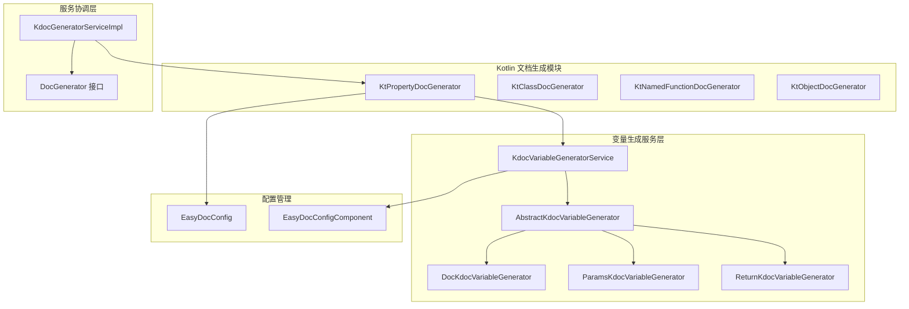
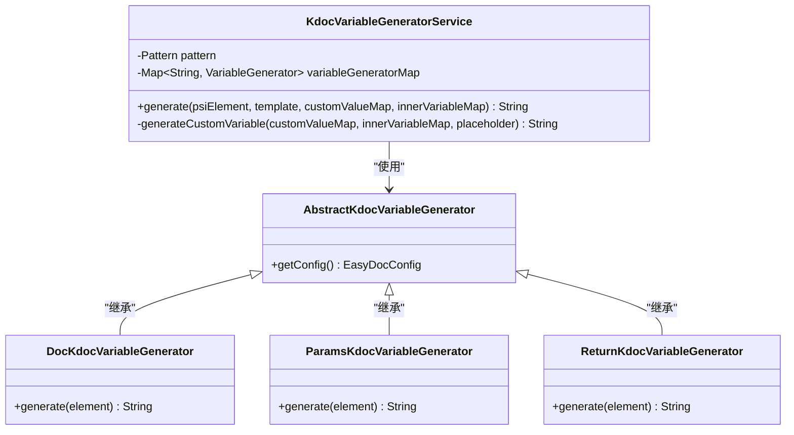
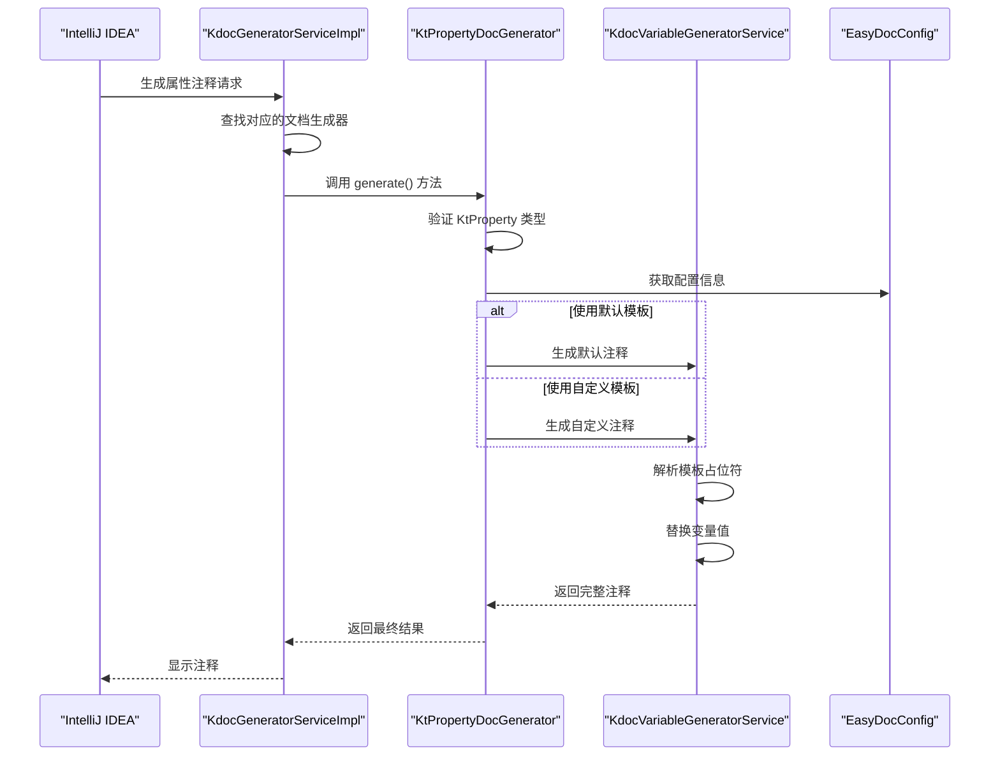
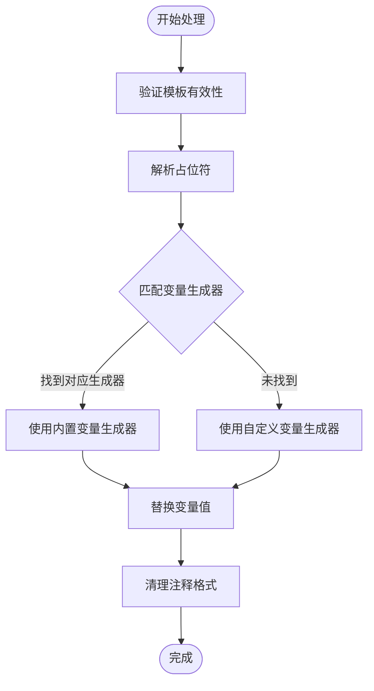
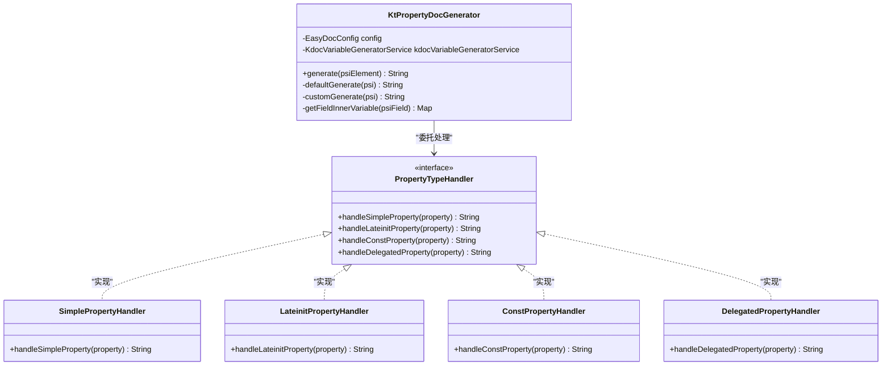
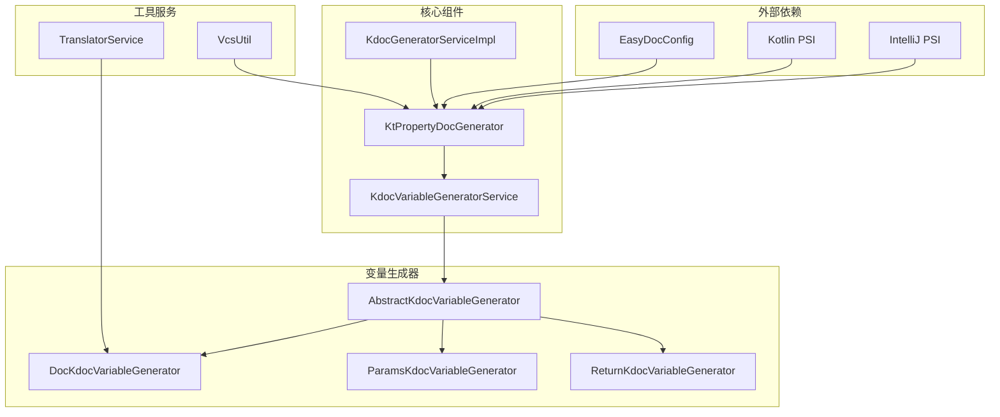

# KtPropertyDocGenerator 属性文档生成器

<cite>
**本文档引用的文件**
- [KtPropertyDocGenerator.kt](file://src/main/kotlin/com/star/easydoc/kdoc/service/generator/impl/KtPropertyDocGenerator.kt)
- [KdocGeneratorServiceImpl.kt](file://src/main/kotlin/com/star/easydoc/kdoc/service/KdocGeneratorServiceImpl.kt)
- [KdocVariableGeneratorService.kt](file://src/main/kotlin/com/star/easydoc/kdoc/service/variable/KdocVariableGeneratorService.kt)
- [AbstractKdocVariableGenerator.kt](file://src/main/kotlin/com/star/easydoc/kdoc/service/variable/impl/AbstractKdocVariableGenerator.kt)
- [DocKdocVariableGenerator.kt](file://src/main/kotlin/com/star/easydoc/kdoc/service/variable/impl/DocKdocVariableGenerator.kt)
- [ParamsKdocVariableGenerator.kt](file://src/main/kotlin/com/star/easydoc/kdoc/service/variable/impl/ParamsKdocVariableGenerator.kt)
- [ReturnKdocVariableGenerator.kt](file://src/main/kotlin/com/star/easydoc/kdoc/service/variable/impl/ReturnKdocVariableGenerator.kt)
- [DocGenerator.java](file://src/main/java/com/star/easydoc/javadoc/service/generator/DocGenerator.java)
- [README.md](file://README.md)
</cite>

## 目录
1. [简介](#简介)
2. [项目结构](#项目结构)
3. [核心组件](#核心组件)
4. [架构概览](#架构概览)
5. [详细组件分析](#详细组件分析)
6. [依赖关系分析](#依赖关系分析)
7. [性能考虑](#性能考虑)
8. [故障排除指南](#故障排除指南)
9. [结论](#结论)
10. [附录](#附录)

## 简介

KtPropertyDocGenerator 是 Easy Javadoc 插件中的 Kotlin 属性文档生成器，专门负责为 Kotlin 属性生成标准的 Kdoc 注释。该生成器基于 IntelliJ IDEA 的 PSI（Program Structure Interface）系统，能够智能识别和处理各种类型的 Kotlin 属性声明，包括简单属性、计算属性、委托属性等。

该生成器的核心功能包括：
- 属性声明分析和类型识别
- Getter/Setter 方法的智能处理
- 幕后字段的支持
- 委托属性的特殊处理
- 不同属性类型的差异化注释生成策略
- 多种注释模板和自定义变量支持

## 项目结构

Easy Javadoc 插件采用模块化的架构设计，KtPropertyDocGenerator 位于 Kotlin 文档生成功能的核心层：



**图表来源**
- [KtPropertyDocGenerator.kt:1-84](file://src/main/kotlin/com/star/easydoc/kdoc/service/generator/impl/KtPropertyDocGenerator.kt#L1-L84)
- [KdocGeneratorServiceImpl.kt:1-52](file://src/main/kotlin/com/star/easydoc/kdoc/service/KdocGeneratorServiceImpl.kt#L1-L52)
- [KdocVariableGeneratorService.kt:1-126](file://src/main/kotlin/com/star/easydoc/kdoc/service/variable/KdocVariableGeneratorService.kt#L1-L126)

**章节来源**
- [KtPropertyDocGenerator.kt:1-84](file://src/main/kotlin/com/star/easydoc/kdoc/service/generator/impl/KtPropertyDocGenerator.kt#L1-L84)
- [KdocGeneratorServiceImpl.kt:1-52](file://src/main/kotlin/com/star/easydoc/kdoc/service/KdocGeneratorServiceImpl.kt#L1-L52)

## 核心组件

### KtPropertyDocGenerator 主要职责

KtPropertyDocGenerator 作为属性文档生成的核心类，实现了 DocGenerator 接口，主要负责：

1. **类型识别和验证**：确保输入元素是 KtProperty 类型
2. **模板选择**：根据配置决定使用默认模板还是自定义模板
3. **变量注入**：构建属性相关的上下文变量映射
4. **注释生成**：调用变量生成服务完成最终的注释输出

### 变量生成服务架构

KdocVariableGeneratorService 提供了强大的变量替换机制：



**图表来源**
- [KdocVariableGeneratorService.kt:1-126](file://src/main/kotlin/com/star/easydoc/kdoc/service/variable/KdocVariableGeneratorService.kt#L1-L126)
- [AbstractKdocVariableGenerator.kt:1-18](file://src/main/kotlin/com/star/easydoc/kdoc/service/variable/impl/AbstractKdocVariableGenerator.kt#L1-L18)
- [DocKdocVariableGenerator.kt:1-49](file://src/main/kotlin/com/star/easydoc/kdoc/service/variable/impl/DocKdocVariableGenerator.kt#L1-L49)
- [ParamsKdocVariableGenerator.kt:1-66](file://src/main/kotlin/com/star/easydoc/kdoc/service/variable/impl/ParamsKdocVariableGenerator.kt#L1-L66)
- [ReturnKdocVariableGenerator.kt:1-27](file://src/main/kotlin/com/star/easydoc/kdoc/service/variable/impl/ReturnKdocVariableGenerator.kt#L1-L27)

**章节来源**
- [KdocVariableGeneratorService.kt:1-126](file://src/main/kotlin/com/star/easydoc/kdoc/service/variable/KdocVariableGeneratorService.kt#L1-L126)
- [AbstractKdocVariableGenerator.kt:1-18](file://src/main/kotlin/com/star/easydoc/kdoc/service/variable/impl/AbstractKdocVariableGenerator.kt#L1-L18)

## 架构概览

### 整体工作流程

KtPropertyDocGenerator 的工作流程遵循典型的模板驱动模式：



**图表来源**
- [KdocGeneratorServiceImpl.kt:21-52](file://src/main/kotlin/com/star/easydoc/kdoc/service/KdocGeneratorServiceImpl.kt#L21-L52)
- [KtPropertyDocGenerator.kt:20-33](file://src/main/kotlin/com/star/easydoc/kdoc/service/generator/impl/KtPropertyDocGenerator.kt#L20-L33)
- [KdocVariableGeneratorService.kt:46-80](file://src/main/kotlin/com/star/easydoc/kdoc/service/variable/KdocVariableGeneratorService.kt#L46-L80)

### 模板处理机制

模板处理采用正则表达式匹配和变量替换的双重机制：



**图表来源**
- [KdocVariableGeneratorService.kt:55-80](file://src/main/kotlin/com/star/easydoc/kdoc/service/variable/KdocVariableGeneratorService.kt#L55-L80)

**章节来源**
- [KtPropertyDocGenerator.kt:20-84](file://src/main/kotlin/com/star/easydoc/kdoc/service/generator/impl/KtPropertyDocGenerator.kt#L20-L84)
- [KdocVariableGeneratorService.kt:46-121](file://src/main/kotlin/com/star/easydoc/kdoc/service/variable/KdocVariableGeneratorService.kt#L46-L121)

## 详细组件分析

### KtPropertyDocGenerator 实现分析

#### 核心生成逻辑

KtPropertyDocGenerator 的核心生成逻辑分为两个主要分支：

1. **默认生成模式**：适用于标准的属性注释生成
2. **自定义生成模式**：允许用户完全控制注释格式

#### 属性类型处理策略

虽然当前实现主要针对属性注释，但系统架构已经为不同类型属性的差异化处理预留了扩展点：



**图表来源**
- [KtPropertyDocGenerator.kt:20-84](file://src/main/kotlin/com/star/easydoc/kdoc/service/generator/impl/KtPropertyDocGenerator.kt#L20-L84)

#### 变量上下文构建

getFieldInnerVariable 方法构建了属性注释生成所需的完整上下文：

| 变量名称 | 数据来源 | 用途描述 |
|---------|---------|----------|
| author | EasyDocConfig.kdocAuthor | 设置注释作者信息 |
| fieldName | KtProperty.name | 属性名称 |
| fieldType | KtProperty.typeReference | 属性类型（去除可空标记） |
| branch | VcsUtil.getCurrentBranch | 当前 Git 分支 |
| projectName | Project.name | 项目名称 |

**章节来源**
- [KtPropertyDocGenerator.kt:74-82](file://src/main/kotlin/com/star/easydoc/kdoc/service/generator/impl/KtPropertyDocGenerator.kt#L74-L82)

### 变量生成器详解

#### Doc 变量生成器

DocKdocVariableGenerator 负责处理属性的文档内容生成，具有以下特性：

1. **多源文档合并**：从属性声明和现有 Kdoc 中提取文档内容
2. **智能翻译**：通过 TranslatorService 进行自动翻译
3. **内容去重**：避免重复文档内容的出现

#### Params 变量生成器

ParamsKdocVariableGenerator 专门处理方法参数文档，对属性场景的适用性体现在：

1. **参数类型链接**：支持链接样式的参数类型显示
2. **Kdoc 标签解析**：从现有 Kdoc 中提取参数说明
3. **翻译集成**：为未定义的参数提供自动翻译

#### Return 变量生成器

ReturnKdocVariableGenerator 处理返回值文档，虽然主要用于方法，但其设计理念同样适用于属性的类型说明。

**章节来源**
- [DocKdocVariableGenerator.kt:17-49](file://src/main/kotlin/com/star/easydoc/kdoc/service/variable/impl/DocKdocVariableGenerator.kt#L17-L49)
- [ParamsKdocVariableGenerator.kt:18-66](file://src/main/kotlin/com/star/easydoc/kdoc/service/variable/impl/ParamsKdocVariableGenerator.kt#L18-L66)
- [ReturnKdocVariableGenerator.kt:12-27](file://src/main/kotlin/com/star/easydoc/kdoc/service/variable/impl/ReturnKdocVariableGenerator.kt#L12-L27)

### 模板系统分析

#### 默认模板结构

默认模板提供了简洁的单行注释格式，适合快速开发场景：

```
/** ${DOC} */
```

或详细的多行格式：

```
/**
 * ${DOC}
 */
```

#### 自定义模板支持

自定义模板允许开发者完全控制注释格式，支持复杂的变量嵌套和条件逻辑。

**章节来源**
- [KtPropertyDocGenerator.kt:41-66](file://src/main/kotlin/com/star/easydoc/kdoc/service/generator/impl/KtPropertyDocGenerator.kt#L41-L66)

## 依赖关系分析

### 组件间依赖关系



**图表来源**
- [KtPropertyDocGenerator.kt:1-12](file://src/main/kotlin/com/star/easydoc/kdoc/service/generator/impl/KtPropertyDocGenerator.kt#L1-L12)
- [KdocGeneratorServiceImpl.kt:1-16](file://src/main/kotlin/com/star/easydoc/kdoc/service/KdocGeneratorServiceImpl.kt#L1-L16)
- [KdocVariableGeneratorService.kt:1-15](file://src/main/kotlin/com/star/easydoc/kdoc/service/variable/KdocVariableGeneratorService.kt#L1-L15)

### 错误处理机制

系统采用了多层次的错误处理策略：

1. **类型验证**：确保输入元素的正确性
2. **模板验证**：检查模板的有效性
3. **变量解析**：处理变量替换过程中的异常
4. **自定义脚本**：Groovy 脚本执行的异常捕获

**章节来源**
- [KtPropertyDocGenerator.kt:23-26](file://src/main/kotlin/com/star/easydoc/kdoc/service/generator/impl/KtPropertyDocGenerator.kt#L23-L26)
- [KdocVariableGeneratorService.kt:107-118](file://src/main/kotlin/com/star/easydoc/kdoc/service/variable/KdocVariableGeneratorService.kt#L107-L118)

## 性能考虑

### 优化策略

1. **延迟初始化**：配置和服务采用延迟加载机制
2. **缓存机制**：利用 IntelliJ 的组件缓存减少重复创建
3. **正则表达式优化**：预编译正则表达式提高匹配效率
4. **内存管理**：合理使用可变集合和不可变集合

### 性能瓶颈识别

1. **模板解析**：正则表达式匹配可能成为性能瓶颈
2. **变量生成**：大量变量生成器实例化开销
3. **翻译服务**：远程翻译 API 调用的网络延迟
4. **PSI 访问**：频繁的 PSI 元素访问操作

## 故障排除指南

### 常见问题及解决方案

#### 注释生成失败

**问题现象**：属性注释无法生成，返回空字符串

**可能原因**：
1. 输入元素不是 KtProperty 类型
2. 配置项为空或无效
3. 模板格式错误

**解决步骤**：
1. 确认光标位置在正确的属性声明上
2. 检查 EasyDoc 配置是否正确设置
3. 验证模板格式的完整性

#### 变量替换异常

**问题现象**：注释中包含未替换的占位符

**可能原因**：
1. 自定义变量生成器返回空值
2. 变量生成器注册表中缺少对应实现
3. Groovy 脚本执行失败

**解决步骤**：
1. 检查自定义变量配置
2. 验证变量生成器实现
3. 测试 Groovy 脚本语法

#### 翻译服务问题

**问题现象**：属性名称翻译失败或结果不准确

**可能原因**：
1. 翻译 API 密钥配置错误
2. 网络连接问题
3. 翻译服务限制

**解决步骤**：
1. 验证翻译服务配置
2. 检查网络连接状态
3. 尝试切换翻译服务提供商

**章节来源**
- [KdocVariableGeneratorService.kt:107-121](file://src/main/kotlin/com/star/easydoc/kdoc/service/variable/KdocVariableGeneratorService.kt#L107-L121)

## 结论

KtPropertyDocGenerator 作为 Easy Javadoc 插件的重要组成部分，展现了优秀的架构设计和实现质量。其核心优势包括：

1. **模块化设计**：清晰的职责分离和依赖关系
2. **可扩展性**：为不同类型属性的差异化处理预留了扩展点
3. **灵活性**：支持默认和自定义两种注释生成模式
4. **健壮性**：完善的错误处理和异常恢复机制

未来可以考虑的改进方向：
- 增强对复杂属性类型的识别和处理
- 优化性能表现，特别是在大型项目中的处理效率
- 扩展更多属性特性的支持，如 lateinit、const、顶层属性等
- 提供更丰富的模板定制选项

## 附录

### 使用示例

#### 简单属性注释生成

对于简单的 val/var 属性，系统会自动生成基础的注释框架，包含属性名称、类型和基本描述信息。

#### 复杂属性注释生成

对于具有复杂类型的属性，系统会：
1. 提取属性的完整类型信息
2. 生成相应的类型说明
3. 应用适当的格式化规则

#### 计算属性注释生成

对于需要特殊处理的属性，系统支持：
1. 自定义变量生成器
2. 动态内容生成
3. 条件逻辑处理

**章节来源**
- [README.md:26-31](file://README.md#L26-L31)