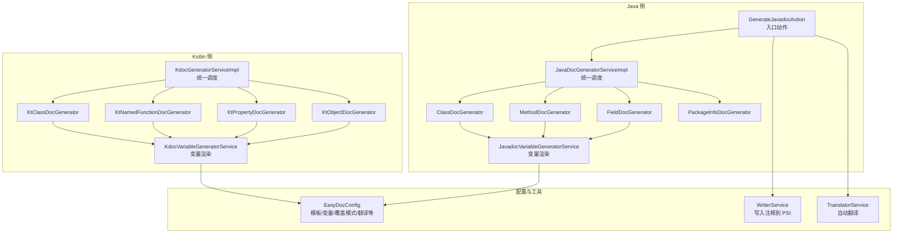
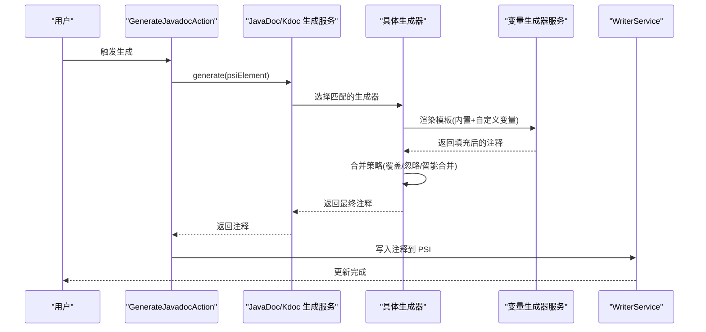
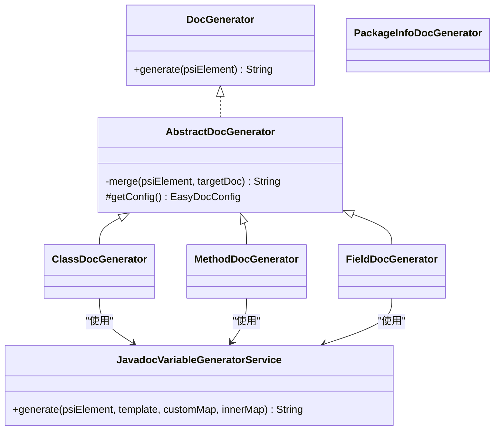
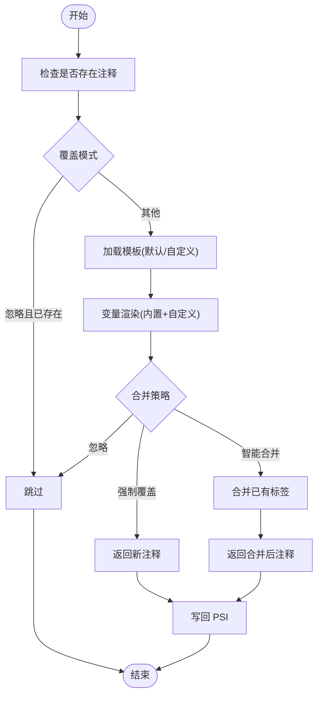
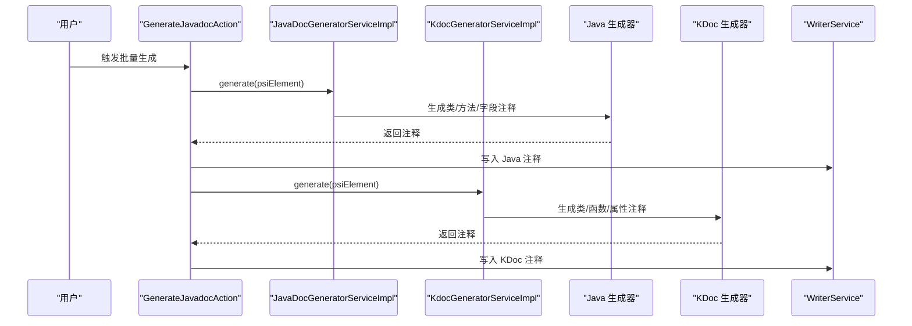
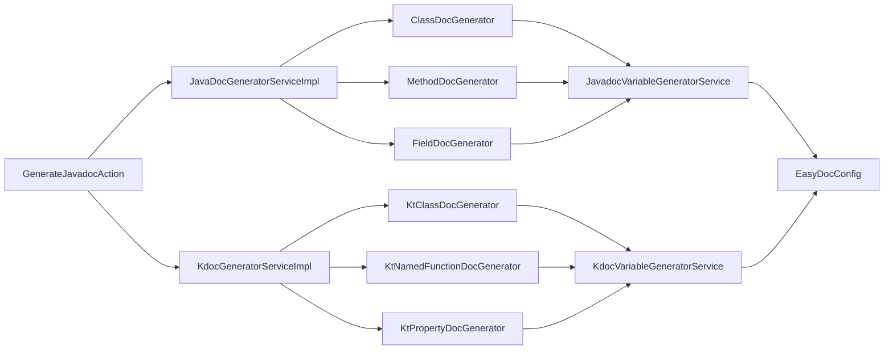

# 文档注释生成

<cite>
**本文引用的文件**
- [src/main/java/com/star/easydoc/javadoc/service/generator/DocGenerator.java](file://src/main/java/com/star/easydoc/javadoc/service/generator/DocGenerator.java)
- [src/main/java/com/star/easydoc/javadoc/service/generator/impl/AbstractDocGenerator.java](file://src/main/java/com/star/easydoc/javadoc/service/generator/impl/AbstractDocGenerator.java)
- [src/main/java/com/star/easydoc/javadoc/service/generator/impl/ClassDocGenerator.java](file://src/main/java/com/star/easydoc/javadoc/service/generator/impl/ClassDocGenerator.java)
- [src/main/java/com/star/easydoc/javadoc/service/generator/impl/MethodDocGenerator.java](file://src/main/java/com/star/easydoc/javadoc/service/generator/impl/MethodDocGenerator.java)
- [src/main/java/com/star/easydoc/javadoc/service/generator/impl/FieldDocGenerator.java](file://src/main/java/com/star/easydoc/javadoc/service/generator/impl/FieldDocGenerator.java)
- [src/main/java/com/star/easydoc/javadoc/service/generator/impl/PackageInfoDocGenerator.java](file://src/main/java/com/star/easydoc/javadoc/service/generator/impl/PackageInfoDocGenerator.java)
- [src/main/java/com/star/easydoc/javadoc/service/variable/JavadocVariableGeneratorService.java](file://src/main/java/com/star/easydoc/javadoc/service/variable/JavadocVariableGeneratorService.java)
- [src/main/java/com/star/easydoc/javadoc/service/JavaDocGeneratorServiceImpl.java](file://src/main/java/com/star/easydoc/javadoc/service/JavaDocGeneratorServiceImpl.java)
- [src/main/java/com/star/easydoc/action/GenerateJavadocAction.java](file://src/main/java/com/star/easydoc/action/GenerateJavadocAction.java)
- [src/main/java/com/star/easydoc/config/EasyDocConfig.java](file://src/main/java/com/star/easydoc/config/EasyDocConfig.java)
- [src/main/kotlin/com/star/easydoc/kdoc/service/KdocGeneratorServiceImpl.kt](file://src/main/kotlin/com/star/easydoc/kdoc/service/KdocGeneratorServiceImpl.kt)
- [src/main/kotlin/com/star/easydoc/kdoc/service/generator/impl/KtClassDocGenerator.kt](file://src/main/kotlin/com/star/easydoc/kdoc/service/generator/impl/KtClassDocGenerator.kt)
- [src/main/kotlin/com/star/easydoc/kdoc/service/generator/impl/KtNamedFunctionDocGenerator.kt](file://src/main/kotlin/com/star/easydoc/kdoc/service/generator/impl/KtNamedFunctionDocGenerator.kt)
- [src/main/kotlin/com/star/easydoc/kdoc/service/generator/impl/KtPropertyDocGenerator.kt](file://src/main/kotlin/com/star/easydoc/kdoc/service/generator/impl/KtPropertyDocGenerator.kt)
- [src/main/kotlin/com/star/easydoc/kdoc/service/generator/impl/KtObjectDocGenerator.kt](file://src/main/kotlin/com/star/easydoc/kdoc/service/generator/impl/KtObjectDocGenerator.kt)
</cite>

## 目录
1. [简介](#简介)
2. [项目结构](#项目结构)
3. [核心组件](#核心组件)
4. [架构总览](#架构总览)
5. [详细组件分析](#详细组件分析)
6. [依赖分析](#依赖分析)
7. [性能考虑](#性能考虑)
8. [故障排查指南](#故障排查指南)
9. [结论](#结论)
10. [附录：使用与配置](#附录使用与配置)

## 简介
本文件面向 Easy Javadoc 插件的“文档注释生成”能力，系统性阐述 JavaDoc 与 Kdoc 两类注释的生成机制。内容涵盖：
- 针对类、方法、字段（属性）、包信息等不同 PSI 元素的注释生成策略
- 单个元素注释生成与批量注释生成的工作流程（PSI 分析、模板渲染、变量替换）
- 生成器设计模式与扩展机制（抽象基类与具体实现类）
- 配置项与使用示例，帮助开发者在不同场景下高效使用

## 项目结构
插件采用分层与按语言划分的组织方式：
- Java 侧：javadoc 生成器、变量生成器、配置、入口动作
- Kotlin 侧：kdoc 生成器、变量生成器、配置
- 通用工具与常量位于 common 包
- 配置持久化于 EasyDocConfig，支持模板、变量、翻译、覆盖模式等

图表来源
- [src/main/java/com/star/easydoc/action/GenerateJavadocAction.java:114-154](file://src/main/java/com/star/easydoc/action/GenerateJavadocAction.java#L114-L154)
- [src/main/java/com/star/easydoc/javadoc/service/JavaDocGeneratorServiceImpl.java:25-48](file://src/main/java/com/star/easydoc/javadoc/service/JavaDocGeneratorServiceImpl.java#L25-L48)
- [src/main/java/com/star/easydoc/javadoc/service/variable/JavadocVariableGeneratorService.java:35-92](file://src/main/java/com/star/easydoc/javadoc/service/variable/JavadocVariableGeneratorService.java#L35-L92)
- [src/main/kotlin/com/star/easydoc/kdoc/service/KdocGeneratorServiceImpl.kt:21-51](file://src/main/kotlin/com/star/easydoc/kdoc/service/KdocGeneratorServiceImpl.kt#L21-L51)
- [src/main/java/com/star/easydoc/config/EasyDocConfig.java:456-487](file://src/main/java/com/star/easydoc/config/EasyDocConfig.java#L456-L487)

章节来源
- [src/main/java/com/star/easydoc/action/GenerateJavadocAction.java:114-154](file://src/main/java/com/star/easydoc/action/GenerateJavadocAction.java#L114-L154)
- [src/main/java/com/star/easydoc/javadoc/service/JavaDocGeneratorServiceImpl.java:25-48](file://src/main/java/com/star/easydoc/javadoc/service/JavaDocGeneratorServiceImpl.java#L25-L48)
- [src/main/kotlin/com/star/easydoc/kdoc/service/KdocGeneratorServiceImpl.kt:21-51](file://src/main/kotlin/com/star/easydoc/kdoc/service/KdocGeneratorServiceImpl.kt#L21-L51)

## 核心组件
- 接口与抽象基类
  - DocGenerator：统一的生成接口，定义 generate(PsiElement) 方法
  - AbstractDocGenerator：封装合并逻辑（覆盖模式、智能合并），暴露抽象 getConfig()
- 具体生成器（Java）
  - ClassDocGenerator：类注释生成，支持默认模板与自定义模板、变量替换、AI 提示词
  - MethodDocGenerator：方法注释生成，默认模板根据参数/返回值/异常动态拼装
  - FieldDocGenerator：字段注释生成，支持简单/复杂两种模板
  - PackageInfoDocGenerator：包信息注释生成
- 变量生成器服务（Java）
  - JavadocVariableGeneratorService：解析模板占位符、内置变量（author/date/doc/params/return/see/since/throws/version）与自定义变量（字符串/Groovy）
- 统一调度服务（Java）
  - JavaDocGeneratorServiceImpl：按 PSI 元素类型映射到对应 DocGenerator 实现
- 入口动作
  - GenerateJavadocAction：接收用户触发，调用调度服务，写入注释到编辑器或文件

章节来源
- [src/main/java/com/star/easydoc/javadoc/service/generator/DocGenerator.java:11-18](file://src/main/java/com/star/easydoc/javadoc/service/generator/DocGenerator.java#L11-L18)
- [src/main/java/com/star/easydoc/javadoc/service/generator/impl/AbstractDocGenerator.java:20-78](file://src/main/java/com/star/easydoc/javadoc/service/generator/impl/AbstractDocGenerator.java#L20-L78)
- [src/main/java/com/star/easydoc/javadoc/service/generator/impl/ClassDocGenerator.java:29-68](file://src/main/java/com/star/easydoc/javadoc/service/generator/impl/ClassDocGenerator.java#L29-L68)
- [src/main/java/com/star/easydoc/javadoc/service/generator/impl/MethodDocGenerator.java:30-62](file://src/main/java/com/star/easydoc/javadoc/service/generator/impl/MethodDocGenerator.java#L30-L62)
- [src/main/java/com/star/easydoc/javadoc/service/generator/impl/FieldDocGenerator.java:28-71](file://src/main/java/com/star/easydoc/javadoc/service/generator/impl/FieldDocGenerator.java#L28-L71)
- [src/main/java/com/star/easydoc/javadoc/service/generator/impl/PackageInfoDocGenerator.java:15-37](file://src/main/java/com/star/easydoc/javadoc/service/generator/impl/PackageInfoDocGenerator.java#L15-L37)
- [src/main/java/com/star/easydoc/javadoc/service/variable/JavadocVariableGeneratorService.java:35-127](file://src/main/java/com/star/easydoc/javadoc/service/variable/JavadocVariableGeneratorService.java#L35-L127)
- [src/main/java/com/star/easydoc/javadoc/service/JavaDocGeneratorServiceImpl.java:25-48](file://src/main/java/com/star/easydoc/javadoc/service/JavaDocGeneratorServiceImpl.java#L25-L48)
- [src/main/java/com/star/easydoc/action/GenerateJavadocAction.java:114-154](file://src/main/java/com/star/easydoc/action/GenerateJavadocAction.java#L114-L154)

## 架构总览
整体流程：用户触发 → 动作解析 PSI 元素 → 统一调度 → 具体生成器 → 变量渲染 → 合并策略 → 写回编辑器/文件。

图表来源
- [src/main/java/com/star/easydoc/action/GenerateJavadocAction.java:114-154](file://src/main/java/com/star/easydoc/action/GenerateJavadocAction.java#L114-L154)
- [src/main/java/com/star/easydoc/javadoc/service/JavaDocGeneratorServiceImpl.java:35-47](file://src/main/java/com/star/easydoc/javadoc/service/JavaDocGeneratorServiceImpl.java#L35-L47)
- [src/main/java/com/star/easydoc/javadoc/service/variable/JavadocVariableGeneratorService.java:60-92](file://src/main/java/com/star/easydoc/javadoc/service/variable/JavadocVariableGeneratorService.java#L60-L92)
- [src/main/java/com/star/easydoc/javadoc/service/generator/impl/AbstractDocGenerator.java:29-71](file://src/main/java/com/star/easydoc/javadoc/service/generator/impl/AbstractDocGenerator.java#L29-L71)

## 详细组件分析

### 设计模式与扩展机制
- 抽象基类 + 多态实现
  - 抽象基类负责通用逻辑（如合并策略），具体子类聚焦于各自元素的模板与变量
  - 新增元素类型只需实现 DocGenerator 或继承 AbstractDocGenerator，并在调度服务中注册映射
- 可插拔变量生成
  - 内置变量集合 + 自定义变量（字符串/Groovy），通过占位符匹配与替换实现高度可定制

图表来源
- [src/main/java/com/star/easydoc/javadoc/service/generator/DocGenerator.java:11-18](file://src/main/java/com/star/easydoc/javadoc/service/generator/DocGenerator.java#L11-L18)
- [src/main/java/com/star/easydoc/javadoc/service/generator/impl/AbstractDocGenerator.java:20-78](file://src/main/java/com/star/easydoc/javadoc/service/generator/impl/AbstractDocGenerator.java#L20-L78)
- [src/main/java/com/star/easydoc/javadoc/service/generator/impl/ClassDocGenerator.java:29-68](file://src/main/java/com/star/easydoc/javadoc/service/generator/impl/ClassDocGenerator.java#L29-L68)
- [src/main/java/com/star/easydoc/javadoc/service/generator/impl/MethodDocGenerator.java:30-62](file://src/main/java/com/star/easydoc/javadoc/service/generator/impl/MethodDocGenerator.java#L30-L62)
- [src/main/java/com/star/easydoc/javadoc/service/generator/impl/FieldDocGenerator.java:28-71](file://src/main/java/com/star/easydoc/javadoc/service/generator/impl/FieldDocGenerator.java#L28-L71)
- [src/main/java/com/star/easydoc/javadoc/service/variable/JavadocVariableGeneratorService.java:35-92](file://src/main/java/com/star/easydoc/javadoc/service/variable/JavadocVariableGeneratorService.java#L35-L92)

章节来源
- [src/main/java/com/star/easydoc/javadoc/service/generator/impl/AbstractDocGenerator.java:20-78](file://src/main/java/com/star/easydoc/javadoc/service/generator/impl/AbstractDocGenerator.java#L20-L78)
- [src/main/java/com/star/easydoc/javadoc/service/JavaDocGeneratorServiceImpl.java:27-33](file://src/main/java/com/star/easydoc/javadoc/service/JavaDocGeneratorServiceImpl.java#L27-L33)

### 单个元素注释生成流程（以 Java 为例）
- PSI 元素识别与覆盖策略
  - 若已存在注释且覆盖模式为“忽略”，直接返回空；否则进入生成
- 模板选择与变量渲染
  - 优先使用自定义模板；否则使用内置默认模板
  - 变量生成器解析占位符，内置变量由生成器提供，自定义变量支持字符串与 Groovy
- 合并策略
  - 强制覆盖：直接返回新注释
  - 智能合并：保留已有标签，新增标签按规则插入
  - 忽略：若已有注释则跳过
- 写回
  - 创建 PSI 注释对象，写入编辑器/文件

图表来源
- [src/main/java/com/star/easydoc/javadoc/service/generator/impl/AbstractDocGenerator.java:29-71](file://src/main/java/com/star/easydoc/javadoc/service/generator/impl/AbstractDocGenerator.java#L29-L71)
- [src/main/java/com/star/easydoc/javadoc/service/generator/impl/ClassDocGenerator.java:44-68](file://src/main/java/com/star/easydoc/javadoc/service/generator/impl/ClassDocGenerator.java#L44-L68)
- [src/main/java/com/star/easydoc/javadoc/service/variable/JavadocVariableGeneratorService.java:60-92](file://src/main/java/com/star/easydoc/javadoc/service/variable/JavadocVariableGeneratorService.java#L60-L92)
- [src/main/java/com/star/easydoc/action/GenerateJavadocAction.java:145-153](file://src/main/java/com/star/easydoc/action/GenerateJavadocAction.java#L145-L153)

章节来源
- [src/main/java/com/star/easydoc/javadoc/service/generator/impl/AbstractDocGenerator.java:29-71](file://src/main/java/com/star/easydoc/javadoc/service/generator/impl/AbstractDocGenerator.java#L29-L71)
- [src/main/java/com/star/easydoc/javadoc/service/generator/impl/ClassDocGenerator.java:44-68](file://src/main/java/com/star/easydoc/javadoc/service/generator/impl/ClassDocGenerator.java#L44-L68)
- [src/main/java/com/star/easydoc/javadoc/service/variable/JavadocVariableGeneratorService.java:60-92](file://src/main/java/com/star/easydoc/javadoc/service/variable/JavadocVariableGeneratorService.java#L60-L92)
- [src/main/java/com/star/easydoc/action/GenerateJavadocAction.java:145-153](file://src/main/java/com/star/easydoc/action/GenerateJavadocAction.java#L145-L153)

### 批量注释生成工作流
- Java 侧
  - 通过统一调度服务按 PSI 类型映射到具体生成器，逐个元素生成并写回
- Kotlin 侧
  - Kdoc 生成服务同样按元素类型映射到对应生成器，生成后进行 KDoc 文本清洗（去除空白行与多余星号）

图表来源
- [src/main/java/com/star/easydoc/javadoc/service/JavaDocGeneratorServiceImpl.java:27-33](file://src/main/java/com/star/easydoc/javadoc/service/JavaDocGeneratorServiceImpl.java#L27-L33)
- [src/main/kotlin/com/star/easydoc/kdoc/service/KdocGeneratorServiceImpl.kt:22-27](file://src/main/kotlin/com/star/easydoc/kdoc/service/KdocGeneratorServiceImpl.kt#L22-L27)
- [src/main/java/com/star/easydoc/action/GenerateJavadocAction.java:109-113](file://src/main/java/com/star/easydoc/action/GenerateJavadocAction.java#L109-L113)

章节来源
- [src/main/java/com/star/easydoc/javadoc/service/JavaDocGeneratorServiceImpl.java:27-33](file://src/main/java/com/star/easydoc/javadoc/service/JavaDocGeneratorServiceImpl.java#L27-L33)
- [src/main/kotlin/com/star/easydoc/kdoc/service/KdocGeneratorServiceImpl.kt:22-27](file://src/main/kotlin/com/star/easydoc/kdoc/service/KdocGeneratorServiceImpl.kt#L22-L27)
- [src/main/java/com/star/easydoc/action/GenerateJavadocAction.java:109-113](file://src/main/java/com/star/easydoc/action/GenerateJavadocAction.java#L109-L113)

### JavaDoc 与 Kdoc 的差异点
- 生成器接口一致，但 PSI 元素类型不同（Java vs Kotlin）
- 变量生成器不同（JavadocVariableGeneratorService vs KdocVariableGeneratorService）
- 写回方式不同（JavaDoc 写入 PsiDocComment，KDoc 写入 KDoc 注释节点）
- KDoc 生成后会进行文本清洗，去除多余星号与空白行

章节来源
- [src/main/java/com/star/easydoc/action/GenerateJavadocAction.java:156-173](file://src/main/java/com/star/easydoc/action/GenerateJavadocAction.java#L156-L173)
- [src/main/kotlin/com/star/easydoc/kdoc/service/KdocGeneratorServiceImpl.kt:47-51](file://src/main/kotlin/com/star/easydoc/kdoc/service/KdocGeneratorServiceImpl.kt#L47-L51)

## 依赖分析
- 低耦合高内聚
  - 生成器仅依赖变量生成器与配置，不直接依赖写回细节
  - 调度服务通过映射表解耦具体实现
- 关键依赖链
  - GenerateJavadocAction → JavaDoc/Kdoc 生成服务 → 具体生成器 → 变量生成器 → 配置
  - 写回服务独立于生成器，便于替换与扩展

图表来源
- [src/main/java/com/star/easydoc/action/GenerateJavadocAction.java:48-52](file://src/main/java/com/star/easydoc/action/GenerateJavadocAction.java#L48-L52)
- [src/main/java/com/star/easydoc/javadoc/service/JavaDocGeneratorServiceImpl.java:27-33](file://src/main/java/com/star/easydoc/javadoc/service/JavaDocGeneratorServiceImpl.java#L27-L33)
- [src/main/kotlin/com/star/easydoc/kdoc/service/KdocGeneratorServiceImpl.kt:22-27](file://src/main/kotlin/com/star/easydoc/kdoc/service/KdocGeneratorServiceImpl.kt#L22-L27)
- [src/main/java/com/star/easydoc/javadoc/service/variable/JavadocVariableGeneratorService.java:35-52](file://src/main/java/com/star/easydoc/javadoc/service/variable/JavadocVariableGeneratorService.java#L35-L52)
- [src/main/java/com/star/easydoc/config/EasyDocConfig.java:456-487](file://src/main/java/com/star/easydoc/config/EasyDocConfig.java#L456-L487)

章节来源
- [src/main/java/com/star/easydoc/javadoc/service/JavaDocGeneratorServiceImpl.java:27-33](file://src/main/java/com/star/easydoc/javadoc/service/JavaDocGeneratorServiceImpl.java#L27-L33)
- [src/main/kotlin/com/star/easydoc/kdoc/service/KdocGeneratorServiceImpl.kt:22-27](file://src/main/kotlin/com/star/easydoc/kdoc/service/KdocGeneratorServiceImpl.kt#L22-L27)

## 性能考虑
- 模板解析与变量替换
  - 占位符匹配与替换为线性扫描，建议控制模板长度与嵌套层级
  - Groovy 自定义变量执行可能带来额外开销，建议缓存或简化表达式
- 合并策略
  - 智能合并涉及 PSI 标签遍历，避免在大型注释上频繁执行
- 批量生成
  - 逐元素生成，注意 IDE UI 线程阻塞风险，必要时异步执行

## 故障排查指南
- 未生成注释
  - 检查覆盖模式：若为“忽略”且已有注释，将不会生成
  - 检查 PSI 元素类型是否匹配（Java/Kotlin 文件区分）
- 变量未替换
  - 确认占位符格式正确（$VAR$）
  - 自定义变量类型与 Groovy 表达式语法是否正确
- 合并异常
  - 智能合并时，确认已有注释标签结构是否符合预期
- 写回失败
  - 确认当前编辑器/文件上下文有效，写回服务可用

章节来源
- [src/main/java/com/star/easydoc/javadoc/service/generator/impl/AbstractDocGenerator.java:29-71](file://src/main/java/com/star/easydoc/javadoc/service/generator/impl/AbstractDocGenerator.java#L29-L71)
- [src/main/java/com/star/easydoc/javadoc/service/variable/JavadocVariableGeneratorService.java:102-125](file://src/main/java/com/star/easydoc/javadoc/service/variable/JavadocVariableGeneratorService.java#L102-L125)
- [src/main/java/com/star/easydoc/action/GenerateJavadocAction.java:145-153](file://src/main/java/com/star/easydoc/action/GenerateJavadocAction.java#L145-L153)

## 结论
该模块以“接口 + 抽象基类 + 多态实现”的设计清晰分离了不同元素类型的注释生成逻辑，配合可插拔的变量生成与灵活的模板系统，既满足 JavaDoc 的丰富标签需求，也覆盖 Kdoc 的简洁风格。通过统一调度与写回服务，实现了从单元素到批量生成的一致体验。

## 附录：使用与配置
- 基本使用
  - 在 Java/Kotlin 文件中选中目标元素，触发生成动作，即可生成对应注释
- 配置项（节选）
  - 作者与日期格式：用于内置变量渲染
  - 字段注释模式：简单/复杂两种模板
  - 方法返回值展示类型：code/link/doc 三种模式
  - 注释优先级：docFirst/onlyTranslate
  - 覆盖模式：忽略/智能合并/强制覆盖
  - 翻译器与超时：支持多种翻译服务与自定义超时
  - 模板配置：类/方法/字段分别支持默认模板与自定义模板
  - 自定义变量：支持字符串与 Groovy 脚本
- 批量生成
  - 支持批量生成类/方法/字段注释，可配置是否递归内部类

章节来源
- [src/main/java/com/star/easydoc/config/EasyDocConfig.java:41-44](file://src/main/java/com/star/easydoc/config/EasyDocConfig.java#L41-L44)
- [src/main/java/com/star/easydoc/config/EasyDocConfig.java:54-66](file://src/main/java/com/star/easydoc/config/EasyDocConfig.java#L54-L66)
- [src/main/java/com/star/easydoc/config/EasyDocConfig.java:70-72](file://src/main/java/com/star/easydoc/config/EasyDocConfig.java#L70-L72)
- [src/main/java/com/star/easydoc/config/EasyDocConfig.java:74-75](file://src/main/java/com/star/easydoc/config/EasyDocConfig.java#L74-L75)
- [src/main/java/com/star/easydoc/config/EasyDocConfig.java:80-87](file://src/main/java/com/star/easydoc/config/EasyDocConfig.java#L80-L87)
- [src/main/java/com/star/easydoc/config/EasyDocConfig.java:146-159](file://src/main/java/com/star/easydoc/config/EasyDocConfig.java#L146-L159)
- [src/main/java/com/star/easydoc/config/EasyDocConfig.java:161-168](file://src/main/java/com/star/easydoc/config/EasyDocConfig.java#L161-L168)