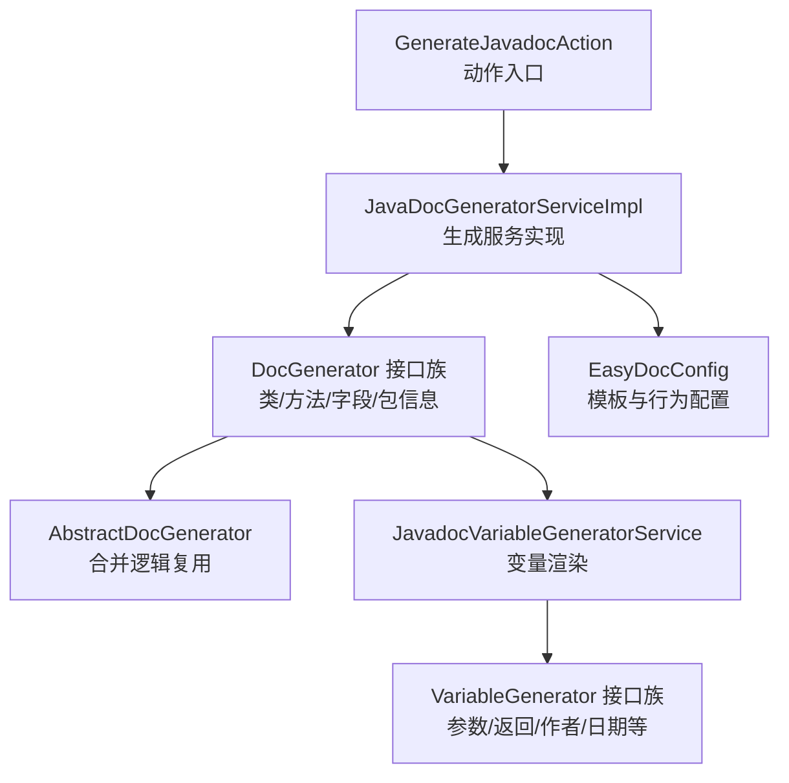
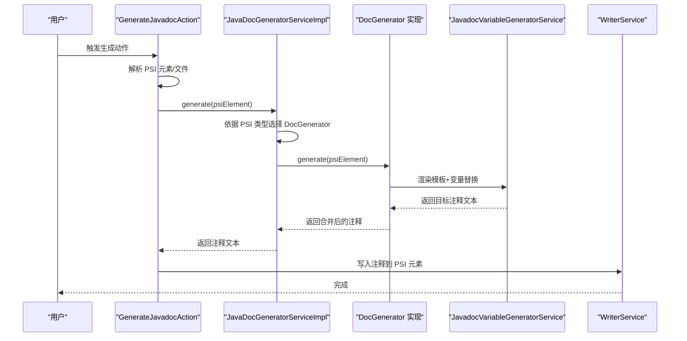
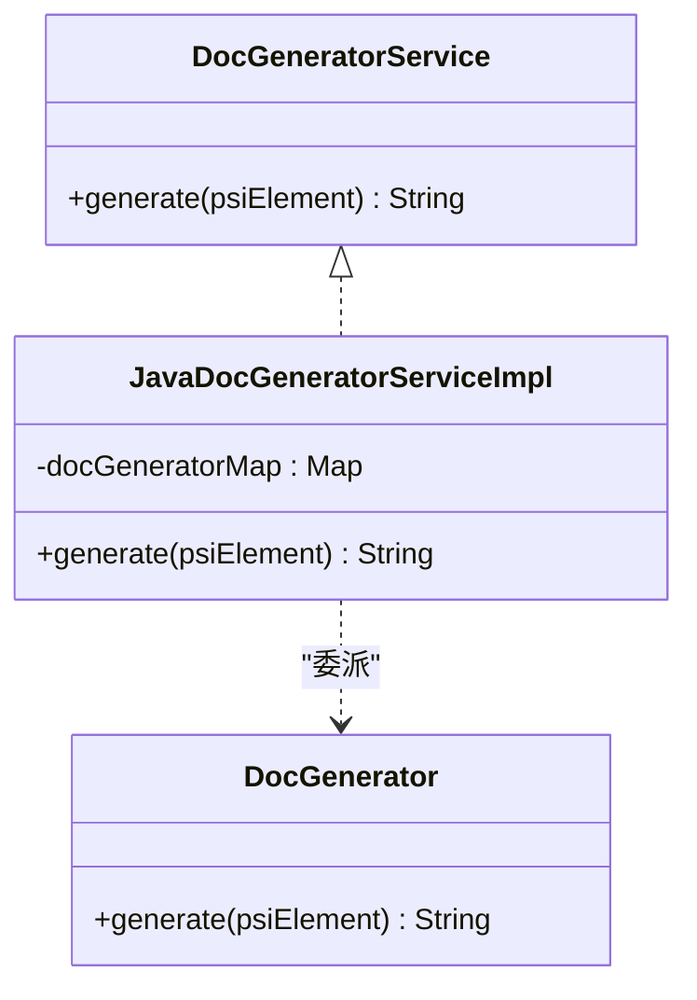
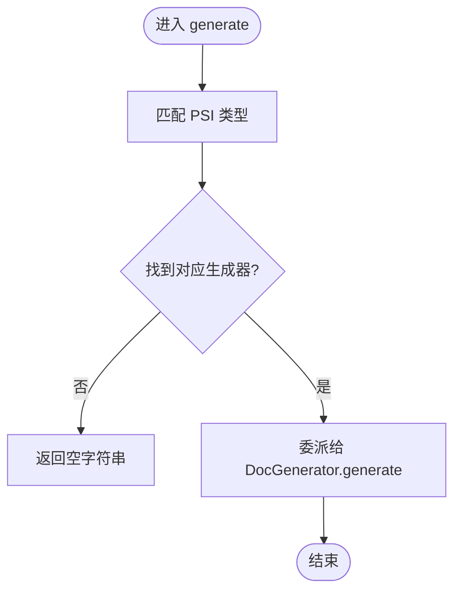
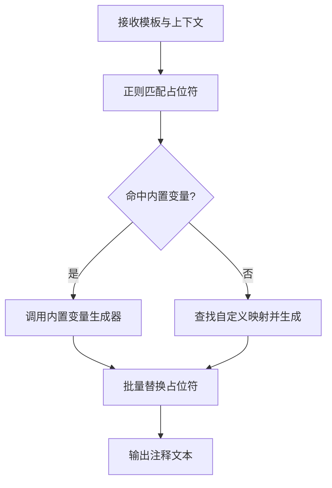
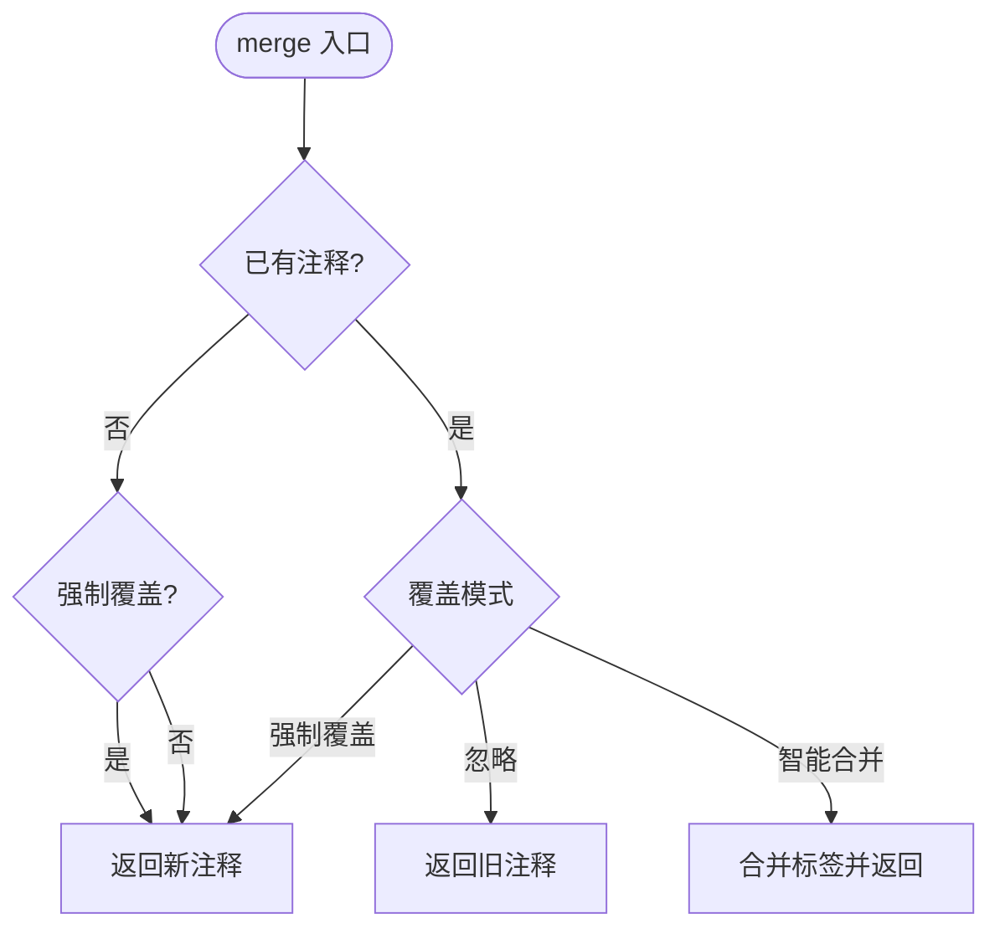
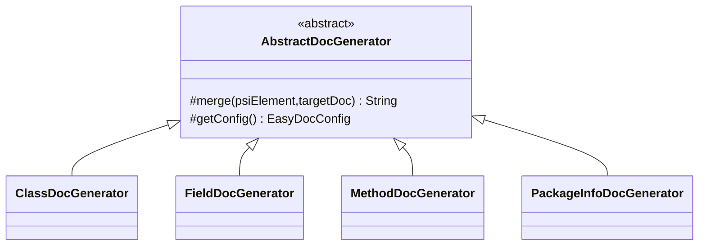
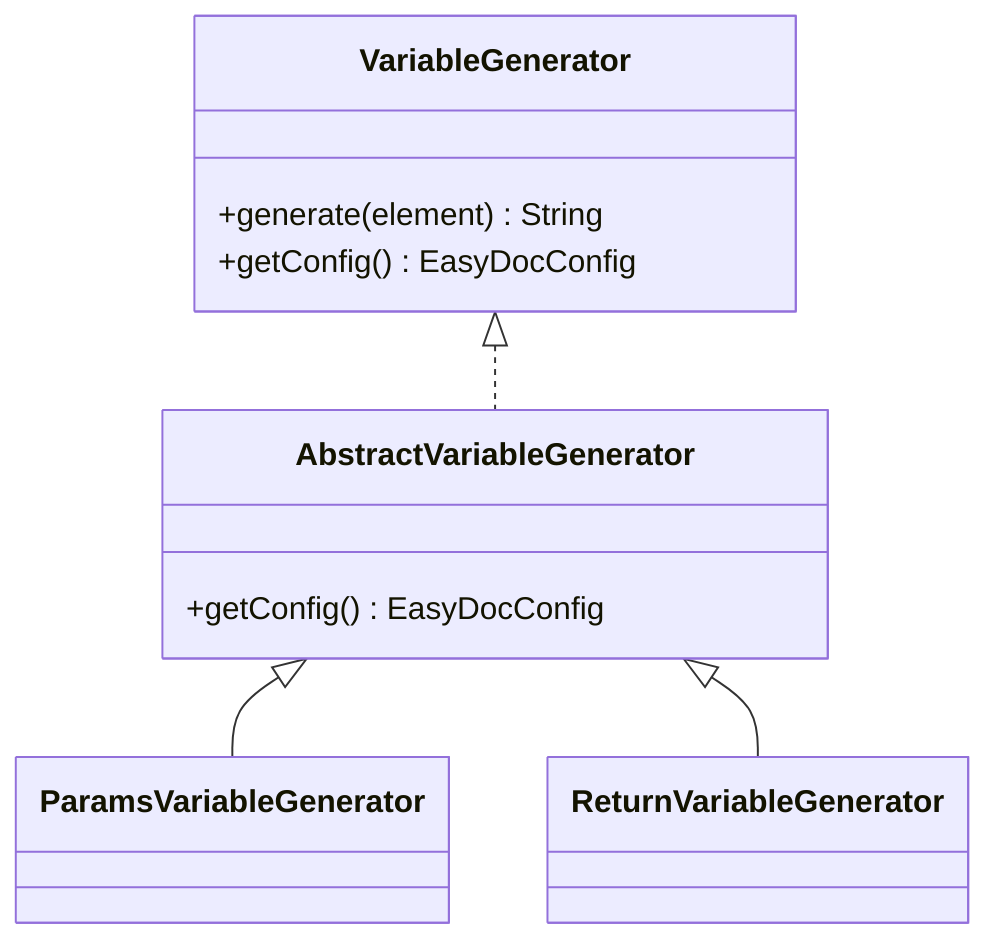
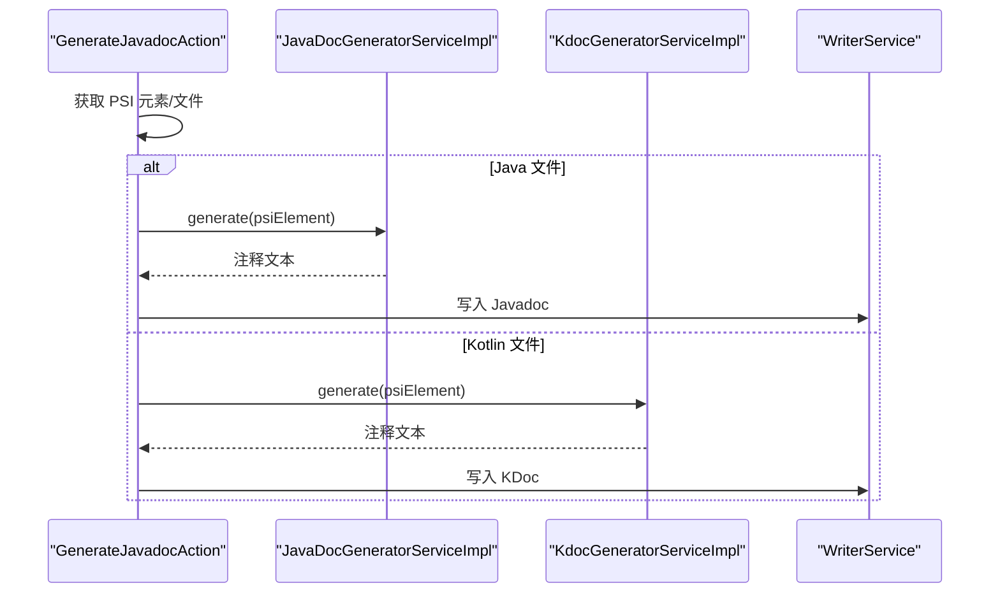
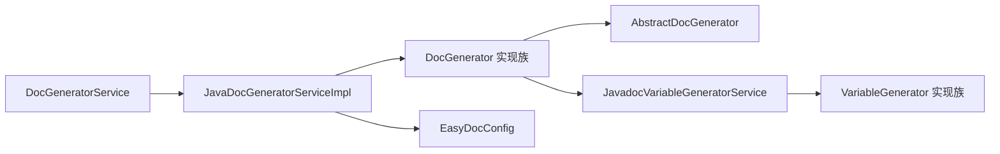

# 生成工作流程

<cite>
**本文引用的文件**
- [DocGeneratorService.java](file://src/main/java/com/star/easydoc/service/DocGeneratorService.java)
- [JavaDocGeneratorServiceImpl.java](file://src/main/java/com/star/easydoc/javadoc/service/JavaDocGeneratorServiceImpl.java)
- [DocGenerator.java](file://src/main/java/com/star/easydoc/javadoc/service/generator/DocGenerator.java)
- [AbstractDocGenerator.java](file://src/main/java/com/star/easydoc/javadoc/service/generator/impl/AbstractDocGenerator.java)
- [ClassDocGenerator.java](file://src/main/java/com/star/easydoc/javadoc/service/generator/impl/ClassDocGenerator.java)
- [FieldDocGenerator.java](file://src/main/java/com/star/easydoc/javadoc/service/generator/impl/FieldDocGenerator.java)
- [MethodDocGenerator.java](file://src/main/java/com/star/easydoc/javadoc/service/generator/impl/MethodDocGenerator.java)
- [PackageInfoDocGenerator.java](file://src/main/java/com/star/easydoc/javadoc/service/generator/impl/PackageInfoDocGenerator.java)
- [JavadocVariableGeneratorService.java](file://src/main/java/com/star/easydoc/javadoc/service/variable/JavadocVariableGeneratorService.java)
- [VariableGenerator.java](file://src/main/java/com/star/easydoc/javadoc/service/variable/VariableGenerator.java)
- [AbstractVariableGenerator.java](file://src/main/java/com/star/easydoc/javadoc/service/variable/impl/AbstractVariableGenerator.java)
- [ParamsVariableGenerator.java](file://src/main/java/com/star/easydoc/javadoc/service/variable/impl/ParamsVariableGenerator.java)
- [ReturnVariableGenerator.java](file://src/main/java/com/star/easydoc/javadoc/service/variable/impl/ReturnVariableGenerator.java)
- [GenerateJavadocAction.java](file://src/main/java/com/star/easydoc/action/GenerateJavadocAction.java)
- [EasyDocConfig.java](file://src/main/java/com/star/easydoc/config/EasyDocConfig.java)
</cite>

## 目录
1. [简介](#简介)
2. [项目结构](#项目结构)
3. [核心组件](#核心组件)
4. [架构总览](#架构总览)
5. [详细组件分析](#详细组件分析)
6. [依赖分析](#依赖分析)
7. [性能考虑](#性能考虑)
8. [故障排查指南](#故障排查指南)
9. [结论](#结论)
10. [附录](#附录)

## 简介
本文件面向“文档注释生成”的完整工作流程，系统性阐述从 PSI 元素识别到最终注释写入的端到端流程。重点包括：
- DocGeneratorService 接口的设计理念与实现策略
- PSI 元素识别、生成器选择、模板渲染、变量替换的执行顺序与数据流转
- 生成器扩展机制与自定义实现方式（抽象基类设计与具体实现类关系）
- 关键流程图与代码路径指引，帮助开发者快速定位与扩展

## 项目结构
围绕“Javadoc/KDoc 注释生成”，工程采用分层与职责分离的组织方式：
- 动作入口：GenerateJavadocAction 提供 IDE 动作入口，负责上下文解析与调用生成服务
- 生成服务：DocGeneratorService 及其实现 JavaDocGeneratorServiceImpl，负责根据 PSI 元素类型选择对应生成器
- 生成器族：DocGenerator 接口及其实现类（类/方法/字段/包信息），统一通过 AbstractDocGenerator 复用合并逻辑
- 变量渲染：JavadocVariableGeneratorService 统一解析模板占位符并替换为具体值
- 配置中心：EasyDocConfig 提供全局配置与模板配置，支撑生成器行为

图表来源
- [GenerateJavadocAction.java:124-154](file://src/main/java/com/star/easydoc/action/GenerateJavadocAction.java#L124-L154)
- [JavaDocGeneratorServiceImpl.java:25-48](file://src/main/java/com/star/easydoc/javadoc/service/JavaDocGeneratorServiceImpl.java#L25-L48)
- [DocGenerator.java:11-19](file://src/main/java/com/star/easydoc/javadoc/service/generator/DocGenerator.java#L11-L19)
- [AbstractDocGenerator.java:20-79](file://src/main/java/com/star/easydoc/javadoc/service/generator/impl/AbstractDocGenerator.java#L20-L79)
- [JavadocVariableGeneratorService.java:35-92](file://src/main/java/com/star/easydoc/javadoc/service/variable/JavadocVariableGeneratorService.java#L35-L92)
- [VariableGenerator.java:12-27](file://src/main/java/com/star/easydoc/javadoc/service/variable/VariableGenerator.java#L12-L27)
- [EasyDocConfig.java:22-680](file://src/main/java/com/star/easydoc/config/EasyDocConfig.java#L22-L680)

章节来源
- [GenerateJavadocAction.java:1-175](file://src/main/java/com/star/easydoc/action/GenerateJavadocAction.java#L1-L175)
- [JavaDocGeneratorServiceImpl.java:1-50](file://src/main/java/com/star/easydoc/javadoc/service/JavaDocGeneratorServiceImpl.java#L1-L50)
- [DocGenerator.java:1-20](file://src/main/java/com/star/easydoc/javadoc/service/generator/DocGenerator.java#L1-L20)
- [AbstractDocGenerator.java:1-80](file://src/main/java/com/star/easydoc/javadoc/service/generator/impl/AbstractDocGenerator.java#L1-L80)
- [JavadocVariableGeneratorService.java:1-128](file://src/main/java/com/star/easydoc/javadoc/service/variable/JavadocVariableGeneratorService.java#L1-L128)
- [VariableGenerator.java:1-28](file://src/main/java/com/star/easydoc/javadoc/service/variable/VariableGenerator.java#L1-L28)
- [EasyDocConfig.java:1-680](file://src/main/java/com/star/easydoc/config/EasyDocConfig.java#L1-L680)

## 核心组件
- DocGeneratorService：定义统一的 generate(PsiElement) 接口，屏蔽 PSI 元素差异
- JavaDocGeneratorServiceImpl：基于 PSI 类型映射到具体 DocGenerator 实现，完成“识别-选择-委派”
- DocGenerator 接口族：类/方法/字段/包信息各自实现 generate，统一由 AbstractDocGenerator 复用合并策略
- JavadocVariableGeneratorService：模板占位符匹配与替换，支持内置变量与自定义 Groovy 表达式
- VariableGenerator 接口族：参数、返回值、作者、日期等变量生成器，统一继承 AbstractVariableGenerator
- EasyDocConfig：集中管理覆盖模式、模板配置、翻译策略、返回值链接风格等

章节来源
- [DocGeneratorService.java:11-20](file://src/main/java/com/star/easydoc/service/DocGeneratorService.java#L11-L20)
- [JavaDocGeneratorServiceImpl.java:25-48](file://src/main/java/com/star/easydoc/javadoc/service/JavaDocGeneratorServiceImpl.java#L25-L48)
- [DocGenerator.java:11-19](file://src/main/java/com/star/easydoc/javadoc/service/generator/DocGenerator.java#L11-L19)
- [AbstractDocGenerator.java:20-79](file://src/main/java/com/star/easydoc/javadoc/service/generator/impl/AbstractDocGenerator.java#L20-L79)
- [JavadocVariableGeneratorService.java:35-127](file://src/main/java/com/star/easydoc/javadoc/service/variable/JavadocVariableGeneratorService.java#L35-L127)
- [VariableGenerator.java:12-27](file://src/main/java/com/star/easydoc/javadoc/service/variable/VariableGenerator.java#L12-L27)
- [AbstractVariableGenerator.java:14-20](file://src/main/java/com/star/easydoc/javadoc/service/variable/impl/AbstractVariableGenerator.java#L14-L20)
- [EasyDocConfig.java:22-680](file://src/main/java/com/star/easydoc/config/EasyDocConfig.java#L22-L680)

## 架构总览
下图展示从动作触发到注释写入的关键交互：

图表来源
- [GenerateJavadocAction.java:124-154](file://src/main/java/com/star/easydoc/action/GenerateJavadocAction.java#L124-L154)
- [JavaDocGeneratorServiceImpl.java:35-48](file://src/main/java/com/star/easydoc/javadoc/service/JavaDocGeneratorServiceImpl.java#L35-L48)
- [DocGenerator.java:11-19](file://src/main/java/com/star/easydoc/javadoc/service/generator/DocGenerator.java#L11-L19)
- [JavadocVariableGeneratorService.java:60-92](file://src/main/java/com/star/easydoc/javadoc/service/variable/JavadocVariableGeneratorService.java#L60-L92)

## 详细组件分析

### DocGeneratorService 接口与实现策略
- 设计理念：以统一接口屏蔽 PSI 元素差异，便于扩展新的元素类型；实现类通过类型映射选择具体生成器
- 实现策略：在 JavaDocGeneratorServiceImpl 中维护 PSI 类型到 DocGenerator 的映射表，遍历匹配后委派给对应生成器

图表来源
- [DocGeneratorService.java:11-20](file://src/main/java/com/star/easydoc/service/DocGeneratorService.java#L11-L20)
- [JavaDocGeneratorServiceImpl.java:25-48](file://src/main/java/com/star/easydoc/javadoc/service/JavaDocGeneratorServiceImpl.java#L25-L48)
- [DocGenerator.java:11-19](file://src/main/java/com/star/easydoc/javadoc/service/generator/DocGenerator.java#L11-L19)

章节来源
- [DocGeneratorService.java:11-20](file://src/main/java/com/star/easydoc/service/DocGeneratorService.java#L11-L20)
- [JavaDocGeneratorServiceImpl.java:25-48](file://src/main/java/com/star/easydoc/javadoc/service/JavaDocGeneratorServiceImpl.java#L25-L48)

### PSI 元素识别与生成器选择
- 识别：根据传入的 PsiElement 类型，匹配预设映射表中的 DocGenerator
- 选择：若未找到匹配项，返回空字符串；否则委派给对应生成器
- 扩展：新增元素类型只需在映射表中注册新的 DocGenerator 实例

图表来源
- [JavaDocGeneratorServiceImpl.java:35-48](file://src/main/java/com/star/easydoc/javadoc/service/JavaDocGeneratorServiceImpl.java#L35-L48)

章节来源
- [JavaDocGeneratorServiceImpl.java:27-48](file://src/main/java/com/star/easydoc/javadoc/service/JavaDocGeneratorServiceImpl.java#L27-L48)

### 模板渲染与变量替换
- 模板：每个生成器可使用默认模板或用户自定义模板
- 占位符：JavadocVariableGeneratorService 使用正则匹配 $占位符$，按以下优先级替换：
  1) 内置变量生成器（author/date/doc/params/return/see/since/throws/version）
  2) 自定义映射（支持固定字符串与 Groovy 脚本）
- 结果：返回替换后的注释文本

图表来源
- [JavadocVariableGeneratorService.java:60-92](file://src/main/java/com/star/easydoc/javadoc/service/variable/JavadocVariableGeneratorService.java#L60-L92)
- [VariableGenerator.java:12-27](file://src/main/java/com/star/easydoc/javadoc/service/variable/VariableGenerator.java#L12-L27)
- [AbstractVariableGenerator.java:14-20](file://src/main/java/com/star/easydoc/javadoc/service/variable/impl/AbstractVariableGenerator.java#L14-L20)

章节来源
- [JavadocVariableGeneratorService.java:35-127](file://src/main/java/com/star/easydoc/javadoc/service/variable/JavadocVariableGeneratorService.java#L35-L127)
- [VariableGenerator.java:12-27](file://src/main/java/com/star/easydoc/javadoc/service/variable/VariableGenerator.java#L12-L27)
- [AbstractVariableGenerator.java:14-20](file://src/main/java/com/star/easydoc/javadoc/service/variable/impl/AbstractVariableGenerator.java#L14-L20)

### 合并与覆盖策略
- 合并：AbstractDocGenerator.merge 在存在已有文档注释且非强制覆盖时，保留已有标签并合并新标签
- 覆盖模式：由 EasyDocConfig.COVER_MODE 控制（忽略/智能合并/强制覆盖）

图表来源
- [AbstractDocGenerator.java:29-71](file://src/main/java/com/star/easydoc/javadoc/service/generator/impl/AbstractDocGenerator.java#L29-L71)
- [EasyDocConfig.java:42-44](file://src/main/java/com/star/easydoc/config/EasyDocConfig.java#L42-L44)

章节来源
- [AbstractDocGenerator.java:20-79](file://src/main/java/com/star/easydoc/javadoc/service/generator/impl/AbstractDocGenerator.java#L20-L79)
- [EasyDocConfig.java:42-44](file://src/main/java/com/star/easydoc/config/EasyDocConfig.java#L42-L44)

### 生成器扩展机制与自定义实现
- 抽象基类：AbstractDocGenerator 提供 merge 与配置访问能力，子类仅需关注模板与变量
- 具体实现：ClassDocGenerator/FieldDocGenerator/MethodDocGenerator/PackageInfoDocGenerator 分别覆盖 generate 与内部变量
- 扩展步骤：
  1) 新建实现类并实现 DocGenerator.generate
  2) 在 JavaDocGeneratorServiceImpl 的映射表中注册
  3) 若需变量替换，可在 JavadocVariableGeneratorService 的变量映射中添加或使用自定义映射

图表来源
- [AbstractDocGenerator.java:20-79](file://src/main/java/com/star/easydoc/javadoc/service/generator/impl/AbstractDocGenerator.java#L20-L79)
- [ClassDocGenerator.java:29](file://src/main/java/com/star/easydoc/javadoc/service/generator/impl/ClassDocGenerator.java#L29)
- [FieldDocGenerator.java:28](file://src/main/java/com/star/easydoc/javadoc/service/generator/impl/FieldDocGenerator.java#L28)
- [MethodDocGenerator.java:30](file://src/main/java/com/star/easydoc/javadoc/service/generator/impl/MethodDocGenerator.java#L30)
- [PackageInfoDocGenerator.java:15](file://src/main/java/com/star/easydoc/javadoc/service/generator/impl/PackageInfoDocGenerator.java#L15)

章节来源
- [AbstractDocGenerator.java:20-79](file://src/main/java/com/star/easydoc/javadoc/service/generator/impl/AbstractDocGenerator.java#L20-L79)
- [ClassDocGenerator.java:29](file://src/main/java/com/star/easydoc/javadoc/service/generator/impl/ClassDocGenerator.java#L29)
- [FieldDocGenerator.java:28](file://src/main/java/com/star/easydoc/javadoc/service/generator/impl/FieldDocGenerator.java#L28)
- [MethodDocGenerator.java:30](file://src/main/java/com/star/easydoc/javadoc/service/generator/impl/MethodDocGenerator.java#L30)
- [PackageInfoDocGenerator.java:15](file://src/main/java/com/star/easydoc/javadoc/service/generator/impl/PackageInfoDocGenerator.java#L15)

### 关键生成器与变量生成器
- 参数变量生成器 ParamsVariableGenerator：从方法签名提取参数名，结合已有 @param 注释与翻译策略生成列表
- 返回值变量生成器 ReturnVariableGenerator：根据配置决定返回值链接风格（code/link/doc/默认 link）
- 其他内置变量：作者、日期、文档摘要、异常等，均由对应变量生成器提供

图表来源
- [VariableGenerator.java:12-27](file://src/main/java/com/star/easydoc/javadoc/service/variable/VariableGenerator.java#L12-L27)
- [AbstractVariableGenerator.java:14-20](file://src/main/java/com/star/easydoc/javadoc/service/variable/impl/AbstractVariableGenerator.java#L14-L20)
- [ParamsVariableGenerator.java:27-83](file://src/main/java/com/star/easydoc/javadoc/service/variable/impl/ParamsVariableGenerator.java#L27-L83)
- [ReturnVariableGenerator.java:16-45](file://src/main/java/com/star/easydoc/javadoc/service/variable/impl/ReturnVariableGenerator.java#L16-L45)

章节来源
- [ParamsVariableGenerator.java:27-116](file://src/main/java/com/star/easydoc/javadoc/service/variable/impl/ParamsVariableGenerator.java#L27-L116)
- [ReturnVariableGenerator.java:16-46](file://src/main/java/com/star/easydoc/javadoc/service/variable/impl/ReturnVariableGenerator.java#L16-L46)

### 动作入口与写入流程
- GenerateJavadocAction：解析当前编辑器/文件/元素，区分 Java/Kotlin 文件，分别调用 Javadoc 或 KDoc 生成服务
- 写入：将生成的注释文本转换为 PSI 注释对象并写入目标元素

图表来源
- [GenerateJavadocAction.java:124-173](file://src/main/java/com/star/easydoc/action/GenerateJavadocAction.java#L124-L173)

章节来源
- [GenerateJavadocAction.java:46-174](file://src/main/java/com/star/easydoc/action/GenerateJavadocAction.java#L46-L174)

## 依赖分析
- 低耦合高内聚：DocGeneratorService 仅依赖 PSI 元素；生成器实现依赖变量渲染与配置中心
- 可扩展点：映射表与变量映射均为可配置，便于新增元素类型与占位符
- 外部依赖：翻译服务、AI 服务、文件写入服务通过服务管理器注入

图表来源
- [JavaDocGeneratorServiceImpl.java:25-48](file://src/main/java/com/star/easydoc/javadoc/service/JavaDocGeneratorServiceImpl.java#L25-L48)
- [AbstractDocGenerator.java:20-79](file://src/main/java/com/star/easydoc/javadoc/service/generator/impl/AbstractDocGenerator.java#L20-L79)
- [JavadocVariableGeneratorService.java:35-127](file://src/main/java/com/star/easydoc/javadoc/service/variable/JavadocVariableGeneratorService.java#L35-L127)
- [EasyDocConfig.java:22-680](file://src/main/java/com/star/easydoc/config/EasyDocConfig.java#L22-L680)

章节来源
- [JavaDocGeneratorServiceImpl.java:25-48](file://src/main/java/com/star/easydoc/javadoc/service/JavaDocGeneratorServiceImpl.java#L25-L48)
- [JavadocVariableGeneratorService.java:35-127](file://src/main/java/com/star/easydoc/javadoc/service/variable/JavadocVariableGeneratorService.java#L35-L127)
- [EasyDocConfig.java:22-680](file://src/main/java/com/star/easydoc/config/EasyDocConfig.java#L22-L680)

## 性能考虑
- 模板匹配与替换：正则匹配与字符串替换为 O(n) 级别，建议避免过长模板与过多占位符
- 变量生成：内置变量生成器多为常量或轻量计算；自定义 Groovy 脚本可能带来额外开销，建议谨慎使用
- 覆盖模式：智能合并会解析已有注释并构造新注释，复杂注释结构可能增加处理时间
- 批量生成：可通过配置开关控制是否生成类/方法/字段注释以及是否递归内部类，减少不必要的处理

## 故障排查指南
- 生成为空：确认 PSI 元素类型是否被映射；检查覆盖模式是否设置为“忽略”且已有注释
- 变量未替换：检查模板占位符拼写；确认自定义映射键值是否存在；Groovy 脚本语法错误会被记录日志
- 合并异常：核对现有注释格式；确保标签名称一致；必要时切换为“强制覆盖”验证问题
- 写入失败：确认 WriterService 正常；检查 PSI 工厂创建注释对象是否成功

章节来源
- [JavaDocGeneratorServiceImpl.java:44-48](file://src/main/java/com/star/easydoc/javadoc/service/JavaDocGeneratorServiceImpl.java#L44-L48)
- [JavadocVariableGeneratorService.java:102-125](file://src/main/java/com/star/easydoc/javadoc/service/variable/JavadocVariableGeneratorService.java#L102-L125)
- [AbstractDocGenerator.java:29-71](file://src/main/java/com/star/easydoc/javadoc/service/generator/impl/AbstractDocGenerator.java#L29-L71)
- [GenerateJavadocAction.java:145-154](file://src/main/java/com/star/easydoc/action/GenerateJavadocAction.java#L145-L154)

## 结论
该工作流以 DocGeneratorService 为核心，通过 PSI 元素识别与生成器映射实现“多元素、单一接口”的统一入口；借助 JavadocVariableGeneratorService 的模板与变量替换机制，配合 EasyDocConfig 的灵活配置，形成可扩展、可定制的注释生成体系。扩展新元素类型与变量占位符的成本低，适合在团队内推广与持续演进。

## 附录
- 关键流程图与类图已在前述章节中给出，读者可据此定位具体实现文件与方法
- 如需新增元素类型，请参考映射注册与生成器实现的现有模式
- 如需新增变量占位符，请参考变量映射注册与自定义映射的实现方式