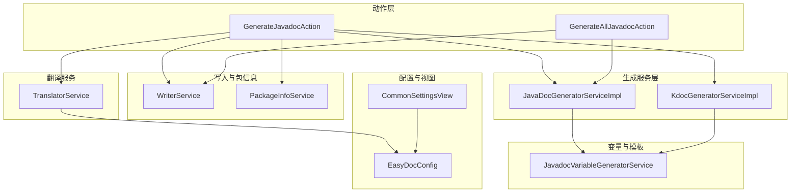
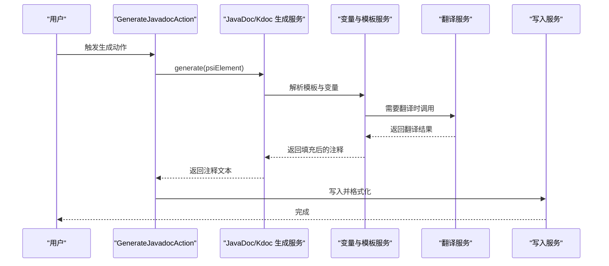
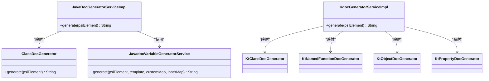
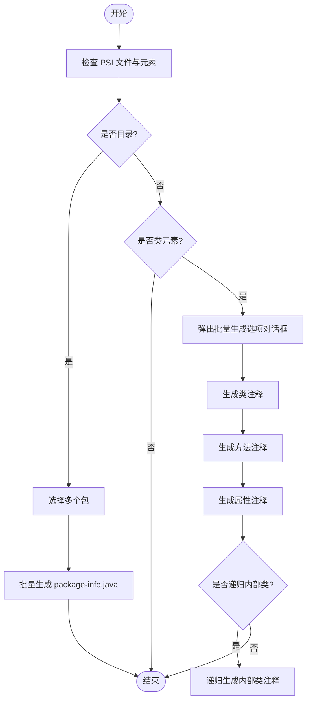
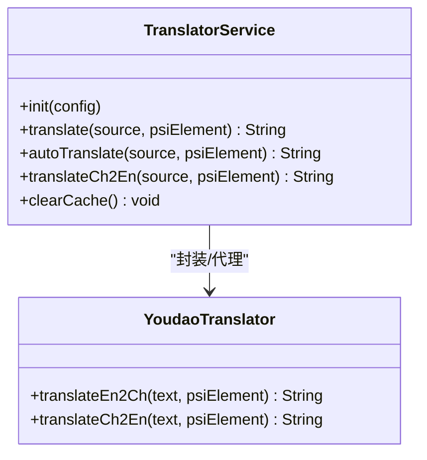
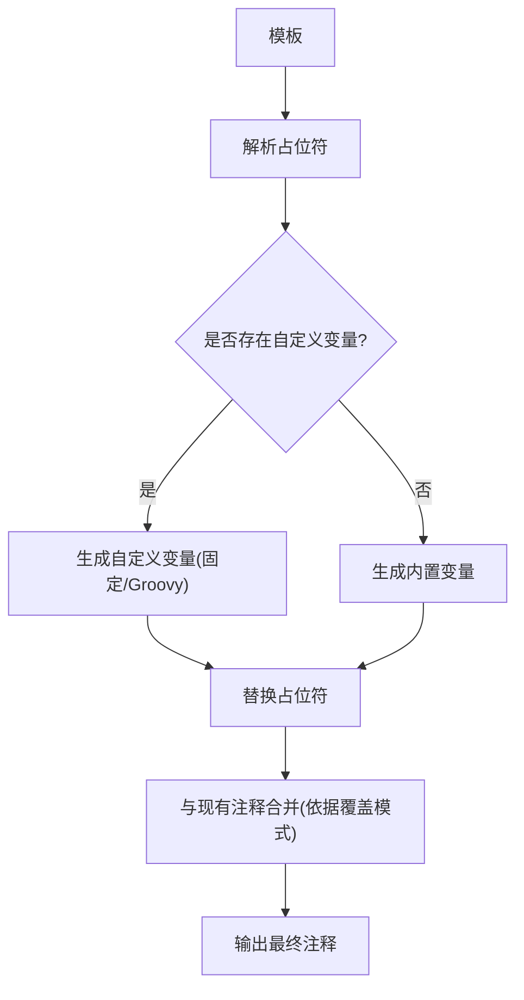
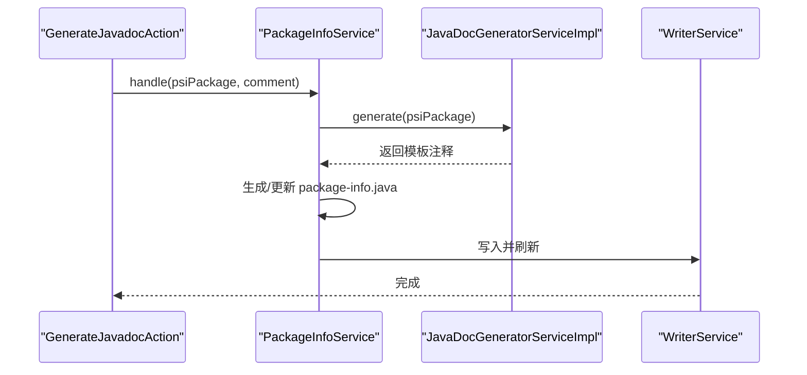
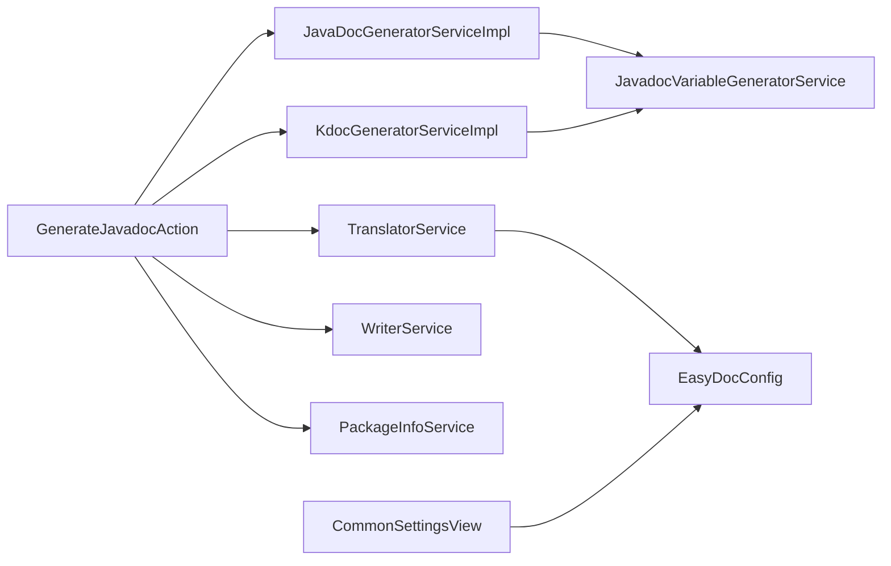

# 核心功能

<cite>
**本文引用的文件**
- [plugin.xml](file://src/main/resources/META-INF/plugin.xml)
- [GenerateJavadocAction.java](file://src/main/java/com/star/easydoc/action/GenerateJavadocAction.java)
- [GenerateAllJavadocAction.java](file://src/main/java/com/star/easydoc/action/GenerateAllJavadocAction.java)
- [JavaDocGeneratorServiceImpl.java](file://src/main/java/com/star/easydoc/javadoc/service/JavaDocGeneratorServiceImpl.java)
- [KdocGeneratorServiceImpl.kt](file://src/main/kotlin/com/star/easydoc/kdoc/service/KdocGeneratorServiceImpl.kt)
- [DocGenerator.java](file://src/main/java/com/star/easydoc/javadoc/service/generator/DocGenerator.java)
- [ClassDocGenerator.java](file://src/main/java/com/star/easydoc/javadoc/service/generator/impl/ClassDocGenerator.java)
- [TranslatorService.java](file://src/main/java/com/star/easydoc/service/translator/TranslatorService.java)
- [YoudaoTranslator.java](file://src/main/java/com/star/easydoc/service/translator/impl/YoudaoTranslator.java)
- [CommonSettingsView.java](file://src/main/java/com/star/easydoc/view/settings/CommonSettingsView.java)
- [JavadocVariableGeneratorService.java](file://src/main/java/com/star/easydoc/javadoc/service/variable/JavadocVariableGeneratorService.java)
- [WriterService.java](file://src/main/java/com/star/easydoc/service/WriterService.java)
- [PackageInfoService.java](file://src/main/java/com/star/easydoc/service/PackageInfoService.java)
- [EasyDocConfig.java](file://src/main/java/com/star/easydoc/config/EasyDocConfig.java)
- [README.md](file://README.md)
</cite>

## 目录
1. [简介](#简介)
2. [项目结构](#项目结构)
3. [核心组件](#核心组件)
4. [架构总览](#架构总览)
5. [详细组件分析](#详细组件分析)
6. [依赖分析](#依赖分析)
7. [性能考量](#性能考量)
8. [故障排查指南](#故障排查指南)
9. [结论](#结论)
10. [附录](#附录)

## 简介
本文件面向 Easy Javadoc 插件的核心功能模块，系统性梳理以下能力与实现细节：
- 文档注释生成功能：覆盖 JavaDoc 与 Kdoc，支持类、方法、属性、包信息等代码元素的自动生成。
- 批量注释生成功能：支持从类节点出发批量生成类、方法、属性注释，以及包信息生成。
- 翻译服务系统：多翻译器集成、AI 翻译支持、整句/单词级翻译策略与缓存机制。
- 模板系统：默认模板、自定义模板、变量替换与 Groovy 脚本扩展。
- 使用示例与配置说明：帮助用户高效上手与深度定制。

## 项目结构
插件采用按职责分层与按语言分包的组织方式：
- 动作入口：GenerateJavadocAction、GenerateAllJavadocAction 提供快捷键触发与交互。
- 生成服务：JavaDocGeneratorServiceImpl、KdocGeneratorServiceImpl 统一调度各类 DocGenerator。
- 变量与模板：JavadocVariableGeneratorService 负责变量解析与模板替换。
- 翻译服务：TranslatorService 统一封装多翻译器实现与缓存。
- 写入与包信息：WriterService 负责注释写入与格式化；PackageInfoService 负责 package-info.java 的生成与更新。
- 配置与视图：EasyDocConfig 存储持久化配置；CommonSettingsView 提供图形化配置界面。

图表来源
- [plugin.xml:55-78](file://src/main/resources/META-INF/plugin.xml#L55-L78)
- [GenerateJavadocAction.java:46-175](file://src/main/java/com/star/easydoc/action/GenerateJavadocAction.java#L46-L175)
- [GenerateAllJavadocAction.java:47-218](file://src/main/java/com/star/easydoc/action/GenerateAllJavadocAction.java#L47-L218)
- [JavaDocGeneratorServiceImpl.java:25-49](file://src/main/java/com/star/easydoc/javadoc/service/JavaDocGeneratorServiceImpl.java#L25-L49)
- [KdocGeneratorServiceImpl.kt:21-52](file://src/main/kotlin/com/star/easydoc/kdoc/service/KdocGeneratorServiceImpl.kt#L21-L52)
- [JavadocVariableGeneratorService.java:35-127](file://src/main/java/com/star/easydoc/javadoc/service/variable/JavadocVariableGeneratorService.java#L35-L127)
- [TranslatorService.java:41-237](file://src/main/java/com/star/easydoc/service/translator/TranslatorService.java#L41-L237)
- [WriterService.java:25-139](file://src/main/java/com/star/easydoc/service/WriterService.java#L25-L139)
- [PackageInfoService.java:22-89](file://src/main/java/com/star/easydoc/service/PackageInfoService.java#L22-L89)
- [EasyDocConfig.java:22-679](file://src/main/java/com/star/easydoc/config/EasyDocConfig.java#L22-L679)
- [CommonSettingsView.java:42-739](file://src/main/java/com/star/easydoc/view/settings/CommonSettingsView.java#L42-L739)

章节来源
- [plugin.xml:1-82](file://src/main/resources/META-INF/plugin.xml#L1-L82)
- [README.md:1-266](file://README.md#L1-L266)

## 核心组件
- 动作入口
  - GenerateJavadocAction：根据选中元素类型（Java/Kotlin）调用对应生成器，支持选中文本的中英互译与自动翻译结果展示。
  - GenerateAllJavadocAction：批量生成类、方法、属性注释，支持包信息批量生成与描述编辑。
- 生成服务
  - JavaDocGeneratorServiceImpl：基于 PSI 元素类型映射到具体 DocGenerator，统一生成 JavaDoc。
  - KdocGeneratorServiceImpl：基于 Kotlin PSI 元素类型映射到具体 DocGenerator，统一生成 Kdoc。
- 变量与模板
  - JavadocVariableGeneratorService：解析模板占位符，内置变量（author/date/doc/params/return/see/since/throws/version），支持自定义变量（固定值/Groovy 脚本）。
- 翻译服务
  - TranslatorService：集中管理多翻译器（百度、阿里云、腾讯、有道智云、微软、谷歌、自定义 URL、本地字典等），提供整句/单词级翻译、自定义词典优先、缓存清理。
- 写入与包信息
  - WriterService：安全写入注释、格式化、空行控制；支持 JavaDoc 与 Kdoc。
  - PackageInfoService：生成/更新 package-info.java，自动注入包描述注释。
- 配置与视图
  - EasyDocConfig：持久化配置，包含作者、日期格式、模板配置、翻译器与凭据、单词映射、批量生成开关等。
  - CommonSettingsView：图形化配置界面，支持导入/导出、重置、清空缓存、项目级单词映射等。

章节来源
- [GenerateJavadocAction.java:46-175](file://src/main/java/com/star/easydoc/action/GenerateJavadocAction.java#L46-L175)
- [GenerateAllJavadocAction.java:47-218](file://src/main/java/com/star/easydoc/action/GenerateAllJavadocAction.java#L47-L218)
- [JavaDocGeneratorServiceImpl.java:25-49](file://src/main/java/com/star/easydoc/javadoc/service/JavaDocGeneratorServiceImpl.java#L25-L49)
- [KdocGeneratorServiceImpl.kt:21-52](file://src/main/kotlin/com/star/easydoc/kdoc/service/KdocGeneratorServiceImpl.kt#L21-L52)
- [JavadocVariableGeneratorService.java:35-127](file://src/main/java/com/star/easydoc/javadoc/service/variable/JavadocVariableGeneratorService.java#L35-L127)
- [TranslatorService.java:41-237](file://src/main/java/com/star/easydoc/service/translator/TranslatorService.java#L41-L237)
- [WriterService.java:25-139](file://src/main/java/com/star/easydoc/service/WriterService.java#L25-L139)
- [PackageInfoService.java:22-89](file://src/main/java/com/star/easydoc/service/PackageInfoService.java#L22-L89)
- [EasyDocConfig.java:22-679](file://src/main/java/com/star/easydoc/config/EasyDocConfig.java#L22-L679)
- [CommonSettingsView.java:42-739](file://src/main/java/com/star/easydoc/view/settings/CommonSettingsView.java#L42-L739)

## 架构总览
整体流程：用户通过动作入口选择目标元素，插件根据元素类型调用对应生成器，生成器结合变量与模板生成注释文本，再由 WriterService 安全写入并格式化；翻译服务贯穿其中，提供整句/单词级翻译与 AI 辅助。

图表来源
- [GenerateJavadocAction.java:71-175](file://src/main/java/com/star/easydoc/action/GenerateJavadocAction.java#L71-L175)
- [JavaDocGeneratorServiceImpl.java:35-48](file://src/main/java/com/star/easydoc/javadoc/service/JavaDocGeneratorServiceImpl.java#L35-L48)
- [KdocGeneratorServiceImpl.kt:35-51](file://src/main/kotlin/com/star/easydoc/kdoc/service/KdocGeneratorServiceImpl.kt#L35-L51)
- [JavadocVariableGeneratorService.java:60-92](file://src/main/java/com/star/easydoc/javadoc/service/variable/JavadocVariableGeneratorService.java#L60-L92)
- [TranslatorService.java:157-163](file://src/main/java/com/star/easydoc/service/translator/TranslatorService.java#L157-L163)
- [WriterService.java:36-75](file://src/main/java/com/star/easydoc/service/WriterService.java#L36-L75)

## 详细组件分析

### 文档注释生成（JavaDoc 与 Kdoc）
- JavaDoc 生成
  - JavaDocGeneratorServiceImpl 通过 PSI 类型映射到 ClassDocGenerator、MethodDocGenerator、FieldDocGenerator、PackageInfoDocGenerator。
  - ClassDocGenerator 支持默认模板与自定义模板，内置变量（作者、日期、类名、分支、项目名等），并支持 AI 生成（当选择 AI 翻译器时）。
- Kdoc 生成
  - KdocGeneratorServiceImpl 通过 Kotlin PSI 类型映射到 KtClassDocGenerator、KtNamedFunctionDocGenerator、KtObjectDocGenerator、KtPropertyDocGenerator。
  - 对生成结果进行行过滤与格式化，确保注释整洁。
- 变量与模板
  - JavadocVariableGeneratorService 解析模板占位符，内置变量包括 author/date/doc/params/return/see/since/throws/version。
  - 支持自定义变量：固定值或 Groovy 脚本，Groovy 脚本可访问内部变量映射（如类名、分支、项目名等）。

图表来源
- [JavaDocGeneratorServiceImpl.java:27-33](file://src/main/java/com/star/easydoc/javadoc/service/JavaDocGeneratorServiceImpl.java#L27-L33)
- [KdocGeneratorServiceImpl.kt:22-27](file://src/main/kotlin/com/star/easydoc/kdoc/service/KdocGeneratorServiceImpl.kt#L22-L27)
- [JavadocVariableGeneratorService.java:42-52](file://src/main/java/com/star/easydoc/javadoc/service/variable/JavadocVariableGeneratorService.java#L42-L52)
- [ClassDocGenerator.java:29-115](file://src/main/java/com/star/easydoc/javadoc/service/generator/impl/ClassDocGenerator.java#L29-L115)

章节来源
- [JavaDocGeneratorServiceImpl.java:25-49](file://src/main/java/com/star/easydoc/javadoc/service/JavaDocGeneratorServiceImpl.java#L25-L49)
- [KdocGeneratorServiceImpl.kt:21-52](file://src/main/kotlin/com/star/easydoc/kdoc/service/KdocGeneratorServiceImpl.kt#L21-L52)
- [ClassDocGenerator.java:44-115](file://src/main/java/com/star/easydoc/javadoc/service/generator/impl/ClassDocGenerator.java#L44-L115)
- [JavadocVariableGeneratorService.java:35-127](file://src/main/java/com/star/easydoc/javadoc/service/variable/JavadocVariableGeneratorService.java#L35-L127)

### 批量注释生成（Java）
- GenerateAllJavadocAction 支持：
  - 从类节点批量生成类、方法、属性注释。
  - 递归处理内部类（可选）。
  - 选中目录时弹出包选择对话框，批量生成多个包的 package-info.java。
- 写入流程：逐元素生成注释，使用 WriterService 安全写入并格式化。

图表来源
- [GenerateAllJavadocAction.java:79-136](file://src/main/java/com/star/easydoc/action/GenerateAllJavadocAction.java#L79-L136)
- [WriterService.java:36-75](file://src/main/java/com/star/easydoc/service/WriterService.java#L36-L75)

章节来源
- [GenerateAllJavadocAction.java:47-218](file://src/main/java/com/star/easydoc/action/GenerateAllJavadocAction.java#L47-L218)
- [WriterService.java:25-139](file://src/main/java/com/star/easydoc/service/WriterService.java#L25-L139)

### 翻译服务系统
- 多翻译器集成：百度、阿里云、腾讯、有道智云、微软、谷歌、自定义 URL、本地字典、简单拆分器等。
- 整句/单词级策略：
  - 若存在自定义词典映射，优先逐词翻译；否则整句翻译以提升准确性。
  - 中文选中时支持自动翻译为英文命名，进行大小写与停用词处理。
- 缓存与清理：提供统一缓存清理入口，便于调试与性能优化。
- 免费接口限制：有道免费接口已停止，插件提供替代方案与引导。

图表来源
- [TranslatorService.java:41-237](file://src/main/java/com/star/easydoc/service/translator/TranslatorService.java#L41-L237)
- [YoudaoTranslator.java:22-161](file://src/main/java/com/star/easydoc/service/translator/impl/YoudaoTranslator.java#L22-L161)

章节来源
- [TranslatorService.java:41-237](file://src/main/java/com/star/easydoc/service/translator/TranslatorService.java#L41-L237)
- [YoudaoTranslator.java:22-161](file://src/main/java/com/star/easydoc/service/translator/impl/YoudaoTranslator.java#L22-L161)

### 模板系统与变量替换
- 默认模板：类注释默认模板包含作者、日期等占位符。
- 自定义模板：支持为类、方法、属性分别配置模板与是否使用默认模板。
- 变量替换：
  - 内置变量：author/date/doc/params/return/see/since/throws/version。
  - 自定义变量：固定值或 Groovy 脚本，Groovy 可访问内部变量映射。
- 覆盖模式：支持忽略、智能合并、强制覆盖，避免覆盖已有注释。

图表来源
- [ClassDocGenerator.java:44-68](file://src/main/java/com/star/easydoc/javadoc/service/generator/impl/ClassDocGenerator.java#L44-L68)
- [JavadocVariableGeneratorService.java:60-125](file://src/main/java/com/star/easydoc/javadoc/service/variable/JavadocVariableGeneratorService.java#L60-L125)
- [EasyDocConfig.java:49-679](file://src/main/java/com/star/easydoc/config/EasyDocConfig.java#L49-L679)

章节来源
- [ClassDocGenerator.java:36-115](file://src/main/java/com/star/easydoc/javadoc/service/generator/impl/ClassDocGenerator.java#L36-L115)
- [JavadocVariableGeneratorService.java:35-127](file://src/main/java/com/star/easydoc/javadoc/service/variable/JavadocVariableGeneratorService.java#L35-L127)
- [EasyDocConfig.java:146-254](file://src/main/java/com/star/easydoc/config/EasyDocConfig.java#L146-L254)

### 写入与包信息生成
- 写入服务：
  - 安全写入注释，支持 JavaDoc 与 Kdoc。
  - 写入后进行格式化与空行控制，保证美观与一致性。
- 包信息：
  - 自动生成/更新 package-info.java，注入包描述注释。
  - 支持从包名自动翻译生成描述，或从已有注释中提取并追加。

图表来源
- [GenerateJavadocAction.java:124-140](file://src/main/java/com/star/easydoc/action/GenerateJavadocAction.java#L124-L140)
- [PackageInfoService.java:33-87](file://src/main/java/com/star/easydoc/service/PackageInfoService.java#L33-L87)
- [WriterService.java:107-136](file://src/main/java/com/star/easydoc/service/WriterService.java#L107-L136)

章节来源
- [PackageInfoService.java:22-89](file://src/main/java/com/star/easydoc/service/PackageInfoService.java#L22-L89)
- [WriterService.java:25-139](file://src/main/java/com/star/easydoc/service/WriterService.java#L25-L139)

## 依赖分析
- 组件耦合
  - 动作层依赖生成服务、翻译服务、写入服务与包信息服务。
  - 生成服务依赖变量与模板服务，部分生成器依赖 AI 服务。
  - 配置通过 EasyDocConfig 与 CommonSettingsView 提供持久化与图形化配置。
- 外部依赖
  - IntelliJ PSI API（Java/Kotlin）用于解析与生成注释。
  - 第三方翻译服务与自定义 URL 接口。
  - Groovy Shell 用于自定义变量的脚本执行。

图表来源
- [GenerateJavadocAction.java:48-53](file://src/main/java/com/star/easydoc/action/GenerateJavadocAction.java#L48-L53)
- [JavaDocGeneratorServiceImpl.java:27-33](file://src/main/java/com/star/easydoc/javadoc/service/JavaDocGeneratorServiceImpl.java#L27-L33)
- [KdocGeneratorServiceImpl.kt:22-27](file://src/main/kotlin/com/star/easydoc/kdoc/service/KdocGeneratorServiceImpl.kt#L22-L27)
- [JavadocVariableGeneratorService.java:42-52](file://src/main/java/com/star/easydoc/javadoc/service/variable/JavadocVariableGeneratorService.java#L42-L52)
- [TranslatorService.java:60-76](file://src/main/java/com/star/easydoc/service/translator/TranslatorService.java#L60-L76)
- [CommonSettingsView.java:42-45](file://src/main/java/com/star/easydoc/view/settings/CommonSettingsView.java#L42-L45)
- [EasyDocConfig.java:22-49](file://src/main/java/com/star/easydoc/config/EasyDocConfig.java#L22-L49)

章节来源
- [plugin.xml:27-53](file://src/main/resources/META-INF/plugin.xml#L27-L53)

## 性能考量
- 翻译策略
  - 优先整句翻译以提高准确性；当存在自定义词典映射时逐词翻译，减少歧义。
  - 提供缓存清理入口，便于在频繁切换翻译器时优化性能。
- 写入与格式化
  - 使用 WriteCommandAction 保证线程安全与一致性。
  - 写入后统一格式化，避免 IDE 格式化导致的标签顺序变化。
- 批量生成
  - GenerateAllJavadocAction 支持按需勾选生成范围（类/方法/属性/内部类），减少不必要的处理。

## 故障排查指南
- 快捷键无效
  - 确保将光标放在类名、方法名或属性名上，而非选中文本或鼠标点击。
  - 检查 IDE 快捷键是否与其他插件冲突（例如 IDEA AI Assistant）。
- 属性单行注释不生效
  - 更改 IDE 格式化设置，避免将单行注释转换为多行。
- 文档标签顺序被 IDE 格式化打乱
  - 关闭 Javadoc 格式化，或手动调整标签顺序。
- 翻译服务不可用
  - 有道免费接口已停止，建议更换私有账户或使用其他翻译器。
  - 检查网络与代理设置，必要时使用自定义 URL 翻译器。
- 导入/导出配置失败
  - 确认 JSON 文件格式正确，路径有效。

章节来源
- [README.md:71-105](file://README.md#L71-L105)
- [YoudaoTranslator.java:32-42](file://src/main/java/com/star/easydoc/service/translator/impl/YoudaoTranslator.java#L32-L42)
- [CommonSettingsView.java:107-148](file://src/main/java/com/star/easydoc/view/settings/CommonSettingsView.java#L107-L148)

## 结论
Easy Javadoc 插件通过清晰的分层设计与完善的扩展点，实现了对 JavaDoc 与 Kdoc 的高效生成，覆盖类、方法、属性与包信息等主流代码元素。其多翻译器集成、AI 辅助与灵活的模板/变量系统，使得注释生成既自动化又可定制。配合批量生成与图形化配置，能够显著提升团队文档质量与开发效率。

## 附录
- 快捷键与使用场景
  - 生成当前注释：将光标置于类/方法/属性上，使用快捷键触发。
  - 选中文本自动翻译：中文自动转英文命名，非中文弹框展示翻译结果。
  - 批量生成：将光标置于类上，使用组合快捷键批量生成类/方法/属性注释。
- 配置要点
  - 在“通用设置”中选择翻译器并填写相应凭据。
  - 在“Javadoc/Kdoc 模板设置”中配置类/方法/属性模板与变量。
  - 使用“项目级单词映射”提升特定术语翻译准确性。
  - 使用“导入/导出”在不同环境间迁移配置。

章节来源
- [README.md:26-48](file://README.md#L26-L48)
- [plugin.xml:39-51](file://src/main/resources/META-INF/plugin.xml#L39-L51)
- [CommonSettingsView.java:107-148](file://src/main/java/com/star/easydoc/view/settings/CommonSettingsView.java#L107-L148)