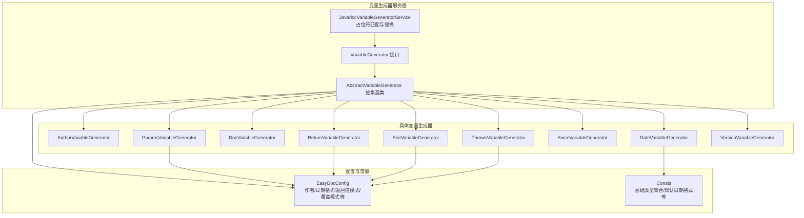
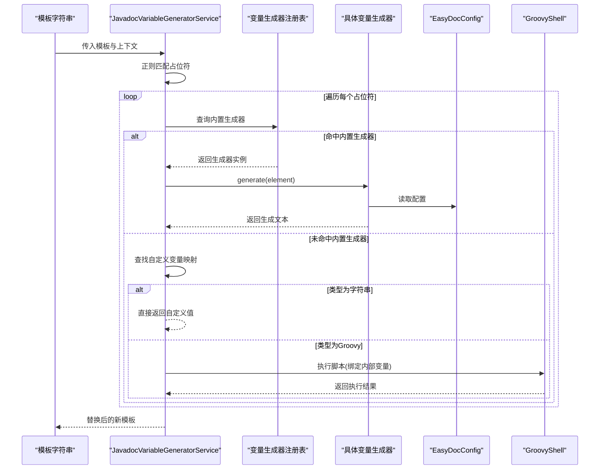
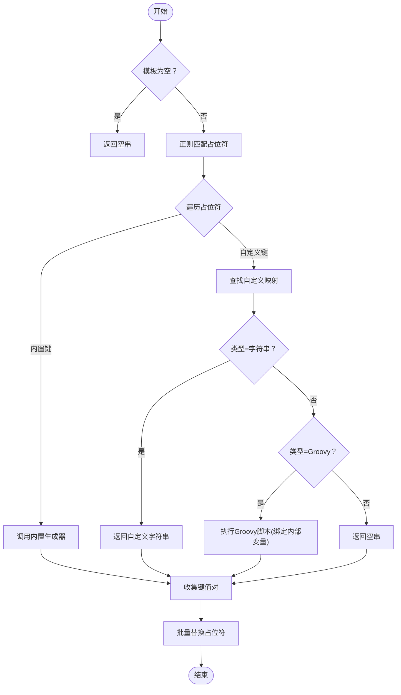
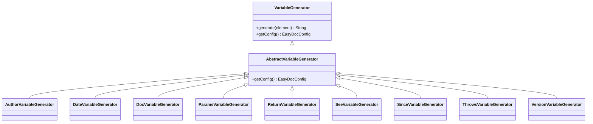
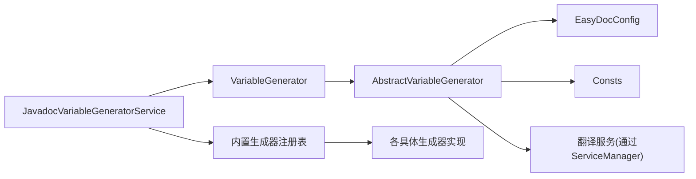

# 变量生成器系统

<cite>
**本文引用的文件**
- [JavadocVariableGeneratorService.java](file://src/main/java/com/star/easydoc/javadoc/service/variable/JavadocVariableGeneratorService.java)
- [VariableGenerator.java](file://src/main/java/com/star/easydoc/javadoc/service/variable/VariableGenerator.java)
- [AbstractVariableGenerator.java](file://src/main/java/com/star/easydoc/javadoc/service/variable/impl/AbstractVariableGenerator.java)
- [AuthorVariableGenerator.java](file://src/main/java/com/star/easydoc/javadoc/service/variable/impl/AuthorVariableGenerator.java)
- [DateVariableGenerator.java](file://src/main/java/com/star/easydoc/javadoc/service/variable/impl/DateVariableGenerator.java)
- [DocVariableGenerator.java](file://src/main/java/com/star/easydoc/javadoc/service/variable/impl/DocVariableGenerator.java)
- [ParamsVariableGenerator.java](file://src/main/java/com/star/easydoc/javadoc/service/variable/impl/ParamsVariableGenerator.java)
- [ReturnVariableGenerator.java](file://src/main/java/com/star/easydoc/javadoc/service/variable/impl/ReturnVariableGenerator.java)
- [SeeVariableGenerator.java](file://src/main/java/com/star/easydoc/javadoc/service/variable/impl/SeeVariableGenerator.java)
- [SinceVariableGenerator.java](file://src/main/java/com/star/easydoc/javadoc/service/variable/impl/SinceVariableGenerator.java)
- [ThrowsVariableGenerator.java](file://src/main/java/com/star/easydoc/javadoc/service/variable/impl/ThrowsVariableGenerator.java)
- [VersionVariableGenerator.java](file://src/main/java/com/star/easydoc/javadoc/service/variable/impl/VersionVariableGenerator.java)
- [EasyDocConfig.java](file://src/main/java/com/star/easydoc/config/EasyDocConfig.java)
- [Consts.java](file://src/main/java/com/star/easydoc/common/Consts.java)
- [README.md](file://README.md)
</cite>

## 目录
1. [简介](#简介)
2. [项目结构](#项目结构)
3. [核心组件](#核心组件)
4. [架构总览](#架构总览)
5. [详细组件分析](#详细组件分析)
6. [依赖分析](#依赖分析)
7. [性能考虑](#性能考虑)
8. [故障排查指南](#故障排查指南)
9. [结论](#结论)
10. [附录](#附录)

## 简介
本文件面向 Easy Javadoc 插件的“变量生成器系统”，系统性阐述其核心架构与工作原理，重点包括：
- JavadocVariableGeneratorService 的服务模式设计与占位符解析流程
- 各类变量生成器（作者、日期、参数、返回值、异常、版本、since、see、doc 等）的实现机制与上下文获取策略
- 模板解析、内容格式化、翻译集成与自定义变量（含 Groovy 脚本）的扩展机制
- 如何基于现有框架扩展新的变量生成器与自定义变量

## 项目结构
变量生成器位于 JavaDoc 服务层的 variable 子模块，采用“接口 + 抽象基类 + 多实现”的分层设计，配合配置中心 EasyDocConfig 提供统一的运行时参数来源。

图表来源
- [JavadocVariableGeneratorService.java:35-127](file://src/main/java/com/star/easydoc/javadoc/service/variable/JavadocVariableGeneratorService.java#L35-L127)
- [VariableGenerator.java:12-27](file://src/main/java/com/star/easydoc/javadoc/service/variable/VariableGenerator.java#L12-L27)
- [AbstractVariableGenerator.java:14-19](file://src/main/java/com/star/easydoc/javadoc/service/variable/impl/AbstractVariableGenerator.java#L14-L19)
- [EasyDocConfig.java:410-424](file://src/main/java/com/star/easydoc/config/EasyDocConfig.java#L410-L424)
- [Consts.java:22-27](file://src/main/java/com/star/easydoc/common/Consts.java#L22-L27)

章节来源
- [JavadocVariableGeneratorService.java:35-127](file://src/main/java/com/star/easydoc/javadoc/service/variable/JavadocVariableGeneratorService.java#L35-L127)
- [VariableGenerator.java:12-27](file://src/main/java/com/star/easydoc/javadoc/service/variable/VariableGenerator.java#L12-L27)
- [AbstractVariableGenerator.java:14-19](file://src/main/java/com/star/easydoc/javadoc/service/variable/impl/AbstractVariableGenerator.java#L14-L19)
- [EasyDocConfig.java:410-424](file://src/main/java/com/star/easydoc/config/EasyDocConfig.java#L410-L424)
- [Consts.java:22-27](file://src/main/java/com/star/easydoc/common/Consts.java#L22-L27)

## 核心组件
- JavadocVariableGeneratorService：负责模板字符串中占位符的识别、变量生成器的调度、自定义变量（字符串/Groovy）的执行以及最终的占位符替换。
- VariableGenerator 接口：定义统一的 generate(element) 与 getConfig() 方法，约束所有变量生成器的行为。
- AbstractVariableGenerator：提供对 EasyDocConfig 的便捷访问，作为所有具体生成器的父类。
- 具体变量生成器：按需实现不同 Javadoc 标签的生成逻辑，如作者、日期、参数、返回值、异常、版本、since、see、doc 等。
- EasyDocConfig：集中管理作者、日期格式、返回值模式、覆盖模式、翻译器、超时等全局配置；同时提供模板配置与自定义变量映射。
- Consts：提供基础类型集合、默认日期格式等常量，辅助生成器进行类型判断与格式化。

章节来源
- [JavadocVariableGeneratorService.java:35-127](file://src/main/java/com/star/easydoc/javadoc/service/variable/JavadocVariableGeneratorService.java#L35-L127)
- [VariableGenerator.java:12-27](file://src/main/java/com/star/easydoc/javadoc/service/variable/VariableGenerator.java#L12-L27)
- [AbstractVariableGenerator.java:14-19](file://src/main/java/com/star/easydoc/javadoc/service/variable/impl/AbstractVariableGenerator.java#L14-L19)
- [EasyDocConfig.java:410-424](file://src/main/java/com/star/easydoc/config/EasyDocConfig.java#L410-L424)
- [Consts.java:22-27](file://src/main/java/com/star/easydoc/common/Consts.java#L22-L27)

## 架构总览
变量生成器系统以服务为中心，围绕模板字符串展开：先扫描占位符，再根据占位符键值选择内置生成器或自定义变量（字符串/Groovy），最后完成替换输出。

图表来源
- [JavadocVariableGeneratorService.java:60-92](file://src/main/java/com/star/easydoc/javadoc/service/variable/JavadocVariableGeneratorService.java#L60-L92)
- [JavadocVariableGeneratorService.java:102-125](file://src/main/java/com/star/easydoc/javadoc/service/variable/JavadocVariableGeneratorService.java#L102-L125)

章节来源
- [JavadocVariableGeneratorService.java:60-125](file://src/main/java/com/star/easydoc/javadoc/service/variable/JavadocVariableGeneratorService.java#L60-L125)

## 详细组件分析

### JavadocVariableGeneratorService（服务模式与占位符解析）
- 占位符匹配：使用正则匹配形如 “$key$” 的占位符，提取键值并转为小写查找对应生成器。
- 生成器调度：若键值存在于内置映射，则调用对应生成器；否则进入自定义变量处理。
- 自定义变量处理：
  - 字符串类型：直接返回自定义值。
  - Groovy 类型：通过 GroovyShell 与 Binding 执行脚本，绑定内部变量映射；异常时记录日志并回退为原始值。
- 替换输出：将所有占位符替换为生成结果，返回最终模板。

图表来源
- [JavadocVariableGeneratorService.java:60-92](file://src/main/java/com/star/easydoc/javadoc/service/variable/JavadocVariableGeneratorService.java#L60-L92)
- [JavadocVariableGeneratorService.java:102-125](file://src/main/java/com/star/easydoc/javadoc/service/variable/JavadocVariableGeneratorService.java#L102-L125)

章节来源
- [JavadocVariableGeneratorService.java:35-127](file://src/main/java/com/star/easydoc/javadoc/service/variable/JavadocVariableGeneratorService.java#L35-L127)

### VariableGenerator 接口与 AbstractVariableGenerator 抽象基类
- 接口职责：统一 generate(element) 与 getConfig()，保证生成器具备读取配置的能力。
- 抽象基类：通过 ServiceManager 获取 EasyDocConfig 组件状态，避免各生成器重复获取配置。

图表来源
- [VariableGenerator.java:12-27](file://src/main/java/com/star/easydoc/javadoc/service/variable/VariableGenerator.java#L12-L27)
- [AbstractVariableGenerator.java:14-19](file://src/main/java/com/star/easydoc/javadoc/service/variable/impl/AbstractVariableGenerator.java#L14-L19)
- [AuthorVariableGenerator.java:10-16](file://src/main/java/com/star/easydoc/javadoc/service/variable/impl/AuthorVariableGenerator.java#L10-L16)
- [DateVariableGenerator.java:15-27](file://src/main/java/com/star/easydoc/javadoc/service/variable/impl/DateVariableGenerator.java#L15-L27)
- [DocVariableGenerator.java:23-46](file://src/main/java/com/star/easydoc/javadoc/service/variable/impl/DocVariableGenerator.java#L23-L46)
- [ParamsVariableGenerator.java:27-116](file://src/main/java/com/star/easydoc/javadoc/service/variable/impl/ParamsVariableGenerator.java#L27-L116)
- [ReturnVariableGenerator.java:16-45](file://src/main/java/com/star/easydoc/javadoc/service/variable/impl/ReturnVariableGenerator.java#L16-L45)
- [SeeVariableGenerator.java:23-64](file://src/main/java/com/star/easydoc/javadoc/service/variable/impl/SeeVariableGenerator.java#L23-L64)
- [SinceVariableGenerator.java:11-17](file://src/main/java/com/star/easydoc/javadoc/service/variable/impl/SinceVariableGenerator.java#L11-L17)
- [ThrowsVariableGenerator.java:19-36](file://src/main/java/com/star/easydoc/javadoc/service/variable/impl/ThrowsVariableGenerator.java#L19-L36)
- [VersionVariableGenerator.java:11-18](file://src/main/java/com/star/easydoc/javadoc/service/variable/impl/VersionVariableGenerator.java#L11-L18)

章节来源
- [VariableGenerator.java:12-27](file://src/main/java/com/star/easydoc/javadoc/service/variable/VariableGenerator.java#L12-L27)
- [AbstractVariableGenerator.java:14-19](file://src/main/java/com/star/easydoc/javadoc/service/variable/impl/AbstractVariableGenerator.java#L14-L19)

### 作者（author）变量生成器
- 上下文：从 EasyDocConfig 读取作者信息。
- 行为：直接返回作者配置值。

章节来源
- [AuthorVariableGenerator.java:10-16](file://src/main/java/com/star/easydoc/javadoc/service/variable/impl/AuthorVariableGenerator.java#L10-L16)
- [EasyDocConfig.java:410-416](file://src/main/java/com/star/easydoc/config/EasyDocConfig.java#L410-L416)

### 日期（date）变量生成器
- 上下文：从 EasyDocConfig 读取日期格式。
- 行为：使用当前时间与配置格式进行格式化；格式化异常时回退到默认格式。

章节来源
- [DateVariableGenerator.java:15-27](file://src/main/java/com/star/easydoc/javadoc/service/variable/impl/DateVariableGenerator.java#L15-L27)
- [EasyDocConfig.java:418-424](file://src/main/java/com/star/easydoc/config/EasyDocConfig.java#L418-L424)
- [Consts.java:27](file://src/main/java/com/star/easydoc/common/Consts.java#L27)

### 文档（doc）变量生成器
- 上下文：基于 PSI 元素的文档注释与名称；结合翻译服务。
- 行为：
  - 若无文档注释或覆盖模式为“强制覆盖”，则对元素名称进行翻译；
  - 否则提取描述元素，拼接为段落形式，若为空则回退翻译。

章节来源
- [DocVariableGenerator.java:23-46](file://src/main/java/com/star/easydoc/javadoc/service/variable/impl/DocVariableGenerator.java#L23-L46)
- [EasyDocConfig.java:648-654](file://src/main/java/com/star/easydoc/config/EasyDocConfig.java#L648-L654)

### 参数（params）变量生成器
- 上下文：方法参数列表与现有 @param 注释。
- 行为：
  - 遍历参数名，若无注释或覆盖模式为“强制覆盖”，则对参数名进行翻译；
  - 否则保留已有注释；
  - 输出为多行 @param 列表，首行与后续行格式略有差异。

章节来源
- [ParamsVariableGenerator.java:27-116](file://src/main/java/com/star/easydoc/javadoc/service/variable/impl/ParamsVariableGenerator.java#L27-L116)
- [EasyDocConfig.java:648-654](file://src/main/java/com/star/easydoc/config/EasyDocConfig.java#L648-L654)

### 返回值（return）变量生成器
- 上下文：方法返回类型与配置的返回值模式。
- 行为：
  - 基础类型：直接返回 “@return 基础类型”；
  - void：返回空串；
  - 其他类型：根据配置选择 code/link/doc 模式，分别生成 {@code ...}、{@link ...} 或带链接的文档形式。

章节来源
- [ReturnVariableGenerator.java:16-45](file://src/main/java/com/star/easydoc/javadoc/service/variable/impl/ReturnVariableGenerator.java#L16-L45)
- [EasyDocConfig.java:553-574](file://src/main/java/com/star/easydoc/config/EasyDocConfig.java#L553-L574)

### 异常（throws）变量生成器
- 上下文：方法 throws 列表与翻译服务。
- 行为：遍历异常类型，生成每行 “@throws 异常名 翻译说明”。

章节来源
- [ThrowsVariableGenerator.java:19-36](file://src/main/java/com/star/easydoc/javadoc/service/variable/impl/ThrowsVariableGenerator.java#L19-L36)

### 版本（version）与 since 变量生成器
- 上下文：无外部上下文依赖。
- 行为：均返回固定版本号字符串。

章节来源
- [VersionVariableGenerator.java:11-18](file://src/main/java/com/star/easydoc/javadoc/service/variable/impl/VersionVariableGenerator.java#L11-L18)
- [SinceVariableGenerator.java:11-17](file://src/main/java/com/star/easydoc/javadoc/service/variable/impl/SinceVariableGenerator.java#L11-L17)

### 参见（see）变量生成器
- 上下文：类的父类与接口、方法的参数类型与返回类型、字段类型。
- 行为：
  - 类：输出继承链上的父类与接口；
  - 方法：输出每个参数类型与返回类型的 see；
  - 字段：排除基础类型后输出 see。

章节来源
- [SeeVariableGenerator.java:23-64](file://src/main/java/com/star/easydoc/javadoc/service/variable/impl/SeeVariableGenerator.java#L23-L64)
- [Consts.java:22-23](file://src/main/java/com/star/easydoc/common/Consts.java#L22-L23)

### 模板与自定义变量扩展机制
- 模板占位符：形如 “$key$”，其中 key 不区分大小写。
- 自定义变量映射：存储于模板配置的自定义映射中，支持字符串与 Groovy 两种类型。
- Groovy 执行：通过 GroovyShell 与 Binding 执行脚本，可访问内部变量映射；异常时记录日志并回退。

章节来源
- [JavadocVariableGeneratorService.java:37-52](file://src/main/java/com/star/easydoc/javadoc/service/variable/JavadocVariableGeneratorService.java#L37-L52)
- [JavadocVariableGeneratorService.java:102-125](file://src/main/java/com/star/easydoc/javadoc/service/variable/JavadocVariableGeneratorService.java#L102-L125)
- [EasyDocConfig.java:259-292](file://src/main/java/com/star/easydoc/config/EasyDocConfig.java#L259-L292)

## 依赖分析
- 生成器对 EasyDocConfig 的依赖：通过抽象基类统一获取配置，降低耦合。
- 生成器对 PSI 的依赖：基于 IntelliJ PSI 元素解析上下文（方法签名、文档注释、类型等）。
- 生成器对翻译服务的依赖：参数、返回值、异常、doc 等场景使用翻译服务提升可读性。
- 常量依赖：基础类型集合与默认日期格式用于类型判断与格式化回退。

图表来源
- [JavadocVariableGeneratorService.java:37-52](file://src/main/java/com/star/easydoc/javadoc/service/variable/JavadocVariableGeneratorService.java#L37-L52)
- [AbstractVariableGenerator.java:14-19](file://src/main/java/com/star/easydoc/javadoc/service/variable/impl/AbstractVariableGenerator.java#L14-L19)
- [EasyDocConfig.java:410-424](file://src/main/java/com/star/easydoc/config/EasyDocConfig.java#L410-L424)
- [Consts.java:22-27](file://src/main/java/com/star/easydoc/common/Consts.java#L22-L27)

章节来源
- [JavadocVariableGeneratorService.java:37-52](file://src/main/java/com/star/easydoc/javadoc/service/variable/JavadocVariableGeneratorService.java#L37-L52)
- [AbstractVariableGenerator.java:14-19](file://src/main/java/com/star/easydoc/javadoc/service/variable/impl/AbstractVariableGenerator.java#L14-L19)
- [EasyDocConfig.java:410-424](file://src/main/java/com/star/easydoc/config/EasyDocConfig.java#L410-L424)
- [Consts.java:22-27](file://src/main/java/com/star/easydoc/common/Consts.java#L22-L27)

## 性能考虑
- 正则匹配与批量替换：占位符扫描与替换为 O(n) 操作，建议控制模板长度与占位符数量。
- Groovy 脚本执行：每次执行脚本存在开销，应避免复杂逻辑与频繁调用；必要时缓存中间结果。
- 翻译服务：参数、返回值、异常等生成可能触发翻译，建议合理设置超时与重试策略。
- 配置读取：通过 ServiceManager 获取配置，避免重复初始化；保持配置对象不可变或受控更新。

## 故障排查指南
- 占位符未被替换
  - 检查模板是否包含正确的 “$key$” 形式；
  - 确认 key 是否存在于内置生成器映射或自定义映射中。
- Groovy 脚本执行失败
  - 查看日志中关于脚本执行错误的信息；
  - 检查脚本语法与返回值类型，确保可转换为字符串。
- 日期格式化异常
  - 检查 EasyDocConfig 中的日期格式配置；
  - 系统会回退到默认格式，确认默认格式是否符合预期。
- 返回值模式不生效
  - 检查 EasyDocConfig 中的返回值模式配置；
  - 确认方法返回类型是否为基础类型或 void。
- 文档注释覆盖模式
  - 根据覆盖模式决定是否覆盖已有注释；
  - 在“强制覆盖”模式下，doc 与 params 将优先使用翻译结果。

章节来源
- [JavadocVariableGeneratorService.java:115-121](file://src/main/java/com/star/easydoc/javadoc/service/variable/JavadocVariableGeneratorService.java#L115-L121)
- [DateVariableGenerator.java:20-26](file://src/main/java/com/star/easydoc/javadoc/service/variable/impl/DateVariableGenerator.java#L20-L26)
- [EasyDocConfig.java:553-574](file://src/main/java/com/star/easydoc/config/EasyDocConfig.java#L553-L574)
- [EasyDocConfig.java:648-654](file://src/main/java/com/star/easydoc/config/EasyDocConfig.java#L648-L654)

## 结论
变量生成器系统以服务为核心，通过统一接口与抽象基类实现高内聚、低耦合的设计；借助 EasyDocConfig 提供灵活的配置能力，并与翻译服务、PSI 解析、Groovy 脚本执行等能力协同，形成可扩展、可定制的注释生成体系。开发者可基于现有框架快速扩展新的变量生成器与自定义变量，满足多样化的注释生成需求。

## 附录
- 配置项参考（节选）
  - 作者与日期格式：用于 author 与 date 生成器
  - 返回值模式：用于 return 生成器的 code/link/doc 三种模式
  - 覆盖模式：用于 doc 与 params 生成器的注释覆盖策略
  - 翻译器与超时：影响 doc、params、return、throws 等生成器的翻译行为

章节来源
- [EasyDocConfig.java:410-424](file://src/main/java/com/star/easydoc/config/EasyDocConfig.java#L410-L424)
- [EasyDocConfig.java:553-574](file://src/main/java/com/star/easydoc/config/EasyDocConfig.java#L553-L574)
- [EasyDocConfig.java:648-654](file://src/main/java/com/star/easydoc/config/EasyDocConfig.java#L648-L654)
- [README.md:39-41](file://README.md#L39-L41)