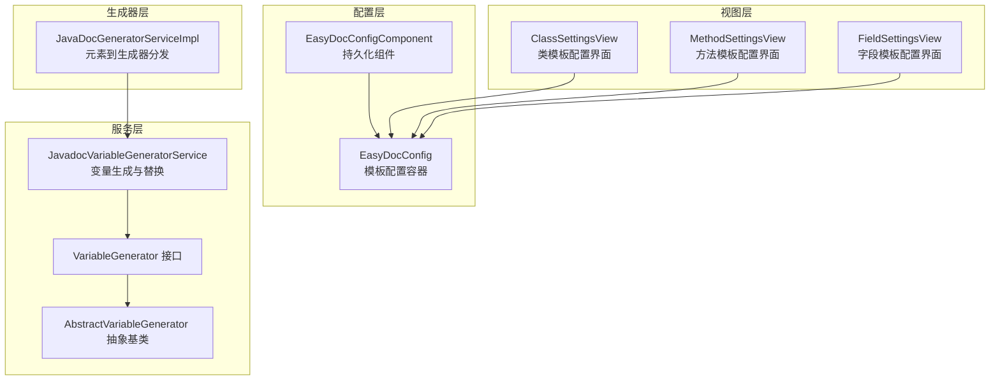
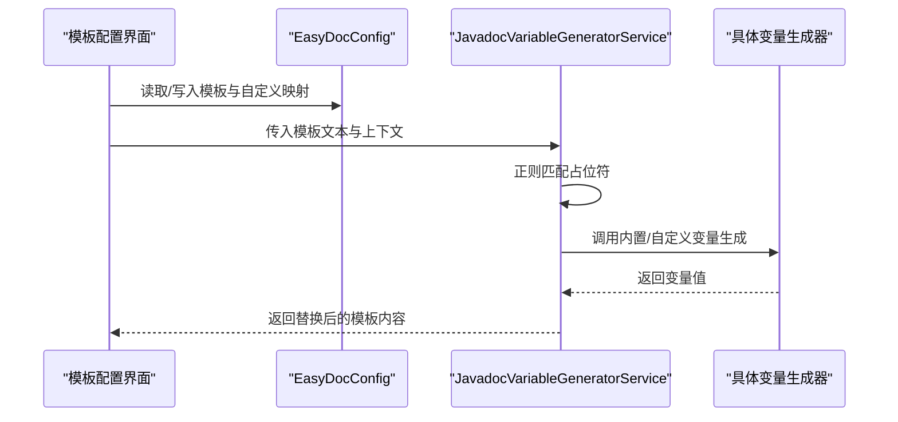
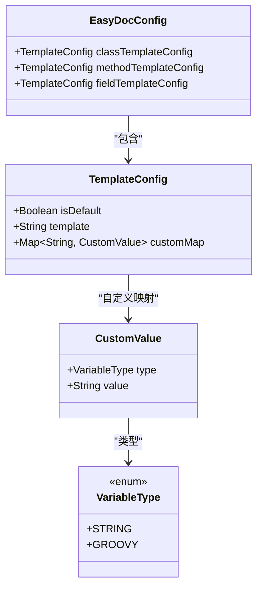
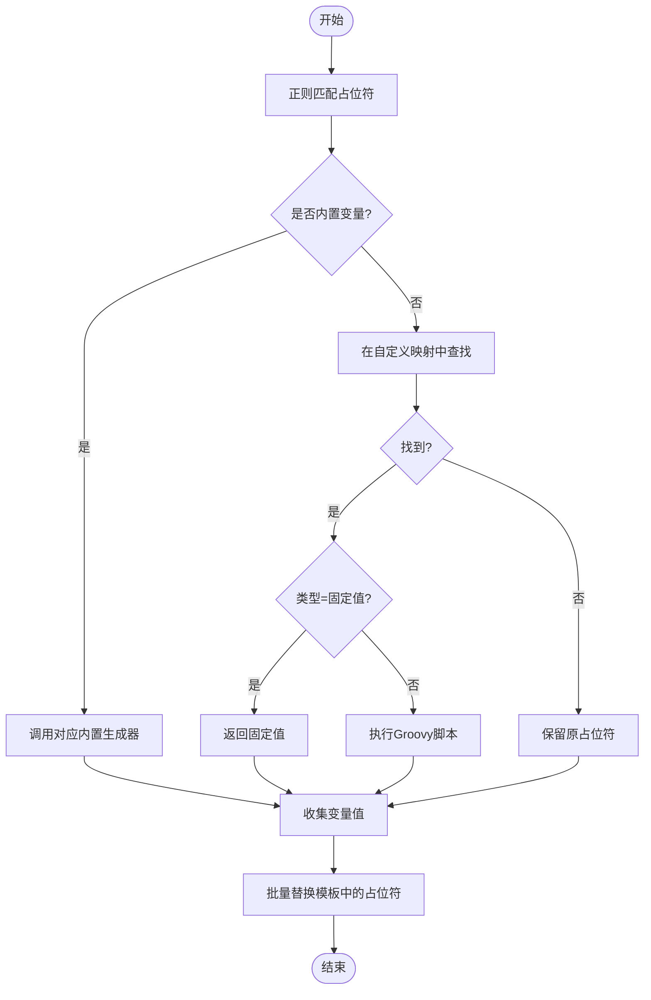
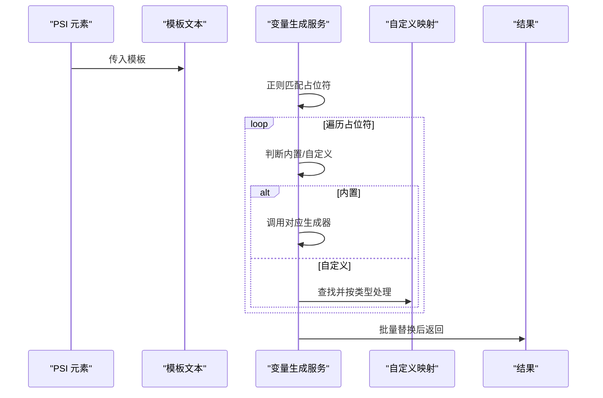
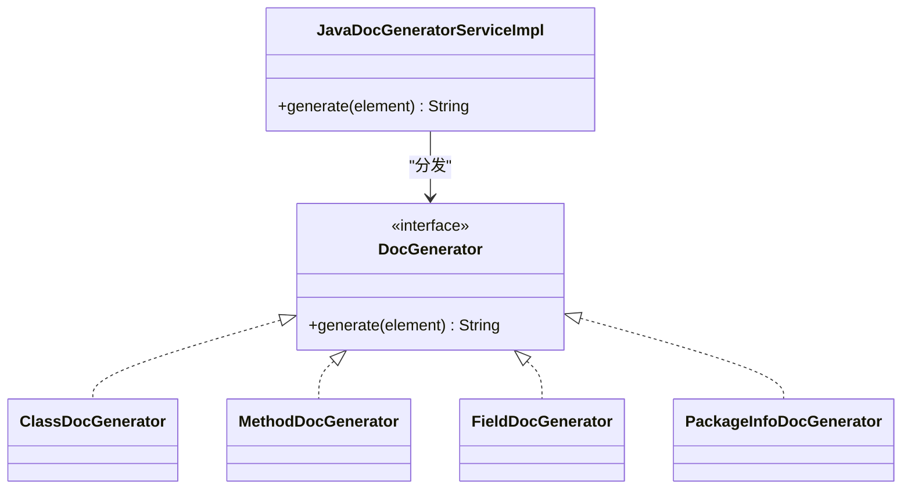
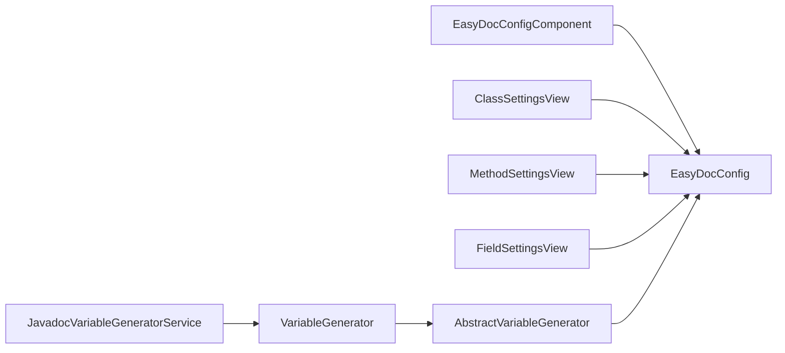

# 模板系统

<cite>
**本文引用的文件**
- [EasyDocConfig.java](file://src/main/java/com/star/easydoc/config/EasyDocConfig.java)
- [EasyDocConfigComponent.java](file://src/main/java/com/star/easydoc/config/EasyDocConfigComponent.java)
- [JavadocVariableGeneratorService.java](file://src/main/java/com/star/easydoc/javadoc/service/variable/JavadocVariableGeneratorService.java)
- [VariableGenerator.java](file://src/main/java/com/star/easydoc/javadoc/service/variable/VariableGenerator.java)
- [AbstractVariableGenerator.java](file://src/main/java/com/star/easydoc/javadoc/service/variable/impl/AbstractVariableGenerator.java)
- [AuthorVariableGenerator.java](file://src/main/java/com/star/easydoc/javadoc/service/variable/impl/AuthorVariableGenerator.java)
- [DateVariableGenerator.java](file://src/main/java/com/star/easydoc/javadoc/service/variable/impl/DateVariableGenerator.java)
- [ParamsVariableGenerator.java](file://src/main/java/com/star/easydoc/javadoc/service/variable/impl/ParamsVariableGenerator.java)
- [ReturnVariableGenerator.java](file://src/main/java/com/star/easydoc/javadoc/service/variable/impl/ReturnVariableGenerator.java)
- [ClassSettingsView.java](file://src/main/java/com/star/easydoc/view/settings/javadoc/template/ClassSettingsView.java)
- [MethodSettingsView.java](file://src/main/java/com/star/easydoc/view/settings/javadoc/template/MethodSettingsView.java)
- [FieldSettingsView.java](file://src/main/java/com/star/easydoc/view/settings/javadoc/template/FieldSettingsView.java)
- [JavaDocGeneratorServiceImpl.java](file://src/main/java/com/star/easydoc/javadoc/service/JavaDocGeneratorServiceImpl.java)
</cite>

## 目录
1. [简介](#简介)
2. [项目结构](#项目结构)
3. [核心组件](#核心组件)
4. [架构总览](#架构总览)
5. [详细组件分析](#详细组件分析)
6. [依赖分析](#依赖分析)
7. [性能考虑](#性能考虑)
8. [故障排查指南](#故障排查指南)
9. [结论](#结论)
10. [附录](#附录)

## 简介
本章节面向 Easy Javadoc 插件的“模板系统”，系统性阐述模板配置管理机制（默认模板与自定义模板）、变量生成器的工作原理（作者、日期、参数、返回值、异常等）、模板渲染流程与变量替换算法，并提供配置示例与最佳实践，帮助用户按项目需求定制个性化注释模板。

## 项目结构
模板系统围绕以下层次组织：
- 配置层：持久化模板配置与全局参数（作者、日期格式、返回值风格等）
- 视图层：模板配置界面（类/方法/字段），支持默认模板与自定义模板
- 服务层：变量生成器服务，负责解析模板中的占位符并进行替换
- 生成器层：针对不同 PSI 元素（类、方法、字段、包）的文档生成器

图表来源
- [EasyDocConfig.java:146-254](file://src/main/java/com/star/easydoc/config/EasyDocConfig.java#L146-L254)
- [EasyDocConfigComponent.java:19-68](file://src/main/java/com/star/easydoc/config/EasyDocConfigComponent.java#L19-L68)
- [ClassSettingsView.java:24-179](file://src/main/java/com/star/easydoc/view/settings/javadoc/template/ClassSettingsView.java#L24-L179)
- [MethodSettingsView.java:24-179](file://src/main/java/com/star/easydoc/view/settings/javadoc/template/MethodSettingsView.java#L24-L179)
- [FieldSettingsView.java:24-176](file://src/main/java/com/star/easydoc/view/settings/javadoc/template/FieldSettingsView.java#L24-L176)
- [JavadocVariableGeneratorService.java:35-127](file://src/main/java/com/star/easydoc/javadoc/service/variable/JavadocVariableGeneratorService.java#L35-L127)
- [VariableGenerator.java:12-27](file://src/main/java/com/star/easydoc/javadoc/service/variable/VariableGenerator.java#L12-L27)
- [AbstractVariableGenerator.java:14-20](file://src/main/java/com/star/easydoc/javadoc/service/variable/impl/AbstractVariableGenerator.java#L14-L20)
- [JavaDocGeneratorServiceImpl.java:25-49](file://src/main/java/com/star/easydoc/javadoc/service/JavaDocGeneratorServiceImpl.java#L25-L49)

章节来源
- [EasyDocConfig.java:146-254](file://src/main/java/com/star/easydoc/config/EasyDocConfig.java#L146-L254)
- [EasyDocConfigComponent.java:19-68](file://src/main/java/com/star/easydoc/config/EasyDocConfigComponent.java#L19-L68)
- [ClassSettingsView.java:24-179](file://src/main/java/com/star/easydoc/view/settings/javadoc/template/ClassSettingsView.java#L24-L179)
- [MethodSettingsView.java:24-179](file://src/main/java/com/star/easydoc/view/settings/javadoc/template/MethodSettingsView.java#L24-L179)
- [FieldSettingsView.java:24-176](file://src/main/java/com/star/easydoc/view/settings/javadoc/template/FieldSettingsView.java#L24-L176)
- [JavadocVariableGeneratorService.java:35-127](file://src/main/java/com/star/easydoc/javadoc/service/variable/JavadocVariableGeneratorService.java#L35-L127)
- [VariableGenerator.java:12-27](file://src/main/java/com/star/easydoc/javadoc/service/variable/VariableGenerator.java#L12-L27)
- [AbstractVariableGenerator.java:14-20](file://src/main/java/com/star/easydoc/javadoc/service/variable/impl/AbstractVariableGenerator.java#L14-L20)
- [JavaDocGeneratorServiceImpl.java:25-49](file://src/main/java/com/star/easydoc/javadoc/service/JavaDocGeneratorServiceImpl.java#L25-L49)

## 核心组件
- 模板配置容器：包含类/方法/字段三类模板配置，每类包含“是否默认”、“模板文本”、“自定义映射”
- 变量生成器服务：统一解析模板中的占位符，调用内置或自定义变量生成器进行替换
- 内置变量生成器：作者、日期、参数列表、返回值、异常、见、版本、文档摘要等
- 模板配置视图：类/方法/字段分别提供默认/自定义切换、内置变量说明、自定义变量增删改查
- 文档生成器服务：根据 PSI 元素类型分发到对应生成器，再由模板与变量生成器共同输出注释

章节来源
- [EasyDocConfig.java:146-254](file://src/main/java/com/star/easydoc/config/EasyDocConfig.java#L146-L254)
- [JavadocVariableGeneratorService.java:35-127](file://src/main/java/com/star/easydoc/javadoc/service/variable/JavadocVariableGeneratorService.java#L35-L127)
- [VariableGenerator.java:12-27](file://src/main/java/com/star/easydoc/javadoc/service/variable/VariableGenerator.java#L12-L27)
- [AbstractVariableGenerator.java:14-20](file://src/main/java/com/star/easydoc/javadoc/service/variable/impl/AbstractVariableGenerator.java#L14-L20)
- [ClassSettingsView.java:24-179](file://src/main/java/com/star/easydoc/view/settings/javadoc/template/ClassSettingsView.java#L24-L179)
- [MethodSettingsView.java:24-179](file://src/main/java/com/star/easydoc/view/settings/javadoc/template/MethodSettingsView.java#L24-L179)
- [FieldSettingsView.java:24-176](file://src/main/java/com/star/easydoc/view/settings/javadoc/template/FieldSettingsView.java#L24-L176)
- [JavaDocGeneratorServiceImpl.java:25-49](file://src/main/java/com/star/easydoc/javadoc/service/JavaDocGeneratorServiceImpl.java#L25-L49)

## 架构总览
模板系统采用“配置驱动 + 变量生成 + 渲染替换”的三层架构：
- 配置驱动：通过 EasyDocConfig 的 TemplateConfig 管理模板与自定义映射
- 变量生成：JavadocVariableGeneratorService 统一扫描模板占位符，调用内置或自定义变量生成器
- 渲染替换：将匹配到的占位符批量替换为生成结果

图表来源
- [EasyDocConfig.java:146-254](file://src/main/java/com/star/easydoc/config/EasyDocConfig.java#L146-L254)
- [JavadocVariableGeneratorService.java:60-92](file://src/main/java/com/star/easydoc/javadoc/service/variable/JavadocVariableGeneratorService.java#L60-L92)
- [VariableGenerator.java:12-27](file://src/main/java/com/star/easydoc/javadoc/service/variable/VariableGenerator.java#L12-L27)

## 详细组件分析

### 模板配置管理机制
- 默认模板与自定义模板
  - 每个元素类型（类/方法/字段）维护独立的 TemplateConfig
  - TemplateConfig 提供 isDefault 标记、template 文本、customMap 自定义映射
  - 视图层提供“默认/自定义”单选切换，自定义模式下可编辑模板与增删自定义变量
- 自定义变量映射
  - 支持两种类型：固定字符串、Groovy 脚本
  - Groovy 脚本可通过绑定上下文变量执行，便于复杂逻辑
- 全局参数
  - 作者、日期格式、方法返回值风格、字段注释风格等影响变量生成结果

图表来源
- [EasyDocConfig.java:146-254](file://src/main/java/com/star/easydoc/config/EasyDocConfig.java#L146-L254)
- [EasyDocConfig.java:259-325](file://src/main/java/com/star/easydoc/config/EasyDocConfig.java#L259-L325)

章节来源
- [EasyDocConfig.java:146-254](file://src/main/java/com/star/easydoc/config/EasyDocConfig.java#L146-L254)
- [EasyDocConfig.java:259-325](file://src/main/java/com/star/easydoc/config/EasyDocConfig.java#L259-L325)
- [ClassSettingsView.java:24-179](file://src/main/java/com/star/easydoc/view/settings/javadoc/template/ClassSettingsView.java#L24-L179)
- [MethodSettingsView.java:24-179](file://src/main/java/com/star/easydoc/view/settings/javadoc/template/MethodSettingsView.java#L24-L179)
- [FieldSettingsView.java:24-176](file://src/main/java/com/star/easydoc/view/settings/javadoc/template/FieldSettingsView.java#L24-L176)

### 变量生成器工作原理
- 占位符识别与分派
  - 使用正则匹配形如 $xxx$ 的占位符
  - 若为内置变量键（author/date/doc/params/return/see/since/throws/version），委托对应生成器
  - 否则视为自定义变量，从 TemplateConfig.customMap 查找
- 自定义变量生成
  - 固定值：直接返回
  - Groovy：通过 GroovyShell 以绑定上下文变量执行，捕获语法错误并回退
- 上下文与配置
  - 所有生成器通过抽象基类访问全局配置（作者、日期格式、返回值风格等）

图表来源
- [JavadocVariableGeneratorService.java:60-92](file://src/main/java/com/star/easydoc/javadoc/service/variable/JavadocVariableGeneratorService.java#L60-L92)
- [JavadocVariableGeneratorService.java:102-125](file://src/main/java/com/star/easydoc/javadoc/service/variable/JavadocVariableGeneratorService.java#L102-L125)

章节来源
- [JavadocVariableGeneratorService.java:35-127](file://src/main/java/com/star/easydoc/javadoc/service/variable/JavadocVariableGeneratorService.java#L35-L127)
- [AbstractVariableGenerator.java:14-20](file://src/main/java/com/star/easydoc/javadoc/service/variable/impl/AbstractVariableGenerator.java#L14-L20)
- [AuthorVariableGenerator.java:10-17](file://src/main/java/com/star/easydoc/javadoc/service/variable/impl/AuthorVariableGenerator.java#L10-L17)
- [DateVariableGenerator.java:15-28](file://src/main/java/com/star/easydoc/javadoc/service/variable/impl/DateVariableGenerator.java#L15-L28)
- [ParamsVariableGenerator.java:27-83](file://src/main/java/com/star/easydoc/javadoc/service/variable/impl/ParamsVariableGenerator.java#L27-L83)
- [ReturnVariableGenerator.java:16-46](file://src/main/java/com/star/easydoc/javadoc/service/variable/impl/ReturnVariableGenerator.java#L16-L46)

### 模板渲染流程与变量替换算法
- 输入：模板文本、PSI 元素、自定义映射、内部变量上下文
- 步骤：
  1) 正则扫描模板，提取所有占位符集合
  2) 对每个占位符：
     - 若为内置变量键，调用对应生成器
     - 否则在自定义映射中查找，按类型处理
  3) 将占位符与其生成值组成键值对列表
  4) 使用一次性批量替换算法完成最终输出

图表来源
- [JavadocVariableGeneratorService.java:60-92](file://src/main/java/com/star/easydoc/javadoc/service/variable/JavadocVariableGeneratorService.java#L60-L92)

章节来源
- [JavadocVariableGeneratorService.java:60-92](file://src/main/java/com/star/easydoc/javadoc/service/variable/JavadocVariableGeneratorService.java#L60-L92)

### 模板系统与生成器的集成
- JavaDocGeneratorServiceImpl 根据 PSI 元素类型选择对应 DocGenerator
- DocGenerator 在生成过程中使用模板与变量生成服务，最终输出注释

图表来源
- [JavaDocGeneratorServiceImpl.java:25-49](file://src/main/java/com/star/easydoc/javadoc/service/JavaDocGeneratorServiceImpl.java#L25-L49)

章节来源
- [JavaDocGeneratorServiceImpl.java:25-49](file://src/main/java/com/star/easydoc/javadoc/service/JavaDocGeneratorServiceImpl.java#L25-L49)

## 依赖分析
- 配置持久化
  - EasyDocConfigComponent 负责初始化与加载 EasyDocConfig
  - EasyDocConfig 提供模板配置与全局参数
- 变量生成器依赖
  - 所有内置变量生成器继承抽象基类，统一从配置组件读取全局配置
  - JavadocVariableGeneratorService 维护内置变量生成器映射
- 视图层依赖
  - ClassSettingsView/MethodSettingsView/FieldSettingsView 读取并写入对应 TemplateConfig
  - 支持自定义变量的增删改查与界面交互

图表来源
- [EasyDocConfigComponent.java:19-68](file://src/main/java/com/star/easydoc/config/EasyDocConfigComponent.java#L19-L68)
- [EasyDocConfig.java:146-254](file://src/main/java/com/star/easydoc/config/EasyDocConfig.java#L146-L254)
- [ClassSettingsView.java:24-179](file://src/main/java/com/star/easydoc/view/settings/javadoc/template/ClassSettingsView.java#L24-L179)
- [MethodSettingsView.java:24-179](file://src/main/java/com/star/easydoc/view/settings/javadoc/template/MethodSettingsView.java#L24-L179)
- [FieldSettingsView.java:24-176](file://src/main/java/com/star/easydoc/view/settings/javadoc/template/FieldSettingsView.java#L24-L176)
- [JavadocVariableGeneratorService.java:35-52](file://src/main/java/com/star/easydoc/javadoc/service/variable/JavadocVariableGeneratorService.java#L35-L52)
- [AbstractVariableGenerator.java:14-20](file://src/main/java/com/star/easydoc/javadoc/service/variable/impl/AbstractVariableGenerator.java#L14-L20)

章节来源
- [EasyDocConfigComponent.java:19-68](file://src/main/java/com/star/easydoc/config/EasyDocConfigComponent.java#L19-L68)
- [EasyDocConfig.java:146-254](file://src/main/java/com/star/easydoc/config/EasyDocConfig.java#L146-L254)
- [JavadocVariableGeneratorService.java:35-52](file://src/main/java/com/star/easydoc/javadoc/service/variable/JavadocVariableGeneratorService.java#L35-L52)
- [AbstractVariableGenerator.java:14-20](file://src/main/java/com/star/easydoc/javadoc/service/variable/impl/AbstractVariableGenerator.java#L14-L20)

## 性能考虑
- 模板扫描与替换
  - 正则匹配与一次性批量替换的时间复杂度近似 O(n+m)，其中 n 为模板长度，m 为占位符数量
  - 建议控制模板复杂度与占位符数量，避免过长模板导致频繁替换
- 自定义变量执行
  - Groovy 脚本执行可能带来额外开销，建议保持脚本简洁，必要时缓存计算结果
- 配置读取
  - 所有生成器通过配置组件读取全局参数，避免重复构造，减少 IO 开销

## 故障排查指南
- 占位符未生效
  - 检查占位符是否符合 $xxx$ 格式且键名正确
  - 确认自定义变量映射中是否存在该键
- 自定义变量报错
  - Groovy 脚本语法错误会记录日志并回退为原始值，请检查脚本语法与返回值
- 日期格式异常
  - 修改全局日期格式后需重启或刷新界面，确保新格式生效
- 返回值样式不符合预期
  - 检查全局“方法返回值类型”配置，确认 code/link/doc 三种风格之一

章节来源
- [JavadocVariableGeneratorService.java:115-121](file://src/main/java/com/star/easydoc/javadoc/service/variable/JavadocVariableGeneratorService.java#L115-L121)
- [DateVariableGenerator.java:20-26](file://src/main/java/com/star/easydoc/javadoc/service/variable/impl/DateVariableGenerator.java#L20-L26)
- [ReturnVariableGenerator.java:36-44](file://src/main/java/com/star/easydoc/javadoc/service/variable/impl/ReturnVariableGenerator.java#L36-L44)

## 结论
模板系统通过“配置驱动 + 变量生成 + 渲染替换”的清晰分层，实现了灵活可扩展的注释模板能力。用户可通过视图层便捷地切换默认/自定义模板，并利用内置与自定义变量生成器满足多样化需求。建议在团队内统一模板风格与变量命名规范，结合 Groovy 脚本实现复杂场景，同时注意性能与可维护性。

## 附录

### 模板配置示例与最佳实践
- 默认模板
  - 适用于大多数项目，无需额外配置；若需微调，可在自定义模板中复用内置变量
- 自定义模板
  - 在类/方法/字段的设置界面勾选“自定义”，编辑模板文本
  - 使用内置变量占位符快速生成作者、日期、参数、返回值、异常等
  - 通过自定义变量表新增固定值或 Groovy 脚本，满足特殊业务逻辑
- 最佳实践
  - 保持模板简洁，避免过多嵌套与复杂表达式
  - 对于跨模块共享的变量，优先使用固定值而非 Groovy 脚本
  - 定期清理无效或重复的自定义变量，保证模板可维护性
  - 在团队内约定变量命名规范，提升协作效率

章节来源
- [ClassSettingsView.java:24-179](file://src/main/java/com/star/easydoc/view/settings/javadoc/template/ClassSettingsView.java#L24-L179)
- [MethodSettingsView.java:24-179](file://src/main/java/com/star/easydoc/view/settings/javadoc/template/MethodSettingsView.java#L24-L179)
- [FieldSettingsView.java:24-176](file://src/main/java/com/star/easydoc/view/settings/javadoc/template/FieldSettingsView.java#L24-L176)
- [JavadocVariableGeneratorService.java:102-125](file://src/main/java/com/star/easydoc/javadoc/service/variable/JavadocVariableGeneratorService.java#L102-L125)