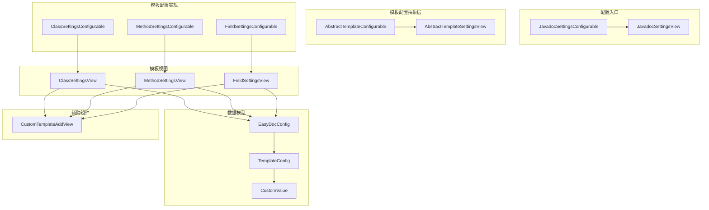
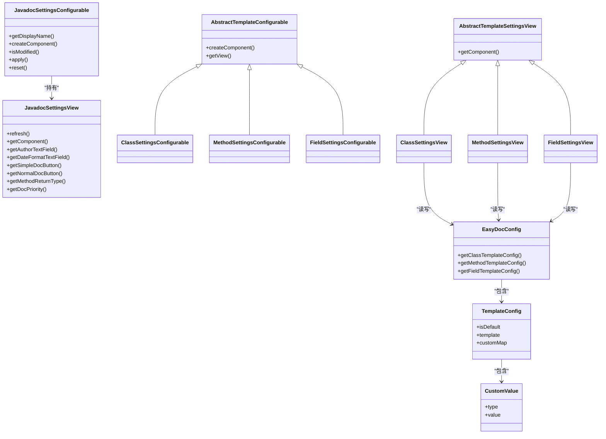
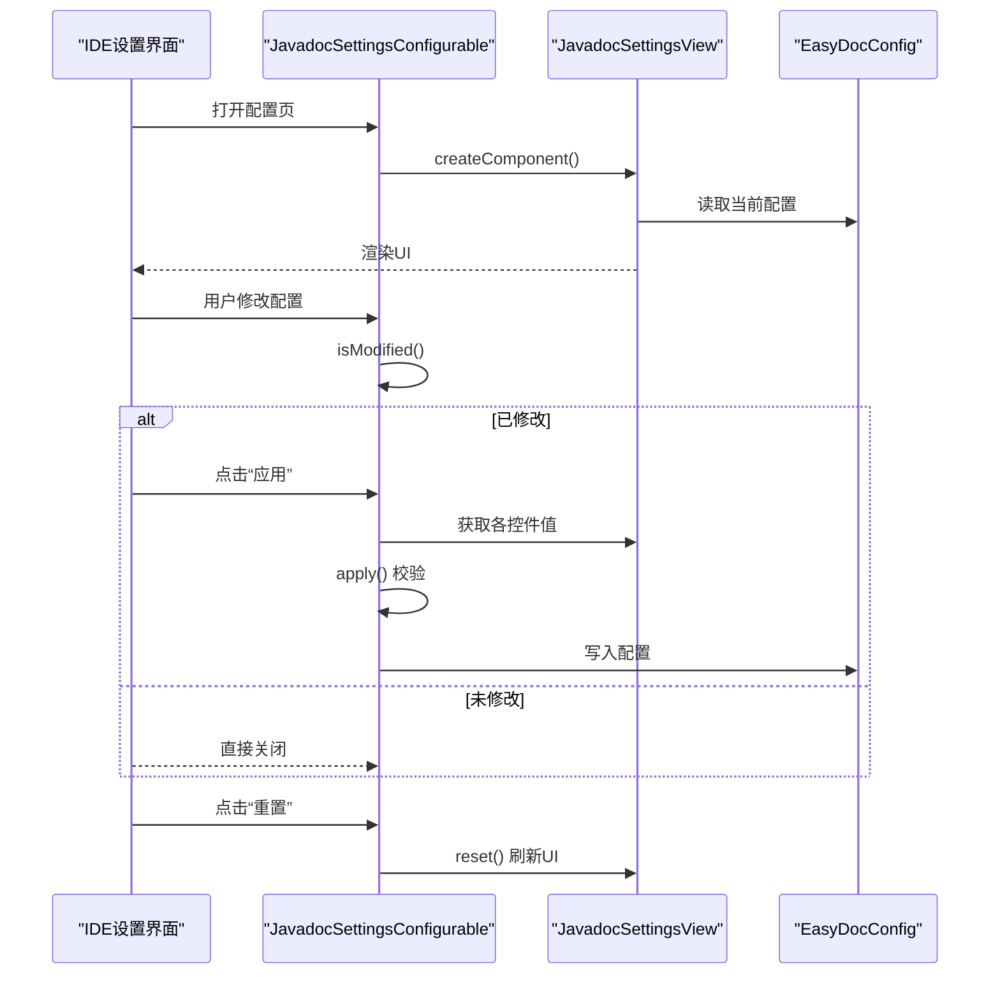
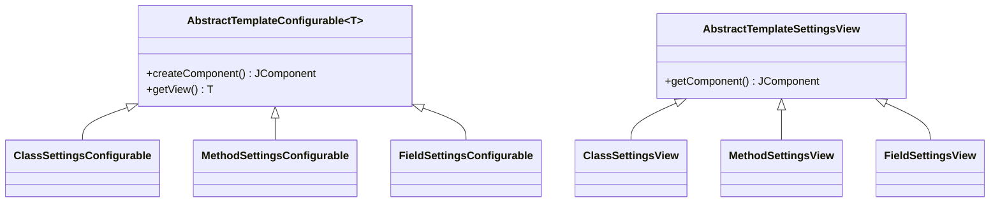
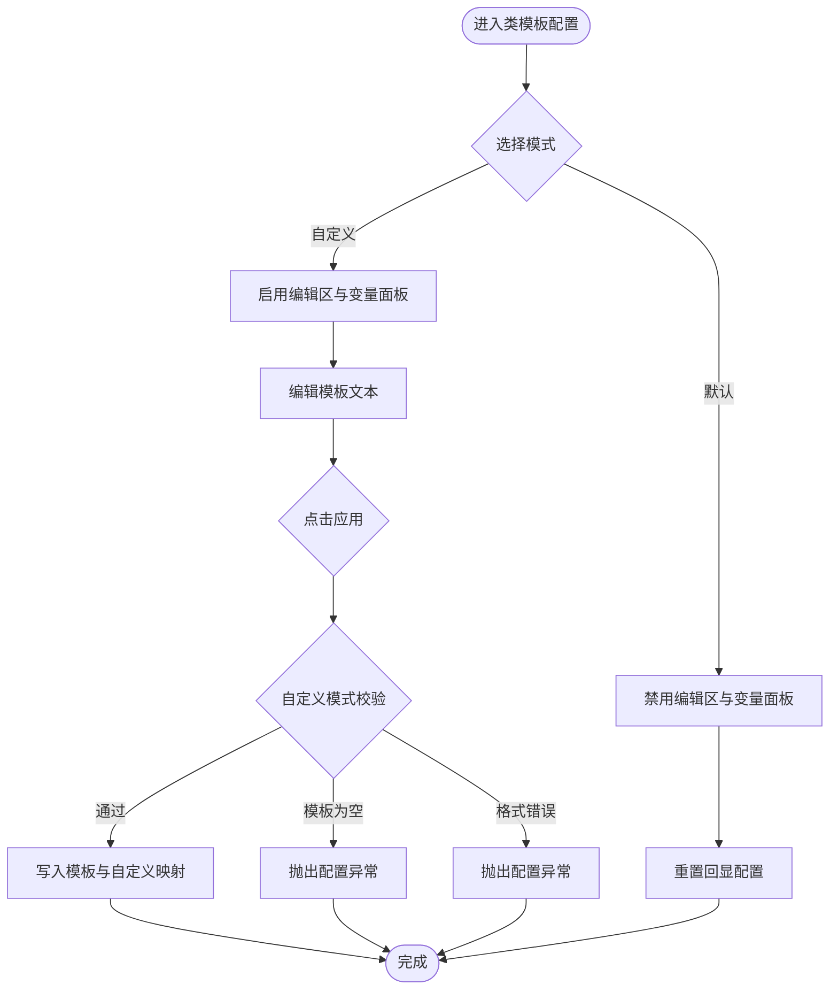
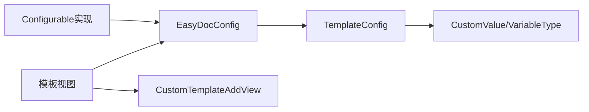

# 模板配置管理

<cite>
**本文档引用的文件**
- [JavadocSettingsConfigurable.java](file://src/main/java/com/star/easydoc/view/settings/javadoc/JavadocSettingsConfigurable.java)
- [JavadocSettingsView.java](file://src/main/java/com/star/easydoc/view/settings/javadoc/JavadocSettingsView.java)
- [JavadocSettingsView.form](file://src/main/java/com/star/easydoc/view/settings/javadoc/JavadocSettingsView.form)
- [AbstractTemplateConfigurable.java](file://src/main/java/com/star/easydoc/view/settings/javadoc/template/AbstractTemplateConfigurable.java)
- [AbstractTemplateSettingsView.java](file://src/main/java/com/star/easydoc/view/settings/javadoc/template/AbstractTemplateSettingsView.java)
- [ClassSettingsConfigurable.java](file://src/main/java/com/star/easydoc/view/settings/javadoc/template/ClassSettingsConfigurable.java)
- [ClassSettingsView.java](file://src/main/java/com/star/easydoc/view/settings/javadoc/template/ClassSettingsView.java)
- [ClassSettingsView.form](file://src/main/java/com/star/easydoc/view/settings/javadoc/template/ClassSettingsView.form)
- [MethodSettingsConfigurable.java](file://src/main/java/com/star/easydoc/view/settings/javadoc/template/MethodSettingsConfigurable.java)
- [MethodSettingsView.java](file://src/main/java/com/star/easydoc/view/settings/javadoc/template/MethodSettingsView.java)
- [MethodSettingsView.form](file://src/main/java/com/star/easydoc/view/settings/javadoc/template/MethodSettingsView.form)
- [FieldSettingsConfigurable.java](file://src/main/java/com/star/easydoc/view/settings/javadoc/template/FieldSettingsConfigurable.java)
- [FieldSettingsView.java](file://src/main/java/com/star/easydoc/view/settings/javadoc/template/FieldSettingsView.java)
- [FieldSettingsView.form](file://src/main/java/com/star/easydoc/view/settings/javadoc/template/FieldSettingsView.form)
- [CustomTemplateAddView.java](file://src/main/java/com/star/easydoc/view/inner/CustomTemplateAddView.java)
- [EasyDocConfig.java](file://src/main/java/com/star/easydoc/config/EasyDocConfig.java)
</cite>

## 目录
1. [简介](#简介)
2. [项目结构](#项目结构)
3. [核心组件](#核心组件)
4. [架构总览](#架构总览)
5. [详细组件分析](#详细组件分析)
6. [依赖分析](#依赖分析)
7. [性能考虑](#性能考虑)
8. [故障排查指南](#故障排查指南)
9. [结论](#结论)
10. [附录](#附录)

## 简介
本文件聚焦 Easy Javadoc 插件的“模板配置管理”能力，系统性阐述模板配置的整体架构与实现细节，重点包括：
- JavadocSettingsConfigurable 作为主配置入口的设计思路与职责边界
- 类模板、方法模板、字段模板的配置界面与参数设置
- 模板配置的数据绑定机制（验证规则、默认值、用户输入处理）
- 最佳实践与常见配置场景，帮助用户按项目需求灵活调整模板行为

## 项目结构
模板配置相关代码主要位于以下路径：
- 主配置入口与通用设置：view/settings/javadoc
- 模板配置抽象层与具体实现：view/settings/javadoc/template
- 配置数据模型：config/EasyDocConfig.java
- 自定义变量弹窗：view/inner/CustomTemplateAddView.java

图表来源
- [JavadocSettingsConfigurable.java:19-95](file://src/main/java/com/star/easydoc/view/settings/javadoc/JavadocSettingsConfigurable.java#L19-L95)
- [JavadocSettingsView.java:14-218](file://src/main/java/com/star/easydoc/view/settings/javadoc/JavadocSettingsView.java#L14-L218)
- [AbstractTemplateConfigurable.java:13-22](file://src/main/java/com/star/easydoc/view/settings/javadoc/template/AbstractTemplateConfigurable.java#L13-L22)
- [AbstractTemplateSettingsView.java:14-36](file://src/main/java/com/star/easydoc/view/settings/javadoc/template/AbstractTemplateSettingsView.java#L14-L36)
- [ClassSettingsConfigurable.java:20-77](file://src/main/java/com/star/easydoc/view/settings/javadoc/template/ClassSettingsConfigurable.java#L20-L77)
- [MethodSettingsConfigurable.java:20-76](file://src/main/java/com/star/easydoc/view/settings/javadoc/template/MethodSettingsConfigurable.java#L20-L76)
- [FieldSettingsConfigurable.java:20-76](file://src/main/java/com/star/easydoc/view/settings/javadoc/template/FieldSettingsConfigurable.java#L20-L76)
- [ClassSettingsView.java:24-179](file://src/main/java/com/star/easydoc/view/settings/javadoc/template/ClassSettingsView.java#L24-L179)
- [MethodSettingsView.java:24-178](file://src/main/java/com/star/easydoc/view/settings/javadoc/template/MethodSettingsView.java#L24-L178)
- [FieldSettingsView.java:24-175](file://src/main/java/com/star/easydoc/view/settings/javadoc/template/FieldSettingsView.java#L24-L175)
- [CustomTemplateAddView.java:19-58](file://src/main/java/com/star/easydoc/view/inner/CustomTemplateAddView.java#L19-L58)
- [EasyDocConfig.java:22-680](file://src/main/java/com/star/easydoc/config/EasyDocConfig.java#L22-L680)

章节来源
- [JavadocSettingsConfigurable.java:19-95](file://src/main/java/com/star/easydoc/view/settings/javadoc/JavadocSettingsConfigurable.java#L19-L95)
- [JavadocSettingsView.java:14-218](file://src/main/java/com/star/easydoc/view/settings/javadoc/JavadocSettingsView.java#L14-L218)
- [AbstractTemplateConfigurable.java:13-22](file://src/main/java/com/star/easydoc/view/settings/javadoc/template/AbstractTemplateConfigurable.java#L13-L22)
- [AbstractTemplateSettingsView.java:14-36](file://src/main/java/com/star/easydoc/view/settings/javadoc/template/AbstractTemplateSettingsView.java#L14-L36)
- [ClassSettingsConfigurable.java:20-77](file://src/main/java/com/star/easydoc/view/settings/javadoc/template/ClassSettingsConfigurable.java#L20-L77)
- [MethodSettingsConfigurable.java:20-76](file://src/main/java/com/star/easydoc/view/settings/javadoc/template/MethodSettingsConfigurable.java#L20-L76)
- [FieldSettingsConfigurable.java:20-76](file://src/main/java/com/star/easydoc/view/settings/javadoc/template/FieldSettingsConfigurable.java#L20-L76)
- [ClassSettingsView.java:24-179](file://src/main/java/com/star/easydoc/view/settings/javadoc/template/ClassSettingsView.java#L24-L179)
- [MethodSettingsView.java:24-178](file://src/main/java/com/star/easydoc/view/settings/javadoc/template/MethodSettingsView.java#L24-L178)
- [FieldSettingsView.java:24-175](file://src/main/java/com/star/easydoc/view/settings/javadoc/template/FieldSettingsView.java#L24-L175)
- [CustomTemplateAddView.java:19-58](file://src/main/java/com/star/easydoc/view/inner/CustomTemplateAddView.java#L19-L58)
- [EasyDocConfig.java:22-680](file://src/main/java/com/star/easydoc/config/EasyDocConfig.java#L22-L680)

## 核心组件
- 主配置入口（JavadocSettingsConfigurable）：负责通用配置（作者、日期格式、注释优先级、返回值样式、覆盖模式等）的读取、校验与应用；同时聚合模板配置页签。
- 模板配置抽象层（AbstractTemplateConfigurable、AbstractTemplateSettingsView）：统一模板配置页面的生命周期与视图绑定，降低重复代码。
- 模板配置实现（Class/Method/Field SettingsConfigurable）：分别对接类、方法、字段三类模板，实现 isModified、apply、reset 的差异化逻辑。
- 模板视图（Class/Method/Field SettingsView）：承载 UI 绑定、内置变量展示、自定义变量增删改查、默认/自定义切换。
- 数据模型（EasyDocConfig、TemplateConfig、CustomValue）：持久化模板配置、默认值初始化、变量类型枚举与序列化控制。

章节来源
- [JavadocSettingsConfigurable.java:19-95](file://src/main/java/com/star/easydoc/view/settings/javadoc/JavadocSettingsConfigurable.java#L19-L95)
- [AbstractTemplateConfigurable.java:13-22](file://src/main/java/com/star/easydoc/view/settings/javadoc/template/AbstractTemplateConfigurable.java#L13-L22)
- [AbstractTemplateSettingsView.java:14-36](file://src/main/java/com/star/easydoc/view/settings/javadoc/template/AbstractTemplateSettingsView.java#L14-L36)
- [ClassSettingsConfigurable.java:20-77](file://src/main/java/com/star/easydoc/view/settings/javadoc/template/ClassSettingsConfigurable.java#L20-L77)
- [MethodSettingsConfigurable.java:20-76](file://src/main/java/com/star/easydoc/view/settings/javadoc/template/MethodSettingsConfigurable.java#L20-L76)
- [FieldSettingsConfigurable.java:20-76](file://src/main/java/com/star/easydoc/view/settings/javadoc/template/FieldSettingsConfigurable.java#L20-L76)
- [ClassSettingsView.java:24-179](file://src/main/java/com/star/easydoc/view/settings/javadoc/template/ClassSettingsView.java#L24-L179)
- [MethodSettingsView.java:24-178](file://src/main/java/com/star/easydoc/view/settings/javadoc/template/MethodSettingsView.java#L24-L178)
- [FieldSettingsView.java:24-175](file://src/main/java/com/star/easydoc/view/settings/javadoc/template/FieldSettingsView.java#L24-L175)
- [EasyDocConfig.java:22-680](file://src/main/java/com/star/easydoc/config/EasyDocConfig.java#L22-L680)

## 架构总览
模板配置采用“配置入口 + 抽象层 + 具体实现 + 视图 + 数据模型”的分层设计，遵循 IntelliJ 平台的 Configurable 接口规范，确保与 IDE 设置 UI 的无缝集成。

图表来源
- [JavadocSettingsConfigurable.java:19-95](file://src/main/java/com/star/easydoc/view/settings/javadoc/JavadocSettingsConfigurable.java#L19-L95)
- [JavadocSettingsView.java:14-218](file://src/main/java/com/star/easydoc/view/settings/javadoc/JavadocSettingsView.java#L14-L218)
- [AbstractTemplateConfigurable.java:13-22](file://src/main/java/com/star/easydoc/view/settings/javadoc/template/AbstractTemplateConfigurable.java#L13-L22)
- [AbstractTemplateSettingsView.java:14-36](file://src/main/java/com/star/easydoc/view/settings/javadoc/template/AbstractTemplateSettingsView.java#L14-L36)
- [ClassSettingsConfigurable.java:20-77](file://src/main/java/com/star/easydoc/view/settings/javadoc/template/ClassSettingsConfigurable.java#L20-L77)
- [MethodSettingsConfigurable.java:20-76](file://src/main/java/com/star/easydoc/view/settings/javadoc/template/MethodSettingsConfigurable.java#L20-L76)
- [FieldSettingsConfigurable.java:20-76](file://src/main/java/com/star/easydoc/view/settings/javadoc/template/FieldSettingsConfigurable.java#L20-L76)
- [ClassSettingsView.java:24-179](file://src/main/java/com/star/easydoc/view/settings/javadoc/template/ClassSettingsView.java#L24-L179)
- [MethodSettingsView.java:24-178](file://src/main/java/com/star/easydoc/view/settings/javadoc/template/MethodSettingsView.java#L24-L178)
- [FieldSettingsView.java:24-175](file://src/main/java/com/star/easydoc/view/settings/javadoc/template/FieldSettingsView.java#L24-L175)
- [EasyDocConfig.java:22-680](file://src/main/java/com/star/easydoc/config/EasyDocConfig.java#L22-L680)

## 详细组件分析

### 主配置入口：JavadocSettingsConfigurable 与 JavadocSettingsView
- 设计思路
  - 通过 isModified 判断通用配置项是否被修改，避免不必要的写入。
  - apply 中执行严格的非空与取值范围校验，防止非法配置写入。
  - reset 将 UI 状态回滚到当前持久化配置。
- 关键点
  - 作者、日期格式、注释优先级、属性注释形式、方法返回值样式、注释覆盖模式均纳入校验。
  - 方法返回值样式限定在三种模式之一，否则抛出配置异常。
- UI 绑定
  - 通过 JavadocSettingsView.form 定义的组件绑定到 Java 代码，实现文本框、单选框、下拉框的双向绑定。

图表来源
- [JavadocSettingsConfigurable.java:37-93](file://src/main/java/com/star/easydoc/view/settings/javadoc/JavadocSettingsConfigurable.java#L37-L93)
- [JavadocSettingsView.java:108-133](file://src/main/java/com/star/easydoc/view/settings/javadoc/JavadocSettingsView.java#L108-L133)
- [JavadocSettingsView.form:1-211](file://src/main/java/com/star/easydoc/view/settings/javadoc/JavadocSettingsView.form#L1-L211)

章节来源
- [JavadocSettingsConfigurable.java:19-95](file://src/main/java/com/star/easydoc/view/settings/javadoc/JavadocSettingsConfigurable.java#L19-L95)
- [JavadocSettingsView.java:14-218](file://src/main/java/com/star/easydoc/view/settings/javadoc/JavadocSettingsView.java#L14-L218)
- [JavadocSettingsView.form:1-211](file://src/main/java/com/star/easydoc/view/settings/javadoc/JavadocSettingsView.form#L1-L211)

### 模板配置抽象层：AbstractTemplateConfigurable 与 AbstractTemplateSettingsView
- 抽象层职责
  - 提供统一的 createComponent 实现，直接返回具体视图的根组件。
  - 通过泛型约束 getView 返回的视图类型，保证类型安全。
- 视图基类
  - 统一内置变量与自定义变量的静态名称集合，便于不同模板视图复用。
  - 保存 EasyDocConfig 引用，用于读写模板配置。

图表来源
- [AbstractTemplateConfigurable.java:13-22](file://src/main/java/com/star/easydoc/view/settings/javadoc/template/AbstractTemplateConfigurable.java#L13-L22)
- [AbstractTemplateSettingsView.java:14-36](file://src/main/java/com/star/easydoc/view/settings/javadoc/template/AbstractTemplateSettingsView.java#L14-L36)
- [ClassSettingsView.java:24-179](file://src/main/java/com/star/easydoc/view/settings/javadoc/template/ClassSettingsView.java#L24-L179)
- [MethodSettingsView.java:24-178](file://src/main/java/com/star/easydoc/view/settings/javadoc/template/MethodSettingsView.java#L24-L178)
- [FieldSettingsView.java:24-175](file://src/main/java/com/star/easydoc/view/settings/javadoc/template/FieldSettingsView.java#L24-L175)

章节来源
- [AbstractTemplateConfigurable.java:13-22](file://src/main/java/com/star/easydoc/view/settings/javadoc/template/AbstractTemplateConfigurable.java#L13-L22)
- [AbstractTemplateSettingsView.java:14-36](file://src/main/java/com/star/easydoc/view/settings/javadoc/template/AbstractTemplateSettingsView.java#L14-L36)

### 类模板配置：ClassSettingsConfigurable 与 ClassSettingsView
- 功能要点
  - 默认/自定义单选切换：自定义模式下启用模板编辑区与变量面板。
  - 内置变量表格：展示类模板可用的内置变量及其含义。
  - 自定义变量增删：通过 CustomTemplateAddView 添加键值对，存储于 TemplateConfig.customMap。
  - 应用校验：自定义模式下要求模板非空且符合 Javadoc 格式（以 “/**” 开头、以 “*/” 结尾）。
- 数据绑定
  - isModified 对比当前配置与视图状态；apply 写入模板与自定义映射；reset 回显配置。

图表来源
- [ClassSettingsConfigurable.java:36-75](file://src/main/java/com/star/easydoc/view/settings/javadoc/template/ClassSettingsConfigurable.java#L36-L75)
- [ClassSettingsView.java:48-129](file://src/main/java/com/star/easydoc/view/settings/javadoc/template/ClassSettingsView.java#L48-L129)
- [CustomTemplateAddView.java:38-57](file://src/main/java/com/star/easydoc/view/inner/CustomTemplateAddView.java#L38-L57)

章节来源
- [ClassSettingsConfigurable.java:20-77](file://src/main/java/com/star/easydoc/view/settings/javadoc/template/ClassSettingsConfigurable.java#L20-L77)
- [ClassSettingsView.java:24-179](file://src/main/java/com/star/easydoc/view/settings/javadoc/template/ClassSettingsView.java#L24-L179)
- [ClassSettingsView.form:1-119](file://src/main/java/com/star/easydoc/view/settings/javadoc/template/ClassSettingsView.form#L1-L119)
- [CustomTemplateAddView.java:19-58](file://src/main/java/com/star/easydoc/view/inner/CustomTemplateAddView.java#L19-L58)

### 方法模板配置：MethodSettingsConfigurable 与 MethodSettingsView
- 功能要点
  - 内置变量表格：展示方法模板可用的内置变量（如参数、返回值、异常等）。
  - 自定义变量管理：同类模板，通过工具栏增删。
  - 应用校验：自定义模式下同样要求模板非空且符合 Javadoc 格式。
- 数据绑定
  - isModified 对比当前配置与视图状态；apply 写入模板与自定义映射；reset 回显配置。

章节来源
- [MethodSettingsConfigurable.java:20-76](file://src/main/java/com/star/easydoc/view/settings/javadoc/template/MethodSettingsConfigurable.java#L20-L76)
- [MethodSettingsView.java:24-178](file://src/main/java/com/star/easydoc/view/settings/javadoc/template/MethodSettingsView.java#L24-L178)
- [MethodSettingsView.form:1-119](file://src/main/java/com/star/easydoc/view/settings/javadoc/template/MethodSettingsView.form#L1-L119)

### 字段模板配置：FieldSettingsConfigurable 与 FieldSettingsView
- 功能要点
  - 内置变量表格：展示字段模板可用的内置变量（如字段类型引用）。
  - 自定义变量管理：同上。
  - 应用校验：自定义模式下同样要求模板非空且符合 Javadoc 格式。
- 数据绑定
  - isModified 对比当前配置与视图状态；apply 写入模板与自定义映射；reset 回显配置。

章节来源
- [FieldSettingsConfigurable.java:20-76](file://src/main/java/com/star/easydoc/view/settings/javadoc/template/FieldSettingsConfigurable.java#L20-L76)
- [FieldSettingsView.java:24-175](file://src/main/java/com/star/easydoc/view/settings/javadoc/template/FieldSettingsView.java#L24-L175)
- [FieldSettingsView.form:1-119](file://src/main/java/com/star/easydoc/view/settings/javadoc/template/FieldSettingsView.form#L1-L119)

### 数据模型与变量类型：EasyDocConfig、TemplateConfig、CustomValue
- 数据模型
  - EasyDocConfig：包含作者、日期格式、注释优先级、覆盖模式、方法返回值样式、批量生成开关等通用配置；以及三类模板配置（类、方法、字段）。
  - TemplateConfig：模板是否默认、模板文本、自定义映射。
  - CustomValue：自定义变量的类型（固定值/Groovy脚本）与值。
- 默认值与初始化
  - TemplateConfig 在构造函数中初始化 isDefault=true、template=""、customMap=TreeMap。
  - EasyDocConfig.reset() 提供一键恢复默认配置的能力。
- 变量类型枚举
  - VariableType 提供固定值与 Groovy 脚本两种类型，支持从描述文本反向解析。

章节来源
- [EasyDocConfig.java:22-680](file://src/main/java/com/star/easydoc/config/EasyDocConfig.java#L22-L680)

## 依赖分析
- 组件耦合
  - Configurable 实现类依赖 EasyDocConfig 作为唯一数据源，视图类依赖 Configurable 实例进行读写。
  - 模板视图通过 EasyDocConfig 的模板配置对象进行读写，避免跨模块耦合。
- 外部依赖
  - 使用 IntelliJ 平台的 Configurable、ValidationInfo 等接口与工具类。
  - 使用 Apache Commons Lang 与 Guava 进行字符串与集合操作。

图表来源
- [JavadocSettingsConfigurable.java:19-95](file://src/main/java/com/star/easydoc/view/settings/javadoc/JavadocSettingsConfigurable.java#L19-L95)
- [ClassSettingsConfigurable.java:20-77](file://src/main/java/com/star/easydoc/view/settings/javadoc/template/ClassSettingsConfigurable.java#L20-L77)
- [MethodSettingsConfigurable.java:20-76](file://src/main/java/com/star/easydoc/view/settings/javadoc/template/MethodSettingsConfigurable.java#L20-L76)
- [FieldSettingsConfigurable.java:20-76](file://src/main/java/com/star/easydoc/view/settings/javadoc/template/FieldSettingsConfigurable.java#L20-L76)
- [ClassSettingsView.java:24-179](file://src/main/java/com/star/easydoc/view/settings/javadoc/template/ClassSettingsView.java#L24-L179)
- [MethodSettingsView.java:24-178](file://src/main/java/com/star/easydoc/view/settings/javadoc/template/MethodSettingsView.java#L24-L178)
- [FieldSettingsView.java:24-175](file://src/main/java/com/star/easydoc/view/settings/javadoc/template/FieldSettingsView.java#L24-L175)
- [CustomTemplateAddView.java:19-58](file://src/main/java/com/star/easydoc/view/inner/CustomTemplateAddView.java#L19-L58)
- [EasyDocConfig.java:22-680](file://src/main/java/com/star/easydoc/config/EasyDocConfig.java#L22-L680)

## 性能考虑
- UI 刷新策略
  - isModified 仅比较关键字段，减少无效渲染与写入。
  - reset 通过统一 refresh 方法一次性回显，避免多次 UI 更新。
- 数据结构选择
  - 自定义映射使用有序 Map（TreeMap），保证键排序与稳定输出。
- 模板校验
  - apply 中的格式校验在应用阶段执行，避免后续生成阶段出现格式错误导致的失败重试。

## 故障排查指南
- 常见问题与定位
  - 自定义模板为空或格式不正确：检查 apply 阶段的异常提示，确认模板以 “/**” 开头、以 “*/” 结尾。
  - 通用配置为空：检查 JavadocSettingsConfigurable.apply 的校验逻辑，确保作者、日期格式、注释优先级、覆盖模式、方法返回值样式均非空。
  - 自定义变量未生效：确认通过 CustomTemplateAddView 添加的键值对已写入对应模板的 TemplateConfig.customMap。
- 建议流程
  - 修改前先备份配置（可通过 EasyDocConfig.reset 恢复默认后对比差异）。
  - 分步验证：先验证通用配置，再验证模板配置；最后验证自定义变量。
  - 如遇异常，查看 IDE 日志中的配置异常堆栈，定位具体校验失败项。

章节来源
- [ClassSettingsConfigurable.java:48-64](file://src/main/java/com/star/easydoc/view/settings/javadoc/template/ClassSettingsConfigurable.java#L48-L64)
- [MethodSettingsConfigurable.java:48-64](file://src/main/java/com/star/easydoc/view/settings/javadoc/template/MethodSettingsConfigurable.java#L48-L64)
- [FieldSettingsConfigurable.java:48-64](file://src/main/java/com/star/easydoc/view/settings/javadoc/template/FieldSettingsConfigurable.java#L48-L64)
- [JavadocSettingsConfigurable.java:60-88](file://src/main/java/com/star/easydoc/view/settings/javadoc/JavadocSettingsConfigurable.java#L60-L88)

## 结论
模板配置管理通过清晰的分层设计与严格的校验机制，实现了易用性与可靠性并存的配置体验。主配置入口负责通用设置，模板配置抽象层统一了三类模板的实现模式，数据模型提供了稳定的持久化与默认值保障。建议在团队内制定统一的模板风格与变量命名规范，结合批量生成与覆盖模式，提升整体文档质量与一致性。

## 附录
- 最佳实践
  - 通用设置：统一作者与日期格式，明确注释优先级与覆盖模式，确保团队协作一致。
  - 模板设置：优先使用默认模板，仅在必要时启用自定义模板；自定义模板应保持简洁可维护。
  - 自定义变量：尽量使用固定值满足常规场景，复杂逻辑使用 Groovy 脚本但需谨慎测试。
- 常见场景
  - 新项目初始化：使用默认模板与默认变量，快速生成基础注释。
  - 团队规范：统一类注释的内置变量使用，如作者、日期、Since、Version 等。
  - 方法注释：根据项目需要选择返回值样式（code/link/doc），并在异常与参数注释上保持一致。