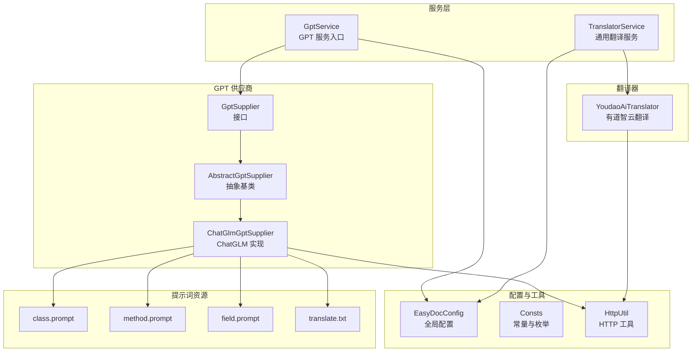
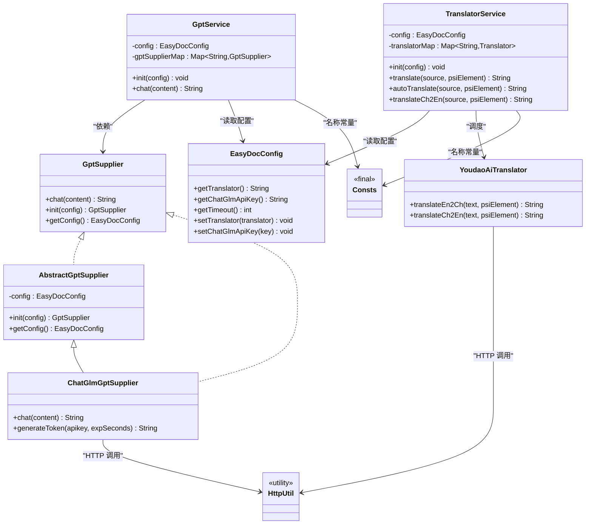
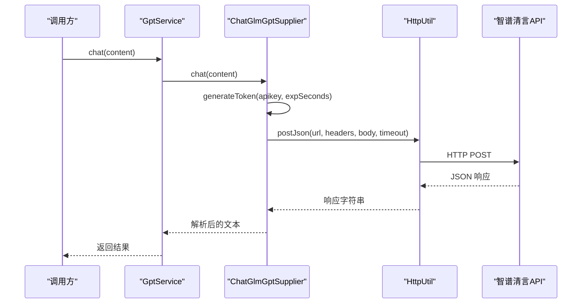
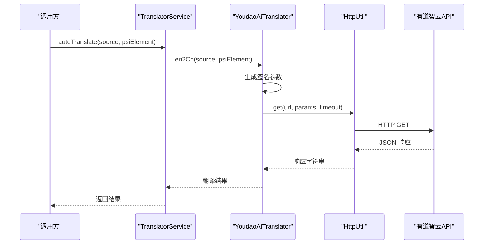
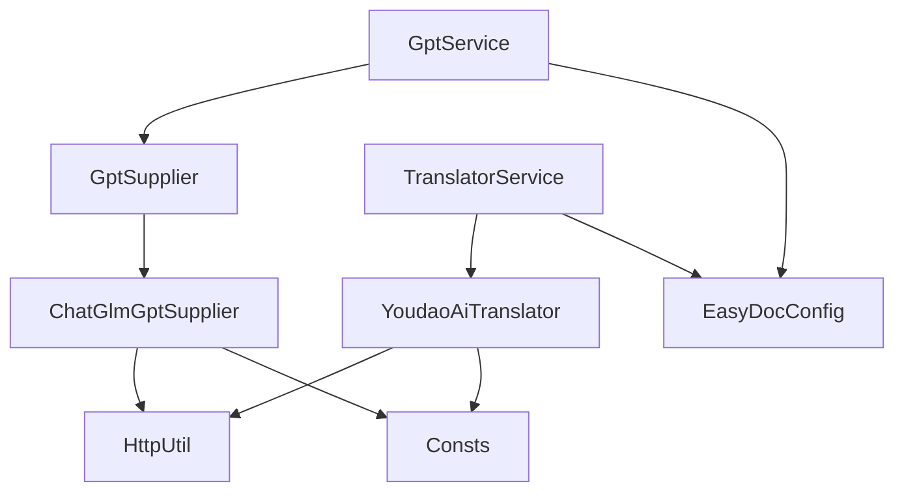

# AI 翻译服务

<cite>
**本文引用的文件**   
- [GptSupplier.java](file://src/main/java/com/star/easydoc/service/gpt/GptSupplier.java)
- [AbstractGptSupplier.java](file://src/main/java/com/star/easydoc/service/gpt/impl/AbstractGptSupplier.java)
- [ChatGlmGptSupplier.java](file://src/main/java/com/star/easydoc/service/gpt/impl/ChatGlmGptSupplier.java)
- [GptService.java](file://src/main/java/com/star/easydoc/service/gpt/GptService.java)
- [EasyDocConfig.java](file://src/main/java/com/star/easydoc/config/EasyDocConfig.java)
- [Consts.java](file://src/main/java/com/star/easydoc/common/Consts.java)
- [YoudaoAiTranslator.java](file://src/main/java/com/star/easydoc/service/translator/impl/YoudaoAiTranslator.java)
- [TranslatorService.java](file://src/main/java/com/star/easydoc/service/translator/TranslatorService.java)
- [HttpUtil.java](file://src/main/java/com/star/easydoc/common/util/HttpUtil.java)
- [class.prompt](file://src/main/resources/prompts/chatglm/class.prompt)
- [method.prompt](file://src/main/resources/prompts/chatglm/method.prompt)
- [field.prompt](file://src/main/resources/prompts/chatglm/field.prompt)
- [translate.txt](file://src/main/resources/prompts/translate.txt)
- [README.md](file://README.md)
</cite>

## 目录
1. [简介](#简介)
2. [项目结构](#项目结构)
3. [核心组件](#核心组件)
4. [架构总览](#架构总览)
5. [详细组件分析](#详细组件分析)
6. [依赖分析](#依赖分析)
7. [性能考量](#性能考量)
8. [故障排查指南](#故障排查指南)
9. [结论](#结论)
10. [附录](#附录)

## 简介
本文件面向“AI 翻译服务”的技术文档，聚焦于有道智云翻译与 ChatGLM（智谱清言）大模型的集成实现。文档从架构设计、接口抽象、数据流、错误处理与性能优化等方面进行深入解析，并提供配置方法、使用示例、最佳实践与常见问题解决方案，帮助读者在实际工程中高效、稳定地使用 AI 翻译能力。

## 项目结构
本项目为 IntelliJ IDEA 插件，围绕“注释生成”与“翻译服务”两条主线组织代码。AI 翻译相关模块主要位于以下包与资源目录：
- 服务层：service.gpt（GPT 供应商接口与实现）、service.translator（通用翻译服务与具体翻译器）
- 配置层：config（持久化配置 EasyDocConfig）
- 工具层：common.util（HttpUtil 网络请求封装）
- 资源层：prompts/chatglm（ChatGLM 提示词模板）、prompts/translate.txt（通用翻译提示）

图表来源
- [GptService.java:1-57](file://src/main/java/com/star/easydoc/service/gpt/GptService.java#L1-L57)
- [GptSupplier.java:1-35](file://src/main/java/com/star/easydoc/service/gpt/GptSupplier.java#L1-L35)
- [AbstractGptSupplier.java:1-26](file://src/main/java/com/star/easydoc/service/gpt/impl/AbstractGptSupplier.java#L1-L26)
- [ChatGlmGptSupplier.java:1-135](file://src/main/java/com/star/easydoc/service/gpt/impl/ChatGlmGptSupplier.java#L1-L135)
- [TranslatorService.java:1-238](file://src/main/java/com/star/easydoc/service/translator/TranslatorService.java#L1-L238)
- [YoudaoAiTranslator.java:1-120](file://src/main/java/com/star/easydoc/service/translator/impl/YoudaoAiTranslator.java#L1-L120)
- [EasyDocConfig.java:1-680](file://src/main/java/com/star/easydoc/config/EasyDocConfig.java#L1-L680)
- [Consts.java:1-100](file://src/main/java/com/star/easydoc/common/Consts.java#L1-L100)
- [HttpUtil.java:1-246](file://src/main/java/com/star/easydoc/common/util/HttpUtil.java#L1-L246)
- [class.prompt:1-30](file://src/main/resources/prompts/chatglm/class.prompt#L1-L30)
- [method.prompt:1-31](file://src/main/resources/prompts/chatglm/method.prompt#L1-L31)
- [field.prompt:1-20](file://src/main/resources/prompts/chatglm/field.prompt#L1-L20)
- [translate.txt:1-2](file://src/main/resources/prompts/translate.txt#L1-L2)

章节来源
- [README.md:1-266](file://README.md#L1-L266)

## 核心组件
- GptSupplier 接口：定义统一的聊天/问答能力与初始化流程，便于扩展不同大模型供应商。
- AbstractGptSupplier 抽象类：提供配置注入与获取的通用逻辑，子类只需关注具体实现细节。
- ChatGlmGptSupplier：基于智谱清言 API 的实现，负责生成 JWT Token、构造请求体、调用 HTTP 接口并解析响应。
- GptService：GPT 服务入口，负责按配置选择具体供应商并转发请求。
- YoudaoAiTranslator：有道智云翻译实现，提供英中/中英双向翻译能力。
- TranslatorService：统一的翻译服务调度器，根据配置选择具体翻译器，支持自定义词典与整句/单词级翻译策略。
- EasyDocConfig：集中管理各类 API Key、超时、翻译器选择等配置项。
- Consts：提供翻译器名称常量、AI 翻译集合等。
- HttpUtil：统一的 HTTP 请求封装，支持代理、连接与读取超时控制。
- 提示词资源：针对类、方法、属性的 ChatGLM 提示词模板，以及通用翻译提示。

章节来源
- [GptSupplier.java:1-35](file://src/main/java/com/star/easydoc/service/gpt/GptSupplier.java#L1-L35)
- [AbstractGptSupplier.java:1-26](file://src/main/java/com/star/easydoc/service/gpt/impl/AbstractGptSupplier.java#L1-L26)
- [ChatGlmGptSupplier.java:1-135](file://src/main/java/com/star/easydoc/service/gpt/impl/ChatGlmGptSupplier.java#L1-L135)
- [GptService.java:1-57](file://src/main/java/com/star/easydoc/service/gpt/GptService.java#L1-L57)
- [YoudaoAiTranslator.java:1-120](file://src/main/java/com/star/easydoc/service/translator/impl/YoudaoAiTranslator.java#L1-L120)
- [TranslatorService.java:1-238](file://src/main/java/com/star/easydoc/service/translator/TranslatorService.java#L1-L238)
- [EasyDocConfig.java:1-680](file://src/main/java/com/star/easydoc/config/EasyDocConfig.java#L1-L680)
- [Consts.java:1-100](file://src/main/java/com/star/easydoc/common/Consts.java#L1-L100)
- [HttpUtil.java:1-246](file://src/main/java/com/star/easydoc/common/util/HttpUtil.java#L1-L246)
- [class.prompt:1-30](file://src/main/resources/prompts/chatglm/class.prompt#L1-L30)
- [method.prompt:1-31](file://src/main/resources/prompts/chatglm/method.prompt#L1-L31)
- [field.prompt:1-20](file://src/main/resources/prompts/chatglm/field.prompt#L1-L20)
- [translate.txt:1-2](file://src/main/resources/prompts/translate.txt#L1-L2)

## 架构总览
AI 翻译服务采用“接口抽象 + 多实现 + 统一调度”的分层架构：
- 接口层：GptSupplier 定义统一能力；TranslatorService 统一调度通用翻译器。
- 实现层：ChatGlmGptSupplier、YoudaoAiTranslator 等具体实现。
- 配置层：Consts 提供名称常量；EasyDocConfig 提供配置项与默认值。
- 工具层：HttpUtil 提供网络访问能力；提示词资源驱动 ChatGLM 的输出质量。

图表来源
- [GptSupplier.java:1-35](file://src/main/java/com/star/easydoc/service/gpt/GptSupplier.java#L1-L35)
- [AbstractGptSupplier.java:1-26](file://src/main/java/com/star/easydoc/service/gpt/impl/AbstractGptSupplier.java#L1-L26)
- [ChatGlmGptSupplier.java:1-135](file://src/main/java/com/star/easydoc/service/gpt/impl/ChatGlmGptSupplier.java#L1-L135)
- [GptService.java:1-57](file://src/main/java/com/star/easydoc/service/gpt/GptService.java#L1-L57)
- [TranslatorService.java:1-238](file://src/main/java/com/star/easydoc/service/translator/TranslatorService.java#L1-L238)
- [YoudaoAiTranslator.java:1-120](file://src/main/java/com/star/easydoc/service/translator/impl/YoudaoAiTranslator.java#L1-L120)
- [EasyDocConfig.java:1-680](file://src/main/java/com/star/easydoc/config/EasyDocConfig.java#L1-L680)
- [Consts.java:1-100](file://src/main/java/com/star/easydoc/common/Consts.java#L1-L100)
- [HttpUtil.java:1-246](file://src/main/java/com/star/easydoc/common/util/HttpUtil.java#L1-L246)

## 详细组件分析

### GPT 服务与 ChatGLM 集成
- 接口与抽象：GptSupplier 定义 chat/init/getConfig；AbstractGptSupplier 提供配置注入与获取。
- ChatGLM 实现：负责生成 JWT Token、构造请求体、调用智谱清言 API 并解析响应；使用 HttpUtil 发送 JSON 请求。
- GptService：按配置选择供应商并转发请求，线程安全初始化。

图表来源
- [GptService.java:48-54](file://src/main/java/com/star/easydoc/service/gpt/GptService.java#L48-L54)
- [ChatGlmGptSupplier.java:31-51](file://src/main/java/com/star/easydoc/service/gpt/impl/ChatGlmGptSupplier.java#L31-L51)
- [HttpUtil.java:225-231](file://src/main/java/com/star/easydoc/common/util/HttpUtil.java#L225-L231)

章节来源
- [GptSupplier.java:9-34](file://src/main/java/com/star/easydoc/service/gpt/GptSupplier.java#L9-L34)
- [AbstractGptSupplier.java:10-25](file://src/main/java/com/star/easydoc/service/gpt/impl/AbstractGptSupplier.java#L10-L25)
- [ChatGlmGptSupplier.java:23-135](file://src/main/java/com/star/easydoc/service/gpt/impl/ChatGlmGptSupplier.java#L23-L135)
- [GptService.java:16-56](file://src/main/java/com/star/easydoc/service/gpt/GptService.java#L16-L56)

### 有道智云翻译
- 功能：提供英中/中英双向翻译，支持签名参数与超时控制。
- 错误处理：捕获异常并记录日志，返回空字符串作为兜底。
- 集成：作为 TranslatorService 的一个翻译器实现，与 GPT 服务并列存在。

图表来源
- [TranslatorService.java:157-163](file://src/main/java/com/star/easydoc/service/translator/TranslatorService.java#L157-L163)
- [YoudaoAiTranslator.java:39-62](file://src/main/java/com/star/easydoc/service/translator/impl/YoudaoAiTranslator.java#L39-L62)
- [HttpUtil.java:76-103](file://src/main/java/com/star/easydoc/common/util/HttpUtil.java#L76-L103)

章节来源
- [YoudaoAiTranslator.java:24-120](file://src/main/java/com/star/easydoc/service/translator/impl/YoudaoAiTranslator.java#L24-L120)
- [TranslatorService.java:41-238](file://src/main/java/com/star/easydoc/service/translator/TranslatorService.java#L41-L238)

### 提示词与输出规范化
- ChatGLM 提示词：针对类、方法、属性分别提供模板，确保输出符合 Javadoc 规范（以“/**”开头、“*/”结尾），并包含作者、日期等占位符。
- 通用翻译提示：简短指令，约束输出长度与格式。
- 输出后处理：ChatGLM 实现会清洗多余注释标记，保证最终注释合法。

章节来源
- [class.prompt:1-30](file://src/main/resources/prompts/chatglm/class.prompt#L1-L30)
- [method.prompt:1-31](file://src/main/resources/prompts/chatglm/method.prompt#L1-L31)
- [field.prompt:1-20](file://src/main/resources/prompts/chatglm/field.prompt#L1-L20)
- [translate.txt:1-2](file://src/main/resources/prompts/translate.txt#L1-L2)
- [ChatGlmGptSupplier.java:47-51](file://src/main/java/com/star/easydoc/service/gpt/impl/ChatGlmGptSupplier.java#L47-L51)

## 依赖分析
- 组件耦合
  - GptService 与 ChatGlmGptSupplier：通过 GptSupplier 接口解耦，便于扩展其他大模型供应商。
  - TranslatorService 与 YoudaoAiTranslator：同样通过 Translator 接口解耦。
  - ChatGlmGptSupplier/YoudaoAiTranslator 依赖 HttpUtil 进行网络请求。
- 外部依赖
  - HTTP 客户端：Apache HttpClient（由 HttpUtil 封装）。
  - JSON 解析：Fastjson2。
  - JWT：Auth0 JWT。
  - 工具库：Guava、Commons Lang。
- 配置依赖
  - Consts 提供翻译器名称常量；EasyDocConfig 提供 API Key、超时等配置项。

图表来源
- [GptService.java:35-37](file://src/main/java/com/star/easydoc/service/gpt/GptService.java#L35-L37)
- [TranslatorService.java:60-74](file://src/main/java/com/star/easydoc/service/translator/TranslatorService.java#L60-L74)
- [Consts.java:29-37](file://src/main/java/com/star/easydoc/common/Consts.java#L29-L37)
- [EasyDocConfig.java:80-129](file://src/main/java/com/star/easydoc/config/EasyDocConfig.java#L80-L129)

章节来源
- [GptService.java:16-56](file://src/main/java/com/star/easydoc/service/gpt/GptService.java#L16-L56)
- [TranslatorService.java:41-77](file://src/main/java/com/star/easydoc/service/translator/TranslatorService.java#L41-L77)
- [Consts.java:14-100](file://src/main/java/com/star/easydoc/common/Consts.java#L14-L100)
- [EasyDocConfig.java:1-680](file://src/main/java/com/star/easydoc/config/EasyDocConfig.java#L1-L680)

## 性能考量
- 超时与重试
  - ChatGLM 请求使用固定超时；有道智云翻译使用配置超时；建议在高延迟网络环境下适当增大超时。
  - HttpUtil 支持连接与读取超时分离配置，避免长时间阻塞。
- 网络代理
  - HttpUtil 自动识别系统代理，适配企业内网环境。
- 并发与初始化
  - GptService/TranslatorService 在初始化阶段使用同步块与不可变映射，保证线程安全与一致性。
- 输出清洗
  - ChatGLM 实现对返回文本进行注释标记清洗，减少二次处理开销。

章节来源
- [ChatGlmGptSupplier.java:27-28](file://src/main/java/com/star/easydoc/service/gpt/impl/ChatGlmGptSupplier.java#L27-L28)
- [EasyDocConfig.java:77](file://src/main/java/com/star/easydoc/config/EasyDocConfig.java#L77)
- [HttpUtil.java:41-42](file://src/main/java/com/star/easydoc/common/util/HttpUtil.java#L41-L42)
- [HttpUtil.java:86-89](file://src/main/java/com/star/easydoc/common/util/HttpUtil.java#L86-L89)
- [GptService.java:31-39](file://src/main/java/com/star/easydoc/service/gpt/GptService.java#L31-L39)
- [TranslatorService.java:56-76](file://src/main/java/com/star/easydoc/service/translator/TranslatorService.java#L56-L76)

## 故障排查指南
- 有道翻译不可用
  - 说明：官方免费接口已停止，需使用付费的有道智云翻译。
  - 处理：在配置中选择“有道智云翻译”，并正确填写 App Key 与 Secret。
- ChatGLM Token 生成失败
  - 现象：提示 invalid apikey 或签名异常。
  - 处理：确认配置项为“id.secret”格式；检查密钥有效期与网络连通性。
- 网络超时或代理问题
  - 现象：请求超时或返回空。
  - 处理：调整超时配置；检查系统代理设置；必要时手动指定代理。
- 翻译结果不符合预期
  - 现象：注释不完整或格式不符。
  - 处理：检查提示词模板完整性；确认输入代码片段清晰；适当增加提示词上下文。

章节来源
- [README.md:2-4](file://README.md#L2-L4)
- [YoudaoAiTranslator.java:58-61](file://src/main/java/com/star/easydoc/service/translator/impl/YoudaoAiTranslator.java#L58-L61)
- [ChatGlmGptSupplier.java:53-76](file://src/main/java/com/star/easydoc/service/gpt/impl/ChatGlmGptSupplier.java#L53-L76)
- [HttpUtil.java:201-215](file://src/main/java/com/star/easydoc/common/util/HttpUtil.java#L201-L215)
- [EasyDocConfig.java:664-670](file://src/main/java/com/star/easydoc/config/EasyDocConfig.java#L664-L670)

## 结论
本项目通过接口抽象与统一调度，实现了对多种翻译能力的灵活接入，其中 ChatGLM 与有道智云翻译分别满足“高质量自然语言生成”和“稳定在线翻译”的场景需求。配合完善的配置体系与提示词模板，能够在保证易用性的同时，兼顾性能与稳定性。建议在生产环境中合理设置超时与代理，结合自定义词典提升翻译质量，并根据业务成本与时效性选择合适的供应商。

## 附录

### 配置方法与使用示例
- API 密钥配置
  - ChatGLM：在配置中设置“chatGlmApiKey”，格式为“id.secret”。
  - 有道智云：设置“youdaoAppKey”与“youdaoAppSecret”。
- 模型与翻译器选择
  - 在配置中选择“智谱清言”或“有道智云翻译”。
  - 支持整句翻译与单词级翻译策略，优先使用整句翻译以获得更佳质量。
- 参数调优
  - 超时：通过“timeout”调整网络请求超时。
  - 代理：系统代理自动识别，必要时检查代理配置。
- 使用示例
  - 生成注释：将光标置于类/方法/属性上，触发快捷键生成注释；若启用 AI 翻译，将使用 ChatGLM 输出符合 Javadoc 规范的注释。
  - 选中翻译：选中非中文文本，触发快捷键弹出翻译结果；或选中中文文本生成英文命名。

章节来源
- [EasyDocConfig.java:126-129](file://src/main/java/com/star/easydoc/config/EasyDocConfig.java#L126-L129)
- [EasyDocConfig.java:537-551](file://src/main/java/com/star/easydoc/config/EasyDocConfig.java#L537-L551)
- [EasyDocConfig.java:394-400](file://src/main/java/com/star/easydoc/config/EasyDocConfig.java#L394-L400)
- [EasyDocConfig.java:664-670](file://src/main/java/com/star/easydoc/config/EasyDocConfig.java#L664-L670)
- [README.md:26-31](file://README.md#L26-L31)

### AI 翻译的优势与局限性
- 优势
  - ChatGLM：输出符合 Javadoc 规范，适合生成高质量注释；支持中文语境与工程术语。
  - 有道智云：在线稳定，适合通用翻译与命名生成。
- 局限性
  - 成本：ChatGLM 与有道智云均为付费服务，需关注用量与成本控制。
  - 响应时间：网络延迟与 API 限流可能影响整体生成速度。
  - 准确性：复杂语义与领域术语需结合自定义词典与提示词优化。

章节来源
- [README.md:41-47](file://README.md#L41-L47)
- [ChatGlmGptSupplier.java:25-28](file://src/main/java/com/star/easydoc/service/gpt/impl/ChatGlmGptSupplier.java#L25-L28)
- [YoudaoAiTranslator.java:27](file://src/main/java/com/star/easydoc/service/translator/impl/YoudaoAiTranslator.java#L27)