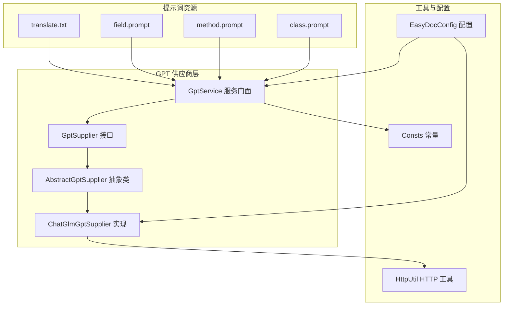
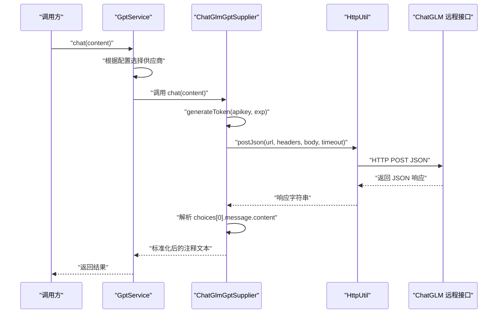
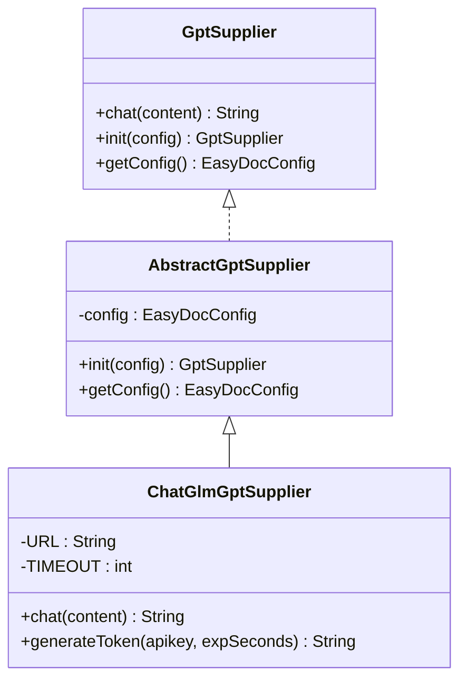
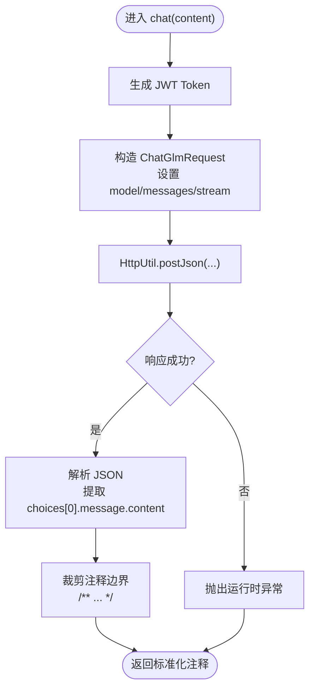
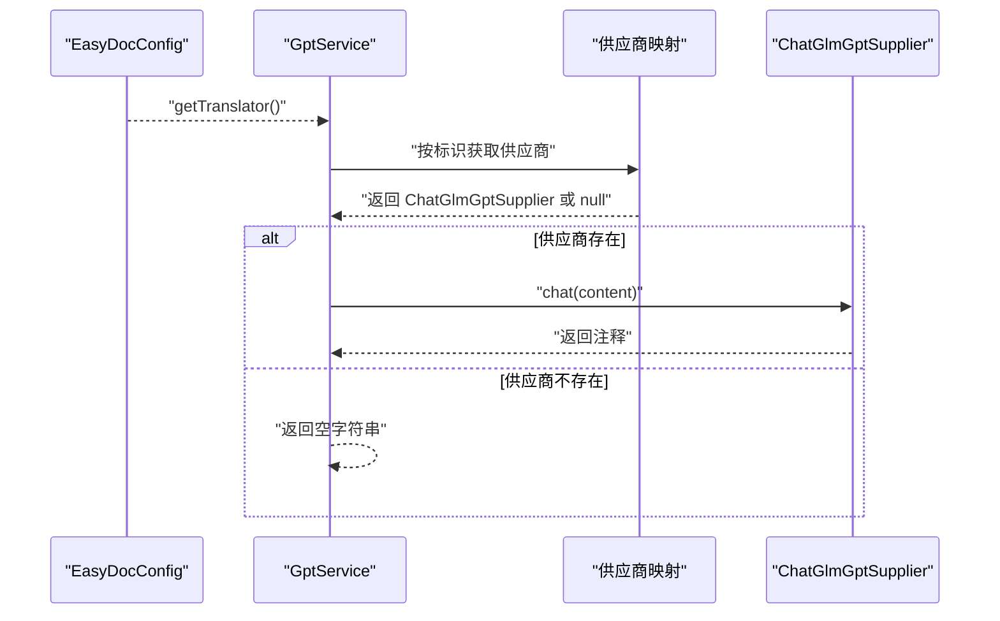
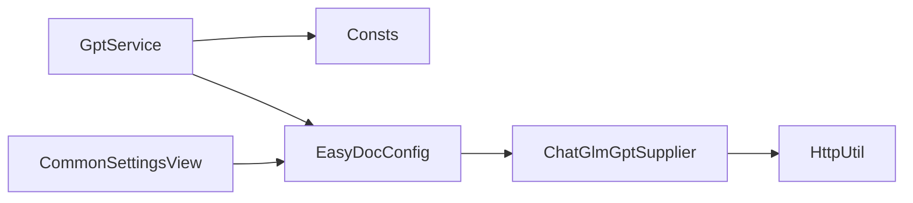

# ChatGLM GPT 供应商

<cite>
**本文引用的文件**
- [GptSupplier.java](file://src/main/java/com/star/easydoc/service/gpt/GptSupplier.java)
- [AbstractGptSupplier.java](file://src/main/java/com/star/easydoc/service/gpt/impl/AbstractGptSupplier.java)
- [ChatGlmGptSupplier.java](file://src/main/java/com/star/easydoc/service/gpt/impl/ChatGlmGptSupplier.java)
- [GptService.java](file://src/main/java/com/star/easydoc/service/gpt/GptService.java)
- [HttpUtil.java](file://src/main/java/com/star/easydoc/common/util/HttpUtil.java)
- [EasyDocConfig.java](file://src/main/java/com/star/easydoc/config/EasyDocConfig.java)
- [Consts.java](file://src/main/java/com/star/easydoc/common/Consts.java)
- [CommonSettingsView.java](file://src/main/java/com/star/easydoc/view/settings/CommonSettingsView.java)
- [class.prompt](file://src/main/resources/prompts/chatglm/class.prompt)
- [method.prompt](file://src/main/resources/prompts/chatglm/method.prompt)
- [field.prompt](file://src/main/resources/prompts/chatglm/field.prompt)
- [translate.txt](file://src/main/resources/prompts/translate.txt)
- [README.md](file://README.md)
</cite>

## 目录
1. [简介](#简介)
2. [项目结构](#项目结构)
3. [核心组件](#核心组件)
4. [架构总览](#架构总览)
5. [组件详解](#组件详解)
6. [依赖关系分析](#依赖关系分析)
7. [性能考量](#性能考量)
8. [故障排查指南](#故障排查指南)
9. [结论](#结论)
10. [附录](#附录)

## 简介
本文件面向 ChatGLM GPT 供应商的技术文档，聚焦于基于 ChatGLM 大语言模型的翻译服务实现。文档从接口设计、实现细节、调用流程、配置方法、性能与最佳实践等维度展开，帮助读者快速理解并正确使用该供应商能力。

## 项目结构
围绕 ChatGLM 供应商的相关模块主要位于 service/gpt 子包，配合通用工具类与配置类协同工作；提示词资源位于 prompts/chatglm 目录，用于指导大模型输出符合 Javadoc 标准的注释文本。

图表来源
- [GptSupplier.java:1-35](file://src/main/java/com/star/easydoc/service/gpt/GptSupplier.java#L1-L35)
- [AbstractGptSupplier.java:1-26](file://src/main/java/com/star/easydoc/service/gpt/impl/AbstractGptSupplier.java#L1-L26)
- [ChatGlmGptSupplier.java:1-135](file://src/main/java/com/star/easydoc/service/gpt/impl/ChatGlmGptSupplier.java#L1-L135)
- [GptService.java:1-57](file://src/main/java/com/star/easydoc/service/gpt/GptService.java#L1-L57)
- [HttpUtil.java:1-246](file://src/main/java/com/star/easydoc/common/util/HttpUtil.java#L1-L246)
- [EasyDocConfig.java:1-680](file://src/main/java/com/star/easydoc/config/EasyDocConfig.java#L1-L680)
- [Consts.java:1-100](file://src/main/java/com/star/easydoc/common/Consts.java#L1-L100)
- [class.prompt:1-30](file://src/main/resources/prompts/chatglm/class.prompt#L1-L30)
- [method.prompt:1-31](file://src/main/resources/prompts/chatglm/method.prompt#L1-L31)
- [field.prompt:1-20](file://src/main/resources/prompts/chatglm/field.prompt#L1-L20)
- [translate.txt:1-2](file://src/main/resources/prompts/translate.txt#L1-L2)

章节来源
- [GptSupplier.java:1-35](file://src/main/java/com/star/easydoc/service/gpt/GptSupplier.java#L1-L35)
- [AbstractGptSupplier.java:1-26](file://src/main/java/com/star/easydoc/service/gpt/impl/AbstractGptSupplier.java#L1-L26)
- [ChatGlmGptSupplier.java:1-135](file://src/main/java/com/star/easydoc/service/gpt/impl/ChatGlmGptSupplier.java#L1-L135)
- [GptService.java:1-57](file://src/main/java/com/star/easydoc/service/gpt/GptService.java#L1-L57)
- [HttpUtil.java:1-246](file://src/main/java/com/star/easydoc/common/util/HttpUtil.java#L1-L246)
- [EasyDocConfig.java:1-680](file://src/main/java/com/star/easydoc/config/EasyDocConfig.java#L1-L680)
- [Consts.java:1-100](file://src/main/java/com/star/easydoc/common/Consts.java#L1-L100)
- [class.prompt:1-30](file://src/main/resources/prompts/chatglm/class.prompt#L1-L30)
- [method.prompt:1-31](file://src/main/resources/prompts/chatglm/method.prompt#L1-L31)
- [field.prompt:1-20](file://src/main/resources/prompts/chatglm/field.prompt#L1-L20)
- [translate.txt:1-2](file://src/main/resources/prompts/translate.txt#L1-L2)

## 核心组件
- GptSupplier 接口：定义统一的聊天/问答能力入口，包含 chat、init、getConfig 三个方法，确保不同供应商实现具备一致的对外契约。
- AbstractGptSupplier 抽象类：封装通用初始化逻辑，保存 EasyDocConfig 配置实例，供子类复用。
- ChatGlmGptSupplier 实现：面向 ChatGLM 的具体供应商实现，负责构建请求、生成签名令牌、调用远程 API 并解析响应。
- GptService 服务门面：负责供应商注册与路由，根据配置选择对应供应商并转发请求。
- HttpUtil 工具：封装 HTTP GET/POST 请求与代理支持，提供 JSON 请求便捷方法。
- EasyDocConfig 配置：集中管理各类第三方密钥、超时、翻译策略等配置项，其中包含 chatGlmApiKey 字段。
- Consts 常量：定义翻译器集合与 AI 翻译集合，包含 CHATGLM_GPT 常量标识。
- 提示词资源：class.prompt、method.prompt、field.prompt、translate.txt 用于指导大模型输出符合 Javadoc 标准的注释文本。

章节来源
- [GptSupplier.java:1-35](file://src/main/java/com/star/easydoc/service/gpt/GptSupplier.java#L1-L35)
- [AbstractGptSupplier.java:1-26](file://src/main/java/com/star/easydoc/service/gpt/impl/AbstractGptSupplier.java#L1-L26)
- [ChatGlmGptSupplier.java:1-135](file://src/main/java/com/star/easydoc/service/gpt/impl/ChatGlmGptSupplier.java#L1-L135)
- [GptService.java:1-57](file://src/main/java/com/star/easydoc/service/gpt/GptService.java#L1-L57)
- [HttpUtil.java:1-246](file://src/main/java/com/star/easydoc/common/util/HttpUtil.java#L1-L246)
- [EasyDocConfig.java:125-129](file://src/main/java/com/star/easydoc/config/EasyDocConfig.java#L125-L129)
- [Consts.java:36-37](file://src/main/java/com/star/easydoc/common/Consts.java#L36-L37)
- [class.prompt:1-30](file://src/main/resources/prompts/chatglm/class.prompt#L1-L30)
- [method.prompt:1-31](file://src/main/resources/prompts/chatglm/method.prompt#L1-L31)
- [field.prompt:1-20](file://src/main/resources/prompts/chatglm/field.prompt#L1-L20)
- [translate.txt:1-2](file://src/main/resources/prompts/translate.txt#L1-L2)

## 架构总览
ChatGLM 供应商通过“接口 + 抽象类 + 具体实现 + 服务门面”的分层设计，将供应商能力与业务解耦。调用链路由 GptService 统一路由至 ChatGlmGptSupplier，后者借助 HttpUtil 发送 HTTP 请求，并使用 JWT 对 apiKey 进行签名认证。

图表来源
- [GptService.java:48-54](file://src/main/java/com/star/easydoc/service/gpt/GptService.java#L48-L54)
- [ChatGlmGptSupplier.java:30-51](file://src/main/java/com/star/easydoc/service/gpt/impl/ChatGlmGptSupplier.java#L30-L51)
- [HttpUtil.java:225-231](file://src/main/java/com/star/easydoc/common/util/HttpUtil.java#L225-L231)

章节来源
- [GptService.java:1-57](file://src/main/java/com/star/easydoc/service/gpt/GptService.java#L1-L57)
- [ChatGlmGptSupplier.java:1-135](file://src/main/java/com/star/easydoc/service/gpt/impl/ChatGlmGptSupplier.java#L1-L135)
- [HttpUtil.java:1-246](file://src/main/java/com/star/easydoc/common/util/HttpUtil.java#L1-L246)

## 组件详解

### GptSupplier 接口与 AbstractGptSupplier 抽象类
- 设计理念：通过接口约束统一行为，抽象类提供通用初始化与配置注入，降低重复代码，提升扩展性。
- 关键点：
  - chat：输入自然语言内容，输出标准化注释文本。
  - init：接收 EasyDocConfig 并注入到实现类。
  - getConfig：提供配置访问能力，便于实现内部使用。

图表来源
- [GptSupplier.java:9-34](file://src/main/java/com/star/easydoc/service/gpt/GptSupplier.java#L9-L34)
- [AbstractGptSupplier.java:10-25](file://src/main/java/com/star/easydoc/service/gpt/impl/AbstractGptSupplier.java#L10-L25)
- [ChatGlmGptSupplier.java:23-135](file://src/main/java/com/star/easydoc/service/gpt/impl/ChatGlmGptSupplier.java#L23-L135)

章节来源
- [GptSupplier.java:1-35](file://src/main/java/com/star/easydoc/service/gpt/GptSupplier.java#L1-L35)
- [AbstractGptSupplier.java:1-26](file://src/main/java/com/star/easydoc/service/gpt/impl/AbstractGptSupplier.java#L1-L26)

### ChatGlmGptSupplier 实现
- 调用流程：
  - 生成 JWT Token：从配置中读取 chatGlmApiKey，按约定拆分为 id 与 secret，生成带过期时间的签名令牌。
  - 构造请求体：设置模型名称、消息角色与内容，序列化为 JSON。
  - 发送请求：通过 HttpUtil.postJson 发送请求，设置超时时间。
  - 解析响应：从 JSON 中提取 choices[0].message.content，并做注释边界裁剪，保证输出符合 Javadoc 格式。
- 关键数据结构：
  - ChatGlmRequest：包含 model、messages、stream 字段。
  - Message：包含 role、content 字段。
- 错误处理：签名生成过程捕获异常并抛出运行时异常，便于上层感知。

图表来源
- [ChatGlmGptSupplier.java:30-51](file://src/main/java/com/star/easydoc/service/gpt/impl/ChatGlmGptSupplier.java#L30-L51)
- [HttpUtil.java:225-231](file://src/main/java/com/star/easydoc/common/util/HttpUtil.java#L225-L231)

章节来源
- [ChatGlmGptSupplier.java:1-135](file://src/main/java/com/star/easydoc/service/gpt/impl/ChatGlmGptSupplier.java#L1-L135)
- [HttpUtil.java:1-246](file://src/main/java/com/star/easydoc/common/util/HttpUtil.java#L1-L246)

### GptService 服务门面
- 供应商注册：在初始化阶段将 CHATGLM_GPT 与 ChatGlmGptSupplier 绑定，形成不可变映射。
- 路由选择：根据 EasyDocConfig.getTranslator() 返回的标识选择对应供应商实例。
- 空保护：若未找到匹配供应商，返回空字符串，避免空指针。

图表来源
- [GptService.java:27-54](file://src/main/java/com/star/easydoc/service/gpt/GptService.java#L27-L54)
- [Consts.java:82-82](file://src/main/java/com/star/easydoc/common/Consts.java#L82-L82)

章节来源
- [GptService.java:1-57](file://src/main/java/com/star/easydoc/service/gpt/GptService.java#L1-L57)
- [Consts.java:1-100](file://src/main/java/com/star/easydoc/common/Consts.java#L1-L100)

### 提示词与输出规范
- 提示词资源：
  - class.prompt：指导模型输出类级别的 Javadoc 注释。
  - method.prompt：指导模型输出方法级别的 Javadoc 注释。
  - field.prompt：指导模型输出属性级别的简短注释。
  - translate.txt：用于更简洁的注释生成场景。
- 输出规范：实现中对模型输出进行裁剪，确保以 Javadoc 注释块包裹，避免多余内容。

章节来源
- [class.prompt:1-30](file://src/main/resources/prompts/chatglm/class.prompt#L1-L30)
- [method.prompt:1-31](file://src/main/resources/prompts/chatglm/method.prompt#L1-L31)
- [field.prompt:1-20](file://src/main/resources/prompts/chatglm/field.prompt#L1-L20)
- [translate.txt:1-2](file://src/main/resources/prompts/translate.txt#L1-L2)
- [ChatGlmGptSupplier.java:47-50](file://src/main/java/com/star/easydoc/service/gpt/impl/ChatGlmGptSupplier.java#L47-L50)

## 依赖关系分析
- 供应商层与工具层：
  - ChatGlmGptSupplier 依赖 HttpUtil 进行 HTTP 通信。
  - GptService 依赖 Consts 常量标识与 EasyDocConfig 配置。
- 配置与 UI：
  - EasyDocConfig 提供 chatGlmApiKey 字段。
  - CommonSettingsView 在 UI 中暴露 apiKey 输入控件，用于设置 chatGlmApiKey。

图表来源
- [ChatGlmGptSupplier.java:14-14](file://src/main/java/com/star/easydoc/service/gpt/impl/ChatGlmGptSupplier.java#L14-L14)
- [GptService.java:8-9](file://src/main/java/com/star/easydoc/service/gpt/GptService.java#L8-L9)
- [Consts.java:82-82](file://src/main/java/com/star/easydoc/common/Consts.java#L82-L82)
- [EasyDocConfig.java:125-129](file://src/main/java/com/star/easydoc/config/EasyDocConfig.java#L125-L129)
- [CommonSettingsView.java:388-399](file://src/main/java/com/star/easydoc/view/settings/CommonSettingsView.java#L388-L399)

章节来源
- [ChatGlmGptSupplier.java:1-135](file://src/main/java/com/star/easydoc/service/gpt/impl/ChatGlmGptSupplier.java#L1-L135)
- [GptService.java:1-57](file://src/main/java/com/star/easydoc/service/gpt/GptService.java#L1-L57)
- [Consts.java:1-100](file://src/main/java/com/star/easydoc/common/Consts.java#L1-L100)
- [EasyDocConfig.java:1-680](file://src/main/java/com/star/easydoc/config/EasyDocConfig.java#L1-L680)
- [CommonSettingsView.java:374-400](file://src/main/java/com/star/easydoc/view/settings/CommonSettingsView.java#L374-L400)

## 性能考量
- 超时控制：ChatGlmGptSupplier 内部设置固定超时时间，避免长时间阻塞；同时 GptService 与 HttpUtil 也提供超时参数，可在配置层面进一步调整。
- 网络代理：HttpUtil 支持系统代理，有助于在受限网络环境下稳定访问远端 API。
- 响应解析：采用 JSON 路径直接定位目标字段，减少不必要的对象反序列化开销。
- 最佳实践：
  - 合理设置超时时间，兼顾稳定性与用户体验。
  - 在代理网络环境中确保代理配置正确。
  - 对高频调用场景可考虑本地缓存或批量化处理（需结合业务场景评估）。

章节来源
- [ChatGlmGptSupplier.java:27-28](file://src/main/java/com/star/easydoc/service/gpt/impl/ChatGlmGptSupplier.java#L27-L28)
- [HttpUtil.java:41-42](file://src/main/java/com/star/easydoc/common/util/HttpUtil.java#L41-L42)
- [GptService.java:48-54](file://src/main/java/com/star/easydoc/service/gpt/GptService.java#L48-L54)

## 故障排查指南
- 无法生成注释：
  - 检查配置项 chatGlmApiKey 是否正确填写。
  - 确认网络可访问 ChatGLM 远端接口。
- 响应异常或为空：
  - 查看日志中是否有 HTTP 请求异常记录。
  - 确认提示词资源未被意外修改，且输出被正确裁剪。
- 令牌签名失败：
  - 确认 apiKey 格式为“id.secret”形式。
  - 检查系统时间是否准确，避免因过期时间计算异常导致签名无效。

章节来源
- [ChatGlmGptSupplier.java:53-76](file://src/main/java/com/star/easydoc/service/gpt/impl/ChatGlmGptSupplier.java#L53-L76)
- [HttpUtil.java:96-102](file://src/main/java/com/star/easydoc/common/util/HttpUtil.java#L96-L102)
- [CommonSettingsView.java:388-399](file://src/main/java/com/star/easydoc/view/settings/CommonSettingsView.java#L388-L399)

## 结论
ChatGLM GPT 供应商通过清晰的接口设计与稳健的实现，将大模型能力无缝集成到注释生成流程中。其优势在于本地部署可控、成本可控、定制化程度高；同时，结合提示词工程与严格的输出裁剪，能够稳定产出符合 Javadoc 标准的注释文本。建议在生产环境中合理配置超时与代理，并持续优化提示词以提升输出质量。

## 附录

### 配置方法与使用示例
- 配置步骤：
  - 在设置界面选择“智谱清言”作为翻译器。
  - 在“apiKey”输入框中填入 chatGlmApiKey。
  - 保存配置后，调用 GptService.chat(content) 即可触发 ChatGLM 生成注释。
- 参数调优建议：
  - 超时时间：根据网络环境适当提高，避免频繁超时。
  - 提示词：针对团队代码风格微调 class/method/field prompt，提升一致性。
- 与传统翻译 API 的区别与优势：
  - 本地部署与私有化：无需依赖公网翻译服务，满足内网安全与合规需求。
  - 成本控制：按需付费，避免长期订阅费用。
  - 定制化程度：可针对特定领域与术语进行提示词优化，输出更贴合业务语境。

章节来源
- [CommonSettingsView.java:388-399](file://src/main/java/com/star/easydoc/view/settings/CommonSettingsView.java#L388-L399)
- [EasyDocConfig.java:125-129](file://src/main/java/com/star/easydoc/config/EasyDocConfig.java#L125-L129)
- [GptService.java:27-54](file://src/main/java/com/star/easydoc/service/gpt/GptService.java#L27-L54)
- [README.md:109-109](file://README.md#L109-L109)