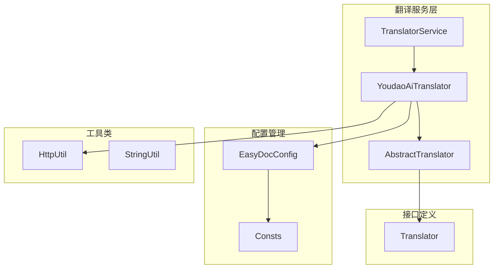
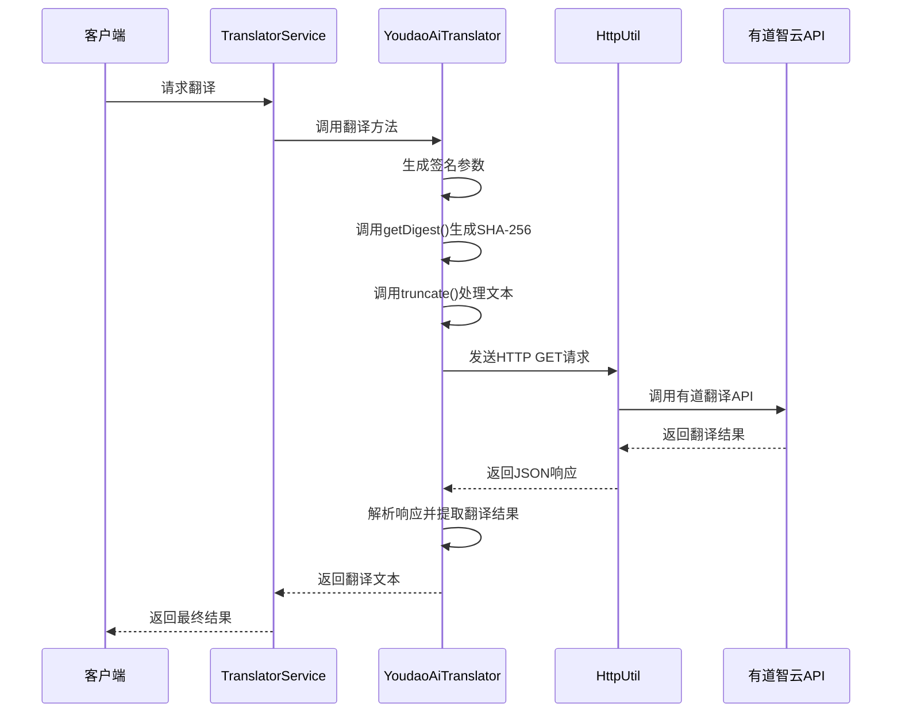
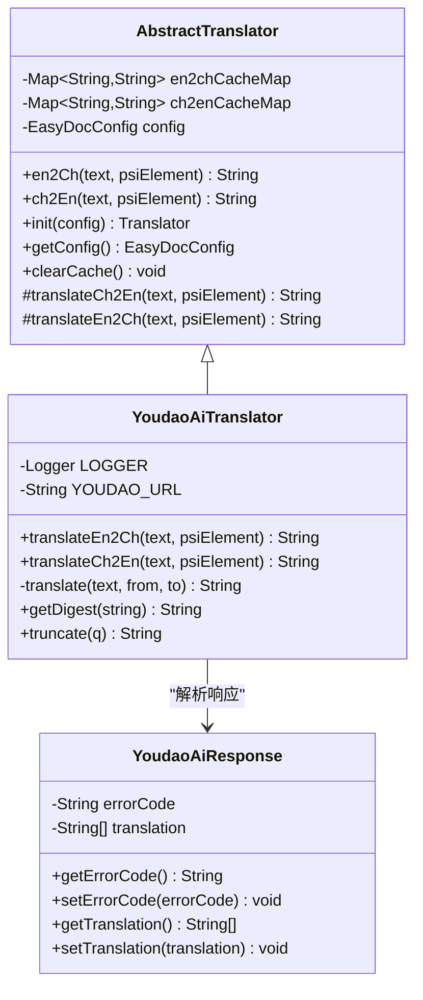
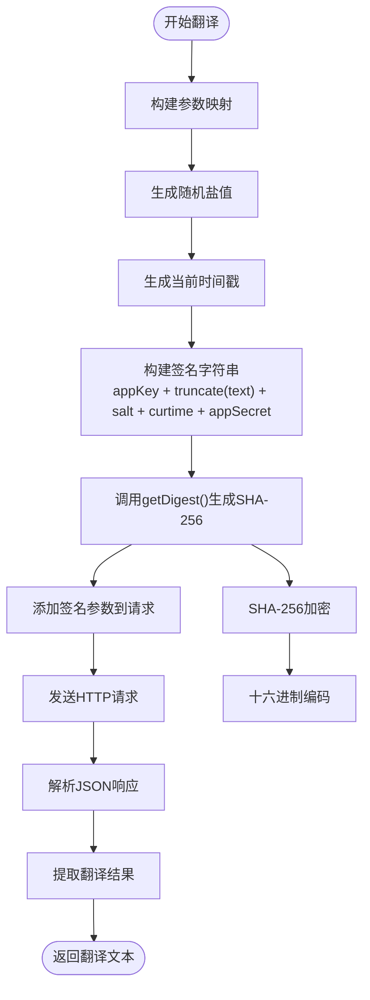
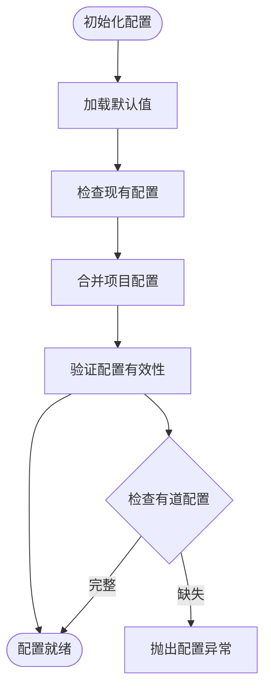
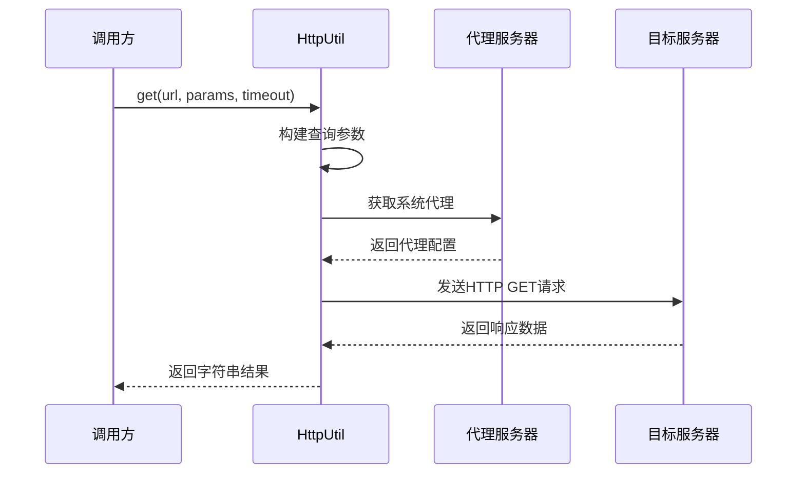
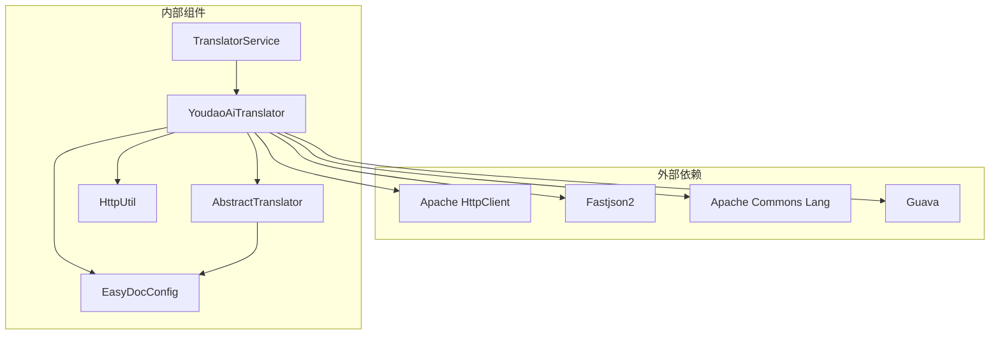

# 有道 AI 翻译

<cite>
**本文档引用的文件**
- [YoudaoAiTranslator.java](file://src/main/java/com/star/easydoc/service/translator/impl/YoudaoAiTranslator.java)
- [AbstractTranslator.java](file://src/main/java/com/star/easydoc/service/translator/impl/AbstractTranslator.java)
- [HttpUtil.java](file://src/main/java/com/star/easydoc/common/util/HttpUtil.java)
- [EasyDocConfig.java](file://src/main/java/com/star/easydoc/config/EasyDocConfig.java)
- [Translator.java](file://src/main/java/com/star/easydoc/service/translator/Translator.java)
- [TranslatorService.java](file://src/main/java/com/star/easydoc/service/translator/TranslatorService.java)
- [Consts.java](file://src/main/java/com/star/easydoc/common/Consts.java)
- [README.md](file://README.md)
</cite>

## 目录
1. [简介](#简介)
2. [项目结构](#项目结构)
3. [核心组件](#核心组件)
4. [架构概览](#架构概览)
5. [详细组件分析](#详细组件分析)
6. [依赖关系分析](#依赖关系分析)
7. [性能考虑](#性能考虑)
8. [故障排除指南](#故障排除指南)
9. [结论](#结论)

## 简介

有道 AI 翻译是 Easy Javadoc 插件中的一个重要功能模块，基于有道智云翻译 API 实现。该模块提供了强大的机器翻译能力，支持中英互译，能够帮助开发者快速生成高质量的文档注释。

**重要说明**：根据项目文档，目前免费的【有道翻译】已被官方禁用，请大家更换别的翻译方式，各大平台都提供免费额度。

## 项目结构

有道 AI 翻译功能在项目中的组织结构如下：

**图表来源**
- [TranslatorService.java:41-77](file://src/main/java/com/star/easydoc/service/translator/TranslatorService.java#L41-L77)
- [YoudaoAiTranslator.java:24-25](file://src/main/java/com/star/easydoc/service/translator/impl/YoudaoAiTranslator.java#L24-L25)
- [AbstractTranslator.java:14-14](file://src/main/java/com/star/easydoc/service/translator/impl/AbstractTranslator.java#L14-L14)

**章节来源**
- [YoudaoAiTranslator.java:1-120](file://src/main/java/com/star/easydoc/service/translator/impl/YoudaoAiTranslator.java#L1-L120)
- [TranslatorService.java:1-238](file://src/main/java/com/star/easydoc/service/translator/TranslatorService.java#L1-L238)

## 核心组件

有道 AI 翻译系统由以下核心组件构成：

### 主要组件职责

1. **YoudaoAiTranslator** - 有道智云翻译实现类
2. **AbstractTranslator** - 抽象翻译基类，提供缓存和通用功能
3. **TranslatorService** - 翻译服务管理器，负责翻译器实例化和调度
4. **EasyDocConfig** - 配置管理类，存储翻译相关的配置信息
5. **HttpUtil** - HTTP 请求工具类，处理网络通信

### 关键特性

- **缓存机制**：内置并发缓存，避免重复翻译相同文本
- **签名验证**：实现有道智云 API 的安全签名机制
- **超时控制**：支持自定义超时时间配置
- **错误处理**：完善的异常处理和日志记录

**章节来源**
- [AbstractTranslator.java:14-92](file://src/main/java/com/star/easydoc/service/translator/impl/AbstractTranslator.java#L14-L92)
- [YoudaoAiTranslator.java:24-120](file://src/main/java/com/star/easydoc/service/translator/impl/YoudaoAiTranslator.java#L24-L120)

## 架构概览

有道 AI 翻译系统的整体架构采用分层设计：

**图表来源**
- [TranslatorService.java:157-163](file://src/main/java/com/star/easydoc/service/translator/TranslatorService.java#L157-L163)
- [YoudaoAiTranslator.java:39-62](file://src/main/java/com/star/easydoc/service/translator/impl/YoudaoAiTranslator.java#L39-L62)
- [HttpUtil.java:76-103](file://src/main/java/com/star/easydoc/common/util/HttpUtil.java#L76-L103)

## 详细组件分析

### YoudaoAiTranslator 类分析

YoudaoAiTranslator 是有道智云翻译的核心实现类，继承自 AbstractTranslator。

#### 类结构图

**图表来源**
- [AbstractTranslator.java:14-92](file://src/main/java/com/star/easydoc/service/translator/impl/AbstractTranslator.java#L14-L92)
- [YoudaoAiTranslator.java:24-120](file://src/main/java/com/star/easydoc/service/translator/impl/YoudaoAiTranslator.java#L24-L120)

#### 签名算法实现

有道 AI 翻译的核心签名算法实现了以下流程：

**图表来源**
- [YoudaoAiTranslator.java:39-62](file://src/main/java/com/star/easydoc/service/translator/impl/YoudaoAiTranslator.java#L39-L62)
- [YoudaoAiTranslator.java:67-88](file://src/main/java/com/star/easydoc/service/translator/impl/YoudaoAiTranslator.java#L67-L88)

#### SHA-256 加密签名生成

getDigest 方法实现了标准的 SHA-256 加密签名生成：

**算法步骤**：
1. 将输入字符串转换为 UTF-8 字节
2. 使用 MessageDigest 获取 SHA-256 实例
3. 对字节数组进行哈希计算
4. 将结果转换为十六进制字符串

**章节来源**
- [YoudaoAiTranslator.java:67-88](file://src/main/java/com/star/easydoc/service/translator/impl/YoudaoAiTranslator.java#L67-L88)

#### 文本截取逻辑

truncate 方法实现了有道智云要求的文本截取策略：

**处理规则**：
- 文本长度 ≤ 20：直接返回原文本
- 文本长度 > 20：返回格式化的截取文本
- 格式：`前10字符 + 总长度 + 后10字符`

**章节来源**
- [YoudaoAiTranslator.java:90-96](file://src/main/java/com/star/easydoc/service/translator/impl/YoudaoAiTranslator.java#L90-L96)

### 配置管理分析

EasyDocConfig 类提供了完整的配置管理功能：

#### 配置项说明

| 配置项 | 类型 | 默认值 | 说明 |
|--------|------|--------|------|
| translator | String | "有道翻译" | 翻译器类型 |
| timeout | int | 1000 | 超时时间（毫秒） |
| youdaoAppKey | String | null | 有道应用密钥 |
| youdaoAppSecret | String | null | 有道应用密钥 |

#### 配置初始化流程

**图表来源**
- [EasyDocConfig.java:170-200](file://src/main/java/com/star/easydoc/config/EasyDocConfig.java#L170-L200)
- [CommonSettingsConfigurable.java:144-151](file://src/main/java/com/star/easydoc/view/settings/CommonSettingsConfigurable.java#L144-L151)

**章节来源**
- [EasyDocConfig.java:537-551](file://src/main/java/com/star/easydoc/config/EasyDocConfig.java#L537-L551)
- [EasyDocConfig.java:664-670](file://src/main/java/com/star/easydoc/config/EasyDocConfig.java#L664-L670)

### HTTP 请求处理

HttpUtil 类提供了统一的 HTTP 请求处理能力：

#### 请求流程

**图表来源**
- [HttpUtil.java:113-121](file://src/main/java/com/star/easydoc/common/util/HttpUtil.java#L113-L121)
- [HttpUtil.java:201-215](file://src/main/java/com/star/easydoc/common/util/HttpUtil.java#L201-L215)

**章节来源**
- [HttpUtil.java:76-103](file://src/main/java/com/star/easydoc/common/util/HttpUtil.java#L76-L103)
- [HttpUtil.java:113-121](file://src/main/java/com/star/easydoc/common/util/HttpUtil.java#L113-L121)

## 依赖关系分析

有道 AI 翻译模块的依赖关系如下：

**图表来源**
- [YoudaoAiTranslator.java:10-16](file://src/main/java/com/star/easydoc/service/translator/impl/YoudaoAiTranslator.java#L10-L16)
- [AbstractTranslator.java:7](file://src/main/java/com/star/easydoc/service/translator/impl/AbstractTranslator.java#L7)

### 关键依赖说明

1. **Apache HttpClient**：用于 HTTP 请求处理
2. **Fastjson2**：JSON 数据解析
3. **Apache Commons Lang**：字符串和对象工具类
4. **Guava**：集合和并发工具类

**章节来源**
- [YoudaoAiTranslator.java:10-16](file://src/main/java/com/star/easydoc/service/translator/impl/YoudaoAiTranslator.java#L10-L16)
- [AbstractTranslator.java:7](file://src/main/java/com/star/easydoc/service/translator/impl/AbstractTranslator.java#L7)

## 性能考虑

### 缓存策略

有道 AI 翻译实现了两级缓存机制：

1. **内存缓存**：使用 ConcurrentHashMap 存储翻译结果
2. **并发安全**：通过同步机制保证线程安全
3. **缓存清理**：提供 clearCache() 方法手动清理缓存

### 超时配置

系统支持灵活的超时配置：

- **连接超时**：默认 1000ms
- **读取超时**：默认 1000ms
- **自定义超时**：通过 EasyDocConfig.timeout 设置

### 错误处理

实现了完善的错误处理机制：

- **网络异常**：捕获并记录异常信息
- **解析异常**：处理 JSON 解析错误
- **空指针保护**：防止空值导致的程序崩溃

## 故障排除指南

### 常见配置问题

#### 1. 有道应用密钥配置错误

**问题症状**：
- 翻译请求返回错误
- 日志中显示 appKey 或网络相关错误

**解决方案**：
1. 检查 EasyDocConfig 中的 youdaoAppKey 和 youdaoAppSecret
2. 确认密钥是否正确且未过期
3. 验证网络连接是否正常

#### 2. 超时设置不合理

**问题症状**：
- 翻译请求经常超时
- 网络环境较差时翻译失败

**解决方案**：
1. 在配置中调整 timeout 值
2. 根据网络环境适当增加超时时间
3. 考虑启用系统代理

#### 3. 缓存导致的翻译延迟

**问题症状**：
- 新的翻译结果没有及时更新
- 使用旧的缓存结果

**解决方案**：
1. 调用 clearCache() 方法清理缓存
2. 重启 IDE 以确保缓存完全清除
3. 检查缓存是否正确实现

### 网络连接问题

#### 代理配置

系统支持自动检测和使用系统代理：

1. **代理检测**：通过 CommonProxy.getInstance().select() 获取代理
2. **代理应用**：自动将代理配置应用到 HTTP 请求
3. **代理类型**：支持 HTTP 和 SOCKS 代理

#### 网络超时

**超时参数**：
- **连接超时**：CONNECT_TIMEOUT = 1000ms
- **读取超时**：SOCKET_TIMEOUT = 1000ms

**优化建议**：
- 在网络较慢环境下适当增加超时时间
- 检查防火墙设置是否阻止了 API 请求
- 验证有道智云 API 的可用性

### 签名验证问题

#### 签名算法验证

**验证步骤**：
1. 确认签名字符串构建顺序正确
2. 检查 truncate() 方法的文本截取逻辑
3. 验证 SHA-256 加密结果的十六进制编码

**常见错误**：
- 字符编码不匹配（必须使用 UTF-8）
- 时间戳精度错误（应为秒级）
- 签名字符串拼接顺序错误

**章节来源**
- [YoudaoAiTranslator.java:47-48](file://src/main/java/com/star/easydoc/service/translator/impl/YoudaoAiTranslator.java#L47-L48)
- [YoudaoAiTranslator.java:67-88](file://src/main/java/com/star/easydoc/service/translator/impl/YoudaoAiTranslator.java#L67-L88)

## 结论

有道 AI 翻译模块是一个设计良好的翻译服务实现，具有以下特点：

### 技术优势

1. **安全性**：实现了标准的 SHA-256 签名验证机制
2. **性能**：内置缓存机制，避免重复翻译
3. **可靠性**：完善的错误处理和日志记录
4. **可扩展性**：基于接口的设计，易于扩展新的翻译服务

### 使用建议

1. **配置管理**：合理设置超时时间和代理配置
2. **缓存策略**：根据使用场景调整缓存策略
3. **错误监控**：关注日志输出，及时发现和解决问题
4. **替代方案**：由于免费有道翻译被禁用，建议使用其他翻译服务

### 未来发展

随着有道翻译 API 的变化，建议：
1. 持续关注有道智云 API 的更新
2. 准备多种翻译服务的集成方案
3. 优化网络请求的稳定性和性能