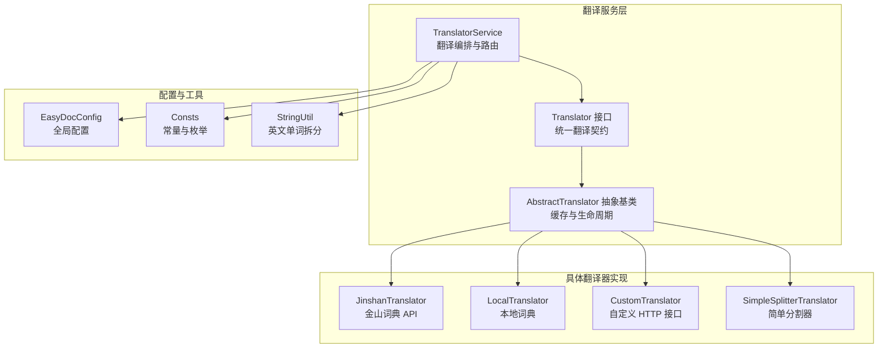
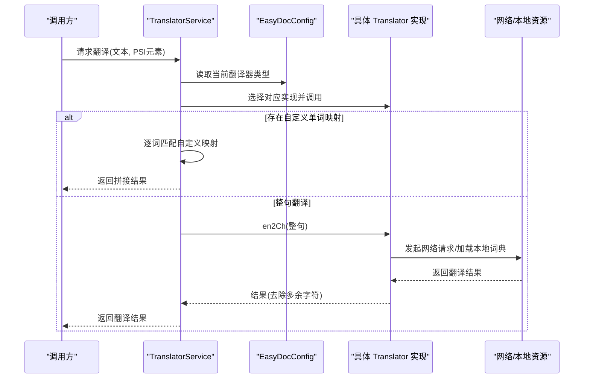
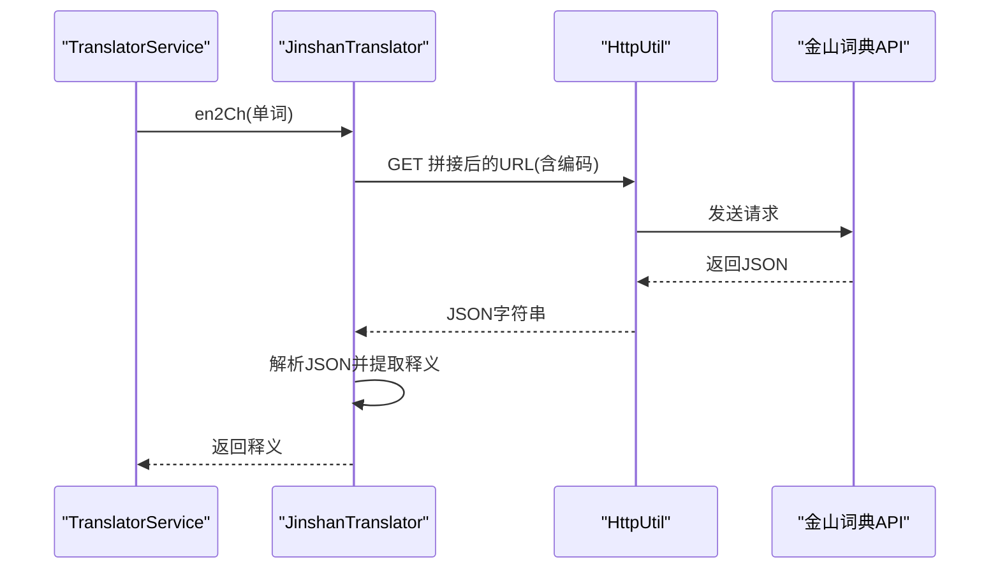
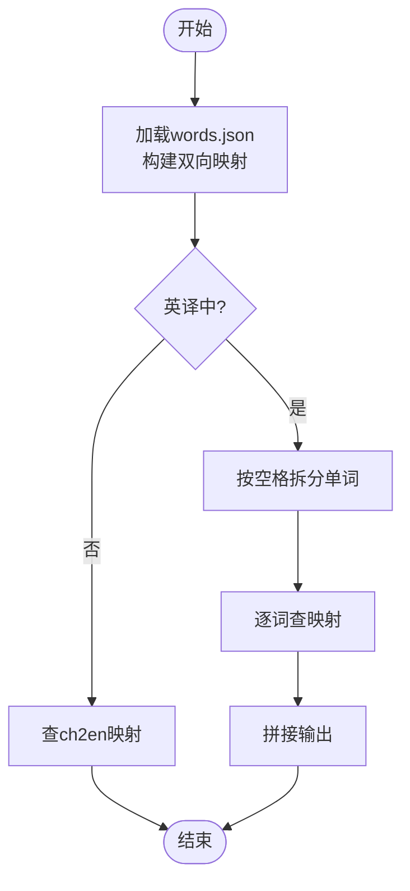
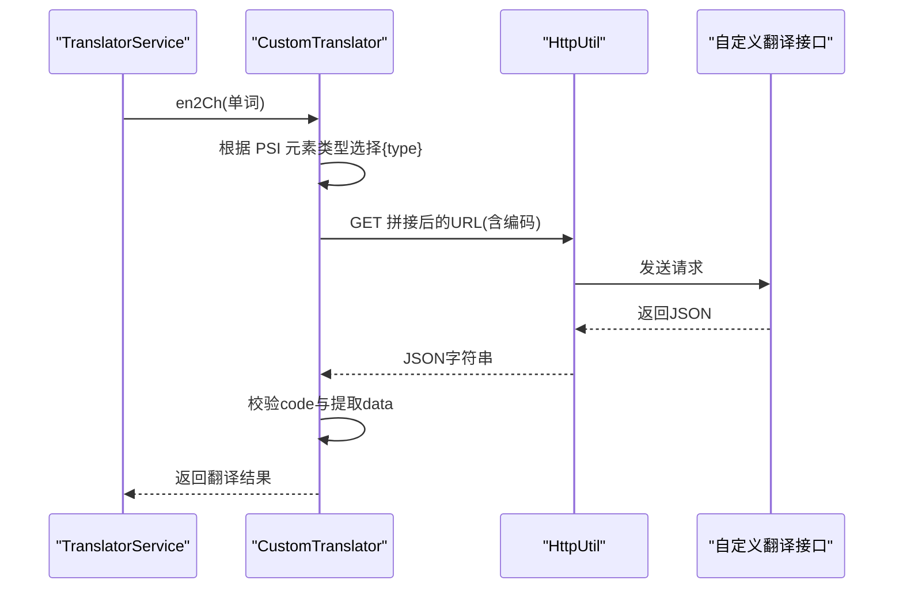
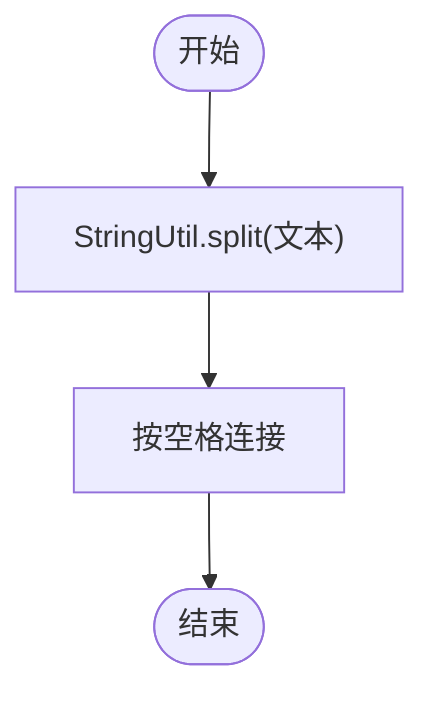
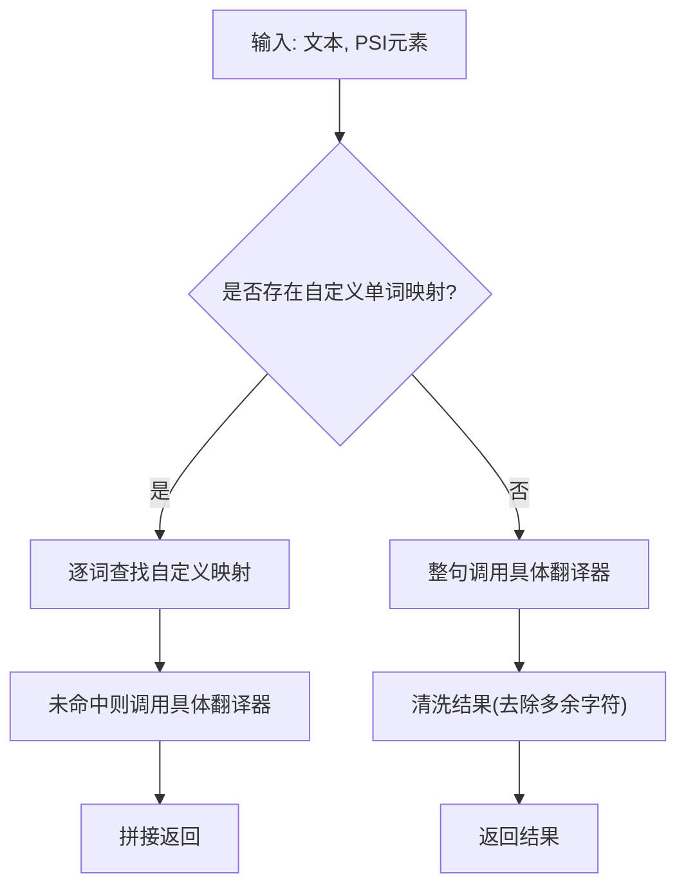
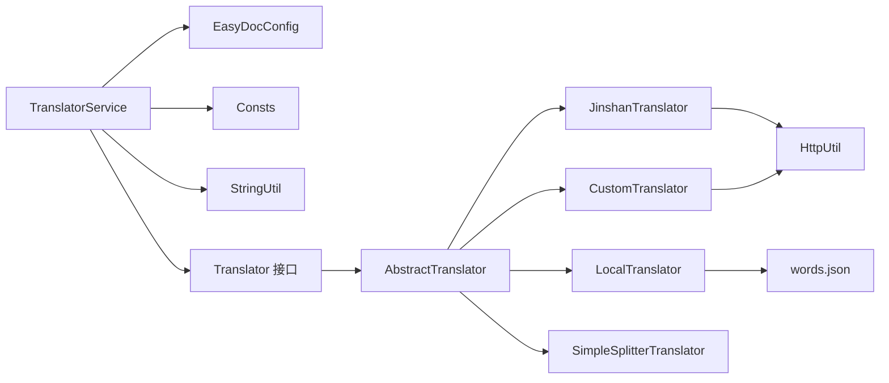

# 专用翻译器

<cite>
**本文引用的文件**
- [Translator.java](file://src/main/java/com/star/easydoc/service/translator/Translator.java)
- [TranslatorService.java](file://src/main/java/com/star/easydoc/service/translator/TranslatorService.java)
- [AbstractTranslator.java](file://src/main/java/com/star/easydoc/service/translator/impl/AbstractTranslator.java)
- [JinshanTranslator.java](file://src/main/java/com/star/easydoc/service/translator/impl/JinshanTranslator.java)
- [LocalTranslator.java](file://src/main/java/com/star/easydoc/service/translator/impl/LocalTranslator.java)
- [CustomTranslator.java](file://src/main/java/com/star/easydoc/service/translator/impl/CustomTranslator.java)
- [SimpleSplitterTranslator.java](file://src/main/java/com/star/easydoc/service/translator/impl/SimpleSplitterTranslator.java)
- [Consts.java](file://src/main/java/com/star/easydoc/common/Consts.java)
- [EasyDocConfig.java](file://src/main/java/com/star/easydoc/config/EasyDocConfig.java)
- [StringUtil.java](file://src/main/java/com/star/easydoc/common/util/StringUtil.java)
- [自定义接口说明.md](file://doc/自定义接口说明.md)
- [words.json](file://src/main/resources/words.json)
</cite>

## 目录
1. [简介](#简介)
2. [项目结构](#项目结构)
3. [核心组件](#核心组件)
4. [架构总览](#架构总览)
5. [组件详解](#组件详解)
6. [依赖关系分析](#依赖关系分析)
7. [性能考量](#性能考量)
8. [故障排查指南](#故障排查指南)
9. [结论](#结论)
10. [附录](#附录)

## 简介
本技术文档聚焦于“专用翻译器”模块，系统性阐述以下翻译能力：
- 金山词霸翻译：基于公开词典 API 的英译中能力
- 本地词典翻译：内置英文-中文双向映射词典，离线可用
- 自定义 URL 翻译：通过自定义 HTTP 接口对接企业内网翻译服务
- 简单分割器翻译：对英文标识进行单词级拆分，便于后续处理

文档将从架构、数据流、实现细节、配置方法到使用场景逐一展开，并提供可视化图示帮助理解。

## 项目结构
翻译器模块位于服务层，采用“接口 + 抽象基类 + 多实现”的分层设计，配合配置中心与工具类完成统一调度与缓存策略。

图表来源
- [TranslatorService.java:41-77](file://src/main/java/com/star/easydoc/service/translator/TranslatorService.java#L41-L77)
- [Translator.java:13-51](file://src/main/java/com/star/easydoc/service/translator/Translator.java#L13-L51)
- [AbstractTranslator.java:14-91](file://src/main/java/com/star/easydoc/service/translator/impl/AbstractTranslator.java#L14-L91)
- [JinshanTranslator.java:19](file://src/main/java/com/star/easydoc/service/translator/impl/JinshanTranslator.java#L19)
- [LocalTranslator.java:25](file://src/main/java/com/star/easydoc/service/translator/impl/LocalTranslator.java#L25)
- [CustomTranslator.java:20](file://src/main/java/com/star/easydoc/service/translator/impl/CustomTranslator.java#L20)
- [SimpleSplitterTranslator.java:13](file://src/main/java/com/star/easydoc/service/translator/impl/SimpleSplitterTranslator.java#L13)
- [EasyDocConfig.java:22](file://src/main/java/com/star/easydoc/config/EasyDocConfig.java#L22)
- [Consts.java:14](file://src/main/java/com/star/easydoc/common/Consts.java#L14)
- [StringUtil.java:13](file://src/main/java/com/star/easydoc/common/util/StringUtil.java#L13)

章节来源
- [TranslatorService.java:41-77](file://src/main/java/com/star/easydoc/service/translator/TranslatorService.java#L41-L77)
- [Consts.java:14-100](file://src/main/java/com/star/easydoc/common/Consts.java#L14-L100)

## 核心组件
- 翻译接口与抽象基类
  - Translator 定义统一的英译中、中译英、初始化、配置获取、缓存清理等契约
  - AbstractTranslator 提供并发安全的英译中/中译英缓存，屏蔽具体实现差异
- 翻译服务编排
  - TranslatorService 负责按配置选择具体翻译器，执行翻译流程，支持自定义单词优先策略
- 配置与常量
  - EasyDocConfig 提供翻译器类型、超时、自定义 URL、单词映射等配置项
  - Consts 定义所有可用翻译器名称常量与集合

章节来源
- [Translator.java:13-51](file://src/main/java/com/star/easydoc/service/translator/Translator.java#L13-L51)
- [AbstractTranslator.java:14-91](file://src/main/java/com/star/easydoc/service/translator/impl/AbstractTranslator.java#L14-L91)
- [TranslatorService.java:41-238](file://src/main/java/com/star/easydoc/service/translator/TranslatorService.java#L41-L238)
- [EasyDocConfig.java:22-680](file://src/main/java/com/star/easydoc/config/EasyDocConfig.java#L22-L680)
- [Consts.java:14-100](file://src/main/java/com/star/easydoc/common/Consts.java#L14-L100)

## 架构总览
翻译器整体采用“策略 + 缓存 + 配置驱动”的架构：
- 策略：通过 TranslatorService 按配置选择具体实现
- 缓存：AbstractTranslator 内置并发安全缓存，避免重复网络调用
- 配置：EasyDocConfig 提供翻译器类型、超时、自定义 URL、单词映射等

图表来源
- [TranslatorService.java:85-111](file://src/main/java/com/star/easydoc/service/translator/TranslatorService.java#L85-L111)
- [TranslatorService.java:222-232](file://src/main/java/com/star/easydoc/service/translator/TranslatorService.java#L222-L232)
- [AbstractTranslator.java:22-52](file://src/main/java/com/star/easydoc/service/translator/impl/AbstractTranslator.java#L22-L52)

## 组件详解

### 金山词霸翻译（JinshanTranslator）
- 功能定位
  - 基于公开词典 API 的英译中能力，适合快速查询单词释义
- 工作原理
  - 通过 HTTP GET 请求访问词典 API，解析 JSON 响应，提取首个释义
  - 中译英暂未实现
- 性能与错误处理
  - 使用超时配置；异常时返回空字符串，避免阻塞
- 适用场景
  - 快速查阅单词含义，无需额外鉴权

图表来源
- [JinshanTranslator.java:23-32](file://src/main/java/com/star/easydoc/service/translator/impl/JinshanTranslator.java#L23-L32)
- [JinshanTranslator.java:21](file://src/main/java/com/star/easydoc/service/translator/impl/JinshanTranslator.java#L21)

章节来源
- [JinshanTranslator.java:19-253](file://src/main/java/com/star/easydoc/service/translator/impl/JinshanTranslator.java#L19-L253)

### 本地词典翻译（LocalTranslator）
- 功能定位
  - 内置英文-中文双向词典，离线可用，适合无网络或隐私敏感场景
- 数据结构与加载
  - 词典存储在资源文件 words.json，键为英文单词，值为中文释义
  - 启动时一次性加载至内存，构建 en2ch 与 ch2en 双向映射
- 翻译逻辑
  - 英译中：按空格拆分单词，逐词查找映射，拼接输出
  - 中译英：直接查映射，未命中返回原文
- 维护建议
  - 词典更新：替换 words.json 并重启插件生效
  - 词典规模：当前包含约 73900 条词条，建议定期裁剪冗余条目

图表来源
- [LocalTranslator.java:40-45](file://src/main/java/com/star/easydoc/service/translator/impl/LocalTranslator.java#L40-L45)
- [LocalTranslator.java:47-69](file://src/main/java/com/star/easydoc/service/translator/impl/LocalTranslator.java#L47-L69)
- [words.json:1-800](file://src/main/resources/words.json#L1-L800)

章节来源
- [LocalTranslator.java:25-71](file://src/main/java/com/star/easydoc/service/translator/impl/LocalTranslator.java#L25-L71)
- [words.json:1-800](file://src/main/resources/words.json#L1-L800)

### 自定义 URL 翻译（CustomTranslator）
- 功能定位
  - 通过自定义 HTTP 接口对接企业内网翻译服务，满足私有化部署需求
- 配置与占位符
  - 在设置中选择“自定义HTTP接口”，填写自定义 URL
  - 支持占位符：{query}、{from}、{to}、{type}
- 请求与响应
  - 请求方式：GET
  - 响应格式：JSON，需包含 code（0 表示成功）、data（翻译结果）
- 错误处理
  - code 非 0 或异常时记录错误日志，返回空字符串

图表来源
- [CustomTranslator.java:34-58](file://src/main/java/com/star/easydoc/service/translator/impl/CustomTranslator.java#L34-L58)
- [自定义接口说明.md:1-38](file://doc/自定义接口说明.md#L1-L38)

章节来源
- [CustomTranslator.java:20-61](file://src/main/java/com/star/easydoc/service/translator/impl/CustomTranslator.java#L20-L61)
- [自定义接口说明.md:1-38](file://doc/自定义接口说明.md#L1-L38)
- [EasyDocConfig.java:672-678](file://src/main/java/com/star/easydoc/config/EasyDocConfig.java#L672-L678)

### 简单分割器翻译（SimpleSplitterTranslator）
- 功能定位
  - 对英文标识进行单词级拆分，便于后续处理或人工校对
- 实现机制
  - 借助 StringUtil 的英文单词拆分算法，将驼峰/帕斯卡命名等拆分为单词列表
  - 英译中/中译英均返回按空格连接的拆分结果
- 适用场景
  - 需要保留原命名风格但进行语义拆分的场景，如生成注释前的预处理

图表来源
- [SimpleSplitterTranslator.java:15-23](file://src/main/java/com/star/easydoc/service/translator/impl/SimpleSplitterTranslator.java#L15-L23)
- [StringUtil.java:40-45](file://src/main/java/com/star/easydoc/common/util/StringUtil.java#L40-L45)

章节来源
- [SimpleSplitterTranslator.java:13-26](file://src/main/java/com/star/easydoc/service/translator/impl/SimpleSplitterTranslator.java#L13-L26)
- [StringUtil.java:13-72](file://src/main/java/com/star/easydoc/common/util/StringUtil.java#L13-L72)

### 翻译服务编排（TranslatorService）
- 选择策略
  - 根据 EasyDocConfig.getTranslator() 选择具体实现
- 自定义单词优先
  - 若源文本包含自定义单词映射，则逐词翻译并拼接
  - 否则整句翻译，提升准确性
- 中译英处理
  - 将中文按空格拆分，过滤停用词，首字母大写其余小写，生成驼峰式标识

图表来源
- [TranslatorService.java:85-111](file://src/main/java/com/star/easydoc/service/translator/TranslatorService.java#L85-L111)
- [TranslatorService.java:213-232](file://src/main/java/com/star/easydoc/service/translator/TranslatorService.java#L213-L232)

章节来源
- [TranslatorService.java:41-238](file://src/main/java/com/star/easydoc/service/translator/TranslatorService.java#L41-L238)

## 依赖关系分析
- 组件耦合
  - TranslatorService 依赖 EasyDocConfig、Consts、StringUtil 等
  - 具体翻译器实现依赖 AbstractTranslator，共享缓存与生命周期
- 外部依赖
  - 网络请求：HttpUtil（金山词典、自定义接口）
  - JSON 解析：FastJSON2（金山词典、自定义接口）
  - 资源读取：ResourceUtil（本地词典）

图表来源
- [TranslatorService.java:21-35](file://src/main/java/com/star/easydoc/service/translator/TranslatorService.java#L21-L35)
- [JinshanTranslator.java:6-11](file://src/main/java/com/star/easydoc/service/translator/impl/JinshanTranslator.java#L6-L11)
- [CustomTranslator.java:3-12](file://src/main/java/com/star/easydoc/service/translator/impl/CustomTranslator.java#L3-L12)
- [LocalTranslator.java:9-17](file://src/main/java/com/star/easydoc/service/translator/impl/LocalTranslator.java#L9-L17)

章节来源
- [TranslatorService.java:21-35](file://src/main/java/com/star/easydoc/service/translator/TranslatorService.java#L21-L35)
- [JinshanTranslator.java:6-11](file://src/main/java/com/star/easydoc/service/translator/impl/JinshanTranslator.java#L6-L11)
- [CustomTranslator.java:3-12](file://src/main/java/com/star/easydoc/service/translator/impl/CustomTranslator.java#L3-L12)
- [LocalTranslator.java:9-17](file://src/main/java/com/star/easydoc/service/translator/impl/LocalTranslator.java#L9-L17)

## 性能考量
- 缓存策略
  - AbstractTranslator 内置并发安全缓存，避免重复网络请求与解析
- 超时控制
  - 通过 EasyDocConfig.timeout 控制网络请求超时，防止阻塞
- 自定义单词映射
  - 逐词翻译路径在存在大量自定义映射时可能增加调用次数，建议合理规划映射规模
- 本地词典
  - words.json 一次性加载至内存，启动时占用一定内存，但后续查询为 O(1)

章节来源
- [AbstractTranslator.java:16-72](file://src/main/java/com/star/easydoc/service/translator/impl/AbstractTranslator.java#L16-L72)
- [EasyDocConfig.java:664-670](file://src/main/java/com/star/easydoc/config/EasyDocConfig.java#L664-L670)
- [LocalTranslator.java:47-69](file://src/main/java/com/star/easydoc/service/translator/impl/LocalTranslator.java#L47-L69)

## 故障排查指南
- 自定义接口无法返回翻译结果
  - 检查返回 JSON 的 code 是否为 0
  - 确认 URL 占位符替换正确（{query}/{from}/{to}/{type}）
  - 查看日志输出，确认网络请求是否抛出异常
- 金山词典接口失败
  - 检查超时配置与网络连通性
  - 观察异常分支是否触发，返回空字符串
- 本地词典未生效
  - 确认 words.json 文件存在且可读
  - 重启插件以重新加载词典
- 中译英结果不符合预期
  - 检查停用词过滤与大小写处理逻辑
  - 确认输入文本已按空格拆分

章节来源
- [CustomTranslator.java:46-57](file://src/main/java/com/star/easydoc/service/translator/impl/CustomTranslator.java#L46-L57)
- [JinshanTranslator.java:25-31](file://src/main/java/com/star/easydoc/service/translator/impl/JinshanTranslator.java#L25-L31)
- [LocalTranslator.java:65-67](file://src/main/java/com/star/easydoc/service/translator/impl/LocalTranslator.java#L65-L67)
- [TranslatorService.java:171-205](file://src/main/java/com/star/easydoc/service/translator/TranslatorService.java#L171-L205)

## 结论
专用翻译器模块通过统一接口与抽象基类实现了多种翻译策略的可插拔扩展，结合配置中心与缓存机制，在保证性能的同时兼顾灵活性与可维护性。针对不同场景（在线 API、本地词典、私有接口、命名拆分），开发者可根据需要选择合适的翻译器组合，以满足多样化的注释生成与术语处理需求。

## 附录

### 使用场景与配置示例
- 金山词霸翻译
  - 适用：快速查询单词释义，无需鉴权
  - 配置：在设置中选择“金山翻译”
- 本地词典翻译
  - 适用：离线、隐私敏感、稳定性能
  - 配置：选择“本地词典”，确保 words.json 正常加载
- 自定义 URL 翻译
  - 适用：企业内网翻译服务、私有 API
  - 配置：选择“自定义HTTP接口”，填写占位符 URL
  - 参考文档：[自定义接口说明.md:1-38](file://doc/自定义接口说明.md#L1-L38)
- 简单分割器翻译
  - 适用：保留命名风格、进行语义拆分
  - 配置：选择“仅单词分割”

章节来源
- [Consts.java:42-98](file://src/main/java/com/star/easydoc/common/Consts.java#L42-L98)
- [自定义接口说明.md:1-38](file://doc/自定义接口说明.md#L1-L38)